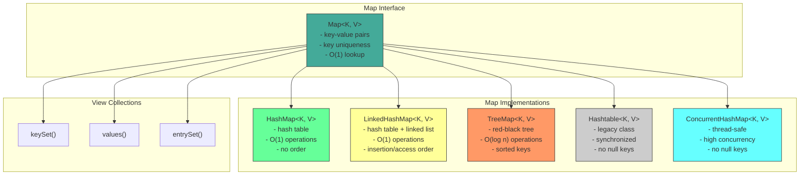
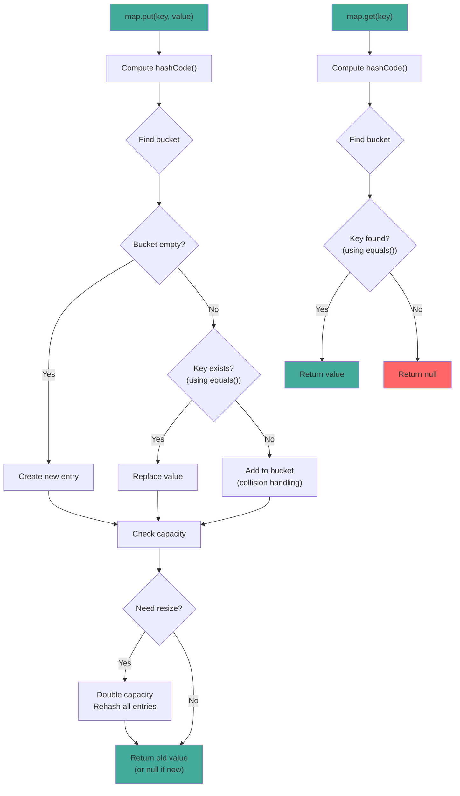

# Map Interface

## 1. Introduction

Map stores key-value pairs, providing efficient lookup by key. It's separate from the Collection interface and models the mathematical function abstraction. Each key maps to at most one value, and you can use a key to efficiently retrieve its associated value.

Map is one of the most frequently used data structures in Java. It's used for caching, counting, configuration storage, database results, and countless other scenarios where you need to associate values with keys.

There are several Map implementations: `HashMap` (fastest, no order), `LinkedHashMap` (insertion/access order), `TreeMap` (sorted keys), `Hashtable` (legacy, synchronized), and `ConcurrentHashMap` (thread-safe). Each has different performance characteristics and ordering guarantees.

## 2. Learning Objectives

- Understand the Map interface and its properties
- Learn key-value pair operations
- Understand Map implementations (HashMap, LinkedHashMap, TreeMap)
- Know when to use Map vs other collections
- Master Map operations (put, get, containsKey, etc.)
- Understand equals() and hashCode() contract for keys
- Recognize Map's thread-safety considerations
- Apply Maps in real-world scenarios

## 3. Prerequisites

- Introduction to Collections Framework
- equals() and hashCode() methods
- Set interface (for understanding key uniqueness)
- Basic object comparison concepts

## 4. Why This Concept Exists

Many real-world scenarios require key-value associations:
- Database results (row → record)
- Configuration properties (key → value)
- Caching (request → response)
- Counting (word → frequency)
- Indexing (ID → object)

Without Map, you would need to:
1. Use two parallel Lists (keys and values)
2. Manually keep them in sync
3. Write O(n) search code for every lookup

Map provides O(1) lookup by key with automatic key uniqueness.

## 5. Problem Statement

Consider building a word frequency counter:
- Count occurrences of each word
- Quickly look up count for any word
- Handle duplicate words automatically

Using Lists would be inefficient:
```java
List<String> words = new ArrayList<>();
List<Integer> counts = new ArrayList<>();
// Manual search: O(n) for each word
```

Map provides O(1) lookup:
```java
Map<String, Integer> wordCount = new HashMap<>();
wordCount.merge(word, 1, Integer::sum);  // O(1) operation
```

## 6. Theory

### Map Contract

The Map interface defines these guarantees:
1. **Key uniqueness**: Each key maps to at most one value
2. **Key equality**: Based on equals() and hashCode()
3. **Null keys**: Most implementations allow one null key
4. **Null values**: Most implementations allow multiple null values

### hashCode() and equals() Contract

For Map to work correctly, keys must properly implement:
- `hashCode()`: Returns consistent hash value for equal objects
- `equals()`: Defines equality between objects

```java
// Correct implementation for Map key
@Override
public boolean equals(Object o) {
    if (this == o) return true;
    if (o == null || getClass() != o.getClass()) return false;
    Person person = (Person) o;
    return age == person.age && Objects.equals(name, person.name);
}

@Override
public int hashCode() {
    return Objects.hash(name, age);
}
```

### Map Implementations

| Implementation | Underlying Structure | Order | Null Keys | Thread-Safe |
|----------------|---------------------|-------|-----------|-------------|
| HashMap | Hash table | None | Yes (1) | No |
| LinkedHashMap | Hash table + linked list | Insertion/Access | Yes (1) | No |
| TreeMap | Red-black tree | Sorted | No | No |
| Hashtable | Hash table | None | No | Yes |
| ConcurrentHashMap | Hash table | None | No | Yes |

## 7. Internal Working

### HashMap Internally

HashMap maintains:
- `Node[] table`: The backing array of buckets
- `int size`: Number of entries
- `int threshold`: When to resize (capacity * loadFactor)
- `float loadFactor`: When to resize (default 0.75)

### Hashing Mechanism

When putting a key-value pair:
1. Compute hashCode() of the key
2. Find bucket: `hash & (capacity - 1)`
3. If bucket empty, create new entry
4. If bucket has entries, search for equal key using equals()
5. If found, replace value; if not, add new entry

### Collision Handling

When two keys have the same hashCode():
1. Both go to the same bucket
2. Stored as a linked list (or tree in Java 8+ for long chains)
3. Equality checked using equals()

### Resizing

When size exceeds threshold:
1. New capacity = oldCapacity * 2
2. All entries are rehashed to new buckets
3. O(n) operation (but amortized O(1))

## 8. JVM Perspective

### Memory Allocation

```java
Map<String, Integer> map = new HashMap<>();
// JVM allocates:
// - HashMap object header: 12 bytes (mark word + klass pointer)
// - Node[] table reference: 8 bytes
// - size field: 4 bytes
// - loadFactor field: 4 bytes
// - threshold field: 4 bytes
// - modCount field: 4 bytes
// Total HashMap object: ~40 bytes

// Each entry (Node):
// - Object header: 12 bytes
// - hash field: 4 bytes
// - key reference: 8 bytes
// - value reference: 8 bytes
// - next reference: 8 bytes
// Total Node object: ~40 bytes
```

### JIT Optimization

The JIT compiler optimizes HashMap operations:
- **Inlining**: get/put/remove are inlined
- **Hash distribution**: Good hashCode() distributes entries evenly
- **Escape analysis**: Small HashMaps may be scalar-replaced

### Garbage Collection

- Removed entries set to `null` to help GC
- Weak references can be used for caching
- Large HashMaps may be stored in Old Gen

## 9. Memory Representation

```
Map<String, Integer> map = new HashMap<>();
map.put("Alice", 30);
map.put("Bob", 25);
map.put("Charlie", 35);

Memory layout:
┌───────────────────────────────┐
│ HashMap object                │
├───────────────────────────────┤
│ Object header (12 bytes)      │
│ table ─────────────────────────────┐
│ size = 3 (4 bytes)            │      │
│ threshold (4 bytes)           │      │
│ loadFactor (4 bytes)          │      │
│ (padding 0 bytes)             │      │
└───────────────────────────────┘      │
                                       ▼
                               Node[] table (capacity=16)
                               ┌──────────────────┐
                               │ [0] → null       │
                               │ [1] → null       │
                               │ [2] → null       │
                               │ [3] → null       │
                               │ [4] → null       │
                               │ [5] → "Bob"      │ ← hash("Bob") % 16
                               │ [6] → null       │
                               │ [7] → "Alice"    │ ← hash("Alice") % 16
                               │ [8] → "Charlie"  │ ← hash("Charlie") % 16
                               │ [9-15] → null    │
                               └──────────────────┘

Each Node:
┌─────────────────────────────┐
│ Object header (12 bytes)    │
│ hash (int, 4 bytes)         │
│ key → "Alice" (8 bytes)     │
│ value → 30 (Integer obj)    │
│ next → null (8 bytes)       │
└─────────────────────────────┘
```

## 10. Architecture Diagram



## 11. Flow Diagram



## 12. Syntax

```java
import java.util.Map;
import java.util.HashMap;
import java.util.LinkedHashMap;
import java.util.TreeMap;

// ============================================
// CREATION
// ============================================
Map<String, Integer> map = new HashMap<>();
Map<String, Integer> map = new HashMap<>(100);  // Initial capacity
Map<String, Integer> map = new HashMap<>(Map.of("A", 1, "B", 2));

// ============================================
// ADDING/UPDATING ENTRIES
// ============================================
map.put("key", 1);                    // Add/replace, returns old value
map.putIfAbsent("key", 1);           // Add only if absent
map.putAll(otherMap);                 // Add all entries
map.compute("key", (k, v) -> v + 1); // Compute new value
map.merge("key", 1, Integer::sum);   // Merge values

// ============================================
// ACCESSING VALUES
// ============================================
Integer value = map.get("key");              // Returns null if absent
Integer value = map.getOrDefault("key", 0);  // Returns default if absent
Integer removed = map.remove("key");         // Remove and return
boolean removed = map.remove("key", 1);      // Remove if matches value

// ============================================
// CHECKING
// ============================================
boolean hasKey = map.containsKey("key");
boolean hasValue = map.containsValue(1);
int size = map.size();
boolean isEmpty = map.isEmpty();

// ============================================
// VIEW COLLECTIONS
// ============================================
Set<String> keys = map.keySet();           // Set of keys
Collection<Integer> values = map.values(); // Collection of values
Set<Map.Entry<String, Integer>> entries = map.entrySet(); // Set of entries

// ============================================
// ITERATION
// ============================================
// Iterate over entries
for (Map.Entry<String, Integer> entry : map.entrySet()) {
    System.out.println(entry.getKey() + ": " + entry.getValue());
}

// Iterate over keys
for (String key : map.keySet()) {
    System.out.println(key + ": " + map.get(key));
}

// forEach with lambda
map.forEach((key, value) -> System.out.println(key + ": " + value));

// ============================================
// CLEAR
// ============================================
map.clear();
```

## 13. Easy Example

```java
import java.util.Map;
import java.util.HashMap;

public class MapBasics {
    public static void main(String[] args) {
        // Create and populate
        Map<String, Integer> ages = new HashMap<>();
        ages.put("Alice", 30);
        ages.put("Bob", 25);
        ages.put("Charlie", 35);
        ages.put("Alice", 31);  // Replaces old value

        System.out.println("Map: " + ages);
        System.out.println("Size: " + ages.size());

        // Access values
        System.out.println("Alice's age: " + ages.get("Alice"));
        System.out.println("Bob's age: " + ages.get("Bob"));
        System.out.println("Unknown: " + ages.getOrDefault("Unknown", 0));

        // Check keys and values
        System.out.println("Contains Alice: " + ages.containsKey("Alice"));
        System.out.println("Contains age 25: " + ages.containsValue(25));

        // Remove entry
        ages.remove("Charlie");
        System.out.println("After removal: " + ages);

        // Add more entries
        ages.putIfAbsent("Diana", 28);
        ages.putIfAbsent("Alice", 40);  // Won't replace
        System.out.println("After adding: " + ages);

        // Iterate
        System.out.println("Iterating:");
        for (Map.Entry<String, Integer> entry : ages.entrySet()) {

## 📑 Continue Reading

**Part 1** of 3 | [Part 2](README-part2.md) | [Part 3](README-part3.md)

```
