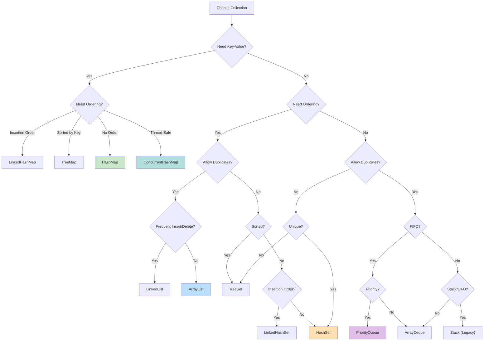

# Module 04: Collections Framework — Part 2: Syntax & Examples

**[← Part 1: Theory & Concepts](README.md)**

---

## Syntax

### List Operations
```java
// ArrayList
List<String> list = new ArrayList<>();
list.add("A");
list.add(0, "B");
list.get(0);
list.remove("A");
list.size();

// LinkedList
List<String> linked = new LinkedList<>();
linked.addFirst("A");
linked.addLast("B");
linked.removeFirst();
```

### Set Operations
```java
// HashSet
Set<String> set = new HashSet<>();
set.add("A");
set.contains("A");
set.remove("A");

// TreeSet (sorted)
TreeSet<Integer> sorted = new TreeSet<>();
sorted.add(3);
sorted.add(1);
sorted.add(2);
// sorted: [1, 2, 3]
```

### Map Operations
```java
// HashMap
Map<String, Integer> map = new HashMap<>();
map.put("key", 1);
map.get("key");
map.containsKey("key");
map.remove("key");
map.getOrDefault("missing", 0);

// TreeMap (sorted)
TreeMap<String, Integer> sorted = new TreeMap<>();
sorted.put("banana", 2);
sorted.put("apple", 1);
// sorted by key
```

## Easy Example
```java
import java.util.*;

public class CollectionsEasyExample {
    public static void main(String[] args) {
        // List
        List<String> names = new ArrayList<>();
        names.add("Alice");
        names.add("Bob");
        names.add("Charlie");
        System.out.println("Names: " + names);
        
        // Set
        Set<Integer> numbers = new HashSet<>();
        numbers.add(1);
        numbers.add(2);
        numbers.add(3);
        numbers.add(2); // Duplicate ignored
        System.out.println("Numbers: " + numbers);
        
        // Map
        Map<String, Integer> ages = new HashMap<>();
        ages.put("Alice", 25);
        ages.put("Bob", 30);
        System.out.println("Ages: " + ages);
    }
}
```

## Medium Example
```java
import java.util.*;
import java.util.stream.*;

public class CollectionsMediumExample {
    public static void main(String[] args) {
        List<String> names = Arrays.asList("Charlie", "Alice", "Bob");
        
        // Sort
        Collections.sort(names);
        System.out.println("Sorted: " + names);
        
        // Stream operations
        List<String> longNames = names.stream()
            .filter(name -> name.length() > 3)
            .map(String::toUpperCase)
            .collect(Collectors.toList());
        System.out.println("Long names: " + longNames);
        
        // Grouping
        Map<Integer, List<String>> byLength = names.stream()
            .collect(Collectors.groupingBy(String::length));
        System.out.println("By length: " + byLength);
    }
}
```

## Hard Example
```java
import java.util.*;
import java.util.stream.*;

public class CollectionsHardExample {
    public static void main(String[] args) {
        List<Employee> employees = List.of(
            new Employee("Alice", "Engineering", 95000),
            new Employee("Bob", "Engineering", 85000),
            new Employee("Charlie", "Marketing", 75000),
            new Employee("Diana", "Marketing", 80000),
            new Employee("Eve", "HR", 70000)
        );
        
        // Group by department, find average salary
        Map<String, Double> avgSalaryByDept = employees.stream()
            .collect(Collectors.groupingBy(
                Employee::getDepartment,
                Collectors.averagingDouble(Employee::getSalary)
            ));
        System.out.println("Avg salary: " + avgSalaryByDept);
        
        // Partition by salary threshold
        Map<Boolean, List<Employee>> partitioned = employees.stream()
            .collect(Collectors.partitioningBy(e -> e.getSalary() > 80000));
        System.out.println("High earners: " + partitioned.get(true));
    }
}

record Employee(String name, String department, double salary) {}
```

## Enterprise Example
```java
import java.util.*;
import java.util.concurrent.*;
import java.util.stream.*;

public class CollectionsEnterpriseExample {
    // Thread-safe cache
    private final ConcurrentHashMap<String, Object> cache = 
        new ConcurrentHashMap<>();
    
    public Object getOrCompute(String key, Supplier<Object> compute) {
        return cache.computeIfAbsent(key, k -> compute.get());
    }
    
    // Priority queue for task scheduling
    public static class TaskScheduler {
        private final PriorityQueue<Task> queue = new PriorityQueue<>(
            Comparator.comparingInt(Task::getPriority)
        );
        
        public void schedule(Task task) {
            queue.offer(task);
        }
        
        public Task next() {
            return queue.poll();
        }
    }
    
    public static void main(String[] args) {
        TaskScheduler scheduler = new TaskScheduler();
        scheduler.schedule(new Task("High", 1));
        scheduler.schedule(new Task("Low", 3));
        scheduler.schedule(new Task("Medium", 2));
        
        System.out.println(scheduler.next().getName()); // High
        System.out.println(scheduler.next().getName()); // Medium
    }
}
```

## Performance Considerations
- ArrayList for random access
- LinkedList for frequent insertions
- HashSet for fast lookup
- HashMap for key-value pairs
- TreeMap for sorted keys
- Use parallel streams for large datasets
- Avoid recursion for deep structures (use iterative approach)

## Time & Space Complexity

| Operation | ArrayList | LinkedList | HashSet | HashMap |
|-----------|-----------|------------|---------|---------|
| get(index) | O(1) | O(n) | N/A | N/A |
| add | O(1)* | O(1) | O(1) | O(1) |
| remove | O(n) | O(1) | O(1) | O(1) |
| contains | O(n) | O(n) | O(1) | O(1) |

## Thread Safety
- Collections.synchronizedList()
- CopyOnWriteArrayList
- ConcurrentHashMap
- Collections.unmodifiableList()

## Best Practices
1. Use interfaces for declarations
2. Choose appropriate implementation
3. Use generics for type safety
4. Prefer immutable collections
5. Use streams for complex operations
6. Avoid parallel streams for small datasets
7. Use method references when possible
8. Prefer Iterator.remove() for safe removal

## Common Mistakes
1. ConcurrentModificationException
2. Using wrong collection type
3. Not handling null values
4. Forgetting to check contains()
5. Using parallel streams on small datasets
6. Not considering thread safety

## Collection Selection Guide



---

## Comparison Table

| Collection | Use Case | Performance |
|------------|----------|-------------|
| ArrayList | Random access | Fast read |
| LinkedList | Frequent insert | Fast insert |
| HashSet | Unique elements | Fast lookup |
| TreeSet | Sorted elements | Sorted |
| HashMap | Key-value | Fast lookup |
| TreeMap | Sorted map | Sorted |

## Interview Questions

### Q1: What is the difference between ArrayList and LinkedList?
**Answer:** ArrayList uses array, LinkedList uses nodes. ArrayList better for reads, LinkedList for inserts.

### Q2: What is the difference between HashMap and TreeMap?
**Answer:** HashMap is unordered O(1), TreeMap is sorted O(log n).

### Q3: What is the difference between HashSet and TreeSet?
**Answer:** HashSet is unordered O(1), TreeSet is sorted O(log n).

### Q4: How do you make a collection thread-safe?
**Answer:** Use Collections.synchronizedList() or ConcurrentHashMap.

### Q5: What is ConcurrentModificationException?
**Answer:** Thrown when collection is modified during iteration.

### Q6: What is the difference between Iterator and ListIterator?
**Answer:** Iterator for single direction, ListIterator for bidirectional.

### Q7: What is the difference between Queue and Deque?
**Answer:** Queue is FIFO, Deque is double-ended.

### Q8: What is the difference between HashMap and Hashtable?
**Answer:** Hashtable is synchronized, HashMap is not.

### Q9: What is the initial capacity of ArrayList?
**Answer:** 10.

### Q10: What is load factor in HashMap?
**Answer:** Threshold for resizing (default 0.75).

### Q11: What is the difference between List and Set?
**Answer:** List allows duplicates, Set does not.

### Q12: What is Collections.unmodifiableList()?
**Answer:** Returns read-only view of list.

### Q13: What is the difference between List.of() and ArrayList?
**Answer:** List.of() is immutable, ArrayList is mutable.

### Q14: What is the difference between remove() and removeAll()?
**Answer:** remove() removes single element, removeAll removes all matching.

### Q15: What is the difference between contains() and indexOf()?
**Answer:** contains() returns boolean, indexOf() returns position.

## Exercises

### Easy
1. Create a list and sort it
2. Use a map to count word frequency
3. Remove duplicates from a list

### Medium
1. Implement a custom comparator
2. Use a priority queue for scheduling
3. Merge two maps

### Hard
1. Implement LRU cache
2. Create a concurrent data structure
3. Design a routing table

## Summary
Collections are fundamental to Java development. Choose the right collection for your use case. Master iteration methods and Stream API for efficient data processing.

## References
- Oracle Java Documentation: Collections
- Effective Java: Item 28