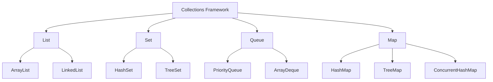
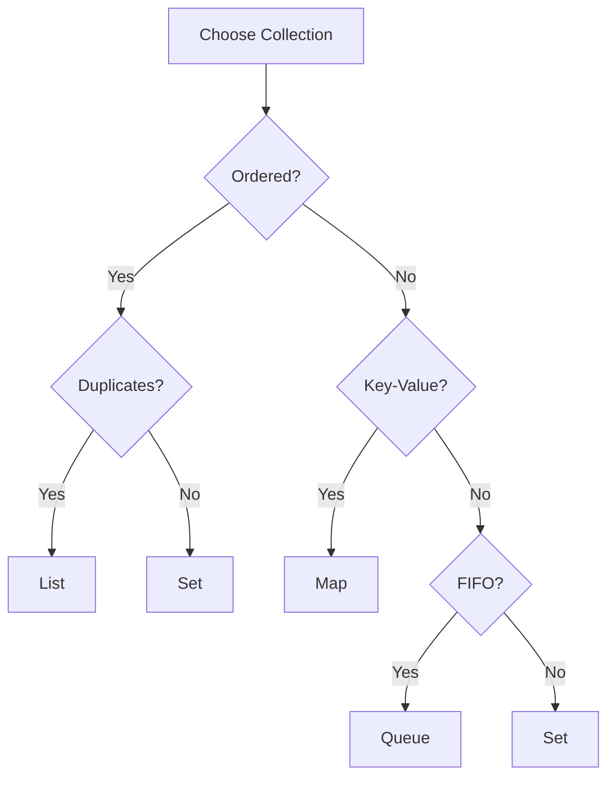

# Module 04: Collections Framework

## Overview
The Java Collections Framework provides interfaces, implementations, and algorithms for working with collections of objects. It includes List, Set, Queue, and Map interfaces with various implementations.

## Learning Objectives
- Master Collection interfaces
- Understand implementation differences
- Use appropriate collections
- Apply algorithms and utilities
- Handle thread-safe collections
- Master all iteration methods
- Use Lambda expressions and Stream API

## Prerequisites
- OOP concepts
- Generics basics
- Exception handling

## Why This Concept Exists
Arrays are limited:
- Fixed size
- No built-in methods
- Type-unsafe (before generics)
- Poor performance for insertions

Collections provide:
- Dynamic sizing
- Rich APIs
- Type safety
- Performance optimization

## Problem Statement
How do you store, retrieve, and manipulate groups of objects efficiently?

## Theory

### Collection Hierarchy

```
Collection
├─ List (ordered, duplicates)
│  ├─ ArrayList
│  ├─ LinkedList
│  └─ Vector
├─ Set (no duplicates)
│  ├─ HashSet
│  ├─ LinkedHashSet
│  └─ TreeSet
└─ Queue (FIFO)
   ├─ PriorityQueue
   ├─ ArrayDeque
   └─ LinkedList

Map (key-value)
├─ HashMap
├─ LinkedHashMap
├─ TreeMap
├─ Hashtable
└─ ConcurrentHashMap
```

### Implementation Comparison

| Collection | Access | Insert | Delete | Thread-Safe |
|------------|--------|--------|--------|-------------|
| ArrayList | O(1) | O(n) | O(n) | No |
| LinkedList | O(n) | O(1) | O(1) | No |
| HashSet | O(1) | O(1) | O(1) | No |
| TreeSet | O(log n) | O(log n) | O(log n) | No |
| HashMap | O(1) | O(1) | O(1) | No |
| TreeMap | O(log n) | O(log n) | O(log n) | No |

## Iteration Methods

### Comparison Table

| Method | Index Access | Can Break | Can Modify | Best For |
|--------|-------------|-----------|------------|----------|
| Traditional for | Yes | break/continue | Yes (set, add, remove) | Index-based operations |
| Enhanced for-each | No | break/continue | No | Simple iteration |
| forEach lambda | No | No | No | Functional style |
| Method reference | No | No | No | Calling single method |
| Iterator | No | Iterator.remove() | Yes (remove, add, set) | Safe removal during iteration |
| Stream forEach | No | findFirst/limit | No | Chained transformations |
| Recursion | N/A | Return | Yes | Tree/graph traversal |

### Traditional For Loop
```java
List<String> names = List.of("Alice", "Bob", "Charlie");

// Index-based access
for (int i = 0; i < names.size(); i++) {
    System.out.println(i + ": " + names.get(i));
}

// Reverse iteration
for (int i = names.size() - 1; i >= 0; i--) {
    System.out.println(names.get(i));
}
```

### Enhanced For-Each Loop
```java
List<String> names = List.of("Alice", "Bob", "Charlie");

for (String name : names) {
    System.out.println(name);
}
```

### forEach with Lambda
```java
List<String> names = List.of("Alice", "Bob", "Charlie");

names.forEach(name -> System.out.println(name));

// Multi-line body
names.forEach(name -> {
    String upper = name.toUpperCase();
    System.out.println(upper);
});
```

### forEach with Method Reference
```java
List<String> names = List.of("Alice", "Bob", "Charlie");

names.forEach(System.out::println);
```

### Iterator Pattern
```java
List<String> names = new ArrayList<>(List.of("Alice", "Bob", "Charlie"));

// Forward iteration
Iterator<String> it = names.iterator();
while (it.hasNext()) {
    System.out.println(it.next());
}

// Safe removal
Iterator<String> removeIt = names.iterator();
while (removeIt.hasNext()) {
    if (removeIt.next().startsWith("A")) {
        removeIt.remove();
    }
}

// Bidirectional with ListIterator
ListIterator<String> listIt = names.listIterator(names.size());
while (listIt.hasPrevious()) {
    System.out.println(listIt.previous());
}
```

### Stream forEach
```java
List<String> names = List.of("Alice", "Bob", "Charlie");

// Sequential
names.stream()
    .filter(name -> name.length() > 3)
    .forEach(System.out::println);

// Parallel
names.parallelStream()
    .forEach(System.out::println);
```

### Recursion
```java
// Factorial
long factorial(int n) {
    if (n <= 1) return 1;
    return n * factorial(n - 1);
}

// Tree traversal
void traverse(TreeNode node) {
    if (node == null) return;
    process(node);
    traverse(node.left);
    traverse(node.right);
}
```

## Lambda Expressions in Collections

### Lambda Syntax
```java
// Full syntax
(parameters) -> expression

// With body
(parameters) -> { statements; }

// No parameters
() -> expression

// Single parameter (parentheses optional)
param -> expression
```

### Common Functional Interfaces
```java
// Predicate - takes T, returns boolean
Predicate<String> isLong = s -> s.length() > 5;

// Function - takes T, returns R
Function<String, Integer> toLength = String::length;

// Consumer - takes T, returns void
Consumer<String> print = System.out::println;

// Supplier - takes nothing, returns T
Supplier<List<String>> listFactory = ArrayList::new;

// BiFunction - takes T and U, returns R
BiFunction<String, Integer, String> repeat = (s, n) -> s.repeat(n);
```

## Stream API Operations

### Intermediate Operations (lazy)
```java
.filter(predicate)    // Filter elements
.map(function)        // Transform elements
.flatMap(function)    // Flatten nested structures
.sorted(comparator)   // Sort elements
.distinct()           // Remove duplicates
.limit(n)             // Take first n elements
.skip(n)              // Skip first n elements
.peek(consumer)       // Debug/inspect elements
```

### Terminal Operations
```java
.forEach(consumer)         // Iterate
.collect(collector)       // Collect to collection
.reduce(binaryOperator)   // Reduce to single value
.count()                  // Count elements
.findFirst()              // Find first element
.findAny()                // Find any element
.anyMatch(predicate)      // Check if any match
.allMatch(predicate)      // Check if all match
.noneMatch(predicate)     // Check if none match
.min(comparator)          // Find minimum
.max(comparator)          // Find maximum
.toArray()                // Convert to array
```

### Collectors
```java
Collectors.toList()              // Collect to List
Collectors.toSet()               // Collect to Set
Collectors.toMap(keyFn, valFn)   // Collect to Map
Collectors.joining(", ")         // Join strings
Collectors.counting()            // Count elements
Collectors.summingInt(fn)        // Sum integers
Collectors.averagingInt(fn)      // Average integers
Collectors.groupingBy(fn)        // Group by classifier
Collectors.partitioningBy(pred)  // Partition into two groups
Collectors.summarizingInt(fn)    // Summary statistics
```

## When to Use Which Approach

| Scenario | Recommended Approach |
|----------|---------------------|
| Need index access | Traditional for loop |
| Simple iteration (no modification) | Enhanced for-each |
| Functional pipeline | Stream API |
| Safe removal during iteration | Iterator pattern |
| Tree/graph traversal | Recursion |
| Calling single method | Method reference |
| Parallel processing | ParallelStream |
| Complex transformations | Stream with collectors |

## Performance Considerations

### Iteration Performance
- **For loop**: Fastest for ArrayList (direct index access)
- **For-each**: Slightly slower (uses Iterator internally)
- **Iterator**: Similar to for-each
- **Stream**: Adds overhead from stream pipeline setup
- **ParallelStream**: Faster for large datasets (>10,000 elements)

### Stream vs For Loop
```java
// For loop - fastest for simple operations
for (int i = 0; i < list.size(); i++) {
    sum += list.get(i);
}

// Stream - better for complex pipelines
int sum = list.stream()
    .filter(n -> n > 0)
    .mapToInt(Integer::intValue)
    .sum();
```

### Memory Considerations
- Streams create intermediate objects
- Collectors allocate new collections
- Parallel streams use ForkJoinPool
- Recursion uses stack frames (risk of StackOverflowError)

## Architecture Diagram



## Flow Diagram



## Syntax

### List Operations
```java
// ArrayList
List<String> list = new ArrayList<>();
list.add("A");
list.add(0, "B");
list.get(0);
list.remove("A");
list.size();

// LinkedList
List<String> linked = new LinkedList<>();
linked.addFirst("A");
linked.addLast("B");
linked.removeFirst();
```

### Set Operations
```java
// HashSet
Set<String> set = new HashSet<>();
set.add("A");
set.contains("A");
set.remove("A");

// TreeSet (sorted)
TreeSet<Integer> sorted = new TreeSet<>();
sorted.add(3);
sorted.add(1);
sorted.add(2);
// sorted: [1, 2, 3]
```

### Map Operations
```java
// HashMap
Map<String, Integer> map = new HashMap<>();
map.put("key", 1);
map.get("key");
map.containsKey("key");
map.remove("key");
map.getOrDefault("missing", 0);

// TreeMap (sorted)
TreeMap<String, Integer> sorted = new TreeMap<>();
sorted.put("banana", 2);
sorted.put("apple", 1);
// sorted by key
```

## Easy Example
```java
import java.util.*;

public class CollectionsEasyExample {
    public static void main(String[] args) {
        // List
        List<String> names = new ArrayList<>();
        names.add("Alice");
        names.add("Bob");
        names.add("Charlie");
        System.out.println("Names: " + names);
        
        // Set
        Set<Integer> numbers = new HashSet<>();
        numbers.add(1);
        numbers.add(2);
        numbers.add(3);
        numbers.add(2); // Duplicate ignored
        System.out.println("Numbers: " + numbers);
        
        // Map
        Map<String, Integer> ages = new HashMap<>();
        ages.put("Alice", 25);
        ages.put("Bob", 30);
        System.out.println("Ages: " + ages);
    }
}
```

## Medium Example
```java
import java.util.*;
import java.util.stream.*;

public class CollectionsMediumExample {
    public static void main(String[] args) {
        List<String> names = Arrays.asList("Charlie", "Alice", "Bob");
        
        // Sort
        Collections.sort(names);
        System.out.println("Sorted: " + names);
        
        // Stream operations
        List<String> longNames = names.stream()
            .filter(name -> name.length() > 3)
            .map(String::toUpperCase)
            .collect(Collectors.toList());
        System.out.println("Long names: " + longNames);
        
        // Grouping
        Map<Integer, List<String>> byLength = names.stream()
            .collect(Collectors.groupingBy(String::length));
        System.out.println("By length: " + byLength);
    }
}
```

## Hard Example
```java
import java.util.*;
import java.util.stream.*;

public class CollectionsHardExample {
    public static void main(String[] args) {
        List<Employee> employees = List.of(
            new Employee("Alice", "Engineering", 95000),
            new Employee("Bob", "Engineering", 85000),
            new Employee("Charlie", "Marketing", 75000),
            new Employee("Diana", "Marketing", 80000),
            new Employee("Eve", "HR", 70000)
        );
        
        // Group by department, find average salary
        Map<String, Double> avgSalaryByDept = employees.stream()
            .collect(Collectors.groupingBy(
                Employee::getDepartment,
                Collectors.averagingDouble(Employee::getSalary)
            ));
        System.out.println("Avg salary: " + avgSalaryByDept);
        
        // Partition by salary threshold
        Map<Boolean, List<Employee>> partitioned = employees.stream()
            .collect(Collectors.partitioningBy(e -> e.getSalary() > 80000));
        System.out.println("High earners: " + partitioned.get(true));
    }
}

record Employee(String name, String department, double salary) {}
```

## Enterprise Example
```java
import java.util.*;
import java.util.concurrent.*;
import java.util.stream.*;

public class CollectionsEnterpriseExample {
    // Thread-safe cache
    private final ConcurrentHashMap<String, Object> cache = 
        new ConcurrentHashMap<>();
    
    public Object getOrCompute(String key, Supplier<Object> compute) {
        return cache.computeIfAbsent(key, k -> compute.get());
    }
    
    // Priority queue for task scheduling
    public static class TaskScheduler {
        private final PriorityQueue<Task> queue = new PriorityQueue<>(
            Comparator.comparingInt(Task::getPriority)
        );
        
        public void schedule(Task task) {
            queue.offer(task);
        }
        
        public Task next() {
            return queue.poll();
        }
    }
    
    public static void main(String[] args) {
        TaskScheduler scheduler = new TaskScheduler();
        scheduler.schedule(new Task("High", 1));
        scheduler.schedule(new Task("Low", 3));
        scheduler.schedule(new Task("Medium", 2));
        
        System.out.println(scheduler.next().getName()); // High
        System.out.println(scheduler.next().getName()); // Medium
    }
}
```

## Performance Considerations
- ArrayList for random access
- LinkedList for frequent insertions
- HashSet for fast lookup
- HashMap for key-value pairs
- TreeMap for sorted keys
- Use parallel streams for large datasets
- Avoid recursion for deep structures (use iterative approach)

## Time & Space Complexity

| Operation | ArrayList | LinkedList | HashSet | HashMap |
|-----------|-----------|------------|---------|---------|
| get(index) | O(1) | O(n) | N/A | N/A |
| add | O(1)* | O(1) | O(1) | O(1) |
| remove | O(n) | O(1) | O(1) | O(1) |
| contains | O(n) | O(n) | O(1) | O(1) |

## Thread Safety
- Collections.synchronizedList()
- CopyOnWriteArrayList
- ConcurrentHashMap
- Collections.unmodifiableList()

## Best Practices
1. Use interfaces for declarations
2. Choose appropriate implementation
3. Use generics for type safety
4. Prefer immutable collections
5. Use streams for complex operations
6. Avoid parallel streams for small datasets
7. Use method references when possible
8. Prefer Iterator.remove() for safe removal

## Common Mistakes
1. ConcurrentModificationException
2. Using wrong collection type
3. Not handling null values
4. Forgetting to check contains()
5. Using parallel streams on small datasets
6. Not considering thread safety

## Comparison Table

| Collection | Use Case | Performance |
|------------|----------|-------------|
| ArrayList | Random access | Fast read |
| LinkedList | Frequent insert | Fast insert |
| HashSet | Unique elements | Fast lookup |
| TreeSet | Sorted elements | Sorted |
| HashMap | Key-value | Fast lookup |
| TreeMap | Sorted map | Sorted |

## Interview Questions

### Q1: What is the difference between ArrayList and LinkedList?
**Answer:** ArrayList uses array, LinkedList uses nodes. ArrayList better for reads, LinkedList for inserts.

### Q2: What is the difference between HashMap and TreeMap?
**Answer:** HashMap is unordered O(1), TreeMap is sorted O(log n).

### Q3: What is the difference between HashSet and TreeSet?
**Answer:** HashSet is unordered O(1), TreeSet is sorted O(log n).

### Q4: How do you make a collection thread-safe?
**Answer:** Use Collections.synchronizedList() or ConcurrentHashMap.

### Q5: What is ConcurrentModificationException?
**Answer:** Thrown when collection is modified during iteration.

### Q6: What is the difference between Iterator and ListIterator?
**Answer:** Iterator for single direction, ListIterator for bidirectional.

### Q7: What is the difference between Queue and Deque?
**Answer:** Queue is FIFO, Deque is double-ended.

### Q8: What is the difference between HashMap and Hashtable?
**Answer:** Hashtable is synchronized, HashMap is not.

### Q9: What is the initial capacity of ArrayList?
**Answer:** 10.

### Q10: What is load factor in HashMap?
**Answer:** Threshold for resizing (default 0.75).

### Q11: What is the difference between List and Set?
**Answer:** List allows duplicates, Set does not.

### Q12: What is Collections.unmodifiableList()?
**Answer:** Returns read-only view of list.

### Q13: What is the difference between List.of() and ArrayList?
**Answer:** List.of() is immutable, ArrayList is mutable.

### Q14: What is the difference between remove() and removeAll()?
**Answer:** remove() removes single element, removeAll removes all matching.

### Q15: What is the difference between contains() and indexOf()?
**Answer:** contains() returns boolean, indexOf() returns position.

## Exercises

### Easy
1. Create a list and sort it
2. Use a map to count word frequency
3. Remove duplicates from a list

### Medium
1. Implement a custom comparator
2. Use a priority queue for scheduling
3. Merge two maps

### Hard
1. Implement LRU cache
2. Create a concurrent data structure
3. Design a routing table

## Summary
Collections are fundamental to Java development. Choose the right collection for your use case. Master iteration methods and Stream API for efficient data processing.

## References
- Oracle Java Documentation: Collections
- Effective Java: Item 28
- Baeldung Collections Guide
