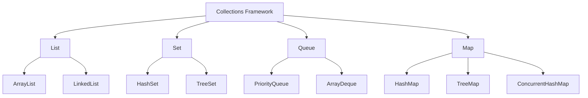
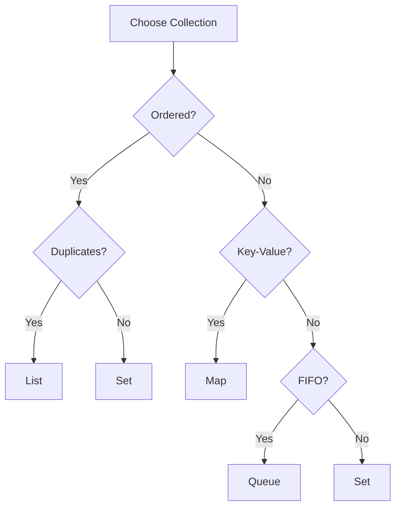

# Module 04: Collections Framework

## Overview
The Java Collections Framework provides interfaces, implementations, and algorithms for working with collections of objects. It includes List, Set, Queue, and Map interfaces with various implementations.

## Learning Objectives
- Master Collection interfaces
- Understand implementation differences
- Use appropriate collections
- Apply algorithms and utilities
- Handle thread-safe collections

## Prerequisites
- OOP concepts
- Generics basics
- Exception handling

## Why This Concept Exists
Arrays are limited:
- Fixed size
- No built-in methods
- Type-unsafe (before generics)
- Poor performance for insertions

Collections provide:
- Dynamic sizing
- Rich APIs
- Type safety
- Performance optimization

## Problem Statement
How do you store, retrieve, and manipulate groups of objects efficiently?

## Theory

### Collection Hierarchy

```
Collection
├─ List (ordered, duplicates)
│  ├─ ArrayList
│  ├─ LinkedList
│  └─ Vector
├─ Set (no duplicates)
│  ├─ HashSet
│  ├─ LinkedHashSet
│  └─ TreeSet
└─ Queue (FIFO)
   ├─ PriorityQueue
   ├─ ArrayDeque
   └─ LinkedList

Map (key-value)
├─ HashMap
├─ LinkedHashMap
├─ TreeMap
├─ Hashtable
└─ ConcurrentHashMap
```

### Implementation Comparison

| Collection | Access | Insert | Delete | Thread-Safe |
|------------|--------|--------|--------|-------------|
| ArrayList | O(1) | O(n) | O(n) | No |
| LinkedList | O(n) | O(1) | O(1) | No |
| HashSet | O(1) | O(1) | O(1) | No |
| TreeSet | O(log n) | O(log n) | O(log n) | No |
| HashMap | O(1) | O(1) | O(1) | No |
| TreeMap | O(log n) | O(log n) | O(log n) | No |

## Internal Working

### ArrayList Internals
```
ArrayList:
┌─────────────────────────────────────┐
│ Object[] elementData                │
│  ├─ [0] → "A"                      │
│  ├─ [1] → "B"                      │
│  ├─ [2] → null (empty)             │
│  └─ [3] → null (empty)             │
│ size: 2, capacity: 4               │
└─────────────────────────────────────┘
```

### HashMap Internals
```
HashMap:
┌─────────────────────────────────────┐
│ Table (Node[] table)                │
│  ├─ [0] → Node → Node              │
│  ├─ [1] → null                      │
│  ├─ [2] → Node                     │
│  └─ [3] → null                      │
│ loadFactor: 0.75, threshold: 12    │
└─────────────────────────────────────┘
```

## JVM Perspective

### Memory Usage
- ArrayList: O(capacity) array
- LinkedList: O(n) nodes with pointers
- HashMap: O(capacity) buckets + entries
- TreeMap: O(n) tree nodes

### Generics
- Type erasure at runtime
- No primitive generics
- Bounded type parameters
- Wildcard capture

## Architecture Diagram



## Flow Diagram



## Syntax

### List Operations
```java
// ArrayList
List<String> list = new ArrayList<>();
list.add("A");
list.add(0, "B");
list.get(0);
list.remove("A");
list.size();

// LinkedList
List<String> linked = new LinkedList<>();
linked.addFirst("A");
linked.addLast("B");
linked.removeFirst();
```

### Set Operations
```java
// HashSet
Set<String> set = new HashSet<>();
set.add("A");
set.contains("A");
set.remove("A");

// TreeSet (sorted)
TreeSet<Integer> sorted = new TreeSet<>();
sorted.add(3);
sorted.add(1);
sorted.add(2);
// sorted: [1, 2, 3]
```

### Map Operations
```java
// HashMap
Map<String, Integer> map = new HashMap<>();
map.put("key", 1);
map.get("key");
map.containsKey("key");
map.remove("key");
map.getOrDefault("missing", 0);

// TreeMap (sorted)
TreeMap<String, Integer> sorted = new TreeMap<>();
sorted.put("banana", 2);
sorted.put("apple", 1);
// sorted by key
```

### Iteration
```java
// For-each
for (String item : list) {
    System.out.println(item);
}

// Iterator
Iterator<String> it = list.iterator();
while (it.hasNext()) {
    System.out.println(it.next());
}

// Stream
list.stream()
    .filter(s -> s.startsWith("A"))
    .forEach(System.out::println);
```

## Easy Example
```java
import java.util.*;

public class CollectionsEasyExample {
    public static void main(String[] args) {
        // List
        List<String> names = new ArrayList<>();
        names.add("Alice");
        names.add("Bob");
        names.add("Charlie");
        System.out.println("Names: " + names);
        
        // Set
        Set<Integer> numbers = new HashSet<>();
        numbers.add(1);
        numbers.add(2);
        numbers.add(3);
        numbers.add(2); // Duplicate ignored
        System.out.println("Numbers: " + numbers);
        
        // Map
        Map<String, Integer> ages = new HashMap<>();
        ages.put("Alice", 25);
        ages.put("Bob", 30);
        System.out.println("Ages: " + ages);
    }
}
```

## Medium Example
```java
import java.util.*;

public class CollectionsMediumExample {
    public static void main(String[] args) {
        // Sort list
        List<String> names = Arrays.asList("Charlie", "Alice", "Bob");
        Collections.sort(names);
        System.out.println("Sorted: " + names);
        
        // Find in sorted list
        int index = Collections.binarySearch(names, "Bob");
        System.out.println("Found at: " + index);
        
        // Synchronized list
        List<String> syncList = Collections.synchronizedList(new ArrayList<>());
        
        // Unmodifiable list
        List<String> unmodifiable = List.of("A", "B", "C");
        
        // Map operations
        Map<String, List<String>> grouped = new HashMap<>();
        grouped.computeIfAbsent("fruits", k -> new ArrayList<>()).add("apple");
        grouped.computeIfAbsent("fruits", k -> new ArrayList<>()).add("banana");
        System.out.println("Grouped: " + grouped);
    }
}
```

## Hard Example
```java
import java.util.*;
import java.util.stream.*;

public class CollectionsHardExample {
    // Custom comparator
    public static void sortStudents() {
        List<Student> students = Arrays.asList(
            new Student("Alice", 90),
            new Student("Bob", 85),
            new Student("Charlie", 95)
        );
        
        students.sort(Comparator.comparingInt(Student::getGrade).reversed());
        students.forEach(s -> System.out.println(s.getName() + ": " + s.getGrade()));
    }
    
    // Frequency counting
    public static Map<String, Long> countWords(String text) {
        return Arrays.stream(text.split("\\s+"))
            .collect(Collectors.groupingBy(
                word -> word.toLowerCase(),
                Collectors.counting()
            ));
    }
    
    public static void main(String[] args) {
        sortStudents();
        
        String text = "the cat sat on the mat the cat";
        Map<String, Long> wordCount = countWords(text);
        System.out.println("Word count: " + wordCount);
    }
}

class Student {
    private String name;
    private int grade;
    
    public Student(String name, int grade) {
        this.name = name;
        this.grade = grade;
    }
    
    public String getName() { return name; }
    public int getGrade() { return grade; }
}
```

## Enterprise Example
```java
import java.util.*;
import java.util.concurrent.*;

public class CollectionsEnterpriseExample {
    // Thread-safe cache
    private final ConcurrentHashMap<String, Object> cache = 
        new ConcurrentHashMap<>();
    
    public Object getOrCompute(String key, Supplier<Object> compute) {
        return cache.computeIfAbsent(key, k -> compute.get());
    }
    
    // Priority queue for task scheduling
    public static class TaskScheduler {
        private final PriorityQueue<Task> queue = new PriorityQueue<>(
            Comparator.comparingInt(Task::getPriority)
        );
        
        public void schedule(Task task) {
            queue.offer(task);
        }
        
        public Task next() {
            return queue.poll();
        }
    }
    
    public static class Task {
        private final String name;
        private final int priority;
        
        public Task(String name, int priority) {
            this.name = name;
            this.priority = priority;
        }
        
        public String getName() { return name; }
        public int getPriority() { return priority; }
    }
    
    public static void main(String[] args) {
        TaskScheduler scheduler = new TaskScheduler();
        scheduler.schedule(new Task("High", 1));
        scheduler.schedule(new Task("Low", 3));
        scheduler.schedule(new Task("Medium", 2));
        
        System.out.println(scheduler.next().getName()); // High
        System.out.println(scheduler.next().getName()); // Medium
    }
}
```

## Performance Considerations
- ArrayList for random access
- LinkedList for frequent insertions
- HashSet for fast lookup
- HashMap for key-value pairs
- TreeMap for sorted keys

## Time & Space Complexity

| Operation | ArrayList | LinkedList | HashSet | HashMap |
|-----------|-----------|------------|---------|---------|
| get(index) | O(1) | O(n) | N/A | N/A |
| add | O(1)* | O(1) | O(1) | O(1) |
| remove | O(n) | O(1) | O(1) | O(1) |
| contains | O(n) | O(n) | O(1) | O(1) |

## Thread Safety
- Collections.synchronizedList()
- CopyOnWriteArrayList
- ConcurrentHashMap
- Collections.unmodifiableList()

## Best Practices
1. Use interfaces for declarations
2. Choose appropriate implementation
3. Use generics for type safety
4. Prefer immutable collections
5. Use streams for complex operations

## Common Mistakes
1. ConcurrentModificationException
2. Using wrong collection type
3. Not handling null values
4. Forgetting to check contains()

## Comparison Table

| Collection | Use Case | Performance |
|------------|----------|-------------|
| ArrayList | Random access | Fast read |
| LinkedList | Frequent insert | Fast insert |
| HashSet | Unique elements | Fast lookup |
| TreeSet | Sorted elements | Sorted |
| HashMap | Key-value | Fast lookup |
| TreeMap | Sorted map | Sorted |

## Interview Questions

### Q1: What is the difference between ArrayList and LinkedList?
**Answer:** ArrayList uses array, LinkedList uses nodes. ArrayList better for reads, LinkedList for inserts.

### Q2: What is the difference between HashMap and TreeMap?
**Answer:** HashMap is unordered O(1), TreeMap is sorted O(log n).

### Q3: What is the difference between HashSet and TreeSet?
**Answer:** HashSet is unordered O(1), TreeSet is sorted O(log n).

### Q4: How do you make a collection thread-safe?
**Answer:** Use Collections.synchronizedList() or ConcurrentHashMap.

### Q5: What is ConcurrentModificationException?
**Answer:** Thrown when collection is modified during iteration.

### Q6: What is the difference between Iterator and ListIterator?
**Answer:** Iterator for single direction, ListIterator for bidirectional.

### Q7: What is the difference between Queue and Deque?
**Answer:** Queue is FIFO, Deque is double-ended.

### Q8: What is the difference between HashMap and Hashtable?
**Answer:** Hashtable is synchronized, HashMap is not.

### Q9: What is the initial capacity of ArrayList?
**Answer:** 10.

### Q10: What is load factor in HashMap?
**Answer:** Threshold for resizing (default 0.75).

### Q11: What is the difference between List and Set?
**Answer:** List allows duplicates, Set does not.

### Q12: What is Collections.unmodifiableList()?
**Answer:** Returns read-only view of list.

### Q13: What is the difference between List.of() and ArrayList?
**Answer:** List.of() is immutable, ArrayList is mutable.

### Q14: What is the difference between remove() and removeAll()?
**Answer:** remove() removes single element, removeAll removes all matching.

### Q15: What is the difference between contains() and indexOf()?
**Answer:** contains() returns boolean, indexOf() returns position.

## Exercises

### Easy
1. Create a list and sort it
2. Use a map to count word frequency
3. Remove duplicates from a list

### Medium
1. Implement a custom comparator
2. Use a priority queue for scheduling
3. Merge two maps

### Hard
1. Implement LRU cache
2. Create a concurrent data structure
3. Design a routing table

## Summary
Collections are fundamental to Java development. Choose the right collection for your use case.

## References
- Oracle Java Documentation: Collections
- Effective Java: Item 28
- Baeldung Collections Guide
