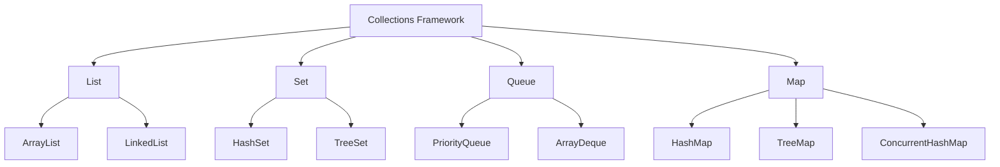
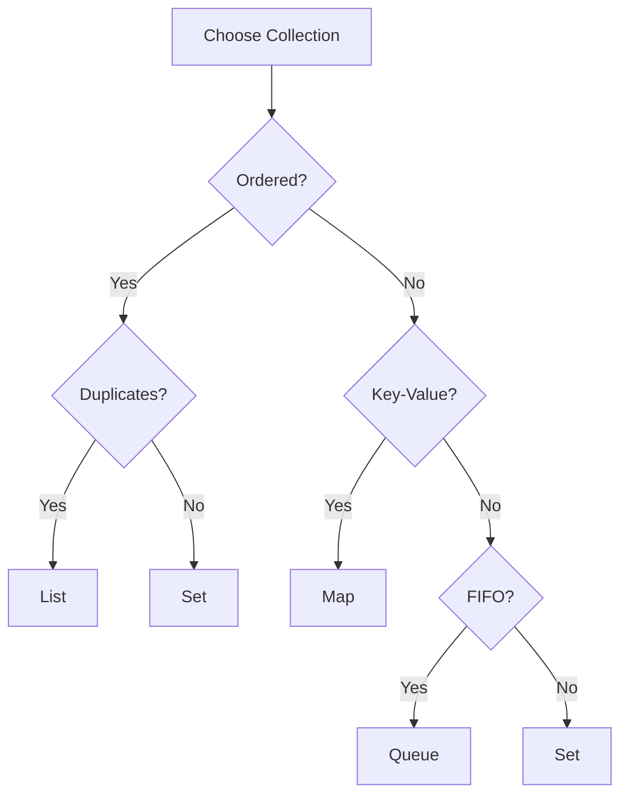

# Module 04: Collections Framework

## Overview
The Java Collections Framework provides interfaces, implementations, and algorithms for working with collections of objects. It includes List, Set, Queue, and Map interfaces with various implementations.

## Learning Objectives
- Master Collection interfaces
- Understand implementation differences
- Use appropriate collections
- Apply algorithms and utilities
- Handle thread-safe collections
- Master all iteration methods
- Use Lambda expressions and Stream API

## Prerequisites
- OOP concepts
- Generics basics
- Exception handling

## Why This Concept Exists
Arrays are limited:
- Fixed size
- No built-in methods
- Type-unsafe (before generics)
- Poor performance for insertions

Collections provide:
- Dynamic sizing
- Rich APIs
- Type safety
- Performance optimization

## Problem Statement
How do you store, retrieve, and manipulate groups of objects efficiently?

## Theory

### Collection Hierarchy

```
Collection
├─ List (ordered, duplicates)
│  ├─ ArrayList
│  ├─ LinkedList
│  └─ Vector
├─ Set (no duplicates)
│  ├─ HashSet
│  ├─ LinkedHashSet
│  └─ TreeSet
└─ Queue (FIFO)
   ├─ PriorityQueue
   ├─ ArrayDeque
   └─ LinkedList

Map (key-value)
├─ HashMap
├─ LinkedHashMap
├─ TreeMap
├─ Hashtable
└─ ConcurrentHashMap
```

### Implementation Comparison

| Collection | Access | Insert | Delete | Thread-Safe |
|------------|--------|--------|--------|-------------|
| ArrayList | O(1) | O(n) | O(n) | No |
| LinkedList | O(n) | O(1) | O(1) | No |
| HashSet | O(1) | O(1) | O(1) | No |
| TreeSet | O(log n) | O(log n) | O(log n) | No |
| HashMap | O(1) | O(1) | O(1) | No |
| TreeMap | O(log n) | O(log n) | O(log n) | No |

## Iteration Methods

### Comparison Table

| Method | Index Access | Can Break | Can Modify | Best For |
|--------|-------------|-----------|------------|----------|
| Traditional for | Yes | break/continue | Yes (set, add, remove) | Index-based operations |
| Enhanced for-each | No | break/continue | No | Simple iteration |
| forEach lambda | No | No | No | Functional style |
| Method reference | No | No | No | Calling single method |
| Iterator | No | Iterator.remove() | Yes (remove, add, set) | Safe removal during iteration |
| Stream forEach | No | findFirst/limit | No | Chained transformations |

### Examples

```java
// Traditional for loop
for (int i = 0; i < list.size(); i++) {
    System.out.println(list.get(i));
}

// Enhanced for-each
for (String s : list) {
    System.out.println(s);
}

// forEach lambda
list.forEach(System.out::println);

// Iterator
Iterator<String> it = list.iterator();
while (it.hasNext()) {
    String s = it.next();
    if (s.startsWith("A")) {
        it.remove();
    }
}

// Stream
list.stream()
    .filter(s -> s.length() > 3)
    .map(String::toUpperCase)
    .forEach(System.out::println);
```

## Lambda Expressions in Collections

```java
// Sort with lambda
list.sort((a, b) -> a.compareTo(b));

// Filter with predicate
List<String> filtered = list.stream()
    .filter(s -> s.length() > 3)
    .collect(Collectors.toList());

// Map transformation
List<Integer> lengths = list.stream()
    .map(String::length)
    .collect(Collectors.toList());

// Reduce
int sum = numbers.stream()
    .reduce(0, Integer::sum);

// Collect to map
Map<String, Integer> map = list.stream()
    .collect(Collectors.toMap(s -> s, String::length));
```

## Stream API Operations

### Intermediate Operations (lazy)
- filter() - Select elements matching predicate
- map() - Transform elements
- flatMap() - Flatten nested structures
- distinct() - Remove duplicates
- sorted() - Sort elements
- peek() - Debug/inspect
- limit() - Take first N elements
- skip() - Skip first N elements

### Terminal Operations (trigger execution)
- forEach() - Iterate
- collect() - Accumulate to collection
- reduce() - Combine elements
- count() - Count elements
- anyMatch() - Check if any match
- allMatch() - Check if all match
- noneMatch() - Check if none match
- findFirst() - Find first element
- min() / max() - Find minimum/maximum

### Parallel Streams
```java
// Parallel processing
long count = list.parallelStream()
    .filter(s -> s.length() > 3)
    .count();

// Custom thread pool
ForkJoinPool customPool = new ForkJoinPool(4);
customPool.submit(() -> 
    list.parallelStream().forEach(System.out::println)
);
```

### Memory Considerations
- Streams create intermediate objects
- Collectors allocate new collections
- Parallel streams use ForkJoinPool
- Recursion uses stack frames (risk of StackOverflowError)

## Architecture Diagram



## Flow Diagram



---

**[Continue to Part 2: Syntax, Examples & Reference →](README-part2.md)**