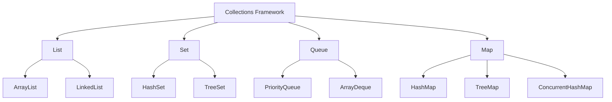
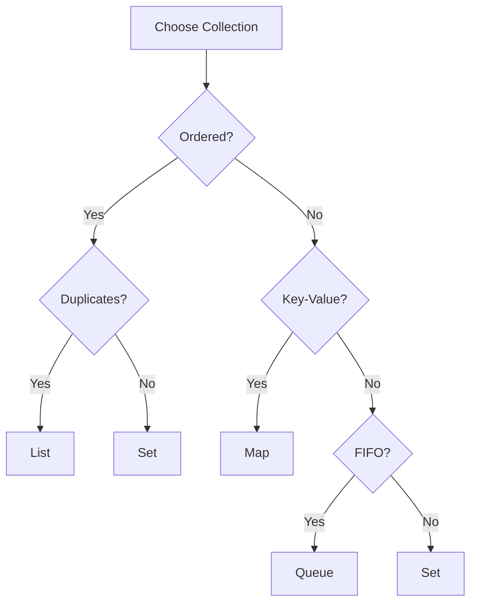

# Module 04: Collections Framework

> **Difficulty:** ⭐⭐⭐ Intermediate  
> **Reading:** 35 min | **Practice:** 60 min | **Total:** 95 min

## Overview
The Java Collections Framework provides interfaces, implementations, and algorithms for working with collections of objects. It includes List, Set, Queue, and Map interfaces with various implementations.

## Learning Objectives
- Master Collection interfaces
- Understand implementation differences
- Use appropriate collections
- Apply algorithms and utilities
- Handle thread-safe collections
- Master all iteration methods
- Use Lambda expressions and Stream API

## Prerequisites
- OOP concepts
- Generics basics
- Exception handling

## History
- **1996** — Java 1.0 introduced Vector, Hashtable, and Enumeration to provide basic dynamic data structures and enumeration for early collections needs
- **1998** — Java 1.2 added the Collections Framework (List, Set, Map, Iterator) to provide a unified architecture for representing and manipulating collections, improving code reusability and reducing API confusion
- **2001** — Java 1.3 added Collections.unmodifiable* wrappers to allow creation of immutable views of collections, enhancing safety and encapsulation
- **2004** — Java 5 introduced generics to make collections type-safe, eliminating explicit casting and catching type errors at compile time
- **2004** — Java 5 added `for-each` loop and `autoboxing` to simplify iteration and reduce boilerplate when working with wrapper classes
- **2011** — Java 7 introduced `diamond operator` to reduce boilerplate and `NavigableMap`/`NavigableSet` to provide navigation methods for sorted collections
- **2014** — Java 8 added `stream()` and `forEach()` to collections to enable functional-style operations and parallel processing
- **2017** — Java 9 added factory methods: `List.of()`, `Set.of()`, `Map.of()` to create immutable collections concisely, replacing verbose constructors
- **2021** — Java 16 added `toList()` to Stream to simplify collecting stream results into a list, reducing verbosity
- **2021** — Java 17 added `SequencedCollection` interface for ordered access to provide uniform methods for accessing ordered collections, improving consistency

## Production Notes
- **Where is it used?** In all Java applications that need to store, retrieve, and manipulate groups of objects
- **Why is it useful?** Provides dynamic sizing, rich APIs, type safety, and performance optimizations for data management
- **When should it be avoided?** For simple, fixed-size data where arrays are sufficient; overuse can lead to memory overhead and complexity
- **Alternative?** Arrays for fixed-size data, databases for persistent storage, or custom data structures for specific needs

## Why This Concept Exists
Arrays are limited:
- Fixed size
- No built-in methods
- Type-unsafe (before generics)
- Poor performance for insertions

Collections provide:
- Dynamic sizing
- Rich APIs
- Type safety
- Performance optimization

## Problem Statement
How do you store, retrieve, and manipulate groups of objects efficiently?

## Core Concepts

### Collection Hierarchy

```
Collection
├─ List (ordered, duplicates)
│  ├─ ArrayList
│  ├─ LinkedList
│  └─ Vector
├─ Set (no duplicates)
│  ├─ HashSet
│  ├─ LinkedHashSet
│  └─ TreeSet
└─ Queue (FIFO)
   ├─ PriorityQueue
   ├─ ArrayDeque
   └─ LinkedList

Map (key-value)
├─ HashMap
├─ LinkedHashMap
├─ TreeMap
├─ Hashtable
└─ ConcurrentHashMap
```

### Implementation Comparison

| Collection | Access | Insert | Delete | Thread-Safe |
|------------|--------|--------|--------|-------------|
| ArrayList | O(1) | O(n) | O(n) | No |
| LinkedList | O(n) | O(1) | O(1) | No |
| HashSet | O(1) | O(1) | O(1) | No |
| TreeSet | O(log n) | O(log n) | O(log n) | No |
| HashMap | O(1) | O(1) | O(1) | No |
| TreeMap | O(log n) | O(log n) | O(log n) | No |

## Iteration Methods

### Comparison Table

| Method | Index Access | Can Break | Can Modify | Best For |
|--------|-------------|-----------|------------|----------|
| Traditional for | Yes | break/continue | Yes (set, add, remove) | Index-based operations |
| Enhanced for-each | No | break/continue | No | Simple iteration |
| forEach lambda | No | No | No | Functional style |
| Method reference | No | No | No | Calling single method |
| Iterator | No | Iterator.remove() | Yes (remove, add, set) | Safe removal during iteration |
| Stream forEach | No | findFirst/limit | No | Chained transformations |

### Examples

```java
// Traditional for loop
for (int i = 0; i < list.size(); i++) {
    System.out.println(list.get(i));
}

// Enhanced for-each
for (String s : list) {
    System.out.println(s);
}

// forEach lambda
list.forEach(System.out::println);

// Iterator
Iterator<String> it = list.iterator();
while (it.hasNext()) {
    String s = it.next();
    if (s.startsWith("A")) {
        it.remove();
    }
}

// Stream
list.stream()
    .filter(s -> s.length() > 3)
    .map(String::toUpperCase)
    .forEach(System.out::println);
```

## Lambda Expressions in Collections

```java
// Sort with lambda
list.sort((a, b) -> a.compareTo(b));

// Filter with predicate
List<String> filtered = list.stream()
    .filter(s -> s.length() > 3)
    .collect(Collectors.toList());

// Map transformation
List<Integer> lengths = list.stream()
    .map(String::length)
    .collect(Collectors.toList());

// Reduce
int sum = numbers.stream()
    .reduce(0, Integer::sum);

// Collect to map
Map<String, Integer> map = list.stream()
    .collect(Collectors.toMap(s -> s, String::length));
```

## Stream API Operations

### Intermediate Operations (lazy)
- filter() - Select elements matching predicate
- map() - Transform elements
- flatMap() - Flatten nested structures
- distinct() - Remove duplicates
- sorted() - Sort elements
- peek() - Debug/inspect
- limit() - Take first N elements
- skip() - Skip first N elements

### Terminal Operations (trigger execution)
- forEach() - Iterate
- collect() - Accumulate to collection
- reduce() - Combine elements
- count() - Count elements
- anyMatch() - Check if any match
- allMatch() - Check if all match
- noneMatch() - Check if none match
- findFirst() - Find first element
- min() / max() - Find minimum/maximum

### Parallel Streams
```java
// Parallel processing
long count = list.parallelStream()
    .filter(s -> s.length() > 3)
    .count();

// Custom thread pool
ForkJoinPool customPool = new ForkJoinPool(4);
customPool.submit(() -> 
    list.parallelStream().forEach(System.out::println)
);
```

### Memory Considerations
- Streams create intermediate objects
- Collectors allocate new collections
- Parallel streams use ForkJoinPool
- Recursion uses stack frames (risk of StackOverflowError)

## Architecture Diagram



## Flow Diagram



## Examples

### ArrayList Basics
```java
List<String> names = new ArrayList<>();
names.add("Alice");
names.add("Bob");
names.add("Charlie");
System.out.println(names.get(0));     // Alice
System.out.println(names.size());     // 3
names.remove("Bob");
System.out.println(names.contains("Alice")); // true
```

### HashMap Usage
```java
Map<String, Integer> scores = new HashMap<>();
scores.put("Alice", 95);
scores.put("Bob", 87);
scores.put("Charlie", 92);
System.out.println(scores.get("Alice"));          // 95
scores.putIfAbsent("Alice", 100);                 // no overwrite
scores.forEach((name, score) -> System.out.println(name + ": " + score));
```

### Stream Operations
```java
List<String> words = List.of("apple", "banana", "avocado", "blueberry");
List<String> aWords = words.stream()
    .filter(w -> w.startsWith("a"))
    .sorted()
    .collect(Collectors.toList());
System.out.println(aWords); // [apple, avocado]
```

> See [Part 2](README-part2.md) for more syntax, examples, and reference material.

---

## Internal Working

### ArrayList Internals
- Backed by a `Object[]` array
- Default initial capacity: 10
- Growth factor: 1.5x (`newCapacity = oldCapacity + (oldCapacity >> 1)`)
- `add()` at end: amortized O(1), worst O(n) on resize
- `add(index)` / `remove(index)`: O(n) due to element shifting

### HashMap Internals
- Array of `Node<K,V>` buckets (default capacity 16, load factor 0.75)
- Key's `hashCode()` determines bucket: `hash(key) & (n-1)`
- Collisions handled by linked list (Java 8+: treeifies at 8 entries)
- Resize when `size > capacity * loadFactor`

### LinkedList Internals
- Doubly-linked list: each node has `prev` and `next` pointers
- No random access — O(n) traversal to index
- O(1) insert/delete at head/tail (if node reference is known)

### TreeMap Internals
- Red-black tree (self-balancing BST)
- Keys must be `Comparable` or provided `Comparator`
- All operations O(log n)

### ConcurrentHashMap Internals
- Segment-based locking (Java 7) / CAS + synchronized bins (Java 8+)
- Read operations are lock-free
- Write operations lock only the affected bucket

## Performance

### Choosing the Right Collection

| Use Case | Best Choice | Why |
|----------|-------------|-----|
| Random access by index | ArrayList | O(1) index access |
| Frequent insert/delete at head | LinkedList | O(1) at ends |
| Unique elements, unordered | HashSet | O(1) add/contains |
| Unique elements, sorted | TreeSet | O(log n) with ordering |
| Key-value pairs, unordered | HashMap | O(1) get/put |
| Key-value pairs, sorted by key | TreeMap | O(log n) with ordering |
| Thread-safe map | ConcurrentHashMap | High concurrency |
| FIFO queue | ArrayDeque | Faster than LinkedList |
| Priority ordering | PriorityQueue | O(log n) add/poll |

### Memory Overhead

| Collection | Overhead per Element |
|------------|---------------------|
| ArrayList | 4-8 bytes (reference) + array slots |
| LinkedList | 24-32 bytes (node + two pointers) |
| HashSet | 32-48 bytes (HashMap entry) |
| HashMap | 32-48 bytes (Entry + hash + next) |

## Best Practices

**Do's:**
- Use `List.of()`, `Set.of()`, `Map.of()` for immutable collections (Java 9+)
- Prefer `ArrayList` over `LinkedList` for most use cases
- Use `interface` types for declarations: `List<String>` not `ArrayList<String>`
- Use `ConcurrentHashMap` for concurrent access, not `Collections.synchronizedMap()`
- Use `entrySet()` when you need both key and value from a Map

**Don'ts:**
- Don't modify a collection during for-each iteration (use `Iterator.remove()`)
- Don't use `Vector` or `Hashtable` — use modern equivalents
- Don't rely on `hashCode()` and `equals()` being consistent without implementing both
- Don't use `size() == 0` when `isEmpty()` is clearer
- Don't create unnecessary intermediate collections in stream pipelines

## Common Mistakes

| Mistake | Problem | Fix |
|---------|---------|-----|
| Modifying during iteration | `ConcurrentModificationException` | Use `Iterator.remove()` or `removeIf()` |
| Using raw types | Loss of type safety | Always use parameterized types |
| Incorrect `hashCode`/`equals` | Broken HashSet/HashMap behavior | Implement both consistently |
| `LinkedList` for random access | O(n) performance | Use `ArrayList` |
| Not initialising capacity | Repeated resizing overhead | Pre-size when known |

## Interview Questions

### Q1: What is the difference between ArrayList and LinkedList?
**Answer:** `ArrayList` uses a resizable array — O(1) random access, O(n) insert/delete. `LinkedList` uses a doubly-linked list — O(n) random access, O(1) insert/delete at ends.

### Q2: How does HashMap handle collisions?
**Answer:** Each bucket holds a linked list of entries with the same hash. Java 8+ converts lists to trees when bucket size exceeds 8, reducing lookup from O(n) to O(log n).

### Q3: What is the difference between HashMap and Hashtable?
**Answer:** `Hashtable` is synchronized (thread-safe but slow), doesn't allow null keys/values. `HashMap` is not synchronized, allows one null key. Use `ConcurrentHashMap` for thread safety.

### Q4: What is the fail-fast property of collections?
**Answer:** Iterators throw `ConcurrentModificationException` if the collection is modified structurally during iteration, unless done through the iterator itself.

### Q5: When should you use TreeMap over HashMap?
**Answer:** When you need keys sorted by natural order or a custom `Comparator`. `TreeMap` provides `firstKey()`, `lastKey()`, `headMap()`, `tailMap()` operations.

### Q6: What is the difference between Iterator and ListIterator?
**Answer:** `Iterator` works for any collection, traverses forward only. `ListIterator` works only for `List`, traverses both directions, and can add/set elements.

### Q7: How do you create an unmodifiable collection?
**Answer:** Use `Collections.unmodifiableList()`, or Java 9+ factory methods: `List.of()`, `List.copyOf()`.

### Q8: What is the difference between PriorityQueue and TreeSet?
**Answer:** `PriorityQueue` is a heap — O(1) peek, O(log n) add/poll, no ordering guarantee on iteration. `TreeSet` is a red-black tree — sorted order, O(log n) all operations.

### Q9: What is copy-on-write?
**Answer:** `CopyOnWriteArrayList` creates a new copy of the underlying array on every write. Good for read-heavy, write-rarely scenarios.

### Q10: What is the `fail-safe` iterator?
**Answer:** Iterators on concurrent collections (e.g., `ConcurrentHashMap`) don't throw `ConcurrentModificationException`. They may not reflect concurrent modifications.

## Cross-References

- **Previous Module:** [03 - Exception Handling](../03-exception-handling/)
- **Next Module:** [05 - Text Processing](../05-text-processing/)
- **Related:** [06 - Generics](../06-generics/) — parameterized collection types
- **Related:** [07 - Functional Programming](../07-functional-programming/) — Stream API for collection processing
- **Related:** [09 - Multithreading](../09-multithreading/) — thread-safe collections
- **External:** [Oracle Collections Tutorial](https://docs.oracle.com/javase/tutorial/collections/)
- **External:** [Effective Java - Item 28: Prefer lists to arrays](https://www.oreilly.com/library/view/effective-java/9780134686097/)

## Prerequisites

- [OOP](../02-oop/README.md)
- [Equals & HashCode](../00-knowledge-atoms/equals-hashcode/README.md)

## Related Topics

- [Generics](../06-generics/README.md)
- [Immutability](../00-knowledge-atoms/immutability/README.md)

## Next

- [Text Processing](../05-text-processing/README.md)
- [Functional Programming](../07-functional-programming/README.md)

## One-Minute Revision

| Aspect | Value |
|--------|-------|
| Purpose | Data structures and algorithms |
| Complexity | Varies (O(1) to O(n)) |
| Thread Safe | No (by default) |
| Ordered | Depends on implementation |
| Allows Null | Depends on implementation |
| Best Alternative | Varies by use case |
| When to Use | Storing and manipulating data |
| When to Avoid | Simple arrays |