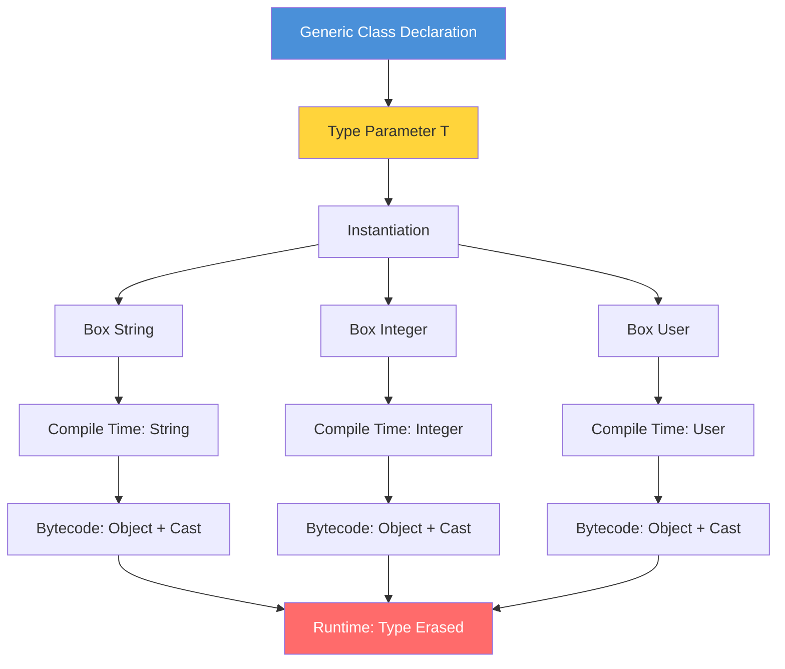

# 01 - Introduction to Generics

## Table of Contents

1. [Introduction](#introduction)
2. [Learning Objectives](#learning-objectives)
3. [Prerequisites](#prerequisites)
4. [Why This Concept Exists](#why-this-concept-exists)
5. [Problem Statement](#problem-statement)
6. [Theory](#theory)
7. [Internal Working](#internal-working)
8. [JVM Perspective](#jvm-perspective)
9. [Memory Representation](#memory-representation)
10. [Syntax](#syntax)
11. [Easy Example](#easy-example)
12. [Medium Example](#medium-example)
13. [Hard Example](#hard-example)
14. [Enterprise Example](#enterprise-example)
15. [Performance](#performance)
16. [Best Practices](#best-practices)
17. [Common Mistakes](#common-mistakes)
18. [Pitfalls](#pitfalls)
19. [Debugging Tips](#debugging-tips)
20. [Comparison Table](#comparison-table)
21. [Decision Tree](#decision-tree)
22. [Interview Questions](#interview-questions)
23. [Exercises](#exercises)
24. [Assignments](#assignments)
25. [Mini Project](#mini-project)
26. [Summary](#summary)
27. [References](#references)

---

## Introduction

Generics is one of the most powerful features introduced in Java 5 (JDK 1.5). It allows you to define classes, interfaces, and methods with **type parameters** — placeholders that are replaced with actual types when the code is used. Before generics, Java relied on `Object` references and explicit casting, which was error-prone and shifted type-checking from compile time to runtime.

Generics enable **compile-time type safety**, **code reusability**, and **elimination of explicit casts**. They are foundational to the Java Collections Framework and are used extensively throughout the Java ecosystem.

---

## Learning Objectives

By the end of this topic, you will be able to:

- Explain why generics were introduced in Java
- Distinguish between raw types and parameterized types
- Write basic generic classes and methods
- Understand type inference and diamond operator
- Identify type safety benefits over pre-generics code
- Recognize the relationship between generics and type erasure

---

## Prerequisites

- Object-Oriented Programming (inheritance, polymorphism)
- Java Collections basics (List, Set, Map)
- Interface and abstract class concepts
- Basic understanding of casting in Java

---

## Why This Concept Exists

### Before Generics (Java 1.4 and earlier)

```java
// Pre-generics: Everything was Object
public class Box {
    private Object object;

    public void set(Object object) {
        this.object = object;
    }

    public Object get() {
        return object;
    }
}
```

**Problems:**
1. **No type safety** — you could put a `String` in a box intended for `Integer`
2. **Explicit casting required** — `(String) box.get()` could throw `ClassCastException`
3. **Runtime errors** — type mismatches discovered only during execution
4. **Poor readability** — code intent was unclear without type information

### After Generics (Java 5+)

```java
// Post-generics: Type-safe
public class Box<T> {
    private T object;

    public void set(T object) {
        this.object = object;
    }

    public T get() {
        return object;
    }
}
```

**Solutions:**
1. **Compile-time type checking** — wrong types caught immediately
2. **No explicit casting** — compiler inserts casts automatically
3. **Clearer code** — `Box<String>` communicates intent directly
4. **Reusability** — one class works for all types

---

## Problem Statement

Consider building a repository that stores different entity types:

```java
// WITHOUT generics
public class UserRepository {
    private List users = new ArrayList();

    public void save(Object user) {
        users.add(user);
    }

    public Object findById(int id) {
        return users.get(id); // Returns Object - caller must cast
    }
}

// Usage
UserRepository repo = new UserRepository();
repo.save(new User("Alice"));
User user = (User) repo.findById(0); // Risky cast!

// This compiles but fails at runtime:
repo.save("not a user"); // String accepted silently
```

**The core problem:** The compiler cannot enforce what types are stored or retrieved, leading to runtime `ClassCastException`.

---

## Theory

### Type Parameter Diagram



### Type Parameters

A **type parameter** is a name that acts as a placeholder for an actual type:

```java
class Box<T> {  // T is a type parameter
    private T value;  // T is used as a type
}
```

**Naming conventions:**
| Letter | Meaning | Example |
|--------|---------|---------|
| `T` | Type | Generic class |
| `E` | Element | Collections |
| `K` | Key | Maps |
| `V` | Value | Maps |
| `N` | Number | Numeric generics |
| `R` | Return | Functional interfaces |

### Parameterized Types

When you use a generic type, you **parameterize** it with an actual type:

```java
Box<String> stringBox = new Box<>();  // String replaces T
Box<Integer> intBox = new Box<>();     // Integer replaces T
```

### Type Inference

The compiler can infer type parameters from context:

```java
// Java 7+: Diamond operator <>
Box<String> box = new Box<>();  // Compiler infers Box<String>

// Java 8+: Target type inference
List<String> list = List.of("a", "b", "c");  // Inferred from context
```

### Raw Types

A **raw type** is a generic type used without type arguments:

```java
Box rawBox = new Box();         // Raw type (pre-Java 5 style)
Box<String> safeBox = new Box<>(); // Parameterized type (correct)
```

Raw types exist for backward compatibility but should be avoided.

---

## Internal Working

### Compiler Actions

When you write generic code, the compiler performs these steps:

1. **Type checking** — Verifies all uses of type parameters are consistent
2. **Type erasure** — Replaces type parameters with their bounds (or `Object`)
3. **Cast insertion** — Adds necessary casts for type safety
4. **Bridge methods** — Generates synthetic methods for polymorphism

```
Source Code                Compiler                  Bytecode
─────────────────────────────────────────────────────────────
Box<String>         →    Box (raw)           →     Box.class
box.get()           →    (String) box.get()  →     invokevirtual
box.set("hello")    →    box.set("hello")    →     invokevirtual
```

### Erasure Rules

| Type Parameter | Erases To |
|----------------|-----------|
| `<T>` | `Object` |
| `<T extends Number>` | `Number` |
| `<T extends Comparable>` | `Comparable` |
| `? extends Number` | `Number` |
| `? super Integer` | `Object` |

---

## JVM Perspective

The JVM has **no knowledge of generics**. All generic type information is erased at compile time.

### What the JVM Sees

```java
// You write:
List<String> list = new ArrayList<>();
list.add("hello");
String s = list.get(0);

// JVM sees:
List list = new ArrayList();
list.add("hello");
String s = (String) list.get(0);  // Compiler inserted cast
```

### Bytecode Verification

```bash
# Compile generic code
javac -d out src/Box.java

# View bytecode
javap -c out/Box.class

# Output shows Object references, not String
# T is replaced by Object in the bytecode
```

### Reflection Limitations

```java
Box<String> box = new Box<>();

// This will NOT work as expected:
Field field = Box.class.getDeclaredField("value");
field.set(box, 42);  // Allowed! Type erasure means field type is Object

// You cannot do:
// Box<String>.class  // Compile error
// T.class            // Compile error
// instanceof T       // Compile error
```

---

## Memory Representation

### Object Layout

```java
Box<String> box = new Box<>();
box.set("hello");
```

**Memory layout (simplified):**
```
Heap:
┌─────────────────────────┐
│ Box instance            │
├─────────────────────────┤
│ Object header (16 bytes)│
│ value: reference ───────┼──→ String "hello"
└─────────────────────────┘
```

### Generics Don't Affect Memory

```java
Box<String> stringBox = new Box<>();
Box<Integer> intBox = new Box<>();
Box<List<Integer>> genericBox = new Box<>();

// All three Box objects have IDENTICAL memory layout
// The type parameter exists only at compile time
```

### Arrays and Generics

```java
// This is ILLEGAL:
// String[] strings = new String[10];  // OK
// Box<String>[] boxes = new Box<String>[10];  // Compile error!

// Why? Arrays carry reified type information at runtime
// But generics use type erasure — they are incompatible

// Workaround:
@SuppressWarnings("unchecked")
Box<String>[] boxes = (Box<String>[]) new Box[10];
```

---

## Syntax

### Generic Class Declaration

```java
// Single type parameter
public class Box<T> {
    private T content;
    
    public T getContent() { return content; }
    public void setContent(T content) { this.content = content; }
}

// Multiple type parameters
public class Pair<K, V> {
    private K key;
    private V value;
    
    public Pair(K key, V value) {
        this.key = key;
        this.value = value;
    }
}
```

### Generic Interface Declaration

```java
public interface Repository<T, ID> {
    T findById(ID id);
    List<T> findAll();
    void save(T entity);
    void delete(T entity);
}
```

### Generic Method Declaration

```java
public class Utility {
    public static <T> List<T> asList(T... elements) {
        return Arrays.asList(elements);
    }
}
```

### Instantiation

```java
// Diamond operator (Java 7+)
Box<String> box = new Box<>();

// Explicit type (redundant but valid)
Box<String> box = new Box<String>();

// Raw type (avoid!)
Box box = new Box();
```

---

## Easy Example

### Basic Box Implementation

```java
public class Box<T> {
    private T content;

    public void setContent(T content) {
        this.content = content;
    }

    public T getContent() {
        return content;
    }

    public static void main(String[] args) {
        // String box
        Box<String> stringBox = new Box<>();
        stringBox.setContent("Hello Generics");
        String message = stringBox.getContent(); // No cast needed
        System.out.println(message);

        // Integer box
        Box<Integer> intBox = new Box<>();
        intBox.setContent(42);
        int value = intBox.getContent(); // Auto-unboxing
        System.out.println(value);

        // Compile-time safety
        // intBox.setContent("wrong"); // Error: String cannot be Integer
    }
}
```

---

## Medium Example

### Pair Class with Multiple Type Parameters

```java
public class Pair<K, V> {
    private final K key;
    private final V value;

    public Pair(K key, V value) {
        this.key = key;
        this.value = value;
    }

    public K getKey() { return key; }
    public V getValue() { return value; }

    @Override
    public String toString() {
        return key + "=" + value;
    }

    public static void main(String[] args) {
        Pair<String, Integer> nameAge = new Pair<>("Alice", 30);
        Pair<Integer, Boolean> idActive = new Pair<>(1001, true);

        System.out.println(nameAge);    // Alice=30
        System.out.println(idActive);   // 1001=true
    }
}
```

---

## Hard Example

### Heterogeneous Container (Type-Safe)

```java
import java.util.HashMap;
import java.util.Map;

public class HeterogeneousContainer {
    private final Map<String, Object> map = new HashMap<>();

    // Type-safe getter using type tokens
    public <T> void put(String key, T value) {
        map.put(key, value);
    }

    @SuppressWarnings("unchecked")
    public <T> T get(String key, Class<T> type) {
        return type.cast(map.get(key));
    }

    public static void main(String[] args) {
        HeterogeneousContainer container = new HeterogeneousContainer();

        container.put("name", "Alice");
        container.put("age", 30);
        container.put("active", true);

        // Type-safe retrieval with class token
        String name = container.get("name", String.class);
        int age = container.get("age", Integer.class);
        boolean active = container.get("active", Boolean.class);

        System.out.println(name + ", " + age + ", " + active);

        // Type safety enforced at runtime
        // Integer wrong = container.get("name", Integer.class);
        // Throws ClassCastException: String cannot be cast to Integer
    }
}
```

---

## Enterprise Example

### Type-Safe Configuration System

```java
import java.util.HashMap;
import java.util.Map;

public class TypeSafeConfig {
    private final Map<String, Object> properties = new HashMap<>();

    public <T> void set(String key, T value, Class<T> type) {
        // Validate type at registration time
        type.cast(value); // Throws ClassCastException if wrong
        properties.put(key, value);
    }

    @SuppressWarnings("unchecked")
    public <T> T get(String key, Class<T> type) {
        Object value = properties.get(key);
        if (value == null) {
            return null;
        }
        return type.cast(value);
    }

    public <T> T getOrDefault(String key, Class<T> type, T defaultValue) {
        T value = get(key, type);
        return value != null ? value : defaultValue;
    }

    public static void main(String[] args) {
        TypeSafeConfig config = new TypeSafeConfig();

        // Register configuration values with type information
        config.set("db.host", "localhost", String.class);
        config.set("db.port", 5432, Integer.class);
        config.set("db.ssl", true, Boolean.class);

        // Type-safe retrieval
        String host = config.get("db.host", String.class);
        int port = config.get("db.port", Integer.class);
        boolean ssl = config.get("db.ssl", Boolean.class);

        System.out.printf("Connecting to %s:%d (SSL=%b)%n", host, port, ssl);

        // Default values
        int timeout = config.getOrDefault("db.timeout", Integer.class, 30);
        System.out.println("Timeout: " + timeout);
    }
}
```

---

## Performance

### Compile-Time vs Runtime

| Aspect | Impact |
|--------|--------|
| Compile time | Slightly increased (type checking) |
| Runtime | Zero overhead (type erasure) |
| Bytecode | Identical to raw types + casts |
| Memory | No additional memory for type parameters |

### Generic vs Raw Performance

```java
// These produce IDENTICAL bytecode:
List<String> generic = new ArrayList<>();
List raw = new ArrayList<>();

// The generic version adds compiler-inserted casts
// but these have negligible runtime cost
```

---

## Best Practices

1. **Always use parameterized types** — Never use raw types in new code
2. **Use diamond operator** — `new Box<>()` instead of `new Box<String>()`
3. **Name type parameters meaningfully** — `T` for simple cases, descriptive names for complex
4. **Document type constraints** — Use Javadoc `@param` tags
5. **Prefer bounded types** — `<T extends Comparable<T>>` over `<T>`

---

## Common Mistakes

### 1. Using Raw Types

```java
// BAD
List list = new ArrayList();
Map map = new HashMap();

// GOOD
List<String> list = new ArrayList<>();
Map<String, Integer> map = new HashMap<>();
```

### 2. Ignoring Type Safety

```java
// BAD - defeats the purpose of generics
Box rawBox = new Box();
rawBox.setContent("hello");
Integer i = (Integer) rawBox.getContent(); // Runtime ClassCastException!

// GOOD
Box<Integer> box = new Box<>();
box.setContent(42);
Integer i = box.getContent(); // Compile-time safe
```

### 3. Overusing Object as Type Parameter

```java
// BAD - what's the point of generics here?
public class Container<T> {
    private Object value; // Why not T?
}

// GOOD
public class Container<T> {
    private T value; // Use the type parameter
}
```

---

## Pitfalls

### 1. Type Erasure Surprise

```java
Box<String> stringBox = new Box<>();
Box<Integer> intBox = new Box<>();

// These are the SAME class at runtime!
System.out.println(stringBox.getClass() == intBox.getClass()); // true
```

### 2. Cannot Create Generic Arrays

```java
// ILLEGAL
// Box<String>[] boxes = new Box<String>[10];

// Workaround
Box<String>[] boxes = (Box<String>[]) new Box[10];
```

### 3. Cannot Use instanceof with Type Parameters

```java
// ILLEGAL
// if (box instanceof Box<String>) { }

// LEGAL (but less useful)
if (box instanceof Box<?>) { }
```

---

## Debugging Tips

### 1. Check Compiled Bytecode

```bash
javac -d out src/Box.java
javap -v out/Box.class | grep "Object\|String"
# Shows type erasure in action
```

### 2. Read Compiler Error Messages

```
Error: incompatible types: String cannot be converted to Integer
// This tells you exactly which types are mismatched
```

### 3. Use IDE Type Hints

```java
Box<> box = new Box<>(); // IDE shows inferred type
// IntelliJ: View > Tool Windows > Structure shows type parameters
```

### 4. Suppress Warnings Properly

```java
@SuppressWarnings("unchecked") // Be specific
List<String> list = (List<String>) rawList;

// Or more targeted:
@SuppressWarnings({"unchecked", "rawtypes"})
void legacyCode(List list) { }
```

---

## Comparison Table

| Feature | Raw Types | Generic Types |
|---------|-----------|---------------|
| Type safety | Runtime only | Compile time |
| Casting | Explicit required | Automatic (compiler) |
| Readability | Low | High |
| Refactoring | Difficult | Easy |
| IDE support | Limited | Full |
| Code reuse | Manual | Automatic |
| Error detection | Runtime exceptions | Compile-time errors |

---

## Decision Tree

```
Do you need to store/access multiple types of objects?
├── No → Use specific type (no generics needed)
└── Yes → Are all objects the same type?
    ├── Yes → Use specific type parameter: Box<String>
    └── No → Do you know the types at compile time?
        ├── Yes → Use bounded type: <T extends Base>
        └── No → Use wildcard: <?> or <? extends Base>
```

---

## Interview Questions

### Q1: What is type erasure in Java generics?

**A:** Type erasure is the process where the compiler removes all generic type information at compile time, replacing type parameters with their bounds (or `Object`). This ensures backward compatibility with pre-Java 5 code but means generic type information is not available at runtime.

### Q2: Can you use `instanceof` with generic types?

**A:** No, you cannot use `instanceof` with parameterized types because type information is erased at runtime. However, you can use `instanceof` with wildcard types: `if (obj instanceof List<?>)`.

### Q3: Why can't you create `new T()` in a generic class?

**A:** Because `T` is erased at compile time, the JVM doesn't know which constructor to call. You must pass a `Class<T>` object or use a `Supplier<T>` to create instances.

### Q4: What are raw types and why should they be avoided?

**A:** Raw types are generic types used without type arguments (e.g., `List` instead of `List<String>`). They exist for backward compatibility but bypass compile-time type checking, leading to potential `ClassCastException`.

### Q5: How do generics affect memory usage?

**A:** Generics have zero runtime memory overhead. Type parameters are erased at compile time, so `List<String>` and `List<Integer>` have identical memory layouts. The type information exists only in bytecode for compiler verification.

---

## Exercises

### Exercise 1: Basic Generic Class

Create a generic `Stack<T>` class with:
- `push(T item)` method
- `pop()` method returning `T`
- `peek()` method returning `T`
- `isEmpty()` method
- `int size()` method

### Exercise 2: Generic Pair

Create a `Pair<A, B>` class that:
- Stores two values of different types
- Has `getFirst()` and `getSecond()` methods
- Implements `equals()` and `hashCode()`
- Has a `swap()` method returning a new Pair with reversed values

### Exercise 3: Type-Safe Cache

Create a `TypeSafeCache` class that:
- Stores values with string keys
- Uses `Class<T>` tokens for type-safe retrieval
- Throws `ClassCastException` on type mismatch
- Supports `getOrDefault()` with type safety

---

## Assignments

### Assignment 1: Generic Repository

Create a generic `Repository<T, ID>` interface with:
- `T findById(ID id)`
- `List<T> findAll()`
- `void save(T entity)`
- `void update(T entity)`
- `void delete(ID id)`

Implement `InMemoryRepository<T, ID>` that stores entities in a `Map<ID, T>`.

### Assignment 2: Generic Result Type

Create a `Result<T>` class representing success or failure:
- `static <T> Result<T> success(T value)`
- `static <T> Result<T> failure(String error)`
- `boolean isSuccess()`
- `T getValue()` (throws if failure)
- `String getError()` (throws if success)
- `T orElse(T defaultValue)`
- `<U> Result<U> map(Function<T, U> mapper)`

---

## Mini Project

### Type-Safe Event System

Build an event system that:
1. Uses generics to type events and handlers
2. Provides compile-time type safety for event registration
3. Ensures handlers receive correctly typed events
4. Supports event priority and filtering

**Key classes:**
- `Event<T>` — base event class
- `EventHandler<T>` — functional interface for handling events
- `EventBus` — central dispatcher
- `TypedEvent<T>` — specific event implementation

---

## Summary

Generics are a fundamental Java feature that:

1. **Provides compile-time type safety** — catches errors before runtime
2. **Eliminates explicit casts** — cleaner, safer code
3. **Enables code reusability** — one implementation for all types
4. **Uses type erasure** — no runtime overhead, but limits reflection
5. **Is essential for collections** — `List<E>`, `Map<K,V>`, etc.

Understanding generics is crucial for writing robust, maintainable Java code. While type erasure introduces some limitations (no generic arrays, no `instanceof` with type parameters), the benefits far outweigh the costs.

---

## References

- [Oracle Generics Tutorial](https://docs.oracle.com/en/java/javase/21/java/generics/)
- [Java Language Specification §4.5 - Type Parameters](https://docs.oracle.com/javase/specs/jls/se21/html/jls-4.html#jls-4.5)
- [Effective Java, 3rd Edition - Chapter 26: Generic Types](https://learning.oreilly.com/library/view/effective-java/9780134686097/)
- [Java Generics and Collections - Maurice Naftalin](https://www.oreilly.com/library/view/java-generics-and/9780596527754/)
- [Angelika Langer - Java Generics FAQ](https://www.angelikalanger.com/GenericsFAQ/FAQSections/TypeParameters.html)
