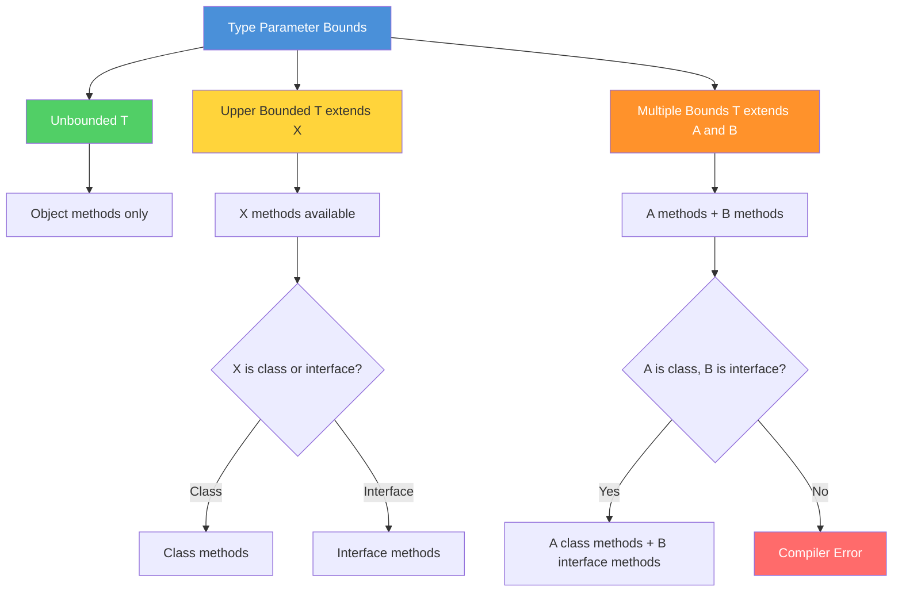

# 04 - Bounded Type Parameters

## Table of Contents

1. [Introduction](#introduction)
2. [Learning Objectives](#learning-objectives)
3. [Prerequisites](#prerequisites)
4. [Why This Concept Exists](#why-this-concept-exists)
5. [Problem Statement](#problem-statement)
6. [Theory](#theory)
7. [Internal Working](#internal-working)
8. [JVM Perspective](#jvm-perspective)
9. [Memory Representation](#memory-representation)
10. [Syntax](#syntax)
11. [Easy Example](#easy-example)
12. [Medium Example](#medium-example)
13. [Hard Example](#hard-example)
14. [Enterprise Example](#enterprise-example)
15. [Performance](#performance)
16. [Best Practices](#best-practices)
17. [Common Mistakes](#common-mistakes)
18. [Pitfalls](#pitfalls)
19. [Debugging Tips](#debugging-tips)
20. [Comparison Table](#comparison-table)
21. [Decision Tree](#decision-tree)
22. [Interview Questions](#interview-questions)
23. [Exercises](#exercises)
24. [Assignments](#assignments)
25. [Mini Project](#mini-project)
26. [Summary](#summary)
27. [References](#references)

---

## Introduction

**Bounded type parameters** restrict the types that can be used as generic arguments. By using the `extends` keyword, you can require that a type parameter must be a subclass of a specified upper bound. This enables you to call methods specific to the bound type while maintaining generic flexibility.

Bounded types are essential for writing generic code that requires specific capabilities — like `Comparable` for sorting, `Number` for arithmetic, or `Serializable` for serialization.

---

## Learning Objectives

By the end of this topic, you will be able to:

- Declare upper-bounded type parameters with `extends`
- Apply multiple bounds with `&` syntax
- Understand the difference between bounded and unbounded types
- Use recursive type bounds
- Apply bounds to enforce API contracts
- Choose appropriate bounds for generic types

---

## Prerequisites

- Generic classes and methods (Topics 02-03)
- Understanding of inheritance and interfaces
- Type erasure concepts (Topic 01)
- Basic knowledge of Java Collections

---

## Why This Concept Exists

### Without Bounded Types

```java
// Unbounded - can't call any type-specific methods
public static <T> int compare(T a, T b) {
    return a.compareTo(b);  // Compile error! T doesn't have compareTo
}

// Workaround with Object - loses type safety
public static <T> int compare(Object a, Object b) {
    return ((Comparable) a).compareTo(b);  // Unsafe cast
}
```

### With Bounded Types

```java
// Bounded - T must be Comparable
public static <T extends Comparable<T>> int compare(T a, T b) {
    return a.compareTo(b);  // OK! compareTo is guaranteed
}

// Type-safe and flexible
compare("hello", "world");  // String is Comparable
compare(1, 2);               // Integer is Comparable
// compare(new Object(), new Object());  // Compile error! Object isn't Comparable
```

---

## Problem Statement

Create generic code that:
1. Requires specific methods on the type parameter
2. Enforces contracts at compile time
3. Supports multiple constraints (e.g., `Number` AND `Comparable`)
4. Enables recursive type relationships
5. Maintains flexibility while ensuring safety

---

## Theory

### Upper Bounded Type Parameters

The `extends` keyword specifies an upper bound:

```java
// T must be Number or a subclass of Number
public static <T extends Number> double square(T value) {
    return value.doubleValue() * value.doubleValue();
}

// T must be Comparable<T> or implement it
public static <T extends Comparable<T>> T max(T a, T b) {
    return a.compareTo(b) > 0 ? a : b;
}
```

### Bounds Hierarchy Diagram



### Multiple Bounds

Use `&` to specify multiple bounds:

```java
// T must extend Number AND implement Comparable
public static <T extends Number & Comparable<T>> T max(List<T> list) {
    T max = list.get(0);
    for (T item : list) {
        if (item.compareTo(max) > 0) {
            max = item;
        }
    }
    return max;
}
```

**Rules:**
- First bound can be a class (if any)
- Subsequent bounds must be interfaces
- `extends` is used for both classes and interfaces in generic bounds

### Recursive Type Bounds

A type parameter can bound itself:

```java
// T must implement Comparable<T> (comparable to itself)
public static <T extends Comparable<T>> void sort(T[] array) {
    Arrays.sort(array);  // OK: T implements Comparable<T>
}
```

### Upper Bounded Wildcards vs Type Parameters

```java
// Type parameter - you need to CREATE or MODIFY values
public static <T extends Comparable<T>> T max(T a, T b) {
    return a.compareTo(b) > 0 ? a : b;  // Need T for return
}

// Wildcard - you only READ values
public static boolean isGreater(Comparable<?> a, Comparable<?> b) {
    return a.compareTo(b) > 0;  // Don't need T for return
}
```

---

## Internal Working

### Compiler Actions

```java
// Source
public static <T extends Number> double sum(List<T> list) {
    return list.stream().mapToDouble(Number::doubleValue).sum();
}

List<Integer> ints = List.of(1, 2, 3);
double result = sum(ints);
```

**Compiler steps:**
1. **Verify bound** — `Integer extends Number` ✓
2. **Type check** — `List<Integer>` matches `List<T>` where `T extends Number` ✓
3. **Erase bound** — Replace `T` with `Number` (the upper bound)
4. **Insert cast** — Add `(Number)` cast where needed

### Bytecode After Erasure

```java
// What the JVM sees
public static double sum(List list) {
    return list.stream()
               .mapToDouble(((Number) x -> x).doubleValue())
               .sum();
}
```

### Multiple Bounds Erasure

```java
// Source
public static <T extends Number & Comparable<T>> T max(List<T> list) { ... }

// After erasure - T becomes Number (first bound)
public static Number max(List list) { ... }
```

---

## JVM Perspective

### Bound Information in Bytecode

```java
public class NumberBox<T extends Number> {
    private T value;
}

// Bytecode signature
// Signature: LNumberBox<TT;>;  where T:Ljava/lang/Number;
// The bound is preserved in the Signature attribute
```

### Runtime Verification

```java
// Bounds are checked at compile time AND runtime (for generic types)
Box<Number> box = new Box<>();
box.setValue(42);      // OK
box.setValue(3.14);    // OK

// But this fails at runtime (due to type erasure workarounds):
// box.setValue("hello");  // Compile error, but runtime would succeed
// The bound prevents this at compile time
```

---

## Memory Representation

### Bounded vs Unbounded

```java
Box<Number> bounded = new Box<>();
Box<Object> unbounded = new Box<>();
```

**Memory layout:**
```
Both have IDENTICAL layout:
┌─────────────────────────┐
│ Object header (16 bytes)│
│ value: Object reference │
└─────────────────────────┘

The bound affects:
- Which methods can be called (compile time)
- What types can be assigned (compile time)
- NOT memory layout or performance
```

---

## Syntax

### Basic Upper Bound

```java
public class ClassName<T extends BoundType> {
    // T is bounded by BoundType
}

public static <T extends BoundType> ReturnType method(T param) {
    // T is bounded by BoundType
}
```

### Multiple Bounds

```java
public class ClassName<T extends ClassA & InterfaceB & InterfaceC> {
    // T extends ClassA AND implements InterfaceB AND InterfaceC
}

// Order matters: class first, then interfaces
public static <T extends Number & Comparable<T> & Serializable> T method(T param) {
    // T is Number, Comparable, and Serializable
}
```

### Recursive Bound

```java
public static <T extends Comparable<T>> T max(T a, T b) {
    return a.compareTo(b) > 0 ? a : b;
}

// T must be comparable to itself
```

### Wildcard Bounds (Preview for Topic 05)

```java
// Upper bounded wildcard
public static double sum(List<? extends Number> list) {
    return list.stream().mapToDouble(Number::doubleValue).sum();
}
```

---

## Easy Example

### Basic Bounded Type

```java
public class BoundedBox<T extends Number> {
    private T value;

    public BoundedBox(T value) {
        this.value = value;
    }

    public T getValue() {
        return value;
    }

    public double doubleValue() {
        return value.doubleValue();  // OK: Number has doubleValue()
    }

    public int intValue() {
        return value.intValue();  // OK: Number has intValue()
    }

    public static void main(String[] args) {
        BoundedBox<Integer> intBox = new BoundedBox<>(42);
        BoundedBox<Double> doubleBox = new BoundedBox<>(3.14);
        
        System.out.println(intBox.doubleValue());   // 42.0
        System.out.println(doubleBox.doubleValue()); // 3.14
        
        // BoundedBox<String> stringBox = new BoundedBox<>("hello");
        // Compile error: String does not extend Number
    }
}
```

---

## Medium Example

### Comparable Bounded Type

```java
import java.util.List;
import java.util.Objects;

public class SortableUtil {
    
    public static <T extends Comparable<T>> T max(List<T> list) {
        Objects.requireNonNull(list);
        if (list.isEmpty()) {
            throw new IllegalArgumentException("Empty list");
        }
        
        T max = list.get(0);
        for (int i = 1; i < list.size(); i++) {
            if (list.get(i).compareTo(max) > 0) {
                max = list.get(i);
            }
        }
        return max;
    }
    
    public static <T extends Comparable<T>> T min(List<T> list) {
        Objects.requireNonNull(list);
        if (list.isEmpty()) {
            throw new IllegalArgumentException("Empty list");
        }
        
        T min = list.get(0);
        for (int i = 1; i < list.size(); i++) {
            if (list.get(i).compareTo(min) < 0) {
                min = list.get(i);
            }
        }
        return min;
    }
    
    public static <T extends Comparable<T>> boolean isSorted(List<T> list) {
        for (int i = 1; i < list.size(); i++) {
            if (list.get(i - 1).compareTo(list.get(i)) > 0) {
                return false;
            }
        }
        return true;
    }
    
    public static void main(String[] args) {
        List<String> names = List.of("Charlie", "Alice", "Bob");
        System.out.println("Max: " + max(names));  // Charlie
        System.out.println("Min: " + min(names));  // Alice
        
        List<Integer> sorted = List.of(1, 2, 3, 4, 5);
        List<Integer> unsorted = List.of(5, 3, 1, 4, 2);
        System.out.println("Sorted: " + isSorted(sorted));    // true
        System.out.println("Unsorted: " + isSorted(unsorted)); // false
    }
}
```

---

## Hard Example

### Multiple Bounds with Complex Constraints

```java
import java.io.Serializable;
import java.util.List;
import java.util.Objects;

public class AdvancedBounds {
    
    // Multiple bounds: Number + Comparable + Serializable
    public static <T extends Number & Comparable<T> & Serializable> 
            T max(List<T> list) {
        Objects.requireNonNull(list);
        if (list.isEmpty()) {
            throw new IllegalArgumentException("Empty list");
        }
        
        T max = list.get(0);
        for (int i = 1; i < list.size(); i++) {
            if (list.get(i).compareTo(max) > 0) {
                max = list.get(i);
            }
        }
        return max;
    }
    
    // Recursive bound with additional constraint
    public static <T extends Comparable<T>> void sort(List<T> list) {
        // Bubble sort using Comparable
        int n = list.size();
        for (int i = 0; i < n - 1; i++) {
            for (int j = 0; j < n - i - 1; j++) {
                if (list.get(j).compareTo(list.get(j + 1)) > 0) {
                    // Swap
                    T temp = list.get(j);
                    list.set(j, list.get(j + 1));
                    list.set(j + 1, temp);
                }
            }
        }
    }
    
    // Complex recursive bound
    public static <T extends Comparable<T>> List<T> mergeSorted(
            List<T> list1, List<T> list2) {
        List<T> result = new java.util.ArrayList<>();
        int i = 0, j = 0;
        
        while (i < list1.size() && j < list2.size()) {
            if (list1.get(i).compareTo(list2.get(j)) <= 0) {
                result.add(list1.get(i++));
            } else {
                result.add(list2.get(j++));
            }
        }
        
        while (i < list1.size()) result.add(list1.get(i++));
        while (j < list2.size()) result.add(list2.get(j++));
        
        return result;
    }
    
    public static void main(String[] args) {
        List<Integer> list1 = List.of(1, 3, 5);
        List<Integer> list2 = List.of(2, 4, 6);
        
        List<Integer> merged = mergeSorted(list1, list2);
        System.out.println("Merged: " + merged);  // [1, 2, 3, 4, 5, 6]
        
        List<Integer> unsorted = List.of(5, 3, 1, 4, 2);
        sort(unsorted);
        System.out.println("Sorted: " + unsorted);  // [1, 2, 3, 4, 5]
    }
}
```

---

## Enterprise Example

### Type-Safe Comparison Framework

```java
import java.util.Comparator;
import java.util.List;
import java.util.Objects;
import java.util.function.Function;

public final class ComparisonUtils {
    
    private ComparisonUtils() {}
    
    public static <T extends Comparable<T>> Comparator<T> naturalOrder() {
        return Comparator.naturalOrder();
    }
    
    public static <T> Comparator<T> comparing(
            Function<? super T, ? extends Comparable<?>> keyExtractor) {
        return Comparator.comparing(keyExtractor);
    }
    
    public static <T extends Comparable<T>> boolean inRange(
            T value, T min, T max) {
        return value.compareTo(min) >= 0 && value.compareTo(max) <= 0;
    }
    
    public static <T extends Number & Comparable<T>> T clamp(
            T value, T min, T max) {
        if (value.compareTo(min) < 0) return min;
        if (value.compareTo(max) > 0) return max;
        return value;
    }
    
    public static <T extends Comparable<T>> T requireInRange(
            T value, T min, T max, String name) {
        if (!inRange(value, min, max)) {
            throw new IllegalArgumentException(
                String.format("%s must be between %s and %s, got %s",
                    name, min, max, value));
        }
        return value;
    }
    
    public static <T extends Comparable<T>> int compareNullsLast(
            T a, T b) {
        if (a == null && b == null) return 0;
        if (a == null) return 1;
        if (b == null) return -1;
        return a.compareTo(b);
    }
    
    public static <T extends Comparable<T>> List<T> sortedCopy(List<T> list) {
        return list.stream()
                   .sorted()
                   .toList();
    }
    
    public static <T extends Comparable<T>> boolean isUnique(List<T> list) {
        return list.size() == list.stream().distinct().count();
    }
    
    public static void main(String[] args) {
        System.out.println(inRange(5, 1, 10));     // true
        System.out.println(inRange(15, 1, 10));    // false
        
        System.out.println(clamp(15, 0, 10));      // 10
        System.out.println(clamp(-5, 0, 10));      // 0
        System.out.println(clamp(5, 0, 10));       // 5
        
        List<String> names = List.of("Charlie", "Alice", "Bob");
        System.out.println(sortedCopy(names));  // [Alice, Bob, Charlie]
        
        System.out.println(isUnique(List.of(1, 2, 3)));  // true
        System.out.println(isUnique(List.of(1, 2, 2)));  // false
    }
}
```

---

## Performance

### Bounded vs Unbounded

| Aspect | Bounded | Unbounded |
|--------|---------|-----------|
| Compile time | Slightly more (bound checking) | Less |
| Runtime | Identical (erased) | Identical (erased) |
| Method calls | Same (virtual dispatch) | Same |
| Memory | Identical | Identical |

### Multiple Bounds Cost

```java
// Multiple bounds add compile-time checks only
public static <T extends Number & Comparable<T>> T max(T a, T b) {
    return a.compareTo(b) > 0 ? a : b;  // No runtime overhead
}
```

---

## Best Practices

1. **Use the most specific bound** — `<T extends Comparable<T>>` over `<T extends Object>`
2. **Keep bounds minimal** — Only require what you actually use
3. **Document bound rationale** — Why is this bound necessary?
4. **Prefer interfaces over classes** — More flexible for users
5. **Use recursive bounds** — When type must relate to itself

---

## Common Mistakes

### 1. Wrong Bound Order

```java
// WRONG - interface first
public static <T extends Comparable<T> & Number> T bad(T a, T b) {
    return a.compareTo(b) > 0 ? a : b;  // Compile error!
}

// RIGHT - class first
public static <T extends Number & Comparable<T>> T good(T a, T b) {
    return a.compareTo(b) > 0 ? a : b;
}
```

### 2. Over-Constraining

```java
// TOO RESTRICTIVE - only works with Number
public static <T extends Number> boolean equals(T a, T b) {
    return a.equals(b);  // Works, but why restrict to Number?
}

// BETTER - works with any Comparable
public static <T extends Comparable<T>> boolean equals(T a, T b) {
    return a.compareTo(b) == 0;
}
```

### 3. Missing Bound

```java
// WRONG - can't call compareTo
public static <T> T max(T a, T b) {
    return a.compareTo(b) > 0 ? a : b;  // Compile error!
}

// RIGHT - add Comparable bound
public static <T extends Comparable<T>> T max(T a, T b) {
    return a.compareTo(b) > 0 ? a : b;
}
```

---

## Pitfalls

### 1. Type Erasure with Bounds

```java
Box<Number> box = new Box<>();
box.setValue(42);  // OK: Integer is Number

// But you can't do this (compile error):
// box.setValue("hello");  // String is not Number
// This is enforced at compile time, not runtime!
```

### 2. Multiple Bounds and Erasure

```java
// After erasure, T becomes Number (first bound)
public static <T extends Number & Comparable<T>> T max(T a, T b) {
    // At runtime: a and b are Number, not T
    // The Comparable constraint is gone!
}
```

### 3. Wildcard Capture

```java
// This doesn't work as expected:
public static <T extends Number> void add(List<? extends Number> list, T item) {
    list.add(item);  // Compile error! Can't add to ? extends
}
```

---

## Debugging Tips

### 1. Check Bound Satisfaction

```java
// If you get "T is not within its bound"
// Check: does T satisfy ALL bounds?
public static <T extends Number & Comparable<T>> void method(T item) {
    // T must be Number AND Comparable<T>
    // If T doesn't satisfy both, you'll get a compile error
}
```

### 2. Read Error Messages

```
Error: type argument T is not within bounds of type-variable T
// T (the argument) doesn't extend the bound type
// Check your type parameter declaration
```

### 3. Use IDE Inspection

```java
// IntelliJ: Hover over type parameter to see bound
// Eclipse: Open Declaration
```

### 4. Verify with Reflection

```java
// Check generic type info
TypeVariable<?>[] typeParams = MyClass.class.getTypeParameters();
for (TypeVariable<?> param : typeParams) {
    System.out.println(param.getName() + " extends " + 
        Arrays.toString(param.getBounds()));
}
```

---

## Comparison Table

| Feature | Unbounded `<T>` | Bounded `<T extends X>` | Multiple Bounds `<T extends A & B>` |
|---------|-----------------|-------------------------|-------------------------------------|
| Flexibility | Maximum | Limited to X | Limited to A + B |
| Methods available | Object methods only | X's methods | A's + B's methods |
| Type safety | Basic | Enhanced | Most restrictive |
| Use case | Generic storage | Type-specific operations | Complex constraints |

---

## Decision Tree

```
Does your generic type need to call specific methods?
├── No → Use unbounded <T>
└── Yes → What methods?
    ├── compareTo → <T extends Comparable<T>>
    ├── doubleValue/intValue → <T extends Number>
    ├── toString → <T extends Object> (or just <T>)
    └── Multiple → <T extends A & B & C>
```

---

## Interview Questions

### Q1: What is a bounded type parameter?

**A:** A bounded type parameter restricts the types that can be used as generic arguments. Using `extends`, you specify an upper bound: `<T extends Number>` means T must be Number or a subclass of Number.

### Q2: What's the difference between `<T extends Comparable>` and `<T extends Comparable<T>>`?

**A:** `<T extends Comparable>` means T implements raw Comparable. `<T extends Comparable<T>>` means T implements Comparable<T> — it can be compared to itself. The latter is more type-safe and allows calling `compareTo(T)` without casting.

### Q3: Can you have multiple bounds?

**A:** Yes, using `&`: `<T extends Number & Comparable<T> & Serializable>`. The class (if any) must come first, followed by interfaces.

### Q4: What is a recursive type bound?

**A:** A recursive bound is when a type parameter bounds itself: `<T extends Comparable<T>>`. This means T must be comparable to instances of its own type.

### Q5: How do bounds affect type erasure?

**A:** After erasure, the type parameter is replaced by its first bound. `<T extends Number & Comparable<T>>` erases to `Number`. Subsequent bounds are erased completely.

---

## Exercises

### Exercise 1: Bounded Sum

Write a generic method `sum(List<T> list)` that returns the sum of all elements. The type parameter should be bounded to `Number`.

### Exercise 2: Comparable Search

Write a generic method `binarySearch(T[] array, T target)` that performs binary search using `Comparable`.

### Exercise 3: Multiple Bounds

Write a generic method that finds the maximum of two values, where the type must be both `Number` and `Comparable`.

---

## Assignments

### Assignment 1: Type-Safe Validator

Create a `Validator<T>` class that:
- Accepts rules that implement `Predicate<T>`
- Validates values against all rules
- Provides meaningful error messages
- Works with any type that implements `Comparable`

### Assignment 2: Generic Range

Create a `Range<T extends Comparable<T>>` class that:
- Represents a range from min to max
- Supports `contains(T value)`
- Supports `overlaps(Range<T> other)`
- Supports `intersection(Range<T> other)`
- Implements `Comparable<Range<T>>`

---

## Mini Project

### Type-Safe Math Library

Build a generic math library that works with different numeric types:

1. `MathUtils<T extends Number & Comparable<T>>` class
2. Methods: `max`, `min`, `sum`, `average`, `clamp`
3. Support for `Integer`, `Long`, `Double`, `BigDecimal`
4. Type-safe conversion methods
5. Range operations

---

## Summary

Bounded type parameters are essential for writing generic code that requires specific capabilities:

1. **`extends` keyword** — Specifies upper bound
2. **Multiple bounds** — Use `&` for multiple constraints
3. **Recursive bounds** — `<T extends Comparable<T>>` for self-referencing types
4. **Compile-time safety** — Bounds are checked at compile time
5. **No runtime overhead** — Bounds are erased at compile time

Bounded types enable type-safe operations while maintaining generic flexibility.

---

## References

- [Oracle - Bounded Type Parameters](https://docs.oracle.com/en/java/javase/21/java/generics/bounded.html)
- [Java Language Specification §4.5 - Type Parameters](https://docs.oracle.com/javase/specs/jls/se21/html/jls-4.html#jls-4.5)
- [Effective Java - Item 30: Use bounded wildcards to increase API flexibility](https://learning.oreilly.com/library/view/effective-java/9780134686097/)
- [Angelika Langer - Generics FAQ](https://www.angelikalanger.com/GenericsFAQ/)
