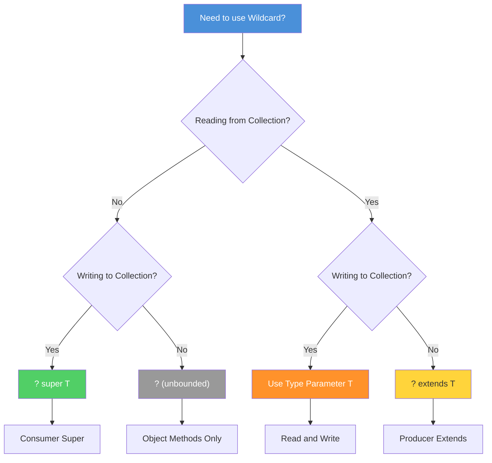

# 05 - Wildcards

## Table of Contents

1. [Introduction](#introduction)
2. [Learning Objectives](#learning-objectives)
3. [Prerequisites](#prerequisites)
4. [Why This Concept Exists](#why-this-concept-exists)
5. [Problem Statement](#problem-statement)
6. [Theory](#theory)
7. [Internal Working](#internal-working)
8. [JVM Perspective](#jvm-perspective)
9. [Memory Representation](#memory-representation)
10. [Syntax](#syntax)
11. [Easy Example](#easy-example)
12. [Medium Example](#medium-example)
13. [Hard Example](#hard-example)
14. [Enterprise Example](#enterprise-example)
15. [Performance](#performance)
16. [Best Practices](#best-practices)
17. [Common Mistakes](#common-mistakes)
18. [Pitfalls](#pitfalls)
19. [Debugging Tips](#debugging-tips)
20. [Comparison Table](#comparison-table)
21. [Decision Tree](#decision-tree)
22. [Interview Questions](#interview-questions)
23. [Exercises](#exercises)
24. [Assignments](#assignments)
25. [Mini Project](#mini-project)
26. [Summary](#summary)
27. [References](#references)

---

## Introduction

**Wildcards** (`?`) represent unknown types in generic code. They provide flexibility when you don't need to name or create the type, but only need to read from or write to a generic structure. Wildcards are essential for designing APIs that work with different generic types while maintaining type safety.

The three forms of wildcards are:
- `?` — Unbounded wildcard (unknown type)
- `? extends T` — Upper bounded wildcard (unknown type that is T or a subclass)
- `? super T` — Lower bounded wildcard (unknown type that is T or a superclass)

Wildcards are the key to understanding the **PECS principle** (Producer Extends, Consumer Super).

---

## Learning Objectives

By the end of this topic, you will be able to:

- Understand and apply all three wildcard types
- Apply the PECS principle (Producer Extends, Consumer Super)
- Perform wildcard capture for type-safe operations
- Distinguish between wildcards and type parameters
- Use wildcards for API flexibility
- Avoid common wildcard pitfalls

---

## Prerequisites

- Generic classes and methods (Topics 02-03)
- Bounded type parameters (Topic 04)
- Understanding of type erasure (Topic 01)
- Collections Framework basics

---

## Why This Concept Exists

### Without Wildcards

```java
// This method only works with List<Number>
public static double sum(List<Number> list) {
    return list.stream().mapToDouble(Number::doubleValue).sum();
}

// These DON'T work:
List<Integer> ints = List.of(1, 2, 3);
sum(ints);  // Compile error! List<Integer> is not List<Number>

List<Double> doubles = List.of(1.0, 2.0, 3.0);
sum(doubles);  // Compile error! List<Double> is not List<Number>
```

### With Wildcards

```java
// This works with ANY List of Number subclasses
public static double sum(List<? extends Number> list) {
    return list.stream().mapToDouble(Number::doubleValue).sum();
}

List<Integer> ints = List.of(1, 2, 3);
sum(ints);  // OK!

List<Double> doubles = List.of(1.0, 2.0, 3.0);
sum(doubles);  // OK!

List<Number> numbers = List.of(1, 2.0, 3L);
sum(numbers);  // OK!
```

---

## Problem Statement

Create APIs that:
1. Accept different generic types (e.g., `List<Integer>`, `List<Double>`)
2. Read values without modifying the collection
3. Write values to a collection without knowing the exact type
4. Support both reading and writing in the same method
5. Maintain compile-time type safety

---

## Theory

### Three Forms of Wildcards

#### 1. Unbounded Wildcard (`<?>`)

```java
// Accepts List of ANY type
public static void printList(List<?> list) {
    for (Object item : list) {
        System.out.println(item);
    }
}

// Can read as Object
List<String> strings = List.of("a", "b");
List<Integer> numbers = List.of(1, 2, 3);
printList(strings);  // OK
printList(numbers);  // OK
```

#### 2. Upper Bounded Wildcard (`<? extends T>`)

```java
// Accepts List of T or any subclass of T
public static double sum(List<? extends Number> list) {
    return list.stream().mapToDouble(Number::doubleValue).sum();
}

// Can read as Number (or the bound type)
List<Integer> ints = List.of(1, 2, 3);
List<Double> doubles = List.of(1.0, 2.0, 3.0);
sum(ints);     // OK
sum(doubles);  // OK
```

#### 3. Lower Bounded Wildcard (`<? super T>`)

```java
// Accepts List of T or any superclass of T
public static void addNumbers(List<? super Integer> list) {
    list.add(1);
    list.add(2);
    list.add(3);
}

// Can write Integer values
List<Integer> ints = new ArrayList<>();
List<Number> numbers = new ArrayList<>();
List<Object> objects = new ArrayList<>();
addNumbers(ints);      // OK
addNumbers(numbers);   // OK
addNumbers(objects);   // OK
```

### PECS Principle

**Producer Extends, Consumer Super:**

```java
// Producer (reading): use extends
public static <T> T getFirst(List<? extends T> list) {
    return list.get(0);  // Reading from producer
}

// Consumer (writing): use super
public static <T> void addAll(List<? super T> dest, List<? extends T> src) {
    dest.addAll(src);  // Writing to consumer
}

// Both (reading and writing): use type parameter
public static <T> void copy(List<? super T> dest, List<? extends T> src) {
    for (T item : src) {
        dest.add(item);
    }
}
```

### Wildcard Decision Tree



### Wildcard Capture

```java
// Wildcard capture allows using the captured type
public static void swap(List<?> list, int i, int j) {
    // Can't directly: list.set(i, list.get(j));  // Compile error
    
    // Use wildcard capture
    swapHelper(list, i, j);
}

private static <T> void swapHelper(List<T> list, int i, int j) {
    T temp = list.get(i);
    list.set(i, list.get(j));
    list.set(j, temp);
}
```

---

## Internal Working

### Compiler Actions

```java
// Source
public static double sum(List<? extends Number> list) {
    return list.stream().mapToDouble(Number::doubleValue).sum();
}

List<Integer> ints = List.of(1, 2, 3);
double result = sum(ints);
```

**Compiler steps:**
1. **Capture wildcard** — `? extends Number` becomes fresh type `CAP#1`
2. **Type check** — Verify `List<Integer>` is compatible with `List<CAP#1>`
3. **Insert bounds** — `CAP#1 extends Number`
4. **Erase** — Replace `CAP#1` with `Number`

### Bytecode After Erasure

```java
// What the JVM sees
public static double sum(List list) {
    return list.stream()
               .mapToDouble(((Number) x -> x).doubleValue())
               .sum();
}
```

---

## JVM Perspective

### Wildcard in Bytecode

```bash
javap -v MyClass.class | grep "Signature"
# Shows wildcard info in Signature attribute
# But JVM doesn't use it for type checking
```

### Runtime Type Information

```java
List<? extends Number> list = List.of(1, 2, 3);
// At runtime: list is just List
// The ? extends Number is erased
System.out.println(list.getClass());  // java.util.Arrays$ArrayList
```

---

## Memory Representation

### Wildcards Don't Affect Memory

```java
List<String> strings = List.of("a", "b");
List<Integer> integers = List.of(1, 2);
List<? extends Number> numbers = integers;

// All have identical memory layout
// The wildcard exists only at compile time
```

---

## Syntax

### Unbounded Wildcard

```java
public static void print(List<?> list) {
    for (Object item : list) {
        System.out.println(item);
    }
}

public static boolean isEmpty(Collection<?> collection) {
    return collection.isEmpty();
}
```

### Upper Bounded Wildcard

```java
public static double sum(List<? extends Number> list) {
    return list.stream().mapToDouble(Number::doubleValue).sum();
}

public static <T extends Comparable<T>> T max(List<? extends T> list) {
    return list.stream().max(Comparable::compareTo).orElseThrow();
}
```

### Lower Bounded Wildcard

```java
public static void addNumbers(List<? super Integer> list) {
    list.add(1);
    list.add(2);
}

public static <T> void copy(List<? super T> dest, List<? extends T> src) {
    dest.addAll(src);
}
```

### Multiple Bounds with Wildcards

```java
public static <T extends Number & Comparable<T>> T max(List<? extends T> list) {
    return list.stream().max(Comparable::compareTo).orElseThrow();
}
```

---

## Easy Example

### Basic Wildcard Usage

```java
import java.util.List;

public class WildcardBasics {
    
    public static void printList(List<?> list) {
        for (Object item : list) {
            System.out.println(item);
        }
    }
    
    public static double sum(List<? extends Number> list) {
        double total = 0;
        for (Number num : list) {
            total += num.doubleValue();
        }
        return total;
    }
    
    public static void addIntegers(List<? super Integer> list) {
        list.add(1);
        list.add(2);
        list.add(3);
    }
    
    public static void main(String[] args) {
        // Unbounded wildcard
        List<String> names = List.of("Alice", "Bob");
        List<Integer> numbers = List.of(1, 2, 3);
        printList(names);   // OK
        printList(numbers); // OK
        
        // Upper bounded wildcard
        List<Integer> ints = List.of(1, 2, 3);

---

[📖 Continue to Part 2](README-part2.md)
 | [📖 Continue to Part 3](README-part3.md)
