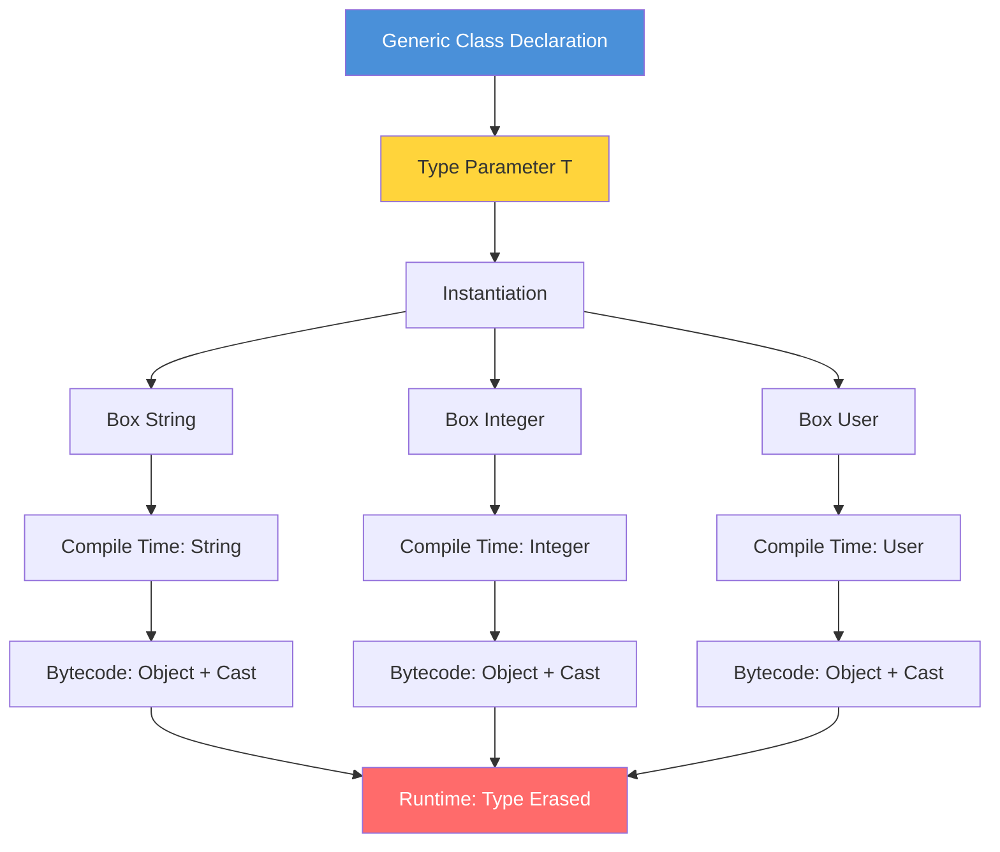

# Introduction to Generics

## Table of Contents

1. [Introduction](#introduction)
2. [Learning Objectives](#learning-objectives)
3. [Prerequisites](#prerequisites)
4. [Why This Concept Exists](#why-this-concept-exists)
5. [Problem Statement](#problem-statement)
6. [Theory](#theory)
7. [Internal Working](#internal-working)
8. [JVM Perspective](#jvm-perspective)
9. [Memory Representation](#memory-representation)
10. [Syntax](#syntax)
11. [Easy Example](#easy-example)
12. [Medium Example](#medium-example)
13. [Hard Example](#hard-example)
14. [Enterprise Example](#enterprise-example)
15. [Performance](#performance)
16. [Best Practices](#best-practices)
17. [Common Mistakes](#common-mistakes)
18. [Pitfalls](#pitfalls)
19. [Debugging Tips](#debugging-tips)
20. [Comparison Table](#comparison-table)
21. [Decision Tree](#decision-tree)
22. [Interview Questions](#interview-questions)
23. [Exercises](#exercises)
24. [Assignments](#assignments)
25. [Mini Project](#mini-project)
26. [Summary](#summary)
27. [References](#references)

---

## Introduction

Before Java 5, every collection stored `Object` references. You'd put a `String` in a `List`, pull it out, and cast it — hoping you remembered what type you put in. If a teammate stored an `Integer` where you expected a `String`, your code would compile fine and blow up at runtime with a `ClassCastException`. Generics moved that check from runtime to compile time: the compiler now catches type mismatches before you ever run the code.

But generics come with a catch — literally. The JVM doesn't know about generics. It sees `Box<String>` and `Box<Integer>` as the same raw `Box` type. Type erasure means your generic type information is thrown away after compilation. This creates real limitations: you can't do `new T()`, you can't check `instanceof T`, and arrays of generic types are forbidden. Understanding these constraints upfront saves you from debugging cryptic errors later.

## Learning Objectives

By the end of this topic you will be able to:

- Explain why generics exist and what problem they solve compared to raw types.
- Write a generic class, interface, and method with proper type bounds.
- Understand type erasure: what the compiler does, what the JVM sees, and what you can't do.
- Use bounded wildcards (`? extends`, `? super`) to write flexible APIs without breaking type safety.
- Avoid the five most common generic pitfalls: raw types, generic arrays, overusing wildcards, ignoring erasure, and unchecked casts.
- Diagnose ClassCastException at runtime and trace it back to missing generic parameters.

## Prerequisites

- Object-Oriented Programming (inheritance, polymorphism)
- Java Collections basics (List, Set, Map)
- Interface and abstract class concepts
- Basic understanding of casting in Java

---

## History

| Version | Change |
|---------|--------|
| JDK 5 | Generics introduced — Java added compile-time type safety to collections, eliminating manual casting and ClassCastException at runtime |

### Before Generics (Java 1.4 and earlier)

```java
// Pre-generics: Everything was Object
public class Box {
    private Object object;

    public void set(Object object) {
        this.object = object;
    }

    public Object get() {
        return object;
    }
}
```

**Problems:**
1. **No type safety** — you could put a `String` in a box intended for `Integer`
2. **Explicit casting required** — `(String) box.get()` could throw `ClassCastException`
3. **Runtime errors** — type mismatches discovered only during execution
4. **Poor readability** — code intent was unclear without type information

### After Generics (Java 5+)

```java
// Post-generics: Type-safe
public class Box<T> {
    private T object;

    public void set(T object) {
        this.object = object;
    }

    public T get() {
        return object;
    }
}
```

**Solutions:**
1. **Compile-time type checking** — wrong types caught immediately
2. **No explicit casting** — compiler inserts casts automatically
3. **Clearer code** — `Box<String>` communicates intent directly
4. **Reusability** — one class works for all types

---

## Problem Statement

Consider building a repository that stores different entity types:

```java
// WITHOUT generics
public class UserRepository {
    private List users = new ArrayList();

    public void save(Object user) {
        users.add(user);
    }

    public Object findById(int id) {
        return users.get(id); // Returns Object - caller must cast
    }
}

// Usage
UserRepository repo = new UserRepository();
repo.save(new User("Alice"));
User user = (User) repo.findById(0); // Risky cast!

// This compiles but fails at runtime:
repo.save("not a user"); // String accepted silently
```

**The core problem:** The compiler cannot enforce what types are stored or retrieved, leading to runtime `ClassCastException`.

---

## Theory

### Type Parameter Diagram



### Type Parameters

A **type parameter** is a name that acts as a placeholder for an actual type:

```java
class Box<T> {  // T is a type parameter
    private T value;  // T is used as a type
}
```

**Naming conventions:**
| Letter | Meaning | Example |
|--------|---------|---------|
| `T` | Type | Generic class |
| `E` | Element | Collections |
| `K` | Key | Maps |
| `V` | Value | Maps |
| `N` | Number | Numeric generics |
| `R` | Return | Functional interfaces |

### Parameterized Types

When you use a generic type, you **parameterize** it with an actual type:

```java
Box<String> stringBox = new Box<>();  // String replaces T
Box<Integer> intBox = new Box<>();     // Integer replaces T
```

### Type Inference

The compiler can infer type parameters from context:

```java
// Java 7+: Diamond operator <>
Box<String> box = new Box<>();  // Compiler infers Box<String>

// Java 8+: Target type inference
List<String> list = List.of("a", "b", "c");  // Inferred from context
```

### Raw Types

A **raw type** is a generic type used without type arguments:

```java
Box rawBox = new Box();         // Raw type (pre-Java 5 style)
Box<String> safeBox = new Box<>(); // Parameterized type (correct)
```

Raw types exist for backward compatibility but should be avoided.

---

## Internal Working

### Compiler Actions

When you write generic code, the compiler performs these steps:

1. **Type checking** — Verifies all uses of type parameters are consistent
2. **Type erasure** — Replaces type parameters with their bounds (or `Object`)
3. **Cast insertion** — Adds necessary casts for type safety
4. **Bridge methods** — Generates synthetic methods for polymorphism

```
Source Code                Compiler                  Bytecode
─────────────────────────────────────────────────────────────
Box<String>         →    Box (raw)           →     Box.class
box.get()           →    (String) box.get()  →     invokevirtual
box.set("hello")    →    box.set("hello")    →     invokevirtual
```

### Erasure Rules

