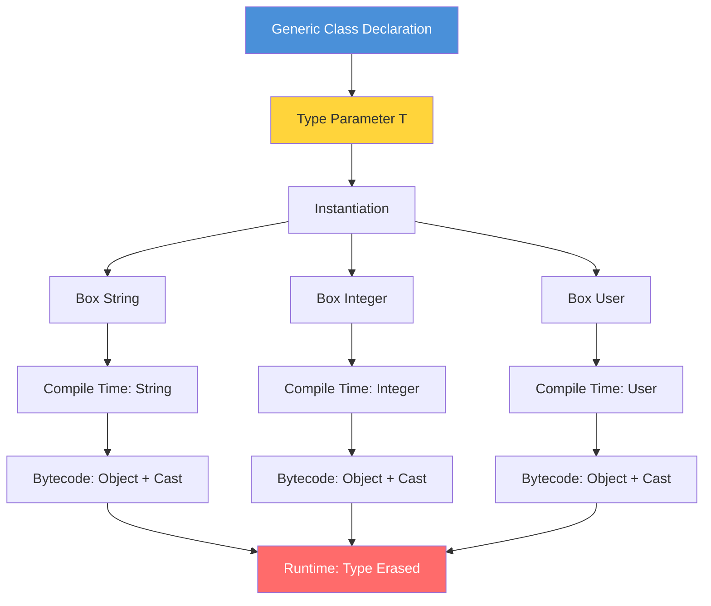

# 01 - Introduction to Generics

## Table of Contents

1. [Introduction](#introduction)
2. [Learning Objectives](#learning-objectives)
3. [Prerequisites](#prerequisites)
4. [Why This Concept Exists](#why-this-concept-exists)
5. [Problem Statement](#problem-statement)
6. [Theory](#theory)
7. [Internal Working](#internal-working)
8. [JVM Perspective](#jvm-perspective)
9. [Memory Representation](#memory-representation)
10. [Syntax](#syntax)
11. [Easy Example](#easy-example)
12. [Medium Example](#medium-example)
13. [Hard Example](#hard-example)
14. [Enterprise Example](#enterprise-example)
15. [Performance](#performance)
16. [Best Practices](#best-practices)
17. [Common Mistakes](#common-mistakes)
18. [Pitfalls](#pitfalls)
19. [Debugging Tips](#debugging-tips)
20. [Comparison Table](#comparison-table)
21. [Decision Tree](#decision-tree)
22. [Interview Questions](#interview-questions)
23. [Exercises](#exercises)
24. [Assignments](#assignments)
25. [Mini Project](#mini-project)
26. [Summary](#summary)
27. [References](#references)

---

## Introduction

Generics is one of the most powerful features introduced in Java 5 (JDK 1.5). It allows you to define classes, interfaces, and methods with **type parameters** — placeholders that are replaced with actual types when the code is used. Before generics, Java relied on `Object` references and explicit casting, which was error-prone and shifted type-checking from compile time to runtime.

Generics enable **compile-time type safety**, **code reusability**, and **elimination of explicit casts**. They are foundational to the Java Collections Framework and are used extensively throughout the Java ecosystem.

---

## Learning Objectives

By the end of this topic, you will be able to:

- Explain why generics were introduced in Java
- Distinguish between raw types and parameterized types
- Write basic generic classes and methods
- Understand type inference and diamond operator
- Identify type safety benefits over pre-generics code
- Recognize the relationship between generics and type erasure

---

## Prerequisites

- Object-Oriented Programming (inheritance, polymorphism)
- Java Collections basics (List, Set, Map)
- Interface and abstract class concepts
- Basic understanding of casting in Java

---

## Why This Concept Exists

### Before Generics (Java 1.4 and earlier)

```java
// Pre-generics: Everything was Object
public class Box {
    private Object object;

    public void set(Object object) {
        this.object = object;
    }

    public Object get() {
        return object;
    }
}
```

**Problems:**
1. **No type safety** — you could put a `String` in a box intended for `Integer`
2. **Explicit casting required** — `(String) box.get()` could throw `ClassCastException`
3. **Runtime errors** — type mismatches discovered only during execution
4. **Poor readability** — code intent was unclear without type information

### After Generics (Java 5+)

```java
// Post-generics: Type-safe
public class Box<T> {
    private T object;

    public void set(T object) {
        this.object = object;
    }

    public T get() {
        return object;
    }
}
```

**Solutions:**
1. **Compile-time type checking** — wrong types caught immediately
2. **No explicit casting** — compiler inserts casts automatically
3. **Clearer code** — `Box<String>` communicates intent directly
4. **Reusability** — one class works for all types

---

## Problem Statement

Consider building a repository that stores different entity types:

```java
// WITHOUT generics
public class UserRepository {
    private List users = new ArrayList();

    public void save(Object user) {
        users.add(user);
    }

    public Object findById(int id) {
        return users.get(id); // Returns Object - caller must cast
    }
}

// Usage
UserRepository repo = new UserRepository();
repo.save(new User("Alice"));
User user = (User) repo.findById(0); // Risky cast!

// This compiles but fails at runtime:
repo.save("not a user"); // String accepted silently
```

**The core problem:** The compiler cannot enforce what types are stored or retrieved, leading to runtime `ClassCastException`.

---

## Theory

### Type Parameter Diagram



### Type Parameters

A **type parameter** is a name that acts as a placeholder for an actual type:

```java
class Box<T> {  // T is a type parameter
    private T value;  // T is used as a type
}
```

**Naming conventions:**
| Letter | Meaning | Example |
|--------|---------|---------|
| `T` | Type | Generic class |
| `E` | Element | Collections |
| `K` | Key | Maps |
| `V` | Value | Maps |
| `N` | Number | Numeric generics |
| `R` | Return | Functional interfaces |

### Parameterized Types

When you use a generic type, you **parameterize** it with an actual type:

```java
Box<String> stringBox = new Box<>();  // String replaces T
Box<Integer> intBox = new Box<>();     // Integer replaces T
```

### Type Inference

The compiler can infer type parameters from context:

```java
// Java 7+: Diamond operator <>
Box<String> box = new Box<>();  // Compiler infers Box<String>

// Java 8+: Target type inference
List<String> list = List.of("a", "b", "c");  // Inferred from context
```

### Raw Types

A **raw type** is a generic type used without type arguments:

```java
Box rawBox = new Box();         // Raw type (pre-Java 5 style)
Box<String> safeBox = new Box<>(); // Parameterized type (correct)
```

Raw types exist for backward compatibility but should be avoided.

---

## Internal Working

### Compiler Actions

When you write generic code, the compiler performs these steps:

1. **Type checking** — Verifies all uses of type parameters are consistent
2. **Type erasure** — Replaces type parameters with their bounds (or `Object`)
3. **Cast insertion** — Adds necessary casts for type safety
4. **Bridge methods** — Generates synthetic methods for polymorphism

```
Source Code                Compiler                  Bytecode
─────────────────────────────────────────────────────────────
Box<String>         →    Box (raw)           →     Box.class
box.get()           →    (String) box.get()  →     invokevirtual
box.set("hello")    →    box.set("hello")    →     invokevirtual
```

### Erasure Rules

| Type Parameter | Erases To |
|----------------|-----------|
| `<T>` | `Object` |
| `<T extends Number>` | `Number` |
| `<T extends Comparable>` | `Comparable` |
| `? extends Number` | `Number` |
| `? super Integer` | `Object` |

---

## JVM Perspective

The JVM has **no knowledge of generics**. All generic type information is erased at compile time.

### What the JVM Sees

```java
// You write:
List<String> list = new ArrayList<>();
list.add("hello");
String s = list.get(0);

// JVM sees:
List list = new ArrayList();
list.add("hello");
String s = (String) list.get(0);  // Compiler inserted cast
```

### Bytecode Verification

```bash
# Compile generic code
javac -d out src/Box.java

# View bytecode
javap -c out/Box.class

# Output shows Object references, not String
# T is replaced by Object in the bytecode
```

### Reflection Limitations

```java
Box<String> box = new Box<>();

// This will NOT work as expected:
Field field = Box.class.getDeclaredField("value");
field.set(box, 42);  // Allowed! Type erasure means field type is Object

// You cannot do:
// Box<String>.class  // Compile error
// T.class            // Compile error
// instanceof T       // Compile error
```

---

## Memory Representation

### Object Layout

```java
Box<String> box = new Box<>();
box.set("hello");
```

**Memory layout (simplified):**
```
Heap:
┌─────────────────────────┐
│ Box instance            │
├─────────────────────────┤
│ Object header (16 bytes)│
│ value: reference ───────┼──→ String "hello"
└─────────────────────────┘
```

### Generics Don't Affect Memory

```java
Box<String> stringBox = new Box<>();
Box<Integer> intBox = new Box<>();
Box<List<Integer>> genericBox = new Box<>();

// All three Box objects have IDENTICAL memory layout
// The type parameter exists only at compile time
```

### Arrays and Generics

```java
// This is ILLEGAL:
// String[] strings = new String[10];  // OK
// Box<String>[] boxes = new Box<String>[10];  // Compile error!

// Why? Arrays carry reified type information at runtime
// But generics use type erasure — they are incompatible

// Workaround:
@SuppressWarnings("unchecked")
Box<String>[] boxes = (Box<String>[]) new Box[10];
```

---

## Syntax

### Generic Class Declaration

```java
// Single type parameter
public class Box<T> {
    private T content;
    
    public T getContent() { return content; }
    public void setContent(T content) { this.content = content; }
}

// Multiple type parameters
public class Pair<K, V> {
    private K key;
    private V value;
    
    public Pair(K key, V value) {
        this.key = key;
        this.value = value;
    }
}
```

### Generic Interface Declaration

```java
public interface Repository<T, ID> {
    T findById(ID id);
    List<T> findAll();
    void save(T entity);
    void delete(T entity);
}
```

### Generic Method Declaration

```java
public class Utility {
    public static <T> List<T> asList(T... elements) {
        return Arrays.asList(elements);
    }
}

---

[📖 Continue to Part 2](README-part2.md)
 | [📖 Continue to Part 3](README-part3.md)
```
