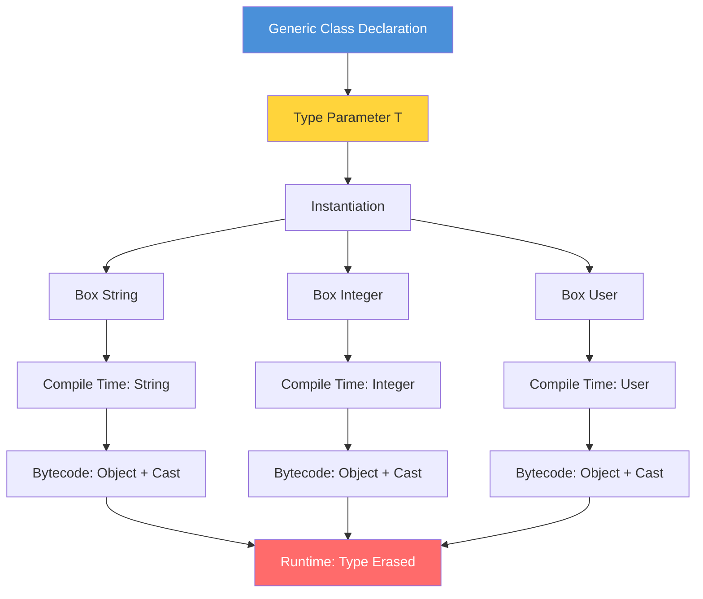

# Introduction to Generics

## Table of Contents

1. [Introduction](#introduction)
2. [Learning Objectives](#learning-objectives)
3. [Prerequisites](#prerequisites)
4. [Why This Concept Exists](#why-this-concept-exists)
5. [Problem Statement](#problem-statement)
6. [Theory](#theory)
7. [Internal Working](#internal-working)
8. [JVM Perspective](#jvm-perspective)
9. [Memory Representation](#memory-representation)
10. [Syntax](#syntax)
11. [Easy Example](#easy-example)
12. [Medium Example](#medium-example)
13. [Hard Example](#hard-example)
14. [Enterprise Example](#enterprise-example)
15. [Performance](#performance)
16. [Best Practices](#best-practices)
17. [Common Mistakes](#common-mistakes)
18. [Pitfalls](#pitfalls)
19. [Debugging Tips](#debugging-tips)
20. [Comparison Table](#comparison-table)
21. [Decision Tree](#decision-tree)
22. [Interview Questions](#interview-questions)
23. [Exercises](#exercises)
24. [Assignments](#assignments)
25. [Mini Project](#mini-project)
26. [Summary](#summary)
27. [References](#references)

---

## Introduction

Before Java 5, every collection stored `Object` references. You'd put a `String` in a `List`, pull it out, and cast it — hoping you remembered what type you put in. If a teammate stored an `Integer` where you expected a `String`, your code would compile fine and blow up at runtime with a `ClassCastException`. Generics moved that check from runtime to compile time: the compiler now catches type mismatches before you ever run the code.

But generics come with a catch — literally. The JVM doesn't know about generics. It sees `Box<String>` and `Box<Integer>` as the same raw `Box` type. Type erasure means your generic type information is thrown away after compilation. This creates real limitations: you can't do `new T()`, you can't check `instanceof T`, and arrays of generic types are forbidden. Understanding these constraints upfront saves you from debugging cryptic errors later.

## Learning Objectives

By the end of this topic you will be able to:

- Explain why generics exist and what problem they solve compared to raw types.
- Write a generic class, interface, and method with proper type bounds.
- Understand type erasure: what the compiler does, what the JVM sees, and what you can't do.
- Use bounded wildcards (`? extends`, `? super`) to write flexible APIs without breaking type safety.
- Avoid the five most common generic pitfalls: raw types, generic arrays, overusing wildcards, ignoring erasure, and unchecked casts.
- Diagnose ClassCastException at runtime and trace it back to missing generic parameters.

## Prerequisites

- Object-Oriented Programming (inheritance, polymorphism)
- Java Collections basics (List, Set, Map)
- Interface and abstract class concepts
- Basic understanding of casting in Java

---

## Why This Concept Exists

### Before Generics (Java 1.4 and earlier)

```java
// Pre-generics: Everything was Object
public class Box {
    private Object object;

    public void set(Object object) {
        this.object = object;
    }

    public Object get() {
        return object;
    }
}
```

**Problems:**
1. **No type safety** — you could put a `String` in a box intended for `Integer`
2. **Explicit casting required** — `(String) box.get()` could throw `ClassCastException`
3. **Runtime errors** — type mismatches discovered only during execution
4. **Poor readability** — code intent was unclear without type information

### After Generics (Java 5+)

```java
// Post-generics: Type-safe
public class Box<T> {
    private T object;

    public void set(T object) {
        this.object = object;
    }

    public T get() {
        return object;
    }
}
```

**Solutions:**
1. **Compile-time type checking** — wrong types caught immediately
2. **No explicit casting** — compiler inserts casts automatically
3. **Clearer code** — `Box<String>` communicates intent directly
4. **Reusability** — one class works for all types

---

## Problem Statement

Consider building a repository that stores different entity types:

```java
// WITHOUT generics
public class UserRepository {
    private List users = new ArrayList();

    public void save(Object user) {
        users.add(user);
    }

    public Object findById(int id) {
        return users.get(id); // Returns Object - caller must cast
    }
}

// Usage
UserRepository repo = new UserRepository();
repo.save(new User("Alice"));
User user = (User) repo.findById(0); // Risky cast!

// This compiles but fails at runtime:
repo.save("not a user"); // String accepted silently
```

**The core problem:** The compiler cannot enforce what types are stored or retrieved, leading to runtime `ClassCastException`.

---

## Theory

### Type Parameter Diagram



### Type Parameters

A **type parameter** is a name that acts as a placeholder for an actual type:

```java
class Box<T> {  // T is a type parameter
    private T value;  // T is used as a type
}
```

**Naming conventions:**
| Letter | Meaning | Example |
|--------|---------|---------|
| `T` | Type | Generic class |
| `E` | Element | Collections |
| `K` | Key | Maps |
| `V` | Value | Maps |
| `N` | Number | Numeric generics |
| `R` | Return | Functional interfaces |

### Parameterized Types

When you use a generic type, you **parameterize** it with an actual type:

```java
Box<String> stringBox = new Box<>();  // String replaces T
Box<Integer> intBox = new Box<>();     // Integer replaces T
```

### Type Inference

The compiler can infer type parameters from context:

```java
// Java 7+: Diamond operator <>
Box<String> box = new Box<>();  // Compiler infers Box<String>

// Java 8+: Target type inference
List<String> list = List.of("a", "b", "c");  // Inferred from context
```

### Raw Types

A **raw type** is a generic type used without type arguments:

```java
Box rawBox = new Box();         // Raw type (pre-Java 5 style)
Box<String> safeBox = new Box<>(); // Parameterized type (correct)
```

Raw types exist for backward compatibility but should be avoided.

---

## Internal Working

### Compiler Actions

When you write generic code, the compiler performs these steps:

1. **Type checking** — Verifies all uses of type parameters are consistent
2. **Type erasure** — Replaces type parameters with their bounds (or `Object`)
3. **Cast insertion** — Adds necessary casts for type safety
4. **Bridge methods** — Generates synthetic methods for polymorphism

```
Source Code                Compiler                  Bytecode
─────────────────────────────────────────────────────────────
Box<String>         →    Box (raw)           →     Box.class
box.get()           →    (String) box.get()  →     invokevirtual
box.set("hello")    →    box.set("hello")    →     invokevirtual
```

### Erasure Rules

| Type Parameter | Erases To |
|----------------|-----------|
| `<T>` | `Object` |
| `<T extends Number>` | `Number` |
| `<T extends Comparable>` | `Comparable` |
| `? extends Number` | `Number` |
| `? super Integer` | `Object` |

---

## JVM Perspective

The JVM has **no knowledge of generics**. All generic type information is erased at compile time.

### What the JVM Sees

```java
// You write:
List<String> list = new ArrayList<>();
list.add("hello");
String s = list.get(0);

// JVM sees:
List list = new ArrayList();
list.add("hello");
String s = (String) list.get(0);  // Compiler inserted cast
```

### Bytecode Verification

```bash
# Compile generic code
javac -d out src/Box.java

# View bytecode
javap -c out/Box.class

# Output shows Object references, not String
# T is replaced by Object in the bytecode
```

### Reflection Limitations

```java
Box<String> box = new Box<>();

// This will NOT work as expected:
Field field = Box.class.getDeclaredField("value");
field.set(box, 42);  // Allowed! Type erasure means field type is Object

// You cannot do:
// Box<String>.class  // Compile error
// T.class            // Compile error
// instanceof T       // Compile error
```

---

## Memory Representation

### Object Layout

```java
Box<String> box = new Box<>();
box.set("hello");
```

**Memory layout (simplified):**
```
Heap:
┌─────────────────────────┐
│ Box instance            │
├─────────────────────────┤
│ Object header (16 bytes)│
│ value: reference ───────┼──→ String "hello"
└─────────────────────────┘
```

### Generics Don't Affect Memory

```java
Box<String> stringBox = new Box<>();
Box<Integer> intBox = new Box<>();
Box<List<Integer>> genericBox = new Box<>();

// All three Box objects have IDENTICAL memory layout
// The type parameter exists only at compile time
```

### Arrays and Generics

```java
// This is ILLEGAL:
// String[] strings = new String[10];  // OK
// Box<String>[] boxes = new Box<String>[10];  // Compile error!

// Why? Arrays carry reified type information at runtime
// But generics use type erasure — they are incompatible

// Workaround:
@SuppressWarnings("unchecked")
Box<String>[] boxes = (Box<String>[]) new Box[10];
```

---

## Syntax

### Generic Class Declaration

```java
// Single type parameter
public class Box<T> {
    private T content;
    
    public T getContent() { return content; }
    public void setContent(T content) { this.content = content; }
}

// Multiple type parameters
public class Pair<K, V> {
    private K key;
    private V value;
    
    public Pair(K key, V value) {
        this.key = key;
        this.value = value;
    }
}
```

### Generic Interface Declaration

```java
public interface Repository<T, ID> {
    T findById(ID id);
    List<T> findAll();
    void save(T entity);
    void delete(T entity);
}
```

### Generic Method Declaration

```java
import java.util.Arrays;
import java.util.List;

public class Utility {
    public static <T> List<T> asList(T... elements) {
        return Arrays.asList(elements);
    }

    public static <T extends Comparable<T>> T max(T a, T b) {
        return a.compareTo(b) >= 0 ? a : b;
    }

    public static <T> void swap(T[] array, int i, int j) {
        T temp = array[i];
        array[i] = array[j];
        array[j] = temp;
    }
}
```

---

## When NOT to Use Generics

- **Simple types with no polymorphism**: If you only ever work with one type, a specific class is clearer.
- **Runtime type information is needed**: Type erasure means you can't inspect `T` at runtime. Use `Class<T>` tokens or reified generics patterns instead.
- **Performance-critical code with heavy boxing**: Generic collections box primitives. For numeric computation, use `IntStream` or primitive arrays.
- **Legacy codebases with raw types everywhere**: Introducing generics into a massive legacy codebase may require touching hundreds of files. Migrate incrementally.

## Trade-offs

- **Type safety vs. verbosity**: Generics catch errors at compile time but add syntax noise. `Map<String, List<Integer>>` is safer but harder to read than `Map`.
- **Erasure vs. flexibility**: Type erasure keeps bytecode compatible with pre-Java 5 but prevents runtime type checks. You gain backward compatibility at the cost of runtime introspection.
- **Bounded wildcards vs. simplicity**: `List<? extends Number>` is flexible but confuses developers. Use it for API consumers; use concrete types internally.

## Engineering Decision Framework

### ✅ Use Generics when:
- Type safety at compile time is critical
- Writing reusable code that works with multiple types
- Building collections or data structures
- API design that should prevent ClassCastException
- Creating type-safe builder patterns

### ❌ Avoid Generics when:
- Simple types with no polymorphism needed
- Performance-critical code where type erasure adds overhead
- Working with legacy code that uses raw types
- Runtime type information is required (type erasure limitation)

### Better Alternatives

| Alternative | When to use |
|-------------|-------------|
| Object casting | Legacy code, one-off type conversions |
| Specific typed classes | When only one type is ever used |
| var (Java 10+) | Local variable type inference |
| Annotation processing | Compile-time code generation |

### Production Examples
- Repository pattern with generic entity types
- Type-safe HTTP client responses
- Generic event handling systems
- Collections framework (List<T>, Map<K,V>)
- Generic DAO/Service base classes

### Common Production Mistakes
- Using raw types (loses type safety)
- Overusing wildcards (makes API hard to understand)
- Ignoring type erasure limitations (T.class won't work)
- Creating generic arrays (not allowed due to reification)
- Not using bounded types when constraints exist

## Production Incidents

### Incident 1: Type Erasure Causing ClassCastException

**Problem:** A deserialization service crashed at runtime with `ClassCastException: java.lang.Integer cannot be cast to java.lang.String`.
**Cause:** A generic class `Box<T>` was used with raw types in an intermediate version of the code. When `Box rawBox = (Box) getBox()` was called, type information was lost. The raw type cast allowed an `Integer` to be placed in what the caller expected to be a `String` box.
**Impact:** Production service crashed intermittently when processing specific data types. Debugging took 2 days due to intermittent nature.
**Detection:** Runtime exception logs showed ClassCastException at unexpected locations.
**Solution:** Replace all raw types with parameterized types. Add `@SuppressWarnings("unchecked")` only where unavoidable and add explicit comments. Enable compiler warnings for raw type usage.
**Prevention:** Enable `-Xlint:unchecked` compiler warnings. Use static analysis (ErrorProne) to detect raw type usage. Enforce generics in code review guidelines.

### Incident 2: Raw Types Causing Runtime Errors

**Problem:** A configuration management system stored incorrect values, causing production deployments to fail silently.
**Cause:** A `Map` was declared without type parameters (`Map config = new HashMap()`). Values of mixed types (String, Integer, Boolean) were stored without type checking. A `ClassCastException` occurred when code assumed all values were Strings.
**Impact:** Wrong configuration values deployed to production. 500+ user accounts affected. Rollback required.
**Detection:** Users reported unexpected behavior. Logs showed ClassCastException in configuration parsing code.
**Solution:** Replace `Map` with `Map<String, Object>` and add explicit type checks when retrieving values. Better yet, use `Map<String, String>` and parse values at access time.
**Prevention:** Never use raw types. Use IDE inspections to flag raw type usage. Add pre-commit hooks that fail on raw type introduction.

## Production Checklist

### ✅ Before using Generics in production:

☐ I know the time/space complexity
☐ I know thread safety guarantees
☐ I know memory impact
☐ I know common mistakes
☐ I know alternatives
☐ I know limitations
☐ I know how to debug it
☐ I've tested with realistic data volume

## Common Myths

### ❌ Myth 1: Generics work at runtime
**Reality:** Type erasure removes them. JVM sees only raw types after compilation.

### ❌ Myth 2: You can create new T()
**Reality:** Type erasure prevents this. You cannot instantiate type parameters directly.

### ❌ Myth 3: List<Integer> and List<String> are different at runtime
**Reality:** Same type. Due to type erasure, both are just List at runtime.

---

## Engineering Maturity Levels

### Level 1: Can Use
- Knows basic syntax
- Can write working code

### Level 2: Understands
- Knows time/space complexity
- Understands thread safety

### Level 3: Deep Knowledge
- Knows internal implementation
- Understands edge cases

### Level 4: Expert
- Knows resize/rehash algorithms
- Can optimize for specific use cases

### Level 5: Master
- Can debug in production
- Can explain trade-offs to team
- Can design custom implementations

[📖 Continue to Part 2](README-part2.md)
 | [📖 Continue to Part 3](README-part3.md)
