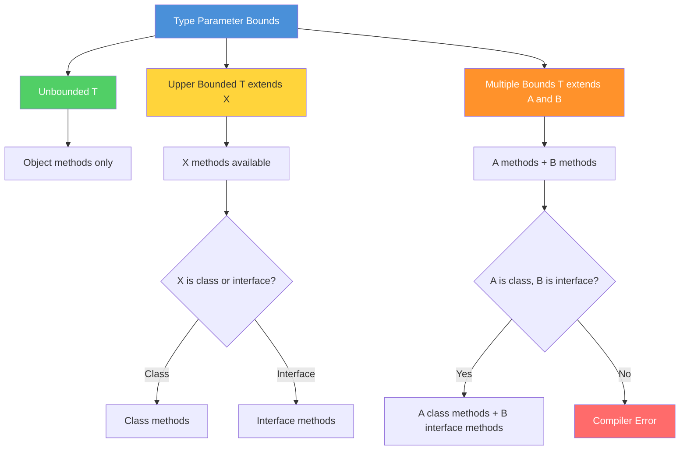

# 04 - Bounded Type Parameters

## Table of Contents

1. [Introduction](#introduction)
2. [Learning Objectives](#learning-objectives)
3. [Prerequisites](#prerequisites)
4. [Why This Concept Exists](#why-this-concept-exists)
5. [Problem Statement](#problem-statement)
6. [Theory](#theory)
7. [Internal Working](#internal-working)
8. [JVM Perspective](#jvm-perspective)
9. [Memory Representation](#memory-representation)
10. [Syntax](#syntax)
11. [Easy Example](#easy-example)
12. [Medium Example](#medium-example)
13. [Hard Example](#hard-example)
14. [Enterprise Example](#enterprise-example)
15. [Performance](#performance)
16. [Best Practices](#best-practices)
17. [Common Mistakes](#common-mistakes)
18. [Pitfalls](#pitfalls)
19. [Debugging Tips](#debugging-tips)
20. [Comparison Table](#comparison-table)
21. [Decision Tree](#decision-tree)
22. [Interview Questions](#interview-questions)
23. [Exercises](#exercises)
24. [Assignments](#assignments)
25. [Mini Project](#mini-project)
26. [Summary](#summary)
27. [References](#references)

---

## Introduction

**Bounded type parameters** restrict the types that can be used as generic arguments. By using the `extends` keyword, you can require that a type parameter must be a subclass of a specified upper bound. This enables you to call methods specific to the bound type while maintaining generic flexibility.

Bounded types are essential for writing generic code that requires specific capabilities — like `Comparable` for sorting, `Number` for arithmetic, or `Serializable` for serialization.

---

## Learning Objectives

By the end of this topic, you will be able to:

- Declare upper-bounded type parameters with `extends`
- Apply multiple bounds with `&` syntax
- Understand the difference between bounded and unbounded types
- Use recursive type bounds
- Apply bounds to enforce API contracts
- Choose appropriate bounds for generic types

---

## Prerequisites

- Generic classes and methods (Topics 02-03)
- Understanding of inheritance and interfaces
- Type erasure concepts (Topic 01)
- Basic knowledge of Java Collections

---

## Why This Concept Exists

### Without Bounded Types

```java
// Unbounded - can't call any type-specific methods
public static <T> int compare(T a, T b) {
    return a.compareTo(b);  // Compile error! T doesn't have compareTo
}

// Workaround with Object - loses type safety
public static <T> int compare(Object a, Object b) {
    return ((Comparable) a).compareTo(b);  // Unsafe cast
}
```

### With Bounded Types

```java
// Bounded - T must be Comparable
public static <T extends Comparable<T>> int compare(T a, T b) {
    return a.compareTo(b);  // OK! compareTo is guaranteed
}

// Type-safe and flexible
compare("hello", "world");  // String is Comparable
compare(1, 2);               // Integer is Comparable
// compare(new Object(), new Object());  // Compile error! Object isn't Comparable
```

---

## Production Motivation

Wildcards enable flexible APIs that work with different type arguments while maintaining type safety. They're essential for production code.

### Java Collections Framework
```java
// Collections.copy() — PECS pattern (Producer Extends, Consumer Super)
public static <T> void copy(List<? super T> dest, List<? extends T> src)

// Collections.addAll() — consumer wildcard
public static <T> boolean addAll(Collection<? super T> c, T... elements)

// Collections.frequency() — unbounded wildcard
public static int frequency(Collection<?> c, Object o)

// Collections.disjoint() — two unbounded wildcards
public static boolean disjoint(Collection<?> c1, Collection<?> c2)
```

### Streams API
```java
// Stream.flatMap() — wildcard in function parameter
public <R> Stream<R> flatMap(Function<? super T, ? extends Stream<? extends R>> mapper)

// Collectors.toMap() — flexible key/value types
public static <T, K, U> Collector<T, ?, Map<K,U>> toMap(
    Function<? super T, ? extends K> keyMapper,
    Function<? super T, ? extends U> valueMapper)
```

### Spring Data JPA
```java
// Repository.saveAll() — accepts Iterable of any subtype
<S extends T> Iterable<S> saveAll(Iterable<S> entities);

// CrudRepository.findById() — Optional with wildcard
Optional<T> findById(ID id);
```

### Guava (Google Core Libraries)
```java
// Lists.newArrayList() — generic varargs with wildcard
public static <E> ArrayList<E> newArrayList(E... elements)

// ImmutableMap.copyOf() — wildcard for any Map
public static <K, V> ImmutableMap<K, V> copyOf(Map<? extends K, ? extends V> map)
```

### Apache Commons
```java
// StringUtils.join() — wildcard for any Iterable
public static String join(final Iterable<?> iterable, final String separator)

// CollectionUtils.isEmpty() — unbounded wildcard
public static boolean isEmpty(final Collection<?> collection)
```

---

## Problem Statement

Create generic code that:
1. Requires specific methods on the type parameter
2. Enforces contracts at compile time
3. Supports multiple constraints (e.g., `Number` AND `Comparable`)
4. Enables recursive type relationships
5. Maintains flexibility while ensuring safety

---

## Theory

### Upper Bounded Type Parameters

The `extends` keyword specifies an upper bound:

```java
// T must be Number or a subclass of Number
public static <T extends Number> double square(T value) {
    return value.doubleValue() * value.doubleValue();
}

// T must be Comparable<T> or implement it
public static <T extends Comparable<T>> T max(T a, T b) {
    return a.compareTo(b) > 0 ? a : b;
}
```

### Bounds Hierarchy Diagram



### Multiple Bounds

Use `&` to specify multiple bounds:

```java
// T must extend Number AND implement Comparable
public static <T extends Number & Comparable<T>> T max(List<T> list) {
    T max = list.get(0);
    for (T item : list) {
        if (item.compareTo(max) > 0) {
            max = item;
        }
    }
    return max;
}
```

**Rules:**
- First bound can be a class (if any)
- Subsequent bounds must be interfaces
- `extends` is used for both classes and interfaces in generic bounds

### Recursive Type Bounds

A type parameter can bound itself:

```java
// T must implement Comparable<T> (comparable to itself)
public static <T extends Comparable<T>> void sort(T[] array) {
    Arrays.sort(array);  // OK: T implements Comparable<T>
}
```

### Upper Bounded Wildcards vs Type Parameters

```java
// Type parameter - you need to CREATE or MODIFY values
public static <T extends Comparable<T>> T max(T a, T b) {
    return a.compareTo(b) > 0 ? a : b;  // Need T for return
}

// Wildcard - you only READ values
public static boolean isGreater(Comparable<?> a, Comparable<?> b) {
    return a.compareTo(b) > 0;  // Don't need T for return
}
```

---

## Internal Working

### Compiler Actions

```java
// Source
public static <T extends Number> double sum(List<T> list) {
    return list.stream().mapToDouble(Number::doubleValue).sum();
}

List<Integer> ints = List.of(1, 2, 3);
double result = sum(ints);
```

**Compiler steps:**
1. **Verify bound** — `Integer extends Number` ✓
2. **Type check** — `List<Integer>` matches `List<T>` where `T extends Number` ✓
3. **Erase bound** — Replace `T` with `Number` (the upper bound)
4. **Insert cast** — Add `(Number)` cast where needed

### Bytecode After Erasure

```java
// What the JVM sees
public static double sum(List list) {
    return list.stream()
               .mapToDouble(((Number) x -> x).doubleValue())
               .sum();
}
```

### Multiple Bounds Erasure

```java
// Source
public static <T extends Number & Comparable<T>> T max(List<T> list) { ... }

// After erasure - T becomes Number (first bound)
public static Number max(List list) { ... }
```

---

## JVM Perspective

### Bound Information in Bytecode

```java
public class NumberBox<T extends Number> {
