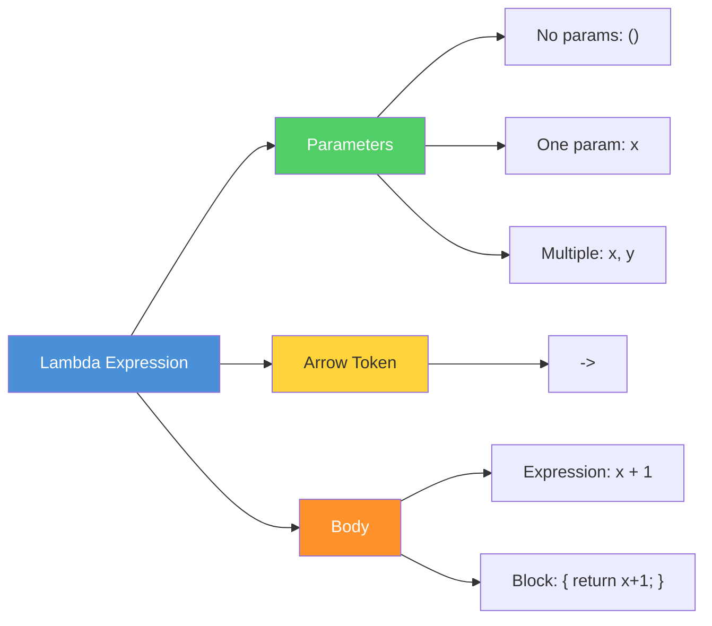

# Topic 02: Lambda Expressions

## Table of Contents

1. [Introduction](#1-introduction)
2. [Learning Objectives](#2-learning-objectives)
3. [Prerequisites](#3-prerequisites)
4. [Why This Concept Exists](#4-why-this-concept-exists)
5. [Problem Statement](#5-problem-statement)
6. [Theory](#6-theory)
7. [Internal Working](#7-internal-working)
8. [JVM Perspective](#8-jvm-perspective)
9. [Memory Representation](#9-memory-representation)
10. [Syntax](#10-syntax)
11. [Easy Example](#11-easy-example)
12. [Medium Example](#12-medium-example)
13. [Hard Example](#13-hard-example)
14. [Enterprise Example](#14-enterprise-example)
15. [Performance](#15-performance)
16. [Best Practices](#16-best-practices)
17. [Common Mistakes](#17-common-mistakes)
18. [Pitfalls](#18-pitfalls)
19. [Debugging Tips](#19-debugging-tips)
20. [Comparison Table](#20-comparison-table)
21. [Decision Tree](#21-decision-tree)
22. [Interview Questions](#22-interview-questions)
23. [Exercises](#23-exercises)
24. [Assignments](#24-assignments)
25. [Mini Project](#25-mini-project)
26. [Summary](#26-summary)
27. [References](#27-references)

---

## 1. Introduction

Lambda expressions are anonymous functions that provide a concise way to implement functional interfaces. Introduced in Java 8, lambdas enable functional programming by treating functions as first-class citizens—passing them as arguments, returning them from methods, and storing them in variables.

A lambda expression in Java consists of:
- **Parameter list**: The input parameters
- **Arrow token**: `->`
- **Body**: The expression or block of code to execute

```java
// Full syntax
(parameters) -> expression

// With block body
(parameters) -> { statements; }
```

Lambda expressions are NOT a new feature in the language itself but rather a syntactic sugar for creating anonymous class instances that implement functional interfaces.

---

## 2. Learning Objectives

After completing this topic, you will be able to:

1. Write lambda expressions with correct syntax
2. Understand lambda scoping rules and variable capture
3. Distinguish between expression lambdas and block lambdas
4. Apply type inference in lambda parameters
5. Use effectively final variables in lambdas
6. Implement custom functional interfaces with lambdas
7. Recognize when to use lambdas vs method references

---

## 3. Prerequisites

Before starting this topic, you should be comfortable with:

- **Java Basics**: Variables, methods, control flow
- **Anonymous Classes**: Creating inline implementations of interfaces
- **Generics**: Understanding type parameters
- **Functional Interfaces**: What they are and how they work (covered in Topic 03)

---

## 4. Why This Concept Exists

### The Problem with Anonymous Classes

Before Java 8, implementing functional interfaces required verbose anonymous classes:

```java
// Pre-Java 8: Verbose anonymous class
Comparator<String> comparator = new Comparator<String>() {
    @Override
    public int compare(String a, String b) {
        return a.compareTo(b);
    }
};
```

This code is unnecessarily verbose because:
1. The class name is redundant (`Comparator<String>`)
2. The method name is obvious from context (`compare`)
3. The type parameters repeat (`<String>`)

### The Lambda Solution

```java
// Java 8+: Concise lambda
Comparator<String> comparator = (a, b) -> a.compareTo(b);
```

Lambda expressions reduce boilerplate by:
1. Inferring parameter types from context
2. Eliminating the need for class/method declarations
3. Providing a concise syntax for simple implementations

---

## 5. Problem Statement

### Real-World Scenario: Event Handler Registration

An application needs to register event handlers for user interactions. The current codebase uses anonymous classes, resulting in:

- **Verbosity**: Each handler requires 5-7 lines of boilerplate
- **Noise**: Class/method declarations obscure the actual logic
- **Maintenance burden**: Adding handlers requires writing repetitive code

### Requirements

1. Reduce boilerplate for implementing functional interfaces
2. Maintain type safety
3. Support both simple expressions and complex block logic
4. Enable variable capture from enclosing scope
5. Provide clear scoping rules for captured variables

---

## 6. Theory

### Lambda Syntax Diagram



### 6.1 Lambda Anatomy

A lambda expression consists of three parts:

```
┌─────────────┬─────────────┬─────────────┐
│  Parameters  │  Arrow (→)  │     Body    │
├─────────────┼─────────────┼─────────────┤
│  (a, b)     │      →      │  a + b      │
│  x          │      →      │  { ... }    │
│  ()         │      →      │  42         │
└─────────────┴─────────────┴─────────────┘
```

### 6.2 Parameter Variations

```java
// No parameters
() -> System.out.println("Hello")

// One parameter (parentheses optional)
x -> x * 2
(x) -> x * 2

// Multiple parameters
(x, y) -> x + y
(int x, int y) -> x + y

// Var parameters (Java 11+)
(var x, var y) -> x + y
```

### 6.3 Body Variations

```java
// Expression body (single expression, implicit return)
x -> x * 2
x -> x > 0 ? "positive" : "negative"

// Block body (multiple statements, explicit return)
x -> {
    System.out.println("Processing: " + x);
    return x * 2;
}
```

### 6.4 Type Inference

Java infers lambda types from the target context:

```java
// Target type: Comparator<String>
Comparator<String> comp = (a, b) -> a.compareTo(b);
// a and b are inferred as String

// Target type: Predicate<Integer>
Predicate<Integer> isPositive = n -> n > 0;
// n is inferred as Integer

// Explicit types when needed (rare)
Comparator<String> comp2 = (String a, String b) -> a.compareTo(b);
```

### 6.5 Variable Capture Rules

Lambdas can capture variables from their enclosing scope with these rules:

1. **Effectively final**: The variable must not be modified after initialization
2. **Stack-based**: Only stack-local variables can be captured
3. **Instance fields**: Can be accessed but not reassigned
4. **Static fields**: Can be accessed and reassigned (but discouraged)

```java
void process(List<String> items) {
    String prefix = "ITEM-"; // effectively final
    
    items.forEach(item -> {
        // Can read 'prefix' (effectively final)
        System.out.println(prefix + item);
        
        // Cannot modify 'prefix'
        // prefix = "NEW-"; // Compilation error!
    });
}
```

### 6.6 Scope Resolution

Lambda expressions have their own scope but can access:

```java
public class ScopeExample {
    private int instanceField = 10; // Accessible
    
    public void method() {
        int localVar = 20; // Effectively final
        
        Runnable lambda = () -> {
            System.out.println(instanceField); // OK
            System.out.println(localVar);      // OK (effectively final)
            // localVar++;                     // Compilation error
        };
    }
}
```

---

## 7. Internal Working

### 7.1 Compilation Process

When the Java compiler encounters a lambda expression, it:

1. **Validates the target type**: Ensures the lambda matches a functional interface
2. **Generates a synthetic method**: Creates a private method containing the lambda body
3. **Emits invokedynamic**: Generates a call site using `invokedynamic`

```java
// Source code
Function<String, Integer> length = s -> s.length();

// Compiled to (conceptual bytecode):
// 1. Synthetic method: private static int lambda$main$0(String s) { return s.length(); }
// 2. invokedynamic call: LambdaMetafactory.metafactory(..., "apply", ..., lambda$main$0, ...)
```

### 7.2 LambdaMetafactory

`LambdaMetafactory` is the bootstrap method that creates functional interface implementations at runtime:

```
┌─────────────────────────────────────────────────────────┐
│                    LambdaMetafactory                     │
├─────────────────────────────────────────────────────────┤
│ 1. Creates proxy class implementing the functional interface │
│ 2. Delegates calls to the synthetic method               │
│ 3. Caches the implementation for future use              │
└─────────────────────────────────────────────────────────┘
```

### 7.3 Accessor Methods

Lambdas access captured variables through accessor methods generated by the compiler:

```java
void process(List<String> items) {
    String prefix = "ITEM-";
    
    items.forEach(item -> System.out.println(prefix + item));
}

// Compiler generates:
private static void lambda$process$0(String prefix, String item) {
    System.out.println(prefix + item);
}
```

---

## 8. JVM Perspective

### 8.1 Bytecode Comparison

| Aspect | Anonymous Class | Lambda |
|--------|----------------|--------|
| **Class Files** | One per anonymous class | None (same class) |
| **Instantiation** | `new` instruction | `invokedynamic` |
| **Method Invocation** | Virtual call | Direct method call |
| **JIT Optimization** | Limited | Aggressive inlining |

### 8.2 InvokeDynamic Benefits

The `invokedynamic` instruction provides several advantages:

1. **Lazy instantiation**: The implementation class is created on first use
2. **Type specialization**: The JVM can create specialized implementations
3. **Better inlining**: JIT can inline lambda bodies more effectively
4. **Reduced memory**: No separate class files needed

### 8.3 Lambda Implementation Classes

For each lambda, the JVM creates a hidden class:

```
TargetClass$$Lambda$1/0x0000000800c01c00
```

These classes are:
- Loaded by the bootstrap class loader
- Not visible in standard class loading
- Subject to garbage collection when no longer referenced

---

## 9. Memory Representation

### 9.1 Lambda Object Layout

```
┌─────────────────────────────────────┐
│        Lambda Implementation        │
├─────────────────────────────────────┤
│  Header (mark word + klass pointer) │
├─────────────────────────────────────┤
│  Captured variable 1 (reference)    │
│  Captured variable 2 (reference)    │
│  ...                                │
├─────────────────────────────────────┤
│  Method handle to synthetic method  │
└─────────────────────────────────────┘
```

### 9.2 Variable Capture Memory

When a lambda captures variables:

```java
void process(String prefix, List<String> items) {
    items.forEach(item -> System.out.println(prefix + item));
}
```

Memory layout:

```
Stack Frame:
┌─────────────────────────────────────┐
│  prefix (String reference)          │  ← Captured by lambda
│  items (List reference)             │  ← Not captured (used directly)
└─────────────────────────────────────┘

Lambda Object:
┌─────────────────────────────────────┐
│  prefix reference                   │  ← Copied reference
│  Method handle to lambda$process$0  │
└─────────────────────────────────────┘
```

### 9.3 Performance Implications

---

[📖 Continue to Part 2](README-part2.md)
