# Topic 03: Functional Interfaces

## Table of Contents

1. [Introduction](#1-introduction)
2. [Learning Objectives](#2-learning-objectives)
3. [Prerequisites](#3-prerequisites)
4. [Why This Concept Exists](#4-why-this-concept-exists)
5. [Problem Statement](#5-problem-statement)
6. [Theory](#6-theory)
7. [Internal Working](#7-internal-working)
8. [JVM Perspective](#8-jvm-perspective)
9. [Memory Representation](#9-memory-representation)
10. [Syntax](#10-syntax)
11. [Easy Example](#11-easy-example)
12. [Medium Example](#12-medium-example)
13. [Hard Example](#13-hard-example)
14. [Enterprise Example](#14-enterprise-example)
15. [Performance](#15-performance)
16. [Best Practices](#16-best-practices)
17. [Common Mistakes](#17-common-mistakes)
18. [Pitfalls](#18-pitfalls)
19. [Debugging Tips](#19-debugging-tips)
20. [Comparison Table](#20-comparison-table)
21. [Decision Tree](#21-decision-tree)
22. [Interview Questions](#22-interview-questions)
23. [Exercises](#23-exercises)
24. [Assignments](#24-assignments)
25. [Mini Project](#25-mini-project)
26. [Summary](#26-summary)
27. [References](#27-references)

---

## 1. Introduction

A functional interface is an interface with exactly one abstract method (SAM - Single Abstract Method). Functional interfaces are the foundation of Java's lambda expression support—lambdas can only be used to implement functional interfaces.

Java 8 introduced the `@FunctionalInterface` annotation, which provides compile-time validation that an interface is indeed a functional interface. The `java.util.function` package provides a rich catalog of built-in functional interfaces for common use cases.

### Key Characteristics

| Characteristic | Description |
|----------------|-------------|
| **Single Abstract Method** | Exactly one abstract method |
| **@FunctionalInterface** | Optional annotation for validation |
| **Lambda Compatible** | Can be implemented with lambdas |
| **Default Methods Allowed** | Can have any number of default methods |
| **Static Methods Allowed** | Can have any number of static methods |

### Functional Interface Hierarchy

```mermaid
graph TD
    FI[Functional Interface] --> P[Predicate]
    FI --> FN[Function]
    FI --> C[Consumer]
    FI --> S[Supplier]
    FI --> UO[UnaryOperator]
    FI --> BO[BinaryOperator]
    
    P --> IP[IntPredicate]
    P --> LP[LongPredicate]
    P --> DP[DoublePredicate]
    
    FN --> IF[IntFunction]
    FN --> LF[LongFunction]
    FN --> DF[DoubleFunction]
    
    C --> IC[IntConsumer]
    C --> LC[LongConsumer]
    C --> DC[DoubleConsumer]
    
    S --> IS[IntSupplier]
    S --> LS[LongSupplier]
    S --> DS[DoubleSupplier]
    
    UO --> IUO[IntUnaryOperator]
    UO --> LUO[LongUnaryOperator]
    UO --> DUO[DoubleUnaryOperator]
    
    BO --> IBO[IntBinaryOperator]
    BO --> LBO[LongBinaryOperator]
    BO --> DBO[DoubleBinaryOperator]
    
    style FI fill:#4a90d9,color:#fff
    style P fill:#51cf66,color:#fff
    style FN fill:#51cf66,color:#fff
    style C fill:#51cf66,color:#fff
    style S fill:#51cf66,color:#fff
    style UO fill:#51cf66,color:#fff
    style BO fill:#51cf66,color:#fff
    style IP fill:#ffd43b,color:#333
    style LP fill:#ffd43b,color:#333
    style DP fill:#ffd43b,color:#333
    style IF fill:#ffd43b,color:#333
    style LF fill:#ffd43b,color:#333
    style DF fill:#ffd43b,color:#333
    style IC fill:#ffd43b,color:#333
    style LC fill:#ffd43b,color:#333
    style DC fill:#ffd43b,color:#333
    style IS fill:#ffd43b,color:#333
    style LS fill:#ffd43b,color:#333
    style DS fill:#ffd43b,color:#333
    style IUO fill:#ffd43b,color:#333
    style LUO fill:#ffd43b,color:#333
    style DUO fill:#ffd43b,color:#333
    style IBO fill:#ffd43b,color:#333
    style LBO fill:#ffd43b,color:#333
    style DBO fill:#ffd43b,color:#333
```



### Built-in Functional Interface Catalog

| Interface | Method | Description | Example Use Case |
|-----------|--------|-------------|------------------|
| `Predicate<T>` | `boolean test(T t)` | Tests a condition | Filtering |
| `Function<T,R>` | `R apply(T t)` | Transforms T to R | Mapping |
| `Consumer<T>` | `void accept(T t)` | Consumes a value | Side effects |
| `Supplier<T>` | `T get()` | Provides a value | Factory |
| `UnaryOperator<T>` | `T apply(T t)` | Unary transformation | Identity transform |
| `BinaryOperator<T>` | `T apply(T a, T b)` | Binary operation | Reduction |

---

## 2. Learning Objectives

After completing this topic, you will be able to:

1. Define functional interfaces and the SAM (Single Abstract Method) rule
2. Use the `@FunctionalInterface` annotation correctly
3. Apply built-in functional interfaces (Predicate, Function, Consumer, Supplier)
4. Create custom functional interfaces with default and static methods
5. Choose the right functional interface for a given problem
6. Understand the relationship between functional interfaces and lambda expressions
7. Use primitive specialized interfaces (IntFunction, LongConsumer, etc.)

---

## 3. Prerequisites

Before starting this topic, you should be comfortable with:

- **Java Basics**: Interfaces, abstract methods
- **Generics**: Type parameters, wildcards
- **Lambda Expressions**: Basic syntax and usage (Topic 02)

---

## 4. Why This Concept Exists

### The Problem Without Functional Interfaces

Before functional interfaces, implementing function-like behavior required:

1. **Anonymous classes**: Verbose and create separate .class files
2. **Custom callback interfaces**: Every library defines its own
3. **No standardization**: No common vocabulary for function types

### The Functional Interface Solution

Functional interfaces provide:

1. **Standardized vocabulary**: `Predicate`, `Function`, `Consumer`, `Supplier`
2. **Lambda compatibility**: Any functional interface can be implemented with a lambda
3. **Type safety**: Compile-time validation with `@FunctionalInterface`
4. **Composability**: Default methods enable function composition

---

## 5. Problem Statement

### Real-World Scenario: Data Processing Framework

A data processing framework needs to support:
- **Filtering**: Select items based on conditions
- **Transformation**: Convert items from one type to another
- **Aggregation**: Combine multiple items into a single result
- **Side effects**: Logging, notifications, database updates

### Requirements

1. Provide a standard set of function types
2. Enable easy composition of operations
3. Support primitive types without boxing overhead
4. Allow custom function types for domain-specific operations
5. Maintain type safety throughout

---

## 6. Theory

### 6.1 Single Abstract Method (SAM) Rule

A functional interface has exactly one abstract method:

```java
// Valid functional interface
@FunctionalInterface
interface Converter<F, T> {
    T convert(F from);  // Single abstract method
}

// Invalid - two abstract methods
@FunctionalInterface
interface Invalid {
    void method1();
    void method2();  // Compilation error!
}
```

### 6.2 @FunctionalInterface Annotation

The `@FunctionalInterface` annotation is optional but provides:

1. **Compile-time validation**: Ensures exactly one abstract method
2. **Documentation**: Clearly indicates the interface is functional
3. **Javadoc generation**: Automatically adds functional interface documentation

```java
@FunctionalInterface
public interface Transformer<T, R> {
    R transform(T input);  // Must have exactly one abstract method
    
    // Default methods (allowed)
    default <V> Transformer<T, V> andThen(Transformer<R, V> after) {
        return input -> after.transform(transform(input));
    }
    
    // Static methods (allowed)
    static <T> Transformer<T, T> identity() {
        return input -> input;
    }
}
```

### 6.3 Built-in Functional Interfaces

#### Predicate<T>

Tests a condition, returns boolean:

```java
@FunctionalInterface
public interface Predicate<T> {
    boolean test(T t);
    
    default Predicate<T> and(Predicate<? super T> other) { ... }
    default Predicate<T> negate() { ... }
    default Predicate<T> or(Predicate<? super T> other) { ... }
    
    static <T> Predicate<T> not(Predicate<? super T> target) { ... }
    static <T> Predicate<T> isEqual(Object targetRef) { ... }
}
```

#### Function<T, R>

Transforms a value of type T to type R:

```java
@FunctionalInterface
public interface Function<T, R> {
    R apply(T t);
    
    default <V> Function<V, R> compose(Function<? super V, ? extends T> before) { ... }
    default <V> Function<T, V> andThen(Function<? super R, ? extends V> after) { ... }
    
    static <T> Function<T, T> identity() { ... }
}
```

#### Consumer<T>

Consumes a value, returns void:

```java
@FunctionalInterface
public interface Consumer<T> {
    void accept(T t);
    
    default Consumer<T> andThen(Consumer<? super T> after) { ... }
}
```

#### Supplier<T>

Provides a value without input:

```java
@FunctionalInterface
public interface Supplier<T> {
    T get();
}
```

#### UnaryOperator<T>

Unary operation on a single operand:

```java
@FunctionalInterface
public interface UnaryOperator<T> extends Function<T, T> {
    static <T> UnaryOperator<T> identity() { ... }
}
```

#### BinaryOperator<T>

Binary operation on two operands:

```java
@FunctionalInterface
public interface BinaryOperator<T> extends BiFunction<T, T, T> {
    static <T> BinaryOperator<T> minBy(Comparator<? super T> comparator) { ... }
    static <T> BinaryOperator<T> maxBy(Comparator<? super T> comparator) { ... }
}
```

### 6.4 Primitive Specialized Interfaces

To avoid boxing overhead, Java provides primitive specialized versions:

| Generic | int | long | double |
|---------|-----|------|--------|
| `Predicate<T>` | `IntPredicate` | `LongPredicate` | `DoublePredicate` |
| `Function<T,R>` | `IntFunction<R>` | `LongFunction<R>` | `DoubleFunction<R>` |
| `Consumer<T>` | `IntConsumer` | `LongConsumer` | `DoubleConsumer` |
| `Supplier<T>` | `IntSupplier` | `LongSupplier` | `DoubleSupplier` |
| `UnaryOperator<T>` | `IntUnaryOperator` | `LongUnaryOperator` | `DoubleUnaryOperator` |
| `BinaryOperator<T>` | `IntBinaryOperator` | `LongBinaryOperator` | `DoubleBinaryOperator` |

### 6.5 Composition with Default Methods

Functional interfaces provide default methods for composition:

```java
// Predicate composition
Predicate<Integer> isPositive = n -> n > 0;
Predicate<Integer> isEven = n -> n % 2 == 0;

Predicate<Integer> isPositiveEven = isPositive.and(isEven);
Predicate<Integer> isPositiveOrEven = isPositive.or(isEven);
Predicate<Integer> isNotPositive = isPositive.negate();

// Function composition
Function<Integer, Integer> doubleIt = x -> x * 2;
Function<Integer, Integer> addTen = x -> x + 10;

Function<Integer, Integer> doubleThenAdd = doubleIt.andThen(addTen);
Function<Integer, Integer> addThenDouble = doubleIt.compose(addTen);
```

---

## 7. Internal Working

### 7.1 Functional Interface Detection

The compiler identifies functional interfaces by:

1. Checking for `@FunctionalInterface` annotation (explicit)
2. Verifying exactly one abstract method (implicit)
3. Allowing any number of default and static methods

### 7.2 Lambda Implementation

When a lambda implements a functional interface:

1. The compiler identifies the SAM (Single Abstract Method)
2. Validates lambda signature matches the SAM
3. Generates bytecode using `invokedynamic`
4. Creates a functional interface implementation at runtime

```
Lambda Expression → Compiler validates against SAM → InvokeDynamic → LambdaMetafactory → Implementation
```

### 7.3 Method Reference Resolution

Method references are resolved against the functional interface's SAM:

```java
// SAM: R apply(T t)
Function<String, Integer> length = String::length;
// Method reference resolved to: String.length()

// SAM: boolean test(T t)
Predicate<String> isEmpty = String::isEmpty;
// Method reference resolved to: String.isEmpty()
```

---

## 8. JVM Perspective

### 8.1 Interface Methods in Bytecode

Functional interfaces are regular interfaces at the bytecode level:


---

[📖 Continue to Part 2](README-part2.md)
