# Topic 03: Functional Interfaces

## Table of Contents

1. [Introduction](#1-introduction)
2. [Learning Objectives](#2-learning-objectives)
3. [Prerequisites](#3-prerequisites)
4. [Why This Concept Exists](#4-why-this-concept-exists)
5. [Problem Statement](#5-problem-statement)
6. [Theory](#6-theory)
7. [Internal Working](#7-internal-working)
8. [JVM Perspective](#8-jvm-perspective)
9. [Memory Representation](#9-memory-representation)
10. [Syntax](#10-syntax)
11. [Easy Example](#11-easy-example)
12. [Medium Example](#12-medium-example)
13. [Hard Example](#13-hard-example)
14. [Enterprise Example](#14-enterprise-example)
15. [Performance](#15-performance)
16. [Best Practices](#16-best-practices)
17. [Common Mistakes](#17-common-mistakes)
18. [Pitfalls](#18-pitfalls)
19. [Debugging Tips](#19-debugging-tips)
20. [Comparison Table](#20-comparison-table)
21. [Decision Tree](#21-decision-tree)
22. [Interview Questions](#22-interview-questions)
23. [Exercises](#23-exercises)
24. [Assignments](#24-assignments)
25. [Mini Project](#25-mini-project)
26. [Summary](#26-summary)
27. [References](#27-references)

---

## 1. Introduction

A functional interface is an interface with exactly one abstract method (SAM - Single Abstract Method). Functional interfaces are the foundation of Java's lambda expression support—lambdas can only be used to implement functional interfaces.

Java 8 introduced the `@FunctionalInterface` annotation, which provides compile-time validation that an interface is indeed a functional interface. The `java.util.function` package provides a rich catalog of built-in functional interfaces for common use cases.

### Key Characteristics

| Characteristic | Description |
|----------------|-------------|
| **Single Abstract Method** | Exactly one abstract method |
| **@FunctionalInterface** | Optional annotation for validation |
| **Lambda Compatible** | Can be implemented with lambdas |
| **Default Methods Allowed** | Can have any number of default methods |
| **Static Methods Allowed** | Can have any number of static methods |

### Functional Interface Hierarchy

```mermaid
graph TD
    FI[Functional Interface] --> P[Predicate]
    FI --> FN[Function]
    FI --> C[Consumer]
    FI --> S[Supplier]
    FI --> UO[UnaryOperator]
    FI --> BO[BinaryOperator]
    
    P --> IP[IntPredicate]
    P --> LP[LongPredicate]
    P --> DP[DoublePredicate]
    
    FN --> IF[IntFunction]
    FN --> LF[LongFunction]
    FN --> DF[DoubleFunction]
    
    C --> IC[IntConsumer]
    C --> LC[LongConsumer]
    C --> DC[DoubleConsumer]
    
    S --> IS[IntSupplier]
    S --> LS[LongSupplier]
    S --> DS[DoubleSupplier]
    
    UO --> IUO[IntUnaryOperator]
    UO --> LUO[LongUnaryOperator]
    UO --> DUO[DoubleUnaryOperator]
    
    BO --> IBO[IntBinaryOperator]
    BO --> LBO[LongBinaryOperator]
    BO --> DBO[DoubleBinaryOperator]
    
    style FI fill:#4a90d9,color:#fff
    style P fill:#51cf66,color:#fff
    style FN fill:#51cf66,color:#fff
    style C fill:#51cf66,color:#fff
    style S fill:#51cf66,color:#fff
    style UO fill:#51cf66,color:#fff
    style BO fill:#51cf66,color:#fff
    style IP fill:#ffd43b,color:#333
    style LP fill:#ffd43b,color:#333
    style DP fill:#ffd43b,color:#333
    style IF fill:#ffd43b,color:#333
    style LF fill:#ffd43b,color:#333
    style DF fill:#ffd43b,color:#333
    style IC fill:#ffd43b,color:#333
    style LC fill:#ffd43b,color:#333
    style DC fill:#ffd43b,color:#333
    style IS fill:#ffd43b,color:#333
    style LS fill:#ffd43b,color:#333
    style DS fill:#ffd43b,color:#333
    style IUO fill:#ffd43b,color:#333
    style LUO fill:#ffd43b,color:#333
    style DUO fill:#ffd43b,color:#333
    style IBO fill:#ffd43b,color:#333
    style LBO fill:#ffd43b,color:#333
    style DBO fill:#ffd43b,color:#333
```



### Built-in Functional Interface Catalog

| Interface | Method | Description | Example Use Case |
|-----------|--------|-------------|------------------|
| `Predicate<T>` | `boolean test(T t)` | Tests a condition | Filtering |
| `Function<T,R>` | `R apply(T t)` | Transforms T to R | Mapping |
| `Consumer<T>` | `void accept(T t)` | Consumes a value | Side effects |
| `Supplier<T>` | `T get()` | Provides a value | Factory |
| `UnaryOperator<T>` | `T apply(T t)` | Unary transformation | Identity transform |
| `BinaryOperator<T>` | `T apply(T a, T b)` | Binary operation | Reduction |

---

## 2. Learning Objectives

After completing this topic, you will be able to:

1. Define functional interfaces and the SAM (Single Abstract Method) rule
2. Use the `@FunctionalInterface` annotation correctly
3. Apply built-in functional interfaces (Predicate, Function, Consumer, Supplier)
4. Create custom functional interfaces with default and static methods
5. Choose the right functional interface for a given problem
6. Understand the relationship between functional interfaces and lambda expressions
7. Use primitive specialized interfaces (IntFunction, LongConsumer, etc.)

---

## 3. Prerequisites

Before starting this topic, you should be comfortable with:

- **Java Basics**: Interfaces, abstract methods
- **Generics**: Type parameters, wildcards
- **Lambda Expressions**: Basic syntax and usage (Topic 02)

---

## 4. Why This Concept Exists

### The Problem Without Functional Interfaces

Before functional interfaces, implementing function-like behavior required:

1. **Anonymous classes**: Verbose and create separate .class files
2. **Custom callback interfaces**: Every library defines its own
3. **No standardization**: No common vocabulary for function types

### The Functional Interface Solution

Functional interfaces provide:

1. **Standardized vocabulary**: `Predicate`, `Function`, `Consumer`, `Supplier`
2. **Lambda compatibility**: Any functional interface can be implemented with a lambda
3. **Type safety**: Compile-time validation with `@FunctionalInterface`
4. **Composability**: Default methods enable function composition

---

## 5. Problem Statement

### Real-World Scenario: Data Processing Framework

A data processing framework needs to support:
- **Filtering**: Select items based on conditions
- **Transformation**: Convert items from one type to another
- **Aggregation**: Combine multiple items into a single result
- **Side effects**: Logging, notifications, database updates

### Requirements

1. Provide a standard set of function types
2. Enable easy composition of operations
3. Support primitive types without boxing overhead
4. Allow custom function types for domain-specific operations
5. Maintain type safety throughout

---

## 6. Theory

### 6.1 Single Abstract Method (SAM) Rule

A functional interface has exactly one abstract method:

```java
// Valid functional interface
@FunctionalInterface
interface Converter<F, T> {
    T convert(F from);  // Single abstract method
}

// Invalid - two abstract methods
@FunctionalInterface
interface Invalid {
    void method1();
    void method2();  // Compilation error!
}
```

### 6.2 @FunctionalInterface Annotation

The `@FunctionalInterface` annotation is optional but provides:

1. **Compile-time validation**: Ensures exactly one abstract method
2. **Documentation**: Clearly indicates the interface is functional
3. **Javadoc generation**: Automatically adds functional interface documentation

```java
@FunctionalInterface
public interface Transformer<T, R> {
    R transform(T input);  // Must have exactly one abstract method
    
    // Default methods (allowed)
    default <V> Transformer<T, V> andThen(Transformer<R, V> after) {
        return input -> after.transform(transform(input));
    }
    
    // Static methods (allowed)
    static <T> Transformer<T, T> identity() {
        return input -> input;
    }
}
```

### 6.3 Built-in Functional Interfaces

#### Predicate<T>

Tests a condition, returns boolean:

```java
@FunctionalInterface
public interface Predicate<T> {
    boolean test(T t);
    
    default Predicate<T> and(Predicate<? super T> other) { ... }
    default Predicate<T> negate() { ... }
    default Predicate<T> or(Predicate<? super T> other) { ... }
    
    static <T> Predicate<T> not(Predicate<? super T> target) { ... }
    static <T> Predicate<T> isEqual(Object targetRef) { ... }
}
```

#### Function<T, R>

Transforms a value of type T to type R:

```java
@FunctionalInterface
public interface Function<T, R> {
    R apply(T t);
    
    default <V> Function<V, R> compose(Function<? super V, ? extends T> before) { ... }
    default <V> Function<T, V> andThen(Function<? super R, ? extends V> after) { ... }
    
    static <T> Function<T, T> identity() { ... }
}
```

#### Consumer<T>

Consumes a value, returns void:

```java
@FunctionalInterface
public interface Consumer<T> {
    void accept(T t);
    
    default Consumer<T> andThen(Consumer<? super T> after) { ... }
}
```

#### Supplier<T>

Provides a value without input:

```java
@FunctionalInterface
public interface Supplier<T> {
    T get();
}
```

#### UnaryOperator<T>

Unary operation on a single operand:

```java
@FunctionalInterface
public interface UnaryOperator<T> extends Function<T, T> {
    static <T> UnaryOperator<T> identity() { ... }
}
```

#### BinaryOperator<T>

Binary operation on two operands:

```java
@FunctionalInterface
public interface BinaryOperator<T> extends BiFunction<T, T, T> {
    static <T> BinaryOperator<T> minBy(Comparator<? super T> comparator) { ... }
    static <T> BinaryOperator<T> maxBy(Comparator<? super T> comparator) { ... }
}
```

### 6.4 Primitive Specialized Interfaces

To avoid boxing overhead, Java provides primitive specialized versions:

| Generic | int | long | double |
|---------|-----|------|--------|
| `Predicate<T>` | `IntPredicate` | `LongPredicate` | `DoublePredicate` |
| `Function<T,R>` | `IntFunction<R>` | `LongFunction<R>` | `DoubleFunction<R>` |
| `Consumer<T>` | `IntConsumer` | `LongConsumer` | `DoubleConsumer` |
| `Supplier<T>` | `IntSupplier` | `LongSupplier` | `DoubleSupplier` |
| `UnaryOperator<T>` | `IntUnaryOperator` | `LongUnaryOperator` | `DoubleUnaryOperator` |
| `BinaryOperator<T>` | `IntBinaryOperator` | `LongBinaryOperator` | `DoubleBinaryOperator` |

### 6.5 Composition with Default Methods

Functional interfaces provide default methods for composition:

```java
// Predicate composition
Predicate<Integer> isPositive = n -> n > 0;
Predicate<Integer> isEven = n -> n % 2 == 0;

Predicate<Integer> isPositiveEven = isPositive.and(isEven);
Predicate<Integer> isPositiveOrEven = isPositive.or(isEven);
Predicate<Integer> isNotPositive = isPositive.negate();

// Function composition
Function<Integer, Integer> doubleIt = x -> x * 2;
Function<Integer, Integer> addTen = x -> x + 10;

Function<Integer, Integer> doubleThenAdd = doubleIt.andThen(addTen);
Function<Integer, Integer> addThenDouble = doubleIt.compose(addTen);
```

---

## 7. Internal Working

### 7.1 Functional Interface Detection

The compiler identifies functional interfaces by:

1. Checking for `@FunctionalInterface` annotation (explicit)
2. Verifying exactly one abstract method (implicit)
3. Allowing any number of default and static methods

### 7.2 Lambda Implementation

When a lambda implements a functional interface:

1. The compiler identifies the SAM (Single Abstract Method)
2. Validates lambda signature matches the SAM
3. Generates bytecode using `invokedynamic`
4. Creates a functional interface implementation at runtime

```
Lambda Expression → Compiler validates against SAM → InvokeDynamic → LambdaMetafactory → Implementation
```

### 7.3 Method Reference Resolution

Method references are resolved against the functional interface's SAM:

```java
// SAM: R apply(T t)
Function<String, Integer> length = String::length;
// Method reference resolved to: String.length()

// SAM: boolean test(T t)
Predicate<String> isEmpty = String::isEmpty;
// Method reference resolved to: String.isEmpty()
```

---

## 8. JVM Perspective

### 8.1 Interface Methods in Bytecode

Functional interfaces are regular interfaces at the bytecode level:

```
public interface java.util.function.Function<T, R> {
    public abstract R apply(Ljava/lang/Object;)Ljava/lang/Object;
    public static identity()...  // Static method
    public default andThen...    // Default method
}
```

### 8.2 LambdaMetafactory Integration

The `LambdaMetafactory` creates implementations that:

1. Implement the functional interface
2. Delegate to the lambda's synthetic method
3. Handle type erasure and boxing/unboxing

### 8.3 Default Method Dispatch

Default methods in functional interfaces use `invokeinterface`:

```
invokedynamic InterfaceMethod: andThen(...)
```

---

## 9. Memory Representation

### 9.1 Functional Interface Object Layout

```
┌─────────────────────────────────────┐
│     Functional Interface Impl       │
├─────────────────────────────────────┤
│  Header (mark word + klass pointer) │
├─────────────────────────────────────┤
│  Captured variable 1                │
│  Captured variable 2                │
│  ...                                │
├─────────────────────────────────────┤
│  Method handle to SAM implementation│
└─────────────────────────────────────┘
```

### 9.2 Memory Footprint Comparison

| Implementation | Memory per Instance | Separate Class |
|----------------|---------------------|----------------|
| Lambda | ~16 bytes | No |
| Anonymous Class | ~40 bytes | Yes |
| Method Reference | ~12 bytes | No |

---

## 10. Syntax

### 10.1 Declaring Functional Interfaces

```java
// Simple functional interface
@FunctionalInterface
interface Processor<T> {
    void process(T item);
}

// With return type
@FunctionalInterface
interface Converter<F, T> {
    T convert(F from);
}

// With multiple type parameters
@FunctionalInterface
interface BiProcessor<T, U> {
    void process(T item1, U item2);
}
```

### 10.2 Using Built-in Interfaces

```java
// Predicate
Predicate<String> isLong = s -> s.length() > 10;

// Function
Function<String, Integer> toLength = String::length;

// Consumer
Consumer<String> printer = System.out::println;

// Supplier
Supplier<List<String>> listFactory = ArrayList::new;

// UnaryOperator
UnaryOperator<String> toUpper = String::toUpperCase;

// BinaryOperator
BinaryOperator<Integer> add = Integer::sum;
```

### 10.3 Primitive Specialized Syntax

```java
// IntPredicate (avoids Integer boxing)
IntPredicate isEven = n -> n % 2 == 0;

// LongConsumer (avoids Long boxing)
LongConsumer processLong = System.out::println;

// DoubleFunction (avoids Double boxing)
DoubleFunction<String> format = d -> String.format("%.2f", d);
```

---

## 11. Easy Example

### Example 1: Basic Functional Interfaces

```java
package academy.javaengineering.functional.interfaces;

import java.util.function.*;

public class BasicFunctionalInterfaces {
    public static void main(String[] args) {
        // Predicate - tests a condition
        Predicate<String> isLong = s -> s.length() > 5;
        System.out.println("Is 'Hello' long? " + isLong.test("Hello"));
        System.out.println("Is 'Functional' long? " + isLong.test("Functional"));
        
        // Function - transforms a value
        Function<String, Integer> toLength = String::length;
        System.out.println("Length of 'Java': " + toLength.apply("Java"));
        
        // Consumer - performs an action
        Consumer<String> printer = System.out::println;
        printer.accept("Hello, World!");
        
        // Supplier - provides a value
        Supplier<Double> randomValue = Math::random;
        System.out.println("Random: " + randomValue.get());
        
        // UnaryOperator - transforms same type
        UnaryOperator<String> toUpper = String::toUpperCase;
        System.out.println("Uppercase: " + toUpper.apply("hello"));
        
        // BinaryOperator - combines two values
        BinaryOperator<Integer> add = Integer::sum;
        System.out.println("3 + 4 = " + add.apply(3, 4));
    }
}
```

### Example 2: Predicate Composition

```java
package academy.javaengineering.functional.interfaces;

import java.util.Arrays;
import java.util.List;
import java.util.function.Predicate;

public class PredicateComposition {
    public static void main(String[] args) {
        List<Integer> numbers = Arrays.asList(1, 2, 3, 4, 5, 6, 7, 8, 9, 10);
        
        Predicate<Integer> isPositive = n -> n > 0;
        Predicate<Integer> isEven = n -> n % 2 == 0;
        Predicate<Integer> isLessThan10 = n -> n < 10;
        
        // AND composition
        Predicate<Integer> isPositiveEven = isPositive.and(isEven);
        System.out.println("Positive and even numbers:");
        numbers.stream()
            .filter(isPositiveEven)
            .forEach(n -> System.out.print(n + " "));
        System.out.println();
        
        // OR composition
        Predicate<Integer> isSmallOrEven = isLessThan10.or(isEven);
        System.out.println("\nLess than 10 or even numbers:");
        numbers.stream()
            .filter(isSmallOrEven)
            .forEach(n -> System.out.print(n + " "));
        System.out.println();
        
        // NEGATE
        Predicate<Integer> isNotPositive = isPositive.negate();
        System.out.println("\nNot positive numbers:");
        numbers.stream()
            .filter(isNotPositive)
            .forEach(n -> System.out.print(n + " "));
        System.out.println();
    }
}
```

---

## 12. Medium Example

### Example 1: Function Composition Pipeline

```java
package academy.javaengineering.functional.interfaces;

import java.util.function.Function;
import java.util.function.UnaryOperator;

public class FunctionPipeline {
    
    // Build a text processing pipeline
    public static Function<String, String> buildTextPipeline() {
        UnaryOperator<String> trim = String::trim;
        UnaryOperator<String> toLower = String::toLowerCase;
        UnaryOperator<String> removeSpecialChars = s -> s.replaceAll("[^a-z0-9\\s]", "");
        UnaryOperator<String> collapseSpaces = s -> s.replaceAll("\\s+", " ");
        
        return Function.<String>identity()
            .andThen(trim)
            .andThen(toLower)
            .andThen(removeSpecialChars)
            .andThen(collapseSpaces);
    }
    
    public static void main(String[] args) {
        Function<String, String> pipeline = buildTextPipeline();
        
        String input = "  Hello, World!  This is   JAVA Programming.  ";
        String output = pipeline.apply(input);
        
        System.out.println("Input:  [" + input + "]");
        System.out.println("Output: [" + output + "]");
        
        // Build number processing pipeline
        Function<Integer, Integer> processNumber = Function.<Integer>identity()
            .andThen(n -> n * 2)
            .andThen(n -> n + 10)
            .andThen(n -> n / 2);
        
        System.out.println("\n5 processed: " + processNumber.apply(5));
        System.out.println("10 processed: " + processNumber.apply(10));
    }
}
```

### Example 2: Custom Functional Interface with Builder

```java
package academy.javaengineering.functional.interfaces;

import java.util.ArrayList;
import java.util.List;
import java.util.function.Function;

public class CustomFunctionalInterface {
    
    @FunctionalInterface
    public interface Transformer<T, R> {
        R transform(T input);
        
        default <V> Transformer<T, V> andThen(Transformer<R, V> after) {
            return input -> after.transform(transform(input));
        }
        
        default <V> Transformer<V, R> compose(Transformer<V, T> before) {
            return input -> transform(before.transform(input));
        }
        
        static <T> Transformer<T, T> identity() {
            return input -> input;
        }
    }
    
    public static class Pipeline<I, O> {
        private final Transformer<I, O> transformer;
        
        private Pipeline(Transformer<I, O> transformer) {
            this.transformer = transformer;
        }
        
        public static <T> Pipeline<T, T> of(Transformer<T, T> transformer) {
            return new Pipeline<>(transformer);
        }
        
        public <R> Pipeline<I, R> addStep(Transformer<O, R> step) {
            return new Pipeline<>(transformer.andThen(step));
        }
        
        public O apply(I input) {
            return transformer.transform(input);
        }
        
        public List<O> applyAll(List<I> inputs) {
            List<O> results = new ArrayList<>();
            for (I input : inputs) {
                results.add(transformer.transform(input));
            }
            return results;
        }
    }
    
    public static void main(String[] args) {
        // Build a string processing pipeline
        Pipeline<String, String> textPipeline = Pipeline.<String>of(input -> input)
            .addStep(String::trim)
            .addStep(String::toLowerCase)
            .addStep(s -> s.replaceAll("[^a-z0-9\\s]", ""))
            .addStep(s -> s.replaceAll("\\s+", "_"));
        
        String result = textPipeline.apply("  Hello, World!  ");
        System.out.println("Processed: " + result);
        
        // Process multiple strings
        List<String> inputs = List.of("  Java 8 ", "  Lambda  ", "  Expressions  ");
        List<String> outputs = textPipeline.applyAll(inputs);
        System.out.println("Batch processed: " + outputs);
    }
}
```

---

## 13. Hard Example

### Example 1: Generic Functional Interface Framework

```java
package academy.javaengineering.functional.interfaces;

import java.util.*;
import java.util.function.*;

public class FunctionalFramework {
    
    // Core functional interfaces
    @FunctionalInterface
    public interface Predicate2<T> {
        boolean test(T t);
        
        default Predicate2<T> and(Predicate2<? super T> other) {
            return t -> this.test(t) && other.test(t);
        }
        
        default Predicate2<T> or(Predicate2<? super T> other) {
            return t -> this.test(t) || other.test(t);
        }
        
        default Predicate2<T> negate() {
            return t -> !this.test(t);
        }
        
        static <T> Predicate2<T> not(Predicate2<? super T> target) {
            return t -> !target.test(t);
        }
        
        static <T> Predicate2<T> alwaysTrue() {
            return t -> true;
        }
        
        static <T> Predicate2<T> alwaysFalse() {
            return t -> false;
        }
    }
    
    @FunctionalInterface
    public interface Function2<T, R> {
        R apply(T t);
        
        default <V> Function2<T, V> andThen(Function2<? super R, ? extends V> after) {
            return t -> after.apply(this.apply(t));
        }
        
        default <V> Function2<V, R> compose(Function2<? super V, ? extends T> before) {
            return v -> this.apply(before.apply(v));
        }
        
        static <T> Function2<T, T> identity() {
            return t -> t;
        }
        
        static <T, R> Function2<T, R> constant(R value) {
            return t -> value;
        }
    }
    
    @FunctionalInterface
    public interface Consumer2<T> {
        void accept(T t);
        
        default Consumer2<T> andThen(Consumer2<? super T> after) {
            return t -> {
                this.accept(t);
                after.accept(t);
            };
        }
        
        static <T> Consumer2<T> noop() {
            return t -> {};
        }
    }
    
    @FunctionalInterface
    public interface Supplier2<T> {
        T get();
        
        default Supplier2<T> memoize() {
            return new Supplier2<T>() {
                private T cachedValue;
                private boolean computed = false;
                
                @Override
                public T get() {
                    if (!computed) {
                        cachedValue = Supplier2.this.get();
                        computed = true;
                    }
                    return cachedValue;
                }
            };
        }
    }
    
    // Predicate builder
    public static <T> Predicate2<T> buildPredicate(Predicate2<T>... predicates) {
        return Arrays.stream(predicates)
            .reduce(Predicate2::and, Predicate2::and);
    }
    
    public static void main(String[] args) {
        // Test Predicate2
        Predicate2<String> isLong = s -> s.length() > 5;
        Predicate2<String> startsWithJ = s -> s.startsWith("J");
        Predicate2<String> combined = isLong.and(startsWithJ);
        
        System.out.println("Java is long and starts with J: " + combined.test("Java"));
        System.out.println("J is long and starts with J: " + combined.test("J"));
        
        // Test Function2 pipeline
        Function2<String, String> pipeline = Function2.<String>identity()
            .andThen(String::trim)
            .andThen(String::toLowerCase)
            .andThen(s -> s.replaceAll("\\s+", "_"));
        
        System.out.println("Pipeline: " + pipeline.apply("  Hello World  "));
        
        // Test Supplier2 memoization
        Supplier2<String> expensiveComputation = () -> {
            System.out.println("Computing expensive value...");
            return "EXPENSIVE_RESULT";
        }.memoize();
        
        System.out.println("First access:");
        System.out.println("Value: " + expensiveComputation.get());
        System.out.println("Second access (cached):");
        System.out.println("Value: " + expensiveComputation.get());
    }
}
```

---

## 14. Enterprise Example

### Example 1: Order Processing with Functional Interfaces

```java
package academy.javaengineering.functional.interfaces;

import java.math.BigDecimal;
import java.time.LocalDateTime;
import java.util.List;
import java.util.function.*;

public class OrderProcessing {
    
    public record Order(
        String id,
        String customerId,
        List<OrderItem> items,
        OrderStatus status,
        LocalDateTime createdAt,
        BigDecimal totalAmount
    ) {}
    
    public record OrderItem(
        String productId,
        String productName,
        int quantity,
        BigDecimal unitPrice
    ) {}
    
    public enum OrderStatus {
        PENDING, PROCESSING, SHIPPED, DELIVERED, CANCELLED
    }
    
    // Functional interfaces for order operations
    @FunctionalInterface
    public interface OrderValidator {
        ValidationResult validate(Order order);
        
        default OrderValidator and(OrderValidator other) {
            return order -> {
                ValidationResult result = this.validate(order);
                if (!result.isValid()) return result;
                return other.validate(order);
            };
        }
    }
    
    @FunctionalInterface
    public interface OrderTransformer<T> {
        T transform(Order order);
        
        default <R> OrderTransformer<R> andThen(OrderTransformer<T> after) {
            return order -> after.transform(this.transform(order));
        }
    }
    
    @FunctionalInterface
    public interface OrderPredicate {
        boolean test(Order order);
        
        default OrderPredicate and(OrderPredicate other) {
            return order -> this.test(order) && other.test(order);
        }
        
        default OrderPredicate or(OrderPredicate other) {
            return order -> this.test(order) || other.test(order);
        }
        
        default OrderPredicate negate() {
            return order -> !this.test(order);
        }
    }
    
    public record ValidationResult(boolean isValid, String message) {
        public static ValidationResult valid() {
            return new ValidationResult(true, null);
        }
        
        public static ValidationResult invalid(String message) {
            return new ValidationResult(false, message);
        }
    }
    
    public static void main(String[] args) {
        // Create test data
        List<Order> orders = createSampleOrders();
        
        // Define validators
        OrderValidator hasItems = order -> 
            !order.items().isEmpty() 
                ? ValidationResult.valid() 
                : ValidationResult.invalid("Order has no items");
        
        OrderValidator hasPositiveTotal = order -> 
            order.totalAmount().compareTo(BigDecimal.ZERO) > 0
                ? ValidationResult.valid() 
                : ValidationResult.invalid("Total must be positive");
        
        OrderValidator isRecent = order ->
            order.createdAt().isAfter(LocalDateTime.now().minusDays(7))
                ? ValidationResult.valid()
                : ValidationResult.invalid("Order is too old");
        
        // Compose validators
        OrderValidator processable = hasItems
            .and(hasPositiveTotal)
            .and(isRecent);
        
        // Define predicates
        OrderPredicate isPending = order -> order.status() == OrderStatus.PENDING;
        OrderPredicate isHighValue = order -> 
            order.totalAmount().compareTo(new BigDecimal("100")) > 0;
        
        OrderPredicate shouldPrioritize = isPending.and(isHighValue);
        
        // Process orders
        System.out.println("=== Order Validation ===");
        orders.forEach(order -> {
            ValidationResult result = processable.validate(order);
            System.out.printf("Order %s: %s%n", 
                order.id(), 
                result.isValid() ? "VALID" : "INVALID: " + result.message());
        });
        
        System.out.println("\n=== Priority Orders ===");
        orders.stream()
            .filter(shouldPrioritize::test)
            .forEach(order -> System.out.println("  " + order.id()));
    }
    
    private static List<Order> createSampleOrders() {
        return List.of(
            new Order("ORD-001", "CUST-001", 
                List.of(new OrderItem("P001", "Laptop", 1, new BigDecimal("999.99"))),
                OrderStatus.PENDING, LocalDateTime.now().minusDays(2), new BigDecimal("999.99")),
            new Order("ORD-002", "CUST-002", 
                List.of(new OrderItem("P002", "Mouse", 2, new BigDecimal("29.99"))),
                OrderStatus.SHIPPED, LocalDateTime.now().minusDays(10), new BigDecimal("59.98")),
            new Order("ORD-003", "CUST-003", List.of(),
                OrderStatus.PENDING, LocalDateTime.now().minusDays(1), BigDecimal.ZERO)
        );
    }
}
```

---

## 15. Performance

### 15.1 Primitive Specialized Interfaces

Using primitive specialized interfaces avoids boxing overhead:

```java
// SLOW: Boxing overhead
Function<Integer, Integer> square = x -> x * x;
IntStream.range(0, 1000000).map(square::apply).sum();

// FAST: No boxing
IntUnaryOperator squarePrimitive = x -> x * x;
IntStream.range(0, 1000000).map(squarePrimitive).sum();
```

### 15.2 Performance Comparison

| Interface | Generic | Primitive | Speedup |
|-----------|---------|-----------|---------|
| Predicate | `Predicate<Integer>` | `IntPredicate` | ~2x |
| Function | `Function<Integer, R>` | `IntFunction<R>` | ~1.5x |
| Consumer | `Consumer<Integer>` | `IntConsumer` | ~2x |
| Supplier | `Supplier<Integer>` | `IntSupplier` | ~1.5x |

### 15.3 Benchmarking

```java
package academy.javaengineering.functional.interfaces;

import java.util.function.IntUnaryOperator;
import java.util.function.UnaryOperator;

public class InterfaceBenchmark {
    
    private static final int ITERATIONS = 100_000_000;
    
    public static void main(String[] args) {
        // Warmup
        for (int i = 0; i < 1_000_000; i++) {
            ((IntUnaryOperator) x -> x * x).applyAsInt(i);
        }
        
        // Benchmark: Generic UnaryOperator
        long start = System.nanoTime();
        UnaryOperator<Integer> genericSquare = x -> x * x;
        int sum1 = 0;
        for (int i = 0; i < ITERATIONS; i++) {
            sum1 += genericSquare.apply(i);
        }
        long genericTime = System.nanoTime() - start;
        
        // Benchmark: Primitive IntUnaryOperator
        start = System.nanoTime();
        IntUnaryOperator primitiveSquare = x -> x * x;
        int sum2 = 0;
        for (int i = 0; i < ITERATIONS; i++) {
            sum2 += primitiveSquare.applyAsInt(i);
        }
        long primitiveTime = System.nanoTime() - start;
        
        System.out.printf("Generic UnaryOperator: %.2f ms%n", genericTime / 1_000_000.0);
        System.out.printf("Primitive IntUnaryOperator: %.2f ms%n", primitiveTime / 1_000_000.0);
        System.out.printf("Speedup: %.2fx%n", (double) genericTime / primitiveTime);
    }
}
```

---

## 16. Best Practices

1. **Use @FunctionalInterface annotation**: Provides compile-time validation
2. **Prefer primitive specialized interfaces**: Avoid boxing overhead for performance-critical code
3. **Document side effects**: If a functional interface has side effects, document them
4. **Keep interfaces focused**: One responsibility per functional interface
5. **Use default methods for composition**: Enable chaining and combination
6. **Provide static factory methods**: Make common instances easily accessible
7. **Consider null handling**: Document whether null is accepted or use Optional

---

## 17. Common Mistakes

### Mistake 1: Multiple Abstract Methods

```java
// WRONG: Two abstract methods
@FunctionalInterface
interface Invalid {
    void method1();
    void method2();  // Compilation error!
}

// CORRECT: One abstract method
@FunctionalInterface
interface Valid {
    void method1();
    default void method2() {}  // Default method is OK
}
```

### Mistake 2: Ignoring Boxing Overhead

```java
// WRONG: Boxing overhead in tight loop
Function<Integer, Integer> square = x -> x * x;
IntStream.range(0, 1000000).map(square::apply).sum();

// CORRECT: Use primitive specialized interface
IntUnaryOperator squarePrimitive = x -> x * x;
IntStream.range(0, 1000000).map(squarePrimitive).sum();
```

### Mistake 3: Confusing Function with Consumer

```java
// WRONG: Using Function when you mean Consumer
Function<String, Void> log = s -> {
    System.out.println(s);
    return null;  // Awkward return
};

// CORRECT: Use Consumer for void operations
Consumer<String> log = System.out::println;
```

---

## 18. Pitfalls

1. **Type erasure**: Generic functional interfaces lose type information at runtime
2. **Null handling**: Functional interfaces don't handle null automatically
3. **Serialization**: Lambda implementations of functional interfaces are not serializable by default
4. **Default method conflicts**: Multiple inheritance of default methods can cause ambiguity

---

## 19. Debugging Tips

### 1. Use Named Methods for Complex Logic

```java
// Instead of complex lambda
list.stream()
    .filter(item -> item.getStatus() == Status.ACTIVE && item.getPriority() > 5)
    .toList();

// Extract to named Predicate
Predicate<Item> isHighPriorityActive = this::isHighPriorityActive;
list.stream().filter(isHighPriorityActive).toList();
```

### 2. Add Debug Logging

```java
Predicate<Integer> isPositive = n -> {
    boolean result = n > 0;
    System.out.println("Testing " + n + " > 0: " + result);
    return result;
};
```

### 3. Use peek() for Stream Debugging

```java
list.stream()
    .filter(predicate)
    .peek(item -> System.out.println("After filter: " + item))
    .map(transformer)
    .peek(item -> System.out.println("After map: " + item))
    .toList();
```

---

## 20. Comparison Table

| Feature | Generic Interface | Primitive Interface | Anonymous Class |
|---------|-------------------|---------------------|-----------------|
| **Syntax** | `Predicate<Integer>` | `IntPredicate` | `new Predicate<Integer>() {...}` |
| **Boxing** | Required | None | Required |
| **Performance** | Baseline | ~2x faster | Slower |
| **Memory** | Standard | Standard | More (separate class) |
| **Use Case** | General | Performance-critical | Complex logic |

---

## 21. Decision Tree

```
Which functional interface should you use?

┌─ Does the operation return a value?
│  ├─ NO → Consumer<T>
│  └─ YES → Continue
│
├─ Does the operation take no input?
│  ├─ YES → Supplier<T>
│  └─ NO → Continue
│
├─ Does the operation return a boolean?
│  ├─ YES → Predicate<T>
│  └─ NO → Continue
│
├─ Does the operation transform T to T?
│  ├─ YES → UnaryOperator<T>
│  └─ NO → Function<T, R>
│
└─ Does the operation combine two T values?
   ├─ YES → BinaryOperator<T>
   └─ NO → BiFunction<T, U, R>
```

---

## 22. Interview Questions

### Q1: What is a functional interface?

**Answer**: A functional interface is an interface with exactly one abstract method (SAM - Single Abstract Method). It can have any number of default and static methods. The `@FunctionalInterface` annotation provides compile-time validation.

### Q2: What is the difference between Predicate, Function, Consumer, and Supplier?

**Answer**:
- **Predicate<T>**: Takes T, returns boolean (tests a condition)
- **Function<T,R>**: Takes T, returns R (transforms a value)
- **Consumer<T>**: Takes T, returns void (performs an action)
- **Supplier<T>**: Takes nothing, returns T (provides a value)

### Q3: When should you use primitive specialized interfaces?

**Answer**: Use primitive specialized interfaces (IntPredicate, LongConsumer, etc.) when:
1. Working with primitive types in performance-critical code
2. Avoiding boxing overhead in tight loops
3. Processing large datasets with streams

### Q4: Can a functional interface have default methods?

**Answer**: Yes. Functional interfaces can have any number of default and static methods. Only the abstract method count matters for the functional interface definition.

### Q5: How do you compose functional interfaces?

**Answer**: Use the default methods provided:
- **Predicate**: `and()`, `or()`, `negate()`
- **Function**: `andThen()`, `compose()`
- **Consumer**: `andThen()`
- **BiFunction**: `andThen()`

---

## 23. Exercises

### Exercise 1: Functional Interface Creation
Create a `@FunctionalInterface` called `Validator<T>` that:
1. Has a method `boolean validate(T value)`
2. Has a default method `and(Validator<T> other)`
3. Has a default method `or(Validator<T> other)`
4. Has a static method `not(Validator<T> validator)`

### Exercise 2: Predicate Composition
Using `Predicate<String>`, create predicates to:
1. Check if a string is longer than 5 characters
2. Check if a string contains the letter 'a'
3. Combine them to find strings that are long AND contain 'a'
4. Negate to find strings that are NOT long AND contain 'a'

### Exercise 3: Function Pipeline
Build a `Function<String, String>` pipeline that:
1. Trims whitespace
2. Converts to lowercase
3. Replaces spaces with underscores
4. Removes special characters

---

## 24. Assignments

### Assignment 1: Custom Functional Interface Library
Create a library of custom functional interfaces:
1. `TryCatch<T, R>` - Function that handles exceptions
2. `Retry<T, R>` - Function that retries on failure
3. `Cache<T, R>` - Function with memoization
4. Each should have appropriate default methods

### Assignment 2: Type-Safe Configuration
Build a type-safe configuration system:
1. Use `Supplier<T>` for lazy configuration loading
2. Use `Function<String, T>` for type conversion
3. Use `Predicate<T>` for validation
4. Support configuration composition

### Assignment 3: Event System
Design an event system using functional interfaces:
1. `EventListener<T>` for handling events
2. `EventFilter<T>` for filtering events
3. `EventTransformer<T, R>` for changing events
4. Support event chaining and composition

---

## 25. Mini Project

### Project: Functional Interface Toolkit

Build a comprehensive toolkit of functional interfaces:

**Requirements:**
1. Create custom interfaces: `TryCatch`, `Retry`, `Cache`, `Validator`
2. Implement composition methods for each
3. Build a pipeline builder using these interfaces
4. Include performance benchmarks
5. Provide documentation for when to use each interface

**Starter Code:**
```java
package academy.javaengineering.functional.interfaces.project;

import java.util.function.*;

public class FunctionalToolkit {
    
    @FunctionalInterface
    public interface TryCatch<T, R> {
        R apply(T input) throws Exception;
        
        default Function<T, R> orElse(R defaultValue) { ... }
        default Function<T, R> orElseGet(Supplier<R> defaultSupplier) { ... }
    }
    
    @FunctionalInterface
    public interface Retry<T, R> {
        R apply(T input);
        
        static <T, R> Retry<T, R> of(TryCatch<T, R> tryCatch, int maxRetries) { ... }
    }
    
    // TODO: Implement Cache, Validator, and Pipeline
}
```

---

## 26. Summary

Functional interfaces are the foundation of Java's functional programming support. Key takeaways:

1. **SAM Rule**: Exactly one abstract method
2. **@FunctionalInterface**: Optional annotation for validation
3. **Built-in Catalog**: Predicate, Function, Consumer, Supplier, UnaryOperator, BinaryOperator
4. **Primitive Specialization**: IntPredicate, LongConsumer, etc. for performance
5. **Composition**: Default methods enable function composition

### Next Steps
- Topic 04: Method References — Simplifying lambda syntax
- Topic 05: Stream API — Declarative data processing

---

## 27. References

1. [Oracle Java Tutorials: Functional Interfaces](https://docs.oracle.com/en/java/javase/21/docs/api/java/util/function/package-summary.html)
2. [Java Language Specification: Functional Interfaces](https://docs.oracle.com/javase/specs/jls/se21/html/jls-9.html#jls-9.8)
3. [Effective Java, 3rd Edition - Item 42](https://www.oreilly.com/library/view/effective-java/9780134686097/)
4. [Baeldung: Functional Interfaces](https://www.baeldung.com/java-functional-interface)
5. [Java 21 API Documentation](https://docs.oracle.com/en/java/javase/21/docs/api/)
