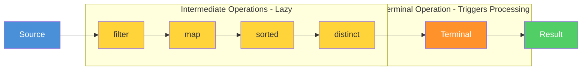

# Topic 05: Stream API

## Table of Contents

1. [Introduction](#1-introduction)
2. [Learning Objectives](#2-learning-objectives)
3. [Prerequisites](#3-prerequisites)
4. [Why This Concept Exists](#4-why-this-concept-exists)
5. [Problem Statement](#5-problem-statement)
6. [Theory](#6-theory)
7. [Internal Working](#7-internal-working)
8. [JVM Perspective](#8-jvm-perspective)
9. [Memory Representation](#9-memory-representation)
10. [Syntax](#10-syntax)
11. [Easy Example](#11-easy-example)
12. [Medium Example](#12-medium-example)
13. [Hard Example](#13-hard-example)
14. [Enterprise Example](#14-enterprise-example)
15. [Performance](#15-performance)
16. [Best Practices](#16-best-practices)
17. [Common Mistakes](#17-common-mistakes)
18. [Pitfalls](#18-pitfalls)
19. [Debugging Tips](#19-debugging-tips)
20. [Comparison Table](#20-comparison-table)
21. [Decision Tree](#21-decision-tree)
22. [Interview Questions](#22-interview-questions)
23. [Exercises](#23-exercises)
24. [Assignments](#24-assignments)
25. [Mini Project](#25-mini-project)
26. [Summary](#26-summary)
27. [References](#27-references)

---

## 1. Introduction

The Stream API, introduced in Java 8, provides a declarative, functional approach to processing collections of data. Streams enable you to process data in a pipeline style, chaining operations together to form a data processing workflow.

A Stream is not a data structure; it's a view over a data source that supports aggregate operations. Streams support internal iteration (the stream library manages the iteration) and can operate on elements sequentially or in parallel.

### Key Characteristics

| Characteristic | Description |
|----------------|-------------|
| **No Storage** | Streams don't store data; they process it |
| **Functional** | Operations return new streams |
| **Lazy** | Intermediate operations are deferred |
| **Parallelizable** | Can easily switch to parallel processing |
| **Unbounded** | Can represent infinite sequences |

### Stream Pipeline Diagram



### Stream Pipeline Components

```
Source → Intermediate Operations → Terminal Operation → Result
```

1. **Source**: Where the stream comes from (Collection, array, I/O)
2. **Intermediate Operations**: Transform the stream (filter, map, flatMap)
3. **Terminal Operation**: Produce a result (collect, reduce, forEach)
4. **Result**: The output of the terminal operation

---

## 2. Learning Objectives

After completing this topic, you will be able to:

1. Create streams from various sources
2. Understand the difference between intermediate and terminal operations
3. Apply lazy evaluation principles
4. Use parallel streams correctly
5. Build efficient stream pipelines
6. Avoid common stream pitfalls

---

## 3. Prerequisites

Before starting this topic, you should be comfortable with:

- **Lambda Expressions**: Basic syntax (Topic 02)
- **Functional Interfaces**: Predicate, Function, Consumer (Topic 03)
- **Method References**: Shorthand for lambdas (Topic 04)
- **Collections Framework**: List, Set, Map

---

## 4. Why This Concept Exists

### The Problem with Imperative Collection Processing

Processing collections imperatively requires:

1. **Manual iteration**: Writing loops
2. **Mutable state**: Managing accumulators
3. **Verbosity**: Multiple lines for simple operations
4. **Hard to parallelize**: Manual thread management

```java
// Imperative approach
List<String> result = new ArrayList<>();
for (Order order : orders) {
    if (order.getStatus() == OrderStatus.COMPLETED) {
        result.add(order.getCustomerName().toUpperCase());
    }
}
Collections.sort(result);
```

### The Stream Solution

```java
// Declarative approach
List<String> result = orders.stream()
    .filter(order -> order.getStatus() == OrderStatus.COMPLETED)
    .map(order -> order.getCustomerName().toUpperCase())
    .sorted()
    .toList();
```

---

## 5. Problem Statement

### Real-World Scenario: Data Processing Pipeline

An e-commerce platform needs to process millions of daily records:

- **Filter** orders by status
- **Transform** order data for reporting
- **Aggregate** statistics
- **Sort** results
- **Parallelize** for performance

### Requirements

1. Declarative syntax for clarity
2. Lazy evaluation for efficiency
3. Easy parallelization
4. Composable operations
5. Type-safe transformations

---

## 6. Theory

### 6.1 Stream Creation

Streams can be created from various sources:

```java
// From Collection
List<String> list = Arrays.asList("a", "b", "c");
Stream<String> stream = list.stream();
Stream<String> parallelStream = list.parallelStream();

// From Array
int[] array = {1, 2, 3};
IntStream stream = Arrays.stream(array);

// From Values
Stream<String> stream = Stream.of("a", "b", "c");

// From Range
IntStream stream = IntStream.range(0, 10);
IntStream stream = IntStream.rangeClosed(1, 10);

// From Generator
Stream<Double> stream = Stream.generate(Math::random).limit(5);

// From Iterator
Stream<Integer> stream = Stream.iterate(0, n -> n + 2).limit(5);

// From File
Stream<String> lines = Files.lines(Path.of("file.txt"));
```

### 6.2 Intermediate Operations

Intermediate operations return a new stream and are lazy:

| Operation | Description | Type |
|-----------|-------------|------|
| `filter(Predicate)` | Select elements matching predicate | Stateless |
| `map(Function)` | Transform each element | Stateless |
| `flatMap(Function)` | Flatten nested streams | Stateless |
| `distinct()` | Remove duplicates | Stateful |
| `sorted()` | Sort elements | Stateful |
| `peek(Consumer)` | Debug/inspect elements | Stateless |
| `limit(long)` | Take first n elements | Stateful |
| `skip(long)` | Skip first n elements | Stateful |

### 6.3 Terminal Operations

Terminal operations trigger processing and produce a result:

| Operation | Description | Return Type |
|-----------|-------------|-------------|
| `collect(Collector)` | Accumulate into collection | `<R>` |
| `forEach(Consumer)` | Perform action for each element | `void` |
| `reduce(BinaryOperator)` | Combine elements | `Optional<T>` |
| `count()` | Count elements | `long` |
| `anyMatch(Predicate)` | Check if any element matches | `boolean` |
| `allMatch(Predicate)` | Check if all elements match | `boolean` |
| `noneMatch(Predicate)` | Check if no element matches | `boolean` |
| `findFirst()` | Get first element | `Optional<T>` |
| `findAny()` | Get any element | `Optional<T>` |
| `min(Comparator)` | Get minimum element | `Optional<T>` |
| `max(Comparator)` | Get maximum element | `Optional<T>` |
| `toArray()` | Convert to array | `Object[]` |

### 6.4 Lazy Evaluation

Intermediate operations are lazy—they don't execute until a terminal operation:

```java
// No processing happens here
Stream<String> stream = list.stream()
    .filter(s -> {
        System.out.println("Filtering: " + s);
        return s.length() > 3;
    })
    .map(s -> {
        System.out.println("Mapping: " + s);
        return s.toUpperCase();
    });

// Processing happens here
List<String> result = stream.toList();
```

### 6.5 Parallel Streams

Parallel streams use the ForkJoinPool for concurrent processing:

```java
// Sequential
list.stream()
    .filter(...)
    .map(...)
    .toList();

// Parallel
list.parallelStream()
    .filter(...)
    .map(...)
    .toList();

// Convert sequential to parallel
list.stream()
    .parallel()
    .filter(...)
    .toList();
```

---

## 7. Internal Working

### 7.1 Stream Pipeline Execution

When a terminal operation is invoked:

1. The stream source is evaluated
2. Each intermediate operation creates a new stream
3. The terminal operation consumes the stream
4. Results are collected/produced

```
Source → Stage 1 → Stage 2 → ... → Terminal → Result
```

### 7.2 Spliterator

The `Spliterator` (splitable iterator) is the backbone of stream parallelization:

1. **Traversal**: Iterates over elements
2. **Splitting**: Divides elements for parallel processing
3. **Estimation**: Estimates remaining elements
4. **Characteristics**: Describes the source (ordered, sized, etc.)

### 7.3 ForkJoinPool

Parallel streams use the common ForkJoinPool:

```java
// Default parallelism = Runtime.getRuntime().availableProcessors()
ForkJoinPool commonPool = ForkJoinPool.commonPool();
```

---

## 8. JVM Perspective

### 8.1 Stream Object Creation

Each intermediate operation creates a new Stream object:

```
list.stream()          → ReferencePipeline$Head
    .filter(...)       → ReferencePipeline$StatelessOp
    .map(...)          → ReferencePipeline$StatelessOp
    .toList()          → ArrayList (result)
```

### 8.2 Method Invocation

Stream operations use method chaining and functional interfaces:

```
Stream.filter(Predicate) → Stream
Stream.map(Function)     → Stream
Stream.collect(Collector) → Object
```

### 8.3 JIT Optimization

The JIT compiler can optimize stream pipelines:

1. **Inlining**: Small operations are inlined
2. **Loop fusion**: Multiple operations are combined
3. **Vectorization**: Primitive streams can use SIMD instructions

---

## 9. Memory Representation

### 9.1 Stream Object Layout

```
Stream Object:
┌─────────────────────────────────────┐
│  Header (mark word + klass pointer) │
├─────────────────────────────────────┤
│  Reference to source Spliterator    │
│  Pipeline stages (linked list)      │
│  Flags (parallel, ordered, etc.)    │
└─────────────────────────────────────┘
```

### 9.2 Pipeline Memory

Each pipeline stage holds references to:
- Previous stage (source)
- Operation function (lambda/method reference)
- Next stage (if any)

Memory is proportional to pipeline depth, not data size.

---

## 10. Syntax

### 10.1 Creating Streams

```java
// From Collection
Stream<T> stream = collection.stream();
Stream<T> parallelStream = collection.parallelStream();

// From Array
IntStream stream = IntStream.of(array);
Stream<T> stream = Arrays.stream(array);

// From Values
Stream<T> stream = Stream.of(values);

// From Range
IntStream stream = IntStream.range(0, 100);
LongStream stream = LongStream.rangeClosed(1, 100);

// From Generator
Stream<T> stream = Stream.generate(supplier).limit(n);

// From Iterator
Stream<T> stream = Stream.iterate(seed, unaryOperator).limit(n);
```

### 10.2 Pipeline Syntax

```java
result = stream
    .intermediateOp1(...)
    .intermediateOp2(...)
    ...
    .terminalOp(...);
```

### 10.3 Parallel Syntax

```java
// Parallel from source
list.parallelStream()

// Convert to parallel
list.stream().parallel()

// Convert to sequential
list.parallelStream().sequential()
```

---

## 11. Easy Example

### Example 1: Basic Stream Operations

```java
package academy.javaengineering.functional.streams;

import java.util.Arrays;
import java.util.List;
import java.util.stream.Collectors;

public class BasicStreams {
    public static void main(String[] args) {
        List<Integer> numbers = Arrays.asList(1, 2, 3, 4, 5, 6, 7, 8, 9, 10);
        
        // Filter even numbers
        List<Integer> even = numbers.stream()
            .filter(n -> n % 2 == 0)
            .toList();
        System.out.println("Even: " + even);
        
        // Map to squares
        List<Integer> squares = numbers.stream()
            .map(n -> n * n)
            .toList();
        System.out.println("Squares: " + squares);
        
        // Sum
        int sum = numbers.stream()
            .reduce(0, Integer::sum);
        System.out.println("Sum: " + sum);
        
        // Count
        long count = numbers.stream()
            .filter(n -> n > 5)
            .count();
        System.out.println("Count > 5: " + count);
    }
}
```

### Example 2: String Processing

```java
package academy.javaengineering.functional.streams;

import java.util.Arrays;
import java.util.List;

public class StringStreams {
    public static void main(String[] args) {
        List<String> names = Arrays.asList("Alice", "Bob", "Charlie", "Diana", "Eve");
        
        // Filter names starting with 'A'
        List<String> aNames = names.stream()
            .filter(name -> name.startsWith("A"))
            .toList();
        System.out.println("A names: " + aNames);
        
        // Convert to uppercase
        List<String> upperNames = names.stream()
            .map(String::toUpperCase)
            .toList();
        System.out.println("Uppercase: " + upperNames);
        
        // Get lengths
        List<Integer> lengths = names.stream()
            .map(String::length)
            .toList();
        System.out.println("Lengths: " + lengths);
        
        // Join
        String joined = names.stream()
            .collect(java.util.stream.Collectors.joining(", "));
        System.out.println("Joined: " + joined);
    }
}
```

---

## 12. Medium Example

### Example 1: Complex Stream Pipeline

```java
package academy.javaengineering.functional.streams;

import java.util.*;
import java.util.stream.Collectors;

public class ComplexPipeline {
    
    record Order(String id, String customer, List<Item> items, String status) {}
    record Item(String name, int quantity, double price) {}
    
    public static void main(String[] args) {
        List<Order> orders = List.of(
            new Order("O1", "Alice", List.of(new Item("Laptop", 1, 999.99), new Item("Mouse", 2, 29.99)), "COMPLETED"),
            new Order("O2", "Bob", List.of(new Item("Phone", 1, 699.99)), "PENDING"),
            new Order("O3", "Alice", List.of(new Item("Tablet", 1, 399.99), new Item("Case", 1, 49.99)), "COMPLETED"),
            new Order("O4", "Charlie", List.of(new Item("Headphones", 1, 199.99)), "CANCELLED")
        );
        
        // Calculate total revenue from completed orders
        double totalRevenue = orders.stream()
            .filter(order -> "COMPLETED".equals(order.status()))
            .flatMap(order -> order.items().stream())
            .mapToDouble(item -> item.quantity() * item.price())
            .sum();
        
        System.out.printf("Total revenue: $%.2f%n", totalRevenue);
        
        // Get unique customer names from non-cancelled orders
        Set<String> customers = orders.stream()
            .filter(order -> !"CANCELLED".equals(order.status()))
            .map(Order::customer)
            .collect(Collectors.toSet());
        
        System.out.println("Active customers: " + customers);
        
        // Group orders by customer
        Map<String, List<Order>> ordersByCustomer = orders.stream()
            .collect(Collectors.groupingBy(Order::customer));
        
        System.out.println("Orders by customer: " + ordersByCustomer);
    }
}
```

### Example 2: Stream Debugging

```java
package academy.javaengineering.functional.streams;

import java.util.*;
import java.util.stream.Collectors;

public class StreamDebugging {
    
    public static void main(String[] args) {
        List<Integer> numbers = Arrays.asList(1, 2, 3, 4, 5, 6, 7, 8, 9, 10);
        
        // Using peek for debugging
        List<Integer> result = numbers.stream()
            .filter(n -> {
                System.out.println("Filter: " + n);
                return n % 2 == 0;
            })
            .peek(n -> System.out.println("After filter: " + n))
            .map(n -> {
                System.out.println("Map: " + n);
                return n * n;
            })
            .peek(n -> System.out.println("After map: " + n))
            .toList();
        
        System.out.println("Result: " + result);
    }
}
```

---

## 13. Hard Example

### Example 1: Custom Collector

```java
package academy.javaengineering.functional.streams;

import java.util.*;
import java.util.function.*;
import java.util.stream.Collector;

public class CustomCollectorExample {
    
    public static <T> Collector<T, ?, Map<Boolean, List<T>>> partitioningBy(
            Predicate<T> predicate) {
        return Collector.of(
            () -> new HashMap<Boolean, List<T>>() {{
                put(true, new ArrayList<>());
                put(false, new ArrayList<>());
            }},
            (map, item) -> map.get(predicate.test(item)).add(item),
            (map1, map2) -> {
                map1.get(true).addAll(map2.get(true));
                map1.get(false).addAll(map2.get(false));
                return map1;
            }
        );
    }
    
    public static void main(String[] args) {
        List<Integer> numbers = Arrays.asList(1, 2, 3, 4, 5, 6, 7, 8, 9, 10);
        
        // Custom partitioning
        Map<Boolean, List<Integer>> partitioned = numbers.stream()
            .collect(partitioningBy(n -> n % 2 == 0));
        
        System.out.println("Even: " + partitioned.get(true));
        System.out.println("Odd: " + partitioned.get(false));
        
        // Using built-in partitioning
        Map<Boolean, List<Integer>> builtInPartitioned = numbers.stream()
            .collect(Collectors.partitioningBy(n -> n % 2 == 0));
        
        System.out.println("Built-in even: " + builtInPartitioned.get(true));
    }
}
```

### Example 2: Parallel Stream with Custom ForkJoinPool

```java
package academy.javaengineering.functional.streams;

import java.util.*;
import java.util.concurrent.ForkJoinPool;
import java.util.stream.Collectors;
import java.util.stream.IntStream;

public class ParallelStreamExample {
    
    public static void main(String[] args) {
        // Custom ForkJoinPool
        ForkJoinPool customPool = new ForkJoinPool(4);
        
        try {
            // Process with custom pool
            List<Integer> result = customPool.submit(() ->
                IntStream.rangeClosed(1, 100)
                    .parallel()
                    .filter(n -> n % 2 == 0)
                    .map(n -> n * n)
                    .boxed()
                    .collect(Collectors.toList())
            ).get();
            
            System.out.println("Custom pool result: " + result.size());
        } catch (Exception e) {
            e.printStackTrace();
        }
        
        // Performance comparison
        long start = System.nanoTime();
        long sum1 = IntStream.rangeClosed(1, 100_000_000)
            .sequential()
            .sum();
        long sequentialTime = System.nanoTime() - start;
        
        start = System.nanoTime();
        long sum2 = IntStream.rangeClosed(1, 100_000_000)
            .parallel()
            .sum();
        long parallelTime = System.nanoTime() - start;
        
        System.out.printf("Sequential: %.2f ms%n", sequentialTime / 1_000_000.0);
        System.out.printf("Parallel: %.2f ms%n", parallelTime / 1_000_000.0);
        System.out.printf("Speedup: %.2fx%n", (double) sequentialTime / parallelTime);
    }
}
```

---

## 14. Enterprise Example

### Example 1: Order Processing Pipeline

```java
package academy.javaengineering.functional.streams;

import java.math.BigDecimal;
import java.time.LocalDateTime;
import java.util.*;
import java.util.stream.Collectors;

public class OrderProcessingPipeline {
    
    public record Order(
        String id,
        String customerId,
        List<OrderItem> items,
        OrderStatus status,
        LocalDateTime createdAt
    ) {}
    
    public record OrderItem(String productId, String productName, int quantity, BigDecimal unitPrice) {}
    
    public enum OrderStatus { PENDING, PROCESSING, SHIPPED, DELIVERED, CANCELLED }
    
    public record OrderSummary(
        String orderId,
        String customerName,
        BigDecimal totalAmount,
        int itemCount,
        String status
    ) {}
    
    public static class OrderService {
        
        public List<OrderSummary> getOrderSummaries(List<Order> orders, OrderStatus filterStatus) {
            return orders.stream()
                .filter(order -> order.status() == filterStatus)
                .map(order -> new OrderSummary(
                    order.id(),
                    order.customerId(),
                    calculateTotal(order.items()),
                    order.items().stream().mapToInt(OrderItem::quantity).sum(),
                    order.status().name()
                ))
                .sorted(Comparator.comparing(OrderSummary::totalAmount).reversed())
                .toList();
        }
        
        public Map<String, BigDecimal> getRevenueByCustomer(List<Order> orders) {
            return orders.stream()
                .filter(order -> order.status() != OrderStatus.CANCELLED)
                .collect(Collectors.groupingBy(
                    Order::customerId,
                    Collectors.reducing(
                        BigDecimal.ZERO,
                        order -> calculateTotal(order.items()),
                        BigDecimal::add
                    )
                ));
        }
        
        public List<Order> getRecentOrders(List<Order> orders, int days) {
            LocalDateTime cutoff = LocalDateTime.now().minusDays(days);
            return orders.stream()
                .filter(order -> order.createdAt().isAfter(cutoff))
                .sorted(Comparator.comparing(Order::createdAt).reversed())
                .toList();
        }
        
        private BigDecimal calculateTotal(List<OrderItem> items) {
            return items.stream()
                .map(item -> item.unitPrice().multiply(BigDecimal.valueOf(item.quantity())))
                .reduce(BigDecimal.ZERO, BigDecimal::add);
        }
    }
    
    public static void main(String[] args) {
        OrderService service = new OrderService();
        List<Order> orders = createSampleOrders();
        
        // Get order summaries
        List<OrderSummary> summaries = service.getOrderSummaries(orders, OrderStatus.COMPLETED);
        System.out.println("Order summaries:");
        summaries.forEach(s -> System.out.println("  " + s));
        
        // Get revenue by customer
        Map<String, BigDecimal> revenue = service.getRevenueByCustomer(orders);
        System.out.println("\nRevenue by customer:");
        revenue.forEach((customer, amount) -> 
            System.out.printf("  %s: $%s%n", customer, amount));
        
        // Get recent orders
        List<Order> recent = service.getRecentOrders(orders, 7);
        System.out.println("\nRecent orders:");
        recent.forEach(o -> System.out.println("  " + o.id()));
    }
    
    private static List<Order> createSampleOrders() {
        return List.of(
            new Order("O1", "Alice", 
                List.of(new OrderItem("P1", "Laptop", 1, new BigDecimal("999.99"))),
                OrderStatus.COMPLETED, LocalDateTime.now().minusDays(2)),
            new Order("O2", "Bob",
                List.of(new OrderItem("P2", "Phone", 1, new BigDecimal("699.99"))),
                OrderStatus.COMPLETED, LocalDateTime.now().minusDays(5)),
            new Order("O3", "Alice",
                List.of(new OrderItem("P3", "Tablet", 1, new BigDecimal("399.99"))),
                OrderStatus.PENDING, LocalDateTime.now().minusDays(1))
        );
    }
}
```

---

## 15. Performance

### 15.1 Stream vs Loop Performance

| Operation | Stream | Loop | Winner |
|-----------|--------|------|--------|
| **Simple iteration** | Baseline | Baseline | Tie |
| **Complex pipelines** | Better (JIT optimization) | Baseline | Stream |
| **Parallel processing** | Much better | Manual threads | Stream |
| **Small datasets** | Slightly slower | Slightly faster | Loop |

### 15.2 Performance Tips

1. **Use primitive streams**: `IntStream`, `LongStream`, `DoubleStream` avoid boxing
2. **Avoid parallel for small datasets**: Overhead exceeds benefit
3. **Use `toList()` instead of `collect(Collectors.toList())`**: More efficient
4. **Short-circuit when possible**: `findFirst()`, `findAny()`, `anyMatch()`
5. **Reuse stream operations**: Extract to methods when possible

---

## 16. Best Practices

1. **Keep pipelines simple**: One operation per line
2. **Use method references**: More readable
3. **Prefer `toList()` over `collect(Collectors.toList())`**
4. **Use parallel streams for large, CPU-bound datasets**
5. **Avoid side effects in stream operations**
6. **Use `peek()` for debugging only**
7. **Consider lazy evaluation for expensive operations**

---

## 17. Common Mistakes

### Mistake 1: Modifying Collection During Stream

```java
// WRONG: ConcurrentModificationException
List<String> list = new ArrayList<>(List.of("a", "b", "c"));
list.stream()
    .filter(s -> {
        list.remove(s);  // Modifying collection!
        return true;
    })
    .toList();

// CORRECT: Process separately
List<String> toRemove = list.stream()
    .filter(s -> s.length() > 1)
    .toList();
list.removeAll(toRemove);
```

### Mistake 2: Using Parallel for Small Datasets

```java
// WRONG: Overhead exceeds benefit
list.parallelStream()
    .filter(s -> s.length() > 3)
    .toList();  // For small lists, sequential is faster

// CORRECT: Use sequential for small datasets
list.stream()
    .filter(s -> s.length() > 3)
    .toList();
```

---

## 18. Pitfalls

1. **Single-use**: Streams can only be consumed once
2. **Ordering**: Parallel streams don't guarantee order
3. **Stateful operations**: `distinct()`, `sorted()` require full traversal
4. **Side effects**: Can break parallel processing

---

## 19. Debugging Tips

### 1. Use peek() for Debugging

```java
list.stream()
    .filter(predicate)
    .peek(item -> System.out.println("After filter: " + item))
    .map(transformer)
    .peek(item -> System.out.println("After map: " + item))
    .toList();
```

### 2. Extract Complex Operations

```java
// Instead of complex inline lambda
list.stream()
    .filter(item -> item.getStatus() == Status.ACTIVE && item.getPriority() > 5)
    .toList();

// Extract to named method
Predicate<Item> isActiveHighPriority = this::isActiveHighPriority;
list.stream().filter(isActiveHighPriority).toList();
```

---

## 20. Comparison Table

| Feature | Stream | Loop | Parallel Stream |
|---------|--------|------|-----------------|
| **Syntax** | Declarative | Imperative | Declarative |
| **Readability** | Excellent | Good | Good |
| **Performance** | Good | Good | Better (CPU-bound) |
| **Parallelization** | Built-in | Manual | Automatic |
| **Memory** | More objects | Less | More |

---

## 21. Decision Tree

```
Should you use a Stream?

┌─ Are you processing a collection?
│  ├─ YES → Consider Stream
│  └─ NO → Use other approaches
│
├─ Is the pipeline complex (3+ operations)?
│  ├─ YES → Use Stream for readability
│  └─ NO → Either is fine
│
├─ Is the dataset large (>10,000 elements)?
│  ├─ YES → Consider parallel stream
│  └─ NO → Use sequential stream
│
├─ Are you doing CPU-bound work?
│  ├─ YES → Parallel stream may help
│  └─ NO → Sequential stream
│
└─ Do you need side effects?
   ├─ YES → Avoid streams or use peek()
   └─ NO → Use streams freely
```

---

## 22. Interview Questions

### Q1: What is the difference between intermediate and terminal operations?

**Answer**: Intermediate operations return a new stream and are lazy. Terminal operations trigger processing and produce a result. Intermediate operations like `filter()`, `map()`, `sorted()` are deferred until a terminal operation like `collect()`, `forEach()`, `reduce()` is invoked.

### Q2: When should you use parallel streams?

**Answer**: Use parallel streams when:
1. The dataset is large (>10,000 elements)
2. The operation is CPU-bound
3. Order doesn't matter
4. Each element can be processed independently

### Q3: What is lazy evaluation in streams?

**Answer**: Lazy evaluation means intermediate operations don't execute until a terminal operation is invoked. This allows the stream library to optimize the pipeline, potentially fusing operations or short-circuiting.

### Q4: Can you reuse a Stream?

**Answer**: No. Streams are single-use. Once a terminal operation is invoked, the stream is consumed and cannot be reused. Create a new stream from the source if you need to process again.

### Q5: What is the difference between `reduce()` and `collect()`?

**Answer**: `reduce()` combines elements into a single value using a binary operator. `collect()` accumulates elements into a mutable container using a Collector. `reduce()` is for reduction, `collect()` is for mutable accumulation.

---

## 23. Exercises

### Exercise 1: Basic Stream Operations
Given a list of integers, use streams to:
1. Filter positive numbers
2. Square each number
3. Sum the squares

### Exercise 2: String Processing
Given a list of strings, use streams to:
1. Filter strings longer than 3 characters
2. Convert to uppercase
3. Sort alphabetically
4. Join with commas

### Exercise 3: Custom Collector
Implement a custom collector that:
1. Collects strings into a comma-separated string
2. Handles empty strings
3. Truncates to a maximum length

---

## 24. Assignments

### Assignment 1: Data Processing Pipeline
Build a data processing pipeline that:
1. Reads data from a source
2. Filters invalid records
3. Transforms data
4. Aggregates results
5. Outputs to a destination

### Assignment 2: Parallel Processing
Implement a parallel processing system that:
1. Processes large datasets in parallel
2. Uses custom ForkJoinPool
3. Handles exceptions gracefully
4. Measures performance

### Assignment 3: Stream Utilities
Create a utility class with stream helpers:
1. Custom `toUnmodifiableList()` collector
2. Custom `groupingBy()` with multiple values
3. Custom `partitioningBy()` with custom logic

---

## 25. Mini Project

### Project: Stream-Based Analytics Engine

Build an analytics engine using Stream API:

**Requirements:**
1. Process event streams
2. Calculate aggregates (sum, count, average)
3. Support time-based windowing
4. Implement custom collectors
5. Support parallel processing

**Starter Code:**
```java
package academy.javaengineering.functional.streams.project;

import java.time.LocalDateTime;
import java.util.*;
import java.util.stream.Collectors;

public class AnalyticsEngine {
    
    public record Event(
        String id,
        String type,
        double value,
        LocalDateTime timestamp
    ) {}
    
    public static class EventProcessor {
        
        public double calculateSum(List<Event> events, String type) {
            return events.stream()
                .filter(e -> e.type().equals(type))
                .mapToDouble(Event::value)
                .sum();
        }
        
        // TODO: Implement more analytics methods
    }
}
```

---

## 26. Summary

The Stream API provides a powerful, declarative approach to data processing. Key takeaways:

1. **Pipelines**: Source → Intermediate → Terminal → Result
2. **Lazy Evaluation**: Intermediate operations are deferred
3. **Parallel Processing**: Built-in support via `parallelStream()`
4. **Functional Style**: Use lambdas and method references
5. **Single-use**: Streams cannot be reused

### Next Steps
- Topic 06: Stream Operations — Advanced stream operations
- Topic 07: Collectors — Custom collector implementation

---

## 27. References

1. [Oracle Java Tutorials: Streams](https://docs.oracle.com/en/java/javase/21/docs/api/java/util/stream/package-summary.html)
2. [Java Language Specification: Streams](https://docs.oracle.com/javase/specs/jls/se21/html/jls-12.html)
3. [Effective Java, 3rd Edition - Item 43](https://www.oreilly.com/library/view/effective-java/9780134686097/)
4. [Baeldung: Java Streams](https://www.baeldung.com/java-streams)
