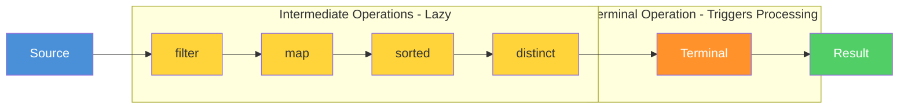

# Topic 05: Stream API

## Table of Contents

1. [Introduction](#1-introduction)
2. [Learning Objectives](#2-learning-objectives)
3. [Prerequisites](#3-prerequisites)
4. [Why This Concept Exists](#4-why-this-concept-exists)
5. [Problem Statement](#5-problem-statement)
6. [Theory](#6-theory)
7. [Internal Working](#7-internal-working)
8. [JVM Perspective](#8-jvm-perspective)
9. [Memory Representation](#9-memory-representation)
10. [Syntax](#10-syntax)
11. [Easy Example](#11-easy-example)
12. [Medium Example](#12-medium-example)
13. [Hard Example](#13-hard-example)
14. [Enterprise Example](#14-enterprise-example)
15. [Performance](#15-performance)
16. [Best Practices](#16-best-practices)
17. [Common Mistakes](#17-common-mistakes)
18. [Pitfalls](#18-pitfalls)
19. [Debugging Tips](#19-debugging-tips)
20. [Comparison Table](#20-comparison-table)
21. [Decision Tree](#21-decision-tree)
22. [Interview Questions](#22-interview-questions)
23. [Exercises](#23-exercises)
24. [Assignments](#24-assignments)
25. [Mini Project](#25-mini-project)
26. [Summary](#26-summary)
27. [References](#27-references)

---

## 1. Introduction

The Stream API, introduced in Java 8, provides a declarative, functional approach to processing collections of data. Streams enable you to process data in a pipeline style, chaining operations together to form a data processing workflow.

A Stream is not a data structure; it's a view over a data source that supports aggregate operations. Streams support internal iteration (the stream library manages the iteration) and can operate on elements sequentially or in parallel.

### Key Characteristics

| Characteristic | Description |
|----------------|-------------|
| **No Storage** | Streams don't store data; they process it |
| **Functional** | Operations return new streams |
| **Lazy** | Intermediate operations are deferred |
| **Parallelizable** | Can easily switch to parallel processing |
| **Unbounded** | Can represent infinite sequences |

### Stream Pipeline Diagram



### Stream Pipeline Components

```
Source → Intermediate Operations → Terminal Operation → Result
```

1. **Source**: Where the stream comes from (Collection, array, I/O)
2. **Intermediate Operations**: Transform the stream (filter, map, flatMap)
3. **Terminal Operation**: Produce a result (collect, reduce, forEach)
4. **Result**: The output of the terminal operation

---

## 2. Learning Objectives

After completing this topic, you will be able to:

1. Create streams from various sources
2. Understand the difference between intermediate and terminal operations
3. Apply lazy evaluation principles
4. Use parallel streams correctly
5. Build efficient stream pipelines
6. Avoid common stream pitfalls

---

## 3. Prerequisites

Before starting this topic, you should be comfortable with:

- **Lambda Expressions**: Basic syntax (Topic 02)
- **Functional Interfaces**: Predicate, Function, Consumer (Topic 03)
- **Method References**: Shorthand for lambdas (Topic 04)
- **Collections Framework**: List, Set, Map

---

## 4. Why This Concept Exists

### The Problem with Imperative Collection Processing

Processing collections imperatively requires:

1. **Manual iteration**: Writing loops
2. **Mutable state**: Managing accumulators
3. **Verbosity**: Multiple lines for simple operations
4. **Hard to parallelize**: Manual thread management

```java
// Imperative approach
List<String> result = new ArrayList<>();
for (Order order : orders) {
    if (order.getStatus() == OrderStatus.COMPLETED) {
        result.add(order.getCustomerName().toUpperCase());
    }
}
Collections.sort(result);
```

### The Stream Solution

```java
// Declarative approach
List<String> result = orders.stream()
    .filter(order -> order.getStatus() == OrderStatus.COMPLETED)
    .map(order -> order.getCustomerName().toUpperCase())
    .sorted()
    .toList();
```

---

## 4b. Why Streams Exist

The Stream API was introduced in Java 8 to provide a declarative, composable approach to data processing that imperative loops cannot match.

**Declarative processing expresses intent, not mechanism.** With loops, you describe *how* to process data (iterate, check condition, accumulate). With streams, you describe *what* you want (filter, transform, collect). This separation of intent from implementation makes code easier to read, maintain, and reason about.

```java
// Imperative: how to do it
List<String> result = new ArrayList<>();
for (Order order : orders) {
    if (order.getTotal() > 1000) {
        result.add(order.getCustomer());
    }
}

// Declarative: what to do
List<String> result = orders.stream()
    .filter(o -> o.getTotal() > 1000)
    .map(Order::getCustomer)
    .toList();
```

**Parallel execution is built-in.** Changing `.stream()` to `.parallelStream()` parallelizes the entire pipeline across CPU cores. The ForkJoinPool splits the data source, processes chunks in parallel, and merges results — all automatically. With loops, parallelization requires manually partitioning data, creating threads, coordinating results, and handling exceptions.

**Composability enables reuse.** Stream operations are chainable building blocks. You can create a base pipeline (filter + map) and extend it with additional operations (sorted, limit, collect) without modifying the original code. This is difficult with loops because each processing step requires a new loop or method.

**Lazy evaluation optimizes performance.** Intermediate operations (filter, map, limit) are deferred — they don't execute until a terminal operation triggers processing. This means the stream can short-circuit (e.g., `findFirst()` stops after one match) and fuse operations (e.g., filter + map can be done in a single pass). Loops execute eagerly, processing every element even if you only need the first match.

**Streams provide a consistent API across data sources.** The same stream operations work on Lists, Sets, arrays, files, databases, and generators. The processing logic is decoupled from the data source, making it easy to switch implementations without rewriting processing code.

## 5. Problem Statement

### Real-World Scenario: Data Processing Pipeline

An e-commerce platform needs to process millions of daily records:

- **Filter** orders by status
- **Transform** order data for reporting
- **Aggregate** statistics
- **Sort** results
- **Parallelize** for performance

### Requirements

1. Declarative syntax for clarity
2. Lazy evaluation for efficiency
3. Easy parallelization
4. Composable operations
5. Type-safe transformations

---

## 6. Theory

### 6.1 Stream Creation

Streams can be created from various sources:

```java
// From Collection
List<String> list = Arrays.asList("a", "b", "c");
Stream<String> stream = list.stream();
Stream<String> parallelStream = list.parallelStream();

// From Array
int[] array = {1, 2, 3};
IntStream stream = Arrays.stream(array);

// From Values
Stream<String> stream = Stream.of("a", "b", "c");

// From Range
IntStream stream = IntStream.range(0, 10);
IntStream stream = IntStream.rangeClosed(1, 10);

// From Generator
Stream<Double> stream = Stream.generate(Math::random).limit(5);

// From Iterator
Stream<Integer> stream = Stream.iterate(0, n -> n + 2).limit(5);

// From File
Stream<String> lines = Files.lines(Path.of("file.txt"));
```

### 6.2 Intermediate Operations

Intermediate operations return a new stream and are lazy:

| Operation | Description | Type |
|-----------|-------------|------|
| `filter(Predicate)` | Select elements matching predicate | Stateless |
| `map(Function)` | Transform each element | Stateless |
| `flatMap(Function)` | Flatten nested streams | Stateless |
| `distinct()` | Remove duplicates | Stateful |
| `sorted()` | Sort elements | Stateful |
| `peek(Consumer)` | Debug/inspect elements | Stateless |
| `limit(long)` | Take first n elements | Stateful |
| `skip(long)` | Skip first n elements | Stateful |

### 6.3 Terminal Operations

Terminal operations trigger processing and produce a result:

| Operation | Description | Return Type |
|-----------|-------------|-------------|
| `collect(Collector)` | Accumulate into collection | `<R>` |
| `forEach(Consumer)` | Perform action for each element | `void` |
| `reduce(BinaryOperator)` | Combine elements | `Optional<T>` |
| `count()` | Count elements | `long` |
| `anyMatch(Predicate)` | Check if any element matches | `boolean` |
| `allMatch(Predicate)` | Check if all elements match | `boolean` |
| `noneMatch(Predicate)` | Check if no element matches | `boolean` |
| `findFirst()` | Get first element | `Optional<T>` |
| `findAny()` | Get any element | `Optional<T>` |
| `min(Comparator)` | Get minimum element | `Optional<T>` |
| `max(Comparator)` | Get maximum element | `Optional<T>` |
| `toArray()` | Convert to array | `Object[]` |

### 6.4 Lazy Evaluation

Intermediate operations are lazy—they don't execute until a terminal operation:

```java
// No processing happens here
Stream<String> stream = list.stream()
    .filter(s -> {
        System.out.println("Filtering: " + s);
        return s.length() > 3;
    })
    .map(s -> {
        System.out.println("Mapping: " + s);
        return s.toUpperCase();
    });

// Processing happens here
List<String> result = stream.toList();
```

### 6.5 Parallel Streams

Parallel streams use the ForkJoinPool for concurrent processing:

```java
// Sequential
list.stream()
    .filter(...)
    .map(...)
    .toList();

// Parallel
list.parallelStream()
    .filter(...)
    .map(...)
    .toList();

// Convert sequential to parallel
list.stream()
    .parallel()
    .filter(...)
    .toList();
```

---

## 7. Internal Working

### 7.1 Stream Pipeline Execution

When a terminal operation is invoked:

1. The stream source is evaluated
2. Each intermediate operation creates a new stream
3. The terminal operation consumes the stream
4. Results are collected/produced

```
Source → Stage 1 → Stage 2 → ... → Terminal → Result
```

### 7.2 Spliterator

The `Spliterator` (splitable iterator) is the backbone of stream parallelization:

1. **Traversal**: Iterates over elements
2. **Splitting**: Divides elements for parallel processing
3. **Estimation**: Estimates remaining elements
4. **Characteristics**: Describes the source (ordered, sized, etc.)

### 7.3 ForkJoinPool

Parallel streams use the common ForkJoinPool:

```java
// Default parallelism = Runtime.getRuntime().availableProcessors()
ForkJoinPool commonPool = ForkJoinPool.commonPool();
```

---

## 8. JVM Perspective

### 8.1 Stream Object Creation

Each intermediate operation creates a new Stream object:

```
list.stream()          → ReferencePipeline$Head
    .filter(...)       → ReferencePipeline$StatelessOp
    .map(...)          → ReferencePipeline$StatelessOp
    .toList()          → ArrayList (result)
```

### 8.2 Method Invocation

Stream operations use method chaining and functional interfaces:

```
Stream.filter(Predicate) → Stream
Stream.map(Function)     → Stream
Stream.collect(Collector) → Object
```

### 8.3 JIT Optimization

The JIT compiler can optimize stream pipelines:

1. **Inlining**: Small operations are inlined
2. **Loop fusion**: Multiple operations are combined
3. **Vectorization**: Primitive streams can use SIMD instructions

---

## 9. Memory Representation

### 9.1 Stream Object Layout

```
Stream Object:
┌─────────────────────────────────────┐
│  Header (mark word + klass pointer) │
├─────────────────────────────────────┤
│  Reference to source Spliterator    │
│  Pipeline stages (linked list)      │
│  Flags (parallel, ordered, etc.)    │
└─────────────────────────────────────┘
```

### 9.2 Pipeline Memory

Each pipeline stage holds references to:
- Previous stage (source)
- Operation function (lambda/method reference)
- Next stage (if any)

Memory is proportional to pipeline depth, not data size.

---

## 10. Syntax

### 10.1 Creating Streams

```java
// From Collection
Stream<T> stream = collection.stream();
Stream<T> parallelStream = collection.parallelStream();

// From Array
IntStream stream = IntStream.of(array);
Stream<T> stream = Arrays.stream(array);

// From Values
Stream<T> stream = Stream.of(values);

// From Range
IntStream stream = IntStream.range(0, 100);

---

## Engineering Decision Framework

### ✅ Use Stream API when:
- Data transformation, filtering, or aggregation is needed
- Processing collections declaratively improves readability
- Parallel processing can leverage multiple CPU cores
- Chaining multiple operations on a data pipeline
- Working with Optional return values from find/min/max

### ❌ Avoid Stream API when:
- Simple loops are clearer and more performant
- Performance-critical hot paths (stream overhead ~5-10%)
- You need to modify the source collection during iteration
- Debugging complex stream pipelines is required
- Operations are side-effect heavy (use forEach carefully)

### Better Alternatives

| Alternative | When to use |
|-------------|-------------|
| Traditional for-loop | Simple iteration, performance-critical code |
| parallelStream() | Large datasets with CPU-bound operations |
| Collectors utilities | Complex groupings and aggregations |
| for-each with mutation | When you need to modify external state |

### Production Examples
- E-commerce order filtering and reporting
- Log file processing and analysis
- Data validation pipelines
- Database result set transformations
- Real-time event stream processing

### Common Production Mistakes
- Using parallelStream() on small datasets (overhead exceeds benefit)
- Side effects inside stream operations (use collect instead)
- Not closing streams from I/O sources
- Creating intermediate lists unnecessarily (use streams directly)
- Using findFirst() without considering ordering implications

## See Also
- [Lambda Expressions](../02-lambda-expressions/) — Core syntax powering stream operations
- [Functional Interfaces](../03-functional-interfaces/) — Predicate, Function, Consumer used in streams
- [Method References](../04-method-references/) — Shorthand for stream lambdas
- [Collections Framework](../../04-collections/) — Data sources streams operate on

[📖 Continue to Part 2](README-part2.md)
```
