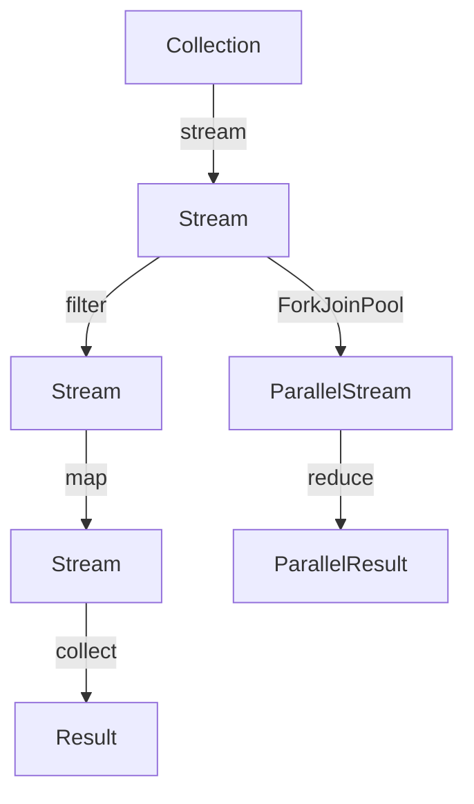
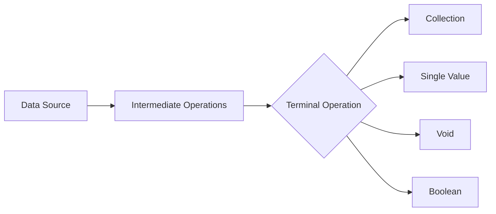

# Module 07: Functional Programming

> **Difficulty:** ⭐⭐⭐ Intermediate  
> **Reading:** 35 min | **Practice:** 60 min | **Total:** 95 min

## Overview
Processing collections with loops and mutable accumulators produces verbose, error-prone code that's hard to parallelize. The Stream API lets you process data declaratively — filtering, transforming, and aggregating with method chaining — while enabling lazy evaluation and automatic parallelization. This module covers streams, lambda expressions, functional interfaces, and the Collectors API.

## Learning Objectives
- Build stream pipelines that filter, transform, and aggregate data declaratively
- Explain how lazy evaluation defers work until a terminal operation triggers it
- Choose the right Collector for grouping, joining, reducing, and partitioning data
- Decide when parallel streams improve performance and when they hurt it
- Write custom collectors and stream operations for specialized aggregation needs

## Prerequisites
- Collections framework knowledge
- Lambda expressions
- Functional interfaces

## History
- **1995** — Java 1.0 had anonymous inner classes (verbose functional style) to provide a way to implement callbacks and event handlers, but lacked concise syntax
- **2004** — Java 5 added `Iterable` interface for for-each loops to simplify iteration over collections and arrays
- **2011** — Java 7 added `ForkJoinPool` for parallel processing to improve performance of divide-and-conquer tasks
- **2014** — Java 8 introduced the Stream API, lambda expressions, and functional interfaces (`Predicate`, `Function`, `Consumer`, `Supplier`) to enable functional programming, simplify bulk data processing, and reduce boilerplate
- **2015** — Java 8 added `Collectors` for complex aggregations to provide a rich set of reduction operations for streams
- **2016** — Java 9 added `Stream.ofNullable()`, `takeWhile()`, `dropWhile()` to enhance stream operations with null-safe and conditional processing
- **2017** — Java 10 added `Collectors.toUnmodifiableList()` to create immutable lists from streams, improving safety and encapsulation
- **2021** — Java 16 added `Stream.toList()` to simplify collecting stream results into a list, reducing verbosity
- **2021** — Java 17 added `Stream.mapMulti()` for flat-mapping to provide an alternative to flatMap with better performance for certain use cases
- **2021** — Java 17 continued `Optional` improvements

## Production Notes
- **Where is it used?** In all Java applications that process collections, perform data transformations, or need parallel processing
- **Why is it useful?** Provides declarative, concise, and potentially parallel data processing with method chaining and lazy evaluation
- **When should it be avoided?** For simple iterations where loops are clearer, or when performance is critical and custom parallelization is needed
- **Alternative?** Traditional for loops, parallel arrays, or third-party stream libraries

## Why This Concept Exists
Processing collections required verbose loops, mutable accumulators, and imperative code. Streams enable:
- Declarative data processing
- Method chaining for readability
- Automatic parallelization
- Lazy evaluation for performance
- Functional composition

## Problem Statement
How do you process collections of data in a concise, readable, and potentially parallel manner?

## Core Concepts

### Stream Characteristics
- **Not a data structure** — computed on demand
- **Lazy** — intermediate operations deferred
- **Single-use** — consumed after terminal operation
- **Parallelizable** — automatic threading

### Stream Pipeline
```
Source → Intermediate Operations → Terminal Operation → Result
```

### Intermediate Operations (Lazy)
| Operation | Description | Example |
|-----------|-------------|---------|
| filter | Select elements | stream.filter(x -> x > 0) |
| map | Transform elements | stream.map(String::toUpperCase) |
| flatMap | Flatten nested | stream.flatMap(Collection::stream) |
| distinct | Remove duplicates | stream.distinct() |
| sorted | Sort elements | stream.sorted() |
| peek | Debug/inspect | stream.peek(System.out::println) |
| limit | Truncate | stream.limit(5) |
| skip | Skip elements | stream.skip(3) |

### Terminal Operations (Eager)
| Operation | Description | Returns |
|-----------|-------------|---------|
| collect | Accumulate to collection | Collection |
| forEach | Iterate | void |
| reduce | Combine elements | Optional |
| count | Count elements | long |
| findFirst | First element | Optional |
| findAny | Any element | Optional |
| anyMatch | Check condition | boolean |
| allMatch | Check all | boolean |
| noneMatch | Check none | boolean |
| min/max | Extremes | Optional |
| toArray | Convert to array | Object[] |

## Internal Working

### Stream Creation
```java
// From collection
List<String> list = List.of("a", "b", "c");
Stream<String> stream = list.stream();

// From array
int[] arr = {1, 2, 3};
IntStream stream = Arrays.stream(arr);

// From values
Stream<String> stream = Stream.of("a", "b", "c");

// Infinite stream
Stream<Integer> stream = Stream.iterate(0, n -> n + 1);

// Generate
Stream<Double> stream = Stream.generate(Math::random);
```

### Lazy Evaluation
```java
// Nothing happens until terminal operation
Stream<String> stream = list.stream()
    .filter(s -> {
        System.out.println("Filtering: " + s);
        return s.length() > 3;
    })
    .map(s -> {
        System.out.println("Mapping: " + s);
        return s.toUpperCase();
    });

// Terminal operation triggers processing
List<String> result = stream.collect(Collectors.toList());
```

## JVM Perspective
- Streams use internal iteration (vs external loops)
- Intermediate operations create pipeline stages
- Terminal operations trigger execution
- Parallel streams use ForkJoinPool

## Memory Representation
```
Stream Pipeline:
┌─────────────────────────────────────────────────────────┐
│ Source Stage │ Stateful │ Stateless │ Stateful │ Terminal │
│ (Collection) │ (sorted) │ (filter) │ (limit)  │ (collect)│
└─────────────────────────────────────────────────────────┘
```

## Architecture Diagram



## Flow Diagram



## Syntax

### Creating Streams
```java
// From collection
Stream<String> stream = list.stream();
Stream<String> parallel = list.parallelStream();

// From array
IntStream stream = IntStream.range(1, 10);
IntStream stream = IntStream.rangeClosed(1, 10);

// From values
Stream<String> stream = Stream.of("a", "b", "c");

// From file
Stream<String> lines = Files.lines(Path.of("file.txt"));
```

### Intermediate Operations
```java
// Filter
stream.filter(x -> x > 5);

// Map
stream.map(x -> x * 2);
stream.mapToInt(Integer::intValue);

// FlatMap
stream.flatMap(Collection::stream);

// Distinct
stream.distinct();

// Sorted
stream.sorted();
stream.sorted(Comparator.reverseOrder());

// Limit and Skip
stream.limit(10);
stream.skip(5);

// Peek (debug)
stream.peek(System.out::println);
```

### Terminal Operations
```java
// Collect
List<Integer> list = stream.collect(Collectors.toList());
Set<Integer> set = stream.collect(Collectors.toSet());
Map<String, List<Integer>> grouped = stream.collect(
    Collectors.groupingBy(x -> x > 5 ? "big" : "small"));

// Reduce
Optional<Integer> sum = stream.reduce(Integer::sum);
int sum = stream.reduce(0, Integer::sum);

// Count
long count = stream.count();

// Find
Optional<Integer> first = stream.findFirst();
Optional<Integer> any = stream.findAny();

// Match
boolean hasPositive = stream.anyMatch(x -> x > 0);
boolean allPositive = stream.allMatch(x -> x > 0);
boolean noNegative = stream.noneMatch(x -> x < 0);

// Min/Max
Optional<Integer> max = stream.max(Integer::compareTo);

// ForEach
stream.forEach(System.out::println);

// toArray
Integer[] arr = stream.toArray(Integer[]::new);
```

## Easy Example
```java
import java.util.*;
import java.util.stream.*;

public class StreamEasyExample {
    public static void main(String[] args) {
        List<String> names = List.of("Alice", "Bob", "Charlie", "David");
        
        // Filter names starting with A
        List<String> aNames = names.stream()
            .filter(n -> n.startsWith("A"))
            .collect(Collectors.toList());
        System.out.println("Names with A: " + aNames);
        
        // Convert to uppercase
        List<String> upper = names.stream()
            .map(String::toUpperCase)
            .collect(Collectors.toList());
        System.out.println("Uppercase: " + upper);
        
        // Count names longer than 3
        long count = names.stream()
            .filter(n -> n.length() > 3)
            .count();
        System.out.println("Long names: " + count);
    }
}
```

## Medium Example
```java
import java.util.*;
import java.util.stream.*;

public class StreamMediumExample {
    public static void main(String[] args) {
        List<Integer> numbers = List.of(1, 2, 3, 4, 5, 6, 7, 8, 9, 10);
        
        // Sum of even numbers
        int sum = numbers.stream()
            .filter(n -> n % 2 == 0)
            .mapToInt(Integer::intValue)
            .sum();
        System.out.println("Sum of evens: " + sum);
        
        // Group by odd/even
        Map<String, List<Integer>> grouped = numbers.stream()
            .collect(Collectors.groupingBy(n -> n % 2 == 0 ? "even" : "odd"));
        System.out.println("Grouped: " + grouped);
        
        // Statistics
        IntSummaryStatistics stats = numbers.stream()
            .mapToInt(Integer::intValue)
            .summaryStatistics();
        System.out.println("Stats: " + stats);
        
        // String joining
        String csv = numbers.stream()
            .map(String::valueOf)
            .collect(Collectors.joining(", "));
        System.out.println("CSV: " + csv);
    }
}
```

## Hard Example
```java
import java.util.*;
import java.util.stream.*;

public class StreamHardExample {
    public static void main(String[] args) {
        // Custom collector
        Collector<Integer, ?, Integer> customSum = Collector.of(
            () -> new int[]{0},
            (acc, n) -> acc[0] += n,
            (a, b) -> { a[0] += b[0]; return a; },
            acc -> acc[0]
        );
        
        List<Integer> numbers = List.of(1, 2, 3, 4, 5);
        int sum = numbers.stream().collect(customSum);
        System.out.println("Custom sum: " + sum);
        
        // Parallel stream
        long parallelSum = LongStream.rangeClosed(1, 10_000_000)
            .parallel()
            .sum();
        System.out.println("Parallel sum: " + parallelSum);
        
        // Chaining operations
        String result = numbers.stream()
            .filter(n -> n > 2)
            .map(n -> "Number: " + n)
            .collect(Collectors.joining(" | "));
        System.out.println("Result: " + result);
    }
}
```

## Enterprise Example
```java
import java.util.*;
import java.util.stream.*;

public class StreamEnterpriseExample {
    public static void main(String[] args) {
        // Process order items
        List<Map<String, Object>> orders = List.of(
            Map.of("id", 1, "amount", 100.0, "status", "completed"),
            Map.of("id", 2, "amount", 200.0, "status", "pending"),
            Map.of("id", 3, "amount", 150.0, "status", "completed"),
            Map.of("id", 4, "amount", 300.0, "status", "completed")
        );
        
        // Total of completed orders
        double total = orders.stream()
            .filter(o -> "completed".equals(o.get("status")))
            .mapToDouble(o -> (double) o.get("amount"))
            .sum();
        System.out.println("Total completed: $" + total);
        
        // Group by status
        Map<String, List<Map<String, Object>>> byStatus = orders.stream()
            .collect(Collectors.groupingBy(o -> (String) o.get("status")));
        System.out.println("By status: " + byStatus);
        
        // Find max order
        Optional<Map<String, Object>> max = orders.stream()
            .max(Comparator.comparingDouble(o -> (double) o.get("amount")));
        max.ifPresent(o -> System.out.println("Max order: " + o.get("id")));
    }
}
```

## Performance Considerations
- Parallel streams for large datasets
- Lazy evaluation reduces intermediate operations
- Short-circuiting operations (findFirst, limit) improve performance
- Avoid boxing/unboxing with primitive streams

## Time & Space Complexity
| Operation | Time | Space |
|-----------|------|-------|
| filter | O(n) | O(1) |
| map | O(n) | O(1) |
| reduce | O(n) | O(1) |
| collect | O(n) | O(n) |
| sort | O(n log n) | O(n) |
| parallel | O(n/p) | O(p) |

## Thread Safety
- Sequential streams are single-threaded
- Parallel streams use ForkJoinPool
- Side effects in parallel streams cause issues
- Use synchronized or concurrent collections if needed

## Best Practices
1. Use primitive streams (IntStream, LongStream) for performance
2. Prefer method references over lambdas
3. Use Collectors for complex aggregations
4. Avoid side effects in parallel streams
5. Use short-circuiting operations when possible

## Common Mistakes
1. Modifying source collection during iteration
2. Using parallel streams on small datasets
3. Creating unnecessary intermediate operations
4. Forgetting terminal operation

## Pitfalls & Warnings
1. Stream is single-use — cannot reuse

---

## Interview Questions

### Q1: What is the difference between `map()` and `flatMap()`?
**Answer:** `map()` transforms each element one-to-one. `flatMap()` transforms each element to a stream and flattens them into a single stream.

### Q2: What is lazy evaluation in Streams?
**Answer:** Intermediate operations (filter, map, etc.) are not executed until a terminal operation (collect, forEach, etc.) is invoked. This enables optimization and short-circuiting.

### Q3: When should you use parallel streams?
**Answer:** For large datasets with CPU-bound operations. Avoid for small datasets, I/O-bound work, or when ordering matters. Always benchmark first.

### Q4: What is a Collector?
**Answer:** A mutable accumulator that combines stream elements into a result container. `Collectors.toList()`, `groupingBy()`, and `joining()` are common collectors.

### Q5: What is the difference between `reduce()` and `collect()`?
**Answer:** `reduce()` combines elements into a single value using a `BinaryOperator`. `collect()` uses a mutable accumulator (Collector) to build a result container like a List or Map.

### Q6: What is a functional interface?
**Answer:** An interface with exactly one abstract method (SAM). Examples: `Predicate<T>`, `Function<T,R>`, `Consumer<T>`, `Supplier<T>`. Used with lambdas.

### Q7: What is the difference between `peek()` and `forEach()`?
**Answer:** `peek()` is an intermediate operation that returns the stream (for debugging). `forEach()` is a terminal operation that returns void.

### Q8: What is `Collectors.toMap()` and when to use it?
**Answer:** Collects stream elements into a `Map`. Use when you need key-value pairs from a stream. Provide merge function for duplicate keys.

### Q9: What is the difference between `findFirst()` and `findAny()`?
**Answer:** `findFirst()` returns the first element (deterministic, ordered). `findAny()` returns any element (faster in parallel streams).

## Cross-References

- **Previous Module:** [06 - Generics](../06-generics/)
- **Next Module:** [08 - I/O and NIO](../08-io-nio/)
- **Related:** [04 - Collections](../04-collections/) — stream source collections
- **Related:** [02 - OOP](../02-oop/) — functional interfaces as contracts
- **Related:** [09 - Multithreading](../09-multithreading/) — parallel streams and ForkJoinPool
- **External:** [Oracle Stream API Tutorial](https://docs.oracle.com/javase/8/docs/api/java/util/stream/package-summary.html)
- **External:** [Baeldung Java Streams Guide](https://www.baeldung.com/java-streams)

[📖 Continue to Part 2](README-part2.md)

## Prerequisites

- [Generics](../06-generics/README.md)
- [Collections](../04-collections/README.md)

## Related Topics

- [I/O and NIO](../08-io-nio/README.md)

## Next

- [I/O and NIO](../08-io-nio/README.md)
- [Multithreading](../09-multithreading/README.md)

## One-Minute Revision

| Aspect | Value |
|--------|-------|
| Purpose | Functional style programming |
| Complexity | Varies |
| Thread Safe | Yes (immutable) |
| Ordered | Yes (streams) |
| Allows Null | No (Optional) |
| Best Alternative | Loops (for simple cases) |
| When to Use | Data transformation |
| When to Avoid | Simple iteration |
