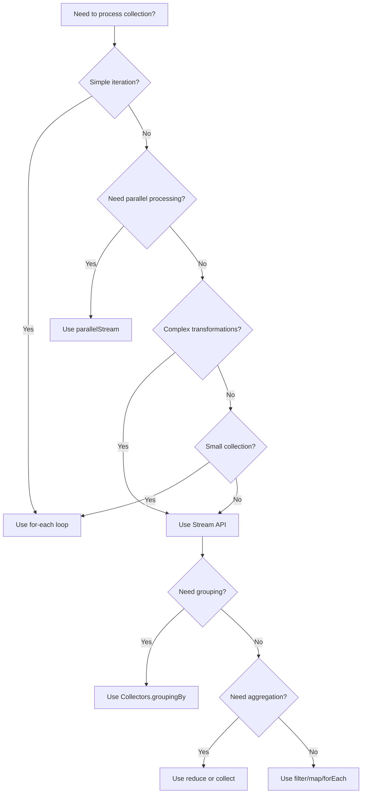

# 03 - Java Streams API (Part 3)

[📖 Back to Part 1](README.md) | [📖 Back to Part 2](README-part2.md)

---

3. **Forgetting terminal operation** → Pipeline never executes
4. **Using `reduce()` incorrectly** → Wrong accumulation
5. **Not handling empty streams** → NoSuchElementException
6. **Boxing/unboxing overhead** → Use primitive streams
7. **Complex nested flatMaps** → Hard to debug
8. **Side effects in operations** → Non-deterministic results

## 22. Pitfalls & Warnings

1. **Parallel streams use common ForkJoinPool** → Can starve other parallel operations
2. **Stream operations are evaluated lazily** → Unexpected execution timing
3. **Infinite streams need limits** → StackOverflowError
4. **Stream sources can only be consumed once** → IllegalStateException
5. **Collectors are not thread-safe** → Use concurrent collectors
6. **Method references may hide side effects** → Debug carefully
7. **Primitive streams don't support null** → NullPointerException

## 23. Debugging Tips

1. **Use `peek()` to inspect intermediate results**
2. **Log stream operations** with custom consumers
3. **Use IDE debugger** with stream visualization
4. **Break complex pipelines** into named methods
5. **Test with parallel and sequential** versions
6. **Use `Stream.builder()`** for debugging sources
7. **Check thread names** in parallel streams

## 24. Comparison Table

| Feature | Stream API | Collection API | Loop |
|---------|------------|----------------|------|
| Readability | High | Medium | Low |
| Boilerplate | Low | Medium | High |
| Parallel support | Built-in | Manual | Manual |
| Lazy evaluation | Yes | No | No |
| Functional style | Yes | Partial | No |
| Performance (small) | Good | Good | Best |
| Performance (large) | Best | Good | Good |
| Immutable results | Yes | Optional | Manual |

## 25. Decision Tree

## 26. Interview Questions

### Q1: What is the difference between `map()` and `flatMap()`?
**Answer:** `map()` transforms each element individually, producing one output per input. `flatMap()` transforms each element into a stream, then flattens all streams into one. Use `flatMap` when the transformation function returns a collection/stream.

### Q2: Are streams evaluated lazily?
**Answer:** Yes. Intermediate operations (filter, map, etc.) are lazy—they don't execute until a terminal operation (collect, forEach, count) is invoked. This enables optimization like short-circuiting.

### Q3: Can you reuse a stream?
**Answer:** No. Once a terminal operation is called, the stream is consumed and cannot be reused. Create a new stream from the source if you need to process again.

### Q4: What is the difference between `reduce()` and `collect()`?
**Answer:** `reduce()` combines elements into a single value using a BinaryOperator. `collect()` uses a mutable accumulator (Collector) to build a result. Use `reduce` for simple aggregations, `collect` for building collections.

### Q5: How do parallel streams work internally?
**Answer:** Parallel streams split the source using Spliterator, process sub-streams in ForkJoinPool.commonPool(), and combine results. The split strategy depends on Spliterator characteristics (ORDERED, SIZED, etc.).

### Q6: What happens if you throw an exception in a stream operation?
**Answer:** The exception propagates immediately, bypassing remaining elements. The stream is consumed and cannot be reused. Use try-catch within the operation or handle exceptions before the stream.

### Q7: Is `Stream.iterate()` infinite?
**Answer:** Yes, `Stream.iterate(seed, f)` produces an infinite stream. Use `limit(n)` to bound it, or use the 3-argument version with a predicate (Java 9+).

### Q8: What is the difference between `findFirst()` and `findAny()`?
**Answer:** `findFirst()` returns the first element in encounter order (deterministic). `findAny()` returns any element (non-deterministic in parallel streams). Use `findAny()` when order doesn't matter for better parallel performance.

### Q9: How do you handle checked exceptions in streams?
**Answer:** Wrap the checked exception in a RuntimeException, or use a helper method that wraps the exception. Java doesn't allow checked exceptions in lambda expressions directly.

### Q10: What is the `Collectors.toUnmodifiableList()` method?
**Answer:** (Java 10+) Returns a Collector that produces an unmodifiable list. Any attempt to modify throws UnsupportedOperationException. More expressive than `Collections.unmodifiableList()`.

### Q11: When should you use parallel streams?
**Answer:** Use parallel streams for CPU-intensive operations on large datasets (>10,000 elements) with no shared mutable state. Avoid for I/O operations, small collections, or when order matters.

### Q12: What is the `mapMulti()` method?
**Answer:** (Java 16+) An alternative to `flatMap()` that uses a consumer-based approach. More efficient than `flatMap()` as it avoids creating intermediate streams.

### Q13: How do you create a stream from a file?
**Answer:** Use `Files.lines(path)` for line-by-line streaming, or `Files.list(path)` for directory entries. Both return streams that should be used in try-with-resources.

### Q14: What is the difference between `Collectors.toList()` and `Stream.toList()`?
**Answer:** `Stream.toList()` (Java 16+) returns an unmodifiable list and is more efficient. `Collectors.toList()` returns a mutable ArrayList. Use `toList()` for better performance when immutability is acceptable.

### Q15: How do you debug a complex stream pipeline?
**Answer:** Use `peek()` to log intermediate values, break the pipeline into named methods, or use IDE stream debugging tools. Consider converting to sequential for debugging.

## 27. Exercises

### Level 1: Basic

1. **Filter and Transform**: Given a list of strings, filter those longer than 5 characters and convert to uppercase.

2. **Statistics**: Calculate the sum, average, min, and max of a list of integers using streams.

3. **Join Strings**: Join a list of strings with a delimiter, wrapping each in parentheses.

### Level 2: Intermediate

4. **Grouping**: Given a list of words, group them by their first letter and count occurrences.

5. **FlatMap**: Given a list of sentences, find all unique words across all sentences.

6. **Custom Collector**: Implement a collector that joins strings with a separator, omitting nulls.

### Level 3: Advanced

7. **Parallel Aggregation**: Implement a parallel reduction that combines a list of objects into a summary statistics object.

8. **Windowed Stream**: Create a stream operation that processes elements in windows of size N.

9. **Infinite Stream**: Generate an infinite stream of Fibonacci numbers and take the first 20.

## 28. Summary

| Concept | Key Point |
|---------|-----------|
| Stream Source | Collection, array, file, generator |
| Intermediate Operations | Lazy, return new stream |
| Terminal Operations | Trigger execution, return result |
| Collectors | Accumulate results into collections |
| Parallel Streams | Use ForkJoinPool for concurrency |
| Lazy Evaluation | Optimize by deferring execution |
| Functional Interfaces | Predicate, Function, Consumer, Supplier |

## 29. References

1. **Official Documentation**: [Java Streams](https://docs.oracle.com/en/java/javase/21/docs/api/java/util/stream/package-summary.html)
2. **Baeldung**: [Java Streams Guide](https://www.baeldung.com/java-streams)
3. **Books**:
   - "Java 8 in Action" by Raoul-Gabriel Urma
   - "Modern Java in Action" by Urma, Fusco, Mycroft
4. **Related Topics**:
   - [02 - File Operations](../02-file-operations/README.md)
   - [01 - Introduction](../01-introduction/README.md)

---

**Next Topic**: [04 - NIO Buffers](../04-nio-buffers/README.md)
