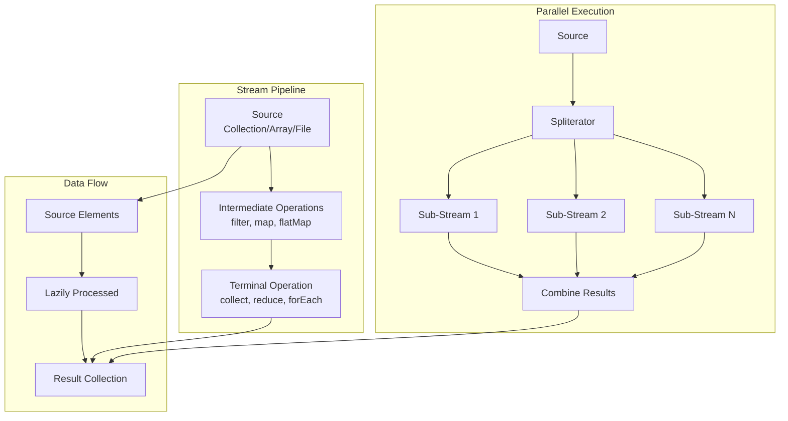
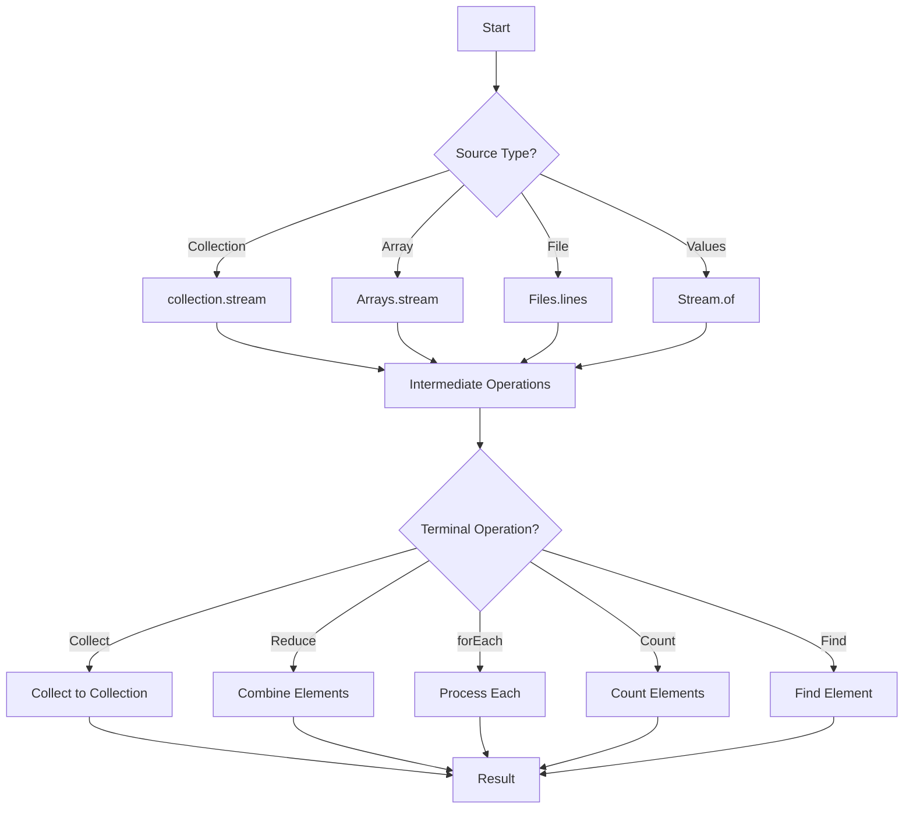

# 03 - Java Streams API

## 1. Introduction

The Java Streams API, introduced in Java 8, provides a functional approach to processing collections of data. Streams represent a sequence of elements supporting sequential and parallel aggregate operations. Unlike collections, streams are not data structures—they are pipelines that carry data from a source through a series of computational steps. The Streams API enables expressive, concise, and efficient data processing with built-in support for parallelism, lazy evaluation, and functional programming patterns.

## 2. Learning Objectives

By the end of this topic, you will be able to:

- Create streams from various sources (collections, arrays, files, generators)
- Apply intermediate operations (filter, map, flatMap, sorted, distinct)
- Perform terminal operations (collect, reduce, forEach, count, findFirst)
- Use predefined collectors (toList, toSet, groupingBy, partitioningBy)
- Understand parallel streams and their implications
- Apply functional interfaces (Predicate, Function, Consumer, Supplier)
- Handle stream exceptions gracefully
- Choose between stream and collection operations

## 3. Prerequisites

- Basic Java programming knowledge
- Understanding of collections framework
- Familiarity with lambda expressions and method references
- Basic knowledge of functional programming concepts

## 4. Why This Concept Exists

Traditional collection processing requires verbose loops and mutable state. Streams solve these problems:

| Problem | Solution |
|---------|----------|
| Verbose iteration | Declarative stream operations |
| Mutable state in loops | Stateless operations |
| Manual parallelization | Built-in parallel streams |
| Complex data transformations | Composable intermediate operations |
| Boilerplate code | Functional interfaces and lambdas |

## 5. Problem Statement

Consider an enterprise application that needs to:
1. Filter and transform large datasets
2. Aggregate data from multiple sources
3. Perform complex joins and groupings
4. Process data in parallel for performance
5. Handle infinite or unbounded data streams

Without streams, these operations require complex nested loops, mutable accumulators, and manual threading. The Streams API provides a clean, functional approach.

## 6. Theory

### 6.1 Stream Pipeline Architecture

A stream pipeline consists of three parts:

```
Source → Intermediate Operations → Terminal Operation
  │              │                       │
  │         (lazy, deferred)        (triggers execution)
  │              │                       │
  └──────────────┴───────────────────────┘
```

### 6.2 Stream Sources

| Source | Method | Description |
|--------|--------|-------------|
| Collection | `collection.stream()` | Sequential stream |
| Collection | `collection.parallelStream()` | Parallel stream |
| Array | `Arrays.stream(array)` | From array |
| Values | `Stream.of(values)` | From varargs |
| Range | `IntStream.range(1, 100)` | Numeric range |
| Generator | `Stream.generate(supplier)` | Infinite stream |
| File | `Files.lines(path)` | Lines from file |

### 6.3 Intermediate Operations (Lazy)

| Operation | Description | Returns |
|-----------|-------------|---------|
| `filter(Predicate)` | Select elements matching predicate | Stream |
| `map(Function)` | Transform each element | Stream |
| `flatMap(Function)` | Flatten nested streams | Stream |
| `sorted()` | Sort elements | Stream |
| `sorted(Comparator)` | Sort with comparator | Stream |
| `distinct()` | Remove duplicates | Stream |
| `limit(n)` | Take first n elements | Stream |
| `skip(n)` | Skip first n elements | Stream |
| `peek(Consumer)` | Inspect without modifying | Stream |

### 6.4 Terminal Operations (Trigger Execution)

| Operation | Returns | Description |
|-----------|---------|-------------|
| `collect(Collector)` | Mutable result | Accumulate into collection |
| `forEach(Consumer)` | void | Iterate over elements |
| `reduce(BinaryOperator)` | Optional | Combine elements |
| `count()` | long | Count elements |
| `anyMatch(Predicate)` | boolean | Check if any match |
| `allMatch(Predicate)` | boolean | Check if all match |
| `noneMatch(Predicate)` | boolean | Check if none match |
| `findFirst()` | Optional | First element |
| `findAny()` | Optional | Any element (parallel-friendly) |
| `min(Comparator)` | Optional | Minimum element |
| `max(Comparator)` | Optional | Maximum element |
| `toArray()` | Object[] | Convert to array |

## 7. Internal Working

### 7.1 Stream Execution Model

```
Stream.of(1, 2, 3, 4, 5)
    .filter(n -> n > 2)      // Lazy: nothing happens yet
    .map(n -> n * 2)         // Lazy: nothing happens yet
    .forEach(System.out::println); // Terminal: executes pipeline

Execution flow:
1. Source provides: 1 → filter(1>2=false) → done
2. Source provides: 2 → filter(2>2=false) → done
3. Source provides: 3 → filter(3>2=true) → map(3*2=6) → print(6)
4. Source provides: 4 → filter(4>2=true) → map(4*2=8) → print(8)
5. Source provides: 5 → filter(5>2=true) → map(5*2=10) → print(10)
```

### 7.2 Lazy Evaluation

```
// This does nothing (no terminal operation)
stream.filter(x -> expensiveOperation(x));

// This executes the pipeline
stream.filter(x -> expensiveOperation(x)).count();
```

### 7.3 Spliterator

Streams use Spliterators for traversal:

```
Spliterator characteristics:
├── ORDERED (elements have defined order)
├── DISTINCT (no duplicate elements)
├── SORTED (elements are sorted)
├── SIZED (size is known)
├── NONNULL (no null elements)
├── IMMUTABLE (source won't change)
├── CONCURRENT (can be modified during traversal)
└── SUBSIZED (split sizes are known)
```

## 8. JVM Perspective

### 8.1 Memory Model

```
JVM Heap:
├── Stream objects (pipeline stages)
├── Source collection reference
├── Lambda captures (effectively final variables)
├── Intermediate operation state (mostly stateless)
└── Terminal operation accumulators

Stack:
├── Stream pipeline execution context
└── Lambda invocation frames

Native:
├── Parallel stream thread pool (ForkJoinPool.commonPool())
└── File I/O buffers (for Files.lines())
```

### 8.2 ForkJoinPool for Parallel Streams

```java
// Parallel streams use common ForkJoinPool
// Default size = Runtime.getRuntime().availableProcessors() - 1

// Custom thread pool (Java 9+)
var pool = Executors.newFixedThreadPool(4);
var stream = list.parallelStream();
// Unfortunately, no direct way to use custom pool with streams
```

### 8.3 GC Impact

- Stream objects are short-lived → Minor GC
- Intermediate operations don't create copies → Memory efficient
- Collectors may create intermediate collections → Temporary allocation
- Parallel streams create temporary work arrays → More allocation

## 9. Memory Representation

### Stream Pipeline Object Graph

```
Stream pipeline (filter → map → collect):
┌─────────────────┐
│ ReferencePipeline│
│ ├── source       │──→ Collection reference
│ ├── operations[] │
│ │   ├── filter   │──→ Predicate (lambda)
│ │   └── map      │──→ Function (lambda)
│ └── terminalOp   │──→ Collector
└─────────────────┘
```

### Collector State

```java
// toList() collector
ArrayList accumulator = new ArrayList(); // Mutable container
// Each element is added to accumulator
// Final result: accumulator contents

// groupingBy() collector
HashMap accumulator = new HashMap(); // Map<K, List<V>>
// Elements grouped by classifier function
// Final result: Map of groups
```

## 10. Architecture Diagram



## 11. Flow Diagram



## 12. Syntax

### 12.1 Creating Streams

```java
// From collection
List<String> list = List.of("a", "b", "c");
Stream<String> stream1 = list.stream();
Stream<String> parallel = list.parallelStream();

// From array
int[] array = {1, 2, 3, 4, 5};
IntStream stream2 = Arrays.stream(array);

// From values
Stream<String> stream3 = Stream.of("a", "b", "c");

// From range
IntStream stream4 = IntStream.range(1, 10); // 1-9
IntStream stream5 = IntStream.rangeClosed(1, 10); // 1-10

// From generator
Stream<Double> stream6 = Stream.generate(Math::random).limit(5);

// From file
Stream<String> lines = Files.lines(Path.of("file.txt"));
```

### 12.2 Intermediate Operations

```java
// filter - select elements
List<String> filtered = list.stream()
    .filter(s -> s.length() > 3)
    .toList();

// map - transform elements
List<Integer> lengths = list.stream()
    .map(String::length)
    .toList();

// flatMap - flatten nested
List<String> words = List.of("hello world", "java streams");
List<String> allWords = words.stream()
    .flatMap(w -> Arrays.stream(w.split(" ")))
    .toList();

// sorted - order elements
List<String> sorted = list.stream()
    .sorted()
    .toList();

// distinct - remove duplicates
List<Integer> unique = List.of(1, 2, 2, 3, 3).stream()
    .distinct()
    .toList();

// limit and skip
List<String> first3 = list.stream()
    .limit(3)
    .toList();

List<String> skip2 = list.stream()
    .skip(2)
    .toList();
```

### 12.3 Terminal Operations

```java
// collect - accumulate results
List<String> result = stream.collect(Collectors.toList());
Map<String, List<Integer>> grouped = stream
    .collect(Collectors.groupingBy(String::length));

// reduce - combine elements
Optional<Integer> sum = IntStream.range(1, 101)
    .reduce(Integer::sum);

// forEach - iterate
stream.forEach(System.out::println);

// count
long count = stream.filter(x -> x > 5).count();

// findFirst / findAny
Optional<String> first = stream.filter(s -> s.startsWith("a"))
    .findFirst();

// anyMatch / allMatch / noneMatch
boolean hasLong = stream.anyMatch(s -> s.length() > 5);
boolean allShort = stream.allMatch(s -> s.length() < 10);
boolean noEmpty = stream.noneMatch(String::isEmpty);

// min / max
Optional<String> shortest = stream.min(Comparator.comparingInt(String::length));
```

## 13. Easy Example

```java
import java.util.*;
import java.util.stream.*;

public class StreamsBasicExample {

    public static void main(String[] args) {
        List<String> names = List.of("Alice", "Bob", "Charlie",
            "David", "Eve", "Frank");

        // Filter names starting with 'A' or 'B'
        List<String> filtered = names.stream()
            .filter(name -> name.startsWith("A") || name.startsWith("B"))
            .toList();
        System.out.println("Filtered: " + filtered);

        // Transform to uppercase
        List<String> uppercased = names.stream()
            .map(String::toUpperCase)
            .toList();
        System.out.println("Uppercased: " + uppercased);


---

[📖 Continue to Part 2](README-part2.md)
