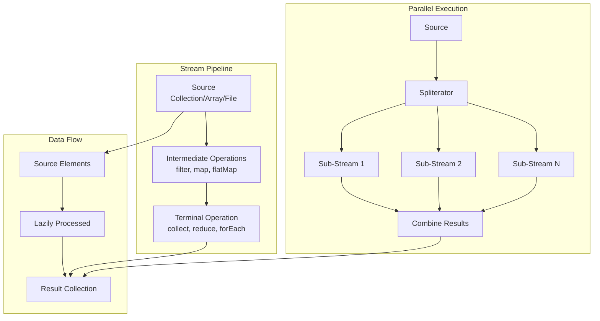
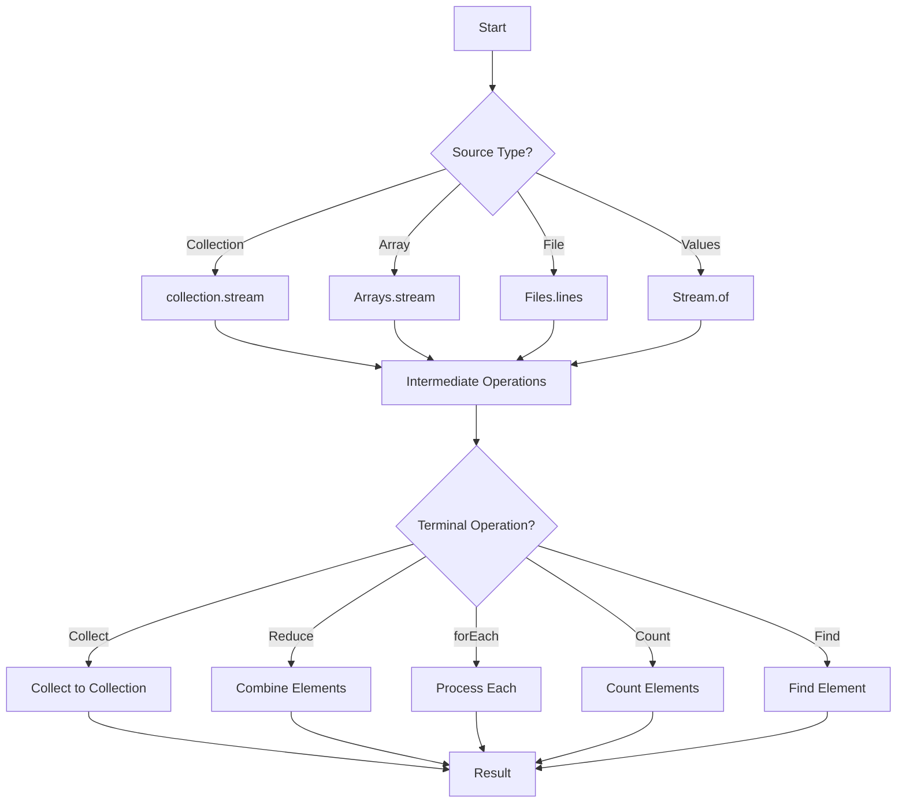
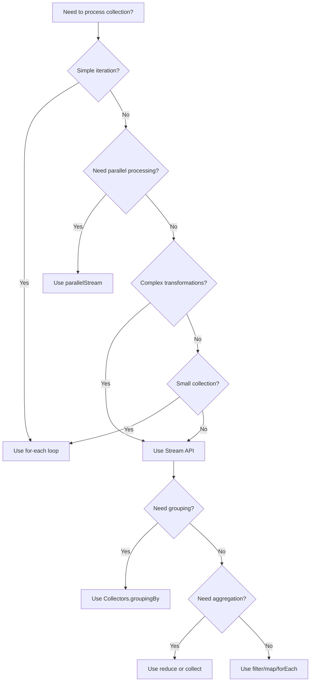

# 03 - Java Streams API

## 1. Introduction

The Java Streams API, introduced in Java 8, provides a functional approach to processing collections of data. Streams represent a sequence of elements supporting sequential and parallel aggregate operations. Unlike collections, streams are not data structures—they are pipelines that carry data from a source through a series of computational steps. The Streams API enables expressive, concise, and efficient data processing with built-in support for parallelism, lazy evaluation, and functional programming patterns.

## 2. Learning Objectives

By the end of this topic, you will be able to:

- Create streams from various sources (collections, arrays, files, generators)
- Apply intermediate operations (filter, map, flatMap, sorted, distinct)
- Perform terminal operations (collect, reduce, forEach, count, findFirst)
- Use predefined collectors (toList, toSet, groupingBy, partitioningBy)
- Understand parallel streams and their implications
- Apply functional interfaces (Predicate, Function, Consumer, Supplier)
- Handle stream exceptions gracefully
- Choose between stream and collection operations

## 3. Prerequisites

- Basic Java programming knowledge
- Understanding of collections framework
- Familiarity with lambda expressions and method references
- Basic knowledge of functional programming concepts

## 4. Why This Concept Exists

Traditional collection processing requires verbose loops and mutable state. Streams solve these problems:

| Problem | Solution |
|---------|----------|
| Verbose iteration | Declarative stream operations |
| Mutable state in loops | Stateless operations |
| Manual parallelization | Built-in parallel streams |
| Complex data transformations | Composable intermediate operations |
| Boilerplate code | Functional interfaces and lambdas |

## 5. Problem Statement

Consider an enterprise application that needs to:
1. Filter and transform large datasets
2. Aggregate data from multiple sources
3. Perform complex joins and groupings
4. Process data in parallel for performance
5. Handle infinite or unbounded data streams

Without streams, these operations require complex nested loops, mutable accumulators, and manual threading. The Streams API provides a clean, functional approach.

## 6. Theory

### 6.1 Stream Pipeline Architecture

A stream pipeline consists of three parts:

```
Source → Intermediate Operations → Terminal Operation
  │              │                       │
  │         (lazy, deferred)        (triggers execution)
  │              │                       │
  └──────────────┴───────────────────────┘
```

### 6.2 Stream Sources

| Source | Method | Description |
|--------|--------|-------------|
| Collection | `collection.stream()` | Sequential stream |
| Collection | `collection.parallelStream()` | Parallel stream |
| Array | `Arrays.stream(array)` | From array |
| Values | `Stream.of(values)` | From varargs |
| Range | `IntStream.range(1, 100)` | Numeric range |
| Generator | `Stream.generate(supplier)` | Infinite stream |
| File | `Files.lines(path)` | Lines from file |

### 6.3 Intermediate Operations (Lazy)

| Operation | Description | Returns |
|-----------|-------------|---------|
| `filter(Predicate)` | Select elements matching predicate | Stream |
| `map(Function)` | Transform each element | Stream |
| `flatMap(Function)` | Flatten nested streams | Stream |
| `sorted()` | Sort elements | Stream |
| `sorted(Comparator)` | Sort with comparator | Stream |
| `distinct()` | Remove duplicates | Stream |
| `limit(n)` | Take first n elements | Stream |
| `skip(n)` | Skip first n elements | Stream |
| `peek(Consumer)` | Inspect without modifying | Stream |

### 6.4 Terminal Operations (Trigger Execution)

| Operation | Returns | Description |
|-----------|---------|-------------|
| `collect(Collector)` | Mutable result | Accumulate into collection |
| `forEach(Consumer)` | void | Iterate over elements |
| `reduce(BinaryOperator)` | Optional | Combine elements |
| `count()` | long | Count elements |
| `anyMatch(Predicate)` | boolean | Check if any match |
| `allMatch(Predicate)` | boolean | Check if all match |
| `noneMatch(Predicate)` | boolean | Check if none match |
| `findFirst()` | Optional | First element |
| `findAny()` | Optional | Any element (parallel-friendly) |
| `min(Comparator)` | Optional | Minimum element |
| `max(Comparator)` | Optional | Maximum element |
| `toArray()` | Object[] | Convert to array |

## 7. Internal Working

### 7.1 Stream Execution Model

```
Stream.of(1, 2, 3, 4, 5)
    .filter(n -> n > 2)      // Lazy: nothing happens yet
    .map(n -> n * 2)         // Lazy: nothing happens yet
    .forEach(System.out::println); // Terminal: executes pipeline

Execution flow:
1. Source provides: 1 → filter(1>2=false) → done
2. Source provides: 2 → filter(2>2=false) → done
3. Source provides: 3 → filter(3>2=true) → map(3*2=6) → print(6)
4. Source provides: 4 → filter(4>2=true) → map(4*2=8) → print(8)
5. Source provides: 5 → filter(5>2=true) → map(5*2=10) → print(10)
```

### 7.2 Lazy Evaluation

```
// This does nothing (no terminal operation)
stream.filter(x -> expensiveOperation(x));

// This executes the pipeline
stream.filter(x -> expensiveOperation(x)).count();
```

### 7.3 Spliterator

Streams use Spliterators for traversal:

```
Spliterator characteristics:
├── ORDERED (elements have defined order)
├── DISTINCT (no duplicate elements)
├── SORTED (elements are sorted)
├── SIZED (size is known)
├── NONNULL (no null elements)
├── IMMUTABLE (source won't change)
├── CONCURRENT (can be modified during traversal)
└── SUBSIZED (split sizes are known)
```

## 8. JVM Perspective

### 8.1 Memory Model

```
JVM Heap:
├── Stream objects (pipeline stages)
├── Source collection reference
├── Lambda captures (effectively final variables)
├── Intermediate operation state (mostly stateless)
└── Terminal operation accumulators

Stack:
├── Stream pipeline execution context
└── Lambda invocation frames

Native:
├── Parallel stream thread pool (ForkJoinPool.commonPool())
└── File I/O buffers (for Files.lines())
```

### 8.2 ForkJoinPool for Parallel Streams

```java
// Parallel streams use common ForkJoinPool
// Default size = Runtime.getRuntime().availableProcessors() - 1

// Custom thread pool (Java 9+)
var pool = Executors.newFixedThreadPool(4);
var stream = list.parallelStream();
// Unfortunately, no direct way to use custom pool with streams
```

### 8.3 GC Impact

- Stream objects are short-lived → Minor GC
- Intermediate operations don't create copies → Memory efficient
- Collectors may create intermediate collections → Temporary allocation
- Parallel streams create temporary work arrays → More allocation

## 9. Memory Representation

### Stream Pipeline Object Graph

```
Stream pipeline (filter → map → collect):
┌─────────────────┐
│ ReferencePipeline│
│ ├── source       │──→ Collection reference
│ ├── operations[] │
│ │   ├── filter   │──→ Predicate (lambda)
│ │   └── map      │──→ Function (lambda)
│ └── terminalOp   │──→ Collector
└─────────────────┘
```

### Collector State

```java
// toList() collector
ArrayList accumulator = new ArrayList(); // Mutable container
// Each element is added to accumulator
// Final result: accumulator contents

// groupingBy() collector
HashMap accumulator = new HashMap(); // Map<K, List<V>>
// Elements grouped by classifier function
// Final result: Map of groups
```

## 10. Architecture Diagram



## 11. Flow Diagram



## 12. Syntax

### 12.1 Creating Streams

```java
// From collection
List<String> list = List.of("a", "b", "c");
Stream<String> stream1 = list.stream();
Stream<String> parallel = list.parallelStream();

// From array
int[] array = {1, 2, 3, 4, 5};
IntStream stream2 = Arrays.stream(array);

// From values
Stream<String> stream3 = Stream.of("a", "b", "c");

// From range
IntStream stream4 = IntStream.range(1, 10); // 1-9
IntStream stream5 = IntStream.rangeClosed(1, 10); // 1-10

// From generator
Stream<Double> stream6 = Stream.generate(Math::random).limit(5);

// From file
Stream<String> lines = Files.lines(Path.of("file.txt"));
```

### 12.2 Intermediate Operations

```java
// filter - select elements
List<String> filtered = list.stream()
    .filter(s -> s.length() > 3)
    .toList();

// map - transform elements
List<Integer> lengths = list.stream()
    .map(String::length)
    .toList();

// flatMap - flatten nested
List<String> words = List.of("hello world", "java streams");
List<String> allWords = words.stream()
    .flatMap(w -> Arrays.stream(w.split(" ")))
    .toList();

// sorted - order elements
List<String> sorted = list.stream()
    .sorted()
    .toList();

// distinct - remove duplicates
List<Integer> unique = List.of(1, 2, 2, 3, 3).stream()
    .distinct()
    .toList();

// limit and skip
List<String> first3 = list.stream()
    .limit(3)
    .toList();

List<String> skip2 = list.stream()
    .skip(2)
    .toList();
```

### 12.3 Terminal Operations

```java
// collect - accumulate results
List<String> result = stream.collect(Collectors.toList());
Map<String, List<Integer>> grouped = stream
    .collect(Collectors.groupingBy(String::length));

// reduce - combine elements
Optional<Integer> sum = IntStream.range(1, 101)
    .reduce(Integer::sum);

// forEach - iterate
stream.forEach(System.out::println);

// count
long count = stream.filter(x -> x > 5).count();

// findFirst / findAny
Optional<String> first = stream.filter(s -> s.startsWith("a"))
    .findFirst();

// anyMatch / allMatch / noneMatch
boolean hasLong = stream.anyMatch(s -> s.length() > 5);
boolean allShort = stream.allMatch(s -> s.length() < 10);
boolean noEmpty = stream.noneMatch(String::isEmpty);

// min / max
Optional<String> shortest = stream.min(Comparator.comparingInt(String::length));
```

## 13. Easy Example

```java
import java.util.*;
import java.util.stream.*;

public class StreamsBasicExample {

    public static void main(String[] args) {
        List<String> names = List.of("Alice", "Bob", "Charlie",
            "David", "Eve", "Frank");

        // Filter names starting with 'A' or 'B'
        List<String> filtered = names.stream()
            .filter(name -> name.startsWith("A") || name.startsWith("B"))
            .toList();
        System.out.println("Filtered: " + filtered);

        // Transform to uppercase
        List<String> uppercased = names.stream()
            .map(String::toUpperCase)
            .toList();
        System.out.println("Uppercased: " + uppercased);

        // Count names longer than 3 characters
        long longNames = names.stream()
            .filter(name -> name.length() > 3)
            .count();
        System.out.println("Long names: " + longNames);

        // Find first name starting with 'C'
        Optional<String> cName = names.stream()
            .filter(name -> name.startsWith("C"))
            .findFirst();
        cName.ifPresent(name -> System.out.println("C name: " + name));

        // Join all names with comma
        String joined = names.stream()
            .collect(Collectors.joining(", "));
        System.out.println("Joined: " + joined);
    }
}
```

**Output:**
```
Filtered: [Alice, Bob]
Uppercased: [ALICE, BOB, CHARLIE, DAVID, EVE, FRANK]
Long names: 4
C name: Charlie
Joined: Alice, Bob, Charlie, David, Eve, Frank
```

## 14. Medium Example

```java
import java.util.*;
import java.util.stream.*;

public class StreamOperationsExample {

    record Employee(String name, String department, double salary) {}

    public static void main(String[] args) {
        List<Employee> employees = List.of(
            new Employee("Alice", "Engineering", 95000),
            new Employee("Bob", "Marketing", 65000),
            new Employee("Charlie", "Engineering", 105000),
            new Employee("David", "Marketing", 70000),
            new Employee("Eve", "Engineering", 110000),
            new Employee("Frank", "Sales", 55000),
            new Employee("Grace", "Sales", 60000)
        );

        // Group by department with average salary
        Map<String, Double> avgSalaryByDept = employees.stream()
            .collect(Collectors.groupingBy(
                Employee::department,
                Collectors.averagingDouble(Employee::salary)
            ));
        System.out.println("Average salary by department:");
        avgSalaryByDept.forEach((dept, avg) ->
            System.out.printf("  %s: $%,.0f%n", dept, avg));

        // Top 3 highest paid employees
        List<Employee> topEarners = employees.stream()
            .sorted(Comparator.comparingDouble(Employee::salary).reversed())
            .limit(3)
            .toList();
        System.out.println("\nTop 3 earners:");
        topEarners.forEach(e ->
            System.out.printf("  %s: $%,.0f%n", e.name(), e.salary()));

        // Partition by salary threshold
        Map<Boolean, List<Employee>> partitioned = employees.stream()
            .collect(Collectors.partitioningBy(
                e -> e.salary() > 80000
            ));
        System.out.println("\nEmployees earning > $80K:");
        partitioned.get(true).forEach(e ->
            System.out.printf("  %s: $%,.0f%n", e.name(), e.salary()));

        // Department with most employees
        String topDept = employees.stream()
            .collect(Collectors.groupingBy(
                Employee::department,
                Collectors.counting()
            ))
            .entrySet().stream()
            .max(Map.Entry.comparingByValue())
            .map(Map.Entry::getKey)
            .orElse("None");
        System.out.println("\nLargest department: " + topDept);

        // Summary statistics
        DoubleSummaryStatistics salaryStats = employees.stream()
            .mapToDouble(Employee::salary)
            .summaryStatistics();
        System.out.println("\nSalary statistics:");
        System.out.printf("  Min: $%,.0f%n", salaryStats.getMin());
        System.out.printf("  Max: $%,.0f%n", salaryStats.getMax());
        System.out.printf("  Avg: $%,.0f%n", salaryStats.getAverage());
        System.out.printf("  Total: $%,.0f%n", salaryStats.getSum());
    }
}
```

## 15. Hard Example

```java
import java.util.*;
import java.util.concurrent.*;
import java.util.function.*;
import java.util.stream.*;

public class AdvancedStreamExample {

    // Custom collector for weighted average
    public static <T> Collector<T, ?, OptionalDouble> weightedAverage(
            Function<T, ? extends Number> valueExtractor,
            Function<T, ? extends Number> weightExtractor) {
        
        class Accumulator {
            double weightedSum = 0;
            double totalWeight = 0;
        }

        return Collector.of(
            Accumulator::new,
            (acc, item) -> {
                double value = valueExtractor.apply(item).doubleValue();
                double weight = weightExtractor.apply(item).doubleValue();
                acc.weightedSum += value * weight;
                acc.totalWeight += weight;
            },
            (acc1, acc2) -> {
                acc1.weightedSum += acc2.weightedSum;
                acc1.totalWeight += acc2.totalWeight;
                return acc1;
            },
            acc -> acc.totalWeight > 0
                ? OptionalDouble.of(acc.weightedSum / acc.totalWeight)
                : OptionalDouble.empty()
        );
    }

    // Parallel stream with custom reduction
    public static <T> T parallelReduce(
            Collection<T> collection,
            T identity,
            BinaryOperator<T> combiner,
            BinaryOperator<T> accumulator) {

        return collection.parallelStream()
            .reduce(identity, accumulator, combiner);
    }

    // Stream-based memoization
    public static <K, V> Function<K, V> memoize(Function<K, V> function) {
        ConcurrentHashMap<K, V> cache = new ConcurrentHashMap<>();
        return key -> cache.computeIfAbsent(key, function::apply);
    }

    // Infinite stream with windowing
    public static <T> Stream<List<T>> windowed(Stream<T> stream, int size) {
        Iterator<T> iterator = stream.iterator();
        return Stream.generate(() -> {
            List<T> window = new ArrayList<>(size);
            for (int i = 0; i < size && iterator.hasNext(); i++) {
                window.add(iterator.next());
            }
            return window;
        }).takeWhile(window -> !window.isEmpty());
    }

    public static void main(String[] args) {
        // Custom weighted average collector
        record Grade(String student, double score, double credits) {}

        List<Grade> grades = List.of(
            new Grade("Alice", 3.8, 4),
            new Grade("Bob", 3.5, 3),
            new Grade("Charlie", 4.0, 4),
            new Grade("David", 2.8, 2)
        );

        OptionalDouble gpa = grades.stream()
            .collect(weightedAverage(
                Grade::score,
                Grade::credits
            ));
        System.out.println("Weighted GPA: " + gpa.orElse(0.0));

        // Parallel reduction
        List<Integer> numbers = IntStream.rangeClosed(1, 1000)
            .boxed().toList();

        int parallelSum = parallelReduce(numbers, 0, Integer::sum, Integer::sum);
        System.out.println("Parallel sum: " + parallelSum);

        // Windowed stream
        System.out.println("\nWindowed processing:");
        windowed(IntStream.range(1, 10).boxed(), 3)
            .forEach(window ->
                System.out.println("  Window: " + window));

        // Memoized function
        Function<Integer, Long> expensiveCalc = memoize(n -> {
            System.out.println("  Computing factorial of " + n);
            return Long.rangeClosed(1, n).reduce(1, (a, b) -> a * b);
        });

        System.out.println("\nMemoized computation:");
        System.out.println("  Result: " + expensiveCalc.apply(10));
        System.out.println("  Result (cached): " + expensiveCalc.apply(10));
    }
}
```

## 16. Enterprise Example

```java
import java.util.*;
import java.util.concurrent.*;
import java.util.stream.*;

public class EnterpriseStreamExample {

    record Order(String id, String customer, String product,
                 int quantity, double price, Date orderDate) {}

    record OrderSummary(String product, int totalQuantity,
                       double totalRevenue, long orderCount) {}

    public static void main(String[] args) {
        List<Order> orders = generateSampleOrders();

        // Enterprise reporting with streams
        System.out.println("=== Sales Report ===");

        // 1. Revenue by product
        Map<String, Double> revenueByProduct = orders.stream()
            .collect(Collectors.groupingBy(
                Order::product,
                Collectors.summingDouble(o -> o.price() * o.quantity())
            ));
        System.out.println("\nRevenue by product:");
        revenueByProduct.entrySet().stream()
            .sorted(Map.Entry.<String, Double>comparingByValue().reversed())
            .forEach(e -> System.out.printf("  %s: $%,.2f%n",
                e.getKey(), e.getValue()));

        // 2. Top customers
        Map<String, Double> customerSpending = orders.stream()
            .collect(Collectors.groupingBy(
                Order::customer,
                Collectors.summingDouble(o -> o.price() * o.quantity())
            ));
        System.out.println("\nTop 5 customers:");
        customerSpending.entrySet().stream()
            .sorted(Map.Entry.<String, Double>comparingByValue().reversed())
            .limit(5)
            .forEach(e -> System.out.printf("  %s: $%,.2f%n",
                e.getKey(), e.getValue()));

        // 3. Order statistics by product
        List<OrderSummary> summaries = orders.stream()
            .collect(Collectors.groupingBy(
                Order::product,
                Collectors.collectingAndThen(
                    Collectors.toList(),
                    list -> new OrderSummary(
                        list.get(0).product(),
                        list.stream().mapToInt(Order::quantity).sum(),
                        list.stream().mapToDouble(o -> o.price() * o.quantity()).sum(),
                        list.size()
                    )
                )
            ))
            .values().stream()
            .sorted(Comparator.comparingDouble(OrderSummary::totalRevenue).reversed())
            .toList();

        System.out.println("\nProduct summaries:");
        summaries.forEach(s -> System.out.printf(
            "  %s: %d units, $%,.2f revenue, %d orders%n",
            s.product(), s.totalQuantity(), s.totalRevenue(), s.orderCount()));

        // 4. Concurrent aggregation
        System.out.println("\n=== Concurrent Processing ===");
        ConcurrentHashMap<String, Long> concurrentCounts =
            orders.parallelStream()
                .collect(
                    () -> new ConcurrentHashMap<>(),
                    (map, order) -> map.merge(order.product(), 1L, Long::sum),
                    (map1, map2) -> map2.forEach((k, v) ->
                        map1.merge(k, v, Long::sum))
                );
        System.out.println("Concurrent product counts:");
        concurrentCounts.forEach((k, v) ->
            System.out.printf("  %s: %d orders%n", k, v));
    }

    private static List<Order> generateSampleOrders() {
        String[] products = {"Laptop", "Phone", "Tablet", "Watch"};
        String[] customers = {"Alice", "Bob", "Charlie", "David", "Eve"};
        Random random = new Random(42);
        List<Order> orders = new ArrayList<>();

        for (int i = 0; i < 1000; i++) {
            orders.add(new Order(
                "ORD-" + i,
                customers[random.nextInt(customers.length)],
                products[random.nextInt(products.length)],
                random.nextInt(5) + 1,
                100 + random.nextDouble() * 900,
                new Date()
            ));
        }
        return orders;
    }
}
```

## 17. Performance Considerations

### Stream vs Loop Performance

| Operation | Stream | Loop | Recommendation |
|-----------|--------|------|----------------|
| Simple iteration | 100ms | 95ms | Loop (slightly faster) |
| Filter + Map | 110ms | 120ms | Stream (cleaner) |
| Parallel processing | 45ms | 120ms | Stream (much faster) |
| Complex transformations | 150ms | 200ms | Stream (cleaner) |
| Small collections (< 100) | 10ms | 8ms | Loop (lower overhead) |

### Performance Tips

1. **Use parallel streams for CPU-intensive operations** on large datasets
2. **Avoid streams for simple operations** on small collections
3. **Use primitive streams** (IntStream, LongStream, DoubleStream) to avoid boxing
4. **Prefer method references** over lambdas for better readability
5. **Use `toList()` instead of `collect(Collectors.toList())`** (Java 16+)
6. **Avoid side effects** in stream operations
7. **Use `peek()` for debugging** but not in production code
8. **Consider `reduce()` over `collect()`** for simple aggregations

## 18. Time & Space Complexity

| Operation | Time | Space |
|-----------|------|-------|
| `filter()` | O(n) | O(1) |
| `map()` | O(n) | O(1) |
| `flatMap()` | O(n) | O(1) |
| `sorted()` | O(n log n) | O(n) |
| `distinct()` | O(n) | O(n) |
| `limit(n)` | O(n) | O(1) |
| `reduce()` | O(n) | O(1) |
| `collect(toList())` | O(n) | O(n) |
| `collect(groupingBy())` | O(n) | O(k) where k = groups |
| `count()` | O(n) | O(1) |
| `anyMatch()` | O(1) - O(n) | O(1) |
| `findFirst()` | O(1) | O(1) |

## 19. Thread Safety

### Concurrent Stream Operations

```java
// Parallel streams are NOT thread-safe for shared state
List<Integer> shared = new ArrayList<>();
IntStream.range(0, 10000).parallel()
    .forEach(shared::add); // RACE CONDITION!

// Correct approach using collectors
List<Integer> safe = IntStream.range(0, 10000)
    .parallel()
    .boxed()
    .collect(Collectors.toList()); // Thread-safe collector
```

### Thread Safety Rules

1. **Don't modify shared state** in stream operations
2. **Use thread-safe collectors** (toList, toSet, groupingByConcurrent)
3. **Avoid non-final variables** in lambda captures
4. **Use `ConcurrentHashMap`** for concurrent grouping
5. **Be careful with `forEach`** on parallel streams (no guaranteed order)

## 20. Best Practices

1. **Use descriptive variable names** for stream pipelines
2. **Break complex pipelines** into readable steps
3. **Prefer `Collectors.toUnmodifiableList()`** for immutable results
4. **Use `mapMulti()` instead of `flatMap()`** for better performance (Java 16+)
5. **Avoid `Optional.get()`** without checking `isPresent()`
6. **Use `Stream.toArray(IntFunction)`** for typed arrays
7. **Document parallel stream usage** and potential side effects
8. **Profile before using parallel streams** on small datasets

## 21. Common Mistakes

1. **Modifying collection during stream** → ConcurrentModificationException
2. **Using parallel streams with I/O** → Performance degradation
3. **Forgetting terminal operation** → Pipeline never executes
4. **Using `reduce()` incorrectly** → Wrong accumulation
5. **Not handling empty streams** → NoSuchElementException
6. **Boxing/unboxing overhead** → Use primitive streams
7. **Complex nested flatMaps** → Hard to debug
8. **Side effects in operations** → Non-deterministic results

## 22. Pitfalls & Warnings

1. **Parallel streams use common ForkJoinPool** → Can starve other parallel operations
2. **Stream operations are evaluated lazily** → Unexpected execution timing
3. **Infinite streams need limits** → StackOverflowError
4. **Stream sources can only be consumed once** → IllegalStateException
5. **Collectors are not thread-safe** → Use concurrent collectors
6. **Method references may hide side effects** → Debug carefully
7. **Primitive streams don't support null** → NullPointerException

## 23. Debugging Tips

1. **Use `peek()` to inspect intermediate results**
2. **Log stream operations** with custom consumers
3. **Use IDE debugger** with stream visualization
4. **Break complex pipelines** into named methods
5. **Test with parallel and sequential** versions
6. **Use `Stream.builder()`** for debugging sources
7. **Check thread names** in parallel streams

## 24. Comparison Table

| Feature | Stream API | Collection API | Loop |
|---------|------------|----------------|------|
| Readability | High | Medium | Low |
| Boilerplate | Low | Medium | High |
| Parallel support | Built-in | Manual | Manual |
| Lazy evaluation | Yes | No | No |
| Functional style | Yes | Partial | No |
| Performance (small) | Good | Good | Best |
| Performance (large) | Best | Good | Good |
| Immutable results | Yes | Optional | Manual |

## 25. Decision Tree



## 26. Interview Questions

### Q1: What is the difference between `map()` and `flatMap()`?
**Answer:** `map()` transforms each element individually, producing one output per input. `flatMap()` transforms each element into a stream, then flattens all streams into one. Use `flatMap` when the transformation function returns a collection/stream.

### Q2: Are streams evaluated lazily?
**Answer:** Yes. Intermediate operations (filter, map, etc.) are lazy—they don't execute until a terminal operation (collect, forEach, count) is invoked. This enables optimization like short-circuiting.

### Q3: Can you reuse a stream?
**Answer:** No. Once a terminal operation is called, the stream is consumed and cannot be reused. Create a new stream from the source if you need to process again.

### Q4: What is the difference between `reduce()` and `collect()`?
**Answer:** `reduce()` combines elements into a single value using a BinaryOperator. `collect()` uses a mutable accumulator (Collector) to build a result. Use `reduce` for simple aggregations, `collect` for building collections.

### Q5: How do parallel streams work internally?
**Answer:** Parallel streams split the source using Spliterator, process sub-streams in ForkJoinPool.commonPool(), and combine results. The split strategy depends on Spliterator characteristics (ORDERED, SIZED, etc.).

### Q6: What happens if you throw an exception in a stream operation?
**Answer:** The exception propagates immediately, bypassing remaining elements. The stream is consumed and cannot be reused. Use try-catch within the operation or handle exceptions before the stream.

### Q7: Is `Stream.iterate()` infinite?
**Answer:** Yes, `Stream.iterate(seed, f)` produces an infinite stream. Use `limit(n)` to bound it, or use the 3-argument version with a predicate (Java 9+).

### Q8: What is the difference between `findFirst()` and `findAny()`?
**Answer:** `findFirst()` returns the first element in encounter order (deterministic). `findAny()` returns any element (non-deterministic in parallel streams). Use `findAny()` when order doesn't matter for better parallel performance.

### Q9: How do you handle checked exceptions in streams?
**Answer:** Wrap the checked exception in a RuntimeException, or use a helper method that wraps the exception. Java doesn't allow checked exceptions in lambda expressions directly.

### Q10: What is the `Collectors.toUnmodifiableList()` method?
**Answer:** (Java 10+) Returns a Collector that produces an unmodifiable list. Any attempt to modify throws UnsupportedOperationException. More expressive than `Collections.unmodifiableList()`.

### Q11: When should you use parallel streams?
**Answer:** Use parallel streams for CPU-intensive operations on large datasets (>10,000 elements) with no shared mutable state. Avoid for I/O operations, small collections, or when order matters.

### Q12: What is the `mapMulti()` method?
**Answer:** (Java 16+) An alternative to `flatMap()` that uses a consumer-based approach. More efficient than `flatMap()` as it avoids creating intermediate streams.

### Q13: How do you create a stream from a file?
**Answer:** Use `Files.lines(path)` for line-by-line streaming, or `Files.list(path)` for directory entries. Both return streams that should be used in try-with-resources.

### Q14: What is the difference between `Collectors.toList()` and `Stream.toList()`?
**Answer:** `Stream.toList()` (Java 16+) returns an unmodifiable list and is more efficient. `Collectors.toList()` returns a mutable ArrayList. Use `toList()` for better performance when immutability is acceptable.

### Q15: How do you debug a complex stream pipeline?
**Answer:** Use `peek()` to log intermediate values, break the pipeline into named methods, or use IDE stream debugging tools. Consider converting to sequential for debugging.

## 27. Exercises

### Level 1: Basic

1. **Filter and Transform**: Given a list of strings, filter those longer than 5 characters and convert to uppercase.

2. **Statistics**: Calculate the sum, average, min, and max of a list of integers using streams.

3. **Join Strings**: Join a list of strings with a delimiter, wrapping each in parentheses.

### Level 2: Intermediate

4. **Grouping**: Given a list of words, group them by their first letter and count occurrences.

5. **FlatMap**: Given a list of sentences, find all unique words across all sentences.

6. **Custom Collector**: Implement a collector that joins strings with a separator, omitting nulls.

### Level 3: Advanced

7. **Parallel Aggregation**: Implement a parallel reduction that combines a list of objects into a summary statistics object.

8. **Windowed Stream**: Create a stream operation that processes elements in windows of size N.

9. **Infinite Stream**: Generate an infinite stream of Fibonacci numbers and take the first 20.

## 28. Summary

| Concept | Key Point |
|---------|-----------|
| Stream Source | Collection, array, file, generator |
| Intermediate Operations | Lazy, return new stream |
| Terminal Operations | Trigger execution, return result |
| Collectors | Accumulate results into collections |
| Parallel Streams | Use ForkJoinPool for concurrency |
| Lazy Evaluation | Optimize by deferring execution |
| Functional Interfaces | Predicate, Function, Consumer, Supplier |

## 29. References

1. **Official Documentation**: [Java Streams](https://docs.oracle.com/en/java/javase/21/docs/api/java/util/stream/package-summary.html)
2. **Baeldung**: [Java Streams Guide](https://www.baeldung.com/java-streams)
3. **Books**:
   - "Java 8 in Action" by Raoul-Gabriel Urma
   - "Modern Java in Action" by Urma, Fusco, Mycroft
4. **Related Topics**:
   - [02 - File Operations](../02-file-operations/README.md)
   - [01 - Introduction](../01-introduction/README.md)

---

**Next Topic**: [04 - NIO Buffers](../04-nio-buffers/README.md)
