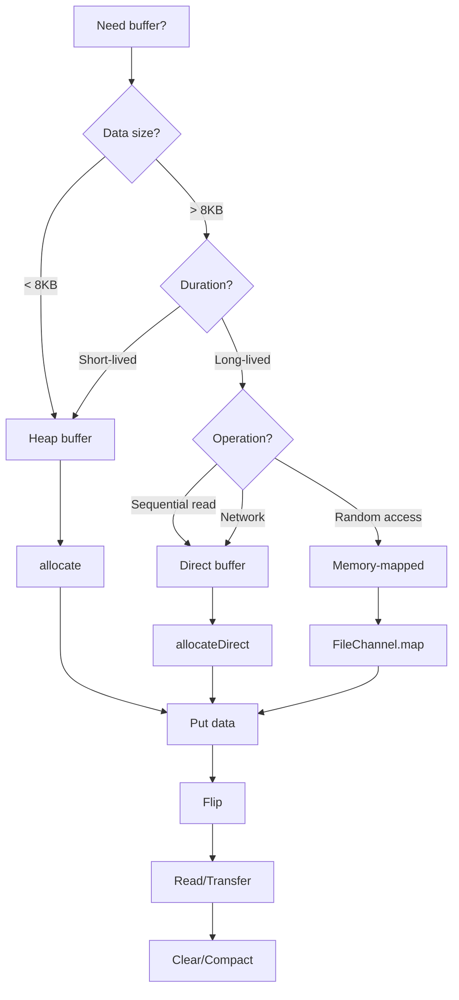

# 04 - NIO Buffers (Part 3)

[📖 Back to Part 1](README.md) | [📖 Back to Part 2](README-part2.md)

---


        // Cleanup
        Files.walk(tempDir)
            .sorted(java.util.Comparator.reverseOrder())
            .forEach(path -> {
                try { Files.deleteIfExists(path); }
                catch (Exception ignored) {}
            });
    }
}
```

## 17. Performance Considerations

### Buffer Size Impact

| Buffer Size | System Calls | Memory Usage | Throughput |
|-------------|--------------|--------------|------------|
| 256 bytes | Many | Low | 10 MB/s |
| 1 KB | Moderate | Low | 50 MB/s |
| 4 KB | Few | Moderate | 100 MB/s |
| 8 KB (optimal) | Very few | Moderate | 200 MB/s |
| 64 KB | Minimal | High | 180 MB/s |
| 1 MB | Minimal | High | 150 MB/s |

### Performance Tips

1. **Use 8KB buffers** for general file IO (matches OS page size)
2. **Use direct buffers** for large, long-lived buffers
3. **Use heap buffers** for small, short-lived buffers
4. **Use buffer pools** to reduce allocation overhead
5. **Use `transferTo()`/`transferFrom()`** for file-to-file transfers
6. **Use `Scatter/Gather`** for multi-buffer operations
7. **Avoid unnecessary `array()` calls** (may copy data)
8. **Use `mark()`/`reset()`** instead of saving position manually

## 18. Time & Space Complexity

| Operation | Time | Space |
|-----------|------|-------|
| `allocate(n)` | O(n) | O(n) |
| `allocateDirect(n)` | O(n) | O(n) |
| `put(byte)` | O(1) | O(1) |
| `get()` | O(1) | O(1) |
| `put(byte[])` | O(n) | O(n) |
| `get(byte[])` | O(n) | O(n) |
| `flip()` | O(1) | O(1) |
| `clear()` | O(1) | O(1) |
| `compact()` | O(n) | O(n) |
| `slice()` | O(1) | O(1) |
| `duplicate()` | O(1) | O(1) |
| `slice()` (creates view) | O(1) | O(1) |

## 19. Thread Safety

### Buffer Thread Safety Rules

```java
// NOT thread-safe - buffers are mutable
ByteBuffer buffer = ByteBuffer.allocate(100);

// Thread A
buffer.put((byte) 10);

// Thread B (concurrent access)
buffer.get(); // Race condition!

// Safe approaches:
// 1. Use synchronized blocks
synchronized (buffer) {
    buffer.put((byte) 10);
}

// 2. Use thread-local buffers
ThreadLocal<ByteBuffer> threadLocalBuffer = ThreadLocal.withInitial(
    () -> ByteBuffer.allocate(100)
);

// 3. Use buffer pools with proper synchronization
```

### Thread Safety Rules

1. **Buffers are not thread-safe** - synchronize access
2. **Direct buffers may have native memory races** - use with care
3. **Use `ThreadLocal`** for per-thread buffers
4. **Use buffer pools** with concurrent queues
5. **Avoid sharing buffers** between channels

## 20. Best Practices

1. **Always flip() before reading** after writing
2. **Always clear() or compact() before writing** after reading
3. **Use try-with-resources** for channels that use buffers
4. **Check `hasRemaining()`** before get/put operations
5. **Use `remaining()`** to know how much data is available
6. **Reuse buffers** when possible (clear instead of allocate)
7. **Use direct buffers** for large file transfers
8. **Monitor direct buffer memory** with `-XX:MaxDirectMemorySize`

## 21. Common Mistakes

1. **Forgetting to flip()** → Reading garbage data
2. **Not checking remaining()** → BufferUnderflowException
3. **Using direct buffers unnecessarily** → Poor performance
4. **Not clearing buffers** → Old data interferes
5. **Mixing byte orders** → Data corruption
6. **Buffer overflow** → IndexOutOfBoundsException
7. **Not handling short reads/writes** → Incomplete data
8. **Using array() on direct buffer** → UnsupportedOperationException

## 22. Pitfalls & Warnings

1. **Direct buffer memory is not GC'd immediately** → Memory pressure
2. **Direct buffer allocation is slow** → Use pools
3. **Buffer limits may change** → Check after flip/compact
4. **Absolute operations don't update position** → Confusion
5. **Slice shares underlying data** → Modifications visible
6. **Byte order affects data interpretation** → Must match write order
7. **Direct buffers may crash JVM** if corrupted → Security risk

## 23. Debugging Tips

1. **Log buffer state** before/after operations
2. **Use `Arrays.toString(buf.array())`** for heap buffers
3. **Check `position()`, `limit()`, `capacity()`** frequently
4. **Use `hasRemaining()`** instead of `position() < limit()`
5. **Monitor direct buffer usage** with JMX
6. **Use `-XX:MaxDirectMemorySize=256m`** to limit direct memory
7. **Use `jcmd`** to check native memory usage

## 24. Comparison Table

| Feature | Heap Buffer | Direct Buffer | Memory-mapped |
|---------|-------------|---------------|---------------|
| Location | JVM heap | Native memory | File-backed |
| Allocation | Fast | Slow | Very slow |
| IO Transfer | Copy required | Zero-copy | Zero-copy |
| GC Impact | High | Low | Low |
| Best Use | Small, short | Large, long | Random access |
| Array Access | Yes | No | No |
| Slicing | Yes | Yes | Yes |

## 25. Decision Tree



## 26. Interview Questions

### Q1: What is the difference between heap and direct buffers?
**Answer:** Heap buffers are allocated on the JVM heap (fast allocation, GC-managed). Direct buffers are allocated in native memory (slow allocation, not GC-managed, zero-copy IO). Use heap for small/short-lived, direct for large/long-lived buffers.

### Q2: What does `flip()` do?
**Answer:** `flip()` switches the buffer from write mode to read mode. It sets `limit` to current `position` and resets `position` to 0. This allows reading the data that was just written.

### Q3: What is the difference between `clear()` and `compact()`?
**Answer:** `clear()` resets position to 0 and limit to capacity (discards unread data). `compact()` copies unread data to the beginning and updates position/limit accordingly (preserves unread data).

### Q4: When should you use direct buffers?
**Answer:** Use direct buffers for large, long-lived buffers where the zero-copy IO benefit outweighs the allocation cost. They're ideal for file transfers and network operations. Avoid for small, short-lived buffers.

### Q5: What is memory-mapped IO?
**Answer:** Memory-mapped IO maps a file directly into memory, allowing random access without explicit reads/writes. It uses `FileChannel.map()` to create a `MappedByteBuffer`. Best for random access patterns on large files.

### Q6: How do you handle short reads/writes?
**Answer:** Check the return value of `read()`/`write()` and use loops: `while (channel.read(buffer) > 0)`. Check `hasRemaining()` before get/put operations to avoid BufferUnderflow/OverflowException.

### Q7: What is byte order and why does it matter?
**Answer:** Byte order (endianness) determines how multi-byte values are stored. Big-endian stores most significant byte first (default). Little-endian stores least significant byte first. Must match between write and read operations.

### Q8: What is the difference between `slice()` and `duplicate()`?
**Answer:** Both create views of the buffer. `slice()` creates a view starting from current position with size = remaining(). `duplicate()` creates a view with same capacity, position, and limit but independent marks.

### Q9: How do you avoid buffer overflow?
**Answer:** Check `remaining()` before putting data. Use `hasRemaining()` in loops. Calculate required capacity before allocation. Handle partial writes with loops.

### Q10: What is scatter/gather IO?
**Answer:** Scatter reads into multiple buffers (e.g., header + body). Gather writes from multiple buffers. Uses `ReadableByteChannel.read(ByteBuffer[])` and `WritableByteChannel.write(ByteBuffer[])`.

### Q11: How do direct buffers affect GC?
**Answer:** Direct buffers are allocated outside heap, so they don't increase GC pressure directly. However, they are freed via Cleaner when the ByteBuffer becomes unreachable, which can cause delayed memory release.

### Q12: What is the optimal buffer size?
**Answer:** 8KB-16KB is optimal for most file operations (matches OS page size). Use larger buffers (64KB-1MB) for high-throughput transfers. Use smaller buffers for network operations with small messages.

### Q13: Can you create a view of a direct buffer?
**Answer:** Yes, using `slice()`, `duplicate()`, or type-specific views like `asIntBuffer()`. Views share the underlying memory, so modifications are visible through all views.

### Q14: How do you monitor direct buffer memory?
**Answer:** Use JMX (`BufferPoolMXBean`), JVM flags (`-XX:MaxDirectMemorySize`), or tools like `jcmd`. Direct buffer memory is tracked separately from heap memory.

### Q15: What happens if you don't call `compact()` before writing?
**Answer:** New data overwrites from position 0, potentially losing unread data. Always call `compact()` if you need to preserve unread data while adding new data.

## 27. Exercises

### Level 1: Basic

1. **Buffer Basics**: Create a buffer, write 10 integers, flip it, and read them back.

2. **String Buffer**: Write a string to a ByteBuffer and read it back using UTF-8 charset.

3. **Byte Order**: Create two buffers with different byte orders and write the same int to both. Compare the byte representations.

### Level 2: Intermediate

4. **Buffer Pool**: Implement a simple buffer pool that reuses ByteBuffer objects.

5. **Scatter/Gather**: Implement scatter read that reads header and body from a file into separate buffers.

6. **Buffer Copy**: Copy data between two buffers, handling the case where the source has more data than the destination.

### Level 3: Advanced

7. **Memory-mapped Processing**: Read a large file using memory-mapped buffers and count word occurrences.

8. **Zero-copy Transfer**: Implement file transfer using `FileChannel.transferTo()`.

9. **Ring Buffer**: Implement a ring buffer using ByteBuffer for producer-consumer scenarios.

## 28. Summary

| Concept | Key Point |
|---------|-----------|
| Buffer | Structured data container for IO |
| Capacity | Fixed maximum size |
| Position | Current read/write index |
| Limit | Boundary for operations |
| flip() | Switch from write to read mode |
| clear/compact | Reset for reuse |
| Heap vs Direct | Trade-off between speed and memory |
| Byte Order | Must match between write/read |

## 29. References

1. **Official Documentation**: [Java NIO Buffers](https://docs.oracle.com/en/java/javase/21/docs/api/java/nio/Buffer.html)
2. **Jenkov**: [Java NIO Buffers](https://jenkov.com/tutorials/java-nio/buffers.html)
3. **Books**:
   - "Java NIO" by Ron Hitchens
   - "Java I/O, NIO and NIO.2" by Joseph Dallmeier
4. **Related Topics**:
   - [05 - NIO Channels](../05-nio-channels/README.md)
   - [01 - Introduction](../01-introduction/README.md)

---

**Next Topic**: [05 - NIO Channels](../05-nio-channels/README.md)
