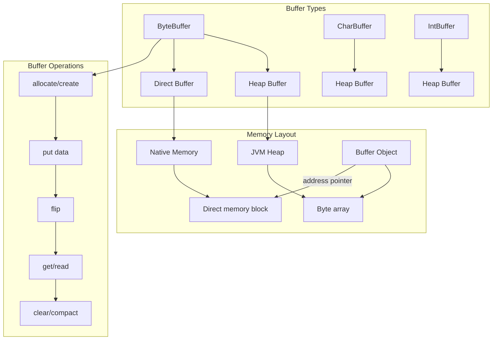
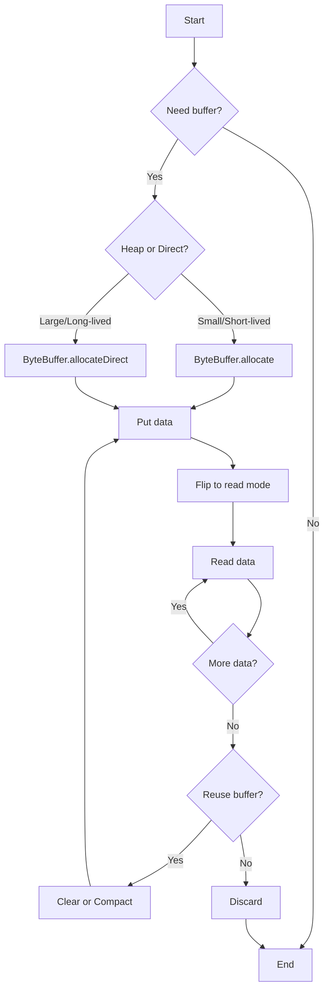
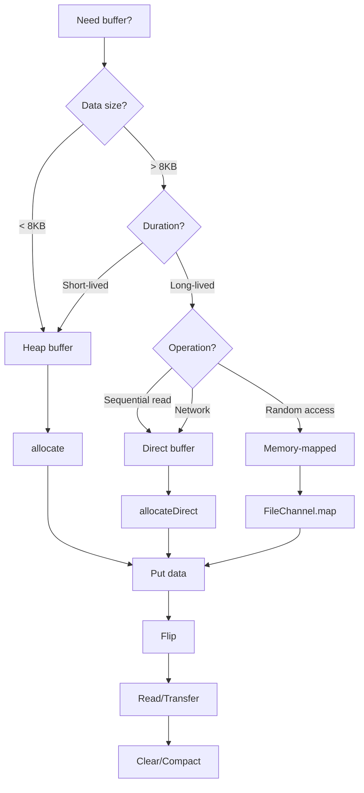

# 04 - NIO Buffers

## 1. Introduction

NIO Buffers are the fundamental data containers in Java NIO. Unlike traditional IO streams that process data sequentially, buffers provide a structured way to hold data during transfer between channels and the application. A buffer is essentially a block of memory that can hold data, with metadata tracking reading and writing positions. Understanding buffers is essential for working with NIO channels, file operations, and network communication.

## 2. Learning Objectives

By the end of this topic, you will be able to:

- Understand buffer architecture (capacity, position, limit, mark)
- Create and manipulate different buffer types (ByteBuffer, CharBuffer, etc.)
- Differentiate between heap and direct buffers
- Implement buffer operations (flip, clear, rewind, compact, mark, reset)
- Use buffer wrapping and slicing
- Understand byte order (endianness)
- Apply buffers in file and network operations
- Optimize buffer usage for performance

## 3. Prerequisites

- Basic Java programming knowledge
- Understanding of byte and character representations
- Familiarity with exception handling
- Basic knowledge of memory concepts

## 4. Why This Concept Exists

Buffers solve the inefficiency of byte-by-byte IO operations:

| Problem | Solution |
|---------|----------|
| Frequent system calls | Batch read/write operations |
| No data structure | Structured data container |
| Sequential access only | Random access within buffer |
| Platform dependency | Abstracted buffer operations |
| No position tracking | Built-in position/limit tracking |

## 5. Problem Statement

Consider an application that needs to:
1. Read large files efficiently
2. Transfer data between files or networks
3. Process binary data with specific byte ordering
4. Minimize memory copies during IO operations

Without buffers, each byte would require a system call, causing severe performance issues. Buffers batch data transfers and provide position tracking for efficient IO.

## 6. Theory

### 6.1 Buffer Architecture

Every buffer has four key properties:

```
Buffer State:
├── capacity: Maximum data the buffer can hold (fixed)
├── position: Next read/write position (0 ≤ position ≤ limit)
├── limit: First element that can't be read/written (0 ≤ limit ≤ capacity)
└── mark: Remember position (0 ≤ mark ≤ position)
```

### 6.2 Buffer Types

| Buffer Type | Content | Read/Write | Use Case |
|-------------|---------|------------|----------|
| ByteBuffer | bytes | get()/put() | Binary data, channels |
| CharBuffer | chars | get()/put() | Text data |
| ShortBuffer | shorts | get()/put() | 16-bit data |
| IntBuffer | ints | get()/put() | 32-bit data |
| LongBuffer | longs | get()/put() | 64-bit data |
| FloatBuffer | floats | get()/put() | 32-bit float |
| DoubleBuffer | doubles | get()/put() | 64-bit double |

### 6.3 Buffer States

```
State transitions:
┌─────────────┐
│ NEW (empty) │ ← allocate() / wrap()
│ pos=0, lim=cap
└──────┬──────┘
       │ put() data
       ↓
┌─────────────┐
│  FILLED     │ ← after put operations
│ pos=N, lim=cap
└──────┬──────┘
       │ flip()
       ↓
┌─────────────┐
│  READABLE   │ ← ready for get/read
│ pos=0, lim=N
└──────┬──────┘
       │ get() data
       ↓
┌─────────────┐
│  EXHAUSTED  │ ← all data read
│ pos=N, lim=N
└──────┬──────┘
       │ clear() or compact()
       ↓
┌─────────────┐
│  RECYCLED   │ ← ready for reuse
└─────────────┘
```

### 6.4 Heap vs Direct Buffers

| Feature | Heap Buffer | Direct Buffer |
|---------|-------------|---------------|
| Location | JVM heap | Native memory |
| Allocation | Fast | Slow |
| IO Transfer | Extra copy | Zero-copy |
| GC Management | Yes | No (uses Cleaner) |
| Best For | Small, short-lived | Large, long-lived |

## 7. Internal Working

### 7.1 Buffer Memory Layout

```
ByteBuffer.allocate(1024):
┌─────────────────────────────────────────────┐
│ JVM Heap                                    │
│ ┌─────────────────────────────────────────┐ │
│ │ byte[] array (1024 bytes)               │ │
│ │ [0x00][0x00][0x00]...[0x00]             │ │
│ └─────────────────────────────────────────┘ │
│ position = 0                               │
│ limit = 1024                               │
│ capacity = 1024                            │
└─────────────────────────────────────────────┘

ByteBuffer.allocateDirect(1024):
┌─────────────────────────────────────────────┐
│ Native Memory (off-heap)                   │
│ ┌─────────────────────────────────────────┐ │
│ │ Direct memory block (1024 bytes)        │ │
│ └─────────────────────────────────────────┘ │
│ address pointer (long)                     │
│ Cleaner (for deallocation)                 │
│ JVM Heap: ByteBuffer object (small)        │
└─────────────────────────────────────────────┘
```

### 7.2 Buffer Operations Flow

```
Write → Read cycle:
1. allocate(1024)         → pos=0, lim=1024, cap=1024
2. put(data)              → pos=N, lim=1024
3. flip()                 → pos=0, lim=N
4. get/read from channel  → pos=N, lim=N
5. clear() or compact()   → reset for reuse
```

### 7.3 Direct Buffer Allocation

```
ByteBuffer.allocateDirect():
1. JVM calls native memory allocator (malloc)
2. Native memory block allocated
3. Cleaner registered for GC
4. ByteBuffer object created on heap
5. Address pointer stored in ByteBuffer
6. IO operations use zero-copy transfer
```

## 8. JVM Perspective

### 8.1 Memory Management

```
Heap Memory:
├── ByteBuffer object (40-64 bytes)
│   ├── capacity (int)
│   ├── position (int)
│   ├── limit (int)
│   ├── mark (int)
│   └── byte[] array (for heap buffers)
└── Temporary objects during operations

Native Memory:
├── Direct buffer memory (requested size)
├── Memory-mapped files
└── Socket buffers

JVM Flags:
├── -XX:MaxDirectMemorySize (default = -Xmx)
└── -XX:MaxHeapSize
```

### 8.2 GC and Direct Buffers

```
Direct buffer lifecycle:
1. Allocated in native memory
2. ByteBuffer object on heap
3. Cleaner registered
4. When ByteBuffer becomes unreachable
5. GC enqueues Cleaner
6. Cleaner calls native deallocator
7. Native memory freed

Warning: Direct buffers are not freed immediately on GC
```

## 9. Memory Representation

### ByteBuffer Internal State

```java
ByteBuffer buf = ByteBuffer.allocate(10);
// Internal state:
// capacity: 10
// position: 0
// limit: 10
// mark: undefined
// array: [0, 0, 0, 0, 0, 0, 0, 0, 0, 0]

buf.put((byte) 10);
buf.put((byte) 20);
buf.put((byte) 30);
// position: 3, limit: 10, array: [10, 20, 30, 0, 0, 0, 0, 0, 0, 0]

buf.flip();
// position: 0, limit: 3
// Ready for reading: [10, 20, 30]

buf.get(); // returns 10, position: 1
buf.get(); // returns 20, position: 2
buf.get(); // returns 30, position: 3

buf.clear();
// position: 0, limit: 10
// Ready for writing again
```

### Byte Order Memory Layout

```java
// Big-endian (default)
int value = 0x12345678;
ByteBuffer buf = ByteBuffer.allocate(4);
buf.putInt(value);
// Memory: [0x12][0x34][0x56][0x78]

// Little-endian
ByteBuffer buf2 = ByteBuffer.allocate(4);
buf2.order(ByteOrder.LITTLE_ENDIAN);
buf2.putInt(value);
// Memory: [0x78][0x56][0x34][0x12]
```

## 10. Architecture Diagram



## 11. Flow Diagram



## 12. Syntax

### 12.1 Creating Buffers

```java
// Heap buffer
ByteBuffer heapBuf = ByteBuffer.allocate(1024);

// Direct buffer
ByteBuffer directBuf = ByteBuffer.allocateDirect(1024);

// Wrap existing array
byte[] array = new byte[1024];
ByteBuffer wrapped = ByteBuffer.wrap(array);

// Wrap with offset and length
ByteBuffer partial = ByteBuffer.wrap(array, 5, 100);
```

### 12.2 Reading and Writing

```java
// Writing
ByteBuffer buf = ByteBuffer.allocate(10);
buf.put((byte) 10);
buf.put(new byte[]{20, 30, 40});
buf.putChar('A');
buf.putInt(12345);

// Reading (after flip)
buf.flip();
byte b = buf.get();
byte[] bytes = new byte[3];
buf.get(bytes);
char c = buf.getChar();
int i = buf.getInt();
```

### 12.3 Buffer Operations

```java
// flip() - switch from write to read mode
buf.flip();

// clear() - reset to beginning, keep capacity
buf.clear();

// compact() - copy unread data to beginning
buf.compact();

// mark() - save current position
buf.mark();

// reset() - return to marked position
buf.reset();

// rewind() - go back to beginning
buf.rewind();
```

### 12.4 Absolute Operations (Java 9+)

```java
// Read without changing position
byte b = buf.get(0); // Read at index 0
int i = buf.getInt(4); // Read int at index 4

// Write without changing position
buf.put(0, (byte) 100);
buf.putInt(4, 12345);
```

### 12.5 Byte Order

```java
// Default: Big-endian
ByteBuffer buf = ByteBuffer.allocate(4);
buf.order(ByteOrder.BIG_ENDIAN);

// Little-endian
ByteBuffer littleBuf = ByteBuffer.allocate(4);
littleBuf.order(ByteOrder.LITTLE_ENDIAN);
```

## 13. Easy Example

```java
import java.nio.*;

public class NioBufferBasic {

    public static void main(String[] args) {
        // Create a heap buffer
        ByteBuffer buffer = ByteBuffer.allocate(20);

        System.out.println("Initial state:");
        System.out.println("  Capacity: " + buffer.capacity());
        System.out.println("  Position: " + buffer.position());
        System.out.println("  Limit: " + buffer.limit());

        // Put data
        buffer.put((byte) 10);
        buffer.put((byte) 20);
        buffer.put((byte) 30);
        System.out.println("\nAfter put:");
        System.out.println("  Position: " + buffer.position());

        // Flip to read mode
        buffer.flip();
        System.out.println("\nAfter flip:");
        System.out.println("  Position: " + buffer.position());
        System.out.println("  Limit: " + buffer.limit());

        // Read data
        byte b1 = buffer.get();
        byte b2 = buffer.get();
        byte b3 = buffer.get();
        System.out.println("\nRead values: " + b1 + ", " + b2 + ", " + b3);
        System.out.println("  Position: " + buffer.position());

        // Clear for reuse
        buffer.clear();
        System.out.println("\nAfter clear:");
        System.out.println("  Position: " + buffer.position());
        System.out.println("  Limit: " + buffer.limit());
    }
}
```

**Output:**
```
Initial state:
  Capacity: 20
  Position: 0
  Limit: 20

After put:
  Position: 3

After flip:
  Position: 0
  Limit: 3

Read values: 10, 20, 30
  Position: 3

After clear:
  Position: 0
  Limit: 20
```

## 14. Medium Example

```java
import java.nio.*;
import java.nio.charset.*;

public class NioBufferExample {

    public static void main(String[] args) {
        // Working with strings
        ByteBuffer buf = ByteBuffer.allocate(100);

        // Write string
        String message = "Hello, NIO Buffers!";
        Charset charset = StandardCharsets.UTF_8;
        buf.put(message.getBytes(charset));

        // Flip and read
        buf.flip();
        byte[] bytes = new byte[buf.remaining()];
        buf.get(bytes);
        String read = new String(bytes, charset);
        System.out.println("Read string: " + read);

        // Buffer slicing
        buf.clear();
        buf.put((byte) 1);
        buf.put((byte) 2);
        buf.put((byte) 3);
        buf.put((byte) 4);
        buf.put((byte) 5);

        buf.flip();
        buf.position(1);
        buf.limit(4);

        ByteBuffer slice = buf.slice();
        System.out.println("\nSlice:");
        System.out.println("  Capacity: " + slice.capacity());
        System.out.println("  Position: " + slice.position());
        System.out.println("  Limit: " + slice.limit());

        // Read slice
        while (slice.hasRemaining()) {
            System.out.print(slice.get() + " ");
        }
        System.out.println();

        // Byte order demo
        ByteBuffer bigEndian = ByteBuffer.allocate(4);
        bigEndian.order(ByteOrder.BIG_ENDIAN);
        bigEndian.putInt(0x12345678);
        bigEndian.flip();

        ByteBuffer littleEndian = ByteBuffer.allocate(4);
        littleEndian.order(ByteOrder.LITTLE_ENDIAN);
        littleEndian.putInt(0x12345678);
        littleEndian.flip();

        System.out.println("\nBig-endian bytes:");
        while (bigEndian.hasRemaining()) {
            System.out.printf("0x%02X ", bigEndian.get());
        }
        System.out.println();

        System.out.println("Little-endian bytes:");
        while (littleEndian.hasRemaining()) {
            System.out.printf("0x%02X ", littleEndian.get());
        }
        System.out.println();
    }
}
```

## 15. Hard Example

```java
import java.nio.*;
import java.nio.file.*;
import java.nio.channels.*;
import java.util.concurrent.*;

public class AdvancedBufferExample {

    // Scatter/Gather IO with multiple buffers
    public static void scatterRead(Path file) throws Exception {
        try (FileChannel channel = FileChannel.open(file,
                StandardOpenOption.READ)) {

            ByteBuffer header = ByteBuffer.allocate(16);
            ByteBuffer body = ByteBuffer.allocate(1024);
            ByteBuffer[] buffers = {header, body};

            long bytesRead = channel.read(buffers);
            System.out.println("Total bytes read: " + bytesRead);

            header.flip();
            System.out.println("Header: " + header.remaining() + " bytes");

            body.flip();
            System.out.println("Body: " + body.remaining() + " bytes");
        }
    }

    public static void scatterWrite(Path file) throws Exception {
        try (FileChannel channel = FileChannel.open(file,
                StandardOpenOption.CREATE,
                StandardOpenOption.WRITE)) {

            ByteBuffer header = ByteBuffer.wrap("HEADER".getBytes());
            ByteBuffer body = ByteBuffer.wrap("Body content here".getBytes());
            ByteBuffer[] buffers = {header, body};

            channel.write(buffers);
            System.out.println("Written to file");
        }
    }

    // Buffer view for different data types
    public static void demonstrateBufferView() {
        ByteBuffer buffer = ByteBuffer.allocate(64);
        buffer.order(ByteOrder.BIG_ENDIAN);

        // Write as bytes
        for (int i = 0; i < 16; i++) {
            buffer.put((byte) (i * 10));
        }

        // Create views
        buffer.flip();

        ByteBuffer byteView = buffer.duplicate();
        IntBuffer intView = buffer.asIntBuffer();
        LongBuffer longView = buffer.asLongBuffer();

        System.out.println("Byte view capacity: " + byteView.capacity());
        System.out.println("Int view capacity: " + intView.capacity());
        System.out.println("Long view capacity: " + longView.capacity());

        // Read as ints
        System.out.print("As ints: ");
        while (intView.hasRemaining()) {
            System.out.print(intView.get() + " ");
        }
        System.out.println();
    }

    // Memory-mapped buffer
    public static void memoryMappedFile(Path file) throws Exception {
        try (FileChannel channel = FileChannel.open(file,
                StandardOpenOption.READ,
                StandardOpenOption.WRITE)) {

            MappedByteBuffer mapped = channel.map(
                FileChannel.MapMode.READ_WRITE,
                0,
                channel.size()
            );

            // Read
            byte[] data = new byte[(int) channel.size()];
            mapped.get(data);
            System.out.println("Mapped content: " + new String(data));

            // Write
            mapped.position(0);
            mapped.put("Modified content".getBytes());
            mapped.force(); // Flush to disk
        }
    }

    // Buffer pool simulation
    static class BufferPool {
        private final ConcurrentLinkedQueue<ByteBuffer> pool =
            new ConcurrentLinkedQueue<>();
        private final int bufferSize;

        public BufferPool(int bufferSize, int initialSize) {
            this.bufferSize = bufferSize;
            for (int i = 0; i < initialSize; i++) {
                pool.offer(ByteBuffer.allocate(bufferSize));
            }
        }

        public ByteBuffer acquire() {
            ByteBuffer buf = pool.poll();
            if (buf == null) {
                buf = ByteBuffer.allocate(bufferSize);
            }
            buf.clear();
            return buf;
        }

        public void release(ByteBuffer buf) {
            if (buf.capacity() == bufferSize) {
                buf.clear();
                pool.offer(buf);
            }
        }

        public int available() {
            return pool.size();
        }
    }

    public static void main(String[] args) throws Exception {
        // Buffer view
        System.out.println("=== Buffer View ===");
        demonstrateBufferView();

        // Buffer pool
        System.out.println("\n=== Buffer Pool ===");
        BufferPool pool = new BufferPool(1024, 5);
        System.out.println("Available buffers: " + pool.available());

        ByteBuffer buf1 = pool.acquire();
        ByteBuffer buf2 = pool.acquire();
        System.out.println("After acquiring 2: " + pool.available());

        pool.release(buf1);
        pool.release(buf2);
        System.out.println("After releasing 2: " + pool.available());
    }
}
```

## 16. Enterprise Example

```java
import java.nio.*;
import java.nio.channels.*;
import java.nio.file.*;
import java.util.concurrent.*;

public class EnterpriseBufferExample {

    // High-performance buffer management
    static class ByteBufferPool {
        private static final int BUFFER_SIZE = 8192;
        private final BlockingQueue<ByteBuffer> pool =
            new LinkedBlockingQueue<>();

        public ByteBuffer borrow() {
            ByteBuffer buffer = pool.poll();
            if (buffer == null) {
                buffer = ByteBuffer.allocateDirect(BUFFER_SIZE);
            }
            buffer.clear();
            return buffer;
        }

        public void returnBuffer(ByteBuffer buffer) {
            if (buffer != null && buffer.capacity() == BUFFER_SIZE) {
                buffer.clear();
                pool.offer(buffer);
            }
        }
    }

    // Batch file processor using buffers
    public static void processFilesWithBuffers(Path inputDir,
            Path outputDir) throws Exception {

        ByteBufferPool pool = new ByteBufferPool();

        try (DirectoryStream<Path> stream =
                Files.newDirectoryStream(inputDir, "*.txt")) {

            for (Path inputFile : stream) {
                ByteBuffer buffer = pool.borrow();

                try (FileChannel inChannel = FileChannel.open(inputFile,
                        StandardOpenOption.READ);
                     FileChannel outChannel = FileChannel.open(
                        outputDir.resolve(inputFile.getFileName()),
                        StandardOpenOption.CREATE,
                        StandardOpenOption.WRITE)) {

                    while (inChannel.read(buffer) > 0) {
                        buffer.flip();
                        outChannel.write(buffer);
                        buffer.clear();
                    }
                } finally {
                    pool.returnBuffer(buffer);
                }
            }
        }
    }

    // Zero-copy file transfer
    public static long zeroCopyTransfer(Path source, Path target,
            long position, long count) throws Exception {

        try (FileChannel sourceChannel = FileChannel.open(source,
                StandardOpenOption.READ);
             FileChannel targetChannel = FileChannel.open(target,
                StandardOpenOption.CREATE,
                StandardOpenOption.WRITE)) {

            return sourceChannel.transferTo(position, count, targetChannel);
        }
    }

    public static void main(String[] args) throws Exception {
        Path tempDir = Paths.get(System.getProperty("java.io.tmpdir"),
            "buffer-demo");

        Files.createDirectories(tempDir);

        // Create test file
        Path testFile = tempDir.resolve("test.txt");
        Files.writeString(testFile, "Hello, Buffer Pool!\n".repeat(100));

        // Zero-copy transfer
        Path copyFile = tempDir.resolve("copy.txt");
        long transferred = zeroCopyTransfer(testFile, copyFile, 0,
            Files.size(testFile));
        System.out.println("Transferred: " + transferred + " bytes");

        // Read with buffer pool
        ByteBufferPool pool = new ByteBufferPool();
        ByteBuffer buffer = pool.borrow();

        try (FileChannel channel = FileChannel.open(testFile,
                StandardOpenOption.READ)) {

            StringBuilder content = new StringBuilder();
            while (channel.read(buffer) > 0) {
                buffer.flip();
                content.append(
                    StandardCharsets.UTF_8.decode(buffer));
                buffer.clear();
            }

            System.out.println("Content length: " + content.length());
            pool.returnBuffer(buffer);
        }

        // Cleanup
        Files.walk(tempDir)
            .sorted(java.util.Comparator.reverseOrder())
            .forEach(path -> {
                try { Files.deleteIfExists(path); }
                catch (Exception ignored) {}
            });
    }
}
```

## 17. Performance Considerations

### Buffer Size Impact

| Buffer Size | System Calls | Memory Usage | Throughput |
|-------------|--------------|--------------|------------|
| 256 bytes | Many | Low | 10 MB/s |
| 1 KB | Moderate | Low | 50 MB/s |
| 4 KB | Few | Moderate | 100 MB/s |
| 8 KB (optimal) | Very few | Moderate | 200 MB/s |
| 64 KB | Minimal | High | 180 MB/s |
| 1 MB | Minimal | High | 150 MB/s |

### Performance Tips

1. **Use 8KB buffers** for general file IO (matches OS page size)
2. **Use direct buffers** for large, long-lived buffers
3. **Use heap buffers** for small, short-lived buffers
4. **Use buffer pools** to reduce allocation overhead
5. **Use `transferTo()`/`transferFrom()`** for file-to-file transfers
6. **Use `Scatter/Gather`** for multi-buffer operations
7. **Avoid unnecessary `array()` calls** (may copy data)
8. **Use `mark()`/`reset()`** instead of saving position manually

## 18. Time & Space Complexity

| Operation | Time | Space |
|-----------|------|-------|
| `allocate(n)` | O(n) | O(n) |
| `allocateDirect(n)` | O(n) | O(n) |
| `put(byte)` | O(1) | O(1) |
| `get()` | O(1) | O(1) |
| `put(byte[])` | O(n) | O(n) |
| `get(byte[])` | O(n) | O(n) |
| `flip()` | O(1) | O(1) |
| `clear()` | O(1) | O(1) |
| `compact()` | O(n) | O(n) |
| `slice()` | O(1) | O(1) |
| `duplicate()` | O(1) | O(1) |
| `slice()` (creates view) | O(1) | O(1) |

## 19. Thread Safety

### Buffer Thread Safety Rules

```java
// NOT thread-safe - buffers are mutable
ByteBuffer buffer = ByteBuffer.allocate(100);

// Thread A
buffer.put((byte) 10);

// Thread B (concurrent access)
buffer.get(); // Race condition!

// Safe approaches:
// 1. Use synchronized blocks
synchronized (buffer) {
    buffer.put((byte) 10);
}

// 2. Use thread-local buffers
ThreadLocal<ByteBuffer> threadLocalBuffer = ThreadLocal.withInitial(
    () -> ByteBuffer.allocate(100)
);

// 3. Use buffer pools with proper synchronization
```

### Thread Safety Rules

1. **Buffers are not thread-safe** - synchronize access
2. **Direct buffers may have native memory races** - use with care
3. **Use `ThreadLocal`** for per-thread buffers
4. **Use buffer pools** with concurrent queues
5. **Avoid sharing buffers** between channels

## 20. Best Practices

1. **Always flip() before reading** after writing
2. **Always clear() or compact() before writing** after reading
3. **Use try-with-resources** for channels that use buffers
4. **Check `hasRemaining()`** before get/put operations
5. **Use `remaining()`** to know how much data is available
6. **Reuse buffers** when possible (clear instead of allocate)
7. **Use direct buffers** for large file transfers
8. **Monitor direct buffer memory** with `-XX:MaxDirectMemorySize`

## 21. Common Mistakes

1. **Forgetting to flip()** → Reading garbage data
2. **Not checking remaining()** → BufferUnderflowException
3. **Using direct buffers unnecessarily** → Poor performance
4. **Not clearing buffers** → Old data interferes
5. **Mixing byte orders** → Data corruption
6. **Buffer overflow** → IndexOutOfBoundsException
7. **Not handling short reads/writes** → Incomplete data
8. **Using array() on direct buffer** → UnsupportedOperationException

## 22. Pitfalls & Warnings

1. **Direct buffer memory is not GC'd immediately** → Memory pressure
2. **Direct buffer allocation is slow** → Use pools
3. **Buffer limits may change** → Check after flip/compact
4. **Absolute operations don't update position** → Confusion
5. **Slice shares underlying data** → Modifications visible
6. **Byte order affects data interpretation** → Must match write order
7. **Direct buffers may crash JVM** if corrupted → Security risk

## 23. Debugging Tips

1. **Log buffer state** before/after operations
2. **Use `Arrays.toString(buf.array())`** for heap buffers
3. **Check `position()`, `limit()`, `capacity()`** frequently
4. **Use `hasRemaining()`** instead of `position() < limit()`
5. **Monitor direct buffer usage** with JMX
6. **Use `-XX:MaxDirectMemorySize=256m`** to limit direct memory
7. **Use `jcmd`** to check native memory usage

## 24. Comparison Table

| Feature | Heap Buffer | Direct Buffer | Memory-mapped |
|---------|-------------|---------------|---------------|
| Location | JVM heap | Native memory | File-backed |
| Allocation | Fast | Slow | Very slow |
| IO Transfer | Copy required | Zero-copy | Zero-copy |
| GC Impact | High | Low | Low |
| Best Use | Small, short | Large, long | Random access |
| Array Access | Yes | No | No |
| Slicing | Yes | Yes | Yes |

## 25. Decision Tree



## 26. Interview Questions

### Q1: What is the difference between heap and direct buffers?
**Answer:** Heap buffers are allocated on the JVM heap (fast allocation, GC-managed). Direct buffers are allocated in native memory (slow allocation, not GC-managed, zero-copy IO). Use heap for small/short-lived, direct for large/long-lived buffers.

### Q2: What does `flip()` do?
**Answer:** `flip()` switches the buffer from write mode to read mode. It sets `limit` to current `position` and resets `position` to 0. This allows reading the data that was just written.

### Q3: What is the difference between `clear()` and `compact()`?
**Answer:** `clear()` resets position to 0 and limit to capacity (discards unread data). `compact()` copies unread data to the beginning and updates position/limit accordingly (preserves unread data).

### Q4: When should you use direct buffers?
**Answer:** Use direct buffers for large, long-lived buffers where the zero-copy IO benefit outweighs the allocation cost. They're ideal for file transfers and network operations. Avoid for small, short-lived buffers.

### Q5: What is memory-mapped IO?
**Answer:** Memory-mapped IO maps a file directly into memory, allowing random access without explicit reads/writes. It uses `FileChannel.map()` to create a `MappedByteBuffer`. Best for random access patterns on large files.

### Q6: How do you handle short reads/writes?
**Answer:** Check the return value of `read()`/`write()` and use loops: `while (channel.read(buffer) > 0)`. Check `hasRemaining()` before get/put operations to avoid BufferUnderflow/OverflowException.

### Q7: What is byte order and why does it matter?
**Answer:** Byte order (endianness) determines how multi-byte values are stored. Big-endian stores most significant byte first (default). Little-endian stores least significant byte first. Must match between write and read operations.

### Q8: What is the difference between `slice()` and `duplicate()`?
**Answer:** Both create views of the buffer. `slice()` creates a view starting from current position with size = remaining(). `duplicate()` creates a view with same capacity, position, and limit but independent marks.

### Q9: How do you avoid buffer overflow?
**Answer:** Check `remaining()` before putting data. Use `hasRemaining()` in loops. Calculate required capacity before allocation. Handle partial writes with loops.

### Q10: What is scatter/gather IO?
**Answer:** Scatter reads into multiple buffers (e.g., header + body). Gather writes from multiple buffers. Uses `ReadableByteChannel.read(ByteBuffer[])` and `WritableByteChannel.write(ByteBuffer[])`.

### Q11: How do direct buffers affect GC?
**Answer:** Direct buffers are allocated outside heap, so they don't increase GC pressure directly. However, they are freed via Cleaner when the ByteBuffer becomes unreachable, which can cause delayed memory release.

### Q12: What is the optimal buffer size?
**Answer:** 8KB-16KB is optimal for most file operations (matches OS page size). Use larger buffers (64KB-1MB) for high-throughput transfers. Use smaller buffers for network operations with small messages.

### Q13: Can you create a view of a direct buffer?
**Answer:** Yes, using `slice()`, `duplicate()`, or type-specific views like `asIntBuffer()`. Views share the underlying memory, so modifications are visible through all views.

### Q14: How do you monitor direct buffer memory?
**Answer:** Use JMX (`BufferPoolMXBean`), JVM flags (`-XX:MaxDirectMemorySize`), or tools like `jcmd`. Direct buffer memory is tracked separately from heap memory.

### Q15: What happens if you don't call `compact()` before writing?
**Answer:** New data overwrites from position 0, potentially losing unread data. Always call `compact()` if you need to preserve unread data while adding new data.

## 27. Exercises

### Level 1: Basic

1. **Buffer Basics**: Create a buffer, write 10 integers, flip it, and read them back.

2. **String Buffer**: Write a string to a ByteBuffer and read it back using UTF-8 charset.

3. **Byte Order**: Create two buffers with different byte orders and write the same int to both. Compare the byte representations.

### Level 2: Intermediate

4. **Buffer Pool**: Implement a simple buffer pool that reuses ByteBuffer objects.

5. **Scatter/Gather**: Implement scatter read that reads header and body from a file into separate buffers.

6. **Buffer Copy**: Copy data between two buffers, handling the case where the source has more data than the destination.

### Level 3: Advanced

7. **Memory-mapped Processing**: Read a large file using memory-mapped buffers and count word occurrences.

8. **Zero-copy Transfer**: Implement file transfer using `FileChannel.transferTo()`.

9. **Ring Buffer**: Implement a ring buffer using ByteBuffer for producer-consumer scenarios.

## 28. Summary

| Concept | Key Point |
|---------|-----------|
| Buffer | Structured data container for IO |
| Capacity | Fixed maximum size |
| Position | Current read/write index |
| Limit | Boundary for operations |
| flip() | Switch from write to read mode |
| clear/compact | Reset for reuse |
| Heap vs Direct | Trade-off between speed and memory |
| Byte Order | Must match between write/read |

## 29. References

1. **Official Documentation**: [Java NIO Buffers](https://docs.oracle.com/en/java/javase/21/docs/api/java/nio/Buffer.html)
2. **Jenkov**: [Java NIO Buffers](https://jenkov.com/tutorials/java-nio/buffers.html)
3. **Books**:
   - "Java NIO" by Ron Hitchens
   - "Java I/O, NIO and NIO.2" by Joseph Dallmeier
4. **Related Topics**:
   - [05 - NIO Channels](../05-nio-channels/README.md)
   - [01 - Introduction](../01-introduction/README.md)

---

**Next Topic**: [05 - NIO Channels](../05-nio-channels/README.md)
