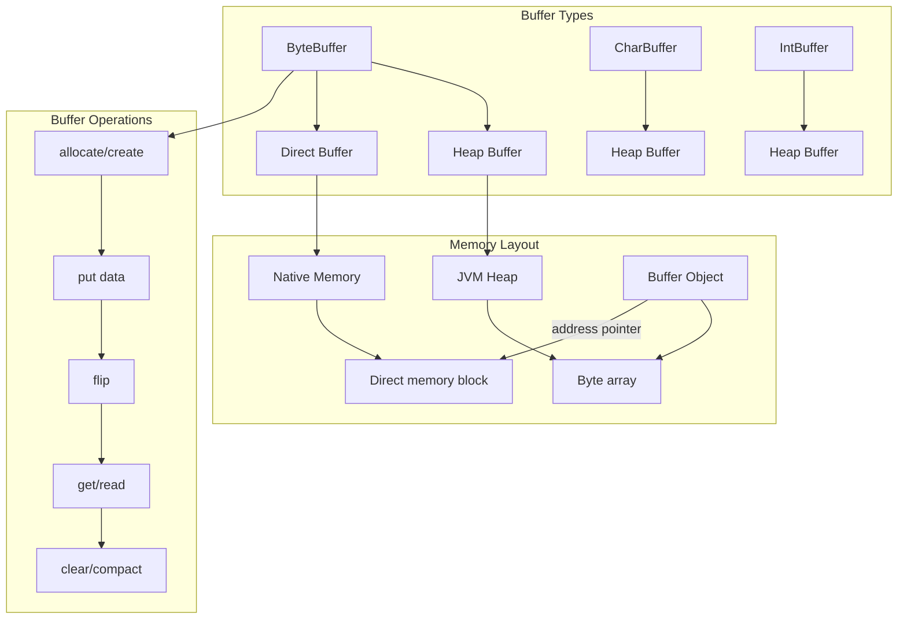
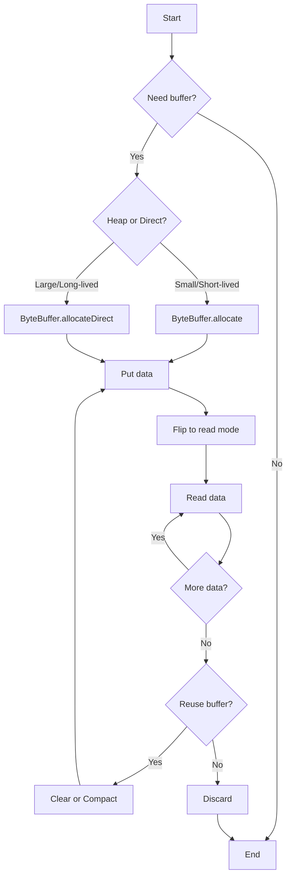

# 04 - NIO Buffers

## 1. Introduction

NIO Buffers are the fundamental data containers in Java NIO. Unlike traditional IO streams that process data sequentially, buffers provide a structured way to hold data during transfer between channels and the application. A buffer is essentially a block of memory that can hold data, with metadata tracking reading and writing positions. Understanding buffers is essential for working with NIO channels, file operations, and network communication.

## 2. Learning Objectives

By the end of this topic, you will be able to:

- Understand buffer architecture (capacity, position, limit, mark)
- Create and manipulate different buffer types (ByteBuffer, CharBuffer, etc.)
- Differentiate between heap and direct buffers
- Implement buffer operations (flip, clear, rewind, compact, mark, reset)
- Use buffer wrapping and slicing
- Understand byte order (endianness)
- Apply buffers in file and network operations
- Optimize buffer usage for performance

## 3. Prerequisites

- Basic Java programming knowledge
- Understanding of byte and character representations
- Familiarity with exception handling
- Basic knowledge of memory concepts

## 4. Why This Concept Exists

Buffers solve the inefficiency of byte-by-byte IO operations:

| Problem | Solution |
|---------|----------|
| Frequent system calls | Batch read/write operations |
| No data structure | Structured data container |
| Sequential access only | Random access within buffer |
| Platform dependency | Abstracted buffer operations |
| No position tracking | Built-in position/limit tracking |

## 5. Problem Statement

Consider an application that needs to:
1. Read large files efficiently
2. Transfer data between files or networks
3. Process binary data with specific byte ordering
4. Minimize memory copies during IO operations

Without buffers, each byte would require a system call, causing severe performance issues. Buffers batch data transfers and provide position tracking for efficient IO.

## 6. Theory

### 6.1 Buffer Architecture

Every buffer has four key properties:

```
Buffer State:
├── capacity: Maximum data the buffer can hold (fixed)
├── position: Next read/write position (0 ≤ position ≤ limit)
├── limit: First element that can't be read/written (0 ≤ limit ≤ capacity)
└── mark: Remember position (0 ≤ mark ≤ position)
```

### 6.2 Buffer Types

| Buffer Type | Content | Read/Write | Use Case |
|-------------|---------|------------|----------|
| ByteBuffer | bytes | get()/put() | Binary data, channels |
| CharBuffer | chars | get()/put() | Text data |
| ShortBuffer | shorts | get()/put() | 16-bit data |
| IntBuffer | ints | get()/put() | 32-bit data |
| LongBuffer | longs | get()/put() | 64-bit data |
| FloatBuffer | floats | get()/put() | 32-bit float |
| DoubleBuffer | doubles | get()/put() | 64-bit double |

### 6.3 Buffer States

```
State transitions:
┌─────────────┐
│ NEW (empty) │ ← allocate() / wrap()
│ pos=0, lim=cap
└──────┬──────┘
       │ put() data
       ↓
┌─────────────┐
│  FILLED     │ ← after put operations
│ pos=N, lim=cap
└──────┬──────┘
       │ flip()
       ↓
┌─────────────┐
│  READABLE   │ ← ready for get/read
│ pos=0, lim=N
└──────┬──────┘
       │ get() data
       ↓
┌─────────────┐
│  EXHAUSTED  │ ← all data read
│ pos=N, lim=N
└──────┬──────┘
       │ clear() or compact()
       ↓
┌─────────────┐
│  RECYCLED   │ ← ready for reuse
└─────────────┘
```

### 6.4 Heap vs Direct Buffers

| Feature | Heap Buffer | Direct Buffer |
|---------|-------------|---------------|
| Location | JVM heap | Native memory |
| Allocation | Fast | Slow |
| IO Transfer | Extra copy | Zero-copy |
| GC Management | Yes | No (uses Cleaner) |
| Best For | Small, short-lived | Large, long-lived |

## 7. Internal Working

### 7.1 Buffer Memory Layout

```
ByteBuffer.allocate(1024):
┌─────────────────────────────────────────────┐
│ JVM Heap                                    │
│ ┌─────────────────────────────────────────┐ │
│ │ byte[] array (1024 bytes)               │ │
│ │ [0x00][0x00][0x00]...[0x00]             │ │
│ └─────────────────────────────────────────┘ │
│ position = 0                               │
│ limit = 1024                               │
│ capacity = 1024                            │
└─────────────────────────────────────────────┘

ByteBuffer.allocateDirect(1024):
┌─────────────────────────────────────────────┐
│ Native Memory (off-heap)                   │
│ ┌─────────────────────────────────────────┐ │
│ │ Direct memory block (1024 bytes)        │ │
│ └─────────────────────────────────────────┘ │
│ address pointer (long)                     │
│ Cleaner (for deallocation)                 │
│ JVM Heap: ByteBuffer object (small)        │
└─────────────────────────────────────────────┘
```

### 7.2 Buffer Operations Flow

```
Write → Read cycle:
1. allocate(1024)         → pos=0, lim=1024, cap=1024
2. put(data)              → pos=N, lim=1024
3. flip()                 → pos=0, lim=N
4. get/read from channel  → pos=N, lim=N
5. clear() or compact()   → reset for reuse
```

### 7.3 Direct Buffer Allocation

```
ByteBuffer.allocateDirect():
1. JVM calls native memory allocator (malloc)
2. Native memory block allocated
3. Cleaner registered for GC
4. ByteBuffer object created on heap
5. Address pointer stored in ByteBuffer
6. IO operations use zero-copy transfer
```

## 8. JVM Perspective

### 8.1 Memory Management

```
Heap Memory:
├── ByteBuffer object (40-64 bytes)
│   ├── capacity (int)
│   ├── position (int)
│   ├── limit (int)
│   ├── mark (int)
│   └── byte[] array (for heap buffers)
└── Temporary objects during operations

Native Memory:
├── Direct buffer memory (requested size)
├── Memory-mapped files
└── Socket buffers

JVM Flags:
├── -XX:MaxDirectMemorySize (default = -Xmx)
└── -XX:MaxHeapSize
```

### 8.2 GC and Direct Buffers

```
Direct buffer lifecycle:
1. Allocated in native memory
2. ByteBuffer object on heap
3. Cleaner registered
4. When ByteBuffer becomes unreachable
5. GC enqueues Cleaner
6. Cleaner calls native deallocator
7. Native memory freed

Warning: Direct buffers are not freed immediately on GC
```

## 9. Memory Representation

### ByteBuffer Internal State

```java
ByteBuffer buf = ByteBuffer.allocate(10);
// Internal state:
// capacity: 10
// position: 0
// limit: 10
// mark: undefined
// array: [0, 0, 0, 0, 0, 0, 0, 0, 0, 0]

buf.put((byte) 10);
buf.put((byte) 20);
buf.put((byte) 30);
// position: 3, limit: 10, array: [10, 20, 30, 0, 0, 0, 0, 0, 0, 0]

buf.flip();
// position: 0, limit: 3
// Ready for reading: [10, 20, 30]

buf.get(); // returns 10, position: 1
buf.get(); // returns 20, position: 2
buf.get(); // returns 30, position: 3

buf.clear();
// position: 0, limit: 10
// Ready for writing again
```

### Byte Order Memory Layout

```java
// Big-endian (default)
int value = 0x12345678;
ByteBuffer buf = ByteBuffer.allocate(4);
buf.putInt(value);
// Memory: [0x12][0x34][0x56][0x78]

// Little-endian
ByteBuffer buf2 = ByteBuffer.allocate(4);
buf2.order(ByteOrder.LITTLE_ENDIAN);
buf2.putInt(value);
// Memory: [0x78][0x56][0x34][0x12]
```

## 10. Architecture Diagram



## 11. Flow Diagram



## 12. Syntax

### 12.1 Creating Buffers

```java
// Heap buffer
ByteBuffer heapBuf = ByteBuffer.allocate(1024);

// Direct buffer
ByteBuffer directBuf = ByteBuffer.allocateDirect(1024);

// Wrap existing array
byte[] array = new byte[1024];
ByteBuffer wrapped = ByteBuffer.wrap(array);

// Wrap with offset and length
ByteBuffer partial = ByteBuffer.wrap(array, 5, 100);
```

### 12.2 Reading and Writing

```java
// Writing
ByteBuffer buf = ByteBuffer.allocate(10);
buf.put((byte) 10);
buf.put(new byte[]{20, 30, 40});
buf.putChar('A');
buf.putInt(12345);

// Reading (after flip)
buf.flip();
byte b = buf.get();
byte[] bytes = new byte[3];
buf.get(bytes);
char c = buf.getChar();
int i = buf.getInt();
```

### 12.3 Buffer Operations

```java
// flip() - switch from write to read mode
buf.flip();

// clear() - reset to beginning, keep capacity
buf.clear();

// compact() - copy unread data to beginning
buf.compact();

// mark() - save current position
buf.mark();

// reset() - return to marked position
buf.reset();

// rewind() - go back to beginning
buf.rewind();
```

### 12.4 Absolute Operations (Java 9+)

```java
// Read without changing position
byte b = buf.get(0); // Read at index 0
int i = buf.getInt(4); // Read int at index 4

// Write without changing position
buf.put(0, (byte) 100);
buf.putInt(4, 12345);
```

### 12.5 Byte Order

```java
// Default: Big-endian
ByteBuffer buf = ByteBuffer.allocate(4);
buf.order(ByteOrder.BIG_ENDIAN);

// Little-endian
ByteBuffer littleBuf = ByteBuffer.allocate(4);
littleBuf.order(ByteOrder.LITTLE_ENDIAN);
```

## 13. Easy Example

```java
import java.nio.*;


---

[📖 Continue to Part 2](README-part2.md)
```
