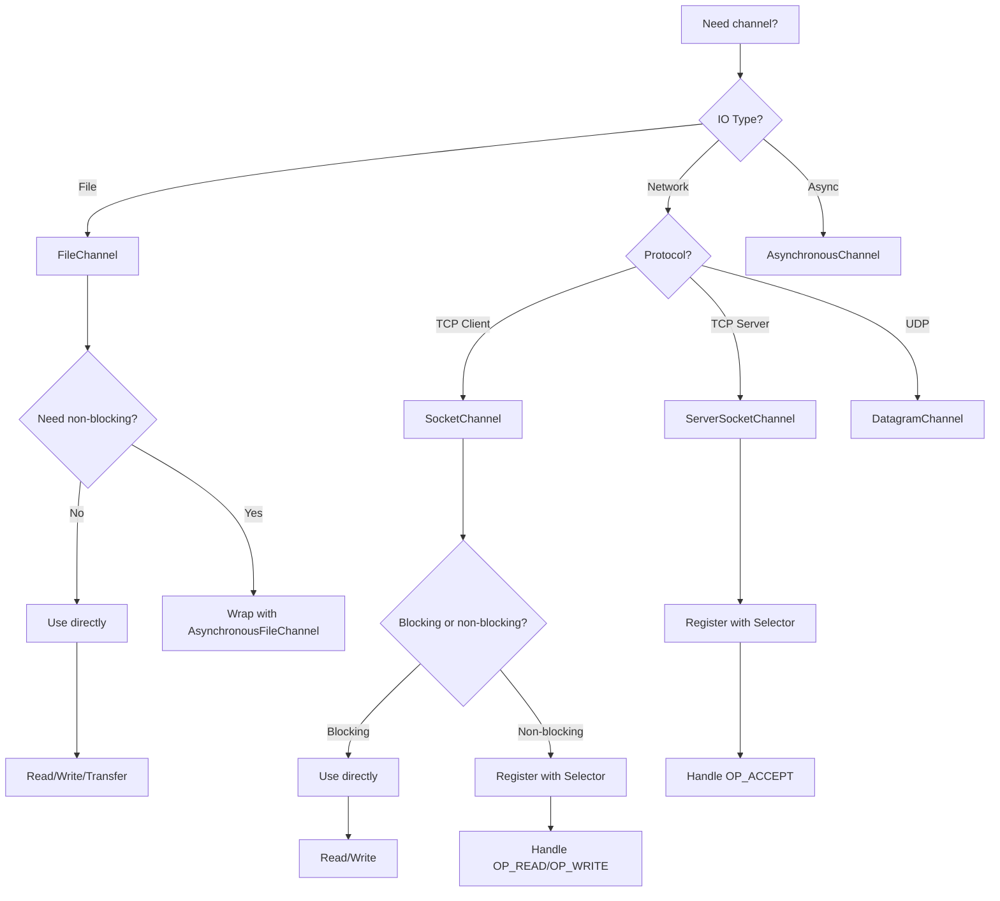

# 05 - NIO Channels (Part 3)

[📖 Back to Part 1](README.md) | [📖 Back to Part 2](README-part2.md)

---

|-----------|------|-------|
| `channel.read(buffer)` | O(n) | O(1) buffer |
| `channel.write(buffer)` | O(n) | O(1) buffer |
| `transferTo()` | O(n) | O(1) |
| `channel.map()` | O(1) | O(n) mapped |
| `channel.size()` | O(1) | O(1) |
| `channel.position()` | O(1) | O(1) |
| `channel.truncate()` | O(n) | O(1) |
| `channel.force()` | O(n) | O(1) |
| `Selector.select()` | O(1)-O(n) | O(1) |

## 19. Thread Safety

### Channel Thread Safety Rules

```java
// FileChannel: Thread-safe for most operations
FileChannel channel = FileChannel.open(path);
// Multiple threads can read concurrently
// Write operations should be synchronized

// SocketChannel: Not thread-safe
SocketChannel socket = SocketChannel.open();
// Use synchronization or process from single thread

// SelectableChannel: Thread-safe for registration
// But selected key processing should be single-threaded
```

### Thread Safety Guidelines

1. **FileChannel**: Thread-safe for reads, synchronize writes
2. **SocketChannel**: Not thread-safe, use single thread
3. **SelectableChannel**: Thread-safe for registration
4. **Selector**: Not thread-safe, process in single thread
5. **Use pools** for concurrent channel access
6. **Close channels** in finally blocks

## 20. Best Practices

1. **Always close channels** with try-with-resources
2. **Use zero-copy transfers** for large files
3. **Use direct buffers** for channel operations
4. **Handle partial reads/writes** with loops
5. **Use non-blocking channels** for high concurrency
6. **Monitor channel count** for resource leaks
7. **Use channel pools** for repeated operations
8. **Force flush** for critical data with `force(true)`

## 21. Common Mistakes

1. **Not closing channels** → Resource leaks
2. **Blocking in non-blocking mode** → Performance issues
3. **Using heap buffers with channels** → Extra copy
4. **Not handling short reads/writes** → Data loss
5. **Mixing blocking and non-blocking** → Unexpected behavior
6. **Not registering with Selector** → Non-blocking doesn't work
7. **Ignoring interrupted IO** → Thread interruption issues
8. **Not flushing critical data** → Data loss on crash

## 22. Pitfalls & Warnings

1. **Non-blocking channels need Selector** → Complexity
2. **Direct buffers are not GC'd immediately** → Memory pressure
3. **transferTo has size limits** → May need multiple calls
4. **Memory-mapped files can't extend** → Must recreate
5. **Socket channels may not close cleanly** → TIME_WAIT
6. **File locking is advisory** → Not enforced by OS
7. **Channel interop with streams** → Performance overhead

## 23. Debugging Tips

1. **Log channel state** (open, position, size)
2. **Check `lsof -p <pid>`** for open file descriptors
3. **Use `-XX:MaxDirectMemorySize`** to limit direct memory
4. **Monitor with JMX** (`BufferPoolMXBean`)
5. **Use `strace`** for system-level IO tracing
6. **Check selector key interests** for non-blocking issues
7. **Use Java Flight Recorder** for channel events

## 24. Comparison Table

| Feature | FileChannel | SocketChannel | ServerSocketChannel |
|---------|-------------|---------------|---------------------|
| Direction | Read/Write | Read/Write | Accept |
| Blocking | Yes | Configurable | Yes |
| Non-blocking | No | Yes | Yes |
| Scatter/Gather | Yes | Yes | No |
| Transfer | transferTo/From | No | No |
| Memory-map | Yes | No | No |
| Locking | Yes | No | No |
| Best For | File IO | Client network | Server network |

## 25. Decision Tree



## 26. Interview Questions

### Q1: What is the difference between Channel and Stream?
**Answer:** Channels are bidirectional and buffer-based, while streams are unidirectional and byte/char-based. Channels support scatter/gather, non-blocking IO, and zero-copy transfers. Streams are simpler but less efficient.

### Q2: What is zero-copy transfer?
**Answer:** Zero-copy transfer (`transferTo()`) moves data directly from file to socket without copying through user space. It uses OS-level optimization, reducing context switches and memory copies for better performance.

### Q3: What is a Selector used for?
**Answer:** A Selector monitors multiple channels for events (accept, connect, read, write) on a single thread. It enables non-blocking IO, allowing one thread to handle thousands of connections.

### Q4: What is scatter/gather IO?
**Answer:** Scatter read distributes incoming data across multiple buffers. Gather write combines data from multiple buffers into a single write operation. Useful for separating header and body data.

### Q5: What is memory-mapped IO?
**Answer:** Memory-mapped IO maps a file directly into memory, allowing random access without explicit reads/writes. It uses `FileChannel.map()` to create a `MappedByteBuffer` backed by the file.

### Q6: When should you use FileChannel vs FileInputStream?
**Answer:** Use FileChannel for efficient bulk transfers, zero-copy, memory mapping, and file locking. Use FileInputStream for simple byte-by-byte reading or when using stream decorators.

### Q7: What is the difference between `force(true)` and `force(false)`?
**Answer:** `force(true)` flushes both data and metadata to disk. `force(false)` flushes only data. Use `true` for critical metadata like file size changes.

### Q8: How do you handle short reads/writes?
**Answer:** Use loops that continue until all data is transferred: `while (buffer.hasRemaining()) { channel.write(buffer); }`. Check return values and buffer state.

### Q9: What is the maximum transfer size for `transferTo()`?
**Answer:** On some platforms, `transferTo()` has a maximum transfer size (e.g., 2GB on 32-bit). Use loops to transfer larger files in chunks.

### Q10: How do channels work with non-blocking mode?
**Answer:** Configure with `configureBlocking(false)`. Reads return immediately (may return 0). Register with Selector to be notified when channel is ready for IO.

### Q11: What is the difference between `SocketChannel.open()` and `SocketChannel.open(address)`?
**Answer:** `open()` creates an unconnected channel. `open(address)` creates and connects to the specified address. Use the first form for deferred connection.

### Q12: How do you multiplex multiple channels?
**Answer:** Register channels with a Selector using `channel.register(selector, operations)`. Call `selector.select()` to block until events occur. Process selected keys.

### Q13: What happens if you don't close a channel?
**Answer:** The underlying OS resource (file descriptor or socket) leaks. Eventually, the application runs out of file handles or sockets, causing IOExceptions.

### Q14: Can you use channels with try-with-resources?
**Answer:** Yes, channels implement `AutoCloseable`. Always use try-with-resources to ensure channels are closed properly.

### Q15: What is the difference between `read()` returning 0 and -1?
**Answer:** In blocking mode, 0 means no data available (shouldn't happen). -1 means end-of-stream (connection closed). In non-blocking mode, 0 means no data ready.

## 27. Exercises

### Level 1: Basic

1. **File Copy**: Copy a file using FileChannel with buffer-based read/write.

2. **Echo Client**: Create a SocketChannel client that sends a message and reads the response.

3. **Scatter Read**: Read a file into header and body buffers using scatter read.

### Level 2: Intermediate

4. **Zero-copy Transfer**: Implement file transfer using `transferTo()` and measure performance.

5. **Memory-mapped File**: Read and modify a file using memory-mapped buffers.

6. **Non-blocking Server**: Implement a simple non-blocking echo server using Selector.

### Level 3: Advanced

7. **Connection Pool**: Implement a FileChannel pool for concurrent file operations.

8. **Async File Processor**: Process multiple files concurrently using AsynchronousFileChannel.

9. **Chat Server**: Implement a multi-client chat server using SelectableChannel.

## 28. Summary

| Concept | Key Point |
|---------|-----------|
| Channel | Bidirectional, buffer-based IO |
| FileChannel | Efficient file operations |
| SocketChannel | TCP network communication |
| Non-blocking | Selector-based multiplexing |
| Zero-copy | transferTo/From for efficiency |
| Scatter/Gather | Multi-buffer operations |
| Memory-mapped | Random access file IO |

## 29. References

1. **Official Documentation**: [Java NIO Channels](https://docs.oracle.com/en/java/javase/21/docs/api/java/nio/channels/package-summary.html)
2. **Jenkov**: [Java NIO Channels](https://jenkov.com/tutorials/java-nio/channels.html)
3. **Books**:
   - "Java NIO" by Ron Hitchens
   - "Netty in Action" by Norman Maurer
4. **Related Topics**:
   - [04 - NIO Buffers](../04-nio-buffers/README.md)
   - [06 - File Locking](../../../../README.md)

---

**Next Topic**: [06 - File Locking](../../../../README.md)
