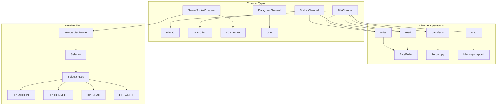
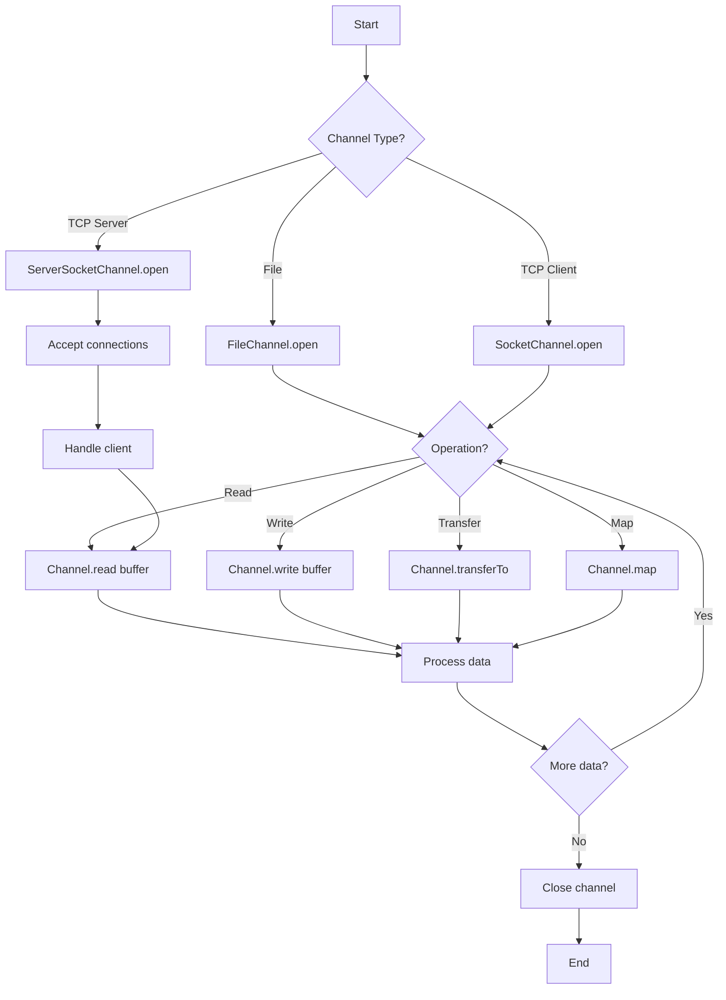

# 05 - NIO Channels

## 1. Introduction

NIO Channels are the primary abstraction for IO operations in Java NIO. Unlike traditional streams that are one-directional, channels are bidirectional—they can both read and write data. Channels work with buffers to transfer data between the application and IO sources/sinks. Java NIO provides channels for file operations (FileChannel), network communication (SocketChannel, ServerSocketChannel), and inter-process communication (DatagramChannel).

## 2. Learning Objectives

By the end of this topic, you will be able to:

- Understand channel architecture and types
- Use FileChannel for efficient file operations
- Implement network communication with SocketChannel
- Apply non-blocking IO with SelectableChannel
- Use scatter/gather operations
- Implement zero-copy file transfers
- Understand channel interopability with streams
- Apply channels in enterprise applications

## 3. Prerequisites

- Understanding of NIO Buffers (Topic 04)
- Basic knowledge of sockets and networking
- Familiarity with exception handling
- Understanding of threading concepts

## 4. Why This Concept Exists

Channels solve limitations of traditional streams:

| Problem | Solution |
|---------|----------|
| One-directional streams | Bidirectional channels |
| Blocking IO | Non-blocking selectable channels |
| Buffer-based transfers | Efficient bulk operations |
| Platform dependency | Abstracted channel API |
| No scatter/gather | Multi-buffer operations |

## 5. Problem Statement

Consider an application that needs to:
1. Transfer large files efficiently
2. Handle thousands of concurrent network connections
3. Perform non-blocking IO operations
4. Use zero-copy file transfers
5. Implement multiplexed network servers

Traditional streams can't handle these efficiently. Channels provide bidirectional, buffer-based, and optionally non-blocking IO.

## 6. Theory

### 6.1 Channel Types

| Channel Type | Protocol | Use Case |
|--------------|----------|----------|
| FileChannel | File IO | File read/write |
| SocketChannel | TCP | Client network IO |
| ServerSocketChannel | TCP | Server network IO |
| DatagramChannel | UDP | UDP network IO |
| AsynchronousFileChannel | File IO | Async file operations |
| AsynchronousSocketChannel | TCP | Async client IO |
| AsynchronousServerSocketChannel | TCP | Async server IO |

### 6.2 Channel vs Stream

| Feature | Channel | Stream |
|---------|---------|--------|
| Direction | Bidirectional | Unidirectional |
| Data transfer | Buffer-based | Byte/char-based |
| Blocking | Can be non-blocking | Always blocking |
| Scatter/Gather | Supported | Not supported |
| File locking | Supported | Not supported |
| Memory-mapping | Supported | Not supported |

### 6.3 Channel States

```
Channel Lifecycle:
├── OPEN: Channel is open and usable
├── OPEN → CLOSED: Channel is closed
└── REGISTERED: Channel registered with Selector (for non-blocking)
```

### 6.4 FileChannel Operations

```
FileChannel Operations:
├── read(ByteBuffer) - Read from channel to buffer
├── write(ByteBuffer) - Write from buffer to channel
├── read(ByteBuffer[], offset, length) - Scatter read
├── write(ByteBuffer[], offset, length) - Gather write
├── transferTo(position, count, target) - Zero-copy transfer
├── transferFrom(source, position, count) - Zero-copy transfer
├── map(mode, position, size) - Memory-mapped file
├── lock() / tryLock() - File locking
├── force(boolean) - Flush to disk
└── position() / size() / truncate() - File operations
```

## 7. Internal Working

### 7.1 FileChannel Data Flow

```
Application Buffer ←→ FileChannel ←→ OS Buffer ←→ File System

Read operation:
1. Application puts data in ByteBuffer
2. Channel reads from buffer
3. Data transferred to OS buffer
4. OS writes to file system

Write operation:
1. File system reads data
2. OS puts data in buffer
3. Channel writes to ByteBuffer
4. Application gets data from buffer
```

### 7.2 Non-blocking Channel Flow

```
SelectableChannel + Selector:
1. Register channel with selector
2. Selector monitors multiple channels
3. When channel is ready, selector notifies
4. Application processes ready channels
5. Single thread handles multiple connections
```

### 7.3 Zero-Copy Transfer

```
Traditional copy:
File → Kernel buffer → User buffer → Kernel buffer → Socket
(4 copies, 4 context switches)

Zero-copy (transferTo):
File → Kernel buffer → Socket
(2 copies, 2 context switches)
```

## 8. JVM Perspective

### 8.1 Memory Model

```
JVM Heap:
├── Channel object (small)
├── ByteBuffer objects (heap buffers)
└── Selector object (if using non-blocking)

Native Memory:
├── File descriptors
├── Socket buffers
├── Direct buffer memory (for direct buffers)
└── OS kernel buffers

FileChannel → FileDescriptor → OS file handle
SocketChannel → FileDescriptor → OS socket
```

### 8.2 Channel Lifecycle and GC

```
Channel lifecycle:
1. Open channel → OS resource allocated
2. Use channel → Data transferred
3. Close channel → OS resource released
4. If not closed → Resource leak

GC impact:
- Channel objects are small → Minor GC
- Direct buffers may delay GC → Use Cleaner
- File descriptors are OS resources → Must close
```

## 9. Memory Representation

### FileChannel Memory Layout

```
FileChannel.transferTo():
┌─────────────────────────────────────┐
│ Source File                         │
│ ┌─────────────────────────────────┐ │
│ │ File data (on disk)             │ │
│ └─────────────────────────────────┘ │
│         ↓ (zero-copy)              │
│ ┌─────────────────────────────────┐ │
│ │ OS page cache (kernel memory)   │ │
│ └─────────────────────────────────┘ │
│         ↓                          │
│ ┌─────────────────────────────────┐ │
│ │ Socket buffer (kernel memory)   │ │
│ └─────────────────────────────────┘ │
└─────────────────────────────────────┘
```

### SocketChannel Memory Layout

```
SocketChannel.write(ByteBuffer):
┌─────────────────────────────────────┐
│ JVM Heap                           │
│ ┌─────────────────────────────────┐ │
│ │ ByteBuffer: [data bytes]        │ │
│ └─────────────────────────────────┘ │
└───────────────┬─────────────────────┘
                ↓ (copy to kernel)
┌─────────────────────────────────────┐
│ OS Kernel                          │
│ ┌─────────────────────────────────┐ │
│ │ Socket send buffer              │ │
│ └─────────────────────────────────┘ │
└───────────────┬─────────────────────┘
                ↓ (network)
┌─────────────────────────────────────┐
│ Remote Host                        │
└─────────────────────────────────────┘
```

## 10. Architecture Diagram



## 11. Flow Diagram



## 12. Syntax

### 12.1 FileChannel Operations

```java
// Open file channel
FileChannel channel = FileChannel.open(
    Path.of("file.txt"),
    StandardOpenOption.READ,
    StandardOpenOption.WRITE
);

// Read from channel to buffer
ByteBuffer buffer = ByteBuffer.allocate(1024);
int bytesRead = channel.read(buffer);

// Write from buffer to channel
buffer.flip();
channel.write(buffer);

// Zero-copy transfer
channel.transferTo(0, channel.size(), targetChannel);

// Memory-mapped file
MappedByteBuffer mapped = channel.map(
    FileChannel.MapMode.READ_WRITE,
    0,
    channel.size()
);

// Force flush
channel.force(true);
```

### 12.2 SocketChannel Operations

```java
// Connect to server
SocketChannel socketChannel = SocketChannel.open();
socketChannel.connect(new InetSocketAddress("localhost", 8080));

// Read
ByteBuffer buffer = ByteBuffer.allocate(1024);
int bytesRead = socketChannel.read(buffer);

// Write
ByteBuffer writeBuffer = ByteBuffer.wrap("Hello".getBytes());
socketChannel.write(writeBuffer);

// Configure non-blocking
socketChannel.configureBlocking(false);

// Close
socketChannel.close();
```

### 12.3 ServerSocketChannel

```java
// Open server channel
ServerSocketChannel serverChannel = ServerSocketChannel.open();
serverChannel.bind(new InetSocketAddress(8080));
serverChannel.configureBlocking(false);

// Accept connections
SocketChannel clientChannel = serverChannel.accept();
```

### 12.4 Scatter/Gather

```java
// Scatter read (read into multiple buffers)
ByteBuffer header = ByteBuffer.allocate(16);
ByteBuffer body = ByteBuffer.allocate(1024);
ByteBuffer[] buffers = {header, body};
channel.read(buffers);

// Gather write (write from multiple buffers)
ByteBuffer header = ByteBuffer.wrap("Header".getBytes());
ByteBuffer body = ByteBuffer.wrap("Body content".getBytes());
ByteBuffer[] buffers = {header, body};
channel.write(buffers);
```

## 13. Easy Example

```java
import java.nio.*;
import java.nio.channels.*;
import java.nio.file.*;
import java.nio.charset.*;

public class FileChannelBasic {

    public static void main(String[] args) throws Exception {
        Path file = Path.of("test-channel.txt");

        // Write using FileChannel
        try (FileChannel channel = FileChannel.open(file,
                StandardOpenOption.CREATE,
                StandardOpenOption.WRITE)) {

            ByteBuffer buffer = ByteBuffer.wrap(
                "Hello, FileChannel!".getBytes(StandardCharsets.UTF_8));
            channel.write(buffer);
        }

        // Read using FileChannel
        try (FileChannel channel = FileChannel.open(file,
                StandardOpenOption.READ)) {

---

[📖 Continue to Part 2](README-part2.md)
