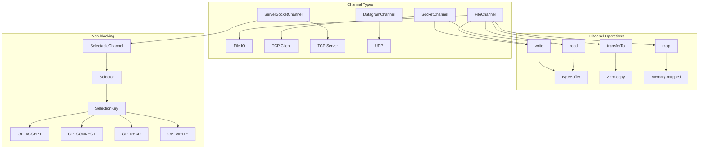
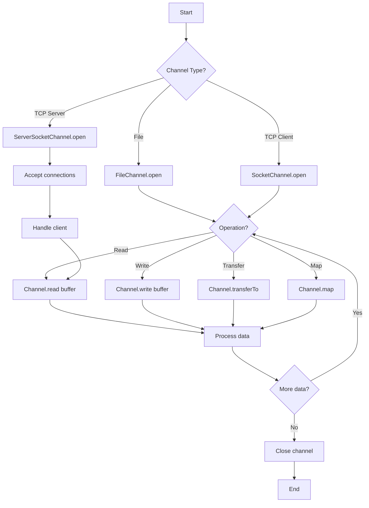
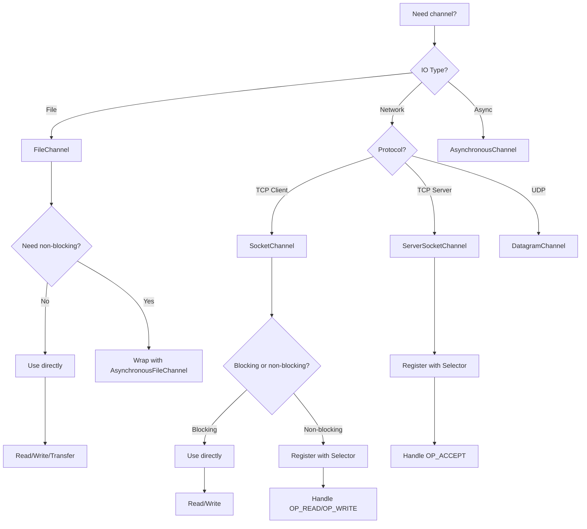

# 05 - NIO Channels

## 1. Introduction

NIO Channels are the primary abstraction for IO operations in Java NIO. Unlike traditional streams that are one-directional, channels are bidirectional—they can both read and write data. Channels work with buffers to transfer data between the application and IO sources/sinks. Java NIO provides channels for file operations (FileChannel), network communication (SocketChannel, ServerSocketChannel), and inter-process communication (DatagramChannel).

## 2. Learning Objectives

By the end of this topic, you will be able to:

- Understand channel architecture and types
- Use FileChannel for efficient file operations
- Implement network communication with SocketChannel
- Apply non-blocking IO with SelectableChannel
- Use scatter/gather operations
- Implement zero-copy file transfers
- Understand channel interopability with streams
- Apply channels in enterprise applications

## 3. Prerequisites

- Understanding of NIO Buffers (Topic 04)
- Basic knowledge of sockets and networking
- Familiarity with exception handling
- Understanding of threading concepts

## 4. Why This Concept Exists

Channels solve limitations of traditional streams:

| Problem | Solution |
|---------|----------|
| One-directional streams | Bidirectional channels |
| Blocking IO | Non-blocking selectable channels |
| Buffer-based transfers | Efficient bulk operations |
| Platform dependency | Abstracted channel API |
| No scatter/gather | Multi-buffer operations |

## 5. Problem Statement

Consider an application that needs to:
1. Transfer large files efficiently
2. Handle thousands of concurrent network connections
3. Perform non-blocking IO operations
4. Use zero-copy file transfers
5. Implement multiplexed network servers

Traditional streams can't handle these efficiently. Channels provide bidirectional, buffer-based, and optionally non-blocking IO.

## 6. Theory

### 6.1 Channel Types

| Channel Type | Protocol | Use Case |
|--------------|----------|----------|
| FileChannel | File IO | File read/write |
| SocketChannel | TCP | Client network IO |
| ServerSocketChannel | TCP | Server network IO |
| DatagramChannel | UDP | UDP network IO |
| AsynchronousFileChannel | File IO | Async file operations |
| AsynchronousSocketChannel | TCP | Async client IO |
| AsynchronousServerSocketChannel | TCP | Async server IO |

### 6.2 Channel vs Stream

| Feature | Channel | Stream |
|---------|---------|--------|
| Direction | Bidirectional | Unidirectional |
| Data transfer | Buffer-based | Byte/char-based |
| Blocking | Can be non-blocking | Always blocking |
| Scatter/Gather | Supported | Not supported |
| File locking | Supported | Not supported |
| Memory-mapping | Supported | Not supported |

### 6.3 Channel States

```
Channel Lifecycle:
├── OPEN: Channel is open and usable
├── OPEN → CLOSED: Channel is closed
└── REGISTERED: Channel registered with Selector (for non-blocking)
```

### 6.4 FileChannel Operations

```
FileChannel Operations:
├── read(ByteBuffer) - Read from channel to buffer
├── write(ByteBuffer) - Write from buffer to channel
├── read(ByteBuffer[], offset, length) - Scatter read
├── write(ByteBuffer[], offset, length) - Gather write
├── transferTo(position, count, target) - Zero-copy transfer
├── transferFrom(source, position, count) - Zero-copy transfer
├── map(mode, position, size) - Memory-mapped file
├── lock() / tryLock() - File locking
├── force(boolean) - Flush to disk
└── position() / size() / truncate() - File operations
```

## 7. Internal Working

### 7.1 FileChannel Data Flow

```
Application Buffer ←→ FileChannel ←→ OS Buffer ←→ File System

Read operation:
1. Application puts data in ByteBuffer
2. Channel reads from buffer
3. Data transferred to OS buffer
4. OS writes to file system

Write operation:
1. File system reads data
2. OS puts data in buffer
3. Channel writes to ByteBuffer
4. Application gets data from buffer
```

### 7.2 Non-blocking Channel Flow

```
SelectableChannel + Selector:
1. Register channel with selector
2. Selector monitors multiple channels
3. When channel is ready, selector notifies
4. Application processes ready channels
5. Single thread handles multiple connections
```

### 7.3 Zero-Copy Transfer

```
Traditional copy:
File → Kernel buffer → User buffer → Kernel buffer → Socket
(4 copies, 4 context switches)

Zero-copy (transferTo):
File → Kernel buffer → Socket
(2 copies, 2 context switches)
```

## 8. JVM Perspective

### 8.1 Memory Model

```
JVM Heap:
├── Channel object (small)
├── ByteBuffer objects (heap buffers)
└── Selector object (if using non-blocking)

Native Memory:
├── File descriptors
├── Socket buffers
├── Direct buffer memory (for direct buffers)
└── OS kernel buffers

FileChannel → FileDescriptor → OS file handle
SocketChannel → FileDescriptor → OS socket
```

### 8.2 Channel Lifecycle and GC

```
Channel lifecycle:
1. Open channel → OS resource allocated
2. Use channel → Data transferred
3. Close channel → OS resource released
4. If not closed → Resource leak

GC impact:
- Channel objects are small → Minor GC
- Direct buffers may delay GC → Use Cleaner
- File descriptors are OS resources → Must close
```

## 9. Memory Representation

### FileChannel Memory Layout

```
FileChannel.transferTo():
┌─────────────────────────────────────┐
│ Source File                         │
│ ┌─────────────────────────────────┐ │
│ │ File data (on disk)             │ │
│ └─────────────────────────────────┘ │
│         ↓ (zero-copy)              │
│ ┌─────────────────────────────────┐ │
│ │ OS page cache (kernel memory)   │ │
│ └─────────────────────────────────┘ │
│         ↓                          │
│ ┌─────────────────────────────────┐ │
│ │ Socket buffer (kernel memory)   │ │
│ └─────────────────────────────────┘ │
└─────────────────────────────────────┘
```

### SocketChannel Memory Layout

```
SocketChannel.write(ByteBuffer):
┌─────────────────────────────────────┐
│ JVM Heap                           │
│ ┌─────────────────────────────────┐ │
│ │ ByteBuffer: [data bytes]        │ │
│ └─────────────────────────────────┘ │
└───────────────┬─────────────────────┘
                ↓ (copy to kernel)
┌─────────────────────────────────────┐
│ OS Kernel                          │
│ ┌─────────────────────────────────┐ │
│ │ Socket send buffer              │ │
│ └─────────────────────────────────┘ │
└───────────────┬─────────────────────┘
                ↓ (network)
┌─────────────────────────────────────┐
│ Remote Host                        │
└─────────────────────────────────────┘
```

## 10. Architecture Diagram



## 11. Flow Diagram



## 12. Syntax

### 12.1 FileChannel Operations

```java
// Open file channel
FileChannel channel = FileChannel.open(
    Path.of("file.txt"),
    StandardOpenOption.READ,
    StandardOpenOption.WRITE
);

// Read from channel to buffer
ByteBuffer buffer = ByteBuffer.allocate(1024);
int bytesRead = channel.read(buffer);

// Write from buffer to channel
buffer.flip();
channel.write(buffer);

// Zero-copy transfer
channel.transferTo(0, channel.size(), targetChannel);

// Memory-mapped file
MappedByteBuffer mapped = channel.map(
    FileChannel.MapMode.READ_WRITE,
    0,
    channel.size()
);

// Force flush
channel.force(true);
```

### 12.2 SocketChannel Operations

```java
// Connect to server
SocketChannel socketChannel = SocketChannel.open();
socketChannel.connect(new InetSocketAddress("localhost", 8080));

// Read
ByteBuffer buffer = ByteBuffer.allocate(1024);
int bytesRead = socketChannel.read(buffer);

// Write
ByteBuffer writeBuffer = ByteBuffer.wrap("Hello".getBytes());
socketChannel.write(writeBuffer);

// Configure non-blocking
socketChannel.configureBlocking(false);

// Close
socketChannel.close();
```

### 12.3 ServerSocketChannel

```java
// Open server channel
ServerSocketChannel serverChannel = ServerSocketChannel.open();
serverChannel.bind(new InetSocketAddress(8080));
serverChannel.configureBlocking(false);

// Accept connections
SocketChannel clientChannel = serverChannel.accept();
```

### 12.4 Scatter/Gather

```java
// Scatter read (read into multiple buffers)
ByteBuffer header = ByteBuffer.allocate(16);
ByteBuffer body = ByteBuffer.allocate(1024);
ByteBuffer[] buffers = {header, body};
channel.read(buffers);

// Gather write (write from multiple buffers)
ByteBuffer header = ByteBuffer.wrap("Header".getBytes());
ByteBuffer body = ByteBuffer.wrap("Body content".getBytes());
ByteBuffer[] buffers = {header, body};
channel.write(buffers);
```

## 13. Easy Example

```java
import java.nio.*;
import java.nio.channels.*;
import java.nio.file.*;
import java.nio.charset.*;

public class FileChannelBasic {

    public static void main(String[] args) throws Exception {
        Path file = Path.of("test-channel.txt");

        // Write using FileChannel
        try (FileChannel channel = FileChannel.open(file,
                StandardOpenOption.CREATE,
                StandardOpenOption.WRITE)) {

            ByteBuffer buffer = ByteBuffer.wrap(
                "Hello, FileChannel!".getBytes(StandardCharsets.UTF_8));
            channel.write(buffer);
        }

        // Read using FileChannel
        try (FileChannel channel = FileChannel.open(file,
                StandardOpenOption.READ)) {

            ByteBuffer buffer = ByteBuffer.allocate(1024);
            channel.read(buffer);
            buffer.flip();

            String content = StandardCharsets.UTF_8.decode(buffer).toString();
            System.out.println("Read: " + content);
        }

        // Cleanup
        Files.deleteIfExists(file);
    }
}
```

**Output:**
```
Read: Hello, FileChannel!
```

## 14. Medium Example

```java
import java.nio.*;
import java.nio.channels.*;
import java.nio.file.*;
import java.nio.charset.*;

public class NioChannelsExample {

    // Zero-copy file transfer
    public static long transferFile(Path source, Path target)
            throws Exception {

        try (FileChannel srcChannel = FileChannel.open(source,
                StandardOpenOption.READ);
             FileChannel tgtChannel = FileChannel.open(target,
                StandardOpenOption.CREATE,
                StandardOpenOption.WRITE)) {

            return srcChannel.transferTo(0, srcChannel.size(), tgtChannel);
        }
    }

    // Scatter/Gather read
    public static void scatterRead(Path file) throws Exception {
        try (FileChannel channel = FileChannel.open(file,
                StandardOpenOption.READ)) {

            ByteBuffer header = ByteBuffer.allocate(16);
            ByteBuffer body = ByteBuffer.allocate(1024);
            ByteBuffer[] buffers = {header, body};

            long totalRead = channel.read(buffers);
            System.out.println("Total bytes read: " + totalRead);

            header.flip();
            body.flip();

            System.out.println("Header size: " + header.remaining());
            System.out.println("Body size: " + body.remaining());
        }
    }

    // Memory-mapped file
    public static void memoryMappedRead(Path file) throws Exception {
        try (FileChannel channel = FileChannel.open(file,
                StandardOpenOption.READ)) {

            MappedByteBuffer mapped = channel.map(
                FileChannel.MapMode.READ_ONLY,
                0,
                channel.size()
            );

            byte[] data = new byte[(int) channel.size()];
            mapped.get(data);
            System.out.println("Mapped content: " + new String(data));
        }
    }

    public static void main(String[] args) throws Exception {
        Path tempDir = Paths.get(System.getProperty("java.io.tmpdir"),
            "nio-channels-demo");
        Files.createDirectories(tempDir);

        // Create source file
        Path source = tempDir.resolve("source.txt");
        Files.writeString(source, "Hello, Zero Copy Transfer!");

        // Transfer file
        Path target = tempDir.resolve("target.txt");
        long transferred = transferFile(source, target);
        System.out.println("Transferred: " + transferred + " bytes");
        System.out.println("Content: " + Files.readString(target));

        // Scatter read
        System.out.println("\nScatter read:");
        scatterRead(source);

        // Memory-mapped read
        System.out.println("\nMemory-mapped read:");
        memoryMappedRead(source);

        // Cleanup
        Files.walk(tempDir)
            .sorted(java.util.Comparator.reverseOrder())
            .forEach(path -> {
                try { Files.deleteIfExists(path); }
                catch (Exception ignored) {}
            });
    }
}
```

## 15. Hard Example

```java
import java.nio.*;
import java.nio.channels.*;
import java.net.*;
import java.util.concurrent.*;

public class NioNetworkExample {

    // Non-blocking echo server
    static class EchoServer {
        private final Selector selector;
        private final ServerSocketChannel serverChannel;

        public EchoServer(int port) throws Exception {
            selector = Selector.open();
            serverChannel = ServerSocketChannel.open();
            serverChannel.bind(new InetSocketAddress(port));
            serverChannel.configureBlocking(false);
            serverChannel.register(selector, SelectionKey.OP_ACCEPT);
        }

        public void start() throws Exception {
            System.out.println("Echo server started on port " +
                serverChannel.socket().getLocalPort());

            while (true) {
                selector.select();
                var keys = selector.selectedKeys().iterator();

                while (keys.hasNext()) {
                    SelectionKey key = keys.next();
                    keys.remove();

                    if (key.isAcceptable()) {
                        handleAccept(key);
                    } else if (key.isReadable()) {
                        handleRead(key);
                    }
                }
            }
        }

        private void handleAccept(SelectionKey key) throws Exception {
            ServerSocketChannel server = (ServerSocketChannel) key.channel();
            SocketChannel client = server.accept();
            client.configureBlocking(false);
            client.register(selector, SelectionKey.OP_READ);
            System.out.println("Accepted: " + client.getRemoteAddress());
        }

        private void handleRead(SelectionKey key) throws Exception {
            SocketChannel client = (SocketChannel) key.channel();
            ByteBuffer buffer = ByteBuffer.allocate(1024);

            int bytesRead = client.read(buffer);
            if (bytesRead == -1) {
                client.close();
                return;
            }

            buffer.flip();
            client.write(buffer);
        }

        public void stop() throws Exception {
            serverChannel.close();
            selector.close();
        }
    }

    // Client for testing
    static class EchoClient {
        public static void sendMessage(String host, int port, String message)
                throws Exception {

            try (SocketChannel client = SocketChannel.open(
                    new InetSocketAddress(host, port))) {

                ByteBuffer writeBuffer = ByteBuffer.wrap(
                    message.getBytes());
                client.write(writeBuffer);

                ByteBuffer readBuffer = ByteBuffer.allocate(1024);
                client.read(readBuffer);
                readBuffer.flip();

                String response = new String(readBuffer.array(),
                    0, readBuffer.remaining());
                System.out.println("Response: " + response);
            }
        }
    }

    public static void main(String[] args) throws Exception {
        int port = 9999;

        // Start server in background
        EchoServer server = new EchoServer(port);
        Thread serverThread = new Thread(() -> {
            try { server.start(); }
            catch (Exception e) { e.printStackTrace(); }
        });
        serverThread.setDaemon(true);
        serverThread.start();

        Thread.sleep(1000); // Wait for server to start

        // Test client
        EchoClient.sendMessage("localhost", port, "Hello, NIO!");

        server.stop();
    }
}
```

## 16. Enterprise Example

```java
import java.nio.*;
import java.nio.channels.*;
import java.nio.file.*;
import java.util.concurrent.*;
import java.util.concurrent.atomic.*;

public class EnterpriseChannelExample {

    // Connection pool for file channels
    static class FileChannelPool {
        private final BlockingQueue<FileChannel> pool;
        private final Path directory;
        private final AtomicInteger totalAcquired = new AtomicInteger(0);

        public FileChannelPool(Path directory, int poolSize)
                throws Exception {

            this.directory = directory;
            this.pool = new LinkedBlockingQueue<>();

            for (int i = 0; i < poolSize; i++) {
                Path file = directory.resolve("pool-" + i + ".dat");
                FileChannel channel = FileChannel.open(file,
                    StandardOpenOption.CREATE,
                    StandardOpenOption.READ,
                    StandardOpenOption.WRITE);
                pool.offer(channel);
            }
        }

        public FileChannel acquire() throws InterruptedException {
            totalAcquired.incrementAndGet();
            return pool.take();
        }

        public void release(FileChannel channel) {
            pool.offer(channel);
        }

        public void closeAll() throws Exception {
            for (FileChannel ch : pool) {
                ch.close();
            }
        }

        public int getPoolSize() { return pool.size(); }
        public int getTotalAcquired() { return totalAcquired.get(); }
    }

    // Async file processor
    static class AsyncFileProcessor {
        private final ExecutorService executor;
        private final AtomicInteger processed = new AtomicInteger(0);

        public AsyncFileProcessor(int threadCount) {
            this.executor = Executors.newFixedThreadPool(threadCount);
        }

        public CompletableFuture<Long> processFile(Path file) {
            return CompletableFuture.supplyAsync(() -> {
                try (FileChannel channel = FileChannel.open(file,
                        StandardOpenOption.READ)) {

                    ByteBuffer buffer = ByteBuffer.allocate(8192);
                    long totalBytes = 0;

                    while (channel.read(buffer) > 0) {
                        totalBytes += buffer.position();
                        buffer.clear();
                    }

                    processed.incrementAndGet();
                    return totalBytes;
                } catch (Exception e) {
                    throw new CompletionException(e);
                }
            }, executor);
        }

        public int getProcessedCount() { return processed.get(); }

        public void shutdown() {
            executor.shutdown();
        }
    }

    public static void main(String[] args) throws Exception {
        Path tempDir = Paths.get(System.getProperty("java.io.tmpdir"),
            "channel-pool-demo");
        Files.createDirectories(tempDir);

        // Create test files
        for (int i = 0; i < 5; i++) {
            Files.writeString(tempDir.resolve("file-" + i + ".txt"),
                "Content of file " + i + "\n".repeat(100));
        }

        // File channel pool
        FileChannelPool pool = new FileChannelPool(tempDir, 3);
        System.out.println("Pool size: " + pool.getPoolSize());

        FileChannel ch1 = pool.acquire();
        FileChannel ch2 = pool.acquire();
        System.out.println("Acquired 2, available: " + pool.getPoolSize());

        pool.release(ch1);
        pool.release(ch2);
        System.out.println("Released 2, available: " + pool.getPoolSize());

        // Async file processor
        AsyncFileProcessor processor = new AsyncFileProcessor(4);
        long startTime = System.currentTimeMillis();

        var futures = java.nio.file.Files.list(tempDir)
            .filter(Files::isRegularFile)
            .map(processor::processFile)
            .toList();

        CompletableFuture.allOf(
            futures.toArray(CompletableFuture[]::new))
            .join();

        long totalTime = System.currentTimeMillis() - startTime;
        System.out.println("\nProcessed " + processor.getProcessedCount()
            + " files in " + totalTime + "ms");

        // Cleanup
        pool.closeAll();
        processor.shutdown();
        Files.walk(tempDir)
            .sorted(java.util.Comparator.reverseOrder())
            .forEach(path -> {
                try { Files.deleteIfExists(path); }
                catch (Exception ignored) {}
            });
    }
}
```

## 17. Performance Considerations

### Channel Operation Performance

| Operation | Throughput | Latency | Best Use |
|-----------|------------|---------|----------|
| FileChannel.read/write | High | Low | Sequential file IO |
| transferTo (zero-copy) | Very High | Very Low | File-to-file/socket |
| Memory-mapped | Very High | Low | Random access |
| SocketChannel | Medium | Medium | Network IO |
| Non-blocking (Selector) | High | Low | Many connections |

### Performance Tips

1. **Use zero-copy transfer** for file-to-file and file-to-socket
2. **Use memory-mapped files** for random access patterns
3. **Use direct buffers** with channels for better performance
4. **Use non-blocking channels** for thousands of connections
5. **Use scatter/gather** for multi-buffer operations
6. **Close channels promptly** to free OS resources
7. **Use channel pools** for repeated operations
8. **Monitor channel count** with `lsof` or JMX

## 18. Time & Space Complexity

| Operation | Time | Space |
|-----------|------|-------|
| `channel.read(buffer)` | O(n) | O(1) buffer |
| `channel.write(buffer)` | O(n) | O(1) buffer |
| `transferTo()` | O(n) | O(1) |
| `channel.map()` | O(1) | O(n) mapped |
| `channel.size()` | O(1) | O(1) |
| `channel.position()` | O(1) | O(1) |
| `channel.truncate()` | O(n) | O(1) |
| `channel.force()` | O(n) | O(1) |
| `Selector.select()` | O(1)-O(n) | O(1) |

## 19. Thread Safety

### Channel Thread Safety Rules

```java
// FileChannel: Thread-safe for most operations
FileChannel channel = FileChannel.open(path);
// Multiple threads can read concurrently
// Write operations should be synchronized

// SocketChannel: Not thread-safe
SocketChannel socket = SocketChannel.open();
// Use synchronization or process from single thread

// SelectableChannel: Thread-safe for registration
// But selected key processing should be single-threaded
```

### Thread Safety Guidelines

1. **FileChannel**: Thread-safe for reads, synchronize writes
2. **SocketChannel**: Not thread-safe, use single thread
3. **SelectableChannel**: Thread-safe for registration
4. **Selector**: Not thread-safe, process in single thread
5. **Use pools** for concurrent channel access
6. **Close channels** in finally blocks

## 20. Best Practices

1. **Always close channels** with try-with-resources
2. **Use zero-copy transfers** for large files
3. **Use direct buffers** for channel operations
4. **Handle partial reads/writes** with loops
5. **Use non-blocking channels** for high concurrency
6. **Monitor channel count** for resource leaks
7. **Use channel pools** for repeated operations
8. **Force flush** for critical data with `force(true)`

## 21. Common Mistakes

1. **Not closing channels** → Resource leaks
2. **Blocking in non-blocking mode** → Performance issues
3. **Using heap buffers with channels** → Extra copy
4. **Not handling short reads/writes** → Data loss
5. **Mixing blocking and non-blocking** → Unexpected behavior
6. **Not registering with Selector** → Non-blocking doesn't work
7. **Ignoring interrupted IO** → Thread interruption issues
8. **Not flushing critical data** → Data loss on crash

## 22. Pitfalls & Warnings

1. **Non-blocking channels need Selector** → Complexity
2. **Direct buffers are not GC'd immediately** → Memory pressure
3. **transferTo has size limits** → May need multiple calls
4. **Memory-mapped files can't extend** → Must recreate
5. **Socket channels may not close cleanly** → TIME_WAIT
6. **File locking is advisory** → Not enforced by OS
7. **Channel interop with streams** → Performance overhead

## 23. Debugging Tips

1. **Log channel state** (open, position, size)
2. **Check `lsof -p <pid>`** for open file descriptors
3. **Use `-XX:MaxDirectMemorySize`** to limit direct memory
4. **Monitor with JMX** (`BufferPoolMXBean`)
5. **Use `strace`** for system-level IO tracing
6. **Check selector key interests** for non-blocking issues
7. **Use Java Flight Recorder** for channel events

## 24. Comparison Table

| Feature | FileChannel | SocketChannel | ServerSocketChannel |
|---------|-------------|---------------|---------------------|
| Direction | Read/Write | Read/Write | Accept |
| Blocking | Yes | Configurable | Yes |
| Non-blocking | No | Yes | Yes |
| Scatter/Gather | Yes | Yes | No |
| Transfer | transferTo/From | No | No |
| Memory-map | Yes | No | No |
| Locking | Yes | No | No |
| Best For | File IO | Client network | Server network |

## 25. Decision Tree



## 26. Interview Questions

### Q1: What is the difference between Channel and Stream?
**Answer:** Channels are bidirectional and buffer-based, while streams are unidirectional and byte/char-based. Channels support scatter/gather, non-blocking IO, and zero-copy transfers. Streams are simpler but less efficient.

### Q2: What is zero-copy transfer?
**Answer:** Zero-copy transfer (`transferTo()`) moves data directly from file to socket without copying through user space. It uses OS-level optimization, reducing context switches and memory copies for better performance.

### Q3: What is a Selector used for?
**Answer:** A Selector monitors multiple channels for events (accept, connect, read, write) on a single thread. It enables non-blocking IO, allowing one thread to handle thousands of connections.

### Q4: What is scatter/gather IO?
**Answer:** Scatter read distributes incoming data across multiple buffers. Gather write combines data from multiple buffers into a single write operation. Useful for separating header and body data.

### Q5: What is memory-mapped IO?
**Answer:** Memory-mapped IO maps a file directly into memory, allowing random access without explicit reads/writes. It uses `FileChannel.map()` to create a `MappedByteBuffer` backed by the file.

### Q6: When should you use FileChannel vs FileInputStream?
**Answer:** Use FileChannel for efficient bulk transfers, zero-copy, memory mapping, and file locking. Use FileInputStream for simple byte-by-byte reading or when using stream decorators.

### Q7: What is the difference between `force(true)` and `force(false)`?
**Answer:** `force(true)` flushes both data and metadata to disk. `force(false)` flushes only data. Use `true` for critical metadata like file size changes.

### Q8: How do you handle short reads/writes?
**Answer:** Use loops that continue until all data is transferred: `while (buffer.hasRemaining()) { channel.write(buffer); }`. Check return values and buffer state.

### Q9: What is the maximum transfer size for `transferTo()`?
**Answer:** On some platforms, `transferTo()` has a maximum transfer size (e.g., 2GB on 32-bit). Use loops to transfer larger files in chunks.

### Q10: How do channels work with non-blocking mode?
**Answer:** Configure with `configureBlocking(false)`. Reads return immediately (may return 0). Register with Selector to be notified when channel is ready for IO.

### Q11: What is the difference between `SocketChannel.open()` and `SocketChannel.open(address)`?
**Answer:** `open()` creates an unconnected channel. `open(address)` creates and connects to the specified address. Use the first form for deferred connection.

### Q12: How do you multiplex multiple channels?
**Answer:** Register channels with a Selector using `channel.register(selector, operations)`. Call `selector.select()` to block until events occur. Process selected keys.

### Q13: What happens if you don't close a channel?
**Answer:** The underlying OS resource (file descriptor or socket) leaks. Eventually, the application runs out of file handles or sockets, causing IOExceptions.

### Q14: Can you use channels with try-with-resources?
**Answer:** Yes, channels implement `AutoCloseable`. Always use try-with-resources to ensure channels are closed properly.

### Q15: What is the difference between `read()` returning 0 and -1?
**Answer:** In blocking mode, 0 means no data available (shouldn't happen). -1 means end-of-stream (connection closed). In non-blocking mode, 0 means no data ready.

## 27. Exercises

### Level 1: Basic

1. **File Copy**: Copy a file using FileChannel with buffer-based read/write.

2. **Echo Client**: Create a SocketChannel client that sends a message and reads the response.

3. **Scatter Read**: Read a file into header and body buffers using scatter read.

### Level 2: Intermediate

4. **Zero-copy Transfer**: Implement file transfer using `transferTo()` and measure performance.

5. **Memory-mapped File**: Read and modify a file using memory-mapped buffers.

6. **Non-blocking Server**: Implement a simple non-blocking echo server using Selector.

### Level 3: Advanced

7. **Connection Pool**: Implement a FileChannel pool for concurrent file operations.

8. **Async File Processor**: Process multiple files concurrently using AsynchronousFileChannel.

9. **Chat Server**: Implement a multi-client chat server using SelectableChannel.

## 28. Summary

| Concept | Key Point |
|---------|-----------|
| Channel | Bidirectional, buffer-based IO |
| FileChannel | Efficient file operations |
| SocketChannel | TCP network communication |
| Non-blocking | Selector-based multiplexing |
| Zero-copy | transferTo/From for efficiency |
| Scatter/Gather | Multi-buffer operations |
| Memory-mapped | Random access file IO |

## 29. References

1. **Official Documentation**: [Java NIO Channels](https://docs.oracle.com/en/java/javase/21/docs/api/java/nio/channels/package-summary.html)
2. **Jenkov**: [Java NIO Channels](https://jenkov.com/tutorials/java-nio/channels.html)
3. **Books**:
   - "Java NIO" by Ron Hitchens
   - "Netty in Action" by Norman Maurer
4. **Related Topics**:
   - [04 - NIO Buffers](../04-nio-buffers/README.md)
   - [06 - File Locking](../06-file-locking/README.md)

---

**Next Topic**: [06 - File Locking](../06-file-locking/README.md)
