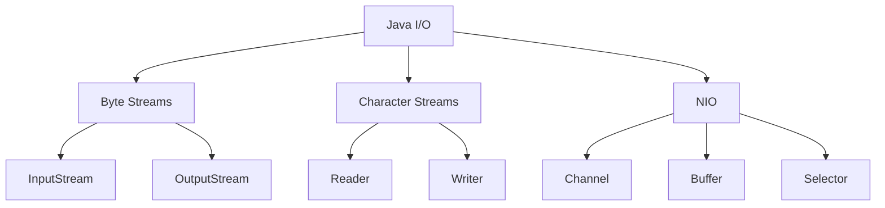

# Module 06: Java I/O and NIO

> **Difficulty:** ⭐⭐⭐ Intermediate  
> **Reading:** 30 min | **Practice:** 45 min | **Total:** 75 min

## Overview
Java I/O provides classes for reading and writing data through streams, readers, and writers. NIO (New I/O) adds channels, buffers, and selectors for non-blocking I/O operations.

## Learning Objectives
- Master stream-based I/O
- Understand byte and character streams
- Use NIO channels and buffers
- Implement file operations
- Handle serialization

## Prerequisites
- Basic Java knowledge
- Exception handling
- File system concepts

## History
- **1995** — Java 1.0 introduced stream-based I/O (`InputStream`, `OutputStream`)
- **1998** — Java 1.2 added `Reader`/`Writer` for character streams
- **2001** — Java 1.4 introduced NIO (`ByteBuffer`, `Channel`, `Selector`)
- **2004** — Java 5 added `File` convenience methods and `Scanner`
- **2011** — Java 7 introduced NIO.2 (`Path`, `Files`, `FileVisitor`) and try-with-resources
- **2014** — Java 8 added `Files.lines()`, `Files.list()`, `Files.walk()` returning streams
- **2017** — Java 9 added `InputStream.transferTo()`, `Files.readString()`, `Files.writeString()`
- **2021** — Java 17 added `Files.mismatch()`

## Why This Concept Exists
File and network operations require:
- Data reading/writing
- Stream processing
- Buffer management
- Resource handling

I/O provides:
- Stream abstraction
- Buffer management
- Character encoding
- Resource management

## Problem Statement
How do you efficiently read, write, and transfer data in Java?

## Core Concepts

### I/O Types

| Type | Description | Use Case |
|------|-------------|----------|
| Byte Stream | Raw bytes | Binary files |
| Character Stream | Characters | Text files |
| Buffered | Performance | Large files |
| NIO Channels | Non-blocking | Network I/O |

### Stream Classes

| Byte Stream | Character Stream |
|-------------|------------------|
| InputStream | Reader |
| OutputStream | Writer |
| FileInputStream | FileReader |
| FileOutputStream | FileWriter |
| BufferedInputStream | BufferedReader |
| BufferedOutputStream | BufferedWriter |

### NIO Components

| Component | Purpose |
|-----------|---------|
| Channel | I/O connection |
| Buffer | Data container |
| Selector | Multiplexer |

## Internal Working

### Stream Processing
```
Source → Buffer → Process → Buffer → Destination
```

### Buffer Operations
```
Write: clear → put → flip
Read: flip → get → clear
```

## JVM Perspective

### Resource Management
- File descriptors are limited
- Streams must be closed
- Try-with-resources ensures cleanup
- NIO channels are non-blocking

### Memory Mapping
- MappedByteBuffer for large files
- OS manages memory
- Faster than stream I/O

## Architecture Diagram



## Syntax

### Byte Streams
```java
// FileInputStream
try (FileInputStream fis = new FileInputStream("file.txt")) {
    byte[] buffer = new byte[1024];
    int bytesRead;
    while ((bytesRead = fis.read(buffer)) != -1) {
        // Process bytes
    }
}

// FileOutputStream
try (FileOutputStream fos = new FileOutputStream("file.txt")) {
    fos.write("Hello".getBytes());
}
```

### Character Streams
```java
// BufferedReader
try (BufferedReader br = new BufferedReader(new FileReader("file.txt"))) {
    String line;
    while ((line = br.readLine()) != null) {
        System.out.println(line);
    }
}

// BufferedWriter
try (BufferedWriter bw = new BufferedWriter(new FileWriter("file.txt"))) {
    bw.write("Hello");
    bw.newLine();
}
```

### NIO
```java
// FileChannel
try (FileChannel channel = FileChannel.open(Path.of("file.txt"), 
        StandardOpenOption.READ)) {
    ByteBuffer buffer = ByteBuffer.allocate(1024);
    channel.read(buffer);
}

// Path
Path path = Path.of("file.txt");
Files.readString(path);
Files.writeString(path, "Hello");
Files.copy(source, target);
```

## Easy Example
```java
import java.nio.file.*;
import java.io.*;

public class EasyExample {
    public static void main(String[] args) throws IOException {
        // Write file
        Files.writeString(Path.of("test.txt"), "Hello World");
        
        // Read file
        String content = Files.readString(Path.of("test.txt"));
        System.out.println(content);
        
        // Copy file
        Files.copy(Path.of("test.txt"), Path.of("copy.txt"));
    }
}
```

## Medium Example
```java
import java.io.*;
import java.nio.file.*;

public class MediumExample {
    // Process file line by line
    public static long countLines(String filename) throws IOException {
        try (Stream<String> lines = Files.lines(Path.of(filename))) {
            return lines.count();
        }
    }
    
    // Copy directory
    public static void copyDir(Path source, Path target) throws IOException {
        Files.walk(source).forEach(path -> {
            try {
                Path dest = target.resolve(source.relativize(path));
                if (Files.isDirectory(path)) {
                    Files.createDirectories(dest);
                } else {
                    Files.copy(path, dest);
                }
            } catch (IOException e) {
                e.printStackTrace();
            }
        });
    }
    
    public static void main(String[] args) throws IOException {
        long lines = countLines("test.txt");
        System.out.println("Lines: " + lines);
    }
}
```

## Hard Example
```java
import java.nio.*;
import java.nio.channels.*;
import java.nio.file.*;

public class HardExample {
    // Memory-mapped file
    public static String readMapped(String filename) throws IOException {
        try (FileChannel channel = FileChannel.open(Path.of(filename), 
                StandardOpenOption.READ)) {
            MappedByteBuffer buffer = channel.map(
                FileChannel.MapMode.READ_ONLY, 0, channel.size());
            
            StringBuilder sb = new StringBuilder();
            while (buffer.hasRemaining()) {
                sb.append((char) buffer.get());
            }
            return sb.toString();
        }
    }
    
    // Async file operations
    public static void main(String[] args) throws Exception {
        String content = readMapped("large-file.txt");
        System.out.println("Read " + content.length() + " characters");
    }
}
```

## Enterprise Example
```java
import java.io.*;
import java.nio.file.*;
import java.util.concurrent.*;
import java.util.stream.*;

public class EnterpriseExample {
    // Parallel file processing
    public static void processFiles(Path dir) throws IOException {
        try (Stream<Path> files = Files.walk(dir)) {
            files.parallel()
                .filter(Files::isRegularFile)
                .filter(p -> p.toString().endsWith(".java"))
                .forEach(p -> {
                    try {
                        long lines = Files.lines(p).count();
                        System.out.println(p.getFileName() + ": " + lines + " lines");
                    } catch (IOException e) {
                        e.printStackTrace();
                    }
                });
        }
    }
    
    public static void main(String[] args) throws IOException {
        processFiles(Path.of("."));
    }
}
```

## Performance Considerations
- Use buffered streams for large files
- NIO is faster for large files
- Memory mapping for very large files
- Try-with-resources for cleanup

## Time & Space Complexity

| Operation | Time | Space |
|-----------|------|-------|
| Read file | O(n) | O(buffer) |
| Write file | O(n) | O(1) |
| Copy | O(n) | O(buffer) |
| Line count | O(n) | O(1) |

## Thread Safety
- Streams are not thread-safe
- Files can be shared read-only
- Use synchronization for writes
- NIO channels are thread-safe

## Best Practices
1. Use try-with-resources
2. Use NIO.2 for modern code
3. Buffer large operations
4. Handle exceptions properly
5. Use appropriate stream type

## Common Mistakes
1. Not closing streams
2. Using wrong encoding
3. Not buffering large files
4. Ignoring exceptions

## Comparison Table

| Feature | I/O Streams | NIO |
|---------|-------------|-----|
| Blocking | Yes | No |
| Buffer | Manual | Built-in |
| Channels | No | Yes |
| Performance | Good | Better |

## Interview Questions

### Q1: What is the difference between InputStream and Reader?
**Answer:** InputStream handles bytes, Reader handles characters.

### Q2: What is try-with-resources?
**Answer:** Auto-closes resources implementing AutoCloseable.

### Q3: What is the difference between File and Path?
**Answer:** Path is modern NIO.2, File is legacy.

### Q4: What is buffering?
**Answer:** Storing data in memory to reduce I/O operations.

### Q5: What is NIO?
**Answer:** New I/O with channels, buffers, and selectors.

## Summary
Java I/O and NIO provide comprehensive data handling capabilities. Use NIO for modern applications.

## Cross-References

- **Previous Module:** [07 - Functional Programming](../07-functional-programming/)
- **Next Module:** [09 - Multithreading](../09-multithreading/)
- **Related:** [05 - Text Processing](../05-text-processing/) — character encoding and text manipulation
- **Related:** [10 - JVM Internals](../10-jvm-internals/) — file descriptors, memory mapping
- **Related:** [09 - Multithreading](../09-multithreading/) — async I/O and NIO selectors
- **External:** [Oracle Java I/O Tutorial](https://docs.oracle.com/javase/tutorial/essential/io/)
- **External:** [Java NIO Tutorial - Baeldung](https://www.baeldung.com/java-nio)

## Prerequisites

- [Fundamentals](../01-fundamentals/README.md)

## Related Topics

- [Multithreading](../09-multithreading/README.md)

## Next

- [Multithreading](../09-multithreading/README.md)
