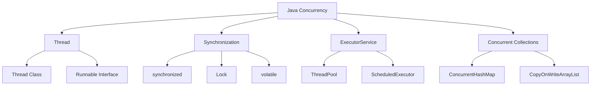

# Module 08: Multithreading

## Overview
Java multithreading enables concurrent execution of multiple threads. It includes thread creation, synchronization, concurrency utilities, and the java.util.concurrent package.

## Learning Objectives
- Create and manage threads
- Understand synchronization
- Use concurrency utilities
- Implement thread pools
- Handle concurrent data structures

## Prerequisites
- OOP concepts
- Exception handling
- Basic JVM knowledge

## Why This Concept Exists
Single-threaded applications:
- Can't utilize multiple CPUs
- Block on I/O
- Poor responsiveness

Multithreading provides:
- Parallel execution
- Better responsiveness
- Resource utilization
- Asynchronous processing

## Problem Statement
How do you execute multiple tasks concurrently while managing shared resources?

## Theory

### Thread States

| State | Description |
|-------|-------------|
| NEW | Created but not started |
| RUNNABLE | Executing or ready |
| BLOCKED | Waiting for lock |
| WAITING | Waiting indefinitely |
| TIMED_WAITING | Waiting with timeout |
| TERMINATED | Completed |

### Synchronization Mechanisms

| Mechanism | Description |
|-----------|-------------|
| synchronized | Method/block locking |
| volatile | Visibility guarantee |
| Lock | Explicit locking |
| Semaphore | Permit-based |
| CountDownLatch | One-time barrier |
| CyclicBarrier | Reusable barrier |

## Internal Working

### Thread Creation
```
Thread.start() → JVM creates OS thread → run() executes
```

### Monitor Lock
```
Object: [Monitor Lock] [Entry Queue] [Wait Queue]
  ↓
Thread A: [Holds Lock] → executes
Thread B: [Waits in Entry Queue]
Thread C: [Waits in Wait Queue]
```

## JVM Perspective

### Thread Implementation
- 1:1 mapping to OS threads
- Thread stack (default 512KB-1MB)
- Thread-local storage
- Context switching cost

### Memory Model
- Happens-before relationship
- Memory visibility
- Atomic operations
- volatile semantics

## Architecture Diagram



## Syntax

### Thread Creation
```java
// Extending Thread
class MyThread extends Thread {
    @Override
    public void run() {
        System.out.println("Thread running");
    }
}

// Implementing Runnable
class MyRunnable implements Runnable {
    @Override
    public void run() {
        System.out.println("Runnable running");
    }
}

// Lambda
Thread t = new Thread(() -> System.out.println("Lambda thread"));
t.start();
```

### Synchronization
```java
// Synchronized method
public synchronized void increment() {
    count++;
}

// Synchronized block
public void update() {
    synchronized (this) {
        count++;
    }
}

// Volatile
private volatile boolean running = true;
```

### ExecutorService
```java
// Thread pool
ExecutorService executor = Executors.newFixedThreadPool(4);
executor.submit(() -> System.out.println("Task 1"));
executor.submit(() -> System.out.println("Task 2"));
executor.shutdown();

// CompletableFuture
CompletableFuture<String> future = CompletableFuture
    .supplyAsync(() -> "Hello")
    .thenApply(s -> s + " World");
System.out.println(future.get());
```

## Easy Example
```java
public class EasyExample {
    public static void main(String[] args) throws InterruptedException {
        Thread t = new Thread(() -> {
            for (int i = 0; i < 5; i++) {
                System.out.println("Thread: " + i);
                try {
                    Thread.sleep(100);
                } catch (InterruptedException e) {
                    Thread.currentThread().interrupt();
                }
            }
        });
        
        t.start();
        t.join(); // Wait for thread to finish
        System.out.println("Main thread finished");
    }
}
```

## Medium Example
```java
import java.util.concurrent.*;

public class MediumExample {
    private static int counter = 0;
    private static final Object lock = new Object();
    
    public static void main(String[] args) throws Exception {
        ExecutorService executor = Executors.newFixedThreadPool(10);
        CountDownLatch latch = new CountDownLatch(100);
        
        for (int i = 0; i < 100; i++) {
            executor.submit(() -> {
                synchronized (lock) {
                    counter++;
                }
                latch.countDown();
            });
        }
        
        latch.await();
        System.out.println("Counter: " + counter);
        executor.shutdown();
    }
}
```

## Hard Example
```java
import java.util.concurrent.*;
import java.util.concurrent.atomic.*;

public class HardExample {
    // ReadWriteLock
    private static final ReadWriteLock rwLock = new ReentrantReadWriteLock();
    private static final Map<String, String> cache = new HashMap<>();
    
    public static String get(String key) {
        rwLock.readLock().lock();
        try {
            return cache.get(key);
        } finally {
            rwLock.readLock().unlock();
        }
    }
    
    public static void put(String key, String value) {
        rwLock.writeLock().lock();
        try {
            cache.put(key, value);
        } finally {
            rwLock.writeLock().unlock();
        }
    }
    
    // Atomic operations
    private static final AtomicInteger atomicCounter = new AtomicInteger(0);
    
    public static void main(String[] args) throws Exception {
        ExecutorService executor = Executors.newFixedThreadPool(10);
        
        for (int i = 0; i < 1000; i++) {
            executor.submit(() -> atomicCounter.incrementAndGet());
        }
        
        executor.shutdown();
        executor.awaitTermination(1, TimeUnit.SECONDS);
        System.out.println("Atomic counter: " + atomicCounter.get());
    }
}
```

## Enterprise Example
```java
import java.util.concurrent.*;
import java.util.*;

public class EnterpriseExample {
    // Custom thread pool
    public static ExecutorService createPool() {
        return new ThreadPoolExecutor(
            4, 8, 60L, TimeUnit.SECONDS,
            new LinkedBlockingQueue<>(100),
            new ThreadPoolExecutor.CallerRunsPolicy()
        );
    }
    
    // Async processing
    public static CompletableFuture<List<String>> processAsync(List<String> items) {
        return CompletableFuture.supplyAsync(() -> {
            return items.stream()
                .parallel()
                .map(item -> processItem(item))
                .toList();
        });
    }
    
    private static String processItem(String item) {
        return item.toUpperCase();
    }
    
    public static void main(String[] args) throws Exception {
        ExecutorService executor = createPool();
        
        List<CompletableFuture<String>> futures = List.of(
            CompletableFuture.supplyAsync(() -> "Task1", executor),
            CompletableFuture.supplyAsync(() -> "Task2", executor),
            CompletableFuture.supplyAsync(() -> "Task3", executor)
        );
        
        CompletableFuture.allOf(futures.toArray(new CompletableFuture[0])).join();
        
        futures.forEach(f -> System.out.println(f.join()));
        executor.shutdown();
    }
}
```

## Performance Considerations
- Thread creation is expensive
- Use thread pools
- Minimize synchronization
- Use concurrent collections
- Avoid thread-unsafe operations

## Time & Space Complexity

| Operation | Time | Space |
|-----------|------|-------|
| Thread creation | O(1) | O(stack) |
| Lock acquire | O(1) | O(1) |
| Context switch | O(1) | O(1) |
| ThreadPool submit | O(1) | O(queue) |

## Thread Safety
- Synchronized blocks
- Volatile fields
- Atomic variables
- Immutable objects
- Thread-local storage

## Best Practices
1. Use thread pools
2. Minimize lock scope
3. Use concurrent collections
4. Prefer atomic variables
5. Handle interrupts properly

## Common Mistakes
1. Race conditions
2. Deadlocks
3. Starvation
4. Thread-unsafe collections

## Comparison Table

| Mechanism | Use Case | Performance |
|-----------|----------|-------------|
| synchronized | Simple locking | Good |
| Lock | Flexible locking | Good |
| volatile | Visibility | Fast |
| Atomic | Simple operations | Fast |

## Interview Questions

### Q1: What is the difference between Thread and Runnable?
**Answer:** Thread is a class, Runnable is an interface. Prefer Runnable for flexibility.

### Q2: What is a deadlock?
**Answer:** Two threads waiting for each other's locks.

### Q3: What is the difference between synchronized and Lock?
**Answer:** synchronized is implicit, Lock is explicit with more features.

### Q4: What is a thread pool?
**Answer:** Reusable collection of threads for executing tasks.

### Q5: What is CompletableFuture?
**Answer:** Future that supports composition and chaining.

### Q6: What is the volatile keyword?
**Answer:** Guarantees visibility of changes across threads.

### Q7: What is an atomic variable?
**Answer:** Variable with lock-free thread-safe operations.

### Q8: What is CountDownLatch?
**Answer:** One-time synchronization barrier.

### Q9: What is CyclicBarrier?
**Answer:** Reusable synchronization barrier.

### Q10: What is the difference between wait and sleep?
**Answer:** wait releases lock, sleep doesn't.

### Q11: What is interrupt?
**Answer:** Signal to stop thread execution.

### Q12: What is daemon thread?
**Answer:** Background thread that doesn't prevent JVM shutdown.

### Q13: What is ThreadLocal?
**Answer:** Variable with per-thread values.

### Q14: What is the Fork/Join framework?
**Answer:** Framework for divide-and-conquer parallelism.

### Q15: What is the difference between Executor and ExecutorService?
**Answer:** ExecutorService adds lifecycle management.

## Exercises

### Easy
1. Create and start a thread
2. Use synchronized block
3. Implement Runnable

### Medium
1. Create thread pool
2. Use CompletableFuture
3. Implement producer-consumer

### Hard
1. Implement custom lock
2. Create thread-safe cache
3. Build work-stealing pool

## Summary
Multithreading enables concurrent execution. Use synchronization and concurrency utilities for thread safety.

## References
- Oracle Java Documentation: Concurrency
- Java Concurrency in Practice
- Baeldung Concurrency Guide
