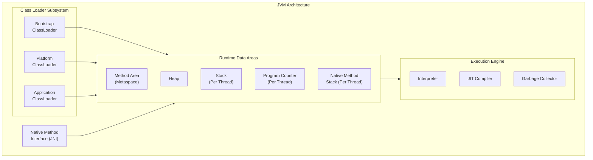
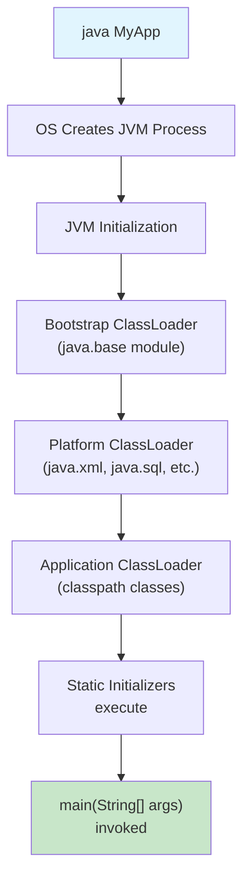

# 01. Introduction to JVM Internals

## Introduction

The Java Virtual Machine (JVM) is the cornerstone of Java's "Write Once, Run Anywhere" philosophy. It is an abstract computing machine that enables a computer to run a Java program. Understanding JVM internals is crucial for every Java developer who wants to write high-performance, production-ready applications.

## JVM Architecture Diagram

```mermaid
graph LR
    subgraph Traditional["Traditional ASCII Diagram"]
        direction TB
        A["┌─────────────────────────────────────────────────────────────┐"]
        B["│                        JVM                                  │"]
        C["│  ┌──────────────┐  ┌──────────────┐  ┌──────────────┐     │"]
        D["│  │   Class       │  │   Runtime    │  │   Execution  │     │"]
        E["│  │   Loader      │  │   Data       │  │   Engine     │     │"]
        F["│  │   Subsystem   │  │   Areas      │  │              │     │"]
        G["│  └──────────────┘  └──────────────┘  └──────────────┘     │"]
        H["│  ┌──────────────┐  ┌──────────────┐  ┌──────────────┐     │"]
        I["│  │   Native      │  │   JIT        │  │   Garbage    │     │"]
        J["│  │   Method      │  │   Compiler   │  │   Collector  │     │"]
        K["│  │   Interface   │  │              │  │              │     │"]
        L["│  └──────────────┘  └──────────────┘  └──────────────┘     │"]
        M["└─────────────────────────────────────────────────────────────┘"]
    end
```





## JVM Startup Sequence



The JVM startup follows this sequence:

1. **OS creates JVM process**: `java` command is executed
2. **JVM initialization**: Internal structures are created
3. **Bootstrap classloader**: Loads core classes from `rt.jar` / `java.base` module
4. **Platform classloader**: Loads platform modules (java.xml, java.sql, etc.)
5. **Application classloader**: Loads application classes from classpath
6. **Static initializers**: `<clinit>` methods execute
7. **Main method**: `public static void main(String[] args)` is invoked

## JVM Lifecycle States

The JVM goes through these states during its lifetime:

```
┌──────────┐     ┌──────────┐     ┌──────────┐
│ CREATED  │────>│INITIALIZED│────>│ RUNNING  │
└──────────┘     └──────────┘     └──────────┘
                                       │
                     ┌─────────────────┤
                     │                 │
                     ▼                 ▼
              ┌──────────┐     ┌──────────┐
              │ SHUTDOWN │────>│TERMINATED│
              └──────────┘     └──────────┘
```

**State Descriptions:**
- **CREATED**: JVM instance created by OS
- **INITIALIZED**: JVM initializes internal structures
- **RUNNING**: Application code executing
- **SHUTDOWN**: Shutdown initiated (hook or exit)
- **TERMINATED**: JVM exits with status code

## Shutdown Hooks

The JVM supports shutdown hooks for cleanup before termination:

```java
Runtime.getRuntime().addShutdownHook(new Thread(() -> {
    System.out.println("Cleaning up resources...");
}));
```

**Shutdown triggers:**
1. All non-daemon threads terminate
2. `System.exit(status)` called
3. Ctrl+C (SIGINT) received
4. SIGTERM received
5. Uncaught exception in non-daemon thread

## Class Initialization Order

When the JVM loads a class, initialization follows this order:

1. **Static variables**: Initialized to default values
2. **Static initializers**: `<clinit>` methods execute
3. **Static blocks**: In order of appearance
4. **Instance variables**: Initialized to default values (when object created)
5. **Instance initializers**: Execute before constructor
6. **Constructor**: Object construction

## Learning Objectives

By the end of this topic, you will be able to:

- [ ] Understand what the JVM is and its role in the Java ecosystem
- [ ] Identify the different components of the JVM architecture
- [ ] Explain how Java achieves platform independence
- [ ] Describe the JVM lifecycle from source code to execution
- [ ] Differentiate between JVM, JRE, and JDK
- [ ] Understand the relationship between bytecode and native code
- [ ] Recognize the importance of JVM tuning for production applications

## The Java Ecosystem

| Component | Description |
|-----------|-------------|
| **JDK** | Java Development Kit - contains tools for developing Java applications |
| **JRE** | Java Runtime Environment - contains libraries and JVM needed to run Java applications |
| **JVM** | Java Virtual Machine - the runtime engine that executes Java bytecode |

## Easy Example

```java
package academy.javaengineering.jvm.introduction;

/**
 * JVM Startup & Bootstrap demonstration.
 */
public class JvmStartup {

    static {
        System.out.println("[Phase 4] Static initializer executed");
    }

    public static void main(String[] args) {
        System.out.println("=== JVM Startup Sequence ===");
        System.out.println("Step 1: OS creates JVM process");
        System.out.println("Step 2: JVM initialization");
        System.out.println("Step 3: Bootstrap classloader loads core classes");
        System.out.println("Step 4: Platform classloader loads platform modules");
        System.out.println("Step 5: Application classloader loads app classes");
        System.out.println("Step 6: Static initializers execute");
        System.out.println("Step 7: main(String[] args) method invoked");
    }
}
```

## Best Practices

1. **Set appropriate heap sizes**: `-Xms4g -Xmx4g`
2. **Enable GC logging**: `-Xlog:gc*:file=gc.log:time,uptime,level,tags`
3. **Use tiered compilation**: `-XX:+TieredCompilation`
4. **Monitor JVM in production**: Use JMX and GC logs

## Interview Questions

1. **What is the JVM?** - A runtime environment that executes Java bytecode
2. **What is the difference between JDK, JRE, and JVM?** - JDK has tools, JRE has runtime, JVM executes bytecode
3. **How does Java achieve platform independence?** - By compiling to bytecode that runs on any JVM

## References

- [Oracle JVM Documentation](https://docs.oracle.com/javase/vm/)
- [JVM Specification](https://docs.oracle.com/javase/specs/)
- "Effective Java" by Joshua Bloch
- "Java Performance" by Scott Oaks
