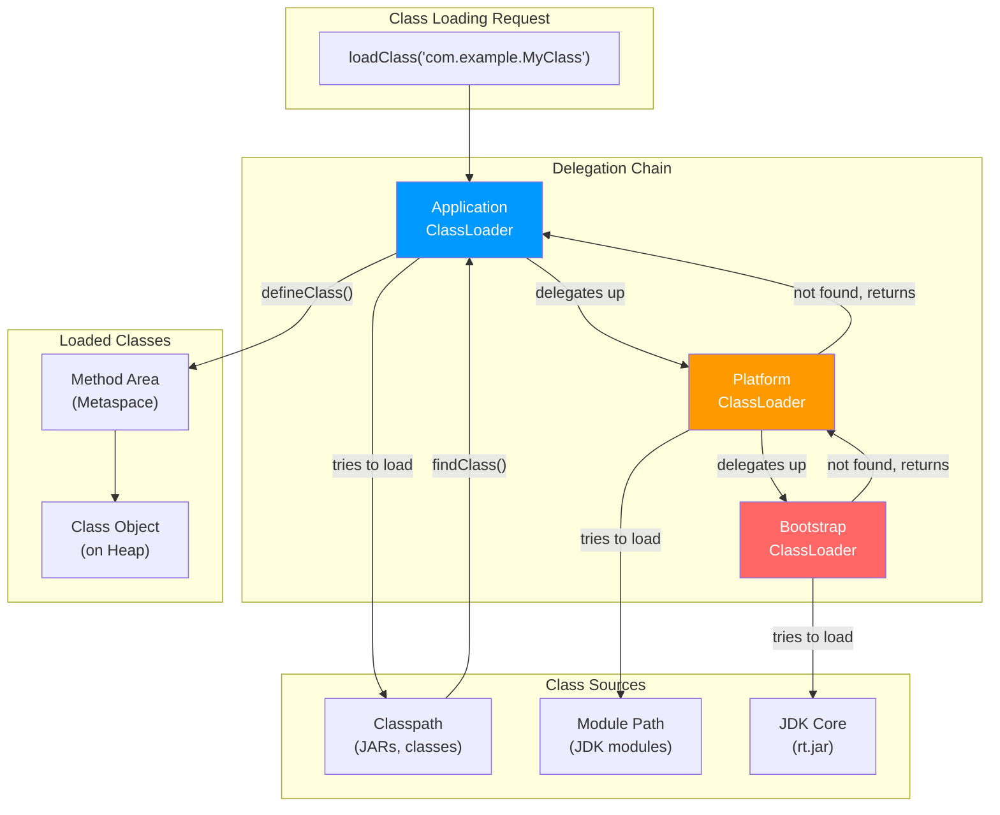
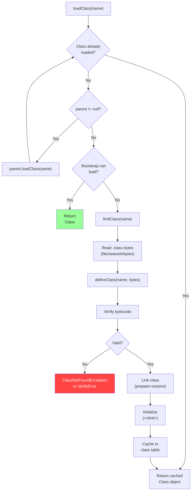

# 02 - ClassLoader Deep Dive

## Introduction

The ClassLoader subsystem is the foundation of Java's dynamic class loading mechanism. It reads `.class` files from disk, network, or generated at runtime, and converts them into `java.lang.Class` objects in the method area. Understanding classloaders is essential for debugging `ClassNotFoundException`, implementing plugin architectures, working with application servers, and understanding how Java achieves runtime flexibility. This topic covers Bootstrap, Platform, and Application classloaders, the parent delegation model, custom classloaders, and classloader-related issues in production.

## Learning Objectives

By the end of this topic, you will be able to:

- Explain the three built-in classloader hierarchy
- Implement the parent delegation model
- Create custom classloaders for plugin architectures
- Diagnose ClassNotFoundException and NoClassDefFoundError
- Understand class isolation in application servers
- Implement hot-reloading and dynamic class loading
- Debug classloader leaks in long-running applications

## Prerequisites

- Understanding of JVM architecture (Topic 01)
- Knowledge of Java reflection API
- Familiarity with file I/O and streams
- Basic understanding of binary data

## Why This Concept Exists

Classloaders exist because:

1. **Security**: Bytecode verification before execution prevents malicious code
2. **Dynamic Loading**: Classes can be loaded on demand, enabling plugins
3. **Isolation**: Different classloaders can load different versions of the same class
4. **Caching**: Loaded classes are cached to avoid re-reading from disk
5. **Delegation**: Parent-first loading prevents duplicate class definitions
6. **Platform Independence**: Load classes from any source (disk, network, database)

Without classloaders, Java would need all classes at compile time, eliminating runtime flexibility.

## Problem Statement

Consider a plugin-based application:

```java
public class PluginManager {
    public void loadPlugin(String jarPath) throws Exception {
        // How to load a class from a JAR not on the classpath?
        // How to ensure plugin classes don't conflict with core classes?
        // How to unload old plugin versions?
    }
}
```

The classloader solves this by:
1. Defining a custom classloader that reads from JARs
2. Using parent delegation to prioritize core classes
3. Implementing classloader lifecycle for hot-reloading

## Theory

### ClassLoader Hierarchy

```
Bootstrap ClassLoader (C/C++, null reference)
├── Loads: rt.jar, modules (java.base, java.xml, etc.)
├── Source: $JAVA_HOME/lib
└── Purpose: Core Java classes

Platform ClassLoader (Java, non-null)
├── Loads: java.* (non-core), javax.* modules
├── Source: $JAVA_HOME/lib/ext or module path
└── Purpose: Extension/platform classes

Application ClassLoader (Java, non-null)
├── Loads: Classpath classes (your code)
├── Source: -classpath/-cp
└── Purpose: Application classes
```

### Parent Delegation Model

```
Application ClassLoader
    │
    ▼
Platform ClassLoader
    │
    ▼
Bootstrap ClassLoader
    │
    ▼
null (native code)
```

**Process:**
1. Request goes to Application ClassLoader
2. Application delegates to Platform ClassLoader
3. Platform delegates to Bootstrap ClassLoader
4. Bootstrap attempts to load; if not found, delegates back
5. Each level tries to load; if not found, child tries

**Why parent-first?**
- Prevents loading core classes from untrusted sources
- Ensures single definition of core classes (String, etc.)
- Avoids class conflicts between classloaders

### Class Loading Process

```
Load → Link → Initialize
  │      │       │
  │      │       └─ Execute <clinit>()
  │      │
  │      ├─ Verify (bytecode validation)
  │      ├─ Prepare (allocate static field memory)
  │      └─ Resolve (replace symbolic refs)
  │
  └─ Read .class bytes → create Class object
```

### Class Identity

A class is uniquely identified by:
- **Fully Qualified Name**: `java.lang.String`
- **Defining ClassLoader**: Two classloaders can load same class name independently

```java
// These are different classes even with same name:
Class<?> c1 = classLoader1.loadClass("com.example.MyClass");
Class<?> c2 = classLoader2.loadClass("com.example.MyClass");
c1 != c2  // Different class objects
```

### Class Unloading

- Classes can be unloaded when their defining classloader is garbage collected
- Bootstrap and Platform classloaders are never collected
- Application classloader: classes unload on JVM shutdown or if classloader is nulled
- Custom classloaders: unload when no references remain

## Internal Working

### Loading Phase

1. **Find the .class bytes** (from file, network, byte array, etc.)
2. **Define the class**: Convert bytes to `java.lang.Class` instance
3. **Resolve**: Link to parent classloader's classes

### Verification Phase

The verifier checks:
- **Magic number**: 0xCAFEBABE
- **Version compatibility**: Major version ≤ current JVM
- **Constant pool validity**: References are well-formed
- **Stack map frame verification**: Type safety at each branch
- **Bytecode integrity**: No stack overflow, valid local variable access

### Preparation Phase

- Allocate memory for static fields
- Assign default values (0, null, false)
- Assign constant values (static final fields)

### Resolution Phase

Replace symbolic references with direct references:
- Class references → Class object
- Field references → memory offset
- Method references → entry point

### Linkage Order

```
Bootstrap classes → loaded first (always available)
Platform classes → loaded on demand
Application classes → loaded on demand
```

## JVM Perspective

### ClassLoader.findClass()

```java
// Abstract method that classloaders implement
protected Class<?> findClass(String name) throws ClassNotFoundException {
    // 1. Translate class name to file path
    String path = name.replace('.', '/') + ".class";
    
    // 2. Read bytes from location
    byte[] bytes = readClassBytes(path);
    
    // 3. Define the class
    return defineClass(name, bytes, 0, bytes.length);
}
```

### ClassLoader.defineClass()

```java
// Converts byte array to Class object
protected final Class<?> defineClass(String name, byte[] b, int off, int len) {
    // 1. Parse the class file format
    // 2. Create Class object in method area
    // 3. Link the class
    // 4. Return the Class instance
}
```

### Thread Context ClassLoader

```java
// Some frameworks (JDBC, JNDI) use context classloaders
Thread.currentThread().getContextClassLoader();
Thread.currentThread().setContextClassLoader(myClassLoader);

// Why? The parent delegation model can't load classes from child classloaders
// Context classloader breaks the delegation direction
```

## Memory Representation

### ClassLoader Object Layout

```
ClassLoader Instance (on Heap)
├── name: String (reference)
├── parent: ClassLoader (reference)
├── classes: Vector<Class<?>> (loaded classes cache)
├── defaultDomain: ProtectionDomain
├── packages: Hashtable<String, Package>
└── nativeData: long (pointer to native structures)
```

### Class Object in Metaspace

```
Metaspace
├── InstanceKlass (C++ representation)
│   ├── _constants: ConstantPool*
│   ├── _methods: Array<Method*>*
│   ├── _fields: Array<Field*>*
│   ├── _access_flags: u4
│   ├── _name: Symbol*
│   └── _super: Klass*
├── Method Metadata
│   ├── bytecode: u1*
│   ├── stackmap_table: attribute
│   └── exception_table: u2*
└── Constant Pool
    ├── String entries
    ├── Method/Field references
    └── Class references
```

### ClassLoader Hierarchy in Memory

```
AppClassLoader (instance on heap)
│
├── parent → PlatformClassLoader (instance on heap)
│              │
│              └── parent → null (Bootstrap, native code)
│
├── classes → [Class1, Class2, ...] (loaded classes)
└── name → "sun.misc.Launcher$AppClassLoader"

PlatformClassLoader (instance on heap)
│
├── parent → null (Bootstrap)
├ classes → [Class3, Class4, ...]
└── name → "jdk.internal.loader.ClassLoaders$PlatformClassLoader"
```

## Architecture Diagram (Mermaid)



## Flow Diagram (Mermaid)



## Syntax

### Standard ClassLoader Usage

```java
// Load class from current classpath
Class<?> clazz = Class.forName("com.example.MyClass");

// Load class with explicit classloader
ClassLoader loader = Thread.currentThread().getContextClassLoader();
Class<?> clazz = loader.loadClass("com.example.MyClass");

// Get classloader for a class
ClassLoader loader = MyClass.class.getClassLoader();

// Get the defining classloader
ClassLoader loader = MyClass.class.getClassLoader();
```

### Custom ClassLoader Template

```java
public class CustomClassLoader extends ClassLoader {
    
    public CustomClassLoader(ClassLoader parent) {
        super(parent); // Set parent classloader
    }
    
    @Override
    protected Class<?> findClass(String name) throws ClassNotFoundException {
        try {
            // Convert name to path
            String path = name.replace('.', '/') + ".class";
            
            // Read bytes (from file, network, etc.)
            byte[] bytes = loadClassBytes(path);
            
            // Define and return
            return defineClass(name, bytes, 0, bytes.length);
        } catch (IOException e) {
            throw new ClassNotFoundException(name, e);
        }
    }
    
    private byte[] loadClassBytes(String path) throws IOException {
        // Override to load from your source
        return Files.readAllBytes(Path.of(path));
    }
}
```

## Easy Example

```java
package academy.javaengineering.jvm;

/**
 * ClassLoader hierarchy demonstration.
 * Shows how Java's parent delegation model works.
 */
public class ClassloaderExample {

    public static void main(String[] args) {
        System.out.println("=== ClassLoader Hierarchy Demo ===\n");

        // 1. Show classloader hierarchy
        demonstrateHierarchy();

        // 2. Show classloading delegation
        demonstrateDelegation();

        // 3. Show class identity
        demonstrateClassIdentity();

        // 4. Show classloader resources
        demonstrateResources();

        // 5. Thread context classloader
        demonstrateContextClassLoader();
    }

    static void demonstrateHierarchy() {
        System.out.println("--- ClassLoader Hierarchy ---");

        ClassLoader loader = ClassloaderExample.class.getClassLoader();
        while (loader != null) {
            System.out.println("  " + loader.getClass().getName());
            loader = loader.getParent();
        }
        System.out.println("  Bootstrap ClassLoader (null reference, native)");
        System.out.println();
    }

    static void demonstrateDelegation() {
        System.out.println("--- Parent Delegation Model ---");

        // String is loaded by Bootstrap ClassLoader
        ClassLoader stringLoader = String.class.getClassLoader();
        System.out.println("String classloader: " + stringLoader + " (Bootstrap)");

        // Our class is loaded by Application ClassLoader
        ClassLoader appLoader = ClassloaderExample.class.getClassLoader();
        System.out.println("ClassloaderExample classloader: " + appLoader);

        // Platform class
        try {
            Class<?> xmlClass = Class.forName("javax.xml.parsers.DocumentBuilderFactory");
            System.out.println("DocumentBuilderFactory classloader: " + xmlClass.getClassLoader());
        } catch (ClassNotFoundException e) {
            System.out.println("XML class not found in this JDK version");
        }
        System.out.println();
    }

    static void demonstrateClassIdentity() {
        System.out.println("--- Class Identity ---");

        // Same class loaded by different classloaders = different Class objects
        ClassLoader appLoader = ClassloaderExample.class.getClassLoader();
        Class<?> c1 = appLoader.getClass().getSuperclass(); // URLClassLoader or similar
        Class<?> c2 = appLoader.getClass().getSuperclass();

        System.out.println("Same classloader instance: " + (c1 == c2));
        System.out.println("Class identity: " + (c1.equals(c2)));
        System.out.println();
    }

    static void demonstrateResources() {
        System.out.println("--- Resource Loading ---");

        ClassLoader loader = ClassloaderExample.class.getClassLoader();
        java.net.URL resource = loader.getResource("academy/javaengineering/jvm/");
        System.out.println("Resource URL: " + resource);
        System.out.println("Class file location: " + ClassloaderExample.class.getProtectionDomain().getCodeSource().getLocation());
        System.out.println();
    }

    static void demonstrateContextClassLoader() {
        System.out.println("--- Thread Context ClassLoader ---");

        Thread current = Thread.currentThread();
        ClassLoader contextLoader = current.getContextClassLoader();
        System.out.println("Current thread: " + current.getName());
        System.out.println("Context ClassLoader: " + contextLoader);
        System.out.println("Same as application classloader? " +
            (contextLoader == ClassloaderExample.class.getClassLoader()));
        System.out.println();
    }
}
```

## Medium Example

```java
package academy.javaengineering.jvm;

import java.io.*;
import java.nio.file.*;
import java.util.*;
import java.util.concurrent.*;

/**
 * Advanced classloader demonstration: custom classloader, class isolation,
 * and dynamic class loading.
 */
public class ClassloaderMediumExample {

    public static void main(String[] args) throws Exception {
        System.out.println("=== Advanced ClassLoader Demo ===\n");

        // 1. Custom ClassLoader
        demonstrateCustomClassLoader();

        // 2. Class Isolation
        demonstrateClassIsolation();

        // 3. ClassLoader Leak Detection
        demonstrateClassLoaderLeak();

        // 4. Hot Reload Simulation
        demonstrateHotReload();
    }

    static void demonstrateCustomClassLoader() throws Exception {
        System.out.println("--- Custom ClassLoader ---");

        // Create a classloader that loads from a specific directory
        Path classesDir = Path.of("target/classes");
        if (Files.exists(classesDir)) {
            CustomDirectoryClassLoader loader = new CustomDirectoryClassLoader(
                classesDir, ClassloaderExample.class.getClassLoader());

            // Load a class from our classes directory
            Class<?> clazz = loader.loadClass("academy.javaengineering.jvm.ClassloaderExample");
            System.out.println("Loaded class: " + clazz.getName());
            System.out.println("ClassLoader: " + clazz.getClassLoader());
            System.out.println("Same as parent? " + (clazz.getClassLoader() == loader));
        }
        System.out.println();
    }

    static void demonstrateClassIsolation() {
        System.out.println("--- Class Isolation ---");

        // Two classloaders loading same class name → different Class objects
        ClassLoader parent = ClassloaderExample.class.getClassLoader();

        IsolationClassLoader loader1 = new IsolationClassLoader(parent);
        IsolationClassLoader loader2 = new IsolationClassLoader(parent);

        System.out.println("loader1 != loader2: " + (loader1 != loader2));
        System.out.println("Different classloaders can load same class name");
        System.out.println("Each gets its own Class object in Metaspace");
        System.out.println();
    }

    static void demonstrateClassLoaderLeak() {
        System.out.println("--- ClassLoader Leak Awareness ---");

        System.out.println("Common leak sources:");
        System.out.println("  1. ThreadLocal values not removed");
        System.out.println("  2. JDBC drivers registered but not deregistered");
        System.out.println("  3. JNDI bindings not cleaned up");
        System.out.println("  4. Static fields holding classloader references");
        System.out.println("  5. RMI/Remote objects not unexported");
        System.out.println();
    }

    static void demonstrateHotReload() throws Exception {
        System.out.println("--- Hot Reload Simulation ---");

        System.out.println("To hot-reload a class:");
        System.out.println("  1. Create a new classloader instance");
        System.out.println("  2. Load the new version of the class");
        System.out.println("  3. Null all references to old classloader");
        System.out.println("  4. Let GC collect old classloader and its classes");
        System.out.println();
    }

    // Custom classloader implementation
    static class CustomDirectoryClassLoader extends ClassLoader {
        private final Path classesDir;

        CustomDirectoryClassLoader(Path classesDir, ClassLoader parent) {
            super(parent);
            this.classesDir = classesDir;
        }

        @Override
        protected Class<?> findClass(String name) throws ClassNotFoundException {
            String path = name.replace('.', '/') + ".class";
            Path classFile = classesDir.resolve(path);

            if (Files.exists(classFile)) {
                try {
                    byte[] bytes = Files.readAllBytes(classFile);
                    return defineClass(name, bytes, 0, bytes.length);
                } catch (IOException e) {
                    throw new ClassNotFoundException("Failed to load " + name, e);
                }
            }
            throw new ClassNotFoundException(name);
        }
    }

    // Isolation classloader
    static class IsolationClassLoader extends ClassLoader {
        IsolationClassLoader(ClassLoader parent) {
            super(parent);
        }
    }
}
```

## Hard Example

```java
package academy.javaengineering.jvm;

import java.io.*;
import java.lang.reflect.*;
import java.nio.file.*;
import java.util.*;
import java.util.concurrent.*;
import java.util.jar.*;

/**
 * Enterprise classloader patterns: OSGi-like isolation, classloader hierarchy
 * management, and dynamic module loading.
 */
public class ClassloaderHardExample {

    private static final Map<String, ClassLoader> moduleLoaders = new ConcurrentHashMap<>();

    public static void main(String[] args) throws Exception {
        System.out.println("=== Enterprise ClassLoader Patterns ===\n");

        // 1. Module Isolation Pattern
        demonstrateModuleIsolation();

        // 2. Parent-First vs Child-First Loading
        demonstrateLoadingStrategies();

        // 3. ClassLoader Tree Management
        demonstrateClassLoaderTree();

        // 4. Bytecode Instrumentation
        demonstrateInstrumentation();

        // 5. Dynamic Proxy Class Loading
        demonstrateProxyLoading();
    }

    static void demonstrateModuleIsolation() {
        System.out.println("--- Module Isolation Pattern ---");

        // Simulate module loading with separate classloaders
        String[] modules = {"module-a", "module-b", "module-c"};
        ClassLoader appLoader = ClassloaderExample.class.getClassLoader();

        for (String module : modules) {
            IsolatedModuleClassLoader loader = new IsolatedModuleClassLoader(module, appLoader);
            moduleLoaders.put(module, loader);
            System.out.printf("Module '%s' loaded by: %s%n", module, loader);
        }

        System.out.println("Each module has its own classloader (isolation)");
        System.out.println("Modules can't see each other's classes directly");
        System.out.println();
    }

    static void demonstrateLoadingStrategies() {
        System.out.println("--- Loading Strategies ---");

        System.out.println("Parent-First (default):");
        System.out.println("  Request → Child → Parent → Grandparent → ... → Bootstrap");
        System.out.println("  Prevents loading core classes from untrusted sources");
        System.out.println();

        System.out.println("Child-First (for plugins):");
        System.out.println("  Request → Child → Parent (if child not found)");
        System.out.println("  Allows plugin classes to override parent classes");
        System.out.println();

        System.out.println("Thread Context ClassLoader:");
        System.out.println("  Used by JDBC, JNDI, etc. to break parent delegation");
        System.out.println("  Allows loading from dynamic classloaders");
        System.out.println();
    }

    static void demonstrateClassLoaderTree() {
        System.out.println("--- ClassLoader Tree ---");

        printClassLoaderTree(Thread.currentThread().getContextClassLoader(), 0);
        System.out.println();
    }

    static void printClassLoaderTree(ClassLoader loader, int indent) {
        if (loader == null) {
            System.out.println(" ".repeat(indent * 2) + "Bootstrap ClassLoader (null)");
            return;
        }
        System.out.println(" ".repeat(indent * 2) + loader.getClass().getSimpleName()
            + " (" + loader.getClass().getName() + ")");
        printClassLoaderTree(loader.getParent(), indent + 1);
    }

    static void demonstrateInstrumentation() {
        System.out.println("--- Bytecode Instrumentation ---");

        System.out.println("ClassFileTransformer can modify bytecode at load time:");
        System.out.println("  1. Add logging/metrics to methods");
        System.out.println("  2. Implement AOP (aspect-oriented programming)");
        System.out.println("  3. Add bytecode for profiling");
        System.out.println("  4. Transform classes for monitoring");
        System.out.println();
    }

    static void demonstrateProxyLoading() {
        System.out.println("--- Dynamic Proxy Class Loading ---");

        // Create a dynamic proxy
        ClassLoader loader = ClassloaderExample.class.getClassLoader();
        Proxy proxyInstance = (Proxy) Proxy.newProxyInstance(
            loader,
            new Class<?>[]{Runnable.class},
            (p, method, methodArgs) -> {
                if (method.getName().equals("run")) {
                    System.out.println("  Proxy run() invoked");
                    return null;
                }
                return method.invoke(this, methodArgs);
            }
        );

        System.out.println("Proxy class: " + proxyInstance.getClass().getName());
        System.out.println("Proxy classloader: " + proxyInstance.getClass().getClassLoader());
        System.out.println("Proxy implements Runnable: " + (proxyInstance instanceof Runnable));
        System.out.println();
    }

    // Module classloader with isolation
    static class IsolatedModuleClassLoader extends ClassLoader {
        private final String moduleName;

        IsolatedModuleClassLoader(String moduleName, ClassLoader parent) {
            super(parent);
            this.moduleName = moduleName;
        }

        @Override
        protected Class<?> findClass(String name) throws ClassNotFoundException {
            // Each module loads from its own directory
            // For demo, just create a placeholder
            throw new ClassNotFoundException(name);
        }

        @Override
        public String toString() {
            return "IsolatedModuleClassLoader[" + moduleName + "]";
        }
    }
}
```

## Enterprise Example

```java
package academy.javaengineering.jvm;

import java.io.*;
import java.lang.management.*;
import java.nio.file.*;
import java.util.*;
import java.util.jar.*;
import java.util.stream.*;

/**
 * Enterprise classloader management: plugin loading, hot deployment,
 * classloader monitoring, and leak detection.
 */
public class ClassloaderEnterpriseExample {

    private static final Map<String, PluginClassLoader> plugins = new LinkedHashMap<>();

    public static void main(String[] args) throws Exception {
        System.out.println("=== Enterprise ClassLoader Management ===\n");

        // 1. Plugin Loading System
        demonstratePluginLoading();

        // 2. Hot Deployment
        demonstrateHotDeployment();

        // 3. ClassLoader Monitoring
        demonstrateMonitoring();

        // 4. ClassLoader Best Practices
        demonstrateBestPractices();
    }

    static void demonstratePluginLoading() throws Exception {
        System.out.println("--- Plugin Loading System ---");

        // Simulate plugin JAR loading
        Path pluginDir = Path.of("plugins");
        if (Files.exists(pluginDir)) {
            try (var stream = Files.list(pluginDir)) {
                stream.filter(p -> p.toString().endsWith(".jar"))
                    .forEach(jarPath -> {
                        try {
                            loadPlugin(jarPath);
                        } catch (Exception e) {
                            System.out.println("Failed to load plugin: " + jarPath);
                        }
                    });
            }
        }

        System.out.println("Plugin Architecture:");
        System.out.println("  1. Each plugin has its own classloader");
        System.out.println("  2. Plugins are isolated from each other");
        System.out.println("  3. Plugins share core classes via parent classloader");
        System.out.println("  4. Plugins can be loaded/unloaded dynamically");
        System.out.println();
    }

    static void loadPlugin(Path jarPath) throws Exception {
        String pluginName = jarPath.getFileName().toString().replace(".jar", "");
        PluginClassLoader loader = new PluginClassLoader(jarPath, 
            ClassloaderExample.class.getClassLoader());

        // Load plugin main class
        String mainClass = pluginName + ".Plugin";
        Class<?> clazz = loader.loadClass(mainClass);
        Object instance = clazz.getDeclaredConstructor().newInstance();

        plugins.put(pluginName, loader);
        System.out.printf("Plugin '%s' loaded (classloader: %s)%n", pluginName, loader);
    }

    static void demonstrateHotDeployment() {
        System.out.println("--- Hot Deployment ---");

        System.out.println("Hot deployment steps:");
        System.out.println("  1. Stop serving requests for the module");
        System.out.println("  2. Unload old classloader (null all references)");
        System.out.println("  3. Create new classloader for updated classes");
        System.out.println("  4. Load and initialize new classes");
        System.out.println("  5. Resume serving requests");
        System.out.println();
    }

    static void demonstrateMonitoring() {
        System.out.println("--- ClassLoader Monitoring ---");

        // Monitor loaded classes
        int loadedClasses = ManagementFactory.getClassLoadingMXBean().getTotalLoadedClassCount();
        int unloadedClasses = ManagementFactory.getClassLoadingMXBean().getUnloadedClassCount();
        int currentLoaded = ManagementFactory.getClassLoadingMXBean().getLoadedClassCount();

        System.out.println("Total loaded classes: " + loadedClasses);
        System.out.println("Currently loaded: " + currentLoaded);
        System.out.println("Unloaded classes: " + unloadedClasses);
        System.out.println();
    }

    static void demonstrateBestPractices() {
        System.out.println("--- ClassLoader Best Practices ---");

        System.out.println("1. Always set parent classloader");
        System.out.println("2. Use defineClass with ProtectionDomain");
        System.out.println("3. Cache loaded classes to avoid re-loading");
        System.out.println("4. Implement close() for cleanup");
        System.out.println("5. Monitor classloader count for leaks");
        System.out.println("6. Use WeakReference for caches");
        System.out.println("7. Test classloader lifecycle thoroughly");
        System.out.println();
    }

    // Plugin classloader with JAR support
    static class PluginClassLoader extends ClassLoader {
        private final JarFile jarFile;
        private final Map<String, byte[]> classBytesCache = new HashMap<>();

        PluginClassLoader(Path jarPath, ClassLoader parent) throws IOException {
            super(parent);
            this.jarFile = new JarFile(jarPath.toFile());
        }

        @Override
        protected Class<?> findClass(String name) throws ClassNotFoundException {
            String path = name.replace('.', '/') + ".class";

            try {
                JarEntry entry = jarFile.getJarEntry(path);
                if (entry != null) {
                    try (InputStream is = jarFile.getInputStream(entry)) {
                        byte[] bytes = is.readAllBytes();
                        return defineClass(name, bytes, 0, bytes.length);
                    }
                }
            } catch (IOException e) {
                throw new ClassNotFoundException(name, e);
            }

            throw new ClassNotFoundException(name);
        }

        @Override
        public void close() throws IOException {
            jarFile.close();
        }
    }
}
```

## Performance Considerations

1. **Class Loading Cost**: Loading a class involves disk I/O, bytecode parsing, verification, and linking. Cache frequently used classes.

2. **ClassLoader Overhead**: Each classloader instance has overhead (~1-2KB). Don't create unnecessary classloaders.

3. **Metaspace Usage**: Each loaded class consumes Metaspace. Monitor with `jcmd <pid> VM.native_memory`.

4. **Verification Cost**: Bytecode verification can be expensive for large classes. Use `-noverify` for trusted code only (security risk).

5. **JIT Caching**: JIT-compiled code is cached per classloader. Multiple classloaders loading same class = separate compiled code.

6. **Class Unloading**: Unloading classes requires GC to collect the classloader. This can be expensive if many classes are loaded.

## Thread Safety

- **Class Loading**: `loadClass()` is synchronized on the classloader instance
- **Class Cache**: `findLoadedClass()` uses a native method, thread-safe
- **defineClass()**: Must be called from the same classloader instance
- **Concurrent Loading**: Multiple threads can load different classes simultaneously
- **Delegation Chain**: The parent-first delegation is inherently thread-safe

## Best Practices

1. **Always Set Parent**: `super(parent)` in custom classloader constructors
2. **Cache Loaded Classes**: Use `findLoadedClass()` before loading from source
3. **Implement close()**: Clean up resources when classloader is no longer needed
4. **Use ProtectionDomain**: Set code source and permissions for loaded classes
5. **Monitor ClassLoader Count**: Track for potential leaks in long-running apps
6. **Test ClassLoader Isolation**: Verify plugins don't interfere with each other
7. **Document Loading Strategy**: Parent-first vs child-first vs thread context

## Common Mistakes

1. **Forgetting Parent Delegation**: Not calling `super(parent)` breaks the model
2. **Not Caching**: Repeatedly loading same class is wasteful
3. **ClassLoader Leaks**: Not releasing classloader references prevents GC
4. **Wrong Context ClassLoader**: Using wrong classloader for resource loading
5. **Assuming Class Identity**: `==` comparison on classes from different classloaders

## Pitfalls

- **ClassNotFoundException vs NoClassDefFoundError**: CNF thrown when class not found during load. NCDFD thrown when class was found but can't be loaded (dependency missing, init error)
- **ClassCastException from Isolation**: Two classloaders load same class → incompatible types
- **Static Initializer Errors**: Errors in `<clinit>` leave class in "erroneous" state
- **Sealed Classes**: Java 17+ sealed classes restrict which classloaders can extend them

## Debugging Tips

```bash
# Verbose class loading
java -verbose:class MyApp

# Trace class loading
java -verbose:class -XX:+TraceClassLoading MyApp

# Dump class files
java -XX:+DumpLoadedClassList MyApp

# ClassLoader monitoring
jcmd <pid> VM.classloader_stats

# Heap dump analysis
# Look for ClassLoader objects and their loaded classes
# Check Metaspace usage in heap dump

# Common diagnostic
jcmd <pid> VM.flags
jcmd <pid> GC.heap_info
```

## Comparison Table

| Feature | Bootstrap | Platform | Application | Custom |
|---------|-----------|----------|-------------|--------|
| Implementation | Native (C/C++) | Java | Java | Java |
| Reference | null | Non-null | Non-null | Non-null |
| Loads | Core JDK | Platform modules | Classpath | Custom sources |
| Visibility | All classes | Platform + Bootstrap | All | Delegation chain |
| Unloadable | No | No | JVM shutdown | When GC collected |
| Thread Safe | Yes | Yes | Yes | Depends on impl |

## Decision Tree

```
Need to load a class dynamically?
│
├─ From classpath?
│  ├─ Yes → Use Class.forName() or ClassLoader.loadClass()
│  └─ No
│
├─ From a JAR file?
│  ├─ Yes → Create URLClassLoader or JarClassLoader
│  └─ No
│
├─ From network/bytes?
│  ├─ Yes → Create custom ClassLoader with findClass()
│  └─ No
│
├─ Need isolation?
│  ├─ Yes → Separate classloader per module/plugin
│  └─ No
│
└─ Need hot reload?
   ├─ Yes → New classloader + GC old one
   └─ No → Standard classloading is fine
```

## Interview Questions (15+)

**Q1: What is the parent delegation model?**
A: When a classloader receives a load request, it delegates to its parent first. Only if the parent can't find the class does the child attempt to load it. This ensures core classes are loaded from trusted sources and prevents duplicate definitions.

**Q2: What is the difference between ClassNotFoundException and NoClassDefFoundError?**
A: `ClassNotFoundException` is a checked exception thrown when a class is not found during loading (e.g., `Class.forName()`). `NoClassDefFoundError` is an error thrown when the JVM tried to load a class that was available at compile time but isn't at runtime (dependency missing, static init failed).

**Q3: How many classloaders are there in a standard JVM?**
A: Three built-in: Bootstrap (loads core JDK), Platform (loads platform modules), Application (loads classpath). Custom classloaders can be created for plugin systems, web containers, etc.

**Q4: What is the Thread Context ClassLoader?**
A: A classloader associated with each thread, used to break the parent delegation model. Frameworks like JDBC use it to load drivers from dynamic classloaders that aren't in the parent chain.

**Q5: How does the JVM determine if two classes are "the same"?**
A: Two classes are identical if they have the same fully qualified name AND were loaded by the same classloader. Same name from different classloaders = different classes.

**Q6: Can a class be unloaded from the JVM?**
A: Yes, a class is unloaded when its defining classloader is garbage collected. Bootstrap and Platform classloaders are never collected. Application classloader classes unload on JVM shutdown or when the classloader is dereferenced.

**Q7: What is `defineClass()` and why is it important?**
A: `defineClass()` converts a byte array into a `java.lang.Class` object. It's the bridge between raw bytes and a loaded class. Custom classloaders use it to define classes from non-standard sources (network, database, encrypted files).

**Q8: What is classloader leak?**
A: A classloader leak occurs when a classloader cannot be garbage collected because of lingering references (ThreadLocal, JDBC driver registration, RMI bindings). This prevents all its loaded classes from being unloaded, causing Metaspace exhaustion.

**Q9: How do web application servers handle classloader isolation?**
A: Each web app gets its own classloader (child-first) to isolate classes between applications. The server's classloader is the parent, providing shared libraries. This prevents ClassCastExceptions between apps.

**Q10: What is the difference between `loadClass()` and `forName()`?**
A: `loadClass()` uses the classloader's delegation model without initializing the class. `Class.forName(String)` initializes the class (runs static block). `Class.forName(String, boolean, ClassLoader)` gives control over initialization.

**Q11: What is the Java Module System's impact on classloaders?**
A: Java 9+ module system adds module layers as a classloading structure. Each module has a `Module` object and can be loaded in different module layers. The platform classloader replaced the extension classloader.

**Q12: How does `-noverify` affect classloading?**
A: `-noverify` skips bytecode verification during class loading. This improves startup time but disables security checks. Only use with trusted code (generated bytecode, internal tools). Removed in Java 13+.

**Q13: What is the relationship between classloaders and Java agents?**
A: Java agents use `Instrumentation API` to transform bytecode during loading. They can add/remove/modify bytecode before `defineClass()` is called, enabling APM tools, logging, and bytecode manipulation.

**Q14: How does OSGi handle classloading?**
A: OSGi uses a network of classloaders with bidirectional delegation. Each bundle (module) has its own classloader that can import/export packages. This enables runtime module installation, update, and removal.

**Q15: What is `getResource()` vs `getResourceAsStream()`?**
A: `getResource()` returns a URL to the resource. `getResourceAsStream()` returns an InputStream for reading. Both use the classloader's search path. Resources in the classpath can be loaded this way.

## Exercises

### Level 1 (Beginner)

1. Write a program that prints the classloader hierarchy for at least 10 different classes
2. Create a program that demonstrates `Class.forName()` with and without initialization
3. Write code that loads a `.class` file from a specific directory

### Level 2 (Intermediate)

4. Implement a custom classloader that loads classes from a JAR file
5. Create a plugin system with classloader isolation between plugins
6. Write a classloader leak detector using JMX

### Level 3 (Advanced)

7. Implement a hot-reload mechanism for a simple application
8. Create a classloader that can decrypt encrypted class files
9. Build an OSGi-like module system with bidirectional classloading

## Summary

Classloaders are the foundation of Java's dynamic class loading system:

- **Three Built-in Classloaders**: Bootstrap (core JDK), Platform (platform modules), Application (classpath)
- **Parent Delegation Model**: Ensures core classes are loaded from trusted sources
- **Custom Classloaders**: Enable plugin systems, hot-reloading, and class isolation
- **Class Identity**: Determined by name + defining classloader
- **Class Unloading**: Happens when classloader is garbage collected

Understanding classloaders is essential for debugging `ClassNotFoundException`, implementing plugin architectures, and managing long-running applications.

## References

- [Java ClassLoader Documentation](https://docs.oracle.com/en/java/javase/21/docs/api/java/lang/ClassLoader.html)
- [ClassLoader Leak Prevention](https://stackoverflow.com/questions/23252581)
- [OSGi Specification](https://www.osgi.org/)
- [Java Module System (Jigsaw)](https://openjdk.java.net/projects/jigsaw/)
- [Inside Java ClassLoaders](https://www.javaworld.com/article/2077258/)
- [Custom ClassLoaders in Java](https://www.baeldung.com/java-custom-classloader)
