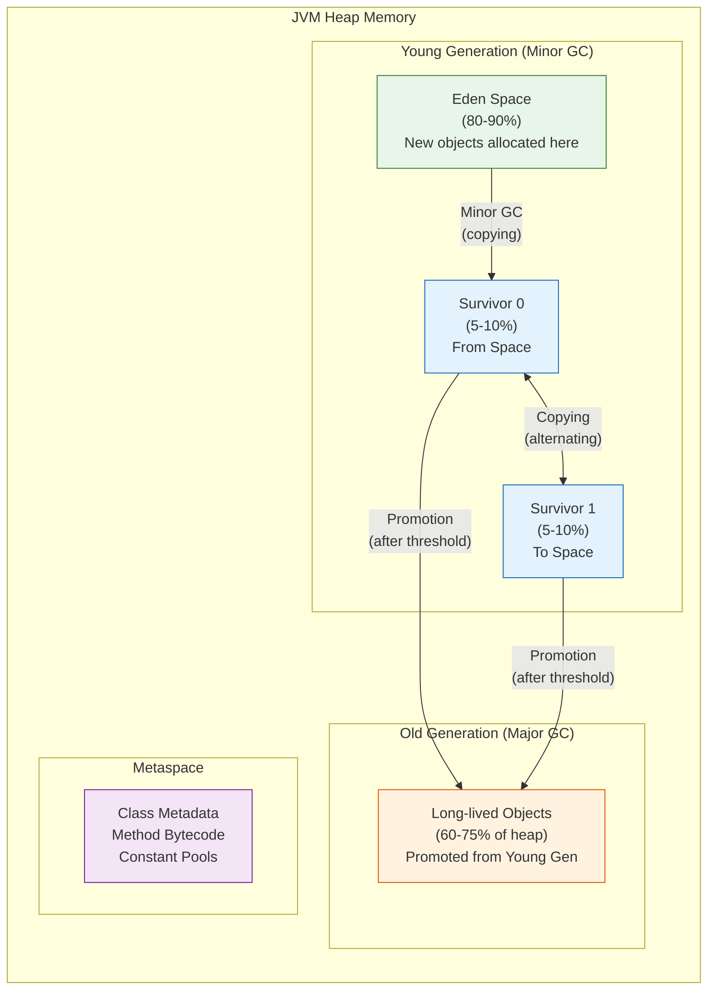

# 05. Garbage Collection - Complete Coverage

## Introduction

Garbage Collection (GC) is one of the most important features of the Java Virtual Machine. It automatically manages memory by identifying and reclaiming objects that are no longer in use, eliminating the need for manual memory management.

## GC Algorithm Decision Tree

```mermaid
flowchart TD
    Start[Select GC Algorithm] --> Q1{Application Type?}
    
    Q1 -->|"Embedded/Small"| Q2{Memory < 256MB?}
    Q2 -->|"Yes"| Serial["Serial GC<br/>-XX:+UseSerialGC"]
    Q2 -->|"No"| Parallel
    
    Q1 -->|"Batch/Throughput"| Parallel["Parallel GC<br/>-XX:+UseParallelGC"]
    
    Q1 -->|"Web/Interactive"| Q3{Heap Size?}
    Q3 -->|"4GB - 16GB"| G1["G1 GC<br/>-XX:+UseG1GC"]
    Q3 -->|"> 16GB"| Q4{Latency Target?}
    Q4 -->|"< 10ms"| ZGC
    Q4 -->"10-200ms" | G1
    
    Q1 -->|"Latency-Critical"| Q5{Java Version?}
    Q5 -->|"15+"| ZGC["ZGC<br/>-XX:+UseZGC"]
    Q5 -->|"12-14"| Shenandoah["Shenandoah<br/>-XX:+UseShenandoahGC"]
    
    Q1 -->|"Testing Only"| Epsilon["Epsilon GC<br/>-XX:+UseEpsilonGC"]
    
    style Serial fill:#ffcdd2
    style Parallel fill:#c8e6c9
    style G1 fill:#bbdefb
    style ZGC fill:#e1bee7
    style Shenandoah fill:#fff9c4
    style Epsilon fill:#f5f5f5
```

---

## Heap Memory Layout



---

## Complete GC Comparison Table

| Feature | Serial | Parallel | CMS | G1 | ZGC | Shenandoah | Epsilon |
|---------|--------|----------|-----|-----|-----|------------|---------|
| **Type** | Stop-the-world | Stop-the-world | Concurrent | Concurrent | Concurrent | Concurrent | No-op |
| **Threads** | Single | Multi | Multi | Multi | Multi | Multi | None |
| **Pause Target** | >500ms | >200ms | <200ms | <200ms | <10ms | <10ms | N/A |
| **Heap Size** | <256MB | 256MB-4GB | 256MB-4GB | 4GB-16GB | 16GB-16TB | 4GB-16GB | Any |
| **Java Version** | 1.3+ | 1.3+ | 1.4+ | 9+ | 11+ | 13+ | 11+ |
| **Compaction** | Yes | Yes | No | Yes | Yes | Yes | No |
| **Best For** | Small apps | Throughput | Low latency | Balanced | Ultra-low lat. | Low latency | Testing |

## When to Use Each Collector

### Serial GC
- Small applications (< 100MB)
- Single CPU machines
- Client-side applications
- Development/testing environments

### Parallel GC
- Batch processing
- Scientific computing
- Throughput-focused applications
- Background data processing

### CMS (Deprecated)
- Latency-sensitive applications (pre-Java 14)
- Web servers (pre-Java 14)
- Replaced by G1, ZGC, or Shenandoah

### G1 GC (Default)
- Balanced latency and throughput
- Large heaps (4GB - 16GB)
- Web applications
- Applications requiring predictable pauses

### ZGC
- Ultra-low latency applications
- Large heaps (16GB - 16TB)
- Real-time systems
- Financial trading platforms

### Shenandoah
- Latency-sensitive applications
- Large heaps
- Applications requiring consistent pause times

### Epsilon
- Performance testing
- Short-lived applications
- Applications with bounded memory
- Latency-sensitive workloads with bounded memory

## GC Configuration

```bash
# Serial GC
java -XX:+UseSerialGC MyApp

# Parallel GC
java -XX:+UseParallelGC MyApp

# CMS (deprecated)
java -XX:+UseConcMarkSweepGC MyApp

# G1 GC (default)
java -XX:+UseG1GC MyApp

# ZGC
java -XX:+UseZGC MyApp

# Shenandoah
java -XX:+UseShenandoahGC MyApp

# Epsilon
java -XX:+UseEpsilonGC MyApp
```

## Tuning Methodology

1. **Set clear performance goals**
   - Max pause time target
   - Throughput target (e.g., 95%)
   - Memory footprint target

2. **Enable GC logging**
   ```bash
   java -Xlog:gc*:file=gc.log:time,uptime,level,tags MyApp
   ```

3. **Run representative workload**
   - Simulate production traffic
   - Run for sufficient time (hours)
   - Include warm-up period

4. **Analyze GC logs**
   - Check pause times
   - Check throughput
   - Check memory usage

5. **Tune parameters iteratively**
   - Change ONE parameter at a time
   - Measure impact
   - Repeat until goals are met

## Common GC Issues

### Long GC Pauses
- **Symptom**: Application unresponsive
- **Solution**: Tune GC parameters, increase heap size

### Memory Leaks
- **Symptom**: Memory keeps growing
- **Solution**: Find and fix leak, analyze heap dump

### Frequent GC
- **Symptom**: High CPU usage
- **Solution**: Increase heap size, reduce allocation rate

### Promotion Failure
- **Symptom**: Full GC too often
- **Solution**: Increase old gen size, reduce promotion rate

## GC Log Analysis Tools

- **GCEasy**: Online GC log analyzer (https://gceasy.io)
- **GCViewer**: Desktop application (https://github.com/chewiebug/GCViewer)
- **JClarity Censum**: Commercial (advanced analysis)

## Best Practices

1. **Right-Size the Heap**: Match heap to application needs
2. **Choose Appropriate GC**: Based on latency/throughput requirements
3. **Monitor GC Activity**: Enable GC logging in production
4. **Optimize Object Creation**: Reuse objects, minimize temporary objects
5. **Prevent Memory Leaks**: Close resources, use weak references

## Why Garbage Collection Exists

Garbage collection exists because manual memory management is fundamentally error-prone and incompatible with Java's safety goals.

**Manual memory management causes two classes of bugs: memory leaks and dangling pointers.** In C/C++, developers must explicitly allocate (`malloc`/`new`) and deallocate (`free`/`delete`) memory. Failing to free memory causes leaks — the program consumes more and more memory until it crashes. Freeing memory too early or twice causes dangling pointers — reading freed memory produces undefined behavior, data corruption, or security vulnerabilities. These bugs are notoriously difficult to find because they may not manifest immediately or consistently.

**GC automates memory reclamation, eliminating these entire bug classes.** The garbage collector tracks which objects are still reachable from the program and automatically reclaims unreachable objects. Developers allocate objects freely and never worry about when or how to free them. The JVM guarantees that an object's memory is reclaimed only after no live references can reach it.

**Different GC algorithms serve different workload characteristics.** No single garbage collection strategy is optimal for all applications. Java provides multiple collectors because applications have fundamentally different priorities:

- **Throughput-focused** (batch processing, scientific computing): Maximize work done per time unit. Parallel GC pauses briefly but uses all CPU cores during collection.
- **Latency-focused** (web servers, real-time systems): Minimize pause times. G1, ZGC, and Shenandoah perform mostly concurrent collection, keeping pauses under 10ms.
- **Memory-constrained** (embedded systems, small containers): Minimize footprint. Serial GC uses minimal overhead for small heaps.
- **Testing** (short-lived processes): Epsilon GC skips collection entirely for benchmarking allocation overhead.

**GC also enables Java's safety guarantees.** Without GC, Java could not provide array bounds checking, null-safety (partial), or the reference type system (weak, soft, phantom references). GC is foundational to Java's "write once, run anywhere" philosophy — memory management is handled by the JVM, not the operating system.

## Interview Questions

1. **What is the difference between Serial and Parallel GC?** - Serial is single-threaded, Parallel is multi-threaded
2. **What is G1 GC?** - Region-based GC with predictable pause times
3. **What is ZGC?** - Ultra-low latency GC using load barriers
4. **When would you use Epsilon GC?** - Performance testing only

## References

- [Garbage Collection Tuning](https://docs.oracle.com/en/java/javase/21/docs/technotes/guides/vm/gctuning/index.html)
- "Java Performance" by Scott Oaks
- "The Garbage Collection Handbook" by Richard Jones

## Related Topics
- [Java Memory Model](../../00-knowledge-atoms/java-memory-model/) — How GC interacts with memory
- [Escape Analysis](../07-jit-compilation/) — JIT optimization before GC
- Performance Tuning — GC tuning flags
- Memory Leaks — What GC can't fix
- Safepoints — When GC pauses occur
