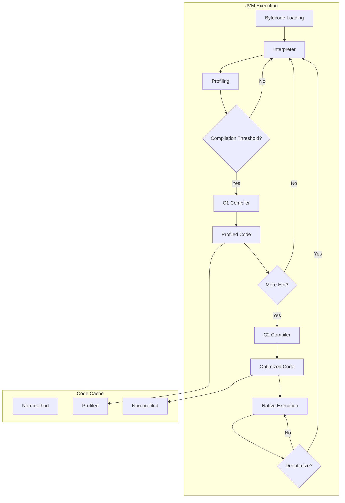
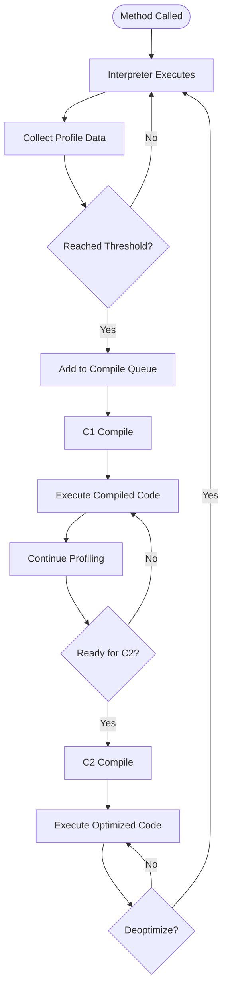
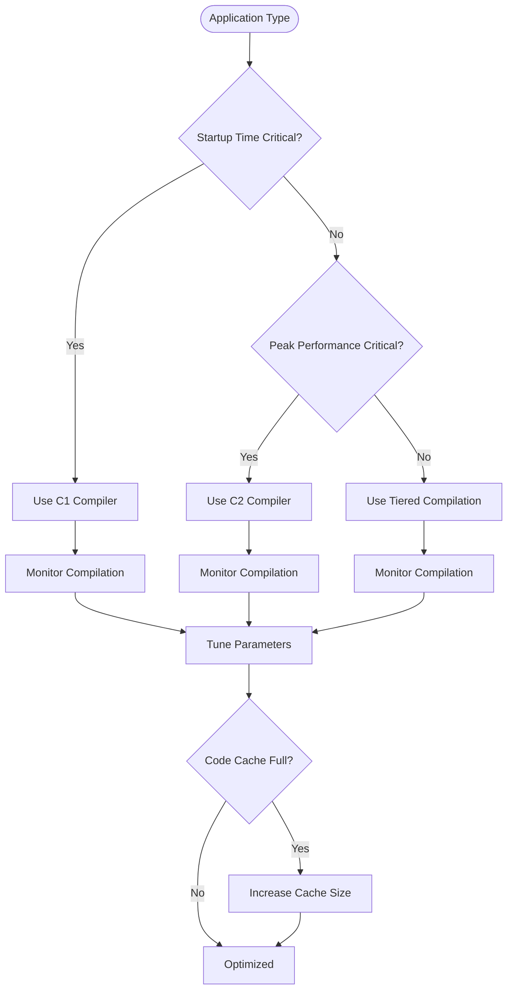

# 07. JIT Compilation

## Introduction

Just-In-Time (JIT) compilation is one of the most critical performance optimization techniques in the JVM. It transforms Java bytecode into native machine code at runtime, enabling Java applications to achieve performance comparable to natively compiled languages like C and C++. The JVM's JIT compiler analyzes running code and optimizes hot paths through techniques like method inlining, loop unrolling, and escape analysis.

This topic provides a deep dive into JIT compilation, covering the C1 and C2 compilers, tiered compilation, optimization techniques, and how to interact with the JIT compiler through flags and diagnostic tools.

## Learning Objectives

By the end of this topic, you will be able to:

- [ ] Explain how JIT compilation works in the JVM
- [ ] Differentiate between C1 and C2 compilers
- [ ] Understand tiered compilation levels and transitions
- [ ] Identify common JIT optimizations
- [ ] Use JIT diagnostic flags to inspect compilation behavior
- [ ] Tune JIT compilation for specific workloads
- [ ] Diagnose JIT-related performance issues

## Prerequisites

- Completion of Topic 06: GC Algorithms
- Understanding of JVM bytecode basics
- Familiarity with Java performance concepts
- Basic knowledge of CPU architecture

## Why This Concept Exists

### The Interpretation Problem

Java bytecode is initially interpreted by the JVM. Interpretation is slow because:
- Each bytecode instruction is decoded and executed one at a time
- No optimization is performed on frequently executed code
- The JVM cannot exploit CPU-specific features like SIMD instructions

### The Compilation Solution

JIT compilation solves this by:
- **Identifying Hot Code**: Methods called frequently are compiled to native code
- **Optimizing Hot Paths**: The compiler applies aggressive optimizations
- **CPU-Specific Code**: Generating code optimized for the target CPU
- **Adaptive Optimization**: Continuously profiling and recompiling

### Real-World Impact

JIT compilation affects:
- **Startup Time**: Interpretation is faster to start
- **Peak Performance**: Compiled code runs much faster
- **Memory Usage**: Compiled code consumes memory
- **Warm-up Time**: Applications need time to reach peak performance

## Problem Statement

### The Compilation Challenge

Without understanding JIT, developers face:
- **Slow Warm-up**: Applications take time to reach peak performance
- **Unexpected Deoptimization**: Compiled code is discarded
- **Compilation Overhead**: JIT compilation consumes CPU
- **Memory Pressure**: Compiled code cache fills up

### Real-World Example

A microservice experienced:
- 30-second warm-up time before reaching peak throughput
- Periodic latency spikes during JIT compilation
- High CPU usage during startup

The solution? Understanding JIT compilation and tuning compilation parameters.

## Theory

### JIT Compilation Pipeline

```
┌─────────────────────────────────────────────────────────────┐
│                    JIT Compilation Pipeline                   │
│                                                             │
│  ┌─────────────┐  ┌─────────────┐  ┌─────────────┐        │
│  │  Bytecode   │  │Interpreter  │  │  Profiling  │        │
│  │  Loading    │──│  Execution  │──│  Collection │        │
│  └─────────────┘  └─────────────┘  └─────────────┘        │
│                                                    │        │
│                                                    ▼        │
│  ┌─────────────┐  ┌─────────────┐  ┌─────────────┐        │
│  │  Native     │  │  C2         │  │  C1         │        │
│  │  Execution  │◄─│  Compilation│◄─│ Compilation │        │
│  └─────────────┘  └─────────────┘  └─────────────┘        │
└─────────────────────────────────────────────────────────────┘
```

### C1 vs C2 Compilers

```
┌─────────────────────────────────────────────────────────────┐
│                    JIT Compiler Comparison                    │
│                                                             │
│  ┌─────────────────────────────────────────────────────┐   │
│  │  C1 (Client) Compiler                               │   │
│  │  - Fast compilation                                 │   │
│  │  - Basic optimizations                              │   │
│  │  - Lower memory usage                               │   │
│  │  - Good for startup performance                     │   │
│  └─────────────────────────────────────────────────────┘   │
│                                                             │
│  ┌─────────────────────────────────────────────────────┐   │
│  │  C2 (Server) Compiler                               │   │
│  │  - Slower compilation                               │   │
│  │  - Aggressive optimizations                         │   │
│  │  - Higher memory usage                              │   │
│  │  - Good for peak performance                        │   │
│  └─────────────────────────────────────────────────────┘   │
│                                                             │
│  ┌─────────────────────────────────────────────────────┐   │
│  │  Graal JIT (Java 17+)                              │   │
│  │  - Written in Java                                 │   │
│  │  - Advanced optimizations                          │   │
│  │  - Experimental                                     │   │
│  └─────────────────────────────────────────────────────┘   │
└─────────────────────────────────────────────────────────────┘
```

### Tiered Compilation Levels

```
Level 0: Interpreter
  - Bytecode is interpreted
  - Profiling data is collected

Level 1: C1 - Simple
  - No profiling
  - Limited optimizations
  - Fast compilation

Level 2: C1 - Limited
  - Limited profiling
  - Some optimizations
  - Moderate compilation time

Level 3: C1 - Full
  - Full profiling
  - Most optimizations
  - Longer compilation time

Level 4: C2 - Full
  - Full optimizations
  - Aggressive inlining
  - Longest compilation time
```

## Internal Working

### Method Compilation Flow

```
1. Method Entry
   ├── Interpreter counts invocations
   └── Profiling data collected

2. Compilation Threshold
   ├── Reached compilation threshold
   └── Added to compilation queue

3. C1 Compilation (Levels 1-3)
   ├── Bytecode analyzed
   ├── Basic optimizations applied
   └── Native code generated

4. Profiling in C1
   ├── Type profiles collected
   ├── Branch profiles collected
   └── Passed to C2

5. C2 Compilation (Level 4)
   ├── Aggressive optimizations
   ├── Method inlining
   ├── Loop optimizations
   └── Final native code

6. Deoptimization (if needed)
   ├── Profile invalidation
   ├── Compiled code discarded
   └── Return to interpreter
```

### Optimization Techniques

```
┌─────────────────────────────────────────────────────────────┐
│                    JIT Optimizations                         │
│                                                             │
│  ┌─────────────────────────────────────────────────────┐   │
│  │  Method Inlining                                     │   │
│  │  - Replaces method call with method body            │   │
│  │  - Reduces call overhead                            │   │
│  │  - Enables further optimizations                    │   │
│  └─────────────────────────────────────────────────────┘   │
│                                                             │
│  ┌─────────────────────────────────────────────────────┐   │
│  │  Loop Optimizations                                  │   │
│  │  - Loop unrolling                                    │   │
│  │  - Loop inversion                                    │   │
│  │  - Bounds check elimination                         │   │
│  └─────────────────────────────────────────────────────┘   │
│                                                             │
│  ┌─────────────────────────────────────────────────────┐   │
│  │  Escape Analysis                                     │   │
│  │  - Determines if objects escape the method          │   │
│  │  - Can allocate objects on stack                    │   │
│  │  - Reduces GC pressure                              │   │
│  └─────────────────────────────────────────────────────┘   │
│                                                             │
│  ┌─────────────────────────────────────────────────────┐   │
│  │  Dead Code Elimination                               │   │
│  │  - Removes unreachable code                         │   │
│  │  - Reduces code size                                │   │
│  └─────────────────────────────────────────────────────┘   │
└─────────────────────────────────────────────────────────────┘
```

## JVM Perspective

### What the JVM Sees

The JVM sees:
- **Compilation Units**: Methods and loops to compile
- **Profile Data**: Type information, branch frequencies
- **Code Cache**: Storage for compiled native code
- **Deoptimization Events**: When compiled code is invalidated

### Code Cache Management

```
┌─────────────────────────────────────────────────────────────┐
│                    Code Cache                                │
│                                                             │
│  ┌─────────────────────────────────────────────────────┐   │
│  │  Non-method (8MB default)                           │   │
│  │  - VM internal code                                 │   │
│  │  - Adapter code                                     │   │
│  └─────────────────────────────────────────────────────┘   │
│                                                             │
│  ┌─────────────────────────────────────────────────────┐   │
│  │  Profiled (22MB default)                             │   │
│  │  - C1 compiled code                                 │   │
│  │  - With profiling                                   │   │
│  └─────────────────────────────────────────────────────┘   │
│                                                             │
│  ┌─────────────────────────────────────────────────────┐   │
│  │  Non-profiled (125MB default)                        │   │
│  │  - C2 compiled code                                 │   │
│  │  - Fully optimized                                  │   │
│  └─────────────────────────────────────────────────────┘   │
└─────────────────────────────────────────────────────────────┘
```

## Memory Representation

### Compiled Code in Memory

```
┌─────────────────────────────────────────────────────────────┐
│                    Compiled Method Layout                     │
│                                                             │
│  ┌─────────────────────────────────────────────────────┐   │
│  │  Header                                             │   │
│  │  - Method metadata                                  │   │
│  │  - Size information                                 │   │
│  └─────────────────────────────────────────────────────┘   │
│                                                             │
│  ┌─────────────────────────────────────────────────────┐   │
│  │  Instructions                                       │   │
│  │  - Native machine code                              │   │
│  │  - Platform-specific                                │   │
│  └─────────────────────────────────────────────────────┘   │
│                                                             │
│  ┌─────────────────────────────────────────────────────┐   │
│  │  Relocation Info                                    │   │
│  │  - For code patching                                │   │
│  │  - Deoptimization support                           │   │
│  └─────────────────────────────────────────────────────┘   │
└─────────────────────────────────────────────────────────────┘
```

## Architecture Diagram (Mermaid)



## Flow Diagram (Mermaid)



## Syntax (with examples)

### JIT Compilation Flags

```bash
# Disable JIT compilation (interpretation only)
java -Xint MyApp

# Force C1 compilation only
java -client MyApp

# Force C2 compilation only
java -server MyApp

# Enable tiered compilation (default)
java -XX:+TieredCompilation MyApp

# Set compilation thresholds
java -XX:CompileThreshold=10000 MyApp

# Set tiered stop at level
java -XX:TieredStopAtLevel=4 MyApp
```

### JIT Diagnostic Flags

```bash
# Print compilation events
java -XX:+PrintCompilation MyApp

# Print inlining decisions
java -XX:+UnlockDiagnosticVMOptions -XX:+PrintInlining MyApp

# Print compilation time
java -XX:+PrintCompilation -XX:+PrintInlining MyApp

# Print escape analysis
java -XX:+UnlockDiagnosticVMOptions -XX:+PrintEscapeAnalysis MyApp
```

## Easy Example

### Basic JIT Compilation Demo

```java
package academy.javaengineering.jvm.jit;

/**
 * Demonstrates basic JIT compilation concepts.
 */
public class BasicJITDemo {
    
    public static void main(String[] args) {
        System.out.println("=== Basic JIT Demo ===\n");
        
        // Method that will be JIT compiled
        System.out.println("Warming up JIT compiler...");
        for (int i = 0; i < 100_000; i++) {
            computeSum(i);
        }
        
        // Now measure performance
        long startTime = System.nanoTime();
        for (int i = 0; i < 100_000; i++) {
            computeSum(i);
        }
        long duration = (System.nanoTime() - startTime) / 1_000_000;
        
        System.out.printf("Computation time: %d ms%n", duration);
        System.out.println("\nJIT compiler has optimized the hot method.");
    }
    
    private static long computeSum(int n) {
        long sum = 0;
        for (int i = 0; i < n; i++) {
            sum += i;
        }
        return sum;
    }
}
```

## Medium Example

### JIT Compilation Monitoring

```java
package academy.javaengineering.jvm.jit;

import java.lang.management.*;
import java.util.*;
import java.util.concurrent.*;

/**
 * Monitors JIT compilation activity.
 */
public class JITCompilationMonitor {
    
    private final CompilationMXBean compilationBean = 
        ManagementFactory.getCompilationMXBean();
    
    public void monitorCompilation() {
        System.out.println("=== JIT Compilation Monitor ===\n");
        
        // Print compilation info
        System.out.println("--- Compilation Information ---");
        System.out.printf("Compiler: %s%n", compilationBean.getName());
        
        // Monitor compilation time
        long totalTime = compilationBean.getTotalCompilationTime();
        System.out.printf("Total compilation time: %d ms%n", totalTime);
        
        // Simulate workload
        System.out.println("\n--- Simulating Workload ---");
        simulateWorkload();
        
        // Print updated info
        totalTime = compilationBean.getTotalCompilationTime();
        System.out.printf("Total compilation time after workload: %d ms%n", totalTime);
    }
    
    private void simulateWorkload() {
        // Create workload that triggers JIT compilation
        for (int i = 0; i < 10; i++) {
            long start = System.nanoTime();
            for (int j = 0; j < 1_000_000; j++) {
                compute(j);
            }
            long duration = (System.nanoTime() - start) / 1_000_000;
            System.out.printf("Iteration %d: %d ms%n", i + 1, duration);
        }
    }
    
    private long compute(int n) {
        long result = 0;
        for (int i = 0; i < n; i++) {
            result += i * i;
        }
        return result;
    }
    
    public static void main(String[] args) {
        JITCompilationMonitor monitor = new JITCompilationMonitor();
        monitor.monitorCompilation();
    }
}
```

## Hard Example

### JIT Optimization Analysis

```java
package academy.javaengineering.jvm.jit;

import java.util.*;
import java.util.concurrent.*;

/**
 * Analyzes JIT optimization effects on different code patterns.
 */
public class JITOptimizationAnalysis {
    
    public static void main(String[] args) throws InterruptedException {
        System.out.println("=== JIT Optimization Analysis ===\n");
        
        // Test method inlining
        testMethodInlining();
        
        // Test loop optimization
        testLoopOptimization();
        
        // Test escape analysis
        testEscapeAnalysis();
        
        // Test dead code elimination
        testDeadCodeElimination();
    }
    
    private static void testMethodInlining() throws InterruptedException {
        System.out.println("--- Method Inlining Test ---");
        
        // Warm up
        for (int i = 0; i < 100_000; i++) {
            inlinedMethod(i);
        }
        
        // Benchmark
        long start = System.nanoTime();
        for (int i = 0; i < 10_000_000; i++) {
            inlinedMethod(i);
        }
        long duration = (System.nanoTime() - start) / 1_000_000;
        
        System.out.printf("Inlined method: %d ms%n", duration);
        System.out.println("JIT should inline this small method.\n");
    }
    
    private static int inlinedMethod(int x) {
        return x * 2 + 1;
    }
    
    private static void testLoopOptimization() throws InterruptedException {
        System.out.println("--- Loop Optimization Test ---");
        
        // Warm up
        for (int i = 0; i < 100_000; i++) {
            loopComputation(1000);
        }
        
        // Benchmark
        long start = System.nanoTime();
        for (int i = 0; i < 10_000; i++) {
            loopComputation(1000);
        }
        long duration = (System.nanoTime() - start) / 1_000_000;
        
        System.out.printf("Loop computation: %d ms%n", duration);
        System.out.println("JIT should unroll and optimize loops.\n");
    }
    
    private static long loopComputation(int n) {
        long sum = 0;
        for (int i = 0; i < n; i++) {
            sum += i;
        }
        return sum;
    }
    
    private static void testEscapeAnalysis() throws InterruptedException {
        System.out.println("--- Escape Analysis Test ---");
        
        // Warm up
        for (int i = 0; i < 100_000; i++) {
            escapeAnalysisMethod(i);
        }
        
        // Benchmark
        long start = System.nanoTime();
        for (int i = 0; i < 1_000_000; i++) {
            escapeAnalysisMethod(i);
        }
        long duration = (System.nanoTime() - start) / 1_000_000;
        
        System.out.printf("Escape analysis: %d ms%n", duration);
        System.out.println("JIT may allocate Point on stack.\n");
    }
    
    private static int escapeAnalysisMethod(int n) {
        Point p = new Point(n, n);
        return p.x + p.y;
    }
    
    private static class Point {
        final int x;
        final int y;
        
        Point(int x, int y) {
            this.x = x;
            this.y = y;
        }
    }
    
    private static void testDeadCodeElimination() throws InterruptedException {
        System.out.println("--- Dead Code Elimination Test ---");
        
        // Warm up
        for (int i = 0; i < 100_000; i++) {
            deadCodeMethod(i);
        }
        
        // Benchmark
        long start = System.nanoTime();
        for (int i = 0; i < 10_000_000; i++) {
            deadCodeMethod(i);
        }
        long duration = (System.nanoTime() - start) / 1_000_000;
        
        System.out.printf("Dead code elimination: %d ms%n", duration);
        System.out.println("JIT removes unreachable code.\n");
    }
    
    private static int deadCodeMethod(int n) {
        int result = n * 2;
        // Dead code - never executed
        if (false) {
            result += 1000;
        }
        return result;
    }
}
```

## Enterprise Example

### Production JIT Monitoring System

```java
package academy.javaengineering.jvm.jit;

import java.lang.management.*;
import java.util.*;
import java.util.concurrent.*;

/**
 * Enterprise-grade JIT compilation monitoring.
 */
public class EnterpriseJITMonitor {
    
    private final ScheduledExecutorService scheduler = Executors.newScheduledThreadPool(3);
    private final CompilationMXBean compilationBean = ManagementFactory.getCompilationMXBean();
    private final ThreadMXBean threadBean = ManagementFactory.getThreadMXBean();
    private final MemoryMXBean memoryBean = ManagementFactory.getMemoryMXBean();
    
    private final List<CompilationSnapshot> snapshots = new CopyOnWriteArrayList<>();
    private volatile boolean running = true;
    
    public void startMonitoring() {
        System.out.println("=== Enterprise JIT Monitoring System ===\n");
        
        // Schedule compilation metrics collection
        scheduler.scheduleAtFixedRate(this::collectCompilationMetrics, 0, 5, TimeUnit.SECONDS);
        
        // Schedule code cache monitoring
        scheduler.scheduleAtFixedRate(this::monitorCodeCache, 0, 30, TimeUnit.SECONDS);
        
        // Schedule optimization analysis
        scheduler.scheduleAtFixedRate(this::analyzeOptimizations, 0, 1, TimeUnit.MINUTES);
        
        System.out.println("JIT monitoring started. Press Ctrl+C to stop.\n");
    }
    
    private void collectCompilationMetrics() {
        try {
            long totalCompilationTime = compilationBean.getTotalCompilationTime();
            String compilerName = compilationBean.getName();
            
            CompilationSnapshot snapshot = new CompilationSnapshot(
                compilerName,
                totalCompilationTime,
                System.currentTimeMillis()
            );
            
            snapshots.add(snapshot);
            
            // Keep only last 1000 snapshots
            if (snapshots.size() > 1000) {
                snapshots.remove(0);
            }
        } catch (Exception e) {
            System.err.println("Error collecting compilation metrics: " + e.getMessage());
        }
    }
    
    private void monitorCodeCache() {
        try {
            MemoryUsage nonHeapUsage = memoryBean.getNonHeapMemoryUsage();
            
            System.out.println("\n--- Code Cache Status ---");
            System.out.printf("Non-Heap Used: %d MB%n", nonHeapUsage.getUsed() / (1024 * 1024));
            System.out.printf("Non-Heap Committed: %d MB%n", nonHeapUsage.getCommitted() / (1024 * 1024));
            System.out.printf("Non-Heap Max: %d MB%n", nonHeapUsage.getMax() / (1024 * 1024));
            
            // Check if code cache is running low
            double usagePercent = (double) nonHeapUsage.getUsed() / nonHeapUsage.getMax() * 100;
            if (usagePercent > 80) {
                System.out.println("WARNING: Code cache usage is high: " + 
                    String.format("%.1f%%", usagePercent));
            }
        } catch (Exception e) {
            System.err.println("Error monitoring code cache: " + e.getMessage());
        }
    }
    
    private void analyzeOptimizations() {
        try {
            System.out.println("\n" + "=".repeat(60));
            System.out.println("JIT COMPILATION ANALYSIS REPORT");
            System.out.println("=".repeat(60));
            
            // Compilation statistics
            System.out.println("\n--- Compilation Statistics ---");
            System.out.printf("Compiler: %s%n", compilationBean.getName());
            System.out.printf("Total Compilation Time: %d ms%n", 
                compilationBean.getTotalCompilationTime());
            
            // Thread information
            System.out.println("\n--- Thread Information ---");
            System.out.printf("Active Threads: %d%n", threadBean.getThreadCount());
            System.out.printf("Peak Threads: %d%n", threadBean.getPeakThreadCount());
            
            // Compilation trend
            if (snapshots.size() >= 2) {
                CompilationSnapshot first = snapshots.get(0);
                CompilationSnapshot last = snapshots.get(snapshots.size() - 1);
                long timeDiff = last.timestamp - first.timestamp;
                long compilationDiff = last.totalCompilationTime - first.totalCompilationTime;
                
                System.out.println("\n--- Compilation Trend ---");
                System.out.printf("Time Window: %d seconds%n", timeDiff / 1000);
                System.out.printf("Compilation Time Added: %d ms%n", compilationDiff);
                System.out.printf("Compilation Rate: %.2f ms/sec%n", 
                    compilationDiff * 1000.0 / timeDiff);
            }
            
            System.out.println("=".repeat(60));
        } catch (Exception e) {
            System.err.println("Error analyzing optimizations: " + e.getMessage());
        }
    }
    
    public void stop() {
        running = false;
        scheduler.shutdown();
        try {
            if (!scheduler.awaitTermination(10, TimeUnit.SECONDS)) {
                scheduler.shutdownNow();
            }
        } catch (InterruptedException e) {
            scheduler.shutdownNow();
            Thread.currentThread().interrupt();
        }
    }
    
    public static void main(String[] args) {
        EnterpriseJITMonitor monitor = new EnterpriseJITMonitor();
        monitor.startMonitoring();
        
        // Simulate some workload
        simulateApplicationWorkload();
        
        // Run for 5 minutes
        try {
            Thread.sleep(300_000);
        } catch (InterruptedException e) {
            Thread.currentThread().interrupt();
        }
        
        monitor.stop();
    }
    
    private static void simulateApplicationWorkload() {
        // Background workload to trigger JIT compilation
        new Thread(() -> {
            while (true) {
                for (int i = 0; i < 1000; i++) {
                    compute(i);
                }
                try {
                    Thread.sleep(100);
                } catch (InterruptedException e) {
                    break;
                }
            }
        }).start();
    }
    
    private static long compute(int n) {
        long result = 0;
        for (int i = 0; i < n; i++) {
            result += i * i;
        }
        return result;
    }
    
    private static class CompilationSnapshot {
        final String compilerName;
        final long totalCompilationTime;
        final long timestamp;
        
        CompilationSnapshot(String compilerName, long totalCompilationTime, long timestamp) {
            this.compilerName = compilerName;
            this.totalCompilationTime = totalCompilationTime;
            this.timestamp = timestamp;
        }
    }
}
```

## Performance Considerations

### JIT Compilation Performance Impact

| Phase | CPU Impact | Memory Impact | Duration |
|-------|------------|---------------|----------|
| Interpretation | Low | None | Startup |
| C1 Compilation | Medium | Low | Warm-up |
| C2 Compilation | High | Medium | Warm-up |
| Native Execution | Low | High | Steady-state |

### Compilation Overhead Management

1. **Minimize Startup Time**
   - Use C1 compiler for faster warm-up
   - Pre-compile critical methods with AOT
   - Reduce compilation thresholds

2. **Maximize Peak Performance**
   - Allow C2 compilation for hot methods
   - Ensure sufficient code cache
   - Avoid deoptimization triggers

3. **Balance Trade-offs**
   - Monitor compilation time
   - Track code cache usage
   - Profile application workloads

## Time & Space Complexity

### Compilation Time Complexity

| Compiler | Time Complexity | Space Complexity |
|----------|-----------------|------------------|
| C1 | O(n) | O(n) |
| C2 | O(n²) | O(n²) |

Where n is the method bytecode size.

### Code Cache Requirements

| Application Type | Recommended Code Cache |
|------------------|------------------------|
| Small services | 64MB |
| Medium applications | 128MB |
| Large applications | 256MB |
| Complex applications | 512MB |

## Thread Safety

### JIT Compilation Thread Safety

JIT compilation is thread-safe because:
- Compilation queue is synchronized
- Code cache updates are atomic
- Deoptimization is safe for concurrent access

### Safe Compilation Monitoring

```java
// Thread-safe compilation monitoring
public class ThreadSafeJITMonitor {
    private final CompilationMXBean compilationBean = 
        ManagementFactory.getCompilationMXBean();
    private final AtomicLong lastCompilationTime = new AtomicLong(0);
    
    public long getCompilationTimeDelta() {
        long currentTime = compilationBean.getTotalCompilationTime();
        long lastTime = lastCompilationTime.getAndSet(currentTime);
        return currentTime - lastTime;
    }
}
```

## Best Practices

### JIT Compilation Best Practices

1. **Warm Up Applications**
   - Run representative workloads before measuring
   - Allow JIT compilation to complete
   - Use consistent warm-up periods

2. **Monitor Compilation**
   - Enable compilation logging
   - Track code cache usage
   - Monitor deoptimization events

3. **Avoid Deoptimization**
   - Avoid polymorphic call sites when possible
   - Use final classes and methods
   - Minimize class loading at runtime

4. **Tune for Workload**
   - Adjust compilation thresholds
   - Configure code cache size
   - Choose appropriate compilation mode

5. **Profile Before Optimizing**
   - Identify actual hot methods
   - Measure compilation impact
   - Validate optimization effects

## Common Mistakes

### Mistake 1: Not Warming Up

```java
// BAD: Measuring without warm-up
public class BadBenchmark {
    public static void main(String[] args) {
        long start = System.nanoTime();
        for (int i = 0; i < 1000; i++) {
            compute(i);
        }
        long duration = System.nanoTime() - start;
        System.out.println("Time: " + duration + " ns");
    }
}

// GOOD: With proper warm-up
public class GoodBenchmark {
    public static void main(String[] args) {
        // Warm up
        for (int i = 0; i < 100_000; i++) {
            compute(i);
        }
        
        // Now measure
        long start = System.nanoTime();
        for (int i = 0; i < 1000; i++) {
            compute(i);
        }
        long duration = System.nanoTime() - start;
        System.out.println("Time: " + duration + " ns");
    }
}
```

### Mistake 2: Code Cache Too Small

```bash
# BAD: Default code cache for large application
java MyApp

# GOOD: Sufficient code cache
java -XX:ReservedCodeCacheSize=256m MyApp
```

### Mistake 3: Triggering Deoptimization

```java
// BAD: Polymorphic call site
public class BadPolymorphism {
    interface Animal { void speak(); }
    static class Dog implements Animal { public void speak() {} }
    static class Cat implements Animal { public void speak() {} }
    
    public void makeSpeak(Animal a) {
        a.speak();  // Hard to optimize
    }
}

// GOOD: Monomorphic call site
public class GoodPolymorphism {
    public void makeSpeak(Dog d) {
        d.speak();  // Easy to optimize
    }
}
```

## Pitfalls & Warnings

### Pitfall 1: Deoptimization Storms

```java
// BAD: Pattern that causes deoptimization
public class DeoptimizationStorm {
    private static boolean useFastPath = true;
    
    public int compute(int x) {
        if (useFastPath) {
            return x * 2;  // Compiled path
        }
        return x + 1000;  // Deoptimized
    }
}

// GOOD: Stable code paths
public class StableCode {
    public int compute(int x) {
        return x * 2;  // Always same path
    }
}
```

### Pitfall 2: Tiered Compilation Overhead

```bash
# BAD: Disabling tiered compilation unnecessarily
java -XX:-TieredCompilation MyApp

# GOOD: Using tiered compilation appropriately
java -XX:+TieredCompilation MyApp
```

## Debugging Tips

### JIT Debug Commands

```bash
# Print compilation events
java -XX:+PrintCompilation MyApp

# Print inlining decisions
java -XX:+UnlockDiagnosticVMOptions -XX:+PrintInlining MyApp

# Print compiled methods
java -XX:+UnlockDiagnosticVMOptions -XX:+PrintAssembly MyApp

# Print code cache usage
java -XX:+UnlockDiagnosticVMOptions -XX:+PrintCodeCache MyApp

# Print deoptimization events
java -XX:+UnlockDiagnosticVMOptions -XX:+PrintDeoptimizationDetails MyApp
```

### Common JIT Issues

| Issue | Symptom | Solution |
|-------|---------|----------|
| Slow warm-up | Low initial performance | Allow warm-up time |
| Deoptimization | Periodic latency spikes | Avoid unstable call sites |
| Code cache full | Compilation stops | Increase ReservedCodeCacheSize |
| Compilation delay | High CPU during warm-up | Adjust CompileThreshold |

## Comparison Table

### JIT Compiler Comparison

| Feature | C1 | C2 | Graal |
|---------|----|----|-------|
| **Compilation Speed** | Fast | Slow | Slow |
| **Optimization Level** | Basic | Aggressive | Advanced |
| **Memory Usage** | Low | High | High |
| **Code Quality** | Good | Better | Best |
| **Startup Impact** | Low | Medium | Medium |

### Tiered Compilation Levels

| Level | Compiler | Profiling | Optimizations |
|-------|----------|-----------|---------------|
| 0 | Interpreter | No | None |
| 1 | C1 | No | Basic |
| 2 | C1 | Limited | Moderate |
| 3 | C1 | Full | Most |
| 4 | C2 | Full | All |

## Decision Tree (Mermaid)



## Interview Questions (15+)

### Basic Questions

1. **What is JIT compilation?**
   - JIT (Just-In-Time) compilation is the process of compiling bytecode to native machine code at runtime

2. **What is the difference between C1 and C2 compilers?**
   - C1: Fast compilation, basic optimizations, good for startup
   - C2: Slower compilation, aggressive optimizations, good for peak performance

3. **What is tiered compilation?**
   - A compilation strategy that uses multiple compilation levels, starting with C1 and potentially upgrading to C2

4. **What is the code cache?**
   - A memory area where JIT-compiled native code is stored

5. **What is method inlining?**
   - Replacing a method call with the method's body to reduce call overhead

### Intermediate Questions

6. **What triggers JIT compilation?**
   - Method invocation count reaches a threshold (CompileThreshold)

7. **What is deoptimization?**
   - Discarding compiled code and returning to interpretation when assumptions are invalidated

8. **What is escape analysis?**
   - Analyzing whether objects escape a method to enable stack allocation

9. **How does the JVM decide which methods to compile?**
   - Based on invocation count, loop back-edge count, and profiling data

10. **What is the difference between -client and -server?**
    - -client: Uses C1 compiler
    - -server: Uses C2 compiler

### Advanced Questions

11. **What is on-stack replacement (OSR)?**
    - Compiling a loop while it's running and switching to compiled code mid-execution

12. **What is polymorphic inline cache?**
    - A cache that stores type information for virtual method calls to enable monomorphic inlining

13. **How does JIT handle exception handling?**
    - Exception handlers are compiled separately and optimized for the common case (no exception)

14. **What is speculative optimization?**
    - Optimizing based on runtime assumptions that may be invalidated later

15. **How does Graal JIT differ from C2?**
    - Graal is written in Java, supports newer optimizations, and enables Java-based compiler research

16. **What is AOT compilation?**
    - Ahead-of-Time compilation that compiles bytecode to native code before runtime

17. **How does JIT compilation affect garbage collection?**
    - Compiled code may contain GC safepoints and may affect object pinning

## Exercises (3 levels)

### Level 1: Basic

1. **JIT Compilation Observation**
   - Run a simple program with `-XX:+PrintCompilation` and observe compilation events
   - Identify which methods get compiled

2. **Compilation Time Measurement**
   - Measure the compilation time of a program using `CompilationMXBean`
   - Compare with and without tiered compilation

### Level 2: Intermediate

3. **Deoptimization Analysis**
   - Create a program that triggers deoptimization
   - Use `-XX:+PrintDeoptimizationDetails` to analyze the events

4. **Code Cache Tuning**
   - Experiment with different `ReservedCodeCacheSize` values
   - Monitor code cache usage and compilation behavior

### Level 3: Advanced

5. **JIT Optimization Profiling**
   - Create a benchmark that compares JIT-optimized vs interpreted performance
   - Analyze the impact of different optimizations

6. **Custom Compilation Monitoring**
   - Build a tool that monitors JIT compilation in real-time
   - Track compilation events, deoptimizations, and code cache usage

## Summary

### Key Takeaways

1. **JIT is Critical**: JIT compilation is essential for Java performance
2. **C1 vs C2**: Different compilers for different goals
3. **Tiered Compilation**: Best of both worlds
4. **Warm-up Matters**: Applications need time to reach peak performance
5. **Monitoring is Key**: Track compilation behavior in production

### Next Steps

- Continue to Topic 08: Profiling Tools
- Study JVM performance tuning guides
- Practice with JIT diagnostic flags
- Read "Java Performance" by Scott Oaks

## References

### Official Documentation
- [JIT Compilation](https://docs.oracle.com/en/java/javase/21/docs/specs/man/java.html)
- [C1 and C2 Compilers](https://openjdk.org/groups/hotspot/docs/HotSpotGlossary.html)
- [Tiered Compilation](https://openjdk.org/projects/jdk/15/tiered-compilation)

### Books
- "Java Performance" by Scott Oaks
- "Optimizing Java" by Benjamin J. Evans
- "Inside the Java Virtual Machine" by Bill Venners

### Online Resources
- [JIT Compilation Guide](https://www.baeldung.com/jit-compiler)
- [HotSpot Internals](https://openjdk.org/groups/hotspot/)
- [JIT Optimizations](https://wiki.openjdk.java.net/display/HotSpot/Server+Compiler)

### Tools
- [JITWatch](https://github.com/AdoptOpenJDK/jitwatch)
- [JMH](https://openjdk.java.net/projects/code-tools/jmh/)
- [perf](https://perf.wiki.kernel.org/)

---

**Next Topic**: [08. Profiling Tools](../08-profiling-tools/README.md)
