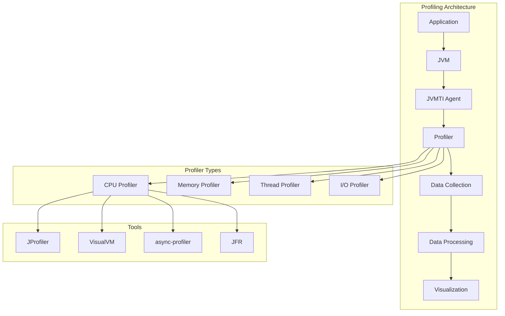

# 08. Profiling Tools

## Introduction

Profiling tools are essential for understanding and optimizing Java application performance. They help identify bottlenecks, memory issues, thread contention, and CPU utilization patterns. From lightweight sampling profilers to comprehensive production monitoring tools, the right profiler can dramatically improve your ability to diagnose and fix performance problems.

This topic covers the major Java profiling tools including JProfiler, VisualVM, async-profiler, Java Flight Recorder (JFR), and various command-line tools. We'll explore when to use each tool, how to configure them, and how to interpret their output.

## Learning Objectives

By the end of this topic, you will be able to:

- [ ] Select appropriate profiling tools for different scenarios
- [ ] Use JProfiler, VisualVM, and async-profiler effectively
- [ ] Configure Java Flight Recorder for production profiling
- [ ] Analyze profiling output to identify performance issues
- [ ] Set up continuous profiling in production environments
- [ ] Interpret CPU, memory, and thread profiling data
- [ ] Optimize application performance based on profiling results

## Prerequisites

- Completion of Topic 07: JIT Compilation
- Understanding of JVM internals
- Familiarity with Java applications
- Basic knowledge of performance concepts

## Why This Concept Exists

### The Performance Mystery

Without profiling, developers face:
- **Guesswork**: Trying to optimize without knowing the actual bottleneck
- **Blind Tuning**: Changing settings without measuring impact
- **Reactive debugging**: Only investigating after users report issues
- **Inefficient optimization**: Optimizing code that isn't actually slow

### The Profiling Solution

Profiling tools provide:
- **Data-driven decisions**: Optimize based on actual measurements
- **Root cause analysis**: Find the exact source of performance issues
- **Continuous monitoring**: Track performance over time
- **Production visibility**: Understand behavior in real environments

### Real-World Impact

Profiling affects:
- **Development Speed**: Faster identification of bottlenecks
- **Application Performance**: Higher throughput, lower latency
- **Resource Usage**: Better CPU and memory efficiency
- **User Experience**: More responsive applications

## Problem Statement

### The Profiling Challenge

Without profiling tools, developers face:
- **Performance Mysteries**: Applications are slow but reasons are unknown
- **Memory Leaks**: Memory grows but source is undetectable
- **Thread Contention**: Deadlocks and race conditions are hard to find
- **Production Issues**: Problems only occur under real workloads

### Real-World Example

A financial trading platform experienced:
- 200ms latency spikes every few minutes
- Memory usage growing from 4GB to 12GB over 24 hours
- CPU spikes to 100% during peak hours

The solution? Using profiling tools to identify and fix the root causes.

## Theory

### Profiling Tool Categories

```
┌─────────────────────────────────────────────────────────────┐
│                    Profiling Tools                           │
│                                                             │
│  ┌─────────────────────────────────────────────────────┐   │
│  │  CPU Profilers                                       │   │
│  │  - Sample or instrument code                        │   │
│  │  - Identify hot methods                             │   │
│  │  - Measure execution time                           │   │
│  └─────────────────────────────────────────────────────┘   │
│                                                             │
│  ┌─────────────────────────────────────────────────────┐   │
│  │  Memory Profilers                                    │   │
│  │  - Track object allocations                         │   │
│  │  - Detect memory leaks                              │   │
│  │  - Analyze heap usage                               │   │
│  └─────────────────────────────────────────────────────┘   │
│                                                             │
│  ┌─────────────────────────────────────────────────────┐   │
│  │  Thread Profilers                                    │   │
│  │  - Monitor thread states                            │   │
│  │  - Detect deadlocks                                 │   │
│  │  - Analyze contention                               │   │
│  └─────────────────────────────────────────────────────┘   │
│                                                             │
│  ┌─────────────────────────────────────────────────────┐   │
│  │  I/O Profilers                                       │   │
│  │  - Track network operations                         │   │
│  │  - Monitor file I/O                                 │   │
│  │  - Analyze database queries                         │   │
│  └─────────────────────────────────────────────────────┘   │
└─────────────────────────────────────────────────────────────┘
```

### Profiling Approaches

```
┌─────────────────────────────────────────────────────────────┐
│                    Profiling Approaches                      │
│                                                             │
│  ┌─────────────────────────────────────────────────────┐   │
│  │  Sampling Profiling                                  │   │
│  │  - Periodically samples call stacks                 │   │
│  │  - Low overhead                                     │   │
│  │  - Good for production                              │   │
│  └─────────────────────────────────────────────────────┘   │
│                                                             │
│  ┌─────────────────────────────────────────────────────┐   │
│  │  Instrumentation Profiling                          │   │
│  │  - Modifies bytecode at runtime                     │   │
│  │  - Higher overhead                                  │   │
│  │  - More detailed information                        │   │
│  └─────────────────────────────────────────────────────┘   │
│                                                             │
│  ┌─────────────────────────────────────────────────────┐   │
│  │  JVMTI Profiling                                     │   │
│  │  - Uses JVM Tool Interface                          │   │
│  │  - Low-level access                                 │   │
│  │  - Used by most profilers                           │   │
│  └─────────────────────────────────────────────────────┘   │
└─────────────────────────────────────────────────────────────┘
```

### Tool Comparison Matrix

```
┌─────────────────────────────────────────────────────────────┐
│                    Tool Comparison                           │
│                                                             │
│  Tool         │ CPU  │ Memory │ Thread │ Production │ Cost  │
│  ─────────────┼──────┼────────┼────────┼────────────┼───────│
│  JProfiler    │ Yes  │ Yes    │ Yes    │ Yes        │ Paid  │
│  VisualVM     │ Yes  │ Yes    │ Yes    │ Limited    │ Free  │
│  async-profiler│ Yes │ Yes    │ Yes    │ Yes        │ Free  │
│  JFR          │ Yes  │ Yes    │ Yes    │ Yes        │ Free  │
│  YourKit      │ Yes  │ Yes    │ Yes    │ Yes        │ Paid  │
└─────────────────────────────────────────────────────────────┘
```

## Internal Working

### How Profilers Work

```
1. Agent Attachment
   ├── Profiler attaches to JVM via JVMTI
   ├── Instruments bytecode or sets up sampling
   └── Starts collecting data

2. Data Collection
   ├── CPU: Sample call stacks periodically
   ├── Memory: Track allocations and deallocations
   ├── Thread: Monitor thread states and transitions
   └── I/O: Intercept I/O operations

3. Data Processing
   ├── Aggregate collected data
   ├── Calculate statistics
   └── Build call trees

4. Visualization
   ├── Generate reports
   ├── Create flame graphs
   └── Display real-time metrics
```

### Sampling vs Instrumentation

```
Sampling:
┌─────────────────────────────────────────────────────────────┐
│  Time ──────────────────────────────────────────────────────│
│  ▼   ▼   ▼   ▼   ▼   ▼   ▼   ▼   ▼   ▼   ▼   ▼          │
│  Sample Sample Sample Sample Sample Sample Sample           │
│                                                             │
│  Pros: Low overhead, production-safe                        │
│  Cons: May miss short methods                               │
└─────────────────────────────────────────────────────────────┘

Instrumentation:
┌─────────────────────────────────────────────────────────────┐
│  Method Entry ──── Method Exit                              │
│  ▼                  ▼                                       │
│  Record Time        Record Time                            │
│  Calculate Duration                                        │
│                                                             │
│  Pros: Exact measurements                                   │
│  Cons: Higher overhead, may affect performance              │
└─────────────────────────────────────────────────────────────┘
```

## JVM Perspective

### What the JVM Sees

The JVM provides:
- **JVMTI**: JVM Tool Interface for profilers
- **MXBeans**: Management beans for monitoring
- **Flight Recorder**: Built-in profiling framework
- **Debug Interface**: For debugging and profiling

### Profiler Attachment Methods

```
┌─────────────────────────────────────────────────────────────┐
│                    Attachment Methods                        │
│                                                             │
│  ┌─────────────────────────────────────────────────────┐   │
│  │  Command-line Flag                                   │   │
│  │  -javaagent:profiler.jar                            │   │
│  │  -XX:+FlightRecorder                                │   │
│  └─────────────────────────────────────────────────────┘   │
│                                                             │
│  ┌─────────────────────────────────────────────────────┐   │
│  │  Runtime Attachment                                  │   │
│  │  - Attach API                                        │   │
│  │  - Dynamic loading                                   │   │
│  └─────────────────────────────────────────────────────┘   │
│                                                             │
│  ┌─────────────────────────────────────────────────────┐   │
│  │  JMX Connection                                     │   │
│  │  - Remote monitoring                                │   │
│  │  - Management beans                                 │   │
│  └─────────────────────────────────────────────────────┘   │
└─────────────────────────────────────────────────────────────┘
```

## Memory Representation

### Profiling Data Structure

```
┌─────────────────────────────────────────────────────────────┐
│                    CPU Profile Data                          │
│                                                             │
│  ┌─────────────────────────────────────────────────────┐   │
│  │  Call Stack Tree                                     │   │
│  │  ┌─────────────────────────────────────────────┐   │   │
│  │  │  main() [100%]                               │   │   │
│  │  │  ├── process() [80%]                         │   │   │
│  │  │  │   ├── compute() [60%]                     │   │   │
│  │  │  │   │   └── calculate() [40%]               │   │   │
│  │  │  │   └── validate() [20%]                    │   │   │
│  │  │  └── log() [20%]                             │   │   │
│  │  └─────────────────────────────────────────────┘   │   │
│  └─────────────────────────────────────────────────────┘   │
│                                                             │
│  ┌─────────────────────────────────────────────────────┐   │
│  │  Allocation Data                                     │   │
│  │  ┌─────────────────────────────────────────────┐   │   │
│  │  │  Thread-Local Allocation Buffers (TLABs)     │   │   │
│  │  │  - Per-thread allocation tracking            │   │   │
│  │  │  - Object size and type information          │   │   │
│  │  │  - Allocation hotspots                       │   │   │
│  │  └─────────────────────────────────────────────┘   │   │
│  └─────────────────────────────────────────────────────┘   │
└─────────────────────────────────────────────────────────────┘
```

## Architecture Diagram (Mermaid)



## Flow Diagram (Mermaid)


## Syntax (with examples)

### JProfiler Command Line

```bash
# Start JProfiler agent
java -agentpath:/path/to/libjprofilerti.so=port=8849 MyApp

# JProfiler CLI
jpenable --port=8849 --dir=/path/to/profiles
```

### VisualVM Connection

```bash
# Start VisualVM
visualvm

# Connect to local process
jps  # List Java processes
```

### async-profiler Commands

```bash
# CPU profiling
./profiler.sh -d 30 -f cpu_profile.html <pid>

# Memory profiling
./profiler.sh -d 30 -e alloc -f alloc_profile.html <pid>

# Wall-clock profiling
./profiler.sh -d 30 -e wall -f wall_profile.html <pid>
```

### JFR Commands

```bash
# Start JFR recording
jcmd <pid> JFR.start name=profile duration=60s filename=profile.jfr

# Dump JFR recording
jcmd <pid> JFR.dump name=profile filename=dump.jfr

# Stop JFR recording
jcmd <pid> JFR.stop name=profile
```

## Easy Example

### Basic CPU Profiling

```java
package academy.javaengineering.jvm.profiling;

/**
 * Simple application for profiling demonstration.
 */
public class BasicProfilingDemo {
    
    public static void main(String[] args) {
        System.out.println("=== Basic Profiling Demo ===\n");
        
        // Simulate different workloads
        for (int i = 0; i < 10; i++) {
            cpuIntensiveWork();
            memoryIntensiveWork();
            ioIntensiveWork();
        }
        
        System.out.println("Workload complete. Check profiler for results.");


---

**Continue to Part 2**: [README-part2.md](README-part2.md) | [Part 3](README-part3.md) | [Part 4](README-part4.md)
```
