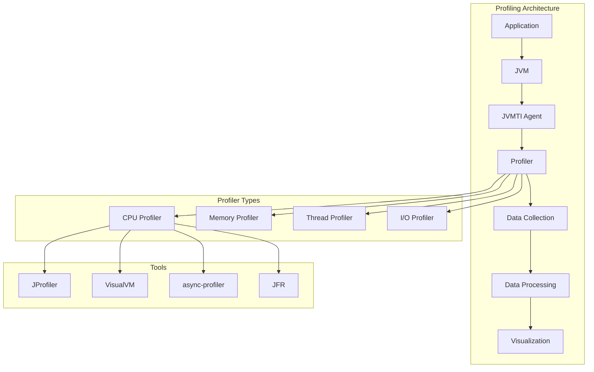
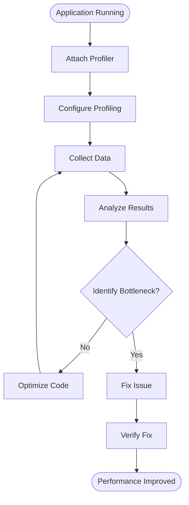
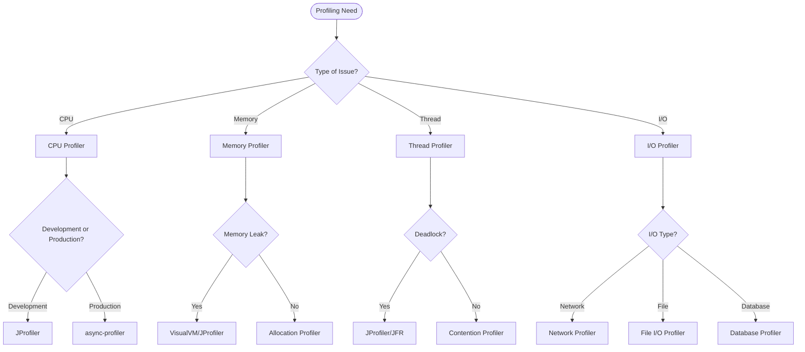

# 08. Profiling Tools

## Introduction

Profiling tools are essential for understanding and optimizing Java application performance. They help identify bottlenecks, memory issues, thread contention, and CPU utilization patterns. From lightweight sampling profilers to comprehensive production monitoring tools, the right profiler can dramatically improve your ability to diagnose and fix performance problems.

This topic covers the major Java profiling tools including JProfiler, VisualVM, async-profiler, Java Flight Recorder (JFR), and various command-line tools. We'll explore when to use each tool, how to configure them, and how to interpret their output.

## Learning Objectives

By the end of this topic, you will be able to:

- [ ] Select appropriate profiling tools for different scenarios
- [ ] Use JProfiler, VisualVM, and async-profiler effectively
- [ ] Configure Java Flight Recorder for production profiling
- [ ] Analyze profiling output to identify performance issues
- [ ] Set up continuous profiling in production environments
- [ ] Interpret CPU, memory, and thread profiling data
- [ ] Optimize application performance based on profiling results

## Prerequisites

- Completion of Topic 07: JIT Compilation
- Understanding of JVM internals
- Familiarity with Java applications
- Basic knowledge of performance concepts

## Why This Concept Exists

### The Performance Mystery

Without profiling, developers face:
- **Guesswork**: Trying to optimize without knowing the actual bottleneck
- **Blind Tuning**: Changing settings without measuring impact
- **Reactive debugging**: Only investigating after users report issues
- **Inefficient optimization**: Optimizing code that isn't actually slow

### The Profiling Solution

Profiling tools provide:
- **Data-driven decisions**: Optimize based on actual measurements
- **Root cause analysis**: Find the exact source of performance issues
- **Continuous monitoring**: Track performance over time
- **Production visibility**: Understand behavior in real environments

### Real-World Impact

Profiling affects:
- **Development Speed**: Faster identification of bottlenecks
- **Application Performance**: Higher throughput, lower latency
- **Resource Usage**: Better CPU and memory efficiency
- **User Experience**: More responsive applications

## Problem Statement

### The Profiling Challenge

Without profiling tools, developers face:
- **Performance Mysteries**: Applications are slow but reasons are unknown
- **Memory Leaks**: Memory grows but source is undetectable
- **Thread Contention**: Deadlocks and race conditions are hard to find
- **Production Issues**: Problems only occur under real workloads

### Real-World Example

A financial trading platform experienced:
- 200ms latency spikes every few minutes
- Memory usage growing from 4GB to 12GB over 24 hours
- CPU spikes to 100% during peak hours

The solution? Using profiling tools to identify and fix the root causes.

## Theory

### Profiling Tool Categories

```
┌─────────────────────────────────────────────────────────────┐
│                    Profiling Tools                           │
│                                                             │
│  ┌─────────────────────────────────────────────────────┐   │
│  │  CPU Profilers                                       │   │
│  │  - Sample or instrument code                        │   │
│  │  - Identify hot methods                             │   │
│  │  - Measure execution time                           │   │
│  └─────────────────────────────────────────────────────┘   │
│                                                             │
│  ┌─────────────────────────────────────────────────────┐   │
│  │  Memory Profilers                                    │   │
│  │  - Track object allocations                         │   │
│  │  - Detect memory leaks                              │   │
│  │  - Analyze heap usage                               │   │
│  └─────────────────────────────────────────────────────┘   │
│                                                             │
│  ┌─────────────────────────────────────────────────────┐   │
│  │  Thread Profilers                                    │   │
│  │  - Monitor thread states                            │   │
│  │  - Detect deadlocks                                 │   │
│  │  - Analyze contention                               │   │
│  └─────────────────────────────────────────────────────┘   │
│                                                             │
│  ┌─────────────────────────────────────────────────────┐   │
│  │  I/O Profilers                                       │   │
│  │  - Track network operations                         │   │
│  │  - Monitor file I/O                                 │   │
│  │  - Analyze database queries                         │   │
│  └─────────────────────────────────────────────────────┘   │
└─────────────────────────────────────────────────────────────┘
```

### Profiling Approaches

```
┌─────────────────────────────────────────────────────────────┐
│                    Profiling Approaches                      │
│                                                             │
│  ┌─────────────────────────────────────────────────────┐   │
│  │  Sampling Profiling                                  │   │
│  │  - Periodically samples call stacks                 │   │
│  │  - Low overhead                                     │   │
│  │  - Good for production                              │   │
│  └─────────────────────────────────────────────────────┘   │
│                                                             │
│  ┌─────────────────────────────────────────────────────┐   │
│  │  Instrumentation Profiling                          │   │
│  │  - Modifies bytecode at runtime                     │   │
│  │  - Higher overhead                                  │   │
│  │  - More detailed information                        │   │
│  └─────────────────────────────────────────────────────┘   │
│                                                             │
│  ┌─────────────────────────────────────────────────────┐   │
│  │  JVMTI Profiling                                     │   │
│  │  - Uses JVM Tool Interface                          │   │
│  │  - Low-level access                                 │   │
│  │  - Used by most profilers                           │   │
│  └─────────────────────────────────────────────────────┘   │
└─────────────────────────────────────────────────────────────┘
```

### Tool Comparison Matrix

```
┌─────────────────────────────────────────────────────────────┐
│                    Tool Comparison                           │
│                                                             │
│  Tool         │ CPU  │ Memory │ Thread │ Production │ Cost  │
│  ─────────────┼──────┼────────┼────────┼────────────┼───────│
│  JProfiler    │ Yes  │ Yes    │ Yes    │ Yes        │ Paid  │
│  VisualVM     │ Yes  │ Yes    │ Yes    │ Limited    │ Free  │
│  async-profiler│ Yes │ Yes    │ Yes    │ Yes        │ Free  │
│  JFR          │ Yes  │ Yes    │ Yes    │ Yes        │ Free  │
│  YourKit      │ Yes  │ Yes    │ Yes    │ Yes        │ Paid  │
└─────────────────────────────────────────────────────────────┘
```

## Internal Working

### How Profilers Work

```
1. Agent Attachment
   ├── Profiler attaches to JVM via JVMTI
   ├── Instruments bytecode or sets up sampling
   └── Starts collecting data

2. Data Collection
   ├── CPU: Sample call stacks periodically
   ├── Memory: Track allocations and deallocations
   ├── Thread: Monitor thread states and transitions
   └── I/O: Intercept I/O operations

3. Data Processing
   ├── Aggregate collected data
   ├── Calculate statistics
   └── Build call trees

4. Visualization
   ├── Generate reports
   ├── Create flame graphs
   └── Display real-time metrics
```

### Sampling vs Instrumentation

```
Sampling:
┌─────────────────────────────────────────────────────────────┐
│  Time ──────────────────────────────────────────────────────│
│  ▼   ▼   ▼   ▼   ▼   ▼   ▼   ▼   ▼   ▼   ▼   ▼          │
│  Sample Sample Sample Sample Sample Sample Sample           │
│                                                             │
│  Pros: Low overhead, production-safe                        │
│  Cons: May miss short methods                               │
└─────────────────────────────────────────────────────────────┘

Instrumentation:
┌─────────────────────────────────────────────────────────────┐
│  Method Entry ──── Method Exit                              │
│  ▼                  ▼                                       │
│  Record Time        Record Time                            │
│  Calculate Duration                                        │
│                                                             │
│  Pros: Exact measurements                                   │
│  Cons: Higher overhead, may affect performance              │
└─────────────────────────────────────────────────────────────┘
```

## JVM Perspective

### What the JVM Sees

The JVM provides:
- **JVMTI**: JVM Tool Interface for profilers
- **MXBeans**: Management beans for monitoring
- **Flight Recorder**: Built-in profiling framework
- **Debug Interface**: For debugging and profiling

### Profiler Attachment Methods

```
┌─────────────────────────────────────────────────────────────┐
│                    Attachment Methods                        │
│                                                             │
│  ┌─────────────────────────────────────────────────────┐   │
│  │  Command-line Flag                                   │   │
│  │  -javaagent:profiler.jar                            │   │
│  │  -XX:+FlightRecorder                                │   │
│  └─────────────────────────────────────────────────────┘   │
│                                                             │
│  ┌─────────────────────────────────────────────────────┐   │
│  │  Runtime Attachment                                  │   │
│  │  - Attach API                                        │   │
│  │  - Dynamic loading                                   │   │
│  └─────────────────────────────────────────────────────┘   │
│                                                             │
│  ┌─────────────────────────────────────────────────────┐   │
│  │  JMX Connection                                     │   │
│  │  - Remote monitoring                                │   │
│  │  - Management beans                                 │   │
│  └─────────────────────────────────────────────────────┘   │
└─────────────────────────────────────────────────────────────┘
```

## Memory Representation

### Profiling Data Structure

```
┌─────────────────────────────────────────────────────────────┐
│                    CPU Profile Data                          │
│                                                             │
│  ┌─────────────────────────────────────────────────────┐   │
│  │  Call Stack Tree                                     │   │
│  │  ┌─────────────────────────────────────────────┐   │   │
│  │  │  main() [100%]                               │   │   │
│  │  │  ├── process() [80%]                         │   │   │
│  │  │  │   ├── compute() [60%]                     │   │   │
│  │  │  │   │   └── calculate() [40%]               │   │   │
│  │  │  │   └── validate() [20%]                    │   │   │
│  │  │  └── log() [20%]                             │   │   │
│  │  └─────────────────────────────────────────────┘   │   │
│  └─────────────────────────────────────────────────────┘   │
│                                                             │
│  ┌─────────────────────────────────────────────────────┐   │
│  │  Allocation Data                                     │   │
│  │  ┌─────────────────────────────────────────────┐   │   │
│  │  │  Thread-Local Allocation Buffers (TLABs)     │   │   │
│  │  │  - Per-thread allocation tracking            │   │   │
│  │  │  - Object size and type information          │   │   │
│  │  │  - Allocation hotspots                       │   │   │
│  │  └─────────────────────────────────────────────┘   │   │
│  └─────────────────────────────────────────────────────┘   │
└─────────────────────────────────────────────────────────────┘
```

## Architecture Diagram (Mermaid)



## Flow Diagram (Mermaid)



## Syntax (with examples)

### JProfiler Command Line

```bash
# Start JProfiler agent
java -agentpath:/path/to/libjprofilerti.so=port=8849 MyApp

# JProfiler CLI
jpenable --port=8849 --dir=/path/to/profiles
```

### VisualVM Connection

```bash
# Start VisualVM
visualvm

# Connect to local process
jps  # List Java processes
```

### async-profiler Commands

```bash
# CPU profiling
./profiler.sh -d 30 -f cpu_profile.html <pid>

# Memory profiling
./profiler.sh -d 30 -e alloc -f alloc_profile.html <pid>

# Wall-clock profiling
./profiler.sh -d 30 -e wall -f wall_profile.html <pid>
```

### JFR Commands

```bash
# Start JFR recording
jcmd <pid> JFR.start name=profile duration=60s filename=profile.jfr

# Dump JFR recording
jcmd <pid> JFR.dump name=profile filename=dump.jfr

# Stop JFR recording
jcmd <pid> JFR.stop name=profile
```

## Easy Example

### Basic CPU Profiling

```java
package academy.javaengineering.jvm.profiling;

/**
 * Simple application for profiling demonstration.
 */
public class BasicProfilingDemo {
    
    public static void main(String[] args) {
        System.out.println("=== Basic Profiling Demo ===\n");
        
        // Simulate different workloads
        for (int i = 0; i < 10; i++) {
            cpuIntensiveWork();
            memoryIntensiveWork();
            ioIntensiveWork();
        }
        
        System.out.println("Workload complete. Check profiler for results.");
    }
    
    private static void cpuIntensiveWork() {
        long sum = 0;
        for (int i = 0; i < 1_000_000; i++) {
            sum += Math.sqrt(i);
        }
    }
    
    private static void memoryIntensiveWork() {
        java.util.List<byte[]> list = new java.util.ArrayList<>();
        for (int i = 0; i < 1000; i++) {
            list.add(new byte[1024]);
        }
    }
    
    private static void ioIntensiveWork() {
        try {
            Thread.sleep(10);
        } catch (InterruptedException e) {
            Thread.currentThread().interrupt();
        }
    }
}
```

## Medium Example

### Memory Leak Profiling

```java
package academy.javaengineering.jvm.profiling;

import java.util.*;

/**
 * Application with memory leak for profiling demonstration.
 */
public class MemoryLeakProfilingDemo {
    
    private static final List<byte[]> memoryLeak = new ArrayList<>();
    private static int counter = 0;
    
    public static void main(String[] args) {
        System.out.println("=== Memory Leak Profiling Demo ===\n");
        
        // Simulate memory leak
        for (int i = 0; i < 100; i++) {
            allocateMemory();
            printMemoryUsage();
            
            try {
                Thread.sleep(100);
            } catch (InterruptedException e) {
                Thread.currentThread().interrupt();
            }
        }
        
        System.out.println("\nMemory leak simulation complete.");
        System.out.println("Use memory profiler to identify the leak.");
    }
    
    private static void allocateMemory() {
        // Simulate memory leak - objects never GC'd
        memoryLeak.add(new byte[1024 * 1024]); // 1MB
        counter++;
    }
    
    private static void printMemoryUsage() {
        Runtime runtime = Runtime.getRuntime();
        long totalMemory = runtime.totalMemory();
        long freeMemory = runtime.freeMemory();
        long usedMemory = totalMemory - freeMemory;
        
        System.out.printf("Allocation %d: Used = %d MB, Free = %d MB%n",
            counter, usedMemory / (1024 * 1024), freeMemory / (1024 * 1024));
    }
}
```

## Hard Example

### Thread Contention Profiling

```java
package academy.javaengineering.jvm.profiling;

import java.util.concurrent.*;
import java.util.concurrent.atomic.*;

/**
 * Application with thread contention for profiling demonstration.
 */
public class ThreadContentionProfilingDemo {
    
    private static final int THREAD_COUNT = 10;
    private static final int ITERATIONS = 100_000;
    private static final AtomicLong counter = new AtomicLong(0);
    private static final Object lock = new Object();
    
    public static void main(String[] args) throws InterruptedException {
        System.out.println("=== Thread Contention Profiling Demo ===\n");
        
        // Test with synchronized block
        System.out.println("--- Testing Synchronized Block ---");
        testSynchronizedBlock();
        
        // Test with lock
        System.out.println("\n--- Testing Lock ---");
        testLock();
        
        // Test with atomic
        System.out.println("\n--- Testing Atomic ---");
        testAtomic();
        
        System.out.println("\nThread contention profiling complete.");
        System.out.println("Use thread profiler to analyze contention.");
    }
    
    private static void testSynchronizedBlock() throws InterruptedException {
        counter.set(0);
        long startTime = System.nanoTime();
        
        ExecutorService executor = Executors.newFixedThreadPool(THREAD_COUNT);
        CountDownLatch latch = new CountDownLatch(THREAD_COUNT);
        
        for (int i = 0; i < THREAD_COUNT; i++) {
            executor.submit(() -> {
                try {
                    for (int j = 0; j < ITERATIONS; j++) {
                        synchronized (lock) {
                            counter.incrementAndGet();
                        }
                    }
                } finally {
                    latch.countDown();
                }
            });
        }
        
        latch.await();
        executor.shutdown();
        
        long duration = (System.nanoTime() - startTime) / 1_000_000;
        System.out.printf("Synchronized block: %d ms, Counter: %d%n", 
            duration, counter.get());
    }
    
    private static void testLock() throws InterruptedException {
        counter.set(0);
        java.util.concurrent.locks.ReentrantLock reentrantLock = 
            new java.util.concurrent.locks.ReentrantLock();
        long startTime = System.nanoTime();
        
        ExecutorService executor = Executors.newFixedThreadPool(THREAD_COUNT);
        CountDownLatch latch = new CountDownLatch(THREAD_COUNT);
        
        for (int i = 0; i < THREAD_COUNT; i++) {
            executor.submit(() -> {
                try {
                    for (int j = 0; j < ITERATIONS; j++) {
                        reentrantLock.lock();
                        try {
                            counter.incrementAndGet();
                        } finally {
                            reentrantLock.unlock();
                        }
                    }
                } finally {
                    latch.countDown();
                }
            });
        }
        
        latch.await();
        executor.shutdown();
        
        long duration = (System.nanoTime() - startTime) / 1_000_000;
        System.out.printf("Lock: %d ms, Counter: %d%n", duration, counter.get());
    }
    
    private static void testAtomic() throws InterruptedException {
        counter.set(0);
        long startTime = System.nanoTime();
        
        ExecutorService executor = Executors.newFixedThreadPool(THREAD_COUNT);
        CountDownLatch latch = new CountDownLatch(THREAD_COUNT);
        
        for (int i = 0; i < THREAD_COUNT; i++) {
            executor.submit(() -> {
                try {
                    for (int j = 0; j < ITERATIONS; j++) {
                        counter.incrementAndGet();
                    }
                } finally {
                    latch.countDown();
                }
            });
        }
        
        latch.await();
        executor.shutdown();
        
        long duration = (System.nanoTime() - startTime) / 1_000_000;
        System.out.printf("Atomic: %d ms, Counter: %d%n", duration, counter.get());
    }
}
```

## Enterprise Example

### Production Profiling System

```java
package academy.javaengineering.jvm.profiling;

import java.lang.management.*;
import java.util.*;
import java.util.concurrent.*;

/**
 * Enterprise-grade profiling data collection system.
 */
public class EnterpriseProfilingSystem {
    
    private final ScheduledExecutorService scheduler = Executors.newScheduledThreadPool(4);
    private final MemoryMXBean memoryBean = ManagementFactory.getMemoryMXBean();
    private final ThreadMXBean threadBean = ManagementFactory.getThreadMXBean();
    private final List<GarbageCollectorMXBean> gcBeans = ManagementFactory.getGarbageCollectorMXBeans();
    private final RuntimeMXBean runtimeBean = ManagementFactory.getRuntimeMXBean();
    
    private final List<ProfilingSnapshot> snapshots = new CopyOnWriteArrayList<>();
    private volatile boolean running = true;
    
    public void startProfiling() {
        System.out.println("=== Enterprise Profiling System ===\n");
        
        // Schedule CPU profiling
        scheduler.scheduleAtFixedRate(this::collectCPUProfile, 0, 5, TimeUnit.SECONDS);
        
        // Schedule memory profiling
        scheduler.scheduleAtFixedRate(this::collectMemoryProfile, 0, 10, TimeUnit.SECONDS);
        
        // Schedule thread profiling
        scheduler.scheduleAtFixedRate(this::collectThreadProfile, 0, 15, TimeUnit.SECONDS);
        
        // Schedule GC profiling
        scheduler.scheduleAtFixedRate(this::collectGCProfile, 0, 30, TimeUnit.SECONDS);
        
        System.out.println("Profiling system started. Press Ctrl+C to stop.\n");
    }
    
    private void collectCPUProfile() {
        try {
            long cpuTime = runtimeBean.getUptime();
            long processCpuTime = runtimeBean.getProcessCpuTime();
            
            ProfilingSnapshot snapshot = new ProfilingSnapshot(
                System.currentTimeMillis(),
                cpuTime,
                processCpuTime,
                memoryBean.getHeapMemoryUsage().getUsed(),
                threadBean.getThreadCount()
            );
            
            snapshots.add(snapshot);
            
            // Keep only last 1000 snapshots
            if (snapshots.size() > 1000) {
                snapshots.remove(0);
            }
        } catch (Exception e) {
            System.err.println("Error collecting CPU profile: " + e.getMessage());
        }
    }
    
    private void collectMemoryProfile() {
        try {
            MemoryUsage heapUsage = memoryBean.getHeapMemoryUsage();
            MemoryUsage nonHeapUsage = memoryBean.getNonHeapMemoryUsage();
            
            System.out.println("\n--- Memory Profile ---");
            System.out.printf("Heap: %d MB used / %d MB committed / %d MB max%n",
                heapUsage.getUsed() / (1024 * 1024),
                heapUsage.getCommitted() / (1024 * 1024),
                heapUsage.getMax() / (1024 * 1024));
            
            System.out.printf("Non-Heap: %d MB used / %d MB committed%n",
                nonHeapUsage.getUsed() / (1024 * 1024),
                nonHeapUsage.getCommitted() / (1024 * 1024));
            
            // Check for memory pressure
            double heapUsagePercent = (double) heapUsage.getUsed() / heapUsage.getMax() * 100;
            if (heapUsagePercent > 80) {
                System.out.println("WARNING: High heap usage detected: " + 
                    String.format("%.1f%%", heapUsagePercent));
            }
        } catch (Exception e) {
            System.err.println("Error collecting memory profile: " + e.getMessage());
        }
    }
    
    private void collectThreadProfile() {
        try {
            System.out.println("\n--- Thread Profile ---");
            System.out.printf("Active Threads: %d%n", threadBean.getThreadCount());
            System.out.printf("Peak Threads: %d%n", threadBean.getPeakThreadCount());
            System.out.printf("Daemon Threads: %d%n", threadBean.getDaemonThreadCount());
            System.out.printf("Total Started Threads: %d%n", threadBean.getTotalStartedThreadCount());
            
            // Check for thread contention
            long[] deadlockedThreads = threadBean.findDeadlockedThreads();
            if (deadlockedThreads != null) {
                System.out.println("WARNING: Deadlocked threads detected!");
                ThreadInfo[] threadInfos = threadBean.getThreadInfo(deadlockedThreads);
                for (ThreadInfo info : threadInfos) {
                    System.out.println("  Deadlocked: " + info.getThreadName());
                }
            }
        } catch (Exception e) {
            System.err.println("Error collecting thread profile: " + e.getMessage());
        }
    }
    
    private void collectGCProfile() {
        try {
            System.out.println("\n--- GC Profile ---");
            for (GarbageCollectorMXBean gcBean : gcBeans) {
                System.out.printf("GC: %s%n", gcBean.getName());
                System.out.printf("  Collections: %d%n", gcBean.getCollectionCount());
                System.out.printf("  Time: %d ms%n", gcBean.getCollectionTime());
                
                // Calculate GC overhead
                long uptime = runtimeBean.getUptime();
                double gcOverhead = (double) gcBean.getCollectionTime() / uptime * 100;
                System.out.printf("  Overhead: %.2f%%%n", gcOverhead);
                
                if (gcOverhead > 5) {
                    System.out.println("  WARNING: High GC overhead detected!");
                }
            }
        } catch (Exception e) {
            System.err.println("Error collecting GC profile: " + e.getMessage());
        }
    }
    
    public void generateReport() {
        System.out.println("\n" + "=".repeat(70));
        System.out.println("PROFILING REPORT");
        System.out.println("=".repeat(70));
        
        if (snapshots.size() >= 2) {
            ProfilingSnapshot first = snapshots.get(0);
            ProfilingSnapshot last = snapshots.get(snapshots.size() - 1);
            
            long timeDiff = last.timestamp - first.timestamp;
            long memoryDiff = last.heapUsed - first.heapUsed;
            long threadDiff = last.threadCount - first.threadCount;
            
            System.out.printf("Time Window: %d seconds%n", timeDiff / 1000);
            System.out.printf("Memory Change: %d MB%n", memoryDiff / (1024 * 1024));
            System.out.printf("Thread Change: %d%n", threadDiff);
        }
        
        System.out.println("=".repeat(70));
    }
    
    public void stop() {
        running = false;
        scheduler.shutdown();
        try {
            if (!scheduler.awaitTermination(10, TimeUnit.SECONDS)) {
                scheduler.shutdownNow();
            }
        } catch (InterruptedException e) {
            scheduler.shutdownNow();
            Thread.currentThread().interrupt();
        }
    }
    
    public static void main(String[] args) {
        EnterpriseProfilingSystem profilingSystem = new EnterpriseProfilingSystem();
        profilingSystem.startProfiling();
        
        // Simulate application workload
        simulateWorkload();
        
        // Run for 5 minutes
        try {
            Thread.sleep(300_000);
        } catch (InterruptedException e) {
            Thread.currentThread().interrupt();
        }
        
        profilingSystem.generateReport();
        profilingSystem.stop();
    }
    
    private static void simulateWorkload() {
        new Thread(() -> {
            while (true) {
                // CPU intensive work
                for (int i = 0; i < 1000; i++) {
                    Math.sqrt(i);
                }
                
                // Memory allocation
                byte[] data = new byte[1024];
                
                try {
                    Thread.sleep(100);
                } catch (InterruptedException e) {
                    break;
                }
            }
        }).start();
    }
    
    private static class ProfilingSnapshot {
        final long timestamp;
        final long cpuTime;
        final long processCpuTime;
        final long heapUsed;
        final int threadCount;
        
        ProfilingSnapshot(long timestamp, long cpuTime, long processCpuTime, 
                         long heapUsed, int threadCount) {
            this.timestamp = timestamp;
            this.cpuTime = cpuTime;
            this.processCpuTime = processCpuTime;
            this.heapUsed = heapUsed;
            this.threadCount = threadCount;
        }
    }
}
```

## Performance Considerations

### Profiling Overhead

| Tool | CPU Overhead | Memory Overhead | Production Safe |
|------|--------------|-----------------|-----------------|
| Sampling | Low | Low | Yes |
| Instrumentation | High | Medium | Limited |
| JFR | Low | Low | Yes |
| async-profiler | Very Low | Very Low | Yes |

### When to Use Each Tool

| Scenario | Recommended Tool |
|----------|------------------|
| Development profiling | JProfiler or VisualVM |
| Production sampling | async-profiler |
| Continuous monitoring | JFR |
| Memory leak detection | VisualVM or JProfiler |
| Thread analysis | JProfiler or JFR |

## Time & Space Complexity

### Profiling Overhead

| Operation | Time Complexity | Space Complexity |
|-----------|-----------------|------------------|
| Sampling | O(1) per sample | O(n) for stack depth |
| Instrumentation | O(n) per method | O(n) for bytecode |
| Data aggregation | O(m log m) | O(m) for m methods |

## Thread Safety

### Thread-Safe Profiling

Profiling tools must be thread-safe because:
- Applications have multiple threads
- Profiling data is collected concurrently
- Visualization must handle concurrent updates

### Thread-Safe Data Collection

```java
// Thread-safe profiling data collection
public class ThreadSafeProfilingData {
    private final ConcurrentHashMap<String, AtomicLong> methodCounts = 
        new ConcurrentHashMap<>();
    private final ConcurrentHashMap<String, AtomicLong> methodTimes = 
        new ConcurrentHashMap<>();
    
    public void recordMethodCall(String methodName, long duration) {
        methodCounts.computeIfAbsent(methodName, k -> new AtomicLong(0))
            .incrementAndGet();
        methodTimes.computeIfAbsent(methodName, k -> new AtomicLong(0))
            .addAndGet(duration);
    }
}
```

## Best Practices

### Profiling Best Practices

1. **Profile in Production**
   - Use low-overhead profilers like async-profiler or JFR
   - Profile representative workloads
   - Monitor continuously

2. **Use Multiple Tools**
   - CPU profiling for热点
   - Memory profiling for leaks
   - Thread profiling for contention

3. **Profile Early and Often**
   - Profile during development
   - Establish performance baselines
   - Monitor regressions

4. **Understand Overhead**
   - Know the overhead of each tool
   - Use sampling for production
   - Use instrumentation for development

5. **Act on Results**
   - Focus on the biggest bottlenecks
   - Validate optimizations
   - Measure before and after

## Common Mistakes

### Mistake 1: Profiling Production with High Overhead

```bash
# BAD: Using instrumentation profiler in production
java -javaagent:high-overhead-profiler.jar MyApp

# GOOD: Using low-overhead profiler
java -javaagent:async-profiler.jar MyApp
```

### Mistake 2: Not Warming Up Before Profiling

```java
// BAD: Profiling during startup
public class BadProfiling {
    public static void main(String[] args) {
        // Profile immediately - captures startup, not steady state
        startProfiling();
    }
}

// GOOD: Warming up first
public class GoodProfiling {
    public static void main(String[] args) {
        // Warm up application
        for (int i = 0; i < 100_000; i++) {
            doWork();
        }
        
        // Now profile steady state
        startProfiling();
    }
}
```

### Mistake 3: Ignoring Profiling Results

```java
// BAD: Not acting on profiling results
public class IgnoringResults {
    public void profile() {
        ProfileResult result = profiler.getResults();
        // Do nothing with results
    }
}

// GOOD: Acting on profiling results
public class ActingOnResults {
    public void profile() {
        ProfileResult result = profiler.getResults();
        optimizeBasedOnResults(result);
    }
}
```

## Pitfalls & Warnings

### Pitfall 1: Observer Effect

```java
// BAD: Profiling affects behavior
public class ObserverEffect {
    public void method() {
        // This method behaves differently when profiled
        if (isBeingProfiled()) {
            // Different behavior
        }
    }
}

// GOOD: Profile under realistic conditions
public class RealisticProfiling {
    public void method() {
        // Same behavior regardless of profiling
    }
}
```

### Pitfall 2: Sampling Bias

```bash
# BAD: Short profiling duration
./profiler.sh -d 1 -f profile.html <pid>  # Only 1 second

# GOOD: Sufficient profiling duration
./profiler.sh -d 60 -f profile.html <pid>  # 60 seconds
```

## Debugging Tips

### Profiling Debug Commands

```bash
# List Java processes
jps -l

# Attach JFR
jcmd <pid> JFR.start

# Get thread dump
jstack <pid>

# Get heap dump
jmap -dump:live,format=b,file=heap.hprof <pid>

# Get GC details
jstat -gcutil <pid> 1000 10
```

### Common Profiling Issues

| Issue | Symptom | Solution |
|-------|---------|----------|
| High overhead | Application slows down | Use sampling profiler |
| Incomplete data | Missing information | Increase profiling duration |
| No hot methods | Everything looks equal | Profile longer or under load |
| Memory pressure | Profiler uses too much memory | Reduce data retention |

## Comparison Table

### Profiling Tools

| Feature | JProfiler | VisualVM | async-profiler | JFR |
|---------|-----------|----------|----------------|-----|
| **CPU Profiling** | Yes | Yes | Yes | Yes |
| **Memory Profiling** | Yes | Yes | Yes | Yes |
| **Thread Profiling** | Yes | Yes | Yes | Yes |
| **Production Safe** | Yes | Limited | Yes | Yes |
| **Overhead** | Medium | High | Very Low | Low |
| **Cost** | Paid | Free | Free | Free |
| **Ease of Use** | High | High | Medium | Medium |

### Profiling Modes

| Mode | Overhead | Accuracy | Use Case |
|------|----------|----------|----------|
| Sampling | Low | Good | Production |
| Instrumentation | High | Excellent | Development |
| Wall-clock | Medium | Good | I/O analysis |
| CPU | Low | Good | CPU analysis |

## Decision Tree (Mermaid)



## Interview Questions (15+)

### Basic Questions

1. **What is profiling?**
   - The process of analyzing application performance to identify bottlenecks

2. **What is the difference between sampling and instrumentation profiling?**
   - Sampling: Periodically samples call stacks, low overhead
   - Instrumentation: Modifies bytecode, higher overhead, more accurate

3. **What is JFR?**
   - Java Flight Recorder, a built-in profiling framework with low overhead

4. **What is async-profiler?**
   - A low-overhead sampling profiler for Java applications

5. **What is the observer effect in profiling?**
   - The phenomenon where profiling affects application behavior

### Intermediate Questions

6. **When should you use JFR vs async-profiler?**
   - JFR: Continuous monitoring, built-in
   - async-profiler: Ad-hoc profiling, more detailed

7. **How do you profile a production application safely?**
   - Use low-overhead profilers like async-profiler or JFR
   - Profile representative workloads
   - Monitor overhead

8. **What is a flame graph?**
   - A visualization of call stacks showing time spent in each method

9. **How do you detect memory leaks with profilers?**
   - Track object allocations over time
   - Look for objects that are never garbage collected
   - Analyze object retention graphs

10. **What is wall-clock profiling?**
    - Profiling that includes time spent waiting, not just CPU time

### Advanced Questions

11. **How does async-profiler achieve low overhead?**
    - Uses perf_events on Linux and similar mechanisms on other platforms
    - Samples at the kernel level with minimal JVM intervention

12. **What is TLAB profiling?**
    - Profiling thread-local allocation buffers to track object allocations

13. **How do you profile I/O operations?**
    - Use JVMTI agents to intercept I/O calls
    - Use JFR I/O events
    - Use async-profiler with I/O events

14. **What is continuous profiling?**
    - Always-on profiling that collects data continuously in production

15. **How do you profile microservices?**
    - Use distributed tracing
    - Profile individual services
    - Correlate metrics across services

16. **What is the difference between CPU and wall-clock profiling?**
    - CPU: Only measures CPU time
    - Wall-clock: Measures total elapsed time including waits

17. **How do you profile garbage collection?**
    - Use GC logging
    - Use JFR GC events
    - Use GC-specific profilers

## Exercises (3 levels)

### Level 1: Basic

1. **CPU Profiling**
   - Profile a simple application using VisualVM
   - Identify the hottest methods
   - Create a flame graph

2. **Memory Profiling**
   - Profile memory allocations using JFR
   - Identify allocation hotspots
   - Compare allocation rates

### Level 2: Intermediate

3. **Thread Profiling**
   - Profile thread contention in a concurrent application
   - Identify deadlocks
   - Analyze lock contention

4. **Production Profiling**
   - Set up async-profiler for a production application
   - Create a continuous profiling system
   - Analyze production performance data

### Level 3: Advanced

5. **Custom Profiler**
   - Build a simple CPU profiler using JVMTI
   - Implement sampling and instrumentation
   - Create visualization for profiling data

6. **Profiling Framework**
   - Build a profiling framework that supports multiple profiling modes
   - Implement data collection and aggregation
   - Create reporting and visualization

## Summary

### Key Takeaways

1. **Profiling is Essential**: Understanding performance requires data
2. **Right Tool for Right Job**: Different tools for different scenarios
3. **Production Safety**: Use low-overhead profilers in production
4. **Continuous Monitoring**: Profile continuously, not just when problems occur
5. **Act on Results**: Profiling without action is wasted effort

### Next Steps

- Continue to Topic 09: JVM Diagnostics
- Practice with different profiling tools
- Set up continuous profiling in your projects
- Read "Java Performance" by Scott Oaks

## References

### Official Documentation
- [JFR Documentation](https://docs.oracle.com/en/java/javase/21/docs/jdk/jfr/)
- [JVMTI Specification](https://docs.oracle.com/en/java/javase/21/docs/specs/jvmti.html)
- [JMX Documentation](https://docs.oracle.com/en/java/javase/21/docs/technotes/guides/management/)

### Books
- "Java Performance" by Scott Oaks
- "Optimizing Java" by Benjamin J. Evans
- "Pro Java Performance" by Michael Buytaert

### Online Resources
- [async-profiler](https://github.com/async-profiler/async-profiler)
- [JProfiler](https://www.ej-technologies.com/products/jprofiler/)
- [VisualVM](https://visualvm.java.net/)

### Tools
- [JProfiler](https://www.ej-technologies.com/products/jprofiler/)
- [VisualVM](https://visualvm.java.net/)
- [async-profiler](https://github.com/async-profiler/async-profiler)
- [JFR](https://docs.oracle.com/en/java/javase/21/docs/jdk/jfr/)

---

**Next Topic**: [09. JVM Diagnostics](../09-jvm-diagnostics/README.md)
