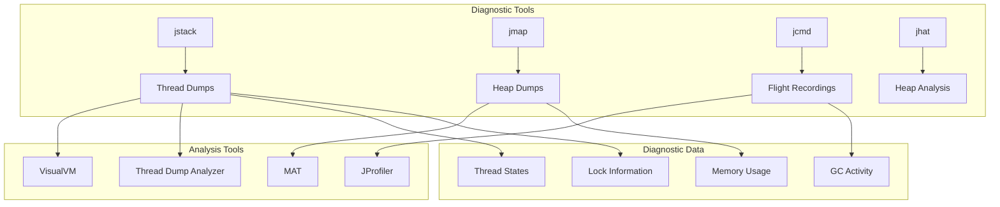
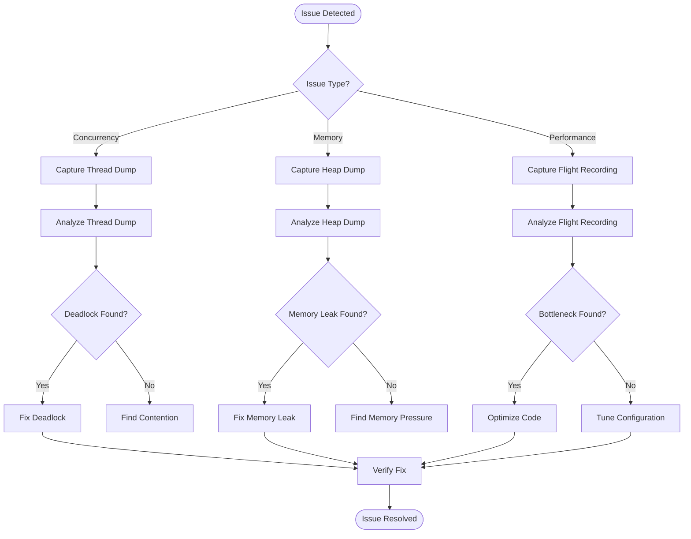
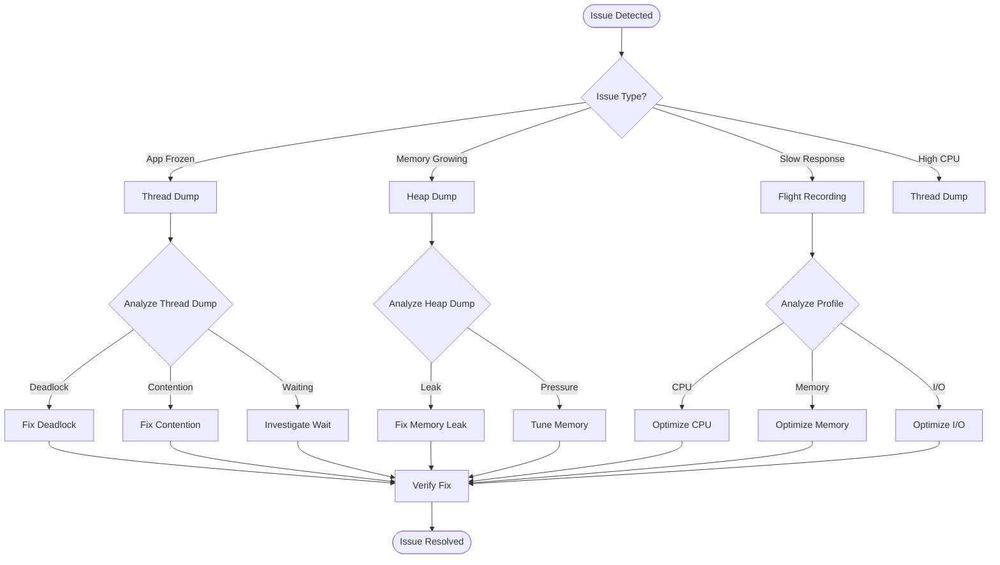

# 09. JVM Diagnostics

## Introduction

JVM diagnostics is the practice of investigating and resolving issues in Java applications through various diagnostic techniques. This includes thread dumps for analyzing concurrency issues, heap dumps for memory problems, flight recordings for comprehensive profiling, and various command-line tools for real-time analysis. Effective diagnostics can mean the difference between hours of debugging and minutes of problem resolution.

This topic covers the essential diagnostic techniques every Java developer should master, from basic thread dumps to advanced flight recorder analysis, along with the tools and commands needed to perform effective diagnostics.

## Learning Objectives

By the end of this topic, you will be able to:

- [ ] Capture and analyze thread dumps effectively
- [ ] Generate and analyze heap dumps for memory issues
- [ ] Use Java Flight Recorder for comprehensive diagnostics
- [ ] Identify deadlocks, thread contention, and memory leaks
- [ ] Use diagnostic tools like jstack, jmap, jcmd, and jhat
- [ ] Interpret diagnostic data to find root causes
- [ ] Set up automated diagnostic collection

## Prerequisites

- Completion of Topic 08: Profiling Tools
- Understanding of Java concurrency
- Familiarity with JVM memory model
- Basic knowledge of Java applications

## Why This Concept Exists

### The Debugging Challenge

Java applications can experience various issues:
- **Deadlocks**: Threads waiting for each other indefinitely
- **Memory Leaks**: Objects that are never garbage collected
- **High CPU**: Threads consuming excessive CPU
- **Slow Response**: Application becomes unresponsive
- **Crashes**: Unexpected application termination

### The Diagnostic Solution

Diagnostic techniques provide:
- **Root Cause Analysis**: Find the exact source of problems
- **Non-invasive Investigation**: Analyze running applications
- **Production Safety**: Diagnose issues without stopping the application
- **Historical Analysis**: Capture and analyze past issues

### Real-World Impact

Effective diagnostics affect:
- **Mean Time to Resolution**: Faster problem solving
- **Application Availability**: Less downtime
- **Development Productivity**: Less time debugging
- **User Satisfaction**: More reliable applications

## Problem Statement

### The Diagnostic Challenge

Without proper diagnostics, developers face:
- **Guesswork**: Trying to fix issues without understanding them
- **Reproduction difficulty**: Issues that are hard to reproduce
- **Production blind spots**: No visibility into production behavior
- **Long debugging sessions**: Spending hours or days on issues

### Real-World Example

A production application experienced:
- Intermittent deadlocks causing 30-second freezes
- Memory usage growing until OutOfMemoryError
- High CPU spikes every few minutes

The solution? Using diagnostic tools to capture and analyze the issues.

## Theory

### Diagnostic Techniques

```
┌─────────────────────────────────────────────────────────────┐
│                    JVM Diagnostics                           │
│                                                             │
│  ┌─────────────────────────────────────────────────────┐   │
│  │  Thread Dumps                                        │   │
│  │  - Capture thread states                            │   │
│  │  - Identify deadlocks                               │   │
│  │  - Analyze contention                               │   │
│  └─────────────────────────────────────────────────────┘   │
│                                                             │
│  ┌─────────────────────────────────────────────────────┐   │
│  │  Heap Dumps                                          │   │
│  │  - Capture heap snapshot                            │   │
│  │  - Find memory leaks                                │   │
│  │  - Analyze object graph                             │   │
│  └─────────────────────────────────────────────────────┘   │
│                                                             │
│  ┌─────────────────────────────────────────────────────┐   │
│  │  Flight Recordings                                   │   │
│  │  - Comprehensive profiling data                     │   │
│  │  - Low overhead                                     │   │
│  │  - Historical analysis                              │   │
│  └─────────────────────────────────────────────────────┘   │
│                                                             │
│  ┌─────────────────────────────────────────────────────┐   │
│  │  Command-line Tools                                  │   │
│  │  - jstack, jmap, jcmd, jhat                         │   │
│  │  - Real-time monitoring                             │   │
│  │  - Quick diagnostics                                │   │
│  └─────────────────────────────────────────────────────┘   │
└─────────────────────────────────────────────────────────────┘
```

### Thread Dump Analysis

```
┌─────────────────────────────────────────────────────────────┐
│                    Thread States                             │
│                                                             │
│  ┌─────────────────────────────────────────────────────┐   │
│  │  RUNNABLE                                            │   │
│  │  - Thread is executing                               │   │
│  │  - May be in native code                             │   │
│  └─────────────────────────────────────────────────────┘   │
│                                                             │
│  ┌─────────────────────────────────────────────────────┐   │
│  │  BLOCKED                                             │   │
│  │  - Waiting to acquire monitor                        │   │
│  │  - Potential deadlock                                │   │
│  └─────────────────────────────────────────────────────┘   │
│                                                             │
│  ┌─────────────────────────────────────────────────────┐   │
│  │  WAITING                                             │   │
│  │  - Waiting indefinitely                              │   │
│  │  - Object.wait(), Thread.join()                      │   │
│  └─────────────────────────────────────────────────────┘   │
│                                                             │
│  ┌─────────────────────────────────────────────────────┐   │
│  │  TIMED_WAITING                                       │   │
│  │  - Waiting with timeout                              │   │
│  │  - sleep(), wait(timeout)                            │   │
│  └─────────────────────────────────────────────────────┘   │
└─────────────────────────────────────────────────────────────┘
```

### Heap Dump Structure

```
┌─────────────────────────────────────────────────────────────┐
│                    Heap Dump Contents                        │
│                                                             │
│  ┌─────────────────────────────────────────────────────┐   │
│  │  All Objects                                         │   │
│  │  - Instance data                                     │   │
│  │  - Class information                                 │   │
│  │  - Array elements                                    │   │
│  └─────────────────────────────────────────────────────┘   │
│                                                             │
│  ┌─────────────────────────────────────────────────────┐   │
│  │  All GC Roots                                        │   │
│  │  - Local variables                                   │   │
│  │  - Static variables                                  │   │
│  │  - JNI references                                    │   │
│  └─────────────────────────────────────────────────────┘   │
│                                                             │
│  ┌─────────────────────────────────────────────────────┐   │
│  │  Reference Information                               │   │
│  │  - Object references                                 │   │
│  │  - Reference types                                   │   │
│  │  - Retained sizes                                    │   │
│  └─────────────────────────────────────────────────────┘   │
└─────────────────────────────────────────────────────────────┘
```

## Internal Working

### Thread Dump Collection

```
1. Signal Handler
   ├── JVM receives SIGQUIT (Unix) or Ctrl+Break (Windows)
   ├── Signal handler invoked
   └── Thread stack traces collected

2. Stack Trace Collection
   ├── For each thread:
   │   ├── Current stack frame
   │   ├── Method execution points
   │   ├── Lock information
   │   └── Thread state
   └── Thread scheduling information

3. Lock Information
   ├── Owned locks
   ├── Waiting locks
   ├── Blocked locks
   └── Deadlock detection

4. Output Generation
   ├── Format thread information
   ├── Add thread headers
   └── Write to output
```

### Heap Dump Collection

```
1. Trigger Heap Dump
   ├── Signal (SIGQUIT)
   ├── jmap command
   ├── JMX API
   └── OutOfMemoryError

2. Stop-the-World Pause
   ├── Pause all threads
   ├── Ensure consistent state
   └── Minimal pause for diagnostics

3. Heap Traversal
   ├── Start from GC roots
   ├── Follow all references
   ├── Record all objects
   └── Calculate retained sizes

4. File Writing
   ├── Write object data
   ├── Write class information
   ├── Write reference information
   └── Write GC root information
```

## JVM Perspective

### What the JVM Sees

The JVM provides:
- **Thread Information**: Complete thread state and stack traces
- **Heap Information**: All objects and their relationships
- **Lock Information**: Monitor and lock states
- **GC Information**: Garbage collection state and history

### Diagnostic APIs

```
┌─────────────────────────────────────────────────────────────┐
│                    Diagnostic APIs                           │
│                                                             │
│  ┌─────────────────────────────────────────────────────┐   │
│  │  ManagementFactory                                   │   │
│  │  - ThreadMXBean                                      │   │
│  │  - MemoryMXBean                                      │   │
│  │  - RuntimeMXBean                                     │   │
│  └─────────────────────────────────────────────────────┘   │
│                                                             │
│  ┌─────────────────────────────────────────────────────┐   │
│  │  HotSpotDiagnosticMXBean                             │   │
│  │  - Heap dump generation                              │   │
│  │  - VM options                                        │   │
│  └─────────────────────────────────────────────────────┘   │
│                                                             │
│  ┌─────────────────────────────────────────────────────┐   │
│  │  JVMTI                                               │   │
│  │  - Thread information                                │   │
│  │  - Heap walking                                      │   │
│  │  - Event notification                                │   │
│  └─────────────────────────────────────────────────────┘   │
└─────────────────────────────────────────────────────────────┘
```

## Memory Representation

### Thread Dump Format

```
"main" #1 prio=5 tid=0x00007f8b1c008800 nid=0x1234 runnable 
   java.lang.Thread.State: RUNNABLE
    at com.example.MyClass.myMethod(MyClass.java:42)
    at com.example.Main.main(Main.java:10)
    - locked <0x00000007aab00000> (a java.lang.Object)
    at sun.reflect.NativeMethodAccessorImpl.invoke0(Native Method)
    at sun.reflect.NativeMethodAccessorImpl.invoke(NativeMethodAccessorImpl.java:62)
    at sun.reflect.DelegatingMethodAccessorImpl.invoke(DelegatingMethodAccessorImpl.java:43)
    at java.lang.reflect.Method.invoke(Method.java:498)
    at sun.launcher.LauncherHelper$FXHelper.main(LauncherHelper.java:767)

   Locked ownable synchronizers:
    - None
```

### Heap Dump Structure

```
┌─────────────────────────────────────────────────────────────┐
│                    HPROF File Structure                      │
│                                                             │
│  ┌─────────────────────────────────────────────────────┐   │
│  │  Header                                              │   │
│  │  - Version information                               │   │
│  │  - Timestamp                                         │   │
│  │  - Platform information                              │   │
│  └─────────────────────────────────────────────────────┘   │
│                                                             │
│  ┌─────────────────────────────────────────────────────┐   │
│  │  String Records                                      │   │
│  │  - All strings in the heap                           │   │
│  └─────────────────────────────────────────────────────┘   │
│                                                             │
│  ┌─────────────────────────────────────────────────────┐   │
│  │  Class Records                                        │   │
│  │  - Class definitions                                 │   │
│  │  - Static fields                                     │   │
│  └─────────────────────────────────────────────────────┘   │
│                                                             │
│  ┌─────────────────────────────────────────────────────┐   │
│  │  Instance Records                                     │   │
│  │  - Object instances                                  │   │
│  │  - Field values                                      │   │
│  └─────────────────────────────────────────────────────┘   │
│                                                             │
│  ┌─────────────────────────────────────────────────────┐   │
│  │  Array Records                                        │   │
│  │  - Array instances                                   │   │
│  │  - Array elements                                    │   │
│  └─────────────────────────────────────────────────────┘   │
│                                                             │
│  ┌─────────────────────────────────────────────────────┐   │
│  │  Root Records                                         │   │
│  │  - GC roots                                          │   │
│  │  - Root types                                         │   │
│  └─────────────────────────────────────────────────────┘   │
└─────────────────────────────────────────────────────────────┘
```

## Architecture Diagram (Mermaid)



## Flow Diagram (Mermaid)



## Syntax (with examples)

### Thread Dump Commands

```bash
# Generate thread dump using jstack
jstack <pid>

# Generate thread dump with deadlock detection
jstack -l <pid>

# Generate thread dump to file
jstack <pid> > thread_dump.txt

# Generate thread dump using jcmd
jcmd <pid> Thread.print

# Generate thread dump using kill (Unix)
kill -3 <pid>
```

### Heap Dump Commands

```bash
# Generate heap dump using jmap
jmap -dump:live,format=b,file=heap.hprof <pid>

# Generate heap dump without live objects
jmap -dump:format=b,file=heap.hprof <pid>

# Generate heap dump using jcmd
jcmd <pid> GC.heap_dump /path/to/heap.hprof

# Generate heap dump on OutOfMemoryError
java -XX:+HeapDumpOnOutOfMemoryError -XX:HeapDumpPath=/path/to/heap.hprof MyApp

# Analyze heap dump using jhat
jhat heap.hprof
```

### Flight Recording Commands

```bash
# Start flight recording
jcmd <pid> JFR.start name=profile duration=60s filename=profile.jfr

# Dump flight recording
jcmd <pid> JFR.dump name=profile filename=dump.jfr

# Stop flight recording
jcmd <pid> JFR.stop name=profile

# List flight recordings
jcmd <pid> JFR.check
```

### Diagnostic Commands

```bash
# Get JVM version and configuration
jcmd <pid> VM.version
jcmd <pid> VM.flags
jcmd <pid> VM.system_properties

# Get memory information
jcmd <pid> GC.heap_info
jcmd <pid> VM.native_memory

# Get thread information
jcmd <pid> Thread.print
jcmd <pid> Thread.print -l

# Get GC information
jcmd <pid> GC.run
jcmd <pid> GC.class_histogram
```

## Easy Example

### Basic Thread Dump Analysis

```java
package academy.javaengineering.jvm.diagnostics;

/**
 * Simple application for thread dump demonstration.
 */
public class BasicThreadDumpDemo {
    
    private static final Object lock1 = new Object();
    private static final Object lock2 = new Object();
    
    public static void main(String[] args) {
        System.out.println("=== Basic Thread Dump Demo ===\n");
        
        // Create threads that may deadlock
        Thread thread1 = new Thread(() -> {
            synchronized (lock1) {
                System.out.println("Thread 1: Holding lock1");
                try {
                    Thread.sleep(100);
                } catch (InterruptedException e) {
                    Thread.currentThread().interrupt();
                }
                System.out.println("Thread 1: Waiting for lock2");
                synchronized (lock2) {
                    System.out.println("Thread 1: Holding lock2");
                }
            }
        });
        
        Thread thread2 = new Thread(() -> {
            synchronized (lock2) {
                System.out.println("Thread 2: Holding lock2");
                try {
                    Thread.sleep(100);
                } catch (InterruptedException e) {
                    Thread.currentThread().interrupt();
                }
                System.out.println("Thread 2: Waiting for lock1");
                synchronized (lock1) {
                    System.out.println("Thread 2: Holding lock1");
                }
            }
        });
        
        thread1.start();
        thread2.start();
        
        System.out.println("\nThreads started. Generate thread dump using:");
        System.out.println("  jstack " + ProcessHandle.current().pid());
        System.out.println("  or kill -3 " + ProcessHandle.current().pid());
        
        try {
            thread1.join();
            thread2.join();
        } catch (InterruptedException e) {
            Thread.currentThread().interrupt();
        }
    }
}
```

## Medium Example

### Memory Leak Detection

```java
package academy.javaengineering.jvm.diagnostics;

import java.util.*;

/**
 * Application with memory leak for heap dump demonstration.
 */
public class MemoryLeakDiagnosticDemo {
    
    private static final List<byte[]> memoryLeak = new ArrayList<>();
    private static int counter = 0;
    
    public static void main(String[] args) {
        System.out.println("=== Memory Leak Diagnostic Demo ===\n");
        
        // Simulate memory leak
        for (int i = 0; i < 100; i++) {
            allocateMemory();
            printMemoryUsage();
            
            if (i % 10 == 0) {
                System.out.println("Generate heap dump using:");
                System.out.println("  jmap -dump:live,format=b,file=heap.hprof " + 
                    ProcessHandle.current().pid());
                System.out.println("  or jcmd " + ProcessHandle.current().pid() + 
                    " GC.heap_dump heap.hprof\n");
            }
            
            try {
                Thread.sleep(100);
            } catch (InterruptedException e) {
                Thread.currentThread().interrupt();
            }
        }
        
        System.out.println("\nMemory leak simulation complete.");
        System.out.println("Analyze heap.hprof using Eclipse MAT or VisualVM.");
    }
    
    private static void allocateMemory() {
        // Simulate memory leak - objects never GC'd
        memoryLeak.add(new byte[1024 * 1024]); // 1MB
        counter++;
    }
    
    private static void printMemoryUsage() {
        Runtime runtime = Runtime.getRuntime();
        long totalMemory = runtime.totalMemory();
        long freeMemory = runtime.freeMemory();
        long usedMemory = totalMemory - freeMemory;
        
        System.out.printf("Allocation %d: Used = %d MB, Free = %d MB%n",
            counter, usedMemory / (1024 * 1024), freeMemory / (1024 * 1024));
    }
}
```

## Hard Example

### Thread Contention Analysis

```java
package academy.javaengineering.jvm.diagnostics;

import java.util.concurrent.*;
import java.util.concurrent.atomic.*;

/**
 * Application with thread contention for diagnostic demonstration.
 */
public class ThreadContentionDiagnosticDemo {
    
    private static final int THREAD_COUNT = 10;
    private static final int ITERATIONS = 100_000;
    private static final AtomicLong counter = new AtomicLong(0);
    private static final Object lock = new Object();
    
    public static void main(String[] args) throws InterruptedException {
        System.out.println("=== Thread Contention Diagnostic Demo ===\n");
        
        // Test with synchronized block
        System.out.println("--- Testing Synchronized Block ---");
        testSynchronizedBlock();
        
        System.out.println("\nGenerate thread dump during execution:");
        System.out.println("  jstack " + ProcessHandle.current().pid());
        
        // Test with lock
        System.out.println("\n--- Testing Lock ---");
        testLock();
        
        // Test with atomic
        System.out.println("\n--- Testing Atomic ---");
        testAtomic();
        
        System.out.println("\nThread contention diagnostic complete.");
        System.out.println("Analyze thread dumps to find contention points.");
    }
    
    private static void testSynchronizedBlock() throws InterruptedException {
        counter.set(0);
        long startTime = System.nanoTime();
        
        ExecutorService executor = Executors.newFixedThreadPool(THREAD_COUNT);
        CountDownLatch latch = new CountDownLatch(THREAD_COUNT);
        
        for (int i = 0; i < THREAD_COUNT; i++) {
            executor.submit(() -> {
                try {
                    for (int j = 0; j < ITERATIONS; j++) {
                        synchronized (lock) {
                            counter.incrementAndGet();
                        }
                    }
                } finally {
                    latch.countDown();
                }
            });
        }
        
        latch.await();
        executor.shutdown();
        
        long duration = (System.nanoTime() - startTime) / 1_000_000;
        System.out.printf("Synchronized block: %d ms, Counter: %d%n", 
            duration, counter.get());
    }
    
    private static void testLock() throws InterruptedException {
        counter.set(0);
        java.util.concurrent.locks.ReentrantLock reentrantLock = 
            new java.util.concurrent.locks.ReentrantLock();
        long startTime = System.nanoTime();
        
        ExecutorService executor = Executors.newFixedThreadPool(THREAD_COUNT);
        CountDownLatch latch = new CountDownLatch(THREAD_COUNT);
        
        for (int i = 0; i < THREAD_COUNT; i++) {
            executor.submit(() -> {
                try {
                    for (int j = 0; j < ITERATIONS; j++) {
                        reentrantLock.lock();
                        try {
                            counter.incrementAndGet();
                        } finally {
                            reentrantLock.unlock();
                        }
                    }
                } finally {
                    latch.countDown();
                }
            });
        }
        
        latch.await();
        executor.shutdown();
        
        long duration = (System.nanoTime() - startTime) / 1_000_000;
        System.out.printf("Lock: %d ms, Counter: %d%n", duration, counter.get());
    }
    
    private static void testAtomic() throws InterruptedException {
        counter.set(0);
        long startTime = System.nanoTime();
        
        ExecutorService executor = Executors.newFixedThreadPool(THREAD_COUNT);
        CountDownLatch latch = new CountDownLatch(THREAD_COUNT);
        
        for (int i = 0; i < THREAD_COUNT; i++) {
            executor.submit(() -> {
                try {
                    for (int j = 0; j < ITERATIONS; j++) {
                        counter.incrementAndGet();
                    }
                } finally {
                    latch.countDown();
                }
            });
        }
        
        latch.await();
        executor.shutdown();
        
        long duration = (System.nanoTime() - startTime) / 1_000_000;
        System.out.printf("Atomic: %d ms, Counter: %d%n", duration, counter.get());
    }
}
```

## Enterprise Example

### Production Diagnostic System

```java
package academy.javaengineering.jvm.diagnostics;

import java.lang.management.*;
import java.util.*;
import java.util.concurrent.*;

/**
 * Enterprise-grade diagnostic collection system.
 */
public class EnterpriseDiagnosticSystem {
    
    private final ScheduledExecutorService scheduler = Executors.newScheduledThreadPool(4);
    private final MemoryMXBean memoryBean = ManagementFactory.getMemoryMXBean();
    private final ThreadMXBean threadBean = ManagementFactory.getThreadMXBean();
    private final List<GarbageCollectorMXBean> gcBeans = ManagementFactory.getGarbageCollectorMXBeans();
    private final RuntimeMXBean runtimeBean = ManagementFactory.getRuntimeMXBean();
    
    private volatile boolean running = true;
    
    public void startDiagnostics() {
        System.out.println("=== Enterprise Diagnostic System ===\n");
        
        // Schedule thread dump collection
        scheduler.scheduleAtFixedRate(this::collectThreadDump, 0, 30, TimeUnit.SECONDS);
        
        // Schedule memory diagnostics
        scheduler.scheduleAtFixedRate(this::collectMemoryDiagnostics, 0, 10, TimeUnit.SECONDS);
        
        // Schedule GC diagnostics
        scheduler.scheduleAtFixedRate(this::collectGCDiagnostics, 0, 30, TimeUnit.SECONDS);
        
        System.out.println("Diagnostic system started. Press Ctrl+C to stop.\n");
    }
    
    private void collectThreadDump() {
        try {
            System.out.println("\n--- Thread Diagnostics ---");
            
            // Basic thread information
            System.out.printf("Active Threads: %d%n", threadBean.getThreadCount());
            System.out.printf("Peak Threads: %d%n", threadBean.getPeakThreadCount());
            System.out.printf("Daemon Threads: %d%n", threadBean.getDaemonThreadCount());
            System.out.printf("Total Started Threads: %d%n", threadBean.getTotalStartedThreadCount());
            
            // Check for deadlocks
            long[] deadlockedThreads = threadBean.findDeadlockedThreads();
            if (deadlockedThreads != null) {
                System.out.println("WARNING: Deadlocked threads detected!");
                ThreadInfo[] threadInfos = threadBean.getThreadInfo(deadlockedThreads);
                for (ThreadInfo info : threadInfos) {
                    System.out.println("  Deadlocked: " + info.getThreadName());
                    System.out.println("    State: " + info.getThreadState());
                    System.out.println("    Lock: " + info.getLockName());
                    System.out.println("    Waiting: " + info.getWaitedCount());
                }
            } else {
                System.out.println("No deadlocks detected.");
            }
            
            // Thread state distribution
            Map<Thread.State, Integer> stateDistribution = new HashMap<>();
            ThreadInfo[] allThreads = threadBean.dumpAllThreads(true, true);
            for (ThreadInfo threadInfo : allThreads) {
                Thread.State state = threadInfo.getThreadState();
                stateDistribution.merge(state, 1, Integer::sum);
            }
            
            System.out.println("\nThread State Distribution:");
            for (Map.Entry<Thread.State, Integer> entry : stateDistribution.entrySet()) {
                System.out.printf("  %s: %d%n", entry.getKey(), entry.getValue());
            }
        } catch (Exception e) {
            System.err.println("Error collecting thread diagnostics: " + e.getMessage());
        }
    }
    
    private void collectMemoryDiagnostics() {
        try {
            System.out.println("\n--- Memory Diagnostics ---");
            
            MemoryUsage heapUsage = memoryBean.getHeapMemoryUsage();
            MemoryUsage nonHeapUsage = memoryBean.getNonHeapMemoryUsage();
            
            System.out.printf("Heap: %d MB used / %d MB committed / %d MB max%n",
                heapUsage.getUsed() / (1024 * 1024),
                heapUsage.getCommitted() / (1024 * 1024),
                heapUsage.getMax() / (1024 * 1024));
            
            System.out.printf("Non-Heap: %d MB used / %d MB committed%n",
                nonHeapUsage.getUsed() / (1024 * 1024),
                nonHeapUsage.getCommitted() / (1024 * 1024));
            
            // Check for memory pressure
            double heapUsagePercent = (double) heapUsage.getUsed() / heapUsage.getMax() * 100;
            if (heapUsagePercent > 80) {
                System.out.println("WARNING: High heap usage detected: " + 
                    String.format("%.1f%%", heapUsagePercent));
                System.out.println("Consider capturing heap dump for analysis.");
            }
            
            // Object pending finalization
            long pendingFinalization = memoryBean.getObjectPendingFinalizationCount();
            if (pendingFinalization > 0) {
                System.out.printf("WARNING: %d objects pending finalization%n", 
                    pendingFinalization);
            }
        } catch (Exception e) {
            System.err.println("Error collecting memory diagnostics: " + e.getMessage());
        }
    }
    
    private void collectGCDiagnostics() {
        try {
            System.out.println("\n--- GC Diagnostics ---");
            
            for (GarbageCollectorMXBean gcBean : gcBeans) {
                System.out.printf("GC: %s%n", gcBean.getName());
                System.out.printf("  Collections: %d%n", gcBean.getCollectionCount());
                System.out.printf("  Time: %d ms%n", gcBean.getCollectionTime());
                
                // Calculate GC overhead
                long uptime = runtimeBean.getUptime();
                double gcOverhead = (double) gcBean.getCollectionTime() / uptime * 100;
                System.out.printf("  Overhead: %.2f%%%n", gcOverhead);
                
                if (gcOverhead > 5) {
                    System.out.println("  WARNING: High GC overhead detected!");
                }
            }
        } catch (Exception e) {
            System.err.println("Error collecting GC diagnostics: " + e.getMessage());
        }
    }
    
    public void generateDiagnosticReport() {
        System.out.println("\n" + "=".repeat(70));
        System.out.println("DIAGNOSTIC REPORT");
        System.out.println("=".repeat(70));
        
        // JVM information
        System.out.println("\n--- JVM Information ---");
        System.out.printf("Java Version: %s%n", System.getProperty("java.version"));
        System.out.printf("JVM Name: %s%n", System.getProperty("java.vm.name"));
        System.out.printf("Uptime: %d seconds%n", runtimeBean.getUptime() / 1000);
        
        // Memory summary
        MemoryUsage heapUsage = memoryBean.getHeapMemoryUsage();
        System.out.printf("Heap Usage: %d MB / %d MB (%.1f%%)%n",
            heapUsage.getUsed() / (1024 * 1024),
            heapUsage.getMax() / (1024 * 1024),
            (double) heapUsage.getUsed() / heapUsage.getMax() * 100);
        
        // Thread summary
        System.out.printf("Thread Count: %d%n", threadBean.getThreadCount());
        
        System.out.println("=".repeat(70));
    }
    
    public void stop() {
        running = false;
        scheduler.shutdown();
        try {
            if (!scheduler.awaitTermination(10, TimeUnit.SECONDS)) {
                scheduler.shutdownNow();
            }
        } catch (InterruptedException e) {
            scheduler.shutdownNow();
            Thread.currentThread().interrupt();
        }
    }
    
    public static void main(String[] args) {
        EnterpriseDiagnosticSystem diagnosticSystem = new EnterpriseDiagnosticSystem();
        diagnosticSystem.startDiagnostics();
        
        // Simulate application workload
        simulateWorkload();
        
        // Run for 5 minutes
        try {
            Thread.sleep(300_000);
        } catch (InterruptedException e) {
            Thread.currentThread().interrupt();
        }
        
        diagnosticSystem.generateDiagnosticReport();
        diagnosticSystem.stop();
    }
    
    private static void simulateWorkload() {
        new Thread(() -> {
            while (true) {
                // CPU intensive work
                for (int i = 0; i < 1000; i++) {
                    Math.sqrt(i);
                }
                
                // Memory allocation
                byte[] data = new byte[1024];
                
                try {
                    Thread.sleep(100);
                } catch (InterruptedException e) {
                    break;
                }
            }
        }).start();
    }
}
```

## Performance Considerations

### Diagnostic Overhead

| Technique | CPU Overhead | Memory Overhead | Pause Time |
|-----------|--------------|-----------------|------------|
| Thread Dump | Low | Low | None |
| Heap Dump | Low | High | Yes |
| Flight Recording | Low | Low | None |
| jstat | Low | Low | None |

### When to Use Each Technique

| Scenario | Recommended Technique |
|----------|----------------------|
| Thread deadlock | Thread dump |
| Memory leak | Heap dump |
| Performance issue | Flight recording |
| Real-time monitoring | jstat, jcmd |

## Time & Space Complexity

### Diagnostic Data Size

| Technique | Data Size | Generation Time |
|-----------|-----------|-----------------|
| Thread Dump | 10-100 KB | 1-5 seconds |
| Heap Dump | 100MB-10GB | 5-60 seconds |
| Flight Recording | 10-100 MB/min | Continuous |
| GC Log | 1-10 MB/hour | Continuous |

## Thread Safety

### Thread-Safe Diagnostics

Diagnostic tools must be thread-safe because:
- Applications have multiple threads
- Diagnostics collect data from all threads
- Analysis must handle concurrent data

### Thread-Safe Collection

```java
// Thread-safe diagnostic data collection
public class ThreadSafeDiagnosticData {
    private final ConcurrentHashMap<String, ThreadInfo> threadInfos = 
        new ConcurrentHashMap<>();
    private final AtomicLongCollectionCount = new AtomicLong(0);
    
    public void collectThreadInfo(ThreadInfo info) {
        threadInfos.put(info.getThreadName(), info);
        collectionCount.incrementAndGet();
    }
    
    public Map<String, ThreadInfo> getThreadInfos() {
        return new HashMap<>(threadInfos);
    }
}
```

## Best Practices

### Diagnostic Best Practices

1. **Collect Diagnostics Early**
   - Set up diagnostic collection before issues occur
   - Establish baselines for comparison
   - Configure automatic collection on errors

2. **Use Multiple Techniques**
   - Thread dumps for concurrency issues
   - Heap dumps for memory issues
   - Flight recordings for comprehensive analysis

3. **Automate Collection**
   - Capture diagnostics automatically on errors
   - Set up periodic collection for monitoring
   - Store diagnostics for historical analysis

4. **Analyze Systematically**
   - Start with symptoms
   - Use tools to find root causes
   - Validate fixes with diagnostics

5. **Keep Diagnostics Secure**
   - Heap dumps contain sensitive data
   - Restrict access to diagnostic files
   - Clean up old diagnostic files

## Common Mistakes

### Mistake 1: Not Capturing Diagnostics

```java
// BAD: Not capturing diagnostics on error
public class BadErrorHandling {
    public void process() {
        try {
            // Business logic
        } catch (Exception e) {
            // No diagnostic capture
            e.printStackTrace();
        }
    }
}

// GOOD: Capturing diagnostics on error
public class GoodErrorHandling {
    public void process() {
        try {
            // Business logic
        } catch (Exception e) {
            // Capture diagnostics
            captureThreadDump();
            captureHeapDump();
            e.printStackTrace();
        }
    }
}
```

### Mistake 2: Analyzing Heap Dumps Incorrectly

```bash
# BAD: Analyzing without understanding retained size
# Looking at shallow size only

# GOOD: Analyzing retained size
# Using dominator tree to find memory hogs
```

### Mistake 3: Ignoring Thread Dump Timing

```java
// BAD: Single thread dump
// Taking one thread dump and drawing conclusions

// GOOD: Multiple thread dumps
// Taking multiple thread dumps at intervals to identify patterns
```

## Pitfalls & Warnings

### Pitfall 1: Heap Dump Pause

```java
// BAD: Capturing heap dump during critical operations
public class BadHeapDump {
    public void criticalOperation() {
        // Capture heap dump during critical operation
        // This causes a long pause
    }
}

// GOOD: Capturing heap dump at appropriate times
public class GoodHeapDump {
    public void operation() {
        // Normal operation
    }
    
    public void captureHeapDump() {
        // Capture during non-critical time
    }
}
```

### Pitfall 2: Thread Dump Timing

```bash
# BAD: Single thread dump
jstack <pid> > dump.txt  # One dump

# GOOD: Multiple thread dumps
for i in {1..5}; do
    jstack <pid> > dump_$i.txt
    sleep 1
done
```

## Debugging Tips

### Diagnostic Debug Commands

```bash
# Thread dump commands
jstack <pid>
jcmd <pid> Thread.print
kill -3 <pid>

# Heap dump commands
jmap -dump:live,format=b,file=heap.hprof <pid>
jcmd <pid> GC.heap_dump heap.hprof

# Flight recording commands
jcmd <pid> JFR.start
jcmd <pid> JFR.dump
jcmd <pid> JFR.stop

# Monitoring commands
jstat -gc <pid> 1000
jcmd <pid> GC.class_histogram
```

### Common Diagnostic Issues

| Issue | Symptom | Solution |
|-------|---------|----------|
| Deadlock | Application frozen | Analyze thread dumps |
| Memory leak | Memory growing | Analyze heap dumps |
| High CPU | Slow response | Analyze thread dumps |
| GC overhead | Long pauses | Analyze GC logs |

## Comparison Table

### Diagnostic Techniques

| Technique | Use Case | Overhead | Information |
|-----------|----------|----------|-------------|
| Thread Dump | Concurrency | Low | Thread states, locks |
| Heap Dump | Memory | High | All objects |
| Flight Recording | Performance | Low | Comprehensive |
| jstat | GC monitoring | Low | GC statistics |
| jcmd | Various | Low | JVM information |

### Diagnostic Tools

| Tool | Thread Dumps | Heap Dumps | Flight Recording | Cost |
|------|--------------|------------|------------------|------|
| jstack | Yes | No | No | Free |
| jmap | No | Yes | No | Free |
| jcmd | Yes | Yes | Yes | Free |
| VisualVM | Yes | Yes | Yes | Free |
| JProfiler | Yes | Yes | Yes | Paid |

## Decision Tree (Mermaid)



## Interview Questions (15+)

### Basic Questions

1. **What is a thread dump?**
   - A snapshot of all threads in a JVM, showing their states and stack traces

2. **What is a heap dump?**
   - A snapshot of all objects in the JVM heap at a specific point in time

3. **What is Java Flight Recorder (JFR)?**
   - A built-in profiling framework that collects low-overhead diagnostic data

4. **How do you generate a thread dump?**
   - Using jstack, jcmd, or sending SIGQUIT to the JVM process

5. **How do you generate a heap dump?**
   - Using jmap, jcmd, or configuring the JVM to dump on OutOfMemoryError

### Intermediate Questions

6. **What is the difference between shallow and retained size?**
   - Shallow: Size of object itself
   - Retained: Size of object plus objects only it references

7. **What is a dominator tree?**
   - A tree showing which objects dominate (hold references to) other objects

8. **How do you detect deadlocks in thread dumps?**
   - Look for threads in BLOCKED state waiting for locks held by other threads

9. **What is the difference between jstack and jcmd for thread dumps?**
   - jstack: Simple, single-purpose
   - jcmd: More features, part of JDK

10. **How do you analyze a heap dump for memory leaks?**
    - Use Eclipse MAT or VisualVM to find objects with high retained size

### Advanced Questions

11. **What is the difference between live and all heap dumps?**
    - Live: Includes only objects reachable from GC roots
    - All: Includes all objects, including unreachable ones

12. **How does JFR achieve low overhead?**
    - Uses circular buffers and configurable event levels

13. **What is the difference between thread dump and thread dump with locks?**
    - Basic: Shows thread states and stack traces
    - With locks: Also shows lock ownership and contention

14. **How do you capture heap dumps in production safely?**
    - Use jcmd with live option, or configure automatic dumps on OOM

15. **What is the difference between jmap and jcmd for heap dumps?**
    - jmap: Simpler, may cause longer pause
    - jcmd: More control, better for production

16. **How do you analyze flight recordings?**
    - Use JDK Mission Control (JMC) to visualize and analyze recordings

17. **What is the difference between CPU and wall-clock profiling?**
    - CPU: Only measures CPU time
    - Wall-clock: Measures total elapsed time including waits

## Exercises (3 levels)

### Level 1: Basic

1. **Thread Dump Analysis**
   - Create a deadlocked application
   - Generate thread dumps
   - Identify the deadlock in the dump

2. **Heap Dump Generation**
   - Create a memory leak
   - Generate heap dump
   - Analyze using Eclipse MAT

### Level 2: Intermediate

3. **Flight Recording Analysis**
   - Start a flight recording
   - Analyze CPU and memory profiling data
   - Identify performance bottlenecks

4. **Thread Contention Analysis**
   - Create an application with thread contention
   - Capture multiple thread dumps
   - Analyze contention patterns

### Level 3: Advanced

5. **Automated Diagnostic Collection**
   - Build a system that automatically captures diagnostics on errors
   - Store diagnostics for historical analysis
   - Create alerts based on diagnostic data

6. **Production Diagnostic System**
   - Build a comprehensive diagnostic system for production
   - Include thread dumps, heap dumps, and flight recordings
   - Create a web interface for analysis

## Summary

### Key Takeaways

1. **Diagnostics are Essential**: Every Java developer should master diagnostic techniques
2. **Multiple Techniques**: Different issues require different diagnostic approaches
3. **Production Safety**: Use low-overhead diagnostics in production
4. **Systematic Analysis**: Start with symptoms, use tools to find root causes
5. **Automation**: Set up automatic diagnostic collection for issues

### Next Steps

- Continue to Topic 10: JVM Tuning
- Practice with diagnostic tools
- Set up diagnostic collection in your projects
- Read "Java Performance" by Scott Oaks

## References

### Official Documentation
- [jstack Documentation](https://docs.oracle.com/en/java/javase/21/docs/technotes/tools/windows/jstack.html)
- [jmap Documentation](https://docs.oracle.com/en/java/javase/21/docs/technotes/tools/windows/jmap.html)
- [jcmd Documentation](https://docs.oracle.com/en/java/javase/21/docs/technotes/tools/windows/jcmd.html)
- [JFR Documentation](https://docs.oracle.com/en/java/javase/21/docs/jdk/jfr/)

### Books
- "Java Performance" by Scott Oaks
- "Optimizing Java" by Benjamin J. Evans
- "Java Performance Companion" by Charlie Hunt

### Online Resources
- [Eclipse MAT](https://www.eclipse.org/mat/)
- [VisualVM](https://visualvm.java.net/)
- [JDK Mission Control](https://www.oracle.com/java/technologies/jdk-mission-control.html)

### Tools
- [jstack](https://docs.oracle.com/en/java/javase/21/docs/technotes/tools/windows/jstack.html)
- [jmap](https://docs.oracle.com/en/java/javase/21/docs/technotes/tools/windows/jmap.html)
- [jcmd](https://docs.oracle.com/en/java/javase/21/docs/technotes/tools/windows/jcmd.html)
- [Eclipse MAT](https://www.eclipse.org/mat/)
- [VisualVM](https://visualvm.java.net/)

---

**Next Topic**: [10. JVM Tuning](../10-jvm-tuning/README.md)
