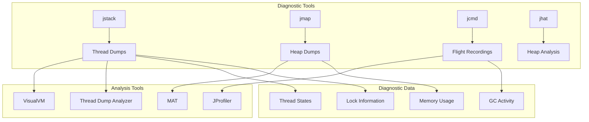

# 09. JVM Diagnostics

## Introduction

JVM diagnostics is the practice of investigating and resolving issues in Java applications through various diagnostic techniques. This includes thread dumps for analyzing concurrency issues, heap dumps for memory problems, flight recordings for comprehensive profiling, and various command-line tools for real-time analysis. Effective diagnostics can mean the difference between hours of debugging and minutes of problem resolution.

This topic covers the essential diagnostic techniques every Java developer should master, from basic thread dumps to advanced flight recorder analysis, along with the tools and commands needed to perform effective diagnostics.

## Learning Objectives

By the end of this topic, you will be able to:

- [ ] Capture and analyze thread dumps effectively
- [ ] Generate and analyze heap dumps for memory issues
- [ ] Use Java Flight Recorder for comprehensive diagnostics
- [ ] Identify deadlocks, thread contention, and memory leaks
- [ ] Use diagnostic tools like jstack, jmap, jcmd, and jhat
- [ ] Interpret diagnostic data to find root causes
- [ ] Set up automated diagnostic collection

## Prerequisites

- Completion of Topic 08: Profiling Tools
- Understanding of Java concurrency
- Familiarity with JVM memory model
- Basic knowledge of Java applications

## Why This Concept Exists

### The Debugging Challenge

Java applications can experience various issues:
- **Deadlocks**: Threads waiting for each other indefinitely
- **Memory Leaks**: Objects that are never garbage collected
- **High CPU**: Threads consuming excessive CPU
- **Slow Response**: Application becomes unresponsive
- **Crashes**: Unexpected application termination

### The Diagnostic Solution

Diagnostic techniques provide:
- **Root Cause Analysis**: Find the exact source of problems
- **Non-invasive Investigation**: Analyze running applications
- **Production Safety**: Diagnose issues without stopping the application
- **Historical Analysis**: Capture and analyze past issues

### Real-World Impact

Effective diagnostics affect:
- **Mean Time to Resolution**: Faster problem solving
- **Application Availability**: Less downtime
- **Development Productivity**: Less time debugging
- **User Satisfaction**: More reliable applications

## Problem Statement

### The Diagnostic Challenge

Without proper diagnostics, developers face:
- **Guesswork**: Trying to fix issues without understanding them
- **Reproduction difficulty**: Issues that are hard to reproduce
- **Production blind spots**: No visibility into production behavior
- **Long debugging sessions**: Spending hours or days on issues

### Real-World Example

A production application experienced:
- Intermittent deadlocks causing 30-second freezes
- Memory usage growing until OutOfMemoryError
- High CPU spikes every few minutes

The solution? Using diagnostic tools to capture and analyze the issues.

## Theory

### Diagnostic Techniques

```
┌─────────────────────────────────────────────────────────────┐
│                    JVM Diagnostics                           │
│                                                             │
│  ┌─────────────────────────────────────────────────────┐   │
│  │  Thread Dumps                                        │   │
│  │  - Capture thread states                            │   │
│  │  - Identify deadlocks                               │   │
│  │  - Analyze contention                               │   │
│  └─────────────────────────────────────────────────────┘   │
│                                                             │
│  ┌─────────────────────────────────────────────────────┐   │
│  │  Heap Dumps                                          │   │
│  │  - Capture heap snapshot                            │   │
│  │  - Find memory leaks                                │   │
│  │  - Analyze object graph                             │   │
│  └─────────────────────────────────────────────────────┘   │
│                                                             │
│  ┌─────────────────────────────────────────────────────┐   │
│  │  Flight Recordings                                   │   │
│  │  - Comprehensive profiling data                     │   │
│  │  - Low overhead                                     │   │
│  │  - Historical analysis                              │   │
│  └─────────────────────────────────────────────────────┘   │
│                                                             │
│  ┌─────────────────────────────────────────────────────┐   │
│  │  Command-line Tools                                  │   │
│  │  - jstack, jmap, jcmd, jhat                         │   │
│  │  - Real-time monitoring                             │   │
│  │  - Quick diagnostics                                │   │
│  └─────────────────────────────────────────────────────┘   │
└─────────────────────────────────────────────────────────────┘
```

### Thread Dump Analysis

```
┌─────────────────────────────────────────────────────────────┐
│                    Thread States                             │
│                                                             │
│  ┌─────────────────────────────────────────────────────┐   │
│  │  RUNNABLE                                            │   │
│  │  - Thread is executing                               │   │
│  │  - May be in native code                             │   │
│  └─────────────────────────────────────────────────────┘   │
│                                                             │
│  ┌─────────────────────────────────────────────────────┐   │
│  │  BLOCKED                                             │   │
│  │  - Waiting to acquire monitor                        │   │
│  │  - Potential deadlock                                │   │
│  └─────────────────────────────────────────────────────┘   │
│                                                             │
│  ┌─────────────────────────────────────────────────────┐   │
│  │  WAITING                                             │   │
│  │  - Waiting indefinitely                              │   │
│  │  - Object.wait(), Thread.join()                      │   │
│  └─────────────────────────────────────────────────────┘   │
│                                                             │
│  ┌─────────────────────────────────────────────────────┐   │
│  │  TIMED_WAITING                                       │   │
│  │  - Waiting with timeout                              │   │
│  │  - sleep(), wait(timeout)                            │   │
│  └─────────────────────────────────────────────────────┘   │
└─────────────────────────────────────────────────────────────┘
```

### Heap Dump Structure

```
┌─────────────────────────────────────────────────────────────┐
│                    Heap Dump Contents                        │
│                                                             │
│  ┌─────────────────────────────────────────────────────┐   │
│  │  All Objects                                         │   │
│  │  - Instance data                                     │   │
│  │  - Class information                                 │   │
│  │  - Array elements                                    │   │
│  └─────────────────────────────────────────────────────┘   │
│                                                             │
│  ┌─────────────────────────────────────────────────────┐   │
│  │  All GC Roots                                        │   │
│  │  - Local variables                                   │   │
│  │  - Static variables                                  │   │
│  │  - JNI references                                    │   │
│  └─────────────────────────────────────────────────────┘   │
│                                                             │
│  ┌─────────────────────────────────────────────────────┐   │
│  │  Reference Information                               │   │
│  │  - Object references                                 │   │
│  │  - Reference types                                   │   │
│  │  - Retained sizes                                    │   │
│  └─────────────────────────────────────────────────────┘   │
└─────────────────────────────────────────────────────────────┘
```

## Internal Working

### Thread Dump Collection

```
1. Signal Handler
   ├── JVM receives SIGQUIT (Unix) or Ctrl+Break (Windows)
   ├── Signal handler invoked
   └── Thread stack traces collected

2. Stack Trace Collection
   ├── For each thread:
   │   ├── Current stack frame
   │   ├── Method execution points
   │   ├── Lock information
   │   └── Thread state
   └── Thread scheduling information

3. Lock Information
   ├── Owned locks
   ├── Waiting locks
   ├── Blocked locks
   └── Deadlock detection

4. Output Generation
   ├── Format thread information
   ├── Add thread headers
   └── Write to output
```

### Heap Dump Collection

```
1. Trigger Heap Dump
   ├── Signal (SIGQUIT)
   ├── jmap command
   ├── JMX API
   └── OutOfMemoryError

2. Stop-the-World Pause
   ├── Pause all threads
   ├── Ensure consistent state
   └── Minimal pause for diagnostics

3. Heap Traversal
   ├── Start from GC roots
   ├── Follow all references
   ├── Record all objects
   └── Calculate retained sizes

4. File Writing
   ├── Write object data
   ├── Write class information
   ├── Write reference information
   └── Write GC root information
```

## JVM Perspective

### What the JVM Sees

The JVM provides:
- **Thread Information**: Complete thread state and stack traces
- **Heap Information**: All objects and their relationships
- **Lock Information**: Monitor and lock states
- **GC Information**: Garbage collection state and history

### Diagnostic APIs

```
┌─────────────────────────────────────────────────────────────┐
│                    Diagnostic APIs                           │
│                                                             │
│  ┌─────────────────────────────────────────────────────┐   │
│  │  ManagementFactory                                   │   │
│  │  - ThreadMXBean                                      │   │
│  │  - MemoryMXBean                                      │   │
│  │  - RuntimeMXBean                                     │   │
│  └─────────────────────────────────────────────────────┘   │
│                                                             │
│  ┌─────────────────────────────────────────────────────┐   │
│  │  HotSpotDiagnosticMXBean                             │   │
│  │  - Heap dump generation                              │   │
│  │  - VM options                                        │   │
│  └─────────────────────────────────────────────────────┘   │
│                                                             │
│  ┌─────────────────────────────────────────────────────┐   │
│  │  JVMTI                                               │   │
│  │  - Thread information                                │   │
│  │  - Heap walking                                      │   │
│  │  - Event notification                                │   │
│  └─────────────────────────────────────────────────────┘   │
└─────────────────────────────────────────────────────────────┘
```

## Memory Representation

### Thread Dump Format

```
"main" #1 prio=5 tid=0x00007f8b1c008800 nid=0x1234 runnable 
   java.lang.Thread.State: RUNNABLE
    at com.example.MyClass.myMethod(MyClass.java:42)
    at com.example.Main.main(Main.java:10)
    - locked <0x00000007aab00000> (a java.lang.Object)
    at sun.reflect.NativeMethodAccessorImpl.invoke0(Native Method)
    at sun.reflect.NativeMethodAccessorImpl.invoke(NativeMethodAccessorImpl.java:62)
    at sun.reflect.DelegatingMethodAccessorImpl.invoke(DelegatingMethodAccessorImpl.java:43)
    at java.lang.reflect.Method.invoke(Method.java:498)
    at sun.launcher.LauncherHelper$FXHelper.main(LauncherHelper.java:767)

   Locked ownable synchronizers:
    - None
```

### Heap Dump Structure

```
┌─────────────────────────────────────────────────────────────┐
│                    HPROF File Structure                      │
│                                                             │
│  ┌─────────────────────────────────────────────────────┐   │
│  │  Header                                              │   │
│  │  - Version information                               │   │
│  │  - Timestamp                                         │   │
│  │  - Platform information                              │   │
│  └─────────────────────────────────────────────────────┘   │
│                                                             │
│  ┌─────────────────────────────────────────────────────┐   │
│  │  String Records                                      │   │
│  │  - All strings in the heap                           │   │
│  └─────────────────────────────────────────────────────┘   │
│                                                             │
│  ┌─────────────────────────────────────────────────────┐   │
│  │  Class Records                                        │   │
│  │  - Class definitions                                 │   │
│  │  - Static fields                                     │   │
│  └─────────────────────────────────────────────────────┘   │
│                                                             │
│  ┌─────────────────────────────────────────────────────┐   │
│  │  Instance Records                                     │   │
│  │  - Object instances                                  │   │
│  │  - Field values                                      │   │
│  └─────────────────────────────────────────────────────┘   │
│                                                             │
│  ┌─────────────────────────────────────────────────────┐   │
│  │  Array Records                                        │   │
│  │  - Array instances                                   │   │
│  │  - Array elements                                    │   │
│  └─────────────────────────────────────────────────────┘   │
│                                                             │
│  ┌─────────────────────────────────────────────────────┐   │
│  │  Root Records                                         │   │
│  │  - GC roots                                          │   │
│  │  - Root types                                         │   │
│  └─────────────────────────────────────────────────────┘   │
└─────────────────────────────────────────────────────────────┘
```

## Architecture Diagram (Mermaid)



## Flow Diagram (Mermaid)


---

**Continue to Part 2**: README-part2.md | Part 3 | Part 4