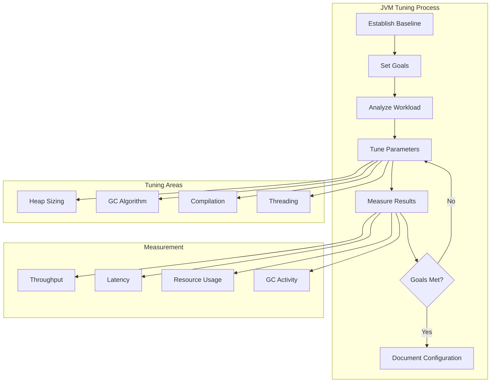
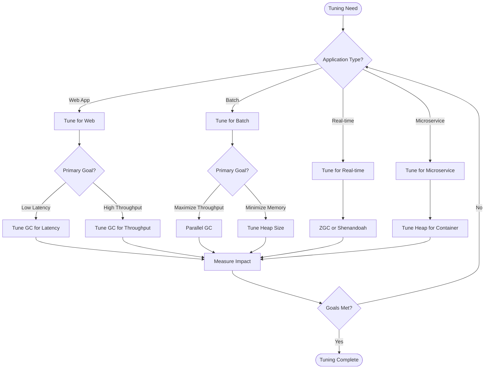

# 10. JVM Tuning

## Introduction

JVM tuning is the process of optimizing Java application performance by configuring JVM parameters, garbage collection, memory settings, and runtime options. Proper tuning can dramatically improve application throughput, latency, and resource utilization. However, tuning must be done carefully based on actual workload characteristics and measured results.

This topic covers the essential JVM tuning techniques including GC tuning, heap sizing, JVM flags, and performance optimization strategies. We'll explore how to measure the impact of tuning changes and establish a systematic approach to performance optimization.

## Learning Objectives

By the end of this topic, you will be able to:

- [ ] Identify JVM tuning goals and constraints
- [ ] Configure heap sizing appropriately
- [ ] Tune garbage collection for specific workloads
- [ ] Use JVM flags effectively for performance optimization
- [ ] Measure and validate tuning changes
- [ ] Establish baselines and track improvements
- [ ] Apply tuning best practices for different application types

## Prerequisites

- Completion of Topic 09: JVM Diagnostics
- Understanding of JVM memory model
- Familiarity with garbage collection algorithms
- Basic knowledge of performance metrics

## Why This Concept Exists

### The Default Configuration Problem

JVM default settings are designed for general use cases:
- **Heap Size**: 256MB - 1GB (too small for many applications)
- **GC Algorithm**: G1 GC (may not be optimal for all workloads)
- **Compilation**: Tiered compilation (may not be optimal for all cases)
- **Threading**: Default thread pool sizes (may not match workload)

### The Tuning Solution

JVM tuning provides:
- **Optimized Performance**: Settings tailored to specific workloads
- **Resource Efficiency**: Better use of available hardware
- **Predictable Behavior**: Consistent performance under load
- **Cost Optimization**: Reduced infrastructure requirements

### Real-World Impact

Proper tuning affects:
- **Throughput**: More work done per unit time
- **Latency**: Faster response times
- **Resource Usage**: Lower CPU and memory consumption
- **Scalability**: Better handling of increased load

## Problem Statement

### The Tuning Challenge

Without proper tuning, applications face:
- **Poor Performance**: Applications not meeting performance requirements
- **Resource Waste**: Inefficient use of hardware resources
- **Unpredictable Behavior**: Inconsistent performance under load
- **High Costs**: Over-provisioned infrastructure

### Real-World Example

A web application experienced:
- 500ms average response time (target: 100ms)
- 80% CPU utilization at low traffic
- Frequent GC pauses causing timeouts

The solution? Systematic JVM tuning based on workload analysis.

## Theory

### JVM Tuning Goals

```
┌─────────────────────────────────────────────────────────────┐
│                    Tuning Goals                              │
│                                                             │
│  ┌─────────────────────────────────────────────────────┐   │
│  │  Throughput                                          │   │
│  │  - Maximize work done per unit time                 │   │
│  │  - Minimize GC overhead                             │   │
│  │  - Optimize batch processing                        │   │
│  └─────────────────────────────────────────────────────┘   │
│                                                             │
│  ┌─────────────────────────────────────────────────────┐   │
│  │  Latency                                             │   │
│  │  - Minimize response times                          │   │
│  │  - Reduce GC pause times                            │   │
│  │  - Optimize interactive applications                │   │
│  └─────────────────────────────────────────────────────┘   │
│                                                             │
│  ┌─────────────────────────────────────────────────────┐   │
│  │  Memory                                              │   │
│  │  - Minimize memory footprint                        │   │
│  │  - Reduce GC overhead                               │   │
│  │  - Optimize for container environments              │   │
│  └─────────────────────────────────────────────────────┘   │
│                                                             │
│  ┌─────────────────────────────────────────────────────┐   │
│  │  Cost                                                │   │
│  │  - Reduce infrastructure costs                      │   │
│  │  - Optimize resource utilization                    │   │
│  │  - Balance performance and cost                     │   │
│  └─────────────────────────────────────────────────────┘   │
└─────────────────────────────────────────────────────────────┘
```

### Heap Sizing Strategy

```
┌─────────────────────────────────────────────────────────────┐
│                    Heap Sizing                               │
│                                                             │
│  ┌─────────────────────────────────────────────────────┐   │
│  │  Initial Heap Size (-Xms)                           │   │
│  │  - Starting heap size                               │   │
│  │  - Avoids resize overhead                           │   │
│  │  - Set to expected steady-state size                │   │
│  └─────────────────────────────────────────────────────┘   │
│                                                             │
│  ┌─────────────────────────────────────────────────────┐   │
│  │  Maximum Heap Size (-Xmx)                           │   │
│  │  - Maximum heap size                                │   │
│  │  - Prevents OutOfMemoryError                        │   │
│  │  - Set based on available memory                    │   │
│  └─────────────────────────────────────────────────────┘   │
│                                                             │
│  ┌─────────────────────────────────────────────────────┐   │
│  │  Young Generation Size                              │   │
│  │  - Controls allocation rate                         │   │
│  │  - Affects GC frequency                             │   │
│  │  - Tune based on object lifetime                    │   │
│  └─────────────────────────────────────────────────────┘   │
└─────────────────────────────────────────────────────────────┘
```

### GC Tuning Parameters

```
┌─────────────────────────────────────────────────────────────┐
│                    GC Tuning Parameters                      │
│                                                             │
│  ┌─────────────────────────────────────────────────────┐   │
│  │  G1 GC Parameters                                    │   │
│  │  -XX:MaxGCPauseMillis=200                           │   │
│  │  -XX:GCTimeRatio=12                                 │   │
│  │  -XX:InitiatingHeapOccupancyPercent=45              │   │
│  └─────────────────────────────────────────────────────┘   │
│                                                             │
│  ┌─────────────────────────────────────────────────────┐   │
│  │  ZGC Parameters                                      │   │
│  │  -XX:SoftMaxHeapSize=4g                             │   │
│  │  -XX:ConcGCThreads=4                                │   │
│  │  -XX:ZCollectionInterval=5                          │   │
│  └─────────────────────────────────────────────────────┘   │
│                                                             │
│  ┌─────────────────────────────────────────────────────┐   │
│  │  General GC Parameters                              │   │
│  │  -XX:NewRatio=2                                     │   │
│  │  -XX:SurvivorRatio=8                                │   │
│  │  -XX:MaxTenuringThreshold=15                        │   │
│  └─────────────────────────────────────────────────────┘   │
└─────────────────────────────────────────────────────────────┘
```

## Internal Working

### Tuning Process

```
1. Establish Baseline
   ├── Measure current performance
   ├── Document resource usage
   └── Identify bottlenecks

2. Set Goals
   ├── Define performance targets
   ├── Set resource constraints
   └── Establish success criteria

3. Analyze Workload
   ├── Profile application behavior
   ├── Identify hot paths
   └── Measure object lifecycle

4. Tune Parameters
   ├── Adjust heap sizing
   ├── Configure GC algorithm
   └── Optimize compilation

5. Measure Results
   ├── Compare with baseline
   ├── Validate goals met
   └── Document improvements

6. Iterate
   ├── Fine-tune based on results
   ├── Test under different loads
   └── Document final configuration
```

### Measurement Strategy

```
┌─────────────────────────────────────────────────────────────┐
│                    Measurement Strategy                      │
│                                                             │
│  ┌─────────────────────────────────────────────────────┐   │
│  │  Key Metrics                                         │   │
│  │  - Throughput (requests/second)                     │   │
│  │  - Latency (response time)                          │   │
│  │  - GC pause time                                    │   │
│  │  - CPU utilization                                  │   │
│  │  - Memory usage                                     │   │
│  └─────────────────────────────────────────────────────┘   │
│                                                             │
│  ┌─────────────────────────────────────────────────────┐   │
│  │  Measurement Tools                                   │   │
│  │  - JMH (micro-benchmarks)                           │   │
│  │  - JFR (continuous profiling)                       │   │
│  │  - GC logging                                       │   │
│  │  - Application monitoring                           │   │
│  └─────────────────────────────────────────────────────┘   │
│                                                             │
│  ┌─────────────────────────────────────────────────────┐   │
│  │  Test Scenarios                                      │   │
│  │  - Steady-state load                                │   │
│  │  - Peak load                                        │   │
│  │  - Ramp-up                                          │   │
│  │  - Soak testing                                     │   │
│  └─────────────────────────────────────────────────────┘   │
└─────────────────────────────────────────────────────────────┘
```

## JVM Perspective

### What the JVM Sees

The JVM sees:
- **Heap Regions**: Different memory areas for different purposes
- **GC Threads**: Threads performing garbage collection
- **Compilation Threads**: Threads performing JIT compilation
- **Application Threads**: Threads running application code

### JVM Parameter Categories

```
┌─────────────────────────────────────────────────────────────┐
│                    JVM Parameter Categories                  │
│                                                             │
│  ┌─────────────────────────────────────────────────────┐   │
│  │  Standard Options                                    │   │
│  │  - -Xms, -Xmx                                       │   │
│  │  - -server, -client                                  │   │
│  │  - -classpath                                        │   │
│  └─────────────────────────────────────────────────────┘   │
│                                                             │
│  ┌─────────────────────────────────────────────────────┐   │
│  │  Non-Standard Options                                │   │
│  │  - -XX:+UseG1GC                                      │   │
│  │  - -XX:MaxGCPauseMillis                              │   │
│  │  - -XX:+PrintGCDetails                               │   │
│  └─────────────────────────────────────────────────────┘   │
│                                                             │
│  ┌─────────────────────────────────────────────────────┐   │
│  │  Diagnostic Options                                  │   │
│  │  - -XX:+UnlockDiagnosticVMOptions                    │   │
│  │  - -XX:+PrintCompilation                             │   │
│  │  - -XX:+PrintInlining                                │   │
│  └─────────────────────────────────────────────────────┘   │
└─────────────────────────────────────────────────────────────┘
```

## Memory Representation

### Heap Memory Layout

```
┌─────────────────────────────────────────────────────────────┐
│                    Heap Memory Layout                        │
│                                                             │
│  ┌─────────────────────────────────────────────────────┐   │
│  │  Young Generation (1/3 of heap)                     │   │
│  │  ┌─────────────────────────────────────────────┐   │   │
│  │  │  Eden (8/10 of Young Gen)                    │   │   │
│  │  │  ┌─────────────────────────────────────┐   │   │   │
│  │  │  │  New Objects                        │   │   │   │
│  │  │  └─────────────────────────────────────┘   │   │   │
│  │  └─────────────────────────────────────────────┘   │   │
│  │  ┌─────────────────────────────────────────────┐   │   │
│  │  │  Survivor 0 (1/10 of Young Gen)             │   │   │
│  │  └─────────────────────────────────────────────┘   │   │
│  │  ┌─────────────────────────────────────────────┐   │   │
│  │  │  Survivor 1 (1/10 of Young Gen)             │   │   │
│  │  └─────────────────────────────────────────────┘   │   │
│  └─────────────────────────────────────────────────────┘   │
│                                                             │
│  ┌─────────────────────────────────────────────────────┐   │
│  │  Old Generation (2/3 of heap)                       │   │
│  │  ┌─────────────────────────────────────────────┐   │   │
│  │  │  Long-lived Objects                          │   │   │
│  │  └─────────────────────────────────────────────┘   │   │
│  └─────────────────────────────────────────────────────┘   │
│                                                             │
│  ┌─────────────────────────────────────────────────────┐   │
│  │  Metaspace (Off-heap)                               │   │
│  │  ┌─────────────────────────────────────────────┐   │   │
│  │  │  Class Metadata                               │   │   │
│  │  └─────────────────────────────────────────────┘   │   │
│  └─────────────────────────────────────────────────────┘   │
└─────────────────────────────────────────────────────────────┘
```

## Architecture Diagram (Mermaid)



## Flow Diagram (Mermaid)

```mermaid
flowchart TD
    Start([Tuning Need]) --> Analyze[Analyze Current Performance]
    Analyze --> Identify{Identify Bottleneck?}
    Identify -->|CPU| TuneCPU[Tune CPU Settings]
    Identify -->|Memory| TuneMemory[Tune Memory Settings]
    Identify -->|GC| TuneGC[Tune GC Settings]
    Identify -->|I/O| TuneIO[Tune I/O Settings]
    
    TuneCPU --> Measure[Measure Impact]
    TuneMemory --> Measure
    TuneGC --> Measure
    TuneIO --> Measure
    
    Measure --> Goals{Goals Met?}
    Goals -->|No| Identify
    Goals -->|Yes] Document[Document Configuration]
    
    Document --> Done([Tuning Complete])
```

## Syntax (with examples)

### Heap Sizing Flags

```bash
# Set initial and maximum heap size
java -Xms2g -Xmx4g MyApp

# Set young generation size
java -Xmn512m MyApp

# Set survivor ratio
java -XX:SurvivorRatio=8 MyApp

# Set new ratio
java -XX:NewRatio=2 MyApp
```

### GC Tuning Flags

```bash
# G1 GC tuning
java -XX:+UseG1GC \
     -XX:MaxGCPauseMillis=200 \
     -XX:GCTimeRatio=12 \
     -XX:InitiatingHeapOccupancyPercent=45 \
     MyApp

# ZGC tuning
java -XX:+UseZGC \
     -XX:SoftMaxHeapSize=4g \
     -XX:ConcGCThreads=4 \
     MyApp

# Shenandoah tuning
java -XX:+UseShenandoahGC \
     -XX:ShenandoahGCHeuristics=compact \
     MyApp
```

### GC Logging Flags

```bash
# Enable GC logging (Java 9+)
java -Xlog:gc*:file=gc.log:time,uptime,level,tags MyApp

# Enable GC logging (Java 8)
java -XX:+PrintGCDetails \
     -XX:+PrintGCDateStamps \
     -XX:+PrintHeapAtGC \
     -Xloggc:gc.log \
     MyApp

# Enable GC logging with rotation
java -Xlog:gc*:file=gc.log:time,uptime,level,tags:filecount=5,filesize=10m MyApp
```

### Performance Flags

```bash
# Enable JIT compilation logging
java -XX:+PrintCompilation MyApp

# Enable escape analysis
java -XX:+DoEscapeAnalysis MyApp

# Set code cache size
java -XX:ReservedCodeCacheSize=256m MyApp

# Enable large pages
java -XX:+UseLargePages MyApp
```

## Easy Example

### Basic JVM Tuning Demo

```java
package academy.javaengineering.jvm.tuning;

/**
 * Simple application for JVM tuning demonstration.
 */
public class BasicTuningDemo {
    
    public static void main(String[] args) {
        System.out.println("=== Basic JVM Tuning Demo ===\n");
        
        // Print current JVM configuration
        printJVMConfiguration();
        
        // Simulate workload
        simulateWorkload();
        
        // Print performance metrics
        printPerformanceMetrics();
    }
    
    private static void printJVMConfiguration() {
        System.out.println("--- JVM Configuration ---");
        
        Runtime runtime = Runtime.getRuntime();
        System.out.printf("Available Processors: %d%n", runtime.availableProcessors());
        System.out.printf("Max Memory: %d MB%n", runtime.maxMemory() / (1024 * 1024));
        System.out.printf("Total Memory: %d MB%n", runtime.totalMemory() / (1024 * 1024));
        System.out.printf("Free Memory: %d MB%n", runtime.freeMemory() / (1024 * 1024));
        
        System.out.println();
    }
    
    private static void simulateWorkload() {
        System.out.println("--- Simulating Workload ---");
        
        long startTime = System.nanoTime();
        
        // CPU intensive work
        for (int i = 0; i < 1_000_000; i++) {
            Math.sqrt(i);
        }
        
        // Memory allocation
        java.util.List<byte[]> list = new java.util.ArrayList<>();
        for (int i = 0; i < 1000; i++) {
            list.add(new byte[1024]);
        }
        
        long duration = (System.nanoTime() - startTime) / 1_000_000;
        System.out.printf("Workload completed in %d ms%n", duration);
        System.out.println();
    }
    
    private static void printPerformanceMetrics() {
        System.out.println("--- Performance Metrics ---");
        
        Runtime runtime = Runtime.getRuntime();
        long totalMemory = runtime.totalMemory();
        long freeMemory = runtime.freeMemory();
        long usedMemory = totalMemory - freeMemory;
        
        System.out.printf("Used Memory: %d MB%n", usedMemory / (1024 * 1024));
        System.out.printf("Free Memory: %d MB%n", freeMemory / (1024 * 1024));
        System.out.printf("Total Memory: %d MB%n", totalMemory / (1024 * 1024));
        
        // Get GC information
        java.lang.management.List<java.lang.management.GarbageCollectorMXBean> gcBeans = 
            java.lang.management.ManagementFactory.getGarbageCollectorMXBeans();
        
        for (java.lang.management.GarbageCollectorMXBean gcBean : gcBeans) {
            System.out.printf("GC: %s, Collections: %d, Time: %d ms%n",
                gcBean.getName(), gcBean.getCollectionCount(), gcBean.getCollectionTime());
        }
    }
}
```

## Medium Example

### GC Tuning Benchmark

```java
package academy.javaengineering.jvm.tuning;

import java.util.*;
import java.util.concurrent.*;

/**
 * GC tuning benchmark for comparing different configurations.
 */
public class GCTuningBenchmark {
    
    private static final int OBJECT_COUNT = 1_000_000;
    private static final int THREAD_COUNT = 4;
    
    public static void main(String[] args) throws InterruptedException {
        System.out.println("=== GC Tuning Benchmark ===\n");
        
        // Print current GC configuration
        printGCConfiguration();
        
        // Benchmark different allocation patterns
        benchmarkAllocationPatterns();
        
        // Benchmark different object sizes
        benchmarkObjectSizes();
        
        // Print final statistics
        printFinalStatistics();
    }
    
    private static void printGCConfiguration() {
        System.out.println("--- GC Configuration ---");
        
        java.lang.management.RuntimeMXBean runtimeBean = 
            java.lang.management.ManagementFactory.getRuntimeMXBean();
        java.util.List<String> vmArgs = runtimeBean.getInputArguments();
        
        System.out.println("JVM Arguments:");
        for (String arg : vmArgs) {
            if (arg.contains("GC") || arg.contains("gc") || arg.contains("Heap")) {
                System.out.println("  " + arg);
            }
        }
        
        System.out.println();
    }
    
    private static void benchmarkAllocationPatterns() throws InterruptedException {
        System.out.println("--- Allocation Pattern Benchmark ---");
        
        // Sequential allocation
        long startTime = System.nanoTime();
        for (int i = 0; i < 10; i++) {
            allocateSequentially();
        }
        long duration = (System.nanoTime() - startTime) / 1_000_000;
        System.out.printf("Sequential allocation: %d ms%n", duration);
        
        // Random allocation
        startTime = System.nanoTime();
        for (int i = 0; i < 10; i++) {
            allocateRandomly();
        }
        duration = (System.nanoTime() - startTime) / 1_000_000;
        System.out.printf("Random allocation: %d ms%n", duration);
        
        System.out.println();
    }
    
    private static void allocateSequentially() {
        java.util.List<Object> objects = new java.util.ArrayList<>();
        for (int i = 0; i < OBJECT_COUNT; i++) {
            objects.add(new Object());
        }
    }
    
    private static void allocateRandomly() {
        java.util.List<Object> objects = new java.util.ArrayList<>();
        Random random = new Random();
        for (int i = 0; i < OBJECT_COUNT; i++) {
            objects.add(new Object());
            if (random.nextBoolean() && !objects.isEmpty()) {
                objects.remove(random.nextInt(objects.size()));
            }
        }
    }
    
    private static void benchmarkObjectSizes() throws InterruptedException {
        System.out.println("--- Object Size Benchmark ---");
        
        // Small objects
        long startTime = System.nanoTime();
        for (int i = 0; i < 10; i++) {
            allocateSmallObjects();
        }
        long duration = (System.nanoTime() - startTime) / 1_000_000;
        System.out.printf("Small objects (16 bytes): %d ms%n", duration);
        
        // Medium objects
        startTime = System.nanoTime();
        for (int i = 0; i < 10; i++) {
            allocateMediumObjects();
        }
        duration = (System.nanoTime() - startTime) / 1_000_000;
        System.out.printf("Medium objects (1KB): %d ms%n", duration);
        
        // Large objects
        startTime = System.nanoTime();
        for (int i = 0; i < 10; i++) {
            allocateLargeObjects();
        }
        duration = (System.nanoTime() - startTime) / 1_000_000;
        System.out.printf("Large objects (1MB): %d ms%n", duration);
        
        System.out.println();
    }
    
    private static void allocateSmallObjects() {
        for (int i = 0; i < OBJECT_COUNT; i++) {
            new Object();
        }
    }
    
    private static void allocateMediumObjects() {
        for (int i = 0; i < OBJECT_COUNT; i++) {
            new byte[1024];
        }
    }
    
    private static void allocateLargeObjects() {
        for (int i = 0; i < 1000; i++) {
            new byte[1024 * 1024];
        }
    }
    
    private static void printFinalStatistics() {
        System.out.println("--- Final Statistics ---");
        
        Runtime runtime = Runtime.getRuntime();
        long totalMemory = runtime.totalMemory();
        long freeMemory = runtime.freeMemory();
        long usedMemory = totalMemory - freeMemory;
        long maxMemory = runtime.maxMemory();
        
        System.out.printf("Used Memory: %d MB%n", usedMemory / (1024 * 1024));
        System.out.printf("Free Memory: %d MB%n", freeMemory / (1024 * 1024));
        System.out.printf("Total Memory: %d MB%n", totalMemory / (1024 * 1024));
        System.out.printf("Max Memory: %d MB%n", maxMemory / (1024 * 1024));
        
        java.lang.management.List<java.lang.management.GarbageCollectorMXBean> gcBeans = 
            java.lang.management.ManagementFactory.getGarbageCollectorMXBeans();
        for (java.lang.management.GarbageCollectorMXBean gcBean : gcBeans) {
            System.out.printf("GC: %s, Collections: %d, Time: %d ms%n",
                gcBean.getName(), gcBean.getCollectionCount(), gcBean.getCollectionTime());
        }
    }
}
```

## Hard Example

### Comprehensive Tuning Framework

```java
package academy.javaengineering.jvm.tuning;

import java.lang.management.*;
import java.util.*;
import java.util.concurrent.*;

/**
 * Comprehensive JVM tuning framework.
 */
public class ComprehensiveTuningFramework {
    
    private final ScheduledExecutorService scheduler = Executors.newScheduledThreadPool(3);
    private final MemoryMXBean memoryBean = ManagementFactory.getMemoryMXBean();
    private final ThreadMXBean threadBean = ManagementFactory.getThreadMXBean();
    private final List<GarbageCollectorMXBean> gcBeans = ManagementFactory.getGarbageCollectorMXBeans();
    private final RuntimeMXBean runtimeBean = ManagementFactory.getRuntimeMXBean();
    
    private final List<TuningSnapshot> snapshots = new CopyOnWriteArrayList<>();
    private volatile boolean running = true;
    
    public void startTuning() {
        System.out.println("=== Comprehensive Tuning Framework ===\n");
        
        // Print initial configuration
        printInitialConfiguration();
        
        // Schedule metric collection
        scheduler.scheduleAtFixedRate(this::collectMetrics, 0, 5, TimeUnit.SECONDS);
        
        // Schedule tuning analysis
        scheduler.scheduleAtFixedRate(this::analyzeTuning, 0, 1, TimeUnit.MINUTES);
        
        System.out.println("Tuning framework started. Press Ctrl+C to stop.\n");
    }
    
    private void printInitialConfiguration() {
        System.out.println("--- Initial Configuration ---");
        
        // Print JVM arguments
        List<String> vmArgs = runtimeBean.getInputArguments();
        System.out.println("JVM Arguments:");
        for (String arg : vmArgs) {
            System.out.println("  " + arg);
        }
        
        // Print memory configuration
        System.out.println("\nMemory Configuration:");
        System.out.printf("  Initial Heap: %d MB%n", runtimeBean.getUptime() / 1000);
        System.out.printf("  Max Heap: %d MB%n", memoryBean.getHeapMemoryUsage().getMax() / (1024 * 1024));
        
        // Print GC configuration
        System.out.println("\nGC Configuration:");
        for (GarbageCollectorMXBean gcBean : gcBeans) {
            System.out.printf("  %s%n", gcBean.getName());
        }
        
        System.out.println();
    }
    
    private void collectMetrics() {
        try {
            MemoryUsage heapUsage = memoryBean.getHeapMemoryUsage();
            long threadCount = threadBean.getThreadCount();
            long gcTime = 0;
            for (GarbageCollectorMXBean gcBean : gcBeans) {
                gcTime += gcBean.getCollectionTime();
            }
            
            TuningSnapshot snapshot = new TuningSnapshot(
                System.currentTimeMillis(),
                heapUsage.getUsed(),
                heapUsage.getCommitted(),
                heapUsage.getMax(),
                threadCount,
                gcTime,
                runtimeBean.getUptime()
            );
            
            snapshots.add(snapshot);
            
            // Keep only last 1000 snapshots
            if (snapshots.size() > 1000) {
                snapshots.remove(0);
            }
        } catch (Exception e) {
            System.err.println("Error collecting metrics: " + e.getMessage());
        }
    }
    
    private void analyzeTuning() {
        try {
            System.out.println("\n" + "=".repeat(70));
            System.out.println("TUNING ANALYSIS REPORT");
            System.out.println("=".repeat(70));
            
            if (snapshots.size() >= 2) {
                TuningSnapshot first = snapshots.get(0);
                TuningSnapshot last = snapshots.get(snapshots.size() - 1);
                
                long timeDiff = last.timestamp - first.timestamp;
                long memoryDiff = last.heapUsed - first.heapUsed;
                long gcTimeDiff = last.gcTime - first.gcTime;
                
                System.out.printf("Time Window: %d seconds%n", timeDiff / 1000);
                System.out.printf("Memory Change: %d MB%n", memoryDiff / (1024 * 1024));
                System.out.printf("GC Time Added: %d ms%n", gcTimeDiff);
                
                // Analyze GC overhead
                double gcOverhead = (double) gcTimeDiff / timeDiff * 100;
                System.out.printf("GC Overhead: %.2f%%%n", gcOverhead);
                
                if (gcOverhead > 5) {
                    System.out.println("RECOMMENDATION: High GC overhead. Consider tuning GC parameters.");
                }
                
                // Analyze memory usage
                double memoryUsage = (double) last.heapUsed / last.heapMax * 100;
                System.out.printf("Memory Usage: %.1f%%%n", memoryUsage);
                
                if (memoryUsage > 80) {
                    System.out.println("RECOMMENDATION: High memory usage. Consider increasing heap size.");
                }
            }
            
            System.out.println("=".repeat(70));
        } catch (Exception e) {
            System.err.println("Error analyzing tuning: " + e.getMessage());
        }
    }
    
    public void stop() {
        running = false;
        scheduler.shutdown();
        try {
            if (!scheduler.awaitTermination(10, TimeUnit.SECONDS)) {
                scheduler.shutdownNow();
            }
        } catch (InterruptedException e) {
            scheduler.shutdownNow();
            Thread.currentThread().interrupt();
        }
    }
    
    public static void main(String[] args) {
        ComprehensiveTuningFramework framework = new ComprehensiveTuningFramework();
        framework.startTuning();
        
        // Simulate application workload
        simulateWorkload();
        
        // Run for 5 minutes
        try {
            Thread.sleep(300_000);
        } catch (InterruptedException e) {
            Thread.currentThread().interrupt();
        }
        
        framework.stop();
    }
    
    private static void simulateWorkload() {
        new Thread(() -> {
            while (true) {
                // CPU intensive work
                for (int i = 0; i < 1000; i++) {
                    Math.sqrt(i);
                }
                
                // Memory allocation
                byte[] data = new byte[1024];
                
                try {
                    Thread.sleep(100);
                } catch (InterruptedException e) {
                    break;
                }
            }
        }).start();
    }
    
    private static class TuningSnapshot {
        final long timestamp;
        final long heapUsed;
        final long heapCommitted;
        final long heapMax;
        final long threadCount;
        final long gcTime;
        final long uptime;
        
        TuningSnapshot(long timestamp, long heapUsed, long heapCommitted, long heapMax,
                      long threadCount, long gcTime, long uptime) {
            this.timestamp = timestamp;
            this.heapUsed = heapUsed;
            this.heapCommitted = heapCommitted;
            this.heapMax = heapMax;
            this.threadCount = threadCount;
            this.gcTime = gcTime;
            this.uptime = uptime;
        }
    }
}
```

## Enterprise Example

### Production Tuning System

```java
package academy.javaengineering.jvm.tuning;

import java.lang.management.*;
import java.util.*;
import java.util.concurrent.*;

/**
 * Enterprise-grade JVM tuning system.
 */
public class EnterpriseTuningSystem {
    
    private final ScheduledExecutorService scheduler = Executors.newScheduledThreadPool(4);
    private final MemoryMXBean memoryBean = ManagementFactory.getMemoryMXBean();
    private final ThreadMXBean threadBean = ManagementFactory.getThreadMXBean();
    private final List<GarbageCollectorMXBean> gcBeans = ManagementFactory.getGarbageCollectorMXBeans();
    private final RuntimeMXBean runtimeBean = ManagementFactory.getRuntimeMXBean();
    
    private final List<TuningMetric> metrics = new CopyOnWriteArrayList<>();
    private volatile boolean running = true;
    
    public void startTuning() {
        System.out.println("=== Enterprise Tuning System ===\n");
        
        // Schedule metric collection
        scheduler.scheduleAtFixedRate(this::collectMetrics, 0, 5, TimeUnit.SECONDS);
        
        // Schedule tuning recommendations
        scheduler.scheduleAtFixedRate(this::generateRecommendations, 0, 5, TimeUnit.MINUTES);
        
        // Schedule performance report
        scheduler.scheduleAtFixedRate(this::generatePerformanceReport, 0, 1, TimeUnit.HOURS);
        
        System.out.println("Tuning system started. Press Ctrl+C to stop.\n");
    }
    
    private void collectMetrics() {
        try {
            MemoryUsage heapUsage = memoryBean.getHeapMemoryUsage();
            long threadCount = threadBean.getThreadCount();
            long gcTime = 0;
            long gcCount = 0;
            
            for (GarbageCollectorMXBean gcBean : gcBeans) {
                gcTime += gcBean.getCollectionTime();
                gcCount += gcBean.getCollectionCount();
            }
            
            TuningMetric metric = new TuningMetric(
                System.currentTimeMillis(),
                heapUsage.getUsed(),
                heapUsage.getCommitted(),
                heapUsage.getMax(),
                threadCount,
                gcTime,
                gcCount,
                runtimeBean.getUptime(),
                runtimeBean.getProcessCpuTime()
            );
            
            metrics.add(metric);
            
            // Keep only last 10000 metrics
            if (metrics.size() > 10000) {
                metrics.remove(0);
            }
        } catch (Exception e) {
            System.err.println("Error collecting metrics: " + e.getMessage());
        }
    }
    
    private void generateRecommendations() {
        try {
            System.out.println("\n--- Tuning Recommendations ---");
            
            if (metrics.size() < 2) {
                System.out.println("Insufficient data for recommendations.");
                return;
            }
            
            TuningMetric first = metrics.get(0);
            TuningMetric last = metrics.get(metrics.size() - 1);
            
            // Analyze memory usage
            double memoryUsage = (double) last.heapUsed / last.heapMax * 100;
            if (memoryUsage > 80) {
                System.out.println("MEMORY: High heap usage detected.");
                System.out.println("  Recommendation: Increase -Xmx value.");
            } else if (memoryUsage < 30) {
                System.out.println("MEMORY: Low heap usage detected.");
                System.out.println("  Recommendation: Decrease -Xmx value to save resources.");
            }
            
            // Analyze GC overhead
            long timeDiff = last.timestamp - first.timestamp;
            long gcTimeDiff = last.gcTime - first.gcTime;
            double gcOverhead = (double) gcTimeDiff / timeDiff * 100;
            
            if (gcOverhead > 5) {
                System.out.println("GC: High GC overhead detected.");
                System.out.println("  Recommendation: Tune GC parameters or increase heap size.");
            }
            
            // Analyze thread count
            if (last.threadCount > 500) {
                System.out.println("THREADS: High thread count detected.");
                System.out.println("  Recommendation: Review thread pool configurations.");
            }
            
        } catch (Exception e) {
            System.err.println("Error generating recommendations: " + e.getMessage());
        }
    }
    
    private void generatePerformanceReport() {
        try {
            System.out.println("\n" + "=".repeat(70));
            System.out.println("PERFORMANCE REPORT");
            System.out.println("=".repeat(70));
            
            // JVM information
            System.out.println("\n--- JVM Information ---");
            System.out.printf("Java Version: %s%n", System.getProperty("java.version"));
            System.out.printf("JVM Name: %s%n", System.getProperty("java.vm.name"));
            System.out.printf("Uptime: %d seconds%n", runtimeBean.getUptime() / 1000);
            
            // Memory information
            MemoryUsage heapUsage = memoryBean.getHeapMemoryUsage();
            System.out.println("\n--- Memory Usage ---");
            System.out.printf("Heap Used: %d MB%n", heapUsage.getUsed() / (1024 * 1024));
            System.out.printf("Heap Committed: %d MB%n", heapUsage.getCommitted() / (1024 * 1024));
            System.out.printf("Heap Max: %d MB%n", heapUsage.getMax() / (1024 * 1024));
            System.out.printf("Heap Usage: %.1f%%%n", 
                (double) heapUsage.getUsed() / heapUsage.getMax() * 100);
            
            // GC information
            System.out.println("\n--- GC Statistics ---");
            for (GarbageCollectorMXBean gcBean : gcBeans) {
                System.out.printf("GC: %s%n", gcBean.getName());
                System.out.printf("  Collections: %d%n", gcBean.getCollectionCount());
                System.out.printf("  Time: %d ms%n", gcBean.getCollectionTime());
                System.out.printf("  Avg Pause: %.2f ms%n", 
                    gcBean.getCollectionCount() > 0 ? 
                    (double) gcBean.getCollectionTime() / gcBean.getCollectionCount() : 0);
            }
            
            // Thread information
            System.out.println("\n--- Thread Statistics ---");
            System.out.printf("Active Threads: %d%n", threadBean.getThreadCount());
            System.out.printf("Peak Threads: %d%n", threadBean.getPeakThreadCount());
            System.out.printf("Daemon Threads: %d%n", threadBean.getDaemonThreadCount());
            
            System.out.println("=".repeat(70));
        } catch (Exception e) {
            System.err.println("Error generating performance report: " + e.getMessage());
        }
    }
    
    public void stop() {
        running = false;
        scheduler.shutdown();
        try {
            if (!scheduler.awaitTermination(10, TimeUnit.SECONDS)) {
                scheduler.shutdownNow();
            }
        } catch (InterruptedException e) {
            scheduler.shutdownNow();
            Thread.currentThread().interrupt();
        }
    }
    
    public static void main(String[] args) {
        EnterpriseTuningSystem tuningSystem = new EnterpriseTuningSystem();
        tuningSystem.startTuning();
        
        // Simulate application workload
        simulateWorkload();
        
        // Run for 24 hours
        try {
            Thread.sleep(86_400_000);
        } catch (InterruptedException e) {
            Thread.currentThread().interrupt();
        }
        
        tuningSystem.stop();
    }
    
    private static void simulateWorkload() {
        new Thread(() -> {
            while (true) {
                // CPU intensive work
                for (int i = 0; i < 1000; i++) {
                    Math.sqrt(i);
                }
                
                // Memory allocation
                byte[] data = new byte[1024];
                
                try {
                    Thread.sleep(100);
                } catch (InterruptedException e) {
                    break;
                }
            }
        }).start();
    }
    
    private static class TuningMetric {
        final long timestamp;
        final long heapUsed;
        final long heapCommitted;
        final long heapMax;
        final long threadCount;
        final long gcTime;
        final long gcCount;
        final long uptime;
        final long cpuTime;
        
        TuningMetric(long timestamp, long heapUsed, long heapCommitted, long heapMax,
                    long threadCount, long gcTime, long gcCount, long uptime, long cpuTime) {
            this.timestamp = timestamp;
            this.heapUsed = heapUsed;
            this.heapCommitted = heapCommitted;
            this.heapMax = heapMax;
            this.threadCount = threadCount;
            this.gcTime = gcTime;
            this.gcCount = gcCount;
            this.uptime = uptime;
            this.cpuTime = cpuTime;
        }
    }
}
```

## Performance Considerations

### Tuning Impact

| Tuning Area | Performance Impact | Risk Level |
|-------------|-------------------|------------|
| Heap Sizing | High | Medium |
| GC Algorithm | High | Medium |
| Compilation | Medium | Low |
| Threading | Medium | Medium |

### Tuning Guidelines

| Application Type | Heap Size | GC Algorithm | Key Parameters |
|------------------|-----------|--------------|----------------|
| Web Application | 2-4GB | G1 GC | MaxGCPauseMillis |
| Batch Processing | 4-8GB | Parallel GC | GCTimeRatio |
| Real-time System | 2-4GB | ZGC/Shenandoah | ConcGCThreads |
| Microservice | 512MB-2GB | G1 GC | MaxGCPauseMillis |

## Time & Space Complexity

### Tuning Complexity

| Operation | Time Complexity | Space Complexity |
|-----------|-----------------|------------------|
| Heap Sizing | O(1) | O(1) |
| GC Tuning | O(n) | O(n) |
| Compilation Tuning | O(1) | O(1) |
| Measurement | O(m) | O(m) |

Where n is number of GC parameters and m is number of metrics.

## Thread Safety

### Thread-Safe Tuning

Tuning systems must be thread-safe because:
- Multiple threads collect metrics
- Tuning recommendations may be generated concurrently
- Metrics are accessed from multiple threads

### Thread-Safe Metrics Collection

```java
// Thread-safe tuning metrics collection
public class ThreadSafeTuningMetrics {
    private final ConcurrentHashMap<String, AtomicLong> metrics = 
        new ConcurrentHashMap<>();
    private final AtomicLongCollectionCount = new AtomicLong(0);
    
    public void recordMetric(String name, long value) {
        metrics.computeIfAbsent(name, k -> new AtomicLong(0))
            .addAndGet(value);
        collectionCount.incrementAndGet();
    }
    
    public long getMetric(String name) {
        return metrics.getOrDefault(name, new AtomicLong(0)).get();
    }
}
```

## Best Practices

### Tuning Best Practices

1. **Establish Baseline First**
   - Measure current performance before tuning
   - Document resource usage
   - Identify bottlenecks

2. **Tune One Parameter at a Time**
   - Change one setting at a time
   - Measure impact of each change
   - Keep what works, discard what doesn't

3. **Measure Under Realistic Load**
   - Use production-like workloads
   - Test under peak conditions
   - Soak test for memory issues

4. **Document Everything**
   - Record all changes
   - Document performance impact
   - Keep configuration history

5. **Automate Tuning**
   - Use scripts for common tuning tasks
   - Automate baseline measurements
   - Set up continuous performance monitoring

## Common Mistakes

### Mistake 1: Tuning Without Measuring

```bash
# BAD: Tuning without baseline
java -Xmx8g MyApp  # Why 8GB? No measurement

# GOOD: Tuning with measurement
# First measure: java -Xmx2g MyApp
# Then adjust based on results
```

### Mistake 2: Copying Configuration

```bash
# BAD: Copying from other applications
java -XX:+UseG1GC -XX:MaxGCPauseMillis=200 MyApp  # Why these values?

# GOOD: Tuning for your workload
# Measure your workload, then tune accordingly
```

### Mistake 3: Over-Tuning

```java
// BAD: Tuning every possible parameter
// This creates maintenance burden and may cause unexpected behavior

// GOOD: Focus on the most impactful parameters
// Heap size, GC algorithm, and key GC parameters
```

## Pitfalls & Warnings

### Pitfall 1: Container Memory Limits

```bash
# BAD: Setting heap larger than container limit
docker run -m 4g java -Xmx8g MyApp  # Will be killed

# GOOD: Respecting container limits
docker run -m 4g java -Xmx3g MyApp  # Leave room for non-heap
```

### Pitfall 2: GC Pause Time Target

```bash
# BAD: Unrealistic pause time target
java -XX:MaxGCPauseMillis=1 MyApp  # Not achievable

# GOOD: Realistic pause time target
java -XX:MaxGCPauseMillis=200 MyApp  # Achievable for most workloads
```

## Debugging Tips

### Tuning Debug Commands

```bash
# Print JVM flags
java -XX:+PrintFlagsFinal MyApp

# Print GC details
java -Xlog:gc*:file=gc.log MyApp

# Print compilation
java -XX:+PrintCompilation MyApp

# Print memory usage
jcmd <pid> GC.heap_info

# Print thread information
jcmd <pid> Thread.print
```

### Common Tuning Issues

| Issue | Symptom | Solution |
|-------|---------|----------|
| Long GC pauses | High latency | Tune GC parameters |
| High memory usage | OutOfMemoryError | Increase heap size |
| High CPU usage | Slow response | Check compilation settings |
| Low throughput | Fewer requests/sec | Tune GC for throughput |

## Comparison Table

### Tuning Parameters

| Parameter | Description | Default | Recommended |
|-----------|-------------|---------|-------------|
| -Xms | Initial heap size | 256MB | Application-specific |
| -Xmx | Maximum heap size | 256MB | Application-specific |
| -XX:+UseG1GC | Use G1 GC | Java 9+ default | Yes for most apps |
| -XX:MaxGCPauseMillis | Max GC pause | 200ms | 100-500ms |
| -XX:GCTimeRatio | GC time ratio | 12 | 9-19 |

### GC Algorithms

| Algorithm | Best For | Latency | Throughput |
|-----------|----------|---------|------------|
| Serial GC | Small apps | High | High |
| Parallel GC | Batch processing | Medium | Very High |
| G1 GC | Web applications | Low | High |
| ZGC | Real-time systems | Very Low | High |
| Shenandoah | Low-latency apps | Very Low | High |

## Decision Tree (Mermaid)



## Interview Questions (15+)

### Basic Questions

1. **What is JVM tuning?**
   - Optimizing JVM parameters to improve application performance

2. **What is the difference between -Xms and -Xmx?**
   - -Xms: Initial heap size
   - -Xmx: Maximum heap size

3. **What is the G1 GC?**
   - Garbage-First GC that divides heap into regions for better performance

4. **What is the MaxGCPauseMillis parameter?**
   - Target maximum GC pause time in milliseconds

5. **What is the GCTimeRatio parameter?**
   - Ratio of GC time to application time

### Intermediate Questions

6. **How do you choose a GC algorithm?**
   - Based on application requirements: latency, throughput, memory

7. **What is the recommended heap size for a web application?**
   - Typically 2-4GB, depending on workload

8. **How do you tune GC for low latency?**
   - Use G1, ZGC, or Shenandoah
   - Set appropriate MaxGCPauseMillis

9. **What is the impact of setting -Xms equal to -Xmx?**
   - Avoids heap resize overhead

10. **How do you tune for container environments?**
    - Respect container memory limits
    - Leave room for non-heap memory

### Advanced Questions

11. **What is the relationship between heap size and GC pause time?**
    - Larger heap can mean longer GC pauses
    - But also less frequent GC

12. **How do you tune G1 GC for predictable latency?**
    - Set MaxGCPauseMillis
    - Tune InitiatingHeapOccupancyPercent

13. **What is the difference between throughput and latency tuning?**
    - Throughput: Maximize work done
    - Latency: Minimize response time

14. **How do you measure the impact of JVM tuning?**
    - Establish baseline
    - Measure after changes
    - Compare results

15. **What are common JVM tuning mistakes?**
    - Tuning without measuring
    - Copying configurations
    - Over-tuning

16. **How do you tune for batch processing?**
    - Use Parallel GC
    - Maximize heap size
    - Tune GCTimeRatio

17. **What is the impact of compilation settings on performance?**
    - JIT compilation improves performance
    - But requires warm-up time

## Exercises (3 levels)

### Level 1: Basic

1. **Heap Sizing**
   - Measure memory usage of a simple application
   - Experiment with different heap sizes
   - Find the optimal -Xms and -Xmx values

2. **GC Algorithm Selection**
   - Compare Serial, Parallel, and G1 GC
   - Measure throughput and latency
   - Choose the best algorithm for your workload

### Level 2: Intermediate

3. **GC Tuning**
   - Tune G1 GC parameters for a web application
   - Measure impact of MaxGCPauseMillis
   - Optimize for your specific workload

4. **Production Tuning**
   - Set up baseline measurements
   - Tune a production application
   - Document all changes and results

### Level 3: Advanced

5. **Comprehensive Tuning Framework**
   - Build a tuning framework that automates measurements
   - Implement A/B testing for tuning changes
   - Create a tuning recommendation engine

6. **Production Tuning System**
   - Build a production tuning system
   - Include continuous monitoring and tuning
   - Create a web interface for tuning management

## Summary

### Key Takeaways

1. **Measure First**: Always establish a baseline before tuning
2. **Tune One Thing**: Change one parameter at a time
3. **Measure After**: Validate the impact of changes
4. **Document Everything**: Keep records of all changes
5. **Automate**: Use tools to automate tuning tasks

### Next Steps

- Continue to Topic 11: JVM Security
- Practice with different tuning scenarios
- Set up baseline measurements in your projects
- Read "Java Performance" by Scott Oaks

## References

### Official Documentation
- [JVM Tuning Guide](https://docs.oracle.com/en/java/javase/21/docs/technotes/guides/vm/)
- [GC Tuning Guide](https://docs.oracle.com/en/java/javase/21/docs/technotes/guides/vm/gctuning/)
- [Java Performance](https://www.oracle.com/java/technologies/javase/performance.html)

### Books
- "Java Performance" by Scott Oaks
- "Optimizing Java" by Benjamin J. Evans
- "Java Performance Companion" by Charlie Hunt

### Online Resources
- [GC Tuning Guide](https://www.baeldung.com/jvm-garbage-collection)
- [JVM Flags](https://www.oracle.com/java/technologies/javase/jvm-options.html)
- [Performance Tuning](https://www.javaworld.com/article/2078975/java-performance.html)

### Tools
- [JMH](https://openjdk.java.net/projects/code-tools/jmh/)
- [JFR](https://docs.oracle.com/en/java/javase/21/docs/jdk/jfr/)
- [GCViewer](https://github.com/chewiebug/GCViewer)

---

**Next Topic**: [11. JVM Security](../11-jvm-security/README.md)
