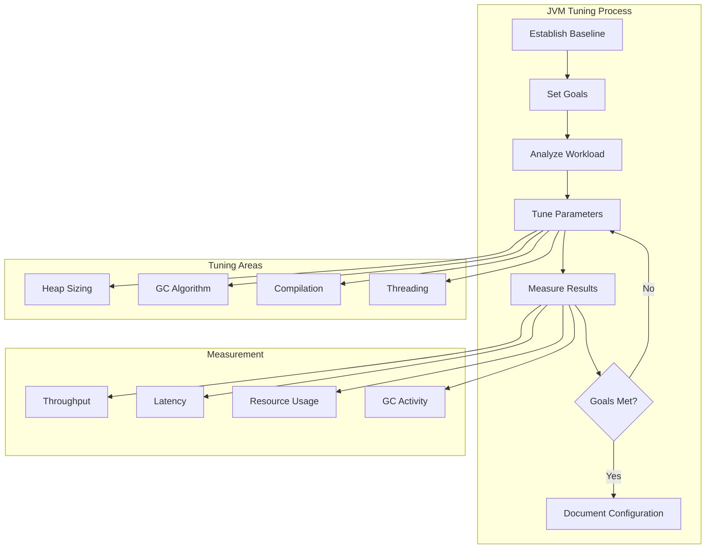

# 10. JVM Tuning

## Introduction

JVM tuning is the process of optimizing Java application performance by configuring JVM parameters, garbage collection, memory settings, and runtime options. Proper tuning can dramatically improve application throughput, latency, and resource utilization. However, tuning must be done carefully based on actual workload characteristics and measured results.

This topic covers the essential JVM tuning techniques including GC tuning, heap sizing, JVM flags, and performance optimization strategies. We'll explore how to measure the impact of tuning changes and establish a systematic approach to performance optimization.

## Learning Objectives

By the end of this topic, you will be able to:

- [ ] Identify JVM tuning goals and constraints
- [ ] Configure heap sizing appropriately
- [ ] Tune garbage collection for specific workloads
- [ ] Use JVM flags effectively for performance optimization
- [ ] Measure and validate tuning changes
- [ ] Establish baselines and track improvements
- [ ] Apply tuning best practices for different application types

## Prerequisites

- Completion of Topic 09: JVM Diagnostics
- Understanding of JVM memory model
- Familiarity with garbage collection algorithms
- Basic knowledge of performance metrics

## Why This Concept Exists

### The Default Configuration Problem

JVM default settings are designed for general use cases:
- **Heap Size**: 256MB - 1GB (too small for many applications)
- **GC Algorithm**: G1 GC (may not be optimal for all workloads)
- **Compilation**: Tiered compilation (may not be optimal for all cases)
- **Threading**: Default thread pool sizes (may not match workload)

### The Tuning Solution

JVM tuning provides:
- **Optimized Performance**: Settings tailored to specific workloads
- **Resource Efficiency**: Better use of available hardware
- **Predictable Behavior**: Consistent performance under load
- **Cost Optimization**: Reduced infrastructure requirements

### Real-World Impact

Proper tuning affects:
- **Throughput**: More work done per unit time
- **Latency**: Faster response times
- **Resource Usage**: Lower CPU and memory consumption
- **Scalability**: Better handling of increased load

## Problem Statement

### The Tuning Challenge

Without proper tuning, applications face:
- **Poor Performance**: Applications not meeting performance requirements
- **Resource Waste**: Inefficient use of hardware resources
- **Unpredictable Behavior**: Inconsistent performance under load
- **High Costs**: Over-provisioned infrastructure

### Real-World Example

A web application experienced:
- 500ms average response time (target: 100ms)
- 80% CPU utilization at low traffic
- Frequent GC pauses causing timeouts

The solution? Systematic JVM tuning based on workload analysis.

## Theory

### JVM Tuning Goals

```
┌─────────────────────────────────────────────────────────────┐
│                    Tuning Goals                              │
│                                                             │
│  ┌─────────────────────────────────────────────────────┐   │
│  │  Throughput                                          │   │
│  │  - Maximize work done per unit time                 │   │
│  │  - Minimize GC overhead                             │   │
│  │  - Optimize batch processing                        │   │
│  └─────────────────────────────────────────────────────┘   │
│                                                             │
│  ┌─────────────────────────────────────────────────────┐   │
│  │  Latency                                             │   │
│  │  - Minimize response times                          │   │
│  │  - Reduce GC pause times                            │   │
│  │  - Optimize interactive applications                │   │
│  └─────────────────────────────────────────────────────┘   │
│                                                             │
│  ┌─────────────────────────────────────────────────────┐   │
│  │  Memory                                              │   │
│  │  - Minimize memory footprint                        │   │
│  │  - Reduce GC overhead                               │   │
│  │  - Optimize for container environments              │   │
│  └─────────────────────────────────────────────────────┘   │
│                                                             │
│  ┌─────────────────────────────────────────────────────┐   │
│  │  Cost                                                │   │
│  │  - Reduce infrastructure costs                      │   │
│  │  - Optimize resource utilization                    │   │
│  │  - Balance performance and cost                     │   │
│  └─────────────────────────────────────────────────────┘   │
└─────────────────────────────────────────────────────────────┘
```

### Heap Sizing Strategy

```
┌─────────────────────────────────────────────────────────────┐
│                    Heap Sizing                               │
│                                                             │
│  ┌─────────────────────────────────────────────────────┐   │
│  │  Initial Heap Size (-Xms)                           │   │
│  │  - Starting heap size                               │   │
│  │  - Avoids resize overhead                           │   │
│  │  - Set to expected steady-state size                │   │
│  └─────────────────────────────────────────────────────┘   │
│                                                             │
│  ┌─────────────────────────────────────────────────────┐   │
│  │  Maximum Heap Size (-Xmx)                           │   │
│  │  - Maximum heap size                                │   │
│  │  - Prevents OutOfMemoryError                        │   │
│  │  - Set based on available memory                    │   │
│  └─────────────────────────────────────────────────────┘   │
│                                                             │
│  ┌─────────────────────────────────────────────────────┐   │
│  │  Young Generation Size                              │   │
│  │  - Controls allocation rate                         │   │
│  │  - Affects GC frequency                             │   │
│  │  - Tune based on object lifetime                    │   │
│  └─────────────────────────────────────────────────────┘   │
└─────────────────────────────────────────────────────────────┘
```

### GC Tuning Parameters

```
┌─────────────────────────────────────────────────────────────┐
│                    GC Tuning Parameters                      │
│                                                             │
│  ┌─────────────────────────────────────────────────────┐   │
│  │  G1 GC Parameters                                    │   │
│  │  -XX:MaxGCPauseMillis=200                           │   │
│  │  -XX:GCTimeRatio=12                                 │   │
│  │  -XX:InitiatingHeapOccupancyPercent=45              │   │
│  └─────────────────────────────────────────────────────┘   │
│                                                             │
│  ┌─────────────────────────────────────────────────────┐   │
│  │  ZGC Parameters                                      │   │
│  │  -XX:SoftMaxHeapSize=4g                             │   │
│  │  -XX:ConcGCThreads=4                                │   │
│  │  -XX:ZCollectionInterval=5                          │   │
│  └─────────────────────────────────────────────────────┘   │
│                                                             │
│  ┌─────────────────────────────────────────────────────┐   │
│  │  General GC Parameters                              │   │
│  │  -XX:NewRatio=2                                     │   │
│  │  -XX:SurvivorRatio=8                                │   │
│  │  -XX:MaxTenuringThreshold=15                        │   │
│  └─────────────────────────────────────────────────────┘   │
└─────────────────────────────────────────────────────────────┘
```

## Internal Working

### Tuning Process

```
1. Establish Baseline
   ├── Measure current performance
   ├── Document resource usage
   └── Identify bottlenecks

2. Set Goals
   ├── Define performance targets
   ├── Set resource constraints
   └── Establish success criteria

3. Analyze Workload
   ├── Profile application behavior
   ├── Identify hot paths
   └── Measure object lifecycle

4. Tune Parameters
   ├── Adjust heap sizing
   ├── Configure GC algorithm
   └── Optimize compilation

5. Measure Results
   ├── Compare with baseline
   ├── Validate goals met
   └── Document improvements

6. Iterate
   ├── Fine-tune based on results
   ├── Test under different loads
   └── Document final configuration
```

### Measurement Strategy

```
┌─────────────────────────────────────────────────────────────┐
│                    Measurement Strategy                      │
│                                                             │
│  ┌─────────────────────────────────────────────────────┐   │
│  │  Key Metrics                                         │   │
│  │  - Throughput (requests/second)                     │   │
│  │  - Latency (response time)                          │   │
│  │  - GC pause time                                    │   │
│  │  - CPU utilization                                  │   │
│  │  - Memory usage                                     │   │
│  └─────────────────────────────────────────────────────┘   │
│                                                             │
│  ┌─────────────────────────────────────────────────────┐   │
│  │  Measurement Tools                                   │   │
│  │  - JMH (micro-benchmarks)                           │   │
│  │  - JFR (continuous profiling)                       │   │
│  │  - GC logging                                       │   │
│  │  - Application monitoring                           │   │
│  └─────────────────────────────────────────────────────┘   │
│                                                             │
│  ┌─────────────────────────────────────────────────────┐   │
│  │  Test Scenarios                                      │   │
│  │  - Steady-state load                                │   │
│  │  - Peak load                                        │   │
│  │  - Ramp-up                                          │   │
│  │  - Soak testing                                     │   │
│  └─────────────────────────────────────────────────────┘   │
└─────────────────────────────────────────────────────────────┘
```

## JVM Perspective

### What the JVM Sees

The JVM sees:
- **Heap Regions**: Different memory areas for different purposes
- **GC Threads**: Threads performing garbage collection
- **Compilation Threads**: Threads performing JIT compilation
- **Application Threads**: Threads running application code

### JVM Parameter Categories

```
┌─────────────────────────────────────────────────────────────┐
│                    JVM Parameter Categories                  │
│                                                             │
│  ┌─────────────────────────────────────────────────────┐   │
│  │  Standard Options                                    │   │
│  │  - -Xms, -Xmx                                       │   │
│  │  - -server, -client                                  │   │
│  │  - -classpath                                        │   │
│  └─────────────────────────────────────────────────────┘   │
│                                                             │
│  ┌─────────────────────────────────────────────────────┐   │
│  │  Non-Standard Options                                │   │
│  │  - -XX:+UseG1GC                                      │   │
│  │  - -XX:MaxGCPauseMillis                              │   │
│  │  - -XX:+PrintGCDetails                               │   │
│  └─────────────────────────────────────────────────────┘   │
│                                                             │
│  ┌─────────────────────────────────────────────────────┐   │
│  │  Diagnostic Options                                  │   │
│  │  - -XX:+UnlockDiagnosticVMOptions                    │   │
│  │  - -XX:+PrintCompilation                             │   │
│  │  - -XX:+PrintInlining                                │   │
│  └─────────────────────────────────────────────────────┘   │
└─────────────────────────────────────────────────────────────┘
```

## Memory Representation

### Heap Memory Layout

```
┌─────────────────────────────────────────────────────────────┐
│                    Heap Memory Layout                        │
│                                                             │
│  ┌─────────────────────────────────────────────────────┐   │
│  │  Young Generation (1/3 of heap)                     │   │
│  │  ┌─────────────────────────────────────────────┐   │   │
│  │  │  Eden (8/10 of Young Gen)                    │   │   │
│  │  │  ┌─────────────────────────────────────┐   │   │   │
│  │  │  │  New Objects                        │   │   │   │
│  │  │  └─────────────────────────────────────┘   │   │   │
│  │  └─────────────────────────────────────────────┘   │   │
│  │  ┌─────────────────────────────────────────────┐   │   │
│  │  │  Survivor 0 (1/10 of Young Gen)             │   │   │
│  │  └─────────────────────────────────────────────┘   │   │
│  │  ┌─────────────────────────────────────────────┐   │   │
│  │  │  Survivor 1 (1/10 of Young Gen)             │   │   │
│  │  └─────────────────────────────────────────────┘   │   │
│  └─────────────────────────────────────────────────────┘   │
│                                                             │
│  ┌─────────────────────────────────────────────────────┐   │
│  │  Old Generation (2/3 of heap)                       │   │
│  │  ┌─────────────────────────────────────────────┐   │   │
│  │  │  Long-lived Objects                          │   │   │
│  │  └─────────────────────────────────────────────┘   │   │
│  └─────────────────────────────────────────────────────┘   │
│                                                             │
│  ┌─────────────────────────────────────────────────────┐   │
│  │  Metaspace (Off-heap)                               │   │
│  │  ┌─────────────────────────────────────────────┐   │   │
│  │  │  Class Metadata                               │   │   │
│  │  └─────────────────────────────────────────────┘   │   │
│  └─────────────────────────────────────────────────────┘   │
└─────────────────────────────────────────────────────────────┘
```

## Architecture Diagram (Mermaid)



## Flow Diagram (Mermaid)

```mermaid
flowchart TD
    Start([Tuning Need]) --> Analyze[Analyze Current Performance]
    Analyze --> Identify{Identify Bottleneck?}
    Identify -->|CPU| TuneCPU[Tune CPU Settings]
    Identify -->|Memory| TuneMemory[Tune Memory Settings]
    Identify -->|GC| TuneGC[Tune GC Settings]
    Identify -->|I/O| TuneIO[Tune I/O Settings]
    
    TuneCPU --> Measure[Measure Impact]
    TuneMemory --> Measure
    TuneGC --> Measure
    TuneIO --> Measure
    
    Measure --> Goals{Goals Met?}
    Goals -->|No| Identify
    Goals -->|Yes] Document[Document Configuration]
    
    Document --> Done([Tuning Complete])
```

## Syntax (with examples)

### Heap Sizing Flags

```bash
# Set initial and maximum heap size
java -Xms2g -Xmx4g MyApp

# Set young generation size
java -Xmn512m MyApp

# Set survivor ratio
java -XX:SurvivorRatio=8 MyApp

# Set new ratio
java -XX:NewRatio=2 MyApp
```

### GC Tuning Flags

```bash
# G1 GC tuning


---

**Continue to Part 2**: [README-part2.md](README-part2.md) | [Part 3](README-part3.md) | [Part 4](README-part4.md)