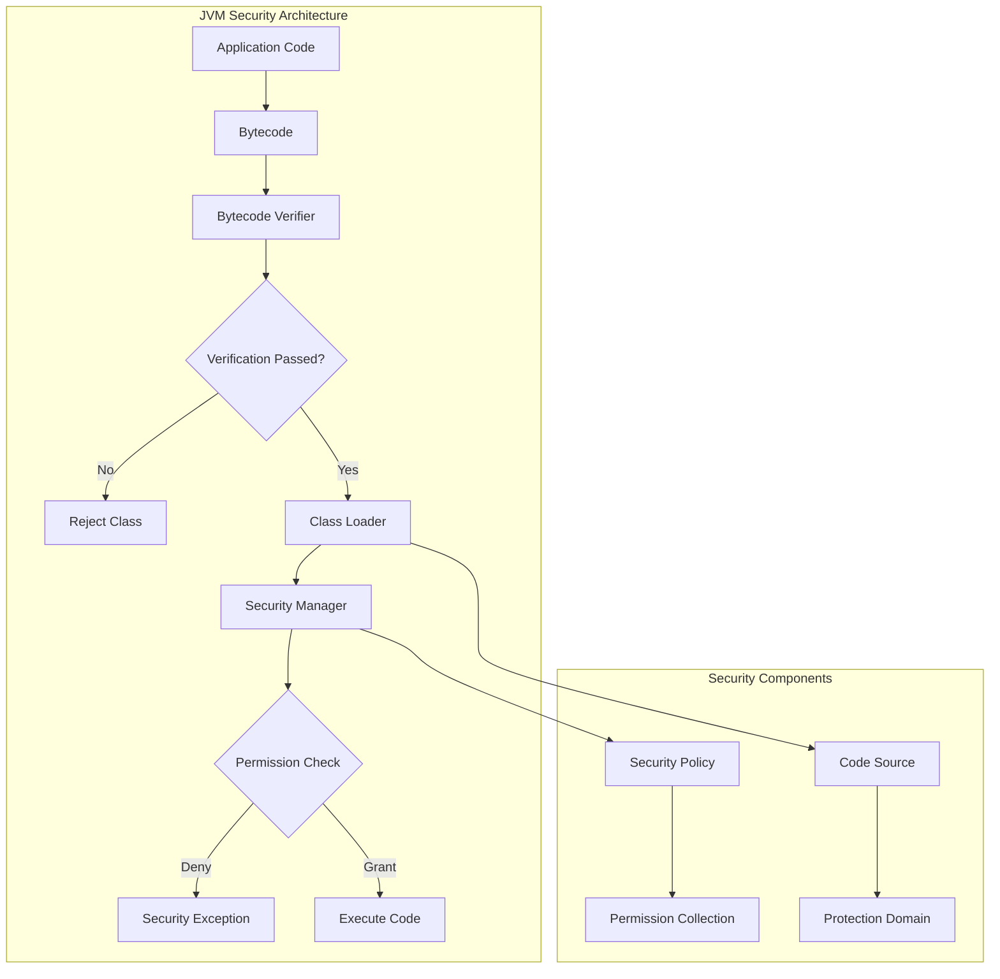

# 11. JVM Security

## Introduction

JVM security encompasses the mechanisms and features that protect Java applications from malicious code, unauthorized access, and security vulnerabilities. From bytecode verification to security managers, the JVM provides multiple layers of security to ensure safe execution of Java code. Understanding JVM security is crucial for developing secure applications, especially in environments where untrusted code may be executed.

This topic covers the essential JVM security mechanisms including bytecode verification, security managers, class loading security, and modern security features. We'll explore how these mechanisms work and how to configure them for different security requirements.

## Learning Objectives

By the end of this topic, you will be able to:

- [ ] Explain JVM security architecture and layers
- [ ] Understand bytecode verification process
- [ ] Configure security managers and policies
- [ ] Implement secure class loading
- [ ] Apply security best practices
- [ ] Identify and mitigate security vulnerabilities
- [ ] Use modern JVM security features

## Prerequisites

- Completion of Topic 10: JVM Tuning
- Understanding of JVM internals
- Familiarity with Java class loading
- Basic knowledge of security concepts

## Why This Concept Exists

### The Security Challenge

Java applications face various security threats:
- **Malicious Code**: Untrusted code that may harm the system
- **Unauthorized Access**: Code accessing resources it shouldn't
- **Code Injection**: Injecting malicious bytecode
- **Privilege Escalation**: Gaining unauthorized permissions

### The JVM Security Solution

JVM security provides:
- **Bytecode Verification**: Ensures code is safe to execute
- **Access Control**: Restricts what code can do
- **Sandboxing**: Isolates untrusted code
- **Cryptographic Support**: Enables secure communications

### Real-World Impact

JVM security affects:
- **Application Safety**: Protecting against malicious code
- **Data Protection**: Securing sensitive information
- **System Integrity**: Preventing unauthorized changes
- **Compliance**: Meeting security regulations

## Problem Statement

### The Security Challenge

Without proper security, applications face:
- **Code Injection Attacks**: Malicious code execution
- **Data Breaches**: Unauthorized data access
- **Privilege Escalation**: Gaining elevated permissions
- **System Compromise**: Complete system takeover

### Real-World Example

A financial application experienced:
- Unauthorized code execution through class loading vulnerabilities
- Data exposure through insecure deserialization
- System compromise through privilege escalation

The solution? Implementing comprehensive JVM security measures.

## Theory

### JVM Security Layers

```
┌─────────────────────────────────────────────────────────────┐
│                    JVM Security Layers                       │
│                                                             │
│  ┌─────────────────────────────────────────────────────┐   │
│  │  Layer 1: Bytecode Verification                     │   │
│  │  - Verifies bytecode integrity                      │   │
│  │  - Checks type safety                               │   │
│  │  - Validates stack integrity                        │   │
│  └─────────────────────────────────────────────────────┘   │
│                                                             │
│  ┌─────────────────────────────────────────────────────┐   │
│  │  Layer 2: Class Loading Security                    │   │
│  │  - Delegation model                                 │   │
│  │  - Namespace isolation                              │   │
│  │  - Code source protection                           │   │
│  └─────────────────────────────────────────────────────┘   │
│                                                             │
│  ┌─────────────────────────────────────────────────────┐   │
│  │  Layer 3: Security Manager                          │   │
│  │  - Access control                                   │   │
│  │  - Permission checking                              │   │
│  │  - Policy enforcement                               │   │
│  └─────────────────────────────────────────────────────┘   │
│                                                             │
│  ┌─────────────────────────────────────────────────────┐   │
│  │  Layer 4: Runtime Security                          │   │
│  │  - Memory protection                                │   │
│  │  - Thread safety                                    │   │
│  │  - Exception handling                               │   │
│  └─────────────────────────────────────────────────────┘   │
└─────────────────────────────────────────────────────────────┘
```

### Bytecode Verification

```
┌─────────────────────────────────────────────────────────────┐
│                    Bytecode Verification                     │
│                                                             │
│  ┌─────────────────────────────────────────────────────┐   │
│  │  Format Verification                                 │   │
│  │  - Check magic number                                │   │
│  │  - Verify version numbers                           │   │
│  │  - Validate constant pool                           │   │
│  └─────────────────────────────────────────────────────┘   │
│                                                             │
│  ┌─────────────────────────────────────────────────────┐   │
│  │  Structural Verification                             │   │
│  │  - Check method signatures                          │   │
│  │  - Verify field types                               │   │
│  │  - Validate instruction sequences                   │   │
│  └─────────────────────────────────────────────────────┘   │
│                                                             │
│  ┌─────────────────────────────────────────────────────┐   │
│  │  Type Safety Verification                            │   │
│  │  - Check type compatibility                         │   │
│  │  - Verify method invocations                        │   │
│  │  - Validate field accesses                          │   │
│  └─────────────────────────────────────────────────────┘   │
│                                                             │
│  ┌─────────────────────────────────────────────────────┐   │
│  │  Stack Integrity Verification                        │   │
│  │  - Check stack depth                                │   │
│  │  - Verify operand types                             │   │
│  │  - Validate local variable usage                    │   │
│  └─────────────────────────────────────────────────────┘   │
└─────────────────────────────────────────────────────────────┘
```

### Security Manager

```
┌─────────────────────────────────────────────────────────────┐
│                    Security Manager                          │
│                                                             │
│  ┌─────────────────────────────────────────────────────┐   │
│  │  Permissions                                         │   │
│  │  - File access                                      │   │
│  │  - Network access                                   │   │
│  │  - Runtime operations                               │   │
│  │  - Reflection access                                │   │
│  └─────────────────────────────────────────────────────┘   │
│                                                             │
│  ┌─────────────────────────────────────────────────────┐   │
│  │  Policy Files                                        │   │
│  │  - Grant permissions to code sources                │   │
│  │  - Define security policies                         │   │
│  │  - Configure access rules                           │   │
│  └─────────────────────────────────────────────────────┘   │
│                                                             │
│  ┌─────────────────────────────────────────────────────┐   │
│  │  Access Control                                      │   │
│  │  - Check permissions before operations              │   │
│  │  - Deny unauthorized access                         │   │
│  │  - Log security events                              │   │
│  └─────────────────────────────────────────────────────┘   │
└─────────────────────────────────────────────────────────────┘
```

## Internal Working

### Bytecode Verification Process

```
1. Class Loading
   ├── Load class bytes from source
   ├── Parse class file structure
   └── Create Class object

2. Format Verification
   ├── Check magic number (0xCAFEBABE)
   ├── Verify version compatibility
   └── Validate constant pool entries

3. Structural Verification
   ├── Check method descriptors
   ├── Verify field descriptors
   └── Validate instruction sequences

4. Type Safety Verification
   ├── Check type compatibility
   ├── Verify method signatures
   └── Validate field accesses

5. Stack Verification
   ├── Check stack depth limits
   ├── Verify operand types
   └── Validate local variable usage

6. Verification Complete
   ├── Class marked as verified
   └── Ready for execution
```

### Security Manager Process

```
1. Security Manager Installation
   ├── Set system security manager
   ├── Load security policy
   └── Initialize permission collection

2. Permission Check
   ├── Code requests operation
   ├── Security manager checks permission
   ├── Policy grants or denies
   └── Operation proceeds or throws exception

3. Access Control
   ├── Check caller's code source
   ├── Verify permissions
   ├── Check stack permissions
   └── Grant or deny access

4. Security Event Logging
   ├── Log security violations
   ├── Record access attempts
   └── Monitor suspicious activity
```

## JVM Perspective

### What the JVM Sees

The JVM sees:
- **Class Files**: Bytecode to verify and execute
- **Code Sources**: Origins of loaded code
- **Permissions**: Allowed operations
- **Security Policies**: Rules for access control

### Security Architecture

```
┌─────────────────────────────────────────────────────────────┐
│                    Security Architecture                     │
│                                                             │
│  ┌─────────────────────────────────────────────────────┐   │
│  │  Application Layer                                   │   │
│  │  - Business logic                                    │   │
│  │  - Security policies                                │   │
│  └─────────────────────────────────────────────────────┘   │
│                                                             │
│  ┌─────────────────────────────────────────────────────┐   │
│  │  JVM Security Layer                                  │   │
│  │  - Security Manager                                 │   │
│  │  - Access Controller                                 │   │
│  │  - Permission Collection                            │   │
│  └─────────────────────────────────────────────────────┘   │
│                                                             │
│  ┌─────────────────────────────────────────────────────┐   │
│  │  Class Loading Layer                                 │   │
│  │  - Bytecode Verification                            │   │
│  │  - Class Loader Delegation                          │   │
│  │  - Namespace Isolation                              │   │
│  └─────────────────────────────────────────────────────┘   │
│                                                             │
│  ┌─────────────────────────────────────────────────────┐   │
│  │  Runtime Layer                                       │   │
│  │  - Memory Protection                                │   │
│  │  - Thread Safety                                    │   │
│  │  - Exception Handling                               │   │
│  └─────────────────────────────────────────────────────┘   │
└─────────────────────────────────────────────────────────────┘
```

## Memory Representation

### Security Data Structures

```
┌─────────────────────────────────────────────────────────────┐
│                    Security Data Structures                  │
│                                                             │
│  ┌─────────────────────────────────────────────────────┐   │
│  │  Permission Collection                               │   │
│  │  ┌─────────────────────────────────────────────┐   │   │
│  │  │  FilePermission                               │   │   │
│  │  │  SocketPermission                             │   │   │
│  │  │  RuntimePermission                            │   │   │
│  │  │  ReflectPermission                            │   │   │
│  │  └─────────────────────────────────────────────┘   │   │
│  └─────────────────────────────────────────────────────┘   │
│                                                             │
│  ┌─────────────────────────────────────────────────────┐   │
│  │  Code Source                                         │   │
│  │  ┌─────────────────────────────────────────────┐   │   │
│  │  │  Location (URL)                              │   │   │
│  │  │  Certificates                                │   │   │
│  │  │  Permissions                                 │   │   │
│  │  └─────────────────────────────────────────────┘   │   │
│  └─────────────────────────────────────────────────────┘   │
│                                                             │
│  ┌─────────────────────────────────────────────────────┐   │
│  │  Protection Domain                                    │   │
│  │  ┌─────────────────────────────────────────────┐   │   │
│  │  │  Code Source                                  │   │   │
│  │  │  Permission Collection                       │   │   │
│  │  │  Signers                                     │   │   │
│  │  └─────────────────────────────────────────────┘   │   │
│  └─────────────────────────────────────────────────────┘   │
└─────────────────────────────────────────────────────────────┘
```

## Architecture Diagram (Mermaid)



## Flow Diagram (Mermaid)


## Syntax (with examples)

### Security Manager Configuration

```bash
# Enable security manager
java -Djava.security.manager MyApp

# Set security policy
java -Djava.security.policy=policy.txt MyApp

# Disable security manager (not recommended)
java -Djava.security.manager=allow MyApp
```

### Security Policy File

```
// policy.txt
grant codeBase "file:/path/to/app/" {
    permission java.security.AllPermission;
};

grant codeBase "file:/path/to/plugin/" {
    permission java.io.FilePermission "/tmp/*", "read,write";
    permission java.net.SocketPermission "example.com:80", "connect";
};
```

### Security Properties

```bash
# Set security properties
java -Djava.security.properties=file:security.properties MyApp

# Example security.properties
# package.access=sun.,com.sun.
# package.definition=
# security.provider.1=sun.security.provider.Sun
```

## Easy Example

### Basic Security Manager Demo

```java
package academy.javaengineering.jvm.security;

/**
 * Simple security manager demonstration.
 */
public class BasicSecurityDemo {
    
    public static void main(String[] args) {
        System.out.println("=== Basic Security Demo ===\n");
        
        // Print current security configuration
        printSecurityConfiguration();
        
        // Test file access
        testFileAccess();
        
        // Test system properties
        testSystemProperties();
        
        // Test runtime operations
        testRuntimeOperations();
    }
    
    private static void printSecurityConfiguration() {
        System.out.println("--- Security Configuration ---");
        
        SecurityManager sm = System.getSecurityManager();
        if (sm != null) {
            System.out.println("Security Manager: " + sm.getClass().getName());
        } else {
            System.out.println("Security Manager: Not installed");
        }
        
        System.out.println("Java Version: " + System.getProperty("java.version"));
        System.out.println();
    }
    
    private static void testFileAccess() {
        System.out.println("--- File Access Test ---");
        
        try {
            // This would require file permission
            java.io.File file = new java.io.File("/tmp/test.txt");
            System.out.println("File exists: " + file.exists());
        } catch (SecurityException e) {
            System.out.println("SecurityException: " + e.getMessage());
        }
        
        System.out.println();
    }
    
    private static void testSystemProperties() {
        System.out.println("--- System Properties Test ---");
        
        try {
            // This would require runtime permission
            String javaVersion = System.getProperty("java.version");
            System.out.println("Java Version: " + javaVersion);
        } catch (SecurityException e) {
            System.out.println("SecurityException: " + e.getMessage());
        }
        
        System.out.println();
    }
    
    private static void testRuntimeOperations() {
        System.out.println("--- Runtime Operations Test ---");
        
        try {
            // This would require runtime permission
            Runtime runtime = Runtime.getRuntime();
            System.out.println("Available Processors: " + runtime.availableProcessors());
        } catch (SecurityException e) {
            System.out.println("SecurityException: " + e.getMessage());
        }
        
        System.out.println();
    }
}
```

## Medium Example

### Custom Security Manager

```java
package academy.javaengineering.jvm.security;

import java.security.*;

/**
 * Custom security manager demonstration.
 */
public class CustomSecurityManagerDemo {
    
    public static void main(String[] args) {
        System.out.println("=== Custom Security Manager Demo ===\n");
        
        // Install custom security manager
        System.setSecurityManager(new CustomSecurityManager());
        
        // Test operations
        testOperations();
    }
    
    private static void testOperations() {
        System.out.println("--- Testing Operations ---");
        
        // Test file access
        try {
            java.io.File file = new java.io.File("/tmp/test.txt");
            System.out.println("File access: " + file.exists());
        } catch (SecurityException e) {
            System.out.println("File access denied: " + e.getMessage());
        }
        
        // Test network access
        try {
            java.net.URL url = new java.net.URL("http://example.com");
            System.out.println("Network access: " + url.getHost());
        } catch (Exception e) {
            System.out.println("Network access: " + e.getClass().getSimpleName());
        }
        
        // Test runtime operations
        try {
            Runtime runtime = Runtime.getRuntime();
            System.out.println("Runtime access: " + runtime.availableProcessors());
        } catch (SecurityException e) {
            System.out.println("Runtime access denied: " + e.getMessage());
        }
    }
    
    static class CustomSecurityManager extends SecurityManager {
        @Override
        public void checkPermission(Permission perm) {
            // Log all permission checks
            System.out.println("Permission check: " + perm.getName());
            
            // Default behavior
            super.checkPermission(perm);
        }
        
        @Override
        public void checkRead(String file) {
            System.out.println("File read check: " + file);
            super.checkRead(file);
        }
        
        @Override
        public void checkWrite(String file) {
            System.out.println("File write check: " + file);
            super.checkWrite(file);
        }
        
        @Override
        public void checkConnect(String host, int port) {
            System.out.println("Network connect check: " + host + ":" + port);
            super.checkConnect(host, port);
        }
    }
}
```

## Hard Example

### Security Policy Management

```java
package academy.javaengineering.jvm.security;

import java.security.*;
import java.util.*;

/**
 * Security policy management demonstration.
 */
public class SecurityPolicyDemo {
    
    public static void main(String[] args) {
        System.out.println("=== Security Policy Demo ===\n");
        
        // Print current policy
        printCurrentPolicy();
        
        // Create custom policy
        createCustomPolicy();
        
        // Test permissions
        testPermissions();
    }
    
    private static void printCurrentPolicy() {
        System.out.println("--- Current Policy ---");
        
        Policy policy = Policy.getPolicy();
        if (policy != null) {
            System.out.println("Policy class: " + policy.getClass().getName());
        } else {
            System.out.println("No policy installed");
        }
        
        System.out.println();
    }
    
    private static void createCustomPolicy() {
        System.out.println("--- Creating Custom Policy ---");
        
        // Create custom policy
        Policy customPolicy = new CustomPolicy();
        Policy.setPolicy(customPolicy);
        
        System.out.println("Custom policy installed");
        System.out.println();
    }
    
    private static void testPermissions() {
        System.out.println("--- Testing Permissions ---");
        
        // Test file permission
        Permission filePermission = new java.io.FilePermission("/tmp/*", "read,write");
        System.out.println("File permission: " + filePermission.getName());
        
        // Test socket permission
        Permission socketPermission = new java.net.SocketPermission("example.com:80", "connect");
        System.out.println("Socket permission: " + socketPermission.getName());
        
        // Test runtime permission
        Permission runtimePermission = new java.lang.RuntimePermission("exitVM");
        System.out.println("Runtime permission: " + runtimePermission.getName());
        
        System.out.println();
    }
    
    static class CustomPolicy extends Policy {
        private final PermissionCollection permissions;
        
        public CustomPolicy() {
            permissions = new Permissions();
            
            // Grant some permissions
            permissions.add(new java.io.FilePermission("/tmp/*", "read,write"));
            permissions.add(new java.net.SocketPermission("example.com:80", "connect"));
            permissions.add(new java.lang.RuntimePermission("exitVM"));
        }
        
        @Override
        public PermissionCollection getPermissions(CodeSource codesource) {
            return permissions;
        }
        
        @Override
        public void refresh() {
            // Refresh policy
        }
    }
}
```

## Enterprise Example

### Enterprise Security System

```java
package academy.javaengineering.jvm.security;

import java.security.*;
import java.util.*;
import java.util.concurrent.*;

/**
 * Enterprise-grade security management system.
 */
public class EnterpriseSecuritySystem {
    
    private final ScheduledExecutorService scheduler = Executors.newScheduledThreadPool(2);
    private final List<SecurityEvent> securityEvents = new CopyOnWriteArrayList<>();
    private volatile boolean running = true;
    
    public void startSecuritySystem() {
        System.out.println("=== Enterprise Security System ===\n");
        
        // Install security manager
        installSecurityManager();
        
        // Schedule security monitoring
        scheduler.scheduleAtFixedRate(this::monitorSecurity, 0, 5, TimeUnit.SECONDS);
        
        // Schedule security reporting
        scheduler.scheduleAtFixedRate(this::generateSecurityReport, 0, 1, TimeUnit.MINUTES);
        
        System.out.println("Security system started. Press Ctrl+C to stop.\n");
    }
    
    private void installSecurityManager() {
        System.out.println("--- Installing Security Manager ---");
        
        SecurityManager sm = System.getSecurityManager();
        if (sm == null) {
            System.setSecurityManager(new EnterpriseSecurityManager());
            System.out.println("Security manager installed");
        } else {
            System.out.println("Security manager already installed: " + sm.getClass().getName());
        }
        
        System.out.println();
    }
    
    private void monitorSecurity() {
        try {
            // Monitor security events
            SecurityManager sm = System.getSecurityManager();
            if (sm != null) {
                // Check various security aspects
                checkFilePermissions();
                checkNetworkPermissions();
                checkRuntimePermissions();
            }
        } catch (Exception e) {
            System.err.println("Error monitoring security: " + e.getMessage());
        }
    }
    
    private void checkFilePermissions() {
        try {
            java.io.File file = new java.io.File("/tmp/security-test.txt");
            boolean canRead = file.canRead();
            boolean canWrite = file.canWrite();
            
            SecurityEvent event = new SecurityEvent(
                "FILE_PERMISSION_CHECK",
                "File: " + file.getPath() + ", Read: " + canRead + ", Write: " + canWrite,
                System.currentTimeMillis()
            );
            
            securityEvents.add(event);
        } catch (SecurityException e) {
            SecurityEvent event = new SecurityEvent(
                "SECURITY_VIOLATION",
                "File permission denied: " + e.getMessage(),
                System.currentTimeMillis()
            );
            
            securityEvents.add(event);
        }
    }
    
    private void checkNetworkPermissions() {
        try {
            java.net.InetAddress localhost = java.net.InetAddress.getLocalHost();
            SecurityEvent event = new SecurityEvent(
                "NETWORK_CHECK",
                "Network access: " + localhost.getHostAddress(),
                System.currentTimeMillis()
            );
            
            securityEvents.add(event);
        } catch (Exception e) {
            SecurityEvent event = new SecurityEvent(
                "NETWORK_ERROR",
                "Network check failed: " + e.getMessage(),
                System.currentTimeMillis()
            );
            
            securityEvents.add(event);
        }
    }
    
    private void checkRuntimePermissions() {
        try {
            Runtime runtime = Runtime.getRuntime();
            int processors = runtime.availableProcessors();
            
            SecurityEvent event = new SecurityEvent(
                "RUNTIME_CHECK",
                "Runtime access: " + processors + " processors",
                System.currentTimeMillis()
            );
            
            securityEvents.add(event);
        } catch (SecurityException e) {
            SecurityEvent event = new SecurityEvent(
                "SECURITY_VIOLATION",
                "Runtime permission denied: " + e.getMessage(),
                System.currentTimeMillis()
            );
            
            securityEvents.add(event);
        }
    }
    
    private void generateSecurityReport() {
        System.out.println("\n" + "=".repeat(70));
        System.out.println("SECURITY REPORT");
        System.out.println("=".repeat(70));
        
        // Security events summary
        System.out.println("\n--- Security Events ---");
        System.out.printf("Total Events: %d%n", securityEvents.size());
        
        // Count events by type
        Map<String, Long> eventCounts = new HashMap<>();
        for (SecurityEvent event : securityEvents) {
            eventCounts.merge(event.type, 1L, Long::sum);
        }
        
        for (Map.Entry<String, Long> entry : eventCounts.entrySet()) {
            System.out.printf("  %s: %d%n", entry.getKey(), entry.getValue());
        }
        
        // Check for security violations
        long violations = securityEvents.stream()
            .filter(e -> e.type.equals("SECURITY_VIOLATION"))
            .count();
        
        if (violations > 0) {
            System.out.printf("%nWARNING: %d security violations detected!%n", violations);
        } else {
            System.out.println("\nNo security violations detected.");
        }
        
        System.out.println("=".repeat(70));
    }
    
    public void stop() {
        running = false;
        scheduler.shutdown();
        try {
            if (!scheduler.awaitTermination(10, TimeUnit.SECONDS)) {
                scheduler.shutdownNow();
            }
        } catch (InterruptedException e) {
            scheduler.shutdownNow();
            Thread.currentThread().interrupt();
        }
    }
    
    public static void main(String[] args) {
        EnterpriseSecuritySystem securitySystem = new EnterpriseSecuritySystem();
        securitySystem.startSecuritySystem();
        
        // Simulate application workload
        simulateWorkload();
        
        // Run for 5 minutes
        try {
            Thread.sleep(300_000);
        } catch (InterruptedException e) {
            Thread.currentThread().interrupt();
        }
        
        securitySystem.stop();
    }
    
    private static void simulateWorkload() {
        new Thread(() -> {
            while (true) {
                // Simulate various operations
                try {
                    java.io.File file = new java.io.File("/tmp/test.txt");
                    file.exists();
                    
                    java.net.InetAddress.getLocalHost();
                    
                    Runtime.getRuntime().availableProcessors();
                    
                    Thread.sleep(1000);
                } catch (Exception e) {
                    // Ignore exceptions
                }
            }
        }).start();
    }
    
    static class EnterpriseSecurityManager extends SecurityManager {
        @Override
        public void checkPermission(Permission perm) {
            // Log permission checks
            System.out.println("Permission check: " + perm.getName());
            
            // Default behavior
            super.checkPermission(perm);
        }
    }
    
    private static class SecurityEvent {
        final String type;
        final String message;
        final long timestamp;
        
        SecurityEvent(String type, String message, long timestamp) {
            this.type = type;
            this.message = message;
            this.timestamp = timestamp;
        }
    }
}
```

## Performance Considerations

### Security Overhead

| Security Feature | Performance Impact | Risk Level |
|------------------|-------------------|------------|
| Bytecode Verification | Low | Low |
| Security Manager | Medium | Medium |
| Class Loading Security | Low | Low |
| Runtime Security | Medium | Medium |

### Security Configuration

| Configuration | Impact | Recommendation |
|---------------|--------|----------------|
| Security Manager Enabled | Medium overhead | Enable for untrusted code |
| Bytecode Verification | Low overhead | Always enable |
| Security Logging | Low overhead | Enable for monitoring |
| Permission Checking | Medium overhead | Configure appropriately |

## Time & Space Complexity

### Security Operation Complexity

| Operation | Time Complexity | Space Complexity |
|-----------|-----------------|------------------|
| Bytecode Verification | O(n) | O(n) |
| Permission Check | O(1) | O(1) |
| Security Logging | O(1) | O(1) |
| Policy Loading | O(m) | O(m) |

Where n is bytecode size and m is policy size.

## Thread Safety

### Thread-Safe Security

Security mechanisms must be thread-safe because:
- Multiple threads execute code
- Security checks are performed concurrently
- Security events are logged from multiple threads

### Thread-Safe Security Manager

```java
// Thread-safe security manager implementation
public class ThreadSafeSecurityManager extends SecurityManager {
    private final ConcurrentHashMap<String, AtomicLong> permissionChecks = 
        new ConcurrentHashMap<>();
    private final AtomicLong violationCount = new AtomicLong(0);
    
    @Override
    public void checkPermission(Permission perm) {
        String permissionName = perm.getName();
        permissionChecks.computeIfAbsent(permissionName, k -> new AtomicLong(0))
            .incrementAndGet();
        
        // Check for violations
        if (isViolation(perm)) {
            violationCount.incrementAndGet();
            logViolation(perm);
        }
        
        // Default behavior
        super.checkPermission(perm);
    }
    
    private boolean isViolation(Permission perm) {
        // Implement violation detection logic
        return false;
    }
    
    private void logViolation(Permission perm) {
        // Log security violation
        System.err.println("Security violation: " + perm.getName());
    }
    
    public long getViolationCount() {
        return violationCount.get();
    }
}
```

## Best Practices

### Security Best Practices

1. **Enable Security Manager**
   - Use security manager for untrusted code
   - Configure appropriate policies
   - Monitor security events

2. **Use Secure Class Loading**
   - Implement proper delegation
   - Isolate untrusted code
   - Verify bytecode integrity

3. **Apply Principle of Least Privilege**
   - Grant minimum required permissions
   - Restrict access to sensitive resources
   - Review permissions regularly

4. **Monitor Security Events**
   - Log security violations
   - Monitor suspicious activity
   - Set up alerts for violations

5. **Keep Updated**
   - Apply security patches
   - Update dependencies
   - Review security configurations

## Common Mistakes

### Mistake 1: Disabling Security

```bash
# BAD: Disabling security manager
java -Djava.security.manager=allow MyApp

# GOOD: Using security manager with appropriate policy
java -Djava.security.manager -Djava.security.policy=policy.txt MyApp
```

### Mistake 2: Overly Permissive Policies

```
// BAD: Granting all permissions
grant {
    permission java.security.AllPermission;
};

// GOOD: Granting minimal permissions
grant codeBase "file:/path/to/app/" {
    permission java.io.FilePermission "/tmp/*", "read,write";
};
```

### Mistake 3: Ignoring Security Logs

```java
// BAD: Not monitoring security events
public class BadSecurityPractice {
    // No security monitoring
}

// GOOD: Monitoring security events
public class GoodSecurityPractice {
    public void monitorSecurity() {
        // Monitor and log security events
    }
}
```

## Pitfalls & Warnings

### Pitfall 1: Performance Impact

```java
// BAD: Excessive security checks
public class ExcessiveSecurityChecks {
    public void method() {
        // Multiple unnecessary security checks
        checkPermission1();
        checkPermission2();
        checkPermission3();
    }
}

// GOOD: Appropriate security checks
public class AppropriateSecurityChecks {
    public void method() {
        // Single, comprehensive security check
        checkAllPermissions();
    }
}
```

### Pitfall 2: Security Misconfiguration

```bash
# BAD: Insecure configuration
java -Djava.security.manager=allow MyApp

# GOOD: Secure configuration
java -Djava.security.manager -Djava.security.policy=strict.policy MyApp
```

## Debugging Tips

### Security Debug Commands

```bash
# Enable security debugging
java -Djava.security.debug=all MyApp

# Debug specific areas
java -Djava.security.debug=access MyApp
java -Djava.security.debug=access,failure MyApp

# Print security properties
java -Djava.security.debug=properties MyApp
```

### Common Security Issues

| Issue | Symptom | Solution |
|-------|---------|----------|
| Permission denied | SecurityException | Check policy file |
| Verification failure | VerifyError | Check bytecode |
| Class loading error | ClassNotFoundException | Check classpath |
| Security violation | SecurityException | Review permissions |

## Comparison Table

### Security Features

| Feature | Description | Overhead | Use Case |
|---------|-------------|----------|----------|
| Bytecode Verification | Verifies bytecode safety | Low | Always |
| Security Manager | Controls permissions | Medium | Untrusted code |
| Class Loading Security | Isolates code | Low | Plugin systems |
| Runtime Security | Monitors operations | Medium | Production |

### Security Configurations

| Configuration | Security Level | Performance | Recommendation |
|---------------|----------------|-------------|----------------|
| No Security | None | Best | Never |
| Basic Security | Low | Good | Trusted code |
| Standard Security | Medium | Moderate | Most applications |
| Strict Security | High | Lower | Untrusted code |

## Decision Tree (Mermaid)

```mermaid
graph TD
    Start([Security Need]) --> Trust{Code Trust Level?}
    Trust -->|Fully Trusted| Basic[Basic Security]
    Trust -->|Partially Trusted| Standard[Standard Security]
    Trust -->|Untrusted| Strict[Strict Security]
    
    Basic --> Bytecode[Bytecode Verification]
    Standard --> SM[Security Manager]
    Strict --> FullSecurity[Full Security Stack]
    
    Bytecode --> Monitor[Monitor Events]
    SM --> Monitor
    FullSecurity --> Monitor
    
    Monitor --> Log[Log Security Events]
    Log --> Alert{Violations Detected?}
    Alert -->|Yes| Investigate[Investigate Violations]
    Alert -->|No] Continue[Continue Monitoring]
    
    Investigate --> Fix[Fix Security Issues]
    Fix --> Verify[Verify Fix]
    Verify --> Continue
    
    Continue --> Done([Security Maintained])
```

## Interview Questions (15+)

### Basic Questions

1. **What is JVM security?**
   - Mechanisms that protect Java applications from malicious code and unauthorized access

2. **What is bytecode verification?**
   - Process of verifying that bytecode is safe to execute

3. **What is the security manager?**
   - A class that controls access to resources in the JVM

4. **What are security policies?**
   - Rules that define what permissions code has

5. **What is the principle of least privilege?**
   - Granting only the minimum permissions required

### Intermediate Questions

6. **How does bytecode verification work?**
   - Checks format, structure, types, and stack integrity

7. **What is the difference between code source and protection domain?**
   - Code source: Origin of code
   - Protection domain: Code source plus permissions

8. **How do you configure security policies?**
   - Using policy files or programmatic configuration

9. **What is the class loader delegation model?**
   - Parent-first loading of classes for security

10. **How do you monitor security events?**
    - Using security manager and logging

### Advanced Questions

11. **What is the difference between security manager and access controller?**
    - Security manager: High-level security
    - Access controller: Low-level permission checks

12. **How does JVM prevent code injection attacks?**
    - Through bytecode verification and security policies

13. **What is the impact of security on performance?**
    - Security checks add overhead but ensure safety

14. **How do you secure class loading in plugin systems?**
    - Use separate class loaders and security policies

15. **What are modern JVM security features?**
    - Module system, strong encapsulation, security updates

16. **How do you handle security in distributed systems?**
    - Use authentication, authorization, and encryption

17. **What is the role of cryptography in JVM security?**
    - Enables secure communications and data protection

## Exercises (3 levels)

### Level 1: Basic

1. **Security Manager Setup**
   - Install and configure a security manager
   - Test permission checks
   - Log security events

2. **Bytecode Verification**
   - Create a simple class
   - Observe bytecode verification
   - Test verification failures

### Level 2: Intermediate

3. **Custom Security Policy**
   - Create a custom security policy
   - Configure permissions for different code sources
   - Test policy enforcement

4. **Security Monitoring**
   - Build a security monitoring system
   - Log and analyze security events
   - Set up alerts for violations

### Level 3: Advanced

5. **Enterprise Security System**
   - Build a comprehensive security system
   - Include bytecode verification, security manager, and monitoring
   - Create a web interface for security management

6. **Secure Plugin System**
   - Build a secure plugin system
   - Implement class loader isolation
   - Configure security policies for plugins

## Summary

### Key Takeaways

1. **Security is Essential**: JVM security protects against malicious code
2. **Multiple Layers**: Security includes bytecode verification, security manager, and monitoring
3. **Configuration Matters**: Proper configuration balances security and performance
4. **Monitoring is Key**: Monitor security events for violations
5. **Best Practices**: Follow security best practices for secure applications

### Next Steps

- Continue to Topic 12: Mini Project
- Practice with security configurations
- Set up security monitoring in your projects
- Read "Java Security" by Scott Oaks

## References

### Official Documentation
- [Java Security Guide](https://docs.oracle.com/en/java/javase/21/security/)
- [Bytecode Verification](https://docs.oracle.com/en/java/javase/21/docs/specs/jvms/se21/html/jvms-4.html)
- [Security Manager](https://docs.oracle.com/en/java/javase/21/docs/api/java.base/java/lang/SecurityManager.html)

### Books
- "Java Security" by Scott Oaks
- "Java Security Handbook" by Jamie Jaworski
- "Securing Java" by Gary McGraw

### Online Resources
- [Java Security](https://www.oracle.com/java/technologies/javase/security.html)
- [OWASP Java Security](https://owasp.org/www-project-java-security/)
- [Java Security Tutorials](https://docs.oracle.com/en/java/javase/21/security/)

### Tools
- [Find Security Bugs](https://find-sec-bugs.github.io/)
- [OWASP Dependency Check](https://owasp.org/www-project-dependency-check/)
- [SonarQube](https://www.sonarqube.org/)

---

**Next Topic**: [12. Mini Project](../12-mini-project/README.md)
