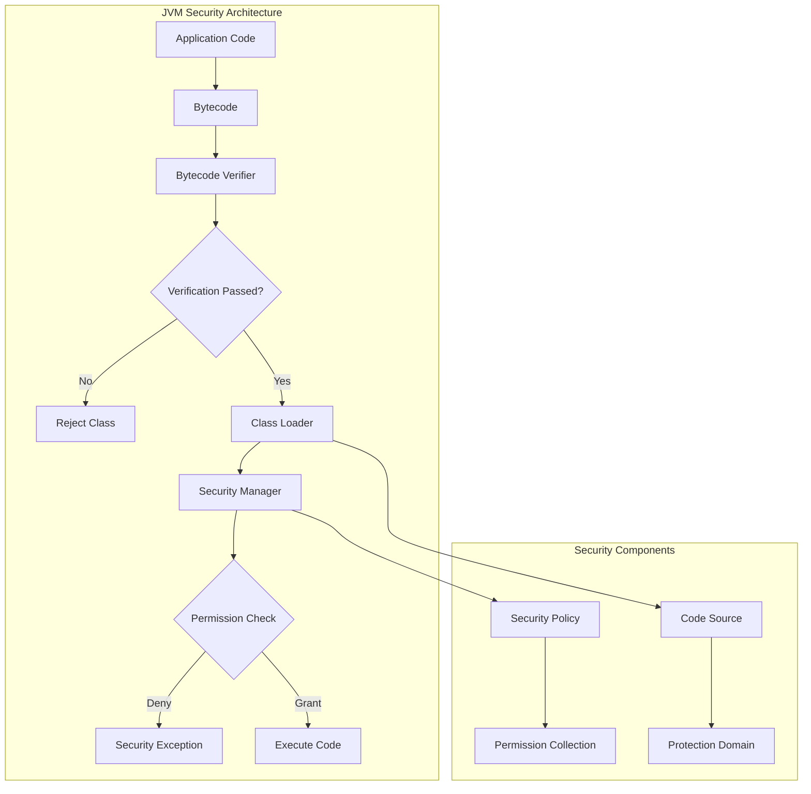
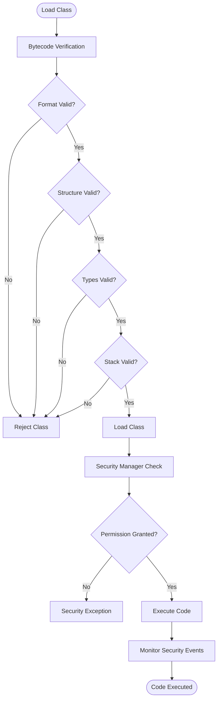

# 11. JVM Security

## Introduction

JVM security encompasses the mechanisms and features that protect Java applications from malicious code, unauthorized access, and security vulnerabilities. From bytecode verification to security managers, the JVM provides multiple layers of security to ensure safe execution of Java code. Understanding JVM security is crucial for developing secure applications, especially in environments where untrusted code may be executed.

This topic covers the essential JVM security mechanisms including bytecode verification, security managers, class loading security, and modern security features. We'll explore how these mechanisms work and how to configure them for different security requirements.

## Learning Objectives

By the end of this topic, you will be able to:

- [ ] Explain JVM security architecture and layers
- [ ] Understand bytecode verification process
- [ ] Configure security managers and policies
- [ ] Implement secure class loading
- [ ] Apply security best practices
- [ ] Identify and mitigate security vulnerabilities
- [ ] Use modern JVM security features

## Prerequisites

- Completion of Topic 10: JVM Tuning
- Understanding of JVM internals
- Familiarity with Java class loading
- Basic knowledge of security concepts

## Why This Concept Exists

### The Security Challenge

Java applications face various security threats:
- **Malicious Code**: Untrusted code that may harm the system
- **Unauthorized Access**: Code accessing resources it shouldn't
- **Code Injection**: Injecting malicious bytecode
- **Privilege Escalation**: Gaining unauthorized permissions

### The JVM Security Solution

JVM security provides:
- **Bytecode Verification**: Ensures code is safe to execute
- **Access Control**: Restricts what code can do
- **Sandboxing**: Isolates untrusted code
- **Cryptographic Support**: Enables secure communications

### Real-World Impact

JVM security affects:
- **Application Safety**: Protecting against malicious code
- **Data Protection**: Securing sensitive information
- **System Integrity**: Preventing unauthorized changes
- **Compliance**: Meeting security regulations

## Problem Statement

### The Security Challenge

Without proper security, applications face:
- **Code Injection Attacks**: Malicious code execution
- **Data Breaches**: Unauthorized data access
- **Privilege Escalation**: Gaining elevated permissions
- **System Compromise**: Complete system takeover

### Real-World Example

A financial application experienced:
- Unauthorized code execution through class loading vulnerabilities
- Data exposure through insecure deserialization
- System compromise through privilege escalation

The solution? Implementing comprehensive JVM security measures.

## Theory

### JVM Security Layers

```
┌─────────────────────────────────────────────────────────────┐
│                    JVM Security Layers                       │
│                                                             │
│  ┌─────────────────────────────────────────────────────┐   │
│  │  Layer 1: Bytecode Verification                     │   │
│  │  - Verifies bytecode integrity                      │   │
│  │  - Checks type safety                               │   │
│  │  - Validates stack integrity                        │   │
│  └─────────────────────────────────────────────────────┘   │
│                                                             │
│  ┌─────────────────────────────────────────────────────┐   │
│  │  Layer 2: Class Loading Security                    │   │
│  │  - Delegation model                                 │   │
│  │  - Namespace isolation                              │   │
│  │  - Code source protection                           │   │
│  └─────────────────────────────────────────────────────┘   │
│                                                             │
│  ┌─────────────────────────────────────────────────────┐   │
│  │  Layer 3: Security Manager                          │   │
│  │  - Access control                                   │   │
│  │  - Permission checking                              │   │
│  │  - Policy enforcement                               │   │
│  └─────────────────────────────────────────────────────┘   │
│                                                             │
│  ┌─────────────────────────────────────────────────────┐   │
│  │  Layer 4: Runtime Security                          │   │
│  │  - Memory protection                                │   │
│  │  - Thread safety                                    │   │
│  │  - Exception handling                               │   │
│  └─────────────────────────────────────────────────────┘   │
└─────────────────────────────────────────────────────────────┘
```

### Bytecode Verification

```
┌─────────────────────────────────────────────────────────────┐
│                    Bytecode Verification                     │
│                                                             │
│  ┌─────────────────────────────────────────────────────┐   │
│  │  Format Verification                                 │   │
│  │  - Check magic number                                │   │
│  │  - Verify version numbers                           │   │
│  │  - Validate constant pool                           │   │
│  └─────────────────────────────────────────────────────┘   │
│                                                             │
│  ┌─────────────────────────────────────────────────────┐   │
│  │  Structural Verification                             │   │
│  │  - Check method signatures                          │   │
│  │  - Verify field types                               │   │
│  │  - Validate instruction sequences                   │   │
│  └─────────────────────────────────────────────────────┘   │
│                                                             │
│  ┌─────────────────────────────────────────────────────┐   │
│  │  Type Safety Verification                            │   │
│  │  - Check type compatibility                         │   │
│  │  - Verify method invocations                        │   │
│  │  - Validate field accesses                          │   │
│  └─────────────────────────────────────────────────────┘   │
│                                                             │
│  ┌─────────────────────────────────────────────────────┐   │
│  │  Stack Integrity Verification                        │   │
│  │  - Check stack depth                                │   │
│  │  - Verify operand types                             │   │
│  │  - Validate local variable usage                    │   │
│  └─────────────────────────────────────────────────────┘   │
└─────────────────────────────────────────────────────────────┘
```

### Security Manager

```
┌─────────────────────────────────────────────────────────────┐
│                    Security Manager                          │
│                                                             │
│  ┌─────────────────────────────────────────────────────┐   │
│  │  Permissions                                         │   │
│  │  - File access                                      │   │
│  │  - Network access                                   │   │
│  │  - Runtime operations                               │   │
│  │  - Reflection access                                │   │
│  └─────────────────────────────────────────────────────┘   │
│                                                             │
│  ┌─────────────────────────────────────────────────────┐   │
│  │  Policy Files                                        │   │
│  │  - Grant permissions to code sources                │   │
│  │  - Define security policies                         │   │
│  │  - Configure access rules                           │   │
│  └─────────────────────────────────────────────────────┘   │
│                                                             │
│  ┌─────────────────────────────────────────────────────┐   │
│  │  Access Control                                      │   │
│  │  - Check permissions before operations              │   │
│  │  - Deny unauthorized access                         │   │
│  │  - Log security events                              │   │
│  └─────────────────────────────────────────────────────┘   │
└─────────────────────────────────────────────────────────────┘
```

## Internal Working

### Bytecode Verification Process

```
1. Class Loading
   ├── Load class bytes from source
   ├── Parse class file structure
   └── Create Class object

2. Format Verification
   ├── Check magic number (0xCAFEBABE)
   ├── Verify version compatibility
   └── Validate constant pool entries

3. Structural Verification
   ├── Check method descriptors
   ├── Verify field descriptors
   └── Validate instruction sequences

4. Type Safety Verification
   ├── Check type compatibility
   ├── Verify method signatures
   └── Validate field accesses

5. Stack Verification
   ├── Check stack depth limits
   ├── Verify operand types
   └── Validate local variable usage

6. Verification Complete
   ├── Class marked as verified
   └── Ready for execution
```

### Security Manager Process

```
1. Security Manager Installation
   ├── Set system security manager
   ├── Load security policy
   └── Initialize permission collection

2. Permission Check
   ├── Code requests operation
   ├── Security manager checks permission
   ├── Policy grants or denies
   └── Operation proceeds or throws exception

3. Access Control
   ├── Check caller's code source
   ├── Verify permissions
   ├── Check stack permissions
   └── Grant or deny access

4. Security Event Logging
   ├── Log security violations
   ├── Record access attempts
   └── Monitor suspicious activity
```

## JVM Perspective

### What the JVM Sees

The JVM sees:
- **Class Files**: Bytecode to verify and execute
- **Code Sources**: Origins of loaded code
- **Permissions**: Allowed operations
- **Security Policies**: Rules for access control

### Security Architecture

```
┌─────────────────────────────────────────────────────────────┐
│                    Security Architecture                     │
│                                                             │
│  ┌─────────────────────────────────────────────────────┐   │
│  │  Application Layer                                   │   │
│  │  - Business logic                                    │   │
│  │  - Security policies                                │   │
│  └─────────────────────────────────────────────────────┘   │
│                                                             │
│  ┌─────────────────────────────────────────────────────┐   │
│  │  JVM Security Layer                                  │   │
│  │  - Security Manager                                 │   │
│  │  - Access Controller                                 │   │
│  │  - Permission Collection                            │   │
│  └─────────────────────────────────────────────────────┘   │
│                                                             │
│  ┌─────────────────────────────────────────────────────┐   │
│  │  Class Loading Layer                                 │   │
│  │  - Bytecode Verification                            │   │
│  │  - Class Loader Delegation                          │   │
│  │  - Namespace Isolation                              │   │
│  └─────────────────────────────────────────────────────┘   │
│                                                             │
│  ┌─────────────────────────────────────────────────────┐   │
│  │  Runtime Layer                                       │   │
│  │  - Memory Protection                                │   │
│  │  - Thread Safety                                    │   │
│  │  - Exception Handling                               │   │
│  └─────────────────────────────────────────────────────┘   │
└─────────────────────────────────────────────────────────────┘
```

## Memory Representation

### Security Data Structures

```
┌─────────────────────────────────────────────────────────────┐
│                    Security Data Structures                  │
│                                                             │
│  ┌─────────────────────────────────────────────────────┐   │
│  │  Permission Collection                               │   │
│  │  ┌─────────────────────────────────────────────┐   │   │
│  │  │  FilePermission                               │   │   │
│  │  │  SocketPermission                             │   │   │
│  │  │  RuntimePermission                            │   │   │
│  │  │  ReflectPermission                            │   │   │
│  │  └─────────────────────────────────────────────┘   │   │
│  └─────────────────────────────────────────────────────┘   │
│                                                             │
│  ┌─────────────────────────────────────────────────────┐   │
│  │  Code Source                                         │   │
│  │  ┌─────────────────────────────────────────────┐   │   │
│  │  │  Location (URL)                              │   │   │
│  │  │  Certificates                                │   │   │
│  │  │  Permissions                                 │   │   │
│  │  └─────────────────────────────────────────────┘   │   │
│  └─────────────────────────────────────────────────────┘   │
│                                                             │
│  ┌─────────────────────────────────────────────────────┐   │
│  │  Protection Domain                                    │   │
│  │  ┌─────────────────────────────────────────────┐   │   │
│  │  │  Code Source                                  │   │   │
│  │  │  Permission Collection                       │   │   │
│  │  │  Signers                                     │   │   │
│  │  └─────────────────────────────────────────────┘   │   │
│  └─────────────────────────────────────────────────────┘   │
└─────────────────────────────────────────────────────────────┘
```

## Architecture Diagram (Mermaid)



## Flow Diagram (Mermaid)



## Syntax (with examples)

### Security Manager Configuration

```bash
# Enable security manager
java -Djava.security.manager MyApp

# Set security policy
java -Djava.security.policy=policy.txt MyApp

# Disable security manager (not recommended)
java -Djava.security.manager=allow MyApp
```

### Security Policy File

```
// policy.txt
grant codeBase "file:/path/to/app/" {
    permission java.security.AllPermission;
};

grant codeBase "file:/path/to/plugin/" {
    permission java.io.FilePermission "/tmp/*", "read,write";
    permission java.net.SocketPermission "example.com:80", "connect";
};


---

**Continue to Part 2**: [README-part2.md](README-part2.md) | [Part 3](README-part3.md) | [Part 4](README-part4.md)