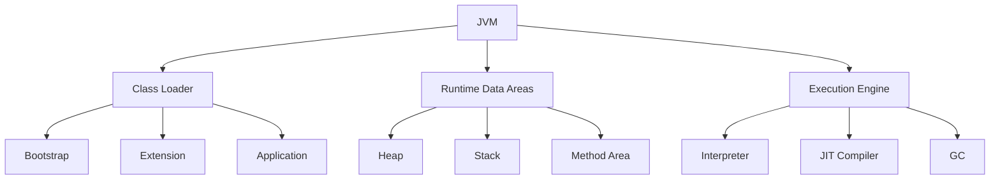

# Module 09: JVM Internals

## Overview
Understanding JVM internals is crucial for Java performance tuning, debugging, and troubleshooting. The JVM handles class loading, memory management, garbage collection, and bytecode execution.

## Learning Objectives
- Understand JVM architecture
- Master class loading process
- Understand memory management
- Analyze JVM performance
- Use JVM monitoring tools

## Prerequisites
- Core Java knowledge
- Memory concepts
- Basic optimization

## History
- **1996** — Java 1.0: Classic VM with interpreter-only execution
- **1997** — JIT compiler introduced for hot method compilation
- **2000** — HotSpot VM became the default (from Sun's earlier work)
- **2004** — Java 5 added PermGen, annotations, and enhanced GC logging
- **2011** — Java 7 replaced PermGen with Metaspace (native memory)
- **2014** — Java 8 default GC: Parallel GC for throughput
- **2017** — Java 9: G1 GC became the default
- **2018** — Java 11: ZGC introduced (low-latency GC, experimental)
- **2021** — Java 17: ZGC and Shenandoah became production-ready
- **2021** — Java 17: Sealed classes, pattern matching (JVM bytecode changes)
- **2023** — Java 21: Virtual threads (JVM-level lightweight threads)

## Why This Concept Exists
JVM knowledge enables:
- Performance optimization
- Memory leak detection
- GC tuning
- Production troubleshooting

## Problem Statement
How does the JVM execute Java code and manage resources?

## Core Concepts

### JVM Architecture

| Component | Purpose |
|-----------|---------|
| Class Loader | Loads .class files |
| Runtime Data Areas | Memory management |
| Execution Engine | Bytecode execution |
| Native Interface | Native method calls |
| JIT Compiler | Runtime compilation |

### Memory Areas

| Area | Purpose | Thread |
|------|---------|--------|
| Heap | Object storage | Shared |
| Stack | Method frames | Per-thread |
| Method Area | Class metadata | Shared |
| PC Register | Current instruction | Per-thread |
| Native Stack | Native calls | Per-thread |

### Class Loading

| Phase | Description |
|-------|-------------|
| Loading | Read .class file |
| Linking | Verify, prepare, resolve |
| Initialization | Execute static blocks |

## Internal Working

### Object Lifecycle
1. Class loading
2. Memory allocation
3. Constructor execution
4. Use
5. GC collection

### JIT Compilation
```
Hot Code → Interpreter → JIT Compiler → Native Code → Cache
```

## JVM Perspective

### Bytecode Instructions
- iconst, lconst, fconst, dconst (constants)
- iload, lload, fload, dload (load)
- istore, lstore, fstore, dstore (store)
- iadd, ladd, fadd, dadd (add)
- invokevirtual, invokeinterface (method calls)

### GC Roots
- Local variables
- Static fields
- JNI references
- Active threads
- Monitors

## Architecture Diagram



## Syntax

### JVM Flags
```bash
# Heap sizing
-Xms512m -Xmx2g

# GC
-XX:+UseG1GC
-XX:MaxGCPauseMillis=200

# Monitoring
-XX:+PrintGCDetails
-XX:+HeapDumpOnOutOfMemoryError
```

### JMX Monitoring
```java
import java.lang.management.*;

MemoryMXBean memoryBean = ManagementFactory.getMemoryMXBean();
ThreadMXBean threadBean = ManagementFactory.getThreadMXBean();

System.out.println("Heap: " + memoryBean.getHeapMemoryUsage());
System.out.println("Threads: " + threadBean.getThreadCount());
```

## Easy Example
```java
import java.lang.management.*;

public class EasyExample {
    public static void main(String[] args) {
        Runtime runtime = Runtime.getRuntime();
        
        System.out.println("Max Memory: " + runtime.maxMemory() / 1024 / 1024 + " MB");
        System.out.println("Total Memory: " + runtime.totalMemory() / 1024 / 1024 + " MB");
        System.out.println("Free Memory: " + runtime.freeMemory() / 1024 / 1024 + " MB");
        
        // Create objects to see memory usage
        Object[] objects = new Object[1000000];
        for (int i = 0; i < objects.length; i++) {
            objects[i] = new Object();
        }
        
        System.out.println("After allocation: " + 
            (runtime.totalMemory() - runtime.freeMemory()) / 1024 / 1024 + " MB");
    }
}
```

## Medium Example
```java
import java.lang.management.*;
import java.util.*;

public class MediumExample {
    // Analyze class loading
    public static void analyzeClasses() {
        ClassLoadingMXBean bean = ManagementFactory.getClassLoadingMXBean();
        
        System.out.println("Loaded: " + bean.getTotalLoadedClassCount());
        System.out.println("Unloaded: " + bean.getUnloadedClassCount());
        System.out.println("Cached: " + bean.getVirtualThreadCount());
    }
    
    // Analyze threads
    public static void analyzeThreads() {
        ThreadMXBean bean = ManagementFactory.getThreadMXBean();
        
        System.out.println("Thread count: " + bean.getThreadCount());
        System.out.println("Peak threads: " + bean.getPeakThreadCount());
        System.out.println("Daemon threads: " + bean.getDaemonThreadCount());
        
        long[] deadlocked = bean.findDeadlockedThreads();
        if (deadlocked != null) {
            System.out.println("Deadlock detected!");
        }
    }
    
    public static void main(String[] args) {
        analyzeClasses();
        analyzeThreads();
    }
}
```

## Hard Example
```java
import java.lang.management.*;
import java.util.*;

public class HardExample {
    // Custom memory monitor
    public static class MemoryMonitor {
        private final MemoryMXBean memoryBean;
        private final List<MemoryUsage> history = new ArrayList<>();
        
        public MemoryMonitor() {
            this.memoryBean = ManagementFactory.getMemoryMXBean();
        }
        
        public void snapshot() {
            history.add(memoryBean.getHeapMemoryUsage());
        }
        
        public MemoryUsage getLatest() {
            return history.get(history.size() - 1);
        }
        
        public long getUsedMemory() {
            return getLatest().getUsed();
        }
        
        public double getUsagePercentage() {
            MemoryUsage usage = getLatest();
            return (double) usage.getUsed() / usage.getMax() * 100;
        }
    }
    
    public static void main(String[] args) throws InterruptedException {
        MemoryMonitor monitor = new MemoryMonitor();
        
        for (int i = 0; i < 10; i++) {
            monitor.snapshot();
            System.out.printf("Memory usage: %.1f%%%n", monitor.getUsagePercentage());
            Thread.sleep(1000);
        }
    }
}
```

## Enterprise Example
```java
import java.lang.management.*;
import java.util.concurrent.*;

public class EnterpriseExample {
    // JVM metrics collection
    public static Map<String, Object> collectMetrics() {
        Map<String, Object> metrics = new HashMap<>();
        
        // Memory
        MemoryMXBean memoryBean = ManagementFactory.getMemoryMXBean();
        MemoryUsage heap = memoryBean.getHeapMemoryUsage();
        metrics.put("heap.used", heap.getUsed() / 1024 / 1024);
        metrics.put("heap.max", heap.getMax() / 1024 / 1024);
        
        // Threads
        ThreadMXBean threadBean = ManagementFactory.getThreadMXBean();
        metrics.put("threads.count", threadBean.getThreadCount());
        metrics.put("threads.peak", threadBean.getPeakThreadCount());
        
        // GC
        List<GarbageCollectorMXBean> gcBeans = ManagementFactory.getGarbageCollectorMXBeans();
        long totalCollections = 0;
        long totalTime = 0;
        for (GarbageCollectorMXBean gc : gcBeans) {
            totalCollections += gc.getCollectionCount();
            totalTime += gc.getCollectionTime();
        }
        metrics.put("gc.collections", totalCollections);
        metrics.put("gc.time", totalTime);
        
        return metrics;
    }
    
    public static void main(String[] args) {
        Map<String, Object> metrics = collectMetrics();
        metrics.forEach((k, v) -> System.out.println(k + ": " + v));
    }
}
```

## Performance Considerations
- JIT compilation improves hot code
- GC tuning affects pauses
- Memory sizing impacts performance
- Thread pool sizing matters

## Time & Space Complexity

| Operation | Time | Space |
|-----------|------|-------|
| Class loading | O(n) | O(classes) |
| Object creation | O(1) | O(object) |
| GC | O(n) | O(heap) |
| JIT compile | O(code) | O(native) |

## Thread Safety
- JVM manages thread scheduling
- Synchronization primitives
- Memory visibility rules
- Happens-before relationships

## Best Practices
1. Monitor JVM metrics
2. Tune heap size appropriately
3. Choose right GC algorithm
4. Use JFR for profiling
5. Analyze heap dumps

## Common Mistakes
1. Oversized heap
2. Wrong GC choice
3. Ignoring GC logs
4. Not monitoring

## Comparison Table

| Feature | Default | G1 | ZGC |
|---------|---------|-----|-----|
| Pause | Variable | Predictable | Ultra-low |
| Throughput | High | High | Medium |
| Heap Size | Any | Large | Large |

## Interview Questions

### Q1: What are the JVM memory areas?
**Answer:** Heap, stack, method area, PC register, native stack.

### Q2: What is JIT compilation?
**Answer:** Runtime compilation of bytecode to native code.

### Q3: What are GC roots?
**Answer:** Objects that are always reachable (static fields, locals, etc.).

### Q4: What is the difference between heap and stack?
**Answer:** Heap stores objects, stack stores method frames.

### Q5: What is class loading?
**Answer:** Process of loading .class files into JVM.

### Q6: What is the difference between Class.forName and classloader?
**Answer:** Class.forName initializes class, classloader doesn't by default.

### Q7: What is bytecode?
**Answer:** Intermediate representation of Java code.

### Q8: What is the difference between interpreter and JIT?
**Answer:** Interpreter executes bytecode, JIT compiles to native code.

### Q9: What is a memory leak?
**Answer:** Objects that are no longer needed but still referenced.

### Q10: What is OutOfMemoryError?
**Answer:** Error when heap is full and GC can't free space.

### Q11: What is StackOverflowError?
**Answer:** Error when stack is full (deep recursion).

### Q12: What is the difference between young and old generation?
**Answer:** Young gen holds new objects, old gen holds long-lived objects.

### Q13: What is a safepoint?
**Answer:** Point where JVM can safely pause threads for GC.

### Q14: What is JIT optimization?
**Answer:** Techniques like inlining, loop unrolling, etc.

### Q15: What is JFR?
**Answer:** Java Flight Recorder for production profiling.

## Exercises

### Easy
1. Monitor JVM memory usage
2. Check thread count
3. Analyze GC activity

### Medium
1. Take heap dump
2. Analyze thread dump
3. Tune JVM flags

### Hard
1. Build custom JVM metric collector
2. Analyze memory leaks
3. Optimize GC for low latency

## Summary
Understanding JVM internals is essential for performance tuning and troubleshooting.

## References
- JVM Specification
- Oracle JVM Documentation
- JVM Internals by Aleksey Shipilëv

## Cross-References

- **Previous Module:** [09 - Multithreading](../09-multithreading/)
- **Next Module:** [12 - Testing](../12-testing/)
- **Related:** [01 - Fundamentals](../01-fundamentals/) — compilation and bytecode
- **Related:** [02 - OOP](../02-oop/) — class loading, object layout, memory model
- **Related:** [04 - Collections](../04-collections/) — memory usage of data structures
- **Related:** [09 - Multithreading](../09-multithreading/) — JVM thread model and memory visibility
- **External:** [JVM Specification](https://docs.oracle.com/javase/specs/jvms/se21/html/)
- **External:** [OpenJDK Wiki](https://wiki.openjdk.java.net/)
