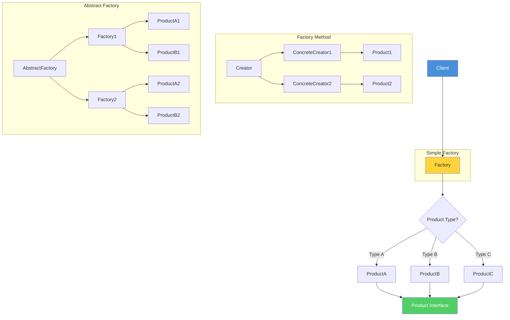

# Factory Pattern

## 1. Introduction

The Factory Pattern is a creational design pattern that provides an interface for creating objects without specifying their concrete classes. It encapsulates object creation logic, allowing subclasses or methods to determine which class to instantiate.

The Factory pattern promotes loose coupling by eliminating the need to bind application-specific classes into the code. The code only deals with the interface, and works with any class that implements the interface.

---

## 2. Learning Objectives

By the end of this topic, you will be able to:

- Implement Simple Factory, Factory Method, and Abstract Factory patterns
- Understand when to use each factory variant
- Apply factory patterns to create flexible, maintainable code
- Recognize factory usage in Java standard library and frameworks
- Understand the relationship between Factory and other patterns

---

## 3. Prerequisites

- Understanding of interfaces and abstract classes
- Knowledge of polymorphism in Java
- Familiarity with dependency injection concepts
- Understanding of SOLID principles

---

## 4. Why This Concept Exists

The Factory pattern exists because:

- **Loose coupling**: Client code doesn't depend on concrete classes
- **Flexibility**: Easy to add new types without modifying client code
- **Encapsulation**: Object creation logic is centralized
- **Testability**: Easy to mock factory for testing
- **Single Responsibility**: Object creation separated from business logic

Without Factory, you'd have `new ConcreteClass()` scattered throughout code, creating tight coupling.

---

## 5. Problem Statement

Consider a notification system:

```java
// BAD: Tight coupling
public class NotificationService {
    public void sendNotification(String type, String message) {
        if (type.equals("email")) {
            EmailNotification email = new EmailNotification();
            email.send(message);
        } else if (type.equals("sms")) {
            SMSNotification sms = new SMSNotification();
            sms.send(message);
        } else if (type.equals("push")) {
            PushNotification push = new PushNotification();
            push.send(message);
        }
        // Adding new types requires modifying this class
    }
}
```

**Problems:**
1. **Open/Closed Principle violation**: Must modify class to add new types
2. **Tight coupling**: Depends on concrete classes
3. **Code duplication**: Similar creation logic repeated
4. **Hard to test**: Cannot easily mock notification types

---

## 6. Theory

### 6.1 Factory Pattern Variants

| Variant | Purpose | When to Use |
|---------|---------|-------------|
| Simple Factory | Centralize creation logic | Single factory, few types |
| Factory Method | Delegate to subclasses | Multiple factories needed |
| Abstract Factory | Create families of objects | Multiple related products |

### 6.2 Factory vs. Builder

| Feature | Factory | Builder |
|---------|---------|---------|
| Purpose | Create different types | Build complex objects |
| Focus | Type selection | Step-by-step construction |
| Output | Different object types | One complex object |

### 6.3 Open/Closed Principle

Factory pattern supports OCP:
- **Open for extension**: Add new product classes
- **Closed for modification**: Don't modify factory or client code

---

## 7. Internal Working

### Factory Pattern Diagram



### 7.1 Simple Factory Flow

```
Client → Factory.create(type) → switch/if → return ConcreteProduct
```

### 7.2 Factory Method Flow

```
Client → Creator.create() → AbstractCreator.create() → ConcreteCreator.create()
```

### 7.3 Abstract Factory Flow

```
Client → AbstractFactory.createProductA()
       → AbstractFactory.createProductB()
       → Returns product family
```

---

## 8. JVM Perspective

### 8.1 Dynamic Class Loading

Factory patterns often use dynamic class loading:
- Class.forName() loads class by name
- Reflection creates instances
- ServiceLoader loads implementations from classpath

### 8.2 Memory Considerations

- Factory objects are lightweight
- Created objects consume heap memory
- Consider object pooling for expensive objects

---

## 9. Memory Representation

### 9.1 Factory Memory Model

```
┌─────────────────────────┐
│      Factory            │
│  - static instance      │
│  + create()             │
└──────────┬──────────────┘
           │ creates
           ↓
┌─────────────────────────┐
│   Product Interface     │
└──────────┬──────────────┘
           │ implemented by
     ┌─────┴─────┐
     ↓           ↓
┌─────────┐  ┌─────────┐
│ProductA │  │ProductB │
└─────────┘  └─────────┘
```

---

## 10. Syntax

### 10.1 Simple Factory

```java
public class ProductFactory {
    public static Product create(String type) {
        return switch (type) {
            case "A" -> new ProductA();
            case "B" -> new ProductB();
            default -> throw new IllegalArgumentException();
        };
    }
}
```

### 10.2 Factory Method

```java
public abstract class Creator {
    public abstract Product createProduct();
    
    public void doSomething() {
        Product product = createProduct();
        product.use();
    }
}

public class ConcreteCreator extends Creator {
    @Override
    public Product createProduct() {
        return new ConcreteProduct();
    }
}
```

### 10.3 Abstract Factory

```java
public interface AbstractFactory {
    ProductA createProductA();
    ProductB createProductB();
}

public class ConcreteFactory implements AbstractFactory {
    @Override
    public ProductA createProductA() {
        return new ConcreteProductA();
    }
    
    @Override
    public ProductB createProductB() {
        return new ConcreteProductB();
    }
}
```

---

## 11. Easy Example

### Simple Shape Factory

```java
public interface Shape {
    void draw();
}

public class Circle implements Shape {
    @Override
    public void draw() {
        System.out.println("Drawing Circle");
    }
}

public class Rectangle implements Shape {
    @Override
    public void draw() {
        System.out.println("Drawing Rectangle");
    }
}

public class ShapeFactory {
    public static Shape create(String type) {
        return switch (type.toLowerCase()) {
            case "circle" -> new Circle();
            case "rectangle" -> new Rectangle();
            default -> throw new IllegalArgumentException("Unknown shape: " + type);
        };
    }
}

// Usage
Shape shape = ShapeFactory.create("circle");
shape.draw(); // "Drawing Circle"
```

---

## 12. Medium Example

### Notification Factory with Multiple Types

```java
public interface Notification {
    void send(String title, String message);
}

public class EmailNotification implements Notification {
    @Override
    public void send(String title, String message) {
        System.out.println("Email: " + title + " - " + message);
    }
}

public class SMSNotification implements Notification {
    @Override
    public void send(String title, String message) {
        System.out.println("SMS: " + title + " - " + message);
    }
}

public class PushNotification implements Notification {
    @Override
    public void send(String title, String message) {
        System.out.println("Push: " + title + " - " + message);
    }
}

public class NotificationFactory {
    private static final Map<String, Supplier<Notification>> NOTIFICATIONS = Map.of(
        "email", EmailNotification::new,
        "sms", SMSNotification::new,
        "push", PushNotification::new
    );
    
    public static Notification create(String type) {
        Supplier<Notification> supplier = NOTIFICATIONS.get(type.toLowerCase());
        if (supplier == null) {
            throw new IllegalArgumentException("Unknown notification type: " + type);
        }
        return supplier.get();
    }
    
    public static Set<String> getSupportedTypes() {
        return NOTIFICATIONS.keySet();
    }
}

// Usage
Notification notification = NotificationFactory.create("email");
notification.send("Alert", "Server is down!");
```

---

## 13. Hard Example

### Abstract Factory for UI Components

```java
// Product interfaces
public interface Button {
    void render();
    void onClick(Runnable action);
}

public interface TextBox {
    void render();
    String getValue();
}

public interface CheckBox {
    void render();
    boolean isChecked();
}

// Abstract Factory
public interface UIFactory {
    Button createButton();
    TextBox createTextBox();
    CheckBox createCheckBox();
}

// Concrete products - Light theme
public class LightButton implements Button {
    @Override
    public void render() {
        System.out.println("Rendering light button");
    }
    
    @Override
    public void onClick(Runnable action) {
        action.run();
    }
}

public class LightTextBox implements TextBox {
    private String value = "";
    
    @Override
    public void render() {
        System.out.println("Rendering light text box");
    }
    
    @Override
    public String getValue() {
        return value;
    }
}

public class LightCheckBox implements CheckBox {
    private boolean checked = false;
    
    @Override
    public void render() {
        System.out.println("Rendering light checkbox");
    }
    
    @Override
    public boolean isChecked() {
        return checked;
    }
}

// Concrete Factory - Light theme
public class LightUIFactory implements UIFactory {
    @Override
    public Button createButton() {
        return new LightButton();
    }
    
    @Override
    public TextBox createTextBox() {
        return new LightTextBox();
    }
    
    @Override
    public CheckBox createCheckBox() {
        return new LightCheckBox();
    }
}

// Dark theme implementations
public class DarkButton implements Button {
    @Override
    public void render() {
        System.out.println("Rendering dark button");
    }
    
    @Override
    public void onClick(Runnable action) {
        action.run();
    }
}

public class DarkTextBox implements TextBox {
    private String value = "";
    
    @Override
    public void render() {
        System.out.println("Rendering dark text box");
    }
    
    @Override
    public String getValue() {
        return value;
    }
}

public class DarkCheckBox implements CheckBox {
    private boolean checked = false;
    
    @Override
    public void render() {
        System.out.println("Rendering dark checkbox");
    }
    
    @Override
    public boolean isChecked() {
        return checked;
    }
}

public class DarkUIFactory implements UIFactory {
    @Override
    public Button createButton() {
        return new DarkButton();
    }
    
    @Override
    public TextBox createTextBox() {
        return new DarkTextBox();
    }
    
    @Override
    public CheckBox createCheckBox() {
        return new DarkCheckBox();
    }
}

// Client code
public class Application {
    private final Button button;
    private final TextBox textBox;
    private final CheckBox checkBox;
    
    public Application(UIFactory factory) {
        this.button = factory.createButton();
        this.textBox = factory.createTextBox();
        this.checkBox = factory.createCheckBox();
    }
    
    public void render() {
        button.render();
        textBox.render();
        checkBox.render();
    }
}

// Usage
UIFactory factory = new LightUIFactory(); // or DarkUIFactory
Application app = new Application(factory);
app.render();
```

---

## 14. Enterprise Example

### Database Access Factory with Configuration

```java
// Product interface
public interface Database {
    Connection getConnection() throws SQLException;
    void executeQuery(String sql, Consumer<ResultSet> handler) throws SQLException;
    void executeUpdate(String sql) throws SQLException;
    void close();
}

// Concrete products
public class MySQLDatabase implements Database {
    private final HikariDataSource dataSource;
    
    public MySQLDatabase(DatabaseConfig config) {
        HikariConfig hikariConfig = new HikariConfig();
        hikariConfig.setJdbcUrl(config.getUrl());
        hikariConfig.setUsername(config.getUsername());
        hikariConfig.setPassword(config.getPassword());
        hikariConfig.setMaximumPoolSize(config.getPoolSize());
        this.dataSource = new HikariDataSource(hikariConfig);
    }
    
    @Override
    public Connection getConnection() throws SQLException {
        return dataSource.getConnection();
    }
    
    @Override
    public void executeQuery(String sql, Consumer<ResultSet> handler) throws SQLException {
        try (Connection conn = getConnection();
             Statement stmt = conn.createStatement();
             ResultSet rs = stmt.executeQuery(sql)) {
            handler.accept(rs);
        }
    }
    
    @Override
    public void executeUpdate(String sql) throws SQLException {
        try (Connection conn = getConnection();
             Statement stmt = conn.createStatement()) {
            stmt.executeUpdate(sql);
        }
    }
    
    @Override
    public void close() {
        dataSource.close();
    }
}

public class PostgresDatabase implements Database {
    private final HikariDataSource dataSource;
    
    public PostgresDatabase(DatabaseConfig config) {
        HikariConfig hikariConfig = new HikariConfig();
        hikariConfig.setJdbcUrl(config.getUrl());
        hikariConfig.setUsername(config.getUsername());
        hikariConfig.setPassword(config.getPassword());
        hikariConfig.setMaximumPoolSize(config.getPoolSize());
        this.dataSource = new HikariDataSource(hikariConfig);
    }
    
    @Override
    public Connection getConnection() throws SQLException {
        return dataSource.getConnection();
    }
    
    @Override
    public void executeQuery(String sql, Consumer<ResultSet> handler) throws SQLException {
        try (Connection conn = getConnection();
             Statement stmt = conn.createStatement();
             ResultSet rs = stmt.executeQuery(sql)) {
            handler.accept(rs);
        }
    }
    
    @Override
    public void executeUpdate(String sql) throws SQLException {
        try (Connection conn = getConnection();
             Statement stmt = conn.createStatement()) {
            stmt.executeUpdate(sql);
        }
    }
    
    @Override
    public void close() {
        dataSource.close();
    }
}

// Configuration
public record DatabaseConfig(
    String type,
    String url,
    String username,
    String password,
    int poolSize
) {}

// Factory with configuration
public class DatabaseFactory {
    private static final Map<String, Function<DatabaseConfig, Database>> DATABASES = Map.of(
        "mysql", MySQLDatabase::new,
        "postgresql", PostgresDatabase::new
    );
    
    public static Database create(DatabaseConfig config) {
        Function<DatabaseConfig, Database> creator = DATABASES.get(config.type().toLowerCase());
        if (creator == null) {
            throw new IllegalArgumentException("Unsupported database: " + config.type());
        }
        return creator.apply(config);
    }
    
    public static Database create(String type, String url, String username, String password) {
        return create(new DatabaseConfig(type, url, username, password, 10));
    }
}

// Usage
DatabaseConfig config = new DatabaseConfig(
    "mysql",
    "jdbc:mysql://localhost:3306/mydb",
    "root",
    "password",
    10
);
Database db = DatabaseFactory.create(config);
db.executeQuery("SELECT * FROM users", rs -> {
    while (rs.next()) {
        System.out.println(rs.getString("name"));
    }
});
db.close();
```

---

## 15. Performance

### 15.1 Performance Metrics

| Operation | Time Complexity | Notes |
|-----------|----------------|-------|
| Factory creation | O(1) | Map lookup or switch |
| Object creation | O(1) | Constructor call |
| Registration | O(1) | Map.put() |

### 15.2 Optimization Tips

1. **Cache factory instances**: Avoid creating factory objects repeatedly
2. **Use Supplier**: Lazy object creation
3. **Pre-register products**: Initialize all products at startup
4. **Pool expensive objects**: Use connection pooling for databases

---

## 16. Best Practices

1. **Return interfaces**: Client should depend on abstractions
2. **Use enums for type selection**: Type-safe, no magic strings
3. **Document factory methods**: Clear Javadoc for each product
4. **Handle unknown types gracefully**: Throw meaningful exceptions
5. **Consider dependency injection**: Let DI framework manage factories
6. **Use generics for type safety**: Return specific types
7. **Keep factories small**: One responsibility per factory
8. **Consider factory method vs. abstract factory**: Choose based on complexity

---

## 17. Common Mistakes

1. **Using string-based type selection**: Prone to typos, not type-safe
2. **Overcomplicating**: Using abstract factory when simple factory suffices
3. **Ignoring error handling**: Not handling unknown types
4. **Tight coupling to factory**: Client depends on concrete factory
5. **Not using dependency injection**: Creating factories manually

---

## 18. Pitfalls

- **Increased complexity**: More classes and interfaces
- **Hard to trace**: Object creation happens in factory
- **Testing overhead**: Must mock factory for testing
- **Over-engineering**: Using factory for simple cases
- **Performance overhead**: Additional indirection

---

## 19. Debugging Tips

1. **Log factory calls**: Add logging to track object creation
2. **Use breakpoints**: Set breakpoints in factory methods
3. **Check classpath**: Ensure all implementations are available
4. **Verify type registration**: Check factory is properly configured
5. **Test edge cases**: Unknown types, null values

---

## 20. Comparison Table

| Variant | Complexity | Flexibility | Use Case |
|---------|------------|-------------|----------|
| Simple Factory | Low | Medium | Few product types |
| Factory Method | Medium | High | Multiple factories needed |
| Abstract Factory | High | Very High | Families of related products |

---

## 21. Decision Tree

```
Need to create objects?
├── Single factory needed? → Simple Factory
├── Multiple factories? → Factory Method
├── Creating families of objects? → Abstract Factory
└── Complex construction? → Consider Builder instead
```

---

## 22. Interview Questions

### Q1: What is the difference between Factory and Abstract Factory?
**Answer**: Factory creates single products. Abstract Factory creates families of related products without specifying concrete classes.

### Q2: When would you use Factory Method over Simple Factory?
**Answer**: When you need to defer instantiation to subclasses, or when the creation logic should be extensible by subclassing the creator.

### Q3: How does Factory support Open/Closed Principle?
**Answer**: New products can be added without modifying existing factory or client code — just add new product class and optionally new factory.

### Q4: What are real-world examples of Factory pattern?
**Answer**: Collections.unmodifiableList(), Executors.newFixedThreadPool(), DocumentBuilderFactory, LoggerFactory.

### Q5: Can Factory pattern return different types?
**Answer**: Yes, as long as they implement the same interface or extend the same base class.

---

## 23. Exercises

### Exercise 1: Simple Factory
Create a factory for different payment methods (CreditCard, PayPal, Crypto).

### Exercise 2: Factory Method
Implement Factory Method pattern for creating different document types (PDF, Word, HTML).

### Exercise 3: Abstract Factory
Create an Abstract Factory for different database drivers (MySQL, PostgreSQL, Oracle).

---

## 24. Assignments

1. **Assignment 1**: Implement a factory for creating different shapes with area calculation
2. **Assignment 2**: Create a factory method pattern for vehicle manufacturing
3. **Assignment 3**: Build an abstract factory for cross-platform UI components

---

## 25. Mini Project

### Notification System with Factory Pattern
Create a notification system that:
- Supports multiple notification types (Email, SMS, Push, Slack)
- Uses Simple Factory for basic creation
- Uses Abstract Factory for platform-specific notifications (iOS, Android, Web)
- Includes configuration management
- Is testable with mock factories

---

## 26. Summary

- Factory pattern centralizes object creation
- Three variants: Simple Factory, Factory Method, Abstract Factory
- Promotes loose coupling and supports OCP
- Return interfaces, not concrete classes
- Consider dependency injection as alternative
- Use appropriately based on complexity

---

## 27. References

1. Gamma, E., et al. (1994). *Design Patterns*, Chapter 3
2. Bloch, J. (2018). *Effective Java*, Item 53
3. Martin, R. C. (2017). *Clean Architecture*
4. Refactoring Guru: https://refactoring.guru/design-patterns/factory-method
5. Java Design Patterns: https://java-design-patterns.com/patterns/factory-method/
