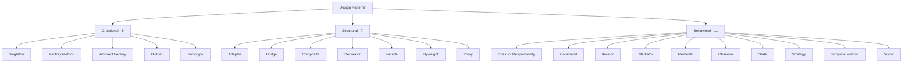
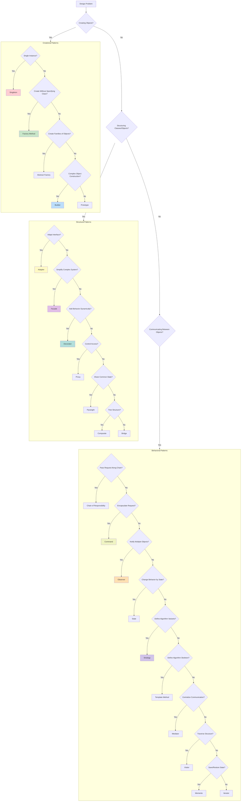

# Module 11: Design Patterns

> **Difficulty:** ⭐⭐⭐ Intermediate  
> **Reading:** 30 min | **Practice:** 60 min | **Total:** 90 min

## Overview
Design patterns are reusable solutions to common software design problems. This module covers all 23 Gang of Four (GoF) patterns with real-world examples.

## Learning Objectives
- Understand all GoF design patterns
- Apply creational patterns (5 patterns)
- Use structural patterns (7 patterns)
- Implement behavioral patterns (11 patterns)
- Choose appropriate patterns for specific problems

## Prerequisites
- OOP concepts
- Java fundamentals
- Problem-solving skills

---

## Pattern Categories

### Creational Patterns (5)
| Pattern | Purpose | Use Case |
|---------|---------|----------|
| Singleton | Single instance | Configuration, Logger |
| Factory Method | Create objects without specifying class | Shape creation, Payment processing |
| Abstract Factory | Create families of related objects | Cross-platform UI, Database drivers |
| Builder | Construct complex objects step by step | HTTP requests, SQL queries |
| Prototype | Clone existing objects | Copying complex objects |

### Structural Patterns (7)
| Pattern | Purpose | Use Case |
|---------|---------|----------|
| Adapter | Convert one interface to another | Legacy integration, Third-party APIs |
| Bridge | Separate abstraction from implementation | Cross-platform rendering, Database drivers |
| Composite | Treat individual objects uniformly | File systems, UI components |
| Decorator | Add behavior dynamically | I/O streams, Coffee shop |
| Facade | Simplify complex subsystems | Computer startup, Library API |
| Flyweight | Share common state | Text editors, Game objects |
| Proxy | Control access to object | Caching, Logging, Security |

### Behavioral Patterns (11)
| Pattern | Purpose | Use Case |
|---------|---------|----------|
| Chain of Responsibility | Pass request along chain | Support ticket handling, Middleware |
| Command | Encapsulate requests as objects | Undo/Redo, Task queues |
| Iterator | Access elements sequentially | Collections, Database results |
| Mediator | Centralize complex communications | Chat rooms, Air traffic control |
| Memento | Capture and restore state | Undo/Redo, Checkpoints |
| Observer | Notify dependents of changes | Event systems, Pub/Sub |
| State | Change behavior based on state | Order processing, Game states |
| Strategy | Define family of algorithms | Sorting, Payment methods |
| Template Method | Define algorithm skeleton | Data processing, Testing frameworks |
| Visitor | Add operations to objects | AST traversal, Report generation |

---

## Architecture Diagram

---

## Creational Patterns

### 1. Singleton Pattern
Ensures only one instance of a class exists.

**Flavors:**
- Eager initialization
- Lazy initialization
- Thread-safe (double-checked locking)
- Enum singleton
- Bill Pugh singleton

**When to use:**
- Configuration management
- Logging
- Connection pooling
- Cache

### 2. Factory Method Pattern
Defines interface for creating objects, lets subclasses decide which class to instantiate.

**Flavors:**
- Simple Factory
- Factory Method
- Parameterized Factory

**When to use:**
- When you don't know exact types at compile time
- Want to provide flexibility for extension
- Reduce coupling

### 3. Abstract Factory Pattern
Creates families of related objects without specifying concrete classes.

**Flavors:**
- Simple Abstract Factory
- Factory Registry

**When to use:**
- Cross-platform UI components
- Database driver families
- Theme systems

### 4. Builder Pattern
Separates construction of complex object from its representation.

**Flavors:**
- Step-by-step Builder
- Fluent Builder (Method chaining)
- Builder with validation
- Lombok @Builder

**When to use:**
- Complex object creation
- Many constructor parameters
- Immutable objects

### 5. Prototype Pattern
Creates new objects by cloning existing instances.

**Flavors:**
- Shallow clone
- Deep clone
- Clone with registry

**When to use:**
- Expensive object creation
- Avoiding subclasses
- Copying complex objects

---

## Structural Patterns

### 6. Adapter Pattern
Converts one interface to another expected by clients.

**Flavors:**
- Class adapter (inheritance)
- Object adapter (composition)
- Two-way adapter

**When to use:**
- Legacy system integration
- Third-party library adaptation
- Data format conversion

### 7. Bridge Pattern
Separates abstraction from implementation so both can vary independently.

**Flavors:**
- Simple Bridge
- Bridge with factory

**When to use:**
- Cross-platform rendering
- Multiple database drivers
- Platform-independent APIs

### 8. Composite Pattern
Composes objects into tree structures and treats individual objects uniformly.

**Flavors:**
- Safe composite (has add/remove methods)
- Unsafe composite (all components have add/remove)

**When to use:**
- File systems
- UI component trees
- Organization hierarchies

### 9. Decorator Pattern
Adds behavior to objects dynamically without modifying their structure.

**Flavors:**
- Simple Decorator
- Stackable Decorators
- Transparent Decorator

**When to use:**
- I/O streams
- Logging
- Coffee shop ordering
- Feature toggles

### 10. Facade Pattern
Provides simplified interface to complex subsystem.

**Flavors:**
- Simple Facade
- Facade with caching
- Abstract Facade

**When to use:**
- Simplifying complex libraries
- Legacy system wrapper
- Service layer

### 11. Flyweight Pattern
Minimizes memory usage by sharing common state.

**Flavors:**
- Simple Flyweight
- Flyweight with factory
- Composite Flyweight

**When to use:**
- Text editors (character formatting)
- Game objects (shared textures)
- String pool

### 12. Proxy Pattern
Provides surrogate or placeholder for another object to control access.

**Flavors:**
- Virtual proxy (lazy loading)
- Remote proxy (network access)
- Protection proxy (access control)
- Caching proxy
- Logging proxy

**When to use:**
- Lazy initialization
- Access control
- Logging and auditing
- Caching

---

## Behavioral Patterns

### 13. Chain of Responsibility
Passes request along chain until handled.

**Flavors:**
- Simple chain
- Graph-based chain
- Pipeline

**When to use:**
- Support ticket escalation
- Middleware processing
- Event bubbling

### 14. Command Pattern
Encapsulates requests as objects, enabling undo/redo.

**Flavors:**
- Simple Command
- Composite command
- Macro command
- Undoable command

**When to use:**
- Undo/Redo functionality
- Task queues
- Transaction processing

### 15. Iterator Pattern
Provides way to access elements sequentially without exposing representation.

**Flavors:**
- Simple iterator
- Filtering iterator
- Reverse iterator
- Tree iterator

**When to use:**
- Collection traversal
- Database result sets
- Custom data structures

### 16. Mediator Pattern
Defines simplified communication between objects.

**Flavors:**
- Mediator with registration
- Event-based mediator

**When to use:**
- Chat rooms
- Air traffic control
- UI form validation

### 17. Memento Pattern
Captures and externalizes object state for later restoration.

**Flavors:**
- Simple memento
- Multi-state memento
- Checkpoint memento

**When to use:**
- Undo/Redo
- Game saves
- Transaction rollbacks

### 18. Observer Pattern
Defines one-to-many dependency between objects.

**Flavors:**
- Pull observer
- Push observer
- Event bus

**When to use:**
- Event systems
- Pub/Sub messaging
- UI data binding

### 19. State Pattern
Allows object to change behavior when internal state changes.

**Flavors:**
- Simple state machine
- State with transitions
- State table

**When to use:**
- Order processing
- Game character states
- TCP connections

### 20. Strategy Pattern
Defines family of algorithms and makes them interchangeable.

**Flavors:**
- Simple strategy
- Strategy with factory
- Strategy with lambda

**When to use:**
- Sorting algorithms
- Payment methods
- Routing algorithms

### 21. Template Method Pattern
Defines algorithm skeleton with steps deferred to subclasses.

**Flavors:**
- Simple template
- Hook methods
- Method delegation

**When to use:**
- Data processing pipelines
- Testing frameworks
- Build processes

### 22. Visitor Pattern
Defines new operations on object structure without modifying classes.

**Flavors:**
- Simple visitor
- Acyclic visitor
- Reflective visitor

**When to use:**
- AST traversal
- Report generation
- Object structure operations

---

## Pattern Selection Guide

---

**Continue to Part 2**: README-part2.md

## Interview Questions

[5-10 interview questions with answers]

1. **What is this concept?**
   [Answer]

2. **When would you use it?**
   [Answer]

3. **What are the alternatives?**
   [Answer]

4. **What are common mistakes?**
   [Answer]

5. **How does it perform compared to alternatives?**
   [Answer]

## Pitfalls

[Common mistakes and anti-patterns]

## Performance

[Performance considerations and benchmarks]

## Examples

[Code examples demonstrating the concept]

## Internal Working

[How this works under the hood]

## Why This Concept Exists

[Problem this concept solves and motivation behind it]

## References

[Links to official docs, tutorials, and related topics]

- [Official Documentation](#)
- [Related: topic1](#)
- [Related: topic2](#)

## Prerequisites

- [OOP](../02-oop/README.md)

## Related Topics

- [Senior](../15-senior/README.md)

## Next

- [Testing](../12-testing/README.md)
- [Senior](../15-senior/README.md)
