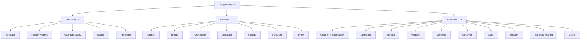
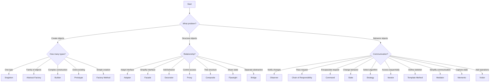

# Module 11: Design Patterns

## Overview
Design patterns are reusable solutions to common software design problems. This module covers all 23 Gang of Four (GoF) patterns with real-world examples.

## Learning Objectives
- Understand all GoF design patterns
- Apply creational patterns (5 patterns)
- Use structural patterns (7 patterns)
- Implement behavioral patterns (11 patterns)
- Choose appropriate patterns for specific problems

## Prerequisites
- OOP concepts
- Java fundamentals
- Problem-solving skills

---

## Pattern Categories

### Creational Patterns (5)
| Pattern | Purpose | Use Case |
|---------|---------|----------|
| Singleton | Single instance | Configuration, Logger |
| Factory Method | Create objects without specifying class | Shape creation, Payment processing |
| Abstract Factory | Create families of related objects | Cross-platform UI, Database drivers |
| Builder | Construct complex objects step by step | HTTP requests, SQL queries |
| Prototype | Clone existing objects | Copying complex objects |

### Structural Patterns (7)
| Pattern | Purpose | Use Case |
|---------|---------|----------|
| Adapter | Convert one interface to another | Legacy integration, Third-party APIs |
| Bridge | Separate abstraction from implementation | Cross-platform rendering, Database drivers |
| Composite | Treat individual objects uniformly | File systems, UI components |
| Decorator | Add behavior dynamically | I/O streams, Coffee shop |
| Facade | Simplify complex subsystems | Computer startup, Library API |
| Flyweight | Share common state | Text editors, Game objects |
| Proxy | Control access to object | Caching, Logging, Security |

### Behavioral Patterns (11)
| Pattern | Purpose | Use Case |
|---------|---------|----------|
| Chain of Responsibility | Pass request along chain | Support ticket handling, Middleware |
| Command | Encapsulate requests as objects | Undo/Redo, Task queues |
| Iterator | Access elements sequentially | Collections, Database results |
| Mediator | Centralize complex communications | Chat rooms, Air traffic control |
| Memento | Capture and restore state | Undo/Redo, Checkpoints |
| Observer | Notify dependents of changes | Event systems, Pub/Sub |
| State | Change behavior based on state | Order processing, Game states |
| Strategy | Define family of algorithms | Sorting, Payment methods |
| Template Method | Define algorithm skeleton | Data processing, Testing frameworks |
| Visitor | Add operations to objects | AST traversal, Report generation |

---

## Architecture Diagram

---

## Creational Patterns

### 1. Singleton Pattern
Ensures only one instance of a class exists.

**Flavors:**
- Eager initialization
- Lazy initialization
- Thread-safe (double-checked locking)
- Enum singleton
- Bill Pugh singleton

**When to use:**
- Configuration management
- Logging
- Connection pooling
- Cache

### 2. Factory Method Pattern
Defines interface for creating objects, lets subclasses decide which class to instantiate.

**Flavors:**
- Simple Factory
- Factory Method
- Parameterized Factory

**When to use:**
- When you don't know exact types at compile time
- Want to provide flexibility for extension
- Reduce coupling

### 3. Abstract Factory Pattern
Creates families of related objects without specifying concrete classes.

**Flavors:**
- Simple Abstract Factory
- Factory Registry

**When to use:**
- Cross-platform UI components
- Database driver families
- Theme systems

### 4. Builder Pattern
Separates construction of complex object from its representation.

**Flavors:**
- Step-by-step Builder
- Fluent Builder (Method chaining)
- Builder with validation
- Lombok @Builder

**When to use:**
- Complex object creation
- Many constructor parameters
- Immutable objects

### 5. Prototype Pattern
Creates new objects by cloning existing instances.

**Flavors:**
- Shallow clone
- Deep clone
- Clone with registry

**When to use:**
- Expensive object creation
- Avoiding subclasses
- Copying complex objects

---

## Structural Patterns

### 6. Adapter Pattern
Converts one interface to another expected by clients.

**Flavors:**
- Class adapter (inheritance)
- Object adapter (composition)
- Two-way adapter

**When to use:**
- Legacy system integration
- Third-party library adaptation
- Data format conversion

### 7. Bridge Pattern
Separates abstraction from implementation so both can vary independently.

**Flavors:**
- Simple Bridge
- Bridge with factory

**When to use:**
- Cross-platform rendering
- Multiple database drivers
- Platform-independent APIs

### 8. Composite Pattern
Composes objects into tree structures and treats individual objects uniformly.

**Flavors:**
- Safe composite (has add/remove methods)
- Unsafe composite (all components have add/remove)

**When to use:**
- File systems
- UI component trees
- Organization hierarchies

### 9. Decorator Pattern
Adds behavior to objects dynamically without modifying their structure.

**Flavors:**
- Simple Decorator
- Stackable Decorators
- Transparent Decorator

**When to use:**
- I/O streams
- Logging
- Coffee shop ordering
- Feature toggles

### 10. Facade Pattern
Provides simplified interface to complex subsystem.

**Flavors:**
- Simple Facade
- Facade with caching
- Abstract Facade

**When to use:**
- Simplifying complex libraries
- Legacy system wrapper
- Service layer

### 11. Flyweight Pattern
Minimizes memory usage by sharing common state.

**Flavors:**
- Simple Flyweight
- Flyweight with factory
- Composite Flyweight

**When to use:**
- Text editors (character formatting)
- Game objects (shared textures)
- String pool

### 12. Proxy Pattern
Provides surrogate or placeholder for another object to control access.

**Flavors:**
- Virtual proxy (lazy loading)
- Remote proxy (network access)
- Protection proxy (access control)
- Caching proxy
- Logging proxy

**When to use:**
- Lazy initialization
- Access control
- Logging and auditing
- Caching

---

## Behavioral Patterns

### 13. Chain of Responsibility
Passes request along chain until handled.

**Flavors:**
- Simple chain
- Graph-based chain
- Pipeline

**When to use:**
- Support ticket escalation
- Middleware processing
- Event bubbling

### 14. Command Pattern
Encapsulates requests as objects, enabling undo/redo.

**Flavors:**
- Simple Command
- Composite command
- Macro command
- Undoable command

**When to use:**
- Undo/Redo functionality
- Task queues
- Transaction processing

### 15. Iterator Pattern
Provides way to access elements sequentially without exposing representation.

**Flavors:**
- Simple iterator
- Filtering iterator
- Reverse iterator
- Tree iterator

**When to use:**
- Collection traversal
- Database result sets
- Custom data structures

### 16. Mediator Pattern
Defines simplified communication between objects.

**Flavors:**
- Mediator with registration
- Event-based mediator

**When to use:**
- Chat rooms
- Air traffic control
- UI form validation

### 17. Memento Pattern
Captures and externalizes object state for later restoration.

**Flavors:**
- Simple memento
- Multi-state memento
- Checkpoint memento

**When to use:**
- Undo/Redo
- Game saves
- Transaction rollbacks

### 18. Observer Pattern
Defines one-to-many dependency between objects.

**Flavors:**
- Pull observer
- Push observer
- Event bus

**When to use:**
- Event systems
- Pub/Sub messaging
- UI data binding

### 19. State Pattern
Allows object to change behavior when internal state changes.

**Flavors:**
- Simple state machine
- State with transitions
- State table

**When to use:**
- Order processing
- Game character states
- TCP connections

### 20. Strategy Pattern
Defines family of algorithms and makes them interchangeable.

**Flavors:**
- Simple strategy
- Strategy with factory
- Strategy with lambda

**When to use:**
- Sorting algorithms
- Payment methods
- Routing algorithms

### 21. Template Method Pattern
Defines algorithm skeleton with steps deferred to subclasses.

**Flavors:**
- Simple template
- Hook methods
- Method delegation

**When to use:**
- Data processing pipelines
- Testing frameworks
- Build processes

### 22. Visitor Pattern
Defines new operations on object structure without modifying classes.

**Flavors:**
- Simple visitor
- Acyclic visitor
- Reflective visitor

**When to use:**
- AST traversal
- Report generation
- Object structure operations

---

## Pattern Selection Guide

---

## Implementation Files

### Creational
- `singleton/SingletonExample.java` - Multiple singleton flavors
- `factory/FactoryExample.java` - Factory method with variants
- `abstractfactory/AbstractFactoryExample.java` - Cross-platform UI
- `builder/BuilderExample.java` - Fluent builder with validation
- `prototype/PrototypeExample.java` - Shallow and deep cloning

### Structural
- `adapter/AdapterExample.java` - Legacy and third-party adapters
- `bridge/BridgeExample.java` - Shape rendering across platforms
- `composite/CompositeExample.java` - File system hierarchy
- `decorator/DecoratorExample.java` - Coffee shop ordering
- `facade/FacadeExample.java` - Computer startup sequence
- `flyweight/FlyweightExample.java` - Tree rendering optimization
- `proxy/ProxyExample.java` - Caching and logging proxies

### Behavioral
- `chainofresponsibility/ChainOfResponsibilityExample.java` - Support escalation
- `command/CommandExample.java` - Text editor with undo/redo
- `iterator/IteratorExample.java` - Custom iterators (forward, reverse, filter)
- `mediator/MediatorExample.java` - Chat room implementation
- `memento/MementoExample.java` - Text editor with history
- `observer/ObserverExample.java` - Event notification system
- `state/StateExample.java` - Order processing states
- `strategy/StrategyExample.java` - Sorting algorithms
- `templatemethod/TemplateMethodExample.java` - Data processing pipeline
- `visitor/VisitorExample.java` - Shape area calculation and SVG export

---

## Performance Considerations

| Pattern | Time | Space | Thread Safety |
|---------|------|-------|---------------|
| Singleton | O(1) | O(1) | Needs sync |
| Factory | O(1) | O(1) | Can be safe |
| Builder | O(n) | O(fields) | Safe |
| Decorator | O(1) | O(decorators) | Depends |
| Proxy | O(1) | O(1) | Can be safe |
| Flyweight | O(1) | O(shared) | Safe |
| Composite | O(n) | O(n) | Depends |

---

## Best Practices

1. **Don't over-engineer** - Use patterns only when needed
2. **Keep it simple** - Prefer simpler solutions
3. **Document decisions** - Explain why pattern was chosen
4. **Consider trade-offs** - Each pattern has costs
5. **Refactor to pattern** - Don't start with patterns
6. **Test thoroughly** - Patterns should simplify testing
7. **Follow SOLID** - Patterns support SOLID principles

---

## Common Mistakes

1. Using Singleton when DI is better
2. Creating abstract factory when simple factory suffices
3. Overusing Decorator (deep nesting)
4. Implementing Observer without cleanup
5. Using Strategy when simple if/else works
6. Applying Template Method when composition is better
7. Over-engineering with Visitor for simple cases

---

## Interview Questions

### Creational
1. **Q: When would you use Singleton vs Dependency Injection?**
   A: Use DI for testability and flexibility. Singleton for truly global state like configuration.

2. **Q: What's the difference between Factory and Abstract Factory?**
   A: Factory creates one product type. Abstract Factory creates families of related products.

3. **Q: How do you implement thread-safe Singleton?**
   A: Enum singleton, double-checked locking, or Bill Pugh holder pattern.

### Structural
4. **Q: When would you use Adapter vs Facade?**
   A: Adapter converts interface. Facade simplifies complex subsystem.

5. **Q: What's the difference between Decorator and Proxy?**
   A: Decorator adds behavior. Proxy controls access.

6. **Q: When would you use Composite pattern?**
   A: When you need to treat individual objects and compositions uniformly (tree structures).

### Behavioral
7. **Q: When would you use Observer vs Mediator?**
   A: Observer for broadcast notifications. Mediator for centralizing communication.

8. **Q: What's the difference between Strategy and State?**
   A: Strategy changes algorithm. State changes behavior based on internal state.

9. **Q: How do you implement undo/redo?**
   A: Command pattern with Memento for state capture.

---

## References

- Design Patterns: Elements of Reusable Object-Oriented Software (GoF)
- Head First Design Patterns
- Refactoring to Patterns
- Effective Java (Joshua Bloch)
- Pattern-Oriented Software Architecture
