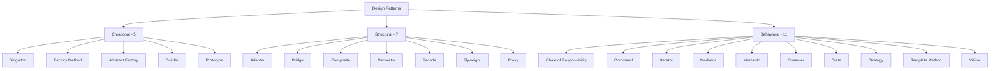
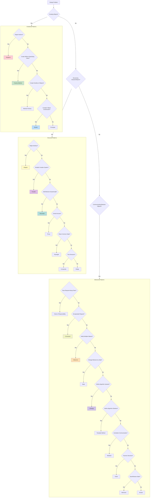

# Module 11: Design Patterns

> **Difficulty:** ⭐⭐⭐ Intermediate  
> **Reading:** 30 min | **Practice:** 60 min | **Total:** 90 min

## Overview
Design patterns are reusable solutions to common software design problems. This module covers all 23 Gang of Four (GoF) patterns with real-world examples.

## Learning Objectives
- Understand all GoF design patterns
- Apply creational patterns (5 patterns)
- Use structural patterns (7 patterns)
- Implement behavioral patterns (11 patterns)
- Choose appropriate patterns for specific problems

## Prerequisites
- OOP concepts
- Java fundamentals
- Problem-solving skills

---

## Pattern Categories

### Creational Patterns (5)
| Pattern | Purpose | Use Case |
|---------|---------|----------|
| Singleton | Single instance | Configuration, Logger |
| Factory Method | Create objects without specifying class | Shape creation, Payment processing |
| Abstract Factory | Create families of related objects | Cross-platform UI, Database drivers |
| Builder | Construct complex objects step by step | HTTP requests, SQL queries |
| Prototype | Clone existing objects | Copying complex objects |

### Structural Patterns (7)
| Pattern | Purpose | Use Case |
|---------|---------|----------|
| Adapter | Convert one interface to another | Legacy integration, Third-party APIs |
| Bridge | Separate abstraction from implementation | Cross-platform rendering, Database drivers |
| Composite | Treat individual objects uniformly | File systems, UI components |
| Decorator | Add behavior dynamically | I/O streams, Coffee shop |
| Facade | Simplify complex subsystems | Computer startup, Library API |
| Flyweight | Share common state | Text editors, Game objects |
| Proxy | Control access to object | Caching, Logging, Security |

### Behavioral Patterns (11)
| Pattern | Purpose | Use Case |
|---------|---------|----------|
| Chain of Responsibility | Pass request along chain | Support ticket handling, Middleware |
| Command | Encapsulate requests as objects | Undo/Redo, Task queues |
| Iterator | Access elements sequentially | Collections, Database results |
| Mediator | Centralize complex communications | Chat rooms, Air traffic control |
| Memento | Capture and restore state | Undo/Redo, Checkpoints |
| Observer | Notify dependents of changes | Event systems, Pub/Sub |
| State | Change behavior based on state | Order processing, Game states |
| Strategy | Define family of algorithms | Sorting, Payment methods |
| Template Method | Define algorithm skeleton | Data processing, Testing frameworks |
| Visitor | Add operations to objects | AST traversal, Report generation |

---

## Architecture Diagram



---

## Creational Patterns

### 1. Singleton Pattern
Ensures only one instance of a class exists.

**Flavors:**
- Eager initialization
- Lazy initialization
- Thread-safe (double-checked locking)
- Enum singleton
- Bill Pugh singleton

**When to use:**
- Configuration management
- Logging
- Connection pooling
- Cache

### 2. Factory Method Pattern
Defines interface for creating objects, lets subclasses decide which class to instantiate.

**Flavors:**
- Simple Factory
- Factory Method
- Parameterized Factory

**When to use:**
- When you don't know exact types at compile time
- Want to provide flexibility for extension
- Reduce coupling

### 3. Abstract Factory Pattern
Creates families of related objects without specifying concrete classes.

**Flavors:**
- Simple Abstract Factory
- Factory Registry

**When to use:**
- Cross-platform UI components
- Database driver families
- Theme systems

### 4. Builder Pattern
Separates construction of complex object from its representation.

**Flavors:**
- Step-by-step Builder
- Fluent Builder (Method chaining)
- Builder with validation
- Lombok @Builder

**When to use:**
- Complex object creation
- Many constructor parameters
- Immutable objects

### 5. Prototype Pattern
Creates new objects by cloning existing instances.

**Flavors:**
- Shallow clone
- Deep clone
- Clone with registry

**When to use:**
- Expensive object creation
- Avoiding subclasses
- Copying complex objects

---

## Structural Patterns

### 6. Adapter Pattern
Converts one interface to another expected by clients.

**Flavors:**
- Class adapter (inheritance)
- Object adapter (composition)
- Two-way adapter

**When to use:**
- Legacy system integration
- Third-party library adaptation
- Data format conversion

### 7. Bridge Pattern
Separates abstraction from implementation so both can vary independently.

**Flavors:**
- Simple Bridge
- Bridge with factory

**When to use:**
- Cross-platform rendering
- Multiple database drivers
- Platform-independent APIs

### 8. Composite Pattern
Composes objects into tree structures and treats individual objects uniformly.

**Flavors:**
- Safe composite (has add/remove methods)
- Unsafe composite (all components have add/remove)

**When to use:**
- File systems
- UI component trees
- Organization hierarchies

### 9. Decorator Pattern
Adds behavior to objects dynamically without modifying their structure.

**Flavors:**
- Simple Decorator
- Stackable Decorators
- Transparent Decorator

**When to use:**
- I/O streams
- Logging
- Coffee shop ordering
- Feature toggles

### 10. Facade Pattern
Provides simplified interface to complex subsystem.

**Flavors:**
- Simple Facade
- Facade with caching
- Abstract Facade

**When to use:**
- Simplifying complex libraries
- Legacy system wrapper
- Service layer

### 11. Flyweight Pattern
Minimizes memory usage by sharing common state.

**Flavors:**
- Simple Flyweight
- Flyweight with factory
- Composite Flyweight

**When to use:**
- Text editors (character formatting)
- Game objects (shared textures)
- String pool

### 12. Proxy Pattern
Provides surrogate or placeholder for another object to control access.

**Flavors:**
- Virtual proxy (lazy loading)
- Remote proxy (network access)
- Protection proxy (access control)
- Caching proxy
- Logging proxy

**When to use:**
- Lazy initialization
- Access control
- Logging and auditing
- Caching

---

## Behavioral Patterns

### 13. Chain of Responsibility
Passes request along chain until handled.

**Flavors:**
- Simple chain
- Graph-based chain
- Pipeline

**When to use:**
- Support ticket escalation
- Middleware processing
- Event bubbling

### 14. Command Pattern
Encapsulates requests as objects, enabling undo/redo.

**Flavors:**
- Simple Command
- Composite command
- Macro command
- Undoable command

**When to use:**
- Undo/Redo functionality
- Task queues
- Transaction processing

### 15. Iterator Pattern
Provides way to access elements sequentially without exposing representation.

**Flavors:**
- Simple iterator
- Filtering iterator
- Reverse iterator
- Tree iterator

**When to use:**
- Collection traversal
- Database result sets
- Custom data structures

### 16. Mediator Pattern
Defines simplified communication between objects.

**Flavors:**
- Mediator with registration
- Event-based mediator

**When to use:**
- Chat rooms
- Air traffic control
- UI form validation

### 17. Memento Pattern
Captures and externalizes object state for later restoration.

**Flavors:**
- Simple memento
- Multi-state memento
- Checkpoint memento

**When to use:**
- Undo/Redo
- Game saves
- Transaction rollbacks

### 18. Observer Pattern
Defines one-to-many dependency between objects.

**Flavors:**
- Pull observer
- Push observer
- Event bus

**When to use:**
- Event systems
- Pub/Sub messaging
- UI data binding

### 19. State Pattern
Allows object to change behavior when internal state changes.

**Flavors:**
- Simple state machine
- State with transitions
- State table

**When to use:**
- Order processing
- Game character states
- TCP connections

### 20. Strategy Pattern
Defines family of algorithms and makes them interchangeable.

**Flavors:**
- Simple strategy
- Strategy with factory
- Strategy with lambda

**When to use:**
- Sorting algorithms
- Payment methods
- Routing algorithms

### 21. Template Method Pattern
Defines algorithm skeleton with steps deferred to subclasses.

**Flavors:**
- Simple template
- Hook methods
- Method delegation

**When to use:**
- Data processing pipelines
- Testing frameworks
- Build processes

### 22. Visitor Pattern
Defines new operations on object structure without modifying classes.

**Flavors:**
- Simple visitor
- Acyclic visitor
- Reflective visitor

**When to use:**
- AST traversal
- Report generation
- Object structure operations

---

## Pattern Selection Guide



---

**Continue to Part 2**: README-part2.md

## Interview Questions

1. **What is the Singleton pattern and when would you use it?**
   Singleton ensures only one instance exists. Use for configuration, logging, connection pools. Be careful with testing and thread safety. Prefer dependency injection over Singleton in modern applications.

2. **When would you use Factory Method vs Abstract Factory?**
   Factory Method creates one product via subclassing. Abstract Factory creates families of related objects. Use Factory Method when you need one product; Abstract Factory when you need a cohesive set (e.g., cross-platform UI components).

3. **What are the alternatives to the Builder pattern?**
   Lombok `@Builder`, telescoping constructors, records (for immutable objects), factory methods, and the step builder pattern. Records reduce Builder need for simple DTOs.

4. **What are common mistakes with design patterns?**
   Over-engineering (using patterns when simple code suffices), forcing wrong pattern, not following SOLID principles, creating God classes, and tight coupling through pattern misuse.

5. **How does the Strategy pattern differ from polymorphism?**
   Strategy uses composition and delegates behavior to interchangeable objects. Polymorphism uses inheritance. Strategy is more flexible — you can change behavior at runtime and combine behaviors.

6. **When should you NOT use the Observer pattern?**
   When you need synchronous guaranteed delivery, when order matters strictly, or when overused causing cascading updates that are hard to debug. Consider event sourcing or reactive streams instead.

7. **What is the difference between Adapter and Facade?**
   Adapter converts one interface to another (works with existing interfaces). Facade provides a simplified interface to a complex subsystem (defines its own simplified interface).

8. **How do you decide which pattern to use for a design problem?**
   Identify the problem category (creational, structural, behavioral), consider the specific constraints (thread safety, performance, extensibility), evaluate trade-offs, and start with the simplest solution that works.

9. **What are anti-patterns in the context of design patterns?**
   Golden Hammer (overusing one pattern), Abstract Leak (abstraction exposes details), Singleton abuse (global state), God Object (one class doing too much), and Analysis Paralysis (over-designing before coding).

10. **How do design patterns relate to SOLID principles?**
    Each pattern embodies specific SOLID principles: Strategy follows OCP (open/closed), Facade follows ISP (interface segregation), Factory follows SRP (single responsibility), Decorator follows OCP.

## Pitfalls

- **Over-engineering**: Using design patterns for simple problems adds unnecessary complexity. A simple if-else is sometimes better than a Strategy pattern.
- **Wrong pattern choice**: Using Singleton when you need testability, or Observer when you need guaranteed delivery.
- **God classes**: Combining too many patterns in one class, violating SRP.
- **Tight coupling through Singleton**: Global state makes unit testing difficult. Prefer dependency injection.
- **Ignoring thread safety**: Many patterns (Singleton, Observer) need explicit thread safety handling.
- **Premature abstraction**: Abstracting too early leads to wrong abstractions that are costly to change.
- **Pattern soup**: Applying every known pattern to a simple problem, making code harder to understand.
- **Not considering evolution**: Patterns chosen for today's requirements may not fit tomorrow's needs.

## Performance

| Pattern | Performance Impact | Notes |
|---------|-------------------|-------|
| Singleton | O(1) access | Thread safety adds synchronization cost |
| Factory Method | O(1) | Minimal overhead, creates objects |
| Builder | O(n) fields | Slight overhead for immutability |
| Proxy | O(1) per call | Adds indirection; caching proxy improves performance |
| Flyweight | Memory savings | Significant for large numbers of shared objects |
| Observer | O(n) notification | Linear in number of observers; can cause cascading updates |
| Strategy | O(1) | Composition overhead is negligible |
| Decorator | O(1) per layer | Stack depth adds indirection |
| Composite | O(n) traversal | Depends on tree depth and branching factor |

**Key insights:**
- Most patterns add minimal runtime overhead
- Flyweight and Object Pool patterns can significantly reduce memory/GC pressure
- Observer pattern can cause performance issues with many subscribers
- Proxy pattern can improve performance when combined with caching
- Benchmark before optimizing — pattern overhead is usually negligible

## Examples

```java
// Strategy Pattern — interchangeable algorithms
interface SortStrategy {
    void sort(int[] array);
}
class BubbleSort implements SortStrategy {
    public void sort(int[] array) { /* O(n^2) */ }
}
class QuickSort implements SortStrategy {
    public void sort(int[] array) { /* O(n log n) avg */ }
}
class Sorter {
    private SortStrategy strategy;
    public Sorter(SortStrategy strategy) { this.strategy = strategy; }
    public void sort(int[] array) { strategy.sort(array); }
}

// Observer Pattern — event notification
interface EventListener {
    void onEvent(String event);
}
class EventBus {
    private final List<EventListener> listeners = new ArrayList<>();
    public void subscribe(EventListener l) { listeners.add(l); }
    public void publish(String event) {
        listeners.forEach(l -> l.onEvent(event));
    }
}

// Decorator Pattern — add behavior dynamically
interface DataSource {
    void writeData(String data);
    String readData();
}
class FileDataSource implements DataSource {
    private String filename;
    public FileDataSource(String f) { this.filename = f; }
    public void writeData(String data) { /* write to file */ }
    public String readData() { return ""; /* read from file */ }
}
class EncryptionDecorator implements DataSource {
    private DataSource wrapped;
    public EncryptionDecorator(DataSource source) { this.wrapped = source; }
    public void writeData(String data) {
        String encrypted = encrypt(data);
        wrapped.writeData(encrypted);
    }
    public String readData() {
        String data = wrapped.readData();
        return decrypt(data);
    }
    private String encrypt(String s) { return s; /* encrypt */ }
    private String decrypt(String s) { return s; /* decrypt */ }
}
```

## Internal Working

**How patterns work under the hood:**

- **Singleton**: Uses class loading guarantees and volatile + double-checked locking (or enum) to ensure single instance. JVM class loader ensures one instance per classloader.
- **Factory Method**: Relies on dynamic dispatch — the JVM calls the appropriate subclass implementation at runtime via virtual method invocation.
- **Strategy**: Uses composition and interface polymorphism. The context holds a reference to a strategy interface; actual implementation is resolved at runtime.
- **Observer**: Maintains a list of registered listeners. When state changes, iterates through listeners. The subject holds references to observer interfaces.
- **Decorator**: Wraps objects implementing the same interface. Each decorator delegates to the wrapped object, adding behavior before/after.
- **Proxy**: Creates a surrogate class (often via java.lang.reflect.Proxy or cglib) that implements the same interface, intercepting method calls.
- **Composite**: Defines a tree structure where leaf and composite nodes implement the same interface. Operations are applied recursively.

## Why This Concept Exists

Design patterns exist because software developers repeatedly encounter the same design problems across different projects. Instead of reinventing solutions, patterns provide:

1. **Proven solutions** — Battle-tested approaches that handle edge cases and known pitfalls
2. **Common vocabulary** — A shared language for developers to communicate design decisions efficiently
3. **Best practices** — Encapsulated wisdom about handling extensibility, flexibility, and maintainability
4. **Reduced complexity** — Frameworks and libraries use patterns internally; understanding them helps understand the ecosystem
5. **Design principles** — Patterns embody SOLID, DRY, and other principles in practical, applicable forms

Without patterns, every team would solve the same problems differently, making codebases harder to maintain and onboard new developers.

## References

- [Design Patterns: Elements of Reusable Object-Oriented Software (GoF)](https://www.amazon.com/Design-Patterns-Elements-Reusable-Object-Oriented/dp/0201633612)
- [Head First Design Patterns](https://www.amazon.com/First-Design-Patterns-Brain-Friendly/dp/0596007124)
- [Refactoring.Guru — Design Patterns](https://refactoring.guru/design-patterns)
- [SourceMaking — Design Patterns](https://sourcemaking.com/design_patterns)
- [Java Design Patterns — GitHub](https://github.com/iluwatar/java-design-patterns)

## Cross-References

- **Previous Module:** [10 - JVM Internals](../10-jvm-internals/)

## Prerequisites

- [OOP](../02-oop/README.md)

## Related Topics

- [Senior](../15-senior/README.md)

## Next

- [Testing](../12-testing/README.md)
- [Senior](../15-senior/README.md)

## One-Minute Revision

| Aspect | Value |
|--------|-------|
| Purpose | Reusable solutions to common problems |
| Complexity | Varies |
| Thread Safe | Varies |
| Ordered | N/A |
| Allows Null | Varies |
| Best Alternative | Simple code (for simple cases) |
| When to Use | Common problems |
| When to Avoid | Over-engineering |
