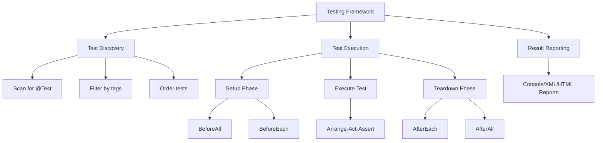

# 11.1 Testing Fundamentals

## 1. Introduction

Testing is a critical practice in software engineering that ensures code correctness, reliability, and maintainability. This module covers the core principles of testing, the test pyramid, and the AAA (Arrange-Act-Assert) pattern that forms the foundation of all testing strategies.

## 2. Learning Objectives

- Understand the purpose and importance of software testing
- Learn the test pyramid and its layers
- Master the AAA (Arrange-Act-Assert) pattern
- Identify different types of tests (unit, integration, end-to-end)
- Understand test-driven principles

## 3. Prerequisites

- Basic Java knowledge
- Understanding of object-oriented programming
- Familiarity with build tools (Maven/Gradle)

## 4. Why This Concept Exists

Software bugs cost significantly more to fix the later they are discovered. Testing provides a safety net that catches bugs early, enables confident refactoring, and serves as living documentation of expected behavior. Without testing, codebases become fragile and difficult to maintain.

## 5. Problem Statement

How do we ensure that code works correctly, continues to work after changes, and behaves as expected in different scenarios? How do we balance thorough testing with development velocity?

## 6. Theory

### Testing Principles

1. **Testing shows presence of defects, not absence** - Testing can prove bugs exist, not that the software is bug-free
2. **Exhaustive testing is impossible** - We can't test every input; we must use risk-based approaches
3. **Early testing saves time and money** - Finding bugs in requirements is cheaper than in production
4. **Defects cluster together** - A small number of modules usually contain most defects
5. **The pesticide paradox** - Repeated tests stop finding new bugs; tests must be regularly reviewed
6. **Testing is context-dependent** - Different software types require different testing approaches
7. **Absence-of-errors fallacy** - Finding and fixing defects is useless if the system doesn't meet requirements

### Test Pyramid

```
         /\
        /  \  E2E Tests (few, slow, expensive)
       /    \
      /------\
     /        \ Integration Tests (moderate)
    /----------\
   /            \ Unit Tests (many, fast, cheap)
  /--------------\
```

- **Unit Tests**: Test individual components in isolation (70%)
- **Integration Tests**: Test how components work together (20%)
- **End-to-End Tests**: Test complete user workflows (10%)

### AAA Pattern

- **Arrange**: Set up the test conditions and data
- **Act**: Execute the behavior being tested
- **Assert**: Verify the expected outcome

## 7. Internal Working

When a test executes:
1. Test framework discovers test methods via reflection
2. For each test, a new test instance is created
3. Setup methods run (before each, before all)
4. The test method executes with AAA pattern
5. Assertions evaluate conditions and throw exceptions on failure
6. Teardown methods run (after each, after all)
7. Results are collected and reported

## 8. JVM Perspective

- Tests run in the same JVM as production code
- Test classes are loaded by the same classloader
- No additional overhead for test execution beyond framework bootstrapping
- Memory is shared between test and production code during execution
- Garbage collection operates normally during test runs

## 9. Memory Representation

```
JVM Memory During Test Execution:
┌─────────────────────────────┐
│        Method Area          │
│  - Test class bytecode      │
│  - Production class bytecode│
│  - Framework classes        │
├─────────────────────────────┤
│         Heap Memory         │
│  - Test instance objects    │
│  - Production objects       │
│  - Mock objects (if any)    │
├─────────────────────────────┤
│        Stack Memory         │
│  - Test method frames       │
│  - Assertion calls          │
│  - Exception handling       │
└─────────────────────────────┘
```

## 10. Architecture Diagram



## 11. Flow Diagram


## 12. Syntax

```java
// Basic test structure
@Test
void shouldDoSomething() {
    // Arrange
    Calculator calculator = new Calculator();
    
    // Act
    int result = calculator.add(2, 3);
    
    // Assert
    assertEquals(5, result);
}

// Test with setup
@BeforeEach
void setUp() {
    // Runs before each test
}

@AfterEach
void tearDown() {
    // Runs after each test
}

@BeforeAll
static void initAll() {
    // Runs once before all tests
}

@AfterAll
static void cleanupAll() {
    // Runs once after all tests
}
```

## 13. Easy Example

```java
import org.junit.jupiter.api.Test;
import static org.junit.jupiter.api.Assertions.*;

class CalculatorTest {
    
    @Test
    void shouldAddTwoNumbers() {
        // Arrange
        int a = 5;
        int b = 3;
        
        // Act
        int result = a + b;
        
        // Assert
        assertEquals(8, result);
    }
    
    @Test
    void shouldSubtractTwoNumbers() {
        // Arrange
        int a = 10;
        int b = 4;
        
        // Act
        int result = a - b;
        
        // Assert
        assertEquals(6, result);
    }
}
```

## 14. Medium Example

```java
import org.junit.jupiter.api.BeforeEach;
import org.junit.jupiter.api.Test;
import static org.junit.jupiter.api.Assertions.*;

class BankAccountTest {
    
    private BankAccount account;
    
    @BeforeEach
    void setUp() {
        account = new BankAccount("John", 1000.0);
    }
    
    @Test
    void shouldDepositMoney() {
        // Arrange
        double depositAmount = 500.0;
        
        // Act
        account.deposit(depositAmount);
        
        // Assert
        assertEquals(1500.0, account.getBalance(), 0.001);
    }
    
    @Test
    void shouldWithdrawMoney() {
        // Arrange
        double withdrawAmount = 300.0;
        
        // Act
        account.withdraw(withdrawAmount);
        
        // Assert
        assertEquals(700.0, account.getBalance(), 0.001);
    }
    
    @Test
    void shouldNotWithdrawMoreThanBalance() {
        // Arrange
        double withdrawAmount = 2000.0;
        
        // Act & Assert
        assertThrows(InsufficientFundsException.class, 
            () -> account.withdraw(withdrawAmount));
    }
}
```

## 15. Hard Example

```java
import org.junit.jupiter.api.BeforeEach;
import org.junit.jupiter.api.Test;
import org.junit.jupiter.api.DisplayName;
import org.junit.jupiter.api.Nested;
import java.util.List;
import static org.junit.jupiter.api.Assertions.*;

class ShoppingCartTest {
    
    private ShoppingCart cart;
    
    @BeforeEach
    void setUp() {
        cart = new ShoppingCart();
    }
    
    @Nested
    @DisplayName("When cart is empty")
    class EmptyCartTests {
        
        @Test
        @DisplayName("should have zero items")
        void shouldHaveZeroItems() {
            assertEquals(0, cart.getItemCount());
        }
        
        @Test
        @DisplayName("should have zero total")
        void shouldHaveZeroTotal() {
            assertEquals(0.0, cart.getTotal(), 0.001);
        }
    }
    
    @Nested
    @DisplayName("When adding items")
    class AddingItemsTests {
        
        @BeforeEach
        void addItem() {
            cart.addItem(new Product("Laptop", 999.99), 1);
        }
        
        @Test
        @DisplayName("should increase item count")
        void shouldIncreaseItemCount() {
            // Act
            cart.addItem(new Product("Mouse", 29.99), 2);
            
            // Assert
            assertEquals(3, cart.getItemCount());
        }
        
        @Test
        @DisplayName("should calculate correct total")
        void shouldCalculateCorrectTotal() {
            // Act
            cart.addItem(new Product("Mouse", 29.99), 2);
            
            // Assert
            double expected = 999.99 + (29.99 * 2);
            assertEquals(expected, cart.getTotal(), 0.001);
        }
        
        @Test
        @DisplayName("should handle null product")
        void shouldHandleNullProduct() {
            // Act & Assert
            assertThrows(IllegalArgumentException.class,
                () -> cart.addItem(null, 1));
        }
    }
    
    @Nested
    @DisplayName("When removing items")
    class RemovingItemsTests {
        
        @BeforeEach
        void setupCart() {
            cart.addItem(new Product("Laptop", 999.99), 1);
            cart.addItem(new Product("Mouse", 29.99), 2);
        }
        
        @Test
        @DisplayName("should decrease item count")
        void shouldDecreaseItemCount() {
            // Act
            cart.removeItem("Mouse");
            
            // Assert
            assertEquals(1, cart.getItemCount());
        }
        
        @Test
        @DisplayName("should handle removing non-existent item")
        void shouldHandleRemovingNonExistentItem() {
            // Act
            cart.removeItem("Keyboard");
            
            // Assert
            assertEquals(2, cart.getItemCount());
        }
    }
}
```

## 16. Enterprise Example

```java
import org.junit.jupiter.api.BeforeEach;
import org.junit.jupiter.api.Test;
import org.junit.jupiter.api.extension.ExtendWith;
import org.mockito.Mock;
import org.mockito.junit.jupiter.MockitoExtension;
import java.util.Optional;
import static org.junit.jupiter.api.Assertions.*;
import static org.mockito.Mockito.*;

@ExtendWith(MockitoExtension.class)
class OrderServiceTest {
    
    @Mock


---

**Continue to Part 2**: [README-part2.md](README-part2.md)