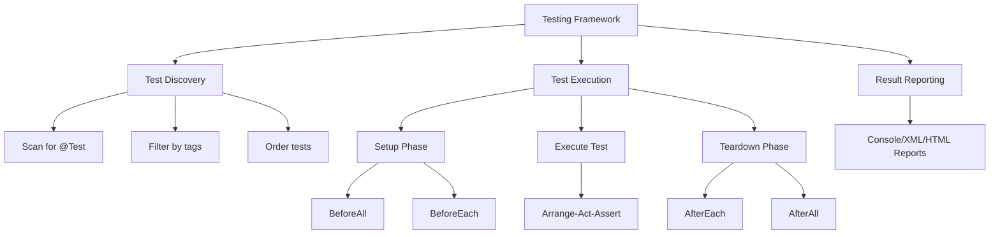
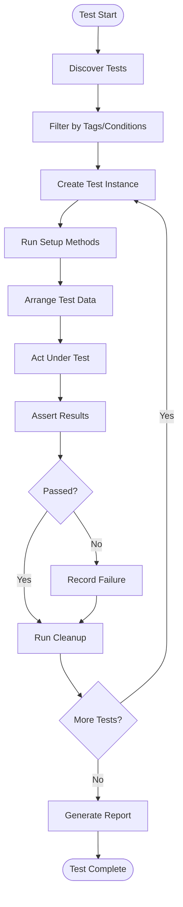

# 11.1 Testing Fundamentals

## 1. Introduction

Testing is a critical practice in software engineering that ensures code correctness, reliability, and maintainability. This module covers the core principles of testing, the test pyramid, and the AAA (Arrange-Act-Assert) pattern that forms the foundation of all testing strategies.

## 2. Learning Objectives

- Understand the purpose and importance of software testing
- Learn the test pyramid and its layers
- Master the AAA (Arrange-Act-Assert) pattern
- Identify different types of tests (unit, integration, end-to-end)
- Understand test-driven principles

## 3. Prerequisites

- Basic Java knowledge
- Understanding of object-oriented programming
- Familiarity with build tools (Maven/Gradle)

## 4. Why This Concept Exists

Software bugs cost significantly more to fix the later they are discovered. Testing provides a safety net that catches bugs early, enables confident refactoring, and serves as living documentation of expected behavior. Without testing, codebases become fragile and difficult to maintain.

## 5. Problem Statement

How do we ensure that code works correctly, continues to work after changes, and behaves as expected in different scenarios? How do we balance thorough testing with development velocity?

## 6. Theory

### Testing Principles

1. **Testing shows presence of defects, not absence** - Testing can prove bugs exist, not that the software is bug-free
2. **Exhaustive testing is impossible** - We can't test every input; we must use risk-based approaches
3. **Early testing saves time and money** - Finding bugs in requirements is cheaper than in production
4. **Defects cluster together** - A small number of modules usually contain most defects
5. **The pesticide paradox** - Repeated tests stop finding new bugs; tests must be regularly reviewed
6. **Testing is context-dependent** - Different software types require different testing approaches
7. **Absence-of-errors fallacy** - Finding and fixing defects is useless if the system doesn't meet requirements

### Test Pyramid

```
         /\
        /  \  E2E Tests (few, slow, expensive)
       /    \
      /------\
     /        \ Integration Tests (moderate)
    /----------\
   /            \ Unit Tests (many, fast, cheap)
  /--------------\
```

- **Unit Tests**: Test individual components in isolation (70%)
- **Integration Tests**: Test how components work together (20%)
- **End-to-End Tests**: Test complete user workflows (10%)

### AAA Pattern

- **Arrange**: Set up the test conditions and data
- **Act**: Execute the behavior being tested
- **Assert**: Verify the expected outcome

## 7. Internal Working

When a test executes:
1. Test framework discovers test methods via reflection
2. For each test, a new test instance is created
3. Setup methods run (before each, before all)
4. The test method executes with AAA pattern
5. Assertions evaluate conditions and throw exceptions on failure
6. Teardown methods run (after each, after all)
7. Results are collected and reported

## 8. JVM Perspective

- Tests run in the same JVM as production code
- Test classes are loaded by the same classloader
- No additional overhead for test execution beyond framework bootstrapping
- Memory is shared between test and production code during execution
- Garbage collection operates normally during test runs

## 9. Memory Representation

```
JVM Memory During Test Execution:
┌─────────────────────────────┐
│        Method Area          │
│  - Test class bytecode      │
│  - Production class bytecode│
│  - Framework classes        │
├─────────────────────────────┤
│         Heap Memory         │
│  - Test instance objects    │
│  - Production objects       │
│  - Mock objects (if any)    │
├─────────────────────────────┤
│        Stack Memory         │
│  - Test method frames       │
│  - Assertion calls          │
│  - Exception handling       │
└─────────────────────────────┘
```

## 10. Architecture Diagram



## 11. Flow Diagram



## 12. Syntax

```java
// Basic test structure
@Test
void shouldDoSomething() {
    // Arrange
    Calculator calculator = new Calculator();
    
    // Act
    int result = calculator.add(2, 3);
    
    // Assert
    assertEquals(5, result);
}

// Test with setup
@BeforeEach
void setUp() {
    // Runs before each test
}

@AfterEach
void tearDown() {
    // Runs after each test
}

@BeforeAll
static void initAll() {
    // Runs once before all tests
}

@AfterAll
static void cleanupAll() {
    // Runs once after all tests
}
```

## 13. Easy Example

```java
import org.junit.jupiter.api.Test;
import static org.junit.jupiter.api.Assertions.*;

class CalculatorTest {
    
    @Test
    void shouldAddTwoNumbers() {
        // Arrange
        int a = 5;
        int b = 3;
        
        // Act
        int result = a + b;
        
        // Assert
        assertEquals(8, result);
    }
    
    @Test
    void shouldSubtractTwoNumbers() {
        // Arrange
        int a = 10;
        int b = 4;
        
        // Act
        int result = a - b;
        
        // Assert
        assertEquals(6, result);
    }
}
```

## 14. Medium Example

```java
import org.junit.jupiter.api.BeforeEach;
import org.junit.jupiter.api.Test;
import static org.junit.jupiter.api.Assertions.*;

class BankAccountTest {
    
    private BankAccount account;
    
    @BeforeEach
    void setUp() {
        account = new BankAccount("John", 1000.0);
    }
    
    @Test
    void shouldDepositMoney() {
        // Arrange
        double depositAmount = 500.0;
        
        // Act
        account.deposit(depositAmount);
        
        // Assert
        assertEquals(1500.0, account.getBalance(), 0.001);
    }
    
    @Test
    void shouldWithdrawMoney() {
        // Arrange
        double withdrawAmount = 300.0;
        
        // Act
        account.withdraw(withdrawAmount);
        
        // Assert
        assertEquals(700.0, account.getBalance(), 0.001);
    }
    
    @Test
    void shouldNotWithdrawMoreThanBalance() {
        // Arrange
        double withdrawAmount = 2000.0;
        
        // Act & Assert
        assertThrows(InsufficientFundsException.class, 
            () -> account.withdraw(withdrawAmount));
    }
}
```

## 15. Hard Example

```java
import org.junit.jupiter.api.BeforeEach;
import org.junit.jupiter.api.Test;
import org.junit.jupiter.api.DisplayName;
import org.junit.jupiter.api.Nested;
import java.util.List;
import static org.junit.jupiter.api.Assertions.*;

class ShoppingCartTest {
    
    private ShoppingCart cart;
    
    @BeforeEach
    void setUp() {
        cart = new ShoppingCart();
    }
    
    @Nested
    @DisplayName("When cart is empty")
    class EmptyCartTests {
        
        @Test
        @DisplayName("should have zero items")
        void shouldHaveZeroItems() {
            assertEquals(0, cart.getItemCount());
        }
        
        @Test
        @DisplayName("should have zero total")
        void shouldHaveZeroTotal() {
            assertEquals(0.0, cart.getTotal(), 0.001);
        }
    }
    
    @Nested
    @DisplayName("When adding items")
    class AddingItemsTests {
        
        @BeforeEach
        void addItem() {
            cart.addItem(new Product("Laptop", 999.99), 1);
        }
        
        @Test
        @DisplayName("should increase item count")
        void shouldIncreaseItemCount() {
            // Act
            cart.addItem(new Product("Mouse", 29.99), 2);
            
            // Assert
            assertEquals(3, cart.getItemCount());
        }
        
        @Test
        @DisplayName("should calculate correct total")
        void shouldCalculateCorrectTotal() {
            // Act
            cart.addItem(new Product("Mouse", 29.99), 2);
            
            // Assert
            double expected = 999.99 + (29.99 * 2);
            assertEquals(expected, cart.getTotal(), 0.001);
        }
        
        @Test
        @DisplayName("should handle null product")
        void shouldHandleNullProduct() {
            // Act & Assert
            assertThrows(IllegalArgumentException.class,
                () -> cart.addItem(null, 1));
        }
    }
    
    @Nested
    @DisplayName("When removing items")
    class RemovingItemsTests {
        
        @BeforeEach
        void setupCart() {
            cart.addItem(new Product("Laptop", 999.99), 1);
            cart.addItem(new Product("Mouse", 29.99), 2);
        }
        
        @Test
        @DisplayName("should decrease item count")
        void shouldDecreaseItemCount() {
            // Act
            cart.removeItem("Mouse");
            
            // Assert
            assertEquals(1, cart.getItemCount());
        }
        
        @Test
        @DisplayName("should handle removing non-existent item")
        void shouldHandleRemovingNonExistentItem() {
            // Act
            cart.removeItem("Keyboard");
            
            // Assert
            assertEquals(2, cart.getItemCount());
        }
    }
}
```

## 16. Enterprise Example

```java
import org.junit.jupiter.api.BeforeEach;
import org.junit.jupiter.api.Test;
import org.junit.jupiter.api.extension.ExtendWith;
import org.mockito.Mock;
import org.mockito.junit.jupiter.MockitoExtension;
import java.util.Optional;
import static org.junit.jupiter.api.Assertions.*;
import static org.mockito.Mockito.*;

@ExtendWith(MockitoExtension.class)
class OrderServiceTest {
    
    @Mock
    private OrderRepository orderRepository;
    
    @Mock
    private PaymentService paymentService;
    
    @Mock
    private NotificationService notificationService;
    
    private OrderService orderService;
    
    @BeforeEach
    void setUp() {
        orderService = new OrderService(orderRepository, paymentService, notificationService);
    }
    
    @Test
    void shouldProcessOrderSuccessfully() {
        // Arrange
        OrderRequest request = new OrderRequest("customer-123", List.of(
            new OrderItem("PRODUCT-1", 2, 29.99)
        ));
        when(orderRepository.save(any(Order.class))).thenReturn(new Order("ORDER-1", OrderStatus.CREATED));
        when(paymentService.processPayment(any(PaymentRequest.class))).thenReturn(new PaymentResult(true, "PAY-123"));
        
        // Act
        OrderResponse response = orderService.processOrder(request);
        
        // Assert
        assertNotNull(response);
        assertEquals("ORDER-1", response.getOrderId());
        assertEquals(OrderStatus.PROCESSED, response.getStatus());
        
        verify(orderRepository, times(1)).save(any(Order.class));
        verify(paymentService, times(1)).processPayment(any(PaymentRequest.class));
        verify(notificationService, times(1)).sendOrderConfirmation(eq("ORDER-1"), eq("customer-123"));
    }
    
    @Test
    void shouldFailOrderWhenPaymentFails() {
        // Arrange
        OrderRequest request = new OrderRequest("customer-123", List.of(
            new OrderItem("PRODUCT-1", 2, 29.99)
        ));
        when(orderRepository.save(any(Order.class))).thenReturn(new Order("ORDER-2", OrderStatus.CREATED));
        when(paymentService.processPayment(any(PaymentRequest.class))).thenReturn(new PaymentResult(false, null));
        
        // Act
        OrderResponse response = orderService.processOrder(request);
        
        // Assert
        assertEquals(OrderStatus.PAYMENT_FAILED, response.getStatus());
        
        verify(notificationService, times(1)).sendPaymentFailureNotification(eq("customer-123"));
        verify(notificationService, never()).sendOrderConfirmation(anyString(), anyString());
    }
}
```

## 17. Performance

| Test Type | Execution Time | Feedback Speed | Maintenance Cost |
|-----------|---------------|----------------|------------------|
| Unit Tests | Milliseconds | Immediate | Low |
| Integration Tests | Seconds | Fast | Medium |
| E2E Tests | Minutes | Slow | High |

**Performance Tips:**
- Keep unit tests fast (< 100ms each)
- Use test doubles for external dependencies
- Parallelize test execution where possible
- Use in-memory databases for integration tests

## 18. Time & Space Complexity

| Operation | Time Complexity | Space Complexity |
|-----------|-----------------|------------------|
| Test Discovery | O(n) | O(n) |
| Test Execution | O(t × s) | O(m) |
| Assertion | O(1) | O(1) |
| Mock Creation | O(1) | O(m) |

Where: n = number of test classes, t = number of tests, s = test complexity, m = mock objects

## 19. Thread Safety

- Test frameworks typically run tests sequentially by default
- Parallel test execution requires careful design:
  - Tests must not share mutable state
  - Use thread-local storage or isolation
  - Mock objects should be thread-safe
  - Database connections must be properly managed
- Use `@ResourceLock` for shared resource testing

## 20. Best Practices

1. **Follow AAA pattern** consistently in all tests
2. **One assertion per test** when possible
3. **Test behavior, not implementation** details
4. **Use descriptive test names** that explain the scenario
5. **Keep tests independent** - no test should depend on another
6. **Test both positive and negative** scenarios
7. **Use setup methods** for common test data
8. **Clean up after tests** to prevent test pollution
9. **Test boundary conditions** and edge cases
10. **Write tests before fixing bugs** to prevent regression

## 21. Common Mistakes

1. **Testing implementation details** instead of behavior
2. **Overly complex tests** that are hard to understand
3. **Missing negative test cases** for error scenarios
4. **Shared mutable state** between tests
5. **Ignoring edge cases** like null, empty, or boundary values
6. **Writing tests that are too broad** - testing multiple behaviors
7. **Not using setup methods** leading to duplicated code
8. **Hardcoded values** without explanation
9. **Missing assertions** - tests that don't verify anything
10. **Testing too much** in a single test method

## 22. Pitfalls

- **Flaky tests** that sometimes pass and sometimes fail
- **Slow test suites** that developers avoid running
- **Brittle tests** that break with minor implementation changes
- **False positives** that indicate failure when code is correct
- **False negatives** that pass when code is incorrect
- **Test debt** - outdated or deleted tests not replaced

## 23. Debugging Tips

1. **Use descriptive assertion messages** to quickly identify failures
2. **Run tests in isolation** to identify test interdependencies
3. **Check setup and teardown** methods for test pollution
4. **Verify test data** is correct before investigating code
5. **Use logging** in tests to understand execution flow
6. **Check for concurrent modification** in shared resources
7. **Verify mock behavior** is configured correctly

## 24. Comparison Table

| Aspect | Manual Testing | Automated Testing |
|--------|---------------|-------------------|
| Speed | Slow | Fast |
| Accuracy | Error-prone | Consistent |
| Coverage | Limited | Comprehensive |
| Cost | High (ongoing) | High (initial), Low (ongoing) |
| Repeatability | Difficult | Easy |
| Documentation | Separate | Inline |

## 25. Decision Tree

```
Should I write a test?
│
├─ Is it a bug fix?
│  └─ Yes → Write a regression test first
│
├─ Is it new functionality?
│  └─ Yes → Write tests before implementation (TDD)
│
├─ Is it a refactor?
│  └─ Yes → Ensure existing tests pass before and after
│
├─ Is it configuration?
│  └─ Yes → Write integration test
│
└─ Is it UI code?
   └─ Yes → Write E2E test with appropriate framework
```

## 26. Interview Questions

1. **What is the test pyramid and why is it important?**
   - Answer: The test pyramid recommends many unit tests, fewer integration tests, and minimal E2E tests for optimal feedback speed and maintenance cost.

2. **Explain the AAA pattern and why it's useful.**
   - Answer: Arrange-Act-Assert provides clear structure, making tests readable and maintainable by separating setup, execution, and verification.

3. **What's the difference between unit and integration tests?**
   - Answer: Unit tests verify components in isolation using mocks; integration tests verify how components work together with real dependencies.

4. **Why should tests be independent?**
   - Answer: Independent tests can run in any order, parallelize safely, and failures in one don't affect others.

5. **How do you test edge cases?**
   - Answer: Identify boundary values, null inputs, empty collections, and extreme values; write specific tests for each.

6. **What makes a test maintainable?**
   - Answer: Clear naming, AAA pattern, minimal duplication, testing behavior over implementation, and proper setup/teardown.

7. **When should you NOT write a test?**
   - Answer: Trivial getters/setters, pure configuration, third-party code, and code that's about to be deleted.

8. **How do you handle test data?**
   - Answer: Use test fixtures, builders, factories, or parameterized tests to create consistent, readable test data.

9. **What is test coverage and should you aim for 100%?**
   - Answer: Coverage measures code executed by tests; 100% is often impractical; aim for meaningful coverage of critical paths.

10. **How do you test exception handling?**
    - Answer: Use assertThrows to verify specific exceptions are thrown, and verify exception messages and state.

11. **What is the role of setup and teardown methods?**
    - Answer: They provide consistent test state, reduce duplication, and ensure proper cleanup between tests.

12. **How do you test code with external dependencies?**
    - Answer: Use mocks or stubs to isolate the code under test from external systems.

13. **What is the difference between mocks and stubs?**
    - Answer: Stubs provide canned answers; mocks verify interactions and behavior.

14. **How do you ensure tests are fast?**
    - Answer: Use in-memory databases, avoid I/O, minimize setup, and parallelize execution.

15. **What is test-driven development?**
    - Answer: Write failing tests first, write minimal code to pass, then refactor - ensuring code meets requirements from the start.

## 27. Exercises

### Beginner

1. **Write Your First Test**
   - Create a `StringManipulator` class with methods: `reverse()`, `capitalize()`, `countWords()`
   - Write unit tests for each method using AAA pattern
   - Verify edge cases: empty strings, single characters, null input

2. **Test a Calculator**
   - Create a `Calculator` class with basic operations
   - Write tests for each operation
   - Include tests for division by zero and overflow scenarios

### Intermediate

3. **Test-Driven Development Practice**
   - Use TDD to create a `FizzBuzz` class
   - Follow Red-Green-Refactor cycle
   - Write tests for numbers 1-100 with FizzBuzz rules

4. **Build a Test Suite**
   - Create a `StringUtils` class with 5+ methods
   - Write comprehensive test suite with 20+ tests
   - Include positive, negative, and boundary cases

### Advanced

5. **Design Test Strategy**
   - Analyze a complex system (e.g., e-commerce checkout)
   - Create a test plan with different test types
   - Implement sample tests for each layer of the test pyramid

6. **Test Quality Analysis**
   - Review existing test code
   - Identify anti-patterns and refactor
   - Improve test readability and maintainability

## 28. Summary

Testing fundamentals form the foundation of software quality. The AAA pattern provides structure, the test pyramid guides test distribution, and following testing principles ensures effective testing. Remember: tests are an investment in code quality that pays dividends throughout the software lifecycle.

## 29. References

- JUnit 5 Documentation: https://junit.org/junit5/
- "Working Effectively with Legacy Code" by Michael Feathers
- "Test Driven Development: By Example" by Kent Beck
- Martin Fowler's Test Pyramid: https://martinfowler.com/articles/practical-test-pyramid.html
- Google Testing Blog: https://testing.googleblog.com/
