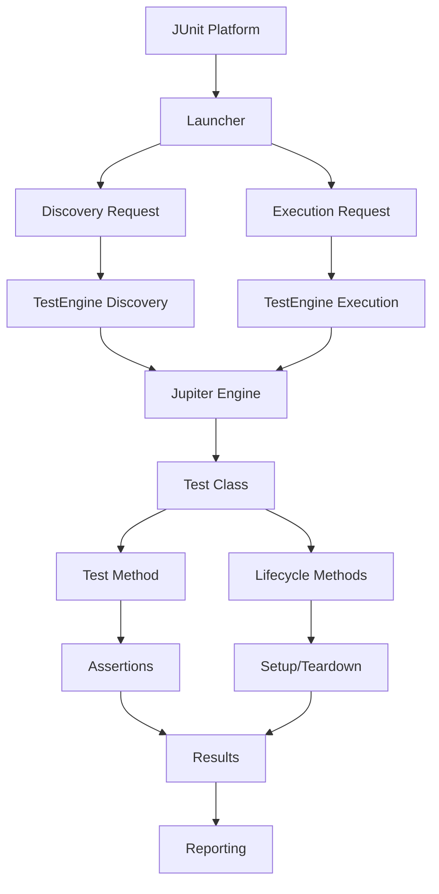

# 11.2 JUnit 5 Basics

## 1. Introduction

JUnit 5 is the latest major version of the most popular Java testing framework. It introduces a modular architecture, powerful new features, and modern Java capabilities. This module covers JUnit 5 annotations, assertions, lifecycle callbacks, and test organization.

## 2. Learning Objectives

- Master JUnit 5 annotations (@Test, @BeforeEach, @AfterEach, @BeforeAll, @AfterAll)
- Use assertions effectively with detailed messages
- Understand test lifecycle and execution order
- Organize tests with @DisplayName and @Nested
- Control test execution with @Disabled and @Enabled conditions

## 3. Prerequisites

- Java 17+ installed
- Basic understanding of testing concepts
- Maven or Gradle build tool
- IDE with JUnit support

## 4. Why This Concept Exists

JUnit 5 addresses limitations of JUnit 4 by providing:
- Modular architecture (JUnit Platform, Jupiter, Vintage)
- Modern Java features support
- Better extension model
- Improved assertions and assumptions
- Parameterized tests and nested test classes

## 5. Problem Statement

How do we write reliable, maintainable tests with proper setup/teardown, meaningful output, and flexible execution control?

## 6. Theory

### JUnit 5 Architecture

```
JUnit 5 = JUnit Platform + JUnit Jupiter + JUnit Vintage

JUnit Platform: Launches testing frameworks on JVM
JUnit Jupiter: New programming and extension model
JUnit Vintage: Backward compatibility with JUnit 3/4
```

### Core Annotations

| Annotation | Description |
|------------|-------------|
| `@Test` | Marks a method as a test |
| `@BeforeEach` | Runs before each test method |
| `@AfterEach` | Runs after each test method |
| `@BeforeAll` | Runs once before all tests in class |
| `@AfterAll` | Runs once after all tests in class |
| `@DisplayName` | Custom name for test display |
| `@Disabled` | Disable a test |
| `@Nested` | Group related tests |
| `@Tag` | Filter test execution |

### Assertion Methods

- `assertEquals(expected, actual)` - Value equality
- `assertNotEquals(expected, actual)` - Value inequality
- `assertTrue(condition)` - Boolean check
- `assertFalse(condition)` - Boolean negation
- `assertNull(object)` - Null check
- `assertNotNull(object)` - Not null check
- `assertThrows(exceptionClass, executable)` - Exception verification
- `assertAll(label, executables)` - Group assertions
- `assertIterableEquals(expected, actual)` - Collection comparison

## 7. Internal Working

1. **Test Discovery**: JUnit scans for `@Test` methods via reflection
2. **Test Execution**: Platform launcher executes tests via TestEngine API
3. **Lifecycle Management**: Framework manages setup/teardown callbacks
4. **Assertion Evaluation**: Assertions throw `AssertionError` on failure
5. **Result Reporting**: Results collected and formatted for output

## 8. JVM Perspective

- Tests run in the same JVM as production code
- No separate process for test execution
- Reflection used for test discovery (minimal overhead)
- Test classes loaded by same classloader
- Memory shared between tests (requires proper cleanup)

## 9. Memory Representation

```
JUnit 5 Execution Model:
┌────────────────────────────────┐
│        JUnit Platform          │
│  ┌──────────────────────────┐ │
│  │    TestEngine API        │ │
│  │  ┌────────────────────┐  │ │
│  │  │   Jupiter Engine   │  │ │
│  │  │  ┌──────────────┐  │  │ │
│  │  │  │ Test Class 1 │  │  │ │
│  │  │  │ Test Class 2 │  │  │ │
│  │  │  │ Test Class N │  │  │ │
│  │  │  └──────────────┘  │  │ │
│  │  └────────────────────┘  │ │
│  └──────────────────────────┘ │
│  ┌──────────────────────────┐ │
│  │   Launcher Discovery     │ │
│  │   Launcher Execution     │ │
│  └──────────────────────────┘ │
└────────────────────────────────┘
```

## 10. Architecture Diagram



## 11. Flow Diagram


## 12. Syntax

```java
import org.junit.jupiter.api.*;
import static org.junit.jupiter.api.Assertions.*;

@DisplayName("Calculator Tests")
class CalculatorTest {
    
    @BeforeAll
    static void beforeAll() {
        System.out.println("Before All Tests");
    }
    
    @AfterAll
    static void afterAll() {
        System.out.println("After All Tests");
    }
    
    @BeforeEach
    void setUp() {
        System.out.println("Before Each Test");
    }
    
    @AfterEach
    void tearDown() {
        System.out.println("After Each Test");
    }
    
    @Test
    @DisplayName("Should add two numbers correctly")
    void shouldAddTwoNumbers() {
        Calculator calc = new Calculator();
        assertEquals(5, calc.add(2, 3));
    }
    
    @Test
    @Disabled("Not yet implemented")
    void notYetImplemented() {
        // TODO: Implement later
    }
    
    @Test
    void shouldVerifyException() {
        assertThrows(ArithmeticException.class, 
            () -> { int result = 1 / 0; });
    }
    
    @Nested
    @DisplayName("When using scientific functions")
    class ScientificTests {
        @Test
        void shouldCalculateSquareRoot() {
            assertEquals(2.0, Math.sqrt(4.0), 0.0001);
        }
    }
}
```

## 13. Easy Example

```java
import org.junit.jupiter.api.Test;
import static org.junit.jupiter.api.Assertions.*;

class StringTest {
    
    @Test
    void shouldConcatenateStrings() {
        // Arrange
        String first = "Hello";
        String second = "World";
        
        // Act
        String result = first + " " + second;
        
        // Assert
        assertEquals("Hello World", result);
    }
    
    @Test
    void shouldCheckStringLength() {
        // Arrange
        String text = "JUnit";
        
        // Act & Assert
        assertEquals(5, text.length());
    }
    
    @Test
    void shouldHandleNullString() {
        // Arrange
        String nullString = null;
        
        // Act & Assert
        assertNull(nullString);
        assertNotNull("Not null");
    }
}
```

## 14. Medium Example

```java
import org.junit.jupiter.api.*;
import java.util.List;
import static org.junit.jupiter.api.Assertions.*;

@DisplayName("Collection Operations Tests")
class CollectionTest {
    
    private List<String> fruits;
    
    @BeforeEach
    void setUp() {
        fruits = List.of("Apple", "Banana", "Cherry", "Date");
    }
    
    @Test
    @DisplayName("Should contain all fruits")
    void shouldContainAllFruits() {
        // Assert multiple conditions
        assertAll("Fruit checks",
            () -> assertEquals(4, fruits.size()),
            () -> assertTrue(fruits.contains("Apple")),
            () -> assertTrue(fruits.contains("Banana")),
            () -> assertTrue(fruits.contains("Cherry")),
            () -> assertTrue(fruits.contains("Date"))
        );
    }
    
    @Test
    @DisplayName("Should find fruit starting with specific letter")
    void shouldFindFruitStartingWith() {
        // Arrange
        String prefix = "B";
        
        // Act
        List<String> result = fruits.stream()
            .filter(f -> f.startsWith(prefix))
            .toList();
        
        // Assert
        assertEquals(1, result.size());
        assertEquals("Banana", result.get(0));
    }
    
    @Test
    @DisplayName("Should throw exception for invalid index")
    void shouldThrowExceptionForInvalidIndex() {
        // Act & Assert
        IndexOutOfBoundsException exception = 
            assertThrows(IndexOutOfBoundsException.class, 
                () -> fruits.get(10));
        
        assertTrue(exception.getMessage().contains("10"));
    }
}
```

## 15. Hard Example

```java
import org.junit.jupiter.api.*;
import java.util.concurrent.*;
import java.util.concurrent.atomic.AtomicInteger;
import static org.junit.jupiter.api.Assertions.*;

@DisplayName("Complex Lifecycle Tests")
class LifecycleTest {
    
    private static final AtomicInteger counter = new AtomicInteger(0);
    private static ExecutorService executor;
    private String testName;
    
    @BeforeAll
    static void initAll() {
        executor = Executors.newFixedThreadPool(3);
        System.out.println("Global setup - initialized shared resources");
    }
    
    @AfterAll
    static void cleanupAll() {
        executor.shutdown();
        System.out.println("Global cleanup - resources released");
    }
    
    @BeforeEach
    void setUp(TestInfo testInfo) {
        testName = testInfo.getDisplayName();
        counter.incrementAndGet();
        System.out.println("Setting up: " + testName);
    }
    
    @AfterEach
    void tearDown(TestInfo testInfo) {
        System.out.println("Tearing down: " + testInfo.getDisplayName());
    }
    
    @Test
    @DisplayName("Should execute concurrently")
    void shouldExecuteConcurrently() throws Exception {
        // Arrange
        int tasks = 10;
        AtomicInteger successCount = new AtomicInteger(0);
        
        // Act
        List<Future<Boolean>> futures = new ArrayList<>();
        for (int i = 0; i < tasks; i++) {
            futures.add(executor.submit(() -> {
                successCount.incrementAndGet();
                return true;
            }));
        }
        
        // Wait for all tasks
        for (Future<Boolean> future : futures) {
            assertTrue(future.get(5, TimeUnit.SECONDS));
        }
        
        // Assert
        assertEquals(tasks, successCount.get());
    }
    
    @Test
    @DisabledIf("isEvenCounter")
    @DisplayName("Should skip when counter is even")
    void shouldSkipWhenEven() {
        // This test runs only when counter is odd
        assertTrue(counter.get() % 2 != 0);
    }
    
    private boolean isEvenCounter() {
        return counter.get() % 2 == 0;
    }
    
    @Nested
    @DisplayName("Nested Test Group")
    class NestedTests {
        
        @Test
        @DisplayName("Should run inside nested class")
        void shouldRunInsideNested() {
            assertNotNull(testName);
        }
    }
}
```

## 16. Enterprise Example

```java
import org.junit.jupiter.api.*;
import org.junit.jupiter.api.condition.*;
import java.time.Duration;
import java.util.concurrent.TimeUnit;
import static org.junit.jupiter.api.Assertions.*;

@DisplayName("Enterprise Test Suite")
@TestMethodOrder(MethodOrderer.OrderAnnotation.class)
class EnterpriseTestSuite {
    
    @Test
    @Order(1)
    @DisplayName("Critical path - must run first")
    void criticalPath() {
        // Critical test that must pass
        assertTrue(true);
    }
    
    @Test
    @Order(2)
    @DisabledOnOs(OS.WINDOWS)
    @DisplayName("Unix-only test")
    void unixOnlyTest() {
        // This test only runs on Unix/Mac
        String os = System.getProperty("os.name").toLowerCase();
        assertFalse(os.contains("windows"));
    }
    
    @Test
    @Order(3)
    @EnabledIfEnvironmentVariable(named = "CI", matches = "true")
    @DisplayName("CI-only test")
    void ciOnlyTest() {
        // This test only runs in CI environment
        assertNotNull(System.getenv("CI"));
    }
    
    @Test
    @Order(4)
    @Timeout(value = 5, unit = TimeUnit.SECONDS)
    @DisplayName("Must complete within 5 seconds")
    void mustCompleteWithinTimeout() {
        // Test with timeout
        try {
            TimeUnit.MILLISECONDS.sleep(100);
        } catch (InterruptedException e) {
            Thread.currentThread().interrupt();
        }
    }
    
    @Test
    @Order(5)
    @DisplayName("Should verify exception with message")
    void shouldVerifyExceptionMessage() {
        // Act & Assert
        IllegalArgumentException exception = 
            assertThrows(IllegalArgumentException.class, 
                () -> validateInput(""));
        
        assertEquals("Input cannot be empty", exception.getMessage());
    }
    
    private void validateInput(String input) {
        if (input == null || input.isEmpty()) {
            throw new IllegalArgumentException("Input cannot be empty");
        }
    }
}
```

## 17. Performance

| Feature | Impact | Optimization |
|---------|--------|--------------|
| Reflection | Minimal | Use @BeforeAll for expensive setup |
| Assertion | Low | Use assertAll for grouped checks |
| Nested Tests | Low | Organize logically, avoid deep nesting |
| Test Discovery | Fast | Use tags to filter execution |

**Performance Tips:**
- Use `@BeforeAll` for expensive one-time setup
- Avoid heavy operations in `@BeforeEach`
- Use tags to run subsets of tests
- Parallelize independent tests

## 18. Time & Space Complexity

| Operation | Time | Space |
|-----------|------|-------|
| Test Discovery | O(n) | O(n) |
| Lifecycle Callbacks | O(1) per test | O(1) |
| Assertions | O(1) | O(1) |
| Nested Class Creation | O(1) | O(m) |

Where: n = number of tests, m = nested test depth

## 19. Thread Safety

- JUnit 5 supports parallel test execution
- Tests must be thread-safe or isolated
- Use `@ResourceLock` for shared resources
- Static fields require synchronization
- Instance fields are per-test (safe by default)

```java
@Test
@ResourceLock(value = "sharedResource", mode = READ_WRITE)
void threadSafeTest() {
    // Access shared resource safely
}
```

## 20. Best Practices

1. **Use descriptive @DisplayName** for readable test output
2. **Organize tests with @Nested** for related scenarios
3. **Use @BeforeEach** for common setup, not @BeforeAll
4. **Prefer assertAll** for grouped assertions
5. **Use tags** to categorize and filter tests
6. **Set timeouts** for tests with external dependencies
7. **Use assumptions** to skip tests based on environment
8. **Order tests** logically with @Order when needed
9. **Clean up resources** in @AfterEach or @AfterAll
10. **Use TestInfo** for dynamic test information

## 21. Common Mistakes

1. **Using @BeforeAll for instance setup** - Must be static
2. **Forgetting static modifier** on @BeforeAll/@AfterAll
3. **Over-nesting tests** - Hard to read and maintain
4. **Not using assertions** - Tests that don't verify
5. **Ignoring exceptions** - Missing assertThrows
6. **Hardcoded timeouts** - Should be configurable
7. **Shared mutable state** between tests
8. **Not cleaning up resources** - Resource leaks
9. **Overly complex setup** - Tests should be self-contained
10. **Missing @DisplayName** - Less readable output

## 22. Pitfalls

- **Test order dependency** - Tests relying on execution order
- **Flaky timing tests** - Using Thread.sleep instead of assertions
- **Over-mocking** - Mocking everything makes tests brittle
- **Ignoring cleanup** - Leaving resources open
- **Conditional test skipping** - Overusing @Disabled
- **Test pollution** - State leaking between tests

## 23. Debugging Tips

1. **Use @DisplayName** to identify failing tests quickly
2. **Check lifecycle execution** with print statements
3. **Verify test order** with @TestMethodOrder
4. **Use assertions with messages** for clarity
5. **Enable verbose output** in test configuration
6. **Check assumptions** for skipped tests
7. **Verify exception types** and messages

## 24. Comparison Table

| Feature | JUnit 4 | JUnit 5 |
|---------|---------|---------|
| Annotations | @Before/@After | @BeforeEach/@AfterEach |
| Nested Tests | Not supported | @Nested support |
| Parameterized | Separate library | Built-in |
| Extensions | RunRules | Extension model |
| Display Names | Limited | @DisplayName |
| Conditions | @Ignore | @Disabled/@Enabled |

## 25. Decision Tree

```
When to use JUnit 5 features?
│
├─ Need test organization?
│  └─ Use @Nested and @DisplayName
│
├─ Need setup/teardown?
│  ├─ Once per class → @BeforeAll/@AfterAll
│  └─ Per test → @BeforeEach/@AfterEach
│
├─ Need conditional execution?
│  └─ Use @Disabled/@Enabled* annotations
│
├─ Need to group assertions?
│  └─ Use assertAll()
│
└─ Need exception testing?
   └─ Use assertThrows()
```

## 26. Interview Questions

1. **What are the main differences between JUnit 4 and JUnit 5?**
   - Answer: JUnit 5 has modular architecture, nested tests, better extensions, parameterized tests, and modern Java support.

2. **Explain the difference between @BeforeAll and @BeforeEach.**
   - Answer: @BeforeAll runs once before all tests (must be static); @BeforeEach runs before each test method.

3. **How do you test for exceptions in JUnit 5?**
   - Answer: Use assertThrows(exceptionClass, executable) which returns the exception for further verification.

4. **What is the purpose of @DisplayName?**
   - Answer: Provides human-readable names for tests that appear in reports and IDE output.

5. **How do you skip a test in JUnit 5?**
   - Answer: Use @Disabled annotation with optional reason, or @DisabledOnOs/@DisabledIf for conditional skipping.

6. **What is assertAll() used for?**
   - Answer: Groups multiple assertions so all execute even if some fail, providing comprehensive failure reports.

7. **Can @BeforeAll methods be instance methods?**
   - Answer: No, they must be static unless using @TestInstance(Lifecycle.PER_CLASS).

8. **How do you control test execution order?**
   - Answer: Use @TestMethodOrder with @Order annotations, or implement custom ordering.

9. **What is the difference between @Disabled and @EnabledIf?**
   - Answer: @Disabled always skips; @EnabledIf conditionally skips based on expressions or methods.

10. **How do you run tests in parallel?**
    - Answer: Configure junit.jupiter.execution.parallel.enabled=true and set parallel configuration.

11. **What is TestInfo and how is it used?**
    - Answer: TestInfo provides test metadata (display name, tags, method) injectable into lifecycle methods.

12. **How do you test timeout scenarios?**
    - Answer: Use @Timeout annotation or assertTimeout() assertions.

13. **What are nested tests and when should you use them?**
    - Answer: @Nested classes group related tests; use for logical organization of test scenarios.

14. **How do you verify multiple assertions without stopping at first failure?**
    - Answer: Use assertAll() to execute all assertions and report all failures together.

15. **What is the role of the JUnit Platform?**
    - Answer: It discovers and executes tests on the JVM, supporting multiple test frameworks via engines.

## 27. Exercises

### Beginner

1. **Basic Annotations**
   - Create a test class with @BeforeEach and @AfterEach
   - Verify setup runs before each test and teardown after
   - Use @DisplayName to describe each test

2. **Assertion Practice**
   - Write tests using assertEquals, assertTrue, assertFalse, assertNull, assertNotNull
   - Include messages in assertions for clarity

### Intermediate

3. **Nested Test Organization**
   - Create a Calculator class with add, subtract, multiply, divide
   - Write nested tests grouping positive, negative, and edge cases
   - Use @DisplayName for each group

4. **Exception and Timeout Testing**
   - Test division by zero with assertThrows
   - Test method timeout with @Timeout
   - Verify exception messages

### Advanced

5. **Conditional Execution**
   - Write tests that only run on specific OS
   - Write tests that only run in CI environment
   - Use assumptions to skip based on configuration

6. **Test Ordering and Parallelism**
   - Create ordered test suite with @Order
   - Configure parallel execution
   - Verify thread safety with shared resources

## 28. Summary

JUnit 5 provides a modern, flexible testing framework with powerful features for organizing, executing, and reporting tests. Mastering annotations, assertions, and lifecycle management is essential for writing effective Java tests.

## 29. References

- JUnit 5 User Guide: https://junit.org/junit5/docs/current/user-guide/
- JUnit 5 Examples: https://github.com/junit-team/junit5-samples
- Baeldung JUnit 5 Tutorial: https://www.baeldung.com/junit-5
- JUnit 5 Annotation Reference: https://junit.org/junit5/docs/current/api/
